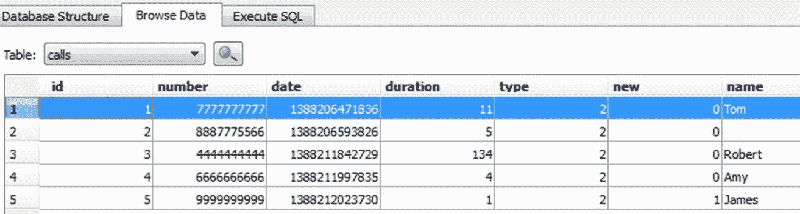
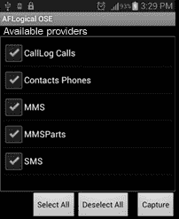

# 第十章：Android 数据提取技术

使用第八章中解释的任何屏幕锁绕过技术，*Android 取证设置和数据提取前的技巧*，检查员可以尝试访问被锁定的设备。一旦设备可访问，下一步是提取设备上的信息。可以通过应用各种数据提取技术来实现这一目标。

本章将帮助你识别 Android 设备上敏感位置，并解释可以应用于设备的各种逻辑和物理提取技术，以提取必要的信息。

本章将涵盖以下主题：

+   理解数据提取技术

+   手动数据提取

+   逻辑数据提取

+   物理数据提取，包括对 Android 设备和 SD 卡进行成像、JTAG 和芯片拆卸技术

# 理解数据提取技术

存储在 Android 设备上的数据可能是民事、刑事或企业公司内部调查的一部分。在处理涉及 Android 设备的调查时，作为取证检查员，你需要注意在取证过程中需要处理的问题；这包括确定是否允许 root 访问（通过同意或法律授权），以及在调查过程中可以提取和分析哪些数据。例如，在涉及跟踪的刑事案件中，法院可能只允许提取和分析嫌疑人 Android 设备上的短信、通话记录和照片。在这种情况下，最合理的做法可能是逻辑提取仅这些特定项目。然而，最好是从设备中获取完整的物理数据提取，并仅检查法院允许的区域。你永远无法预料调查会引导到哪里，因此最好是立即从设备中提取尽可能多的数据，而不是等到同意范围发生变化后才后悔没有获取完整的镜像。Android 设备的数据提取技术可以分为三种类型：

+   手动数据提取

+   逻辑数据提取

+   物理数据提取

如第一章《*移动取证介绍*》中所述，手动提取是指通过正常浏览设备并捕获任何有价值的信息，而逻辑提取是指访问文件系统，物理提取则是提取设备的逐位镜像。每种类型的提取方法将在以下章节中详细描述。

某些方法可能需要对设备进行 root 权限才能完全访问数据。每种方法的含义不同，它们的成功率将取决于所使用的工具和方法，以及设备的品牌和型号。

# 手动数据提取

这种提取方法涉及你利用移动设备的正常用户界面来访问设备内存中的内容。你将通过访问不同的菜单来正常浏览设备，查看如通话记录、短信和即时消息聊天等详细信息。每个屏幕的内容通过拍照捕捉，并可以作为证据呈现。

这种类型检查的主要缺点是只能检查操作系统（UI 模式）下可以访问的文件。在手动检查设备时必须小心，因为很容易按错按钮并删除或添加数据。手动提取应该作为最后的手段，用于验证通过其他方法提取的发现。在某些情况下，你可能需要将手动检查作为第一步。这可能包括生死攸关的紧急情况或失踪人员案件，在这些情况下，快速扫描设备可能会帮助警方找到该个人。

# 逻辑数据提取

逻辑数据提取技术通过与操作系统交互并访问文件系统来提取设备上的数据。这些技术非常重要，因为它们提供了有价值的数据，适用于大多数设备，并且易于使用。再次强调，提取数据时，root 概念就会浮现。逻辑技术实际上并不要求获得 root 权限来进行数据提取。然而，设备上的 root 权限使你能够访问设备上所有的文件。这意味着某些数据可能在没有 root 的设备上提取，而 root 权限则会打开设备并提供对设备上所有文件的访问。因此，拥有设备的 root 权限将极大地影响可以通过逻辑技术提取的数据的数量和种类。以下部分将解释可以用于从 Android 设备中逻辑提取数据的各种技术。

# ADB 数据提取

如前所述，`adb`是一个命令行工具，帮助你与设备进行通信以检索信息。通过`adb`，你可以提取设备上所有文件的数据，或者仅提取你感兴趣的相关文件。这是逻辑提取中最广泛使用的技术。

要通过`adb`访问 Android 设备，必须启用 USB 调试选项。从 Android 4.2.2 开始，由于安全的 USB 调试，连接到设备的主机也需要进行授权。如果设备已锁定且未启用 USB 调试，请尝试使用第八章中解释的技术绕过屏幕锁，*Android 取证设置与数据提取前技术*。

作为取证检查员，了解数据在 Android 设备上的存储方式，以及了解重要和敏感信息的存储位置非常重要，以便能够相应地提取数据。应用程序数据通常包含大量可能与调查相关的用户数据。所有与感兴趣的应用程序相关的文件都应检查其相关性，正如在第十章，*Android 数据分析与恢复*中所解释的那样。应用程序数据可以存储在以下位置之一：

+   **共享偏好设置**：以键值对的形式，以轻量级的 XML 格式存储数据。共享偏好设置文件存储在应用程序 `/data` 目录下的 `shared_pref` 文件夹中。

+   **内部存储**：用于存储私密数据，保存在设备的内部存储中。保存到内部存储的文件是私有的，无法被其他应用程序访问。

+   **外部存储**：用于存储设备外部存储中的公共数据，通常不强制实施安全机制。这些数据可在 `/sdcard` 目录下找到。

+   **SQLite 数据库**：这些数据存储在 `/data/data/PackageName/` 数据库中。通常以 `.db` 文件扩展名存储。可以使用 SQLite 浏览器（[`sourceforge.net/projects/sqlitebrowser/`](https://sourceforge.net/projects/sqlitebrowser/)）或通过执行必要的 SQLite 命令在相应的文件上查看 SQLite 文件中的数据。

每个 Android 应用程序都会使用上述一种或多种数据存储选项在设备上存储数据。因此，通讯录应用程序会将有关联系人详细信息的所有信息存储在其包名下的 `/data/data` 文件夹中。请注意，`/data/data` 是设备内部存储的一部分，所有应用程序通常都安装在此位置。某些应用程序数据会存储在 SD 卡和 `/data/data` 分区中。通过使用 `adb`，我们可以通过 `adb pull` 命令提取此分区中的数据进行进一步分析。再次强调，这个目录只有在设备已经 root 的情况下才能访问。

在 Android 7.0（Nougat）中，推出了一种名为设备加密存储的新存储类型，允许应用程序将某些类型的数据存储在该存储中。因此，您将注意到在 `/data` 文件夹下出现了新的文件路径，如 `misc_de`、`misc_ce`、`system_de` 和 `system_ce`。从取证角度来看，这是一个非常重要的变化，因为这也意味着，在运行 Android Nougat 的设备上，`/data/data` *不是*唯一存储工件的位置，例如，

旧设备上的 SMS 数据位置：`/data/com.android.providers.telephony/databases/smsmms.db`，以及 Nougat 设备上的 SMS 数据位置：`/user_de/0/com.android.providers.telephony/databases/smsmms.db`。

在 root 手机上，可以执行`adb pull`命令从 Dropbox 应用的`databases`文件夹中提取数据，命令如下：


adb pull 命令

同样地，在 root 手机上，可以以这种方式提取整个`/data`文件夹。如下所示，可以将 Android 设备上完整的`/data`目录复制到本地机器目录中。整个`data`目录在 97 秒内提取完成。提取时间会根据`/data`文件夹中存储的数据量有所不同：


提取到法证工作站的`/data`目录

在非 root 设备上，执行`pull`命令从`/data`目录提取文件不会成功，如下所示，因为 shell 用户没有权限访问这些文件：


在非 root 设备上执行 ADB pull 命令

通过前述过程从 root 手机复制的数据保持其目录结构，从而允许调查人员浏览必要的文件以访问信息。通过分析相应应用程序的数据，法证专家可以收集关键信息，这些信息可能会影响调查结果。请注意，在法证工作站本地查看文件夹会改变内容的日期和时间。因此，你应该保留原始输出的副本，以便进行日期/时间比较。

# 使用 SQLite 浏览器查看数据

SQLite 浏览器是一个可以帮助分析提取数据的工具。SQLite 浏览器允许你查看扩展名为`.sqlite`、`.sqlite3`、`.sqlitedb`、`.db`和`.db3`的数据库文件。使用 SQLite 浏览器的主要优势是它以表格形式展示数据。

转到“文件 | 打开数据库”以使用 SQLite 浏览器打开`.db`文件。如下所示，SQLite 浏览器有三个主要标签页：数据库结构、浏览数据和执行 SQL。浏览数据标签页允许你查看`.db`文件中不同表格的内容。

在我们的分析过程中，我们将主要使用这个标签页。或者，像 Oxygen Forensic SQLite Viewer 这样的工具也可以用于同样的目的。从数据库文件中恢复已删除的数据是可能的，并将在第十章中进行解释，*Android 数据分析* *与恢复*：


SQLite 浏览器

以下部分将重点介绍如何识别重要数据并手动从 Android 手机中提取各种细节。有关如何访问 Android 终端的内容，已在前面的章节中讲解。在接下来的部分中，我们将直接开始从中获取设备信息。

# 提取设备信息

了解你的 Android 设备的详细信息，如型号、版本等，将有助于你的调查。例如，当设备受到物理损坏，无法检查设备信息时，可以通过在`/system`文件夹下执行以下命令来获取设备的详细信息：

```
# cat build.prop
```

如下图所示：


build.prop 文件

提取设备信息后，我们将提取通话记录。

# 提取通话记录

在调查过程中，通常需要访问电话的通话记录以确认某些事件。关于通话记录的信息存储在`contacts2.db`文件中，该文件位于`/data/data/com.android.providers.contacts/databases/`。如前所述，提取到法证工作站本地文件夹后，可以使用 SQLite 浏览器查看该文件中存在的数据。接下来，看看如何通过以下步骤提取通话记录：

1.  如下图所示，通过使用`adb pull`命令，可以将必要的`.db`文件提取到法证工作站的文件夹中：


复制到本地文件夹的 contacts2.db 文件

1.  请注意，用于拨打电话的应用程序可以在各自的应用程序文件夹中存储通话记录详细信息。所有通讯应用程序都必须检查其通话记录，方法如下：

```
C:\android-sdk-windows\platform-tools>adb.exe pull
/data/data/com.android.providers.contacts C:temp 
```

这将产生以下输出：


1.  现在，使用 SQLite 浏览器打开`contacts2.db`文件（通过导航到 文件 | 打开数据库），并浏览不同表中存在的数据。`contacts2.db`文件中的 calls 表提供有关通话历史的信息。以下截图显示了通话历史，包括姓名、号码、时长和日期：



在运行 Android 7.0（Nougat）的设备上，通话记录数据已被移出`contacts2.db`文件。在这些设备上，通话记录数据可以在`/data/com.android.providers.contacts/databases/calllog.db`中访问

# 提取 SMS/MMS

在调查过程中，可能会被要求检索某个移动设备发送和接收的短信。因此，了解这些信息的存储位置以及如何访问数据非常重要。`mmssms.db`文件位于`/data/data/com.android.providers.telephony/databases`，其中包含必要的详细信息。与通话记录一样，必须确保能够发送消息的应用程序被检查，以获取相关的消息日志，方法是使用以下命令：

```
adb.exe pull /data/data/com.android.providers.telephony C:\temp
```

这将产生以下输出：


提取 SMS 数据

电话号码可以在地址列下看到，相关的短信内容可以在正文列下看到，如下图所示：


contacts2.db 文件中的 calls 表

我们现在将提取浏览器历史记录信息。

# 提取浏览器历史记录信息

提取浏览器历史记录信息是法医检查员常常需要执行的一项任务。除了默认的 Android 浏览器，Android 手机上还可以使用不同的浏览器应用程序，例如 Firefox Mobile 和 Google Chrome。所有这些浏览器都会将浏览器历史记录以 SQLite `.db`格式存储。以我们的示例为例，我们从默认的 Android 浏览器将数据提取到我们的法医工作站。该数据位于`/data/data/com.android.browser`。名为`browser2.db`的文件包含浏览器历史记录详细信息。以下截图显示了浏览器数据，如 Oxygen Forensic SQLite Viewer 所呈现的。请注意，试用版将隐藏某些信息：


Oxygen Forensic SQLite Viewer 中的 browser2.db 文件

请注意，如果使用浏览器的隐身模式，前述行为可能会发生变化。

如果使用浏览器的隐身模式，前面章节中提到的几个细节将不会存储在设备上。接下来，我们将分析社交网络和即时通讯聊天记录。

# 社交网络/即时通讯聊天记录分析

社交网络和即时通讯应用程序（如 Facebook、Twitter 和 WhatsApp）透露的敏感数据可能对案件调查有帮助。分析过程与其他 Android 应用程序相似。将数据下载到法医工作站，分析`.db`文件，查看是否能够挖掘到任何敏感信息。例如，让我们来看一下 Facebook 应用程序，尝试查看可以提取哪些数据。

首先，我们提取`/data/data/com.facebook.katana`文件夹，并进入`databases`文件夹。该文件夹下的`fb.db`文件包含与用户账户相关的信息。`friends_data`表包含用户朋友的姓名、电话号码、电子邮件地址和出生日期等信息，如下图所示。类似地，可以分析其他文件，以查看是否能够提取到任何敏感信息：


SQLite 浏览器中的 fb.db 文件

同样，通过分析`/data/data`文件夹中的数据，可以获取关于地理位置、日历事件、用户笔记等信息。

# ADB 备份提取

从 Android 4.0 开始，谷歌实现了`adb backup`功能，允许用户使用`adb`工具将应用程序数据备份到计算机中。此过程不需要 root 权限，因此在取证过程中非常有用。主要的缺点是它不能备份设备上安装的所有应用程序。备份功能是应用程序依赖的，因为应用程序的所有者可以选择是否允许备份。默认情况下，允许备份，但开发者如果愿意可以禁用此功能。因此，大多数第三方应用程序都启用了此功能，`adb backup`命令也适用于这些应用程序。以下是`adb backup`命令的语法：

```
adb backup [-f <file>] [-apk|-noapk] [-shared|-noshared] [-all] [-system|nosystem] [<packages...>]
```

让我们详细讨论一下：

+   `-f`：用于选择备份文件的存储位置。如果未指定，默认将备份文件存储为当前工作目录中的`backup.ab`。

+   `[-apk|noapk]`：用于选择是否备份`.apk`文件。默认值为`-noapk`。

+   `[-obb|-noobb]`：用于选择是否备份`.obb`（APK 扩展）文件。默认为`-noobb`。

+   `[-shared|-noshared]`：用于选择是否备份来自共享存储和 SD 卡的数据。默认值为`-noshared`。

+   `[-all]`：包含所有启用了备份的应用程序。

+   `[-system|-nosystem]`：用于选择是否包括系统应用程序。默认为`-system`。

+   `[<packages>]`：用于列出要备份的特定包名。

一旦设备连接到工作站并且`adb`可以访问它，运行`adb backup -shared -all`命令，如下图所示：


adb 备份命令

一旦命令执行，用户需要在设备上批准权限，如下图所示。因此，如果设备处于屏幕锁定状态，将无法进行备份：


设备上的备份权限

Android 备份文件以`.ab`文件格式存储，默认情况下，它存储在 Android SDK 的`platform-tools`文件夹中。有一些免费的工具，例如 Android Backup Extractor，可以将`.ab`文件转换为`.tar`文件，从而可以查看。Android Backup Extractor 可以从[`sourceforge.net/projects/adbextractor/`](https://sourceforge.net/projects/adbextractor/)下载。该工具是一个基于 Java 的应用程序，因此在使用前请确保工作站上已安装 Java。要将备份文件转换为`.tar`格式，请执行以下命令：

```
java -jar abe.jar unpack backup.ab backup.tar
```

这将自动创建一个 `.tar` 扩展名的文件，之后可以使用诸如 WinRAR 或 7Zip 等归档工具轻松查看该文件。然而，请注意，如果在备份创建时设备上已输入密码，则该文件将被加密，因此，您需要在之前的命令中提供密码作为参数。备份文件包含两个主要文件夹——`apps` 和 `shared`。`apps` 文件夹包含所有备份中应用程序在 `/data/data` 下的信息。`shared` 文件夹包含 SD 卡上的所有数据。

# ADB dumpsys 提取

`adb dumpsys` 命令允许您收集关于系统上运行的服务和应用程序的信息。`adb shell dumpsys` 命令提供所有系统服务的诊断输出。执行 `dumpsys` 命令不需要 root 权限，只需启用 USB 调试，和其他任何 `adb` 命令一样。如下所示的截图，通过运行 `adb.exe shell service list` 命令，您可以查看可以与 `dumpsys` 一起使用的所有服务列表：


dumpsys 服务列表命令

在某些场景下，分析特定的 `dumpsys` 服务，如 Wi-Fi、用户和通知等，可能会非常有帮助。以下是一些在法医分析中运行 `dumpsys` 命令可能有用的有趣情况：

`dumpsys iphonesubinfo` 服务可用于获取设备 ID 或 IMEI 号码的信息，如下图所示：


显示 IMEI 号码的 dumpsys 命令

`dumpsys wifi` 服务提供关于用户访问的 Wi-Fi 点的信息。它显示已保存连接的 SSID。此信息可用于将用户定位到特定位置。以下是 `adb dumpsys` 命令，提供该信息：


显示最后连接 Wi-Fi 详情的 dumpsys 命令

`dumpsys usagestats` 服务提供关于最近使用的应用程序的信息，以及其使用日期。例如，以下截图显示，2016 年 2 月 1 日没有使用应用程序，但在 2016 年 1 月 31 日使用了 Google Chrome 浏览器，并尝试备份手机数据：


显示最近使用的应用程序的 dumpsys 命令

注意，对于 `Date 20160201, android: 0`，表示没有使用任何应用程序。但是对于 `Date: 20160131, android: 1 times`，确认使用了一个应用程序，后续章节提供了更多关于使用了哪个应用程序的细节等。根据正在调查的情况，取证分析师需要弄清楚任何 `dumpsys` 命令是否有用。在设备扣押后立即运行 `dumpsys` 命令可能会极大地帮助之后的工作。通过运行 `adb shell dumpsys` 命令，可以记录所有 `dumpsys` 服务信息。

# 使用内容提供者

在 Android 中，一般情况下，一个应用程序的数据不能被另一个应用程序访问。但是，Android 提供了一种机制，通过这种机制可以与其他应用程序共享数据。这正是通过内容提供者实现的。内容提供者以一个或多个表格的形式向外部应用程序呈现数据。这些表格与关系数据库中的表格没有什么不同。应用程序可以通过 URI 地址方案使用它们来共享数据。其他应用程序使用提供者客户端对象访问提供者。在应用程序安装期间，用户决定是否允许应用程序访问所请求的数据（内容提供者）。例如，联系人、短信/彩信和日历就是内容提供者的例子。

因此，利用这一点，我们可以创建一个应用程序，可以从所有可用的内容提供者中获取所有信息。这正是大多数商业取证工具的工作原理。这种方法的优点是可以在已获取 root 权限和未获取 root 权限的设备上使用。在我们的示例中，我们使用 AFLogical，它利用内容提供者机制来获取信息。这个工具提取数据并将其保存到 SD 卡中的 CSV 格式中。以下步骤使用 AFLogical 开源版 1.5.2 从 Android 设备中提取信息：

1.  从 [`github.com/nowsecure/android-forensics/downloads`](https://github.com/nowsecure/android-forensics/downloads) 下载 AFLogical OSE 1.5.2。

AFLogical LE 版本能够提取大量信息，并要求通过法律执法或政府机构的电子邮件地址进行注册。AFLogical OSE 可以提取所有可用的 MMS、SMS、联系人和通话日志。

1.  确保启用 USB 调试模式并将设备连接到工作站。

1.  通过执行 `adb.exe devices` 命令验证设备是否被识别：


识别已连接的设备

1.  将 AFLogical OSE 应用程序保存在主目录中，并执行 `adb.exe install AFLogical-OSE_1.5.2.apk` 命令将其安装到设备上：


安装 AFLogical 应用程序

1.  安装应用后，你可以直接从设备运行它，并点击应用底部的捕获按钮，如下图所示：



AFLogical OSE 应用

1.  应用开始从相应的内容提供者提取数据，一旦过程完成，系统将显示一条消息，如下图所示：


提取完成后显示的消息

1.  提取的数据被保存在设备的 SD 卡中的名为 `forensics` 的目录下。提取的信息以 CSV 文件的形式存储，如下图所示。CSV 文件可以使用任何编辑器查看：


使用 AFLogical OSE 提取的文件

1.  同一目录下的 `info.xml` 文件提供了设备的相关信息，包括 IMEI 号码、IMSI 号码、Android 版本、已安装应用的信息等。

然而，请注意，设备上必须允许安装第三方应用（通过选择“未知来源”选项）才能使其正常工作。其他可以在调查过程中帮助逻辑提取数据的工具将在第十一章中介绍，*Android 应用分析、恶意软件及逆向工程*。

本节介绍了各种逻辑采集技术。接下来我们将探讨物理数据提取技术。

# 物理数据提取

物理提取指的是获取设备的精确逐位图像的过程。需要理解的是，逐位图像与复制粘贴设备内容不同。如果我们复制粘贴设备的内容，它只会复制可见文件、隐藏文件和系统相关文件等。此方法被视为逻辑图像。通过这种方法，已删除的文件和无法访问的文件不会被 `copy` 命令复制。已删除的文件可以通过某些技术恢复（视情况而定），我们将在后续章节中看到。与逻辑提取不同，物理提取是设备内存的精确副本，包括更多的信息，如空闲空间和未分配空间。

通过物理技术提取 Android 数据通常使用 `dd` 命令，而其他高级技术如 JTAG 和芯片脱离技术也可用，但通常难以实施，并且需要极高的精度和经验才能在调查过程中对真实设备进行尝试。和其他任何技术一样，如果操作不当，设备上的数据可能会被破坏或无法恢复，从而使其在法庭上无法作为证据使用。JTAG 和芯片脱离技术将在后续章节中详细介绍。然而，使用 `dd` 命令提取数据需要 root 权限。以下章节概述了可以用来进行物理提取的各种技术。

# 对 Android 手机进行成像

获取设备镜像是移动设备取证中最重要的步骤之一。在可能的情况下，在对设备进行任何提取数据的操作之前，必须先获取 Android 设备的物理镜像。在取证中，这一过程通常被称为*设备成像*。物理镜像、取证镜像和原始镜像这几个术语通常用来指通过该过程获取的镜像。我们首先回顾一下如何在台式计算机上进行成像，因为这有助于我们关联并理解在成像 Android 设备时遇到的问题。假设从嫌疑人处扣押了一台未开机的台式计算机，并送去进行取证检查。在这种情况下，典型的取证检查员会拆下硬盘，将其连接到写保护器，并使用可用的工具获取逐位的取证镜像。然后，在数据取证成像的过程中，原始硬盘将被安全保护。

对于 Android 设备，所有包含数据的区域无法轻易移除。此外，如果在接收到设备进行检查时其仍处于活动状态，那么无法在不对设备做出任何更改的情况下进行分析，因为任何交互都会改变设备的状态。

一个 Android 设备可能有两个文件存储区域：内部存储和外部存储。内部存储是指内置的非易失性存储器。外部存储是指可移动的存储介质，例如 micro SD 卡。然而，需要注意的是，一些设备没有可移动的存储介质，如 SD 卡，但它们会将可用的永久存储空间分为内部存储和外部存储。因此，外部存储并不总是可拆卸的。当存在可移动的 SD 卡时，必须获取该内存卡的法医镜像。如在第七章《理解 Android》中所讨论，这些可移动卡通常使用 FAT32 文件系统进行格式化。一些移动设备获取方法会通过 Android 设备获取 SD 卡。尽管这种方法有用，但由于 USB 手机数据线的速度限制，过程会较慢。

默认情况下，Android 系统不提供访问内部目录和系统相关文件的权限。这种受限访问是为了确保设备的安全。例如，`/data/data`文件夹在未 root 的设备上是无法访问的。这个文件夹对我们尤其重要，因为它存储了大部分用户创建的数据，许多应用程序也会将宝贵的数据写入此文件夹。因此，为了获取设备的镜像，我们需要对 Android 设备进行 root 操作。root 设备可以赋予我们超级用户权限，访问所有数据。需要注意的是，本书一直强调，所有操作都应具有法医科学的依据，并尽量避免修改设备。root 一个 Android 设备会对其进行更改，因此应在你未曾调查过的设备上进行测试。root 操作在 Android 设备中是常见的，但获取 root 权限可能会导致设备被改变，甚至更糟的是，数据被清除。一些 Android 设备，如 Nexus 4 和 5，可能会在允许 root 权限之前强制清除数据分区。这意味着不需要对设备进行 root 操作来获取访问权限，因为在此过程中所有用户数据都会丢失。只需记住，虽然 root 操作可以提供更多数据访问权限，但它也可能清除数据或破坏手机。因此，在继续进行 root 操作之前，必须确保你获得了相应的同意或法律权利。由于 root 技术在第八章《Android 法医设置与数据提取前的技术》中已有讨论，我们将假设设备已经 root，继续进行示例操作。

以下是获取 root 过的 Android 设备法医镜像的逐步过程：

1.  将安卓设备连接到工作站，并通过执行`adb devices`命令来验证设备是否已被识别，如下所示：


识别已连接的设备

1.  一旦`adb`访问准备好，可以通过以下步骤从 Android 设备获取分区信息：

    +   **使用** `dd` **命令**：`dd` 命令可以用来创建设备的原始镜像。此命令通过复制低级数据，帮助我们逐位创建 Android 设备的镜像。

    +   **插入新 SD 卡**：将一张新的 SD 卡插入设备，以将镜像文件复制到此卡中。确保该 SD 卡已被清空，不包含任何其他数据。你还可能需要验证驱动器上没有额外的数据。

    +   **执行命令**：Android 设备的文件系统存储在`/dev`分区内的不同位置。对三星 Galaxy S3 手机执行简单的`mount`命令返回以下输出：


Android 设备上的 mount 命令输出

1.  从前面的输出中，我们可以识别出`/system`、`/data` 和`/cache` 分区挂载的位置。虽然成像所有文件很重要，但大部分数据都存在于`/data`和`/system`分区。当时间允许时，应获取所有分区以确保完整性。一旦完成，执行以下命令来创建设备的镜像：

```
dd if=/dev/block/mmcblk0p12 of=/sdcard/tmp.image
```

在前面的示例中，使用了三星 Galaxy S3 的数据分区（其中`if`是输入文件，`of`是输出文件）。

上述命令将创建`mmcblk0p12`文件（数据分区）的逐位镜像，并将镜像文件复制到 SD 卡。一旦完成，可以使用可用的取证软件分析`dd`镜像文件。

你必须确保 SD 卡有足够的存储空间来容纳数据分区镜像。对于 root 设备，还可以使用其他方法获取数据。

如果无法将镜像直接写入 SD 卡，可以使用`netcat`命令将输出直接写入计算机。`netcat` 工具是一个基于 Linux 的工具，用于通过网络连接传输数据。Android 设备通常没有预装`netcat`。让我们在接下来的步骤中看看如何使用此命令：

1.  要检查是否安装了`netcat`，只需打开 ADB shell 并输入`nc`。如果提示找不到 nc，则需要手动在设备上安装`netcat`。你可以在[`sourceforge.net/projects/androidforensics-netcat/files/`](https://sourceforge.net/projects/androidforensics-netcat/files/)下载为 Android 编译的`netcat`。

1.  使用以下命令将`netcat`推送到设备：

```
adb push nc /dev/Case_Folder/nc
```

该命令应在`/dev`目录下创建`Case_Folder`，并将`nc`放入其中。

1.  现在，我们需要授权 ADB shell 执行此操作。可以按如下方式进行：

```
chomd +x /dev/Case_Folder/nc
```

1.  打开两个终端窗口，其中一个窗口中打开 ADB shell，另一个窗口用于监听设备发送的数据。现在，我们需要从计算机启用 ADB 端口转发：

```
adb forward tcp:9999 tcp:9999
```

`9999`是我们为`netcat`选择的端口；它可以是 Linux 或 Mac 系统中`1023`和`65535`之间的任何任意端口号（`1023`及以下端口保留给系统进程，且需要 root 权限才能使用）。在另一个终端窗口中，运行以下命令：

```
nc 127.0.0.1 9999 > data_partition.img
```

`data_partition.img`文件现在应已在计算机的当前目录中创建。当数据传输完成时，`netcat`将在两个终端中终止并返回命令提示符。根据镜像大小，过程可能需要较长时间。

# 镜像存储卡（SD 卡）

有许多工具可以对存储卡进行镜像。以下示例使用`WinHex`来创建 SD 卡的原始磁盘镜像。以下是使用 WinHex 对存储卡进行镜像的逐步过程：

1.  **连接存储卡**：从存储插槽中取出 SD 卡，并使用卡读卡器将存储卡连接到取证工作站。

1.  **写保护卡**：使用 WinHex 打开磁盘。导航至选项 | 编辑模式，并选择只读模式（=写保护模式），如下截图所示。这是为了确保设备是写保护的，无法在其上写入数据：


WinHex 的编辑模式视图（左）和启用只读模式的视图（右）

1.  **计算哈希值**：计算存储卡的哈希值，以确保在整个调查过程中没有任何修改。导航至工具 | 计算哈希并选择任何哈希算法。

1.  **创建磁盘镜像**：导航至文件 | 创建磁盘镜像，如下截图所示。选择原始镜像选项（`.dd`）来创建镜像。这完成了存储卡的镜像：


WinHex 磁盘镜像选项

一旦通过前述方法获取了取证镜像，就需要对其进行分析以提取相关信息。市面上有几款商业工具，如 Cellebrite 和 XRY，可以分析镜像文件。Android 镜像的分析将在第十章《Android 数据分析与恢复》中详细介绍。

# 联合测试行动组

**联合测试行动组**（**JTAG**）涉及使用高级数据采集方法，通过连接设备的特定端口并指示处理器转移设备上存储的数据。通过这种方法，可以获取设备的完整物理镜像。通常建议首先尝试前述其他技术，因为它们实施简单且需要的努力较少。在尝试 JTAG 之前，分析人员必须具备经验并经过适当培训，因为如果操作不当，设备可能会受到损坏。

JTAG 过程通常包括以下取证步骤：

1.  在 JTAG 中，设备的 **测试访问端口**（**TAPs**）用于访问设备的 CPU。识别 TAPs 是最主要也是最重要的步骤。通过识别 TAPs，并追踪连接到 CPU 的线路，可以找出每个功能对应的焊盘。尽管设备制造商会提供关于特定设备 JTAG 原理图的文档，但这些文档并未公开发布供大家查看。关于 Android 设备 JTAG 的一个很好的网站是 [`forensicswiki.xyz/wiki/index.php?title=JTAG_Forensics`](https://forensicswiki.xyz/wiki/index.php?title=JTAG_Forensics)。

1.  然后，将引线焊接到适当的连接器引脚上，另一端连接到可以控制 CPU 的设备，如下图所示（由 Jim Swauger 在 [`www.binaryintel.com/services/jtag-chip-off-forensics/jtag-forensics/`](http://www.binaryintel.com/services/jtag-chip-off-forensics/jtag-forensics/) 发布）。对于某些设备，可以使用 JTAG 工具板来避免焊接。使用工具板或 JTAG 适配器可以避免焊接，因为它可以将 TAPs 连接到 CPU：


JTAG 设置

+   完成前述步骤后，必须施加电源以启动 CPU。施加的电压应根据硬件制造商发布的规格来决定。请勿施加超过规格中给定数值的电压。

+   在施加电源后，可以提取 NAND 闪存的完整二进制内存转储。

+   使用本书中学习到的取证技术和工具分析提取的数据。在采集过程中将得到一个原始的 `.bin` 文件；大多数取证工具支持此图像格式的导入和分析。

JTAG 听起来可能很复杂（也许确实是），但它有许多有用的用途，下面列出了三项优点：

+   这种技术的主要优点是，即使设备没有开机，它也能正常工作。

+   它不需要 root 权限、ADB 或 USB 调试。

+   该技术可用于恢复设备的 PIN 码/密码，因此可以对整个闪存进行成像，并恢复/破解密码文件。

还需要理解的是，JTAG 技术不应导致设备功能丧失。如果设备重新组装正确，它应该能够正常运行。尽管 JTAG 技术在提取数据时非常有效，但只有经验丰富且具备资质的人员才能尝试。任何在焊接 JTAG 焊盘或施加错误电压时的失误，都可能严重损坏设备。

# 芯片拆卸技术

正如其名所示，Chip-off 是一种技术，其中 NAND 闪存芯片从设备中移除并进行检查以提取信息。因此，即使设备被密码保护且未启用 USB 调试，这种技术也能奏效。与 JTAG 技术不同，JTAG 技术在检查后设备能正常运行，而 Chip-off 技术通常会导致设备的毁坏，也就是说，在检查后将 NAND 闪存重新连接到设备上变得更加困难。将 NAND 闪存重新连接到设备的过程称为重新焊接（re-balling），这需要培训和实践。

Chip-off 技术通常包括以下法医步骤：

1.  设备上的所有芯片都必须进行研究，以确定哪个芯片包含用户数据。

1.  一旦确定，NAND 闪存会从设备中物理移除。这可以通过加热来解焊芯片完成：


Chip-off 技术

来源：http://www.binaryintel.com/services/jtag-chip-off-forensics/chip-off_forensics/

1.  这是一个非常精细的过程，必须小心谨慎地进行，因为这可能会导致损坏 NAND 闪存。

1.  然后对芯片进行清洁和修复，确保连接器完好并能正常工作。

1.  使用专门的硬件设备适配器，现在可以读取芯片。通过将芯片插入支持特定 NAND 闪存芯片的硬件设备来完成这一过程。在这个过程中，原始数据从芯片中获取，形成`.bin`文件。

1.  获取的数据现在可以使用法医技术和之前描述的工具进行分析。

Chip-off 技术在设备严重损坏、锁定或无法访问时最为有用。然而，应用这种技术不仅需要专业知识，还需要昂贵的设备和工具。在移除过程中总有损坏 NAND 闪存的风险，因此建议首先尝试逻辑技术以提取任何数据。

虽然进行前面讨论的任何技术时必须获得 root 权限，但在此需要指出的是，在写这本书时，所有这些技术对于启用了**全盘加密**（**FDE**）的设备都无法奏效。正如在第七章《理解 Android》中讨论的那样，Google 从 Android 6.0 开始就要求大多数设备启用 FDE。虽然有一些技术已被展示并发布用于解密全盘加密，但它们是特定设备的，且不具备广泛适用性。

# 总结

本章介绍了各种手动、逻辑和物理数据提取技术。我们学习了在调查过程中何时以及如何应用这些技术。逻辑技术通过使用诸如 ADB 等工具与设备交互来提取数据。另一方面，物理技术则访问更大范围的数据；它们比较复杂，执行起来需要大量的专业知识。对设备进行成像会生成设备的逐位图像，之后通过工具进行分析。成像是确保设备上的数据不会被修改的主要步骤之一。Android 7.0 及以上版本为取证调查人员带来了新的挑战，因为这些版本引入了新的安全特性和文件路径，可能会限制数据的获取。掌握这些知识后，你可以执行设备数据提取，从 Android 设备中提取相关数据。

在下一章，我们将学习如何从图像文件中提取相关数据，如通话记录、短信和浏览历史。我们还将介绍数据恢复技术，使用这些技术我们可以恢复从设备中删除的数据。
