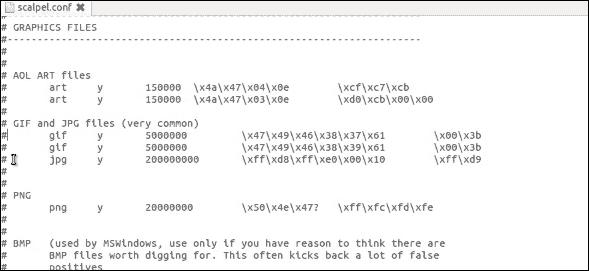

# 第十一章：安卓数据分析与恢复

在上一章中，我们介绍了各种逻辑和物理数据提取技术。在物理提取中，会获取到安卓设备的逐位图像，其中包含了宝贵的信息。在本章中，我们将学习如何从图像文件中分析并提取相关数据，如通话记录和短信。尽管数据提取和分析技术能够提供各种细节的信息，但并非所有技术都能提供关于已删除数据的信息。数据恢复是移动取证中的一个关键环节，因为它有助于揭示已删除的项目。

本章旨在介绍可以被取证分析师用于从安卓设备中恢复数据的各种技术。

本章将涵盖以下两个主要内容：

+   使用 Autopsy 工具分析并提取安卓图像文件中的数据

+   了解从 SD 卡和内存中恢复已删除文件的技术

# 使用 Autopsy 工具分析并提取安卓图像文件中的数据

**安卓图像**一词指的是通过执行任何物理数据提取技术所获得的物理图像（也称为取证图像或原始图像）。使用第九章中解释的*安卓数据提取技术*，你可以对整个`/data/data`块或任何与调查相关的特定块进行成像。一旦获取到图像，像你这样的调查员可以手动浏览文件内容，或者利用现有工具解析内容。商业工具，如 Cellebrite 和 XRY，能够深入数据并呈现出全面的内容图像。Autopsy 是取证领域中广泛使用的开源工具之一，能够出色地分析安卓图像。

# Autopsy 平台

Autopsy 是一个取证平台，作为 Sleuth Kit 的图形界面（GUI）。它是免费的，你可以在[`www.sleuthkit.org/`](http://www.sleuthkit.org/)下载。Sleuth Kit 是一个包含 Unix 和 Windows 工具及实用程序的集合，用于执行取证分析。Autopsy 通过对给定卷进行取证分析来显示结果，从而帮助调查员集中注意数据的相关部分。Autopsy 是免费的且具有可扩展性，拥有多个可以插件化的模块。Autopsy 可以用来加载和分析通过物理提取获得的安卓图像。

# 向 Autopsy 中添加图像

下载并安装 Autopsy 后，请按照以下步骤将图像添加到 Autopsy 中：

1.  打开 Autopsy 工具并选择“创建新案件”选项，如下图所示：


在 Autopsy 中创建新案件

1.  输入所有必要的案件详细信息，包括案件名称、数据存储位置等，如下图所示：


在 Autopsy 中输入案件信息

1.  输入案件编号和检查员详细信息，然后点击完成。

1.  现在，点击添加数据源按钮，添加要分析的镜像文件，并点击下一步：


在 Autopsy 中输入数据源信息

1.  在下一个屏幕上，您可以配置需要在镜像上运行的模块，如下图所示。建议选择最近活动、Exif 解析器、关键字搜索和 Android 分析器模块。在下一步中，点击完成：


在 Autopsy 中配置模块

完成此操作后，工具通常需要几分钟时间来解析镜像，具体取决于镜像的大小。在此期间，如果工具遇到任何错误或警告信息，您可能会看到相关提示。然而，与其他工具相比，Autopsy 提供了最快的访问速度，能够更快速地获取工件和文件系统。

# 使用 Autopsy 分析镜像

加载镜像后，展开“数据源”下的文件，以查看镜像中的数据。例如，以下截图显示了`/data/` 文件夹的内容：


在 Autopsy 中分析镜像

在上述示例中，仅对设备的`/data`部分进行了镜像。如果对整个设备进行了镜像，那么工具会显示更多的卷。根据调查的具体细节，必须分析相关部分。在下面的示例中，通过检查`com.android.browser`下的文件夹，我们可以提取出用户访问过的各种网站的列表及其访问日期：


在 Autopsy 中分析浏览详情

通过分析各种部分下的数据，可以挖掘出有价值的数据，如短信、浏览历史、聊天记录、通话历史、图片、视频和位置信息。在下一节中，我们将研究如何从 SD 卡和内部存储中恢复数据。

# 理解从 SD 卡和内部存储恢复已删除文件的技巧

数据恢复是法医分析中最重要和最强大的方面之一。恢复已删除数据的能力对于破解许多民事和刑事案件至关重要。从普通用户的角度来看，恢复已删除的数据通常是指操作系统内置的解决方案，如 Windows 中的回收站。虽然确实可以从这些位置恢复数据，但由于用户意识的提高，这些选项通常不起作用。例如，在桌面计算机上，人们现在使用*Shift* + *Delete*作为完全删除文件的方式。

数据恢复是指在设备无法正常访问时，从设备中恢复已删除数据的过程。考虑到一个手机被从恐怖分子手中扣押的情境，知道恐怖分子删除了哪些内容岂不是至关重要吗？访问任何已删除的短信、图片、拨打的电话号码、应用程序数据等都可能至关重要，因为它们常常揭示敏感信息。在 Android 系统中，如果设备文件正确获取，通常可以恢复大多数已删除的数据。然而，如果在处理设备时没有采取适当的措施，已删除的数据可能永远丢失。为了确保已删除的数据不会被覆盖，建议牢记以下几点：

+   在扣押手机后，不要进行任何操作。已删除的数据会存在于设备中，直到有其他即将到来的数据需要占用空间。因此，必须避免对手机进行任何活动，以防数据被覆盖。

+   即使手机未被使用，并且没有任何来自我们端的干预，数据仍然可能被覆盖。例如，收到一条短信会自动占用空间，这可能会覆盖被标记为删除的数据。为了防止这种情况发生，你应该遵循前几章描述的法医处理方法。最简单的解决方案是将设备设置为飞行模式，或禁用设备上的所有连接选项。这样可以防止任何新消息的传输。

所有 Android 文件系统都有包含文件层次结构、文件名等信息的元数据。删除操作并不会真正删除这些数据，而是移除文件系统的元数据。当短信或任何其他文件从设备中删除时，它们只是对用户不可见，但文件仍然存在于设备上。本质上，这些文件只是被标记为删除，直到被覆盖，才会从文件系统中完全移除。从 Android 设备中恢复已删除的数据有两种情况：恢复从 SD 卡中删除的数据，如图片、视频、应用程序数据等，以及恢复从设备内存中删除的数据。以下章节将介绍从 SD 卡和 Android 设备内部存储中恢复已删除数据的技术。

# 从外部 SD 卡恢复已删除的数据

SD 卡上的数据可以向法医调查员透露大量信息。SD 卡能够存储手机相机拍摄的图片和视频、语音录音、应用程序数据、缓存文件等。基本上，任何可以存储在计算机硬盘上的内容，都可以存储在 SD 卡上，只要有足够的空间。

从外部 SD 卡恢复已删除的数据是一个直接的过程。SD 卡可以作为外部大容量存储设备挂载，并通过标准的数字取证方法进行法证获取，如第九章《*安卓数据提取技术*》中所述。如前几章所提到，安卓设备中的 SD 卡通常使用 FAT32 文件系统。主要原因是 FAT32 文件系统在大多数操作系统中得到了广泛支持，包括 Windows、Linux 和 macOS X。FAT32 格式化驱动器的最大文件大小约为 4GB。随着如今高分辨率格式的普及，这一限制经常被达到。除此之外，FAT32 只能用于小于 32GB 的分区。因此，exFAT 文件系统由于解决了这些问题，现在被一些设备所采用。

如果外部 SD 卡可以作为驱动器挂载，恢复已删除的数据是非常简单的。因此，如果 SD 卡是可拆卸的，可以使用写保护器将其连接到工作站进行获取。然而，最新的安卓设备通常不会作为大容量存储设备挂载。这是因为这些设备使用**媒体传输协议**（**MTP**）或**图片传输协议**（**PTP**）协议，而不是 USB 大容量存储。USB 大容量存储的问题在于，计算机需要对存储设备具有独占访问权限。换句话说，外部存储设备在连接到工作站时，必须与安卓操作系统完全断开。这给移动应用带来了其他一些复杂问题。当安卓设备使用 MTP 时，它在计算机上显示为媒体设备，而不是可移动存储，如下图所示：


使用 MTP 连接安卓设备

但是，普通的数据恢复工具需要一个挂载的驱动器才能执行扫描。因此，大多数最新的使用 MTP/PTP 协议的设备不会被视为挂载驱动器，因此适用于计算机的传统数据恢复工具无法在它们上工作。

因此，当设备使用 MTP/PTP 且未作为驱动器挂载时，可以通过某些特定的安卓数据恢复工具进行恢复，这些工具需要开启 USB 调试选项。市面上几乎所有的安卓数据恢复工具都需要你启用 USB 调试，这样设备和 SD 卡才能在开始数据恢复之前被识别。

你必须明白，Android 设备可能会使用 SD 卡上的空间来缓存应用程序数据；因此，在移除 SD 卡之前，确保尽可能多地从设备中获取数据非常重要。一些旧设备在通过 USB 连接时会自动将设备挂载为驱动器。对于数据提取、数据恢复等操作，最佳的法医实践是不直接在设备上进行操作。因此，需要对 SD 卡进行物理镜像，并在镜像文件上进行所有必要的分析。建议通过设备和单独获取 SD 卡，以确保所有数据都被提取。为了获得 SD 卡的镜像，如果设备由于可能有证据在内存中运行无法关闭，可以使用 `dd` 通过 `adb` 在设备运行时获取 SD 卡的镜像。如果将 SD 卡取出并通过读卡器连接到工作站，它将作为外部大容量存储显示，之后可以使用之前章节中描述的标准法医技术对其进行镜像。

获取镜像后，可以使用任何标准法医工具进行分析，例如 FTK Imager。FTK Imager 是一个简单的工具，可以用来创建和分析磁盘镜像。它可以在[`accessdata.com/product-download/ftk-imager-version-3.2.0`](https://accessdata.com/product-download/ftk-imager-version-3.2.0)下载。

以下是使用 FTK Imager 从 SD 卡镜像恢复已删除文件的分步过程：

1.  启动 FTK Imager，点击“文件”，然后在菜单中点击“添加证据项...”：


在 FTK Imager 中添加证据

1.  在“选择源”对话框中选择图像文件作为证据类型，然后点击“下一步”：


在 FTK Imager 中选择文件类型

1.  在“选择文件”对话框中，定位到 `SDCARD.dd` SD 卡镜像文件所在的位置，选择该文件，然后点击“完成”：


在 FTK Imager 中选择分析的镜像文件

1.  SD 卡镜像的内容随后显示在“视图”窗格中。你可以通过点击“+”号浏览文件夹。当文件夹被高亮显示时，右侧窗格将显示其中的内容。当选择某个文件时，它的内容将在底部窗格中显示。如以下截图所示，已删除的文件也会在图标上显示红色叉标记：


在 FTK Imager 中，已删除的文件会显示带有红色叉标记的图标

1.  要将已删除的文件复制到工作站，右键点击标记的文件并选择“导出文件...”，如下所示：


在 FTK Imager 中恢复已删除的图片

还建议检查设备是否安装了任何备份应用程序或文件。安卓的初始版本并未包含供用户备份个人数据的机制。因此，许多备份应用程序被广泛使用。通过这些应用，用户可以将数据备份到 SD 卡或云端。例如，**超级备份**应用包含备份通话记录、联系人、短信等选项，如下图所示：


超级备份安卓应用

一旦检测到备份应用程序，您必须尝试确定数据存储位置。通常，备份文件夹的路径是内部 SD 卡。文件夹路径也可以在备份应用的设置中找到。备份中保存的数据可能包含重要信息，因此，在设备上寻找任何第三方备份应用将非常有帮助。

# 从内部存储器恢复已删除数据

恢复从安卓设备内部存储器中删除的文件（如短信、联系人和应用数据）并不是所有分析工具都支持的，可能需要手动恢复。与某些包含常见文件系统的媒体（如 SD 卡）不同，文件系统可能无法被取证工具识别和挂载。此外，除非手机已经 root，否则无法访问安卓手机的内部存储原始分区。建议在 root 过程开始前和结束后对设备进行镜像。以下是您在尝试从安卓设备的内部存储器恢复数据时可能遇到的一些其他问题：

+   若要访问内部存储器，您可以尝试对手机进行 root 操作。然而，root 过程可能涉及将一些数据写入 `/data` 分区，这一过程可能会覆盖设备中有价值的数据。

+   与 SD 卡不同，这里的内部文件系统不是 FAT32（该格式被大多数取证工具广泛支持）。内部文件系统可能是 YAFFS2（用于较老设备）、EXT3、EXT4、RFS 或专为安卓系统设计的专有格式。因此，许多为 Windows 文件系统设计的恢复工具将无法使用。

+   安卓设备上的应用数据通常以 SQLite 格式存储。虽然大多数取证工具提供对数据库文件的访问，但可能需要导出并在本地浏览器中查看。您必须检查原始数据，以确保删除的数据没有被取证工具忽视。

讨论的原因使得从内部存储恢复已删除的数据变得困难，但并非不可能。Android 设备的内部存储包含了大部分用户数据和可能与调查相关的关键数据。如前所述，必须对设备进行 root 权限处理才能访问原始分区。市面上的大多数 Android 恢复工具并未强调它们仅能在已 root 的手机上工作。现在，让我们来看看如何从 Android 手机恢复已删除的数据。

# 通过解析 SQLite 文件恢复已删除文件

Android 使用 SQLite 文件来存储大部分数据。与短信、电子邮件以及某些应用数据相关的数据存储在 SQLite 文件中。SQLite 数据库可以在数据库本身内存储已删除的数据。用户标记为删除的文件将不再出现在活动的 SQLite 数据库文件中。因此，可以恢复已删除的数据，如短信和联系人。在 SQLite 页面内有两个区域可能包含已删除的数据——未分配块和空闲块。

大多数用于恢复已删除数据的商业工具扫描 SQLite 页面中的未分配块和空闲块。解析已删除数据可以使用现有的取证工具，如**Oxygen Forensics SQLite Viewer**。可以使用 SQLite Viewer 的试用版本来实现这一目的，但有一定的限制，限制了你能恢复的数据量。你也可以编写自己的脚本来解析文件中的已删除内容，为此你需要对 SQLite 文件格式有良好的理解。[`www.sqlite.org/fileformat.html`](http://www.sqlite.org/fileformat.html) 页面是一个不错的起点。如果你不想从头开始并希望重用现有的脚本，可以尝试使用现有的开源 Python 脚本（[`az4n6.blogspot.in/2013/11/python-parser-to-recover-deleted-sqlite.html`](http://az4n6.blogspot.in/2013/11/python-parser-to-recover-deleted-sqlite.html)）来解析 SQLite 文件中的已删除记录。

在我们的示例中，我们将从 Android 设备恢复已删除的短信。恢复已删除的短信是 Android 手机取证分析中经常要求的一部分，主要是因为短信包含的数据能够揭示大量信息。恢复 Android 设备上已删除短信的方法有很多。首先，我们需要了解这些短信存储在设备的哪个位置。在第九章，*Android 数据提取技术*中，我们解释了 Android 设备中存储用户数据的重要位置。这里是一个简要回顾：

+   每个应用程序都会将其数据存储在 `/data/data` 文件夹下（同样，这需要 root 权限才能获取数据）。

+   位于 `/data/data/com.android.providers.telephony/databases` 位置的文件包含有关短信/MMS 的详细信息。

在上述位置，短信被存储在一个名为`mmssms.db`的 SQLite 数据库文件中。通过检查此文件可以恢复已删除的短信。以下是使用`mmssms.db`文件恢复已删除短信的步骤：

1.  在 Android 设备上，启用 USB 调试模式并将设备连接到取证工作站。使用`adb`命令行工具，通过发出以下命令提取位于`/data/data/`路径下的数据库文件夹：

```
adb.exe pull /data/data/com.android.providers.telephony/databases C:\temp

```

输出结果如下所示：


ADB 拉取命令

一旦文件提取到本地计算机，使用 Oxygen Forensics SQLite Viewer 工具打开`mmssms.db`文件。

1.  点击名为`sms`的表格，并在工具的 Tables 数据标签下观察当前消息。

1.  查看已删除数据的一种方式是点击包含已删除数据的块标签，如下图所示：


恢复已删除的短信

类似地，存储在 Android 设备上的其他数据，若以 SQLite 文件形式存储，也可以通过解析删除内容来恢复。当上述方法无法访问已删除数据时，应查看文件的原始十六进制文件，寻找标记为已删除的数据，这些数据可以手动雕刻并报告。

# 使用文件雕刻技术恢复文件

文件雕刻是一种极其有用的取证方法，因为它允许恢复已删除或隐藏的数据进行分析。简而言之，文件雕刻是指在没有文件系统元数据的情况下，从文件碎片中重新组装计算机文件的过程。在文件雕刻中，指定的文件类型会在二进制数据中进行搜索和提取，以创建分区或整个磁盘的取证镜像。文件雕刻通过仅依赖文件结构和内容，而不依赖任何匹配的文件系统元数据，从驱动器的未分配空间中恢复文件。未分配空间是指驱动器上不再包含任何文件信息的部分，这些信息由文件系统结构（如文件表）表示。

文件可以通过扫描磁盘的原始字节并重新组装它们来恢复或重建。这可以通过检查文件的头部（前几个字节）和尾部（最后几个字节）来完成。

文件雕刻方法根据所使用的底层技术进行分类。头尾雕刻方法依赖于通过文件的头部和尾部信息来恢复文件。例如，对于 JPEG 文件，它们以`0xffd8`开头，以`0xffd9`结尾。

文件头和文件尾的位置被识别出来，两个端点之间的所有内容都被切割。同样，基于文件结构的切割方法利用文件的内部布局来重建文件。然而，传统的文件切割技术，如我们已经解释过的技术，在数据碎片化的情况下可能无法有效工作。为了解决这个问题，新的技术，如智能切割，利用一些流行文件系统的碎片特征来恢复数据。

一旦手机镜像制作完成，可以使用像**Scalpel**这样的工具进行分析。Scalpel 是一个强大的开源工具，用于切割文件。该工具分析块数据库存储，识别已删除的文件并恢复它们。Scalpel 是与文件系统无关的，已知可以在多种文件系统上工作，包括 FAT、NTFS、EXT2、EXT3、HFS 等。关于 Scalpel 的更多信息可以在 [`github.com/sleuthkit/scalpel`](https://github.com/sleuthkit/scalpel)找到。以下步骤说明如何在 Ubuntu 工作站上使用 Scalpel：

1.  使用命令`sudo apt-get install scalpel`在 Ubuntu 工作站上安装 Scalpel。

1.  `/etc/scalpel`目录下的`scalpel.conf`文件包含关于支持的文件类型的信息，如下图所示：



Scalpel 配置文件

该文件需要修改，以提到与 Android 相关的文件。可以从 [`www.nowsecure.com/tools-and-trainings/#viaforensics`](https://www.nowsecure.com/tools-and-trainings/#viaforensics)下载示例的`scalpel.conf`文件。你也可以取消注释相关文件并保存`conf`文件，选择你想要的文件类型。完成后，替换掉原始的`conf`文件，使用下载的文件。

1.  Scalpel 需要与前述配置文件一起在正在检查的`dd`镜像上运行。你可以通过输入配置文件和`dd`文件，使用以下命令运行该工具：

```
$ scalpel -c /home/unigeek/Desktop/scalpel-android.conf /home/unigeek/Desktop/userdata.dd -o /home/unigeek/Desktop/rohit
```

一旦运行这个命令，工具就会开始切割文件并根据需要构建它们，如下图所示：


在`dd`文件上运行 Scalpel 工具

1.  在前述命令中指定的`output`文件夹现在包含基于文件类型的文件夹列表，如下图所示。每个文件夹内的内容是根据文件夹名称恢复的。例如，`jpg 2-0`包含与`.jpg`扩展名相关的恢复文件：


运行 Scalpel 工具后的输出文件夹

1.  如前述截图所示，每个文件夹包含来自 Android 设备的恢复数据，如图片、PDF 文件、ZIP 文件等。虽然一些图片被完全恢复，但也有一些没有完全恢复，如下图所示：


使用 Scalpel 工具恢复的数据

如**DiskDigger**等应用程序可以安装在 Android 设备上，从设备的内部存储和 SD 卡中恢复不同类型的文件。DiskDigger 支持 JPG 文件、MP3 和 WAV 音频、MP4 和 3GP 视频、原始相机格式、Microsoft Office 文件（DOC、XLS 和 PPT）等文件。然而，正如前面所提到的，应用程序需要在 Android 设备上获得 root 权限才能从内部存储中恢复内容。您应当清楚地记录这些更改。DiskDigger Android 应用程序提供两种模式：基础扫描模式和完整扫描模式。

完整扫描模式仅适用于已获取 root 权限的设备，而基础扫描模式适用于任何设备。如以下截图所示，在已 root 的手机上，应用程序会自动定位并显示可用的分区：


DiskDigger 应用程序

选择内存分区后，工具会提示您选择要恢复的文件类型。请继续选择感兴趣的文件类型：


DiskDigger 应用的文件选择界面

扫描开始后，DiskDigger 应用程序将自动显示可恢复的文件。恢复的文件可以保存到应用程序中或直接保存到设备上。因此，文件修复技术在从设备内存中恢复重要已删除文件时起着至关重要的作用。

# 使用 Google 账户恢复联系人

您还可以通过设备上配置的 Google 账户使用联系人应用恢复设备上的联系人。如果设备用户以前使用 Android 中的“同步设置”选项同步了联系人，这种方式将有效。该选项将联系人及其他信息同步并存储在云端。作为一名具有法律授权或适当许可的法医专家，如果您能访问设备上配置的 Google 账户，则可以恢复已删除的联系人。访问账户后，执行以下步骤恢复数据：

1.  使用已配置的 Google 账户登录到 Android 设备上的 Google 联系人应用程序。以下示例是在运行 Android Pie 版本的 OnePlus 5 设备上进行的尝试。

1.  点击设置，然后查找恢复选项，如下图所示：


联系人应用中的恢复菜单

1.  点击“恢复”，然后将显示以下界面：


恢复联系人对话框

如您所见，您可以将联系人列表恢复到备份创建时的历史状态。您还可以在“设置”菜单下使用“撤销更改”选项将联系人恢复到过去 30 天内的任何状态：


恢复 Google 账户中的已删除联系人

因此，使用前面提到的任何一种技术，像你这样的法医检查员可以尝试轻松恢复已删除的数据。

# 总结

在本章中，我们学习了从安卓设备恢复已删除数据的各种技术。这个过程依赖于多个因素，特别依赖于对内部存储和 SD 卡中数据的访问。我们探讨了从 SD 卡和内部存储中恢复已删除数据的不同技术。虽然从外部存储（如 SD 卡）中恢复已删除项较为简单，但从内部存储中恢复已删除项则需要相当大的努力。我们还学习了 SQLite 文件解析和文件雕刻技术，利用这些技术可以从安卓设备中提取已删除的数据。掌握了这些知识，你现在可以在法医调查过程中进行数据恢复。

下一章将讨论安卓应用和恶意软件的法医分析，以及安卓应用的逆向工程。
