# 第十二章：Android 应用分析、恶意软件和逆向工程

第三方应用是智能手机用户常用的应用。Android 用户从 Google Play 等应用商店下载并安装多个应用。在取证调查过程中，对这些应用进行分析，提取有价值的数据并检测恶意软件，通常是非常有帮助的。例如，一款照片保管箱应用可能会锁定设备上存储的敏感图片。因此，了解如何识别照片保管箱应用的密码将具有重要意义。

此外，像 Facebook、WhatsApp、Skype 等应用现在也广泛使用，它们常常是破案的重要数据来源。因此，了解这些应用存储的数据类型及其数据存储位置非常重要。虽然我们在前几章中讨论的数据提取和数据恢复技巧可以帮助我们访问有价值的数据，但应用分析可以帮助我们获取应用程序的具体信息，例如偏好设置和权限。

本章我们将讨论以下主题：

+   分析广泛使用的 Android 应用以获取有价值的数据

+   逆向工程 Android 应用的技巧

+   Android 恶意软件

# 分析广泛使用的 Android 应用以获取有价值的数据

在 Android 系统中，用户与之互动的所有内容都是应用程序。虽然一些应用是由设备制造商预装的，但其他应用则是由用户下载并安装的。例如，诸如联系人、通话、短信等日常功能，都是通过各自的应用程序执行的。因此，Android 应用分析在调查过程中至关重要。一些第三方应用，如 WhatsApp、Facebook、Skype、Chrome 浏览器等，广泛使用，并且它们处理了大量有价值的信息。根据应用类型，这些应用大多数会将敏感信息存储在设备的内部存储或 SD 卡上。分析这些应用可能会提供有关用户位置、与他人通信等信息。使用我们之前描述的取证技巧，可以访问这些应用存储的数据。然而，作为一名取证检查员，你需要培养将可用数据转化为有用数据的必要技能。这在你全面理解应用程序如何处理数据时才能实现。

如前面章节所述，所有应用程序默认将其数据存储在`/data/data`文件夹中。应用程序还可以根据需要通过安装时请求权限，将某些数据存储在 SD 卡上。可以通过检查`/data/data`文件夹的内容来收集设备上应用程序的信息，但这并不简单，因为需要分析此路径下每个单独的应用程序文件夹。作为替代方法，您可以检查位于`/data/system`下的`packages.list`文件。该文件包含所有应用程序的信息，包括它们的包名和数据路径。

可以使用以下命令来执行此操作：

```
# cat packages.list
```

以下是前面命令的输出：

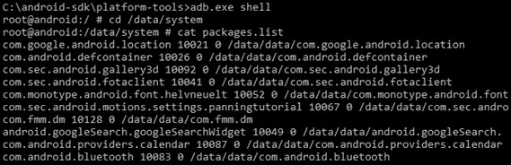

packages.list 文件内容

现在，让我们特别看看一些广泛使用并处理有价值数据的第三方应用程序。

以下应用程序仅用于让您熟悉可以提取的数据类型及其可能的存储位置。在执行这些操作之前，您需要获得适当的权限，并且应遵守法律规定。正如我们在第八章《*Android 法医设置与数据提取前的技巧*》中解释的那样，以下技巧仅在设备已获得 root 权限后有效。

# Facebook Android 应用分析

Facebook Android 应用是最广泛使用的社交网络应用之一。它将信息存储在`/data/data`文件夹中，位于`com.facebook.katana`包下。以下详细信息概述了可以通过不同文件收集的信息类型：

+   **Facebook 联系人**：用户的 Facebook 联系人信息可以通过分析`contacts_db2`数据库来获取，该数据库位于以下路径：

    +   **路径**：`/data/data/com.facebook.katana/databases/contacts_db2`。

    +   `contacts_db2`数据库（SQLite 文件）包含一个名为 contacts 的表，该表包含用户的大部分信息，如名字、姓氏、显示名和显示图片的 URL。

+   **Facebook 通知**：用户的通知信息可以通过分析`notification_db`数据库来收集，该数据库位于以下路径：

    +   **路径**：`/data/data/com.facebook.katana/databases/notifications_db`。

    +   `gql_notifications`表位于上述路径下，包含用户信息。`seen_state`列确认通知是否已被查看。`updated`列指示通知更新时间。`gql_payload`列包含通知及发送者信息。

+   **Facebook 消息**：Facebook 消息对多种案件可能至关重要，可以通过分析`threads_db2`数据库查看：

    +   **路径**：`/data/data/com.facebook.katana/databases/threads_db2`

+   **新闻源视频**: `/video-cache` 文件夹包含已从用户新闻源下载的视频。请注意，这些视频不是用户发布的视频，而是出现在他们新闻源中的视频：

    +   **路径**: `/data/data/com.facebook.katana/files/video-cache`

+   **新闻源图片**: `/images` 文件夹包含出现在用户个人资料中的各种图片，例如来自他们新闻源的图片和联系人个人资料图片。此文件夹内有多个目录，图片可能以 `.jpg` 以外的格式存储，如 `.cnt`：

+   **路径**: `/data/data/com.facebook.katana/cache/images`

+   **新闻源数据**: `newfeed_db` 数据库包含显示给用户的新闻源数据。如下所示，分析此数据库可以提供有价值的信息，例如某个特定故事何时被设备加载（`fetched_at` 列），某个故事是否已被用户查看（`seen_state` 列），以及该故事的相关文件存储在设备上的位置（`cache_file_path` 列）：

+   **路径**: `/data/data/com.facebook.katana/databases/newsfeed_db`：

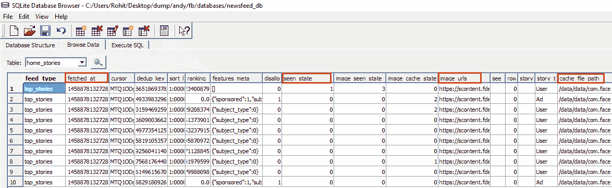

在 SQLite 浏览器中分析的 Facebook newsfeed.db 文件

在上面的截图中，`fetched_at` 指定了此信息被获取的日期和时间。请注意，应用程序使用 Linux 纪元时间，也称为 Unix 时间或 Posix 时间，来存储这些信息。此格式通常被多个应用程序使用，因此值得注意。Linux 纪元时间以自 1970 年 1 月 1 日午夜以来的秒数（或毫秒数）表示。有几个在线网站，例如 [`www.epochconverter.com/`](https://www.epochconverter.com/)，可以方便地将 Linux 纪元时间转换为常规格式。例如，以下截图显示了 Linux 纪元时间 1,577,881,839 转换为常规格式：

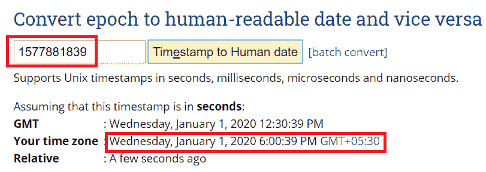

时间格式示例

现在我们已经分析了 Facebook 应用程序，让我们对下一个应用程序，即 WhatsApp 进行类似的分析。

# WhatsApp 安卓应用分析

WhatsApp 是全球最受欢迎的聊天（音频和视频）消息服务，全球超过十亿人使用。它将其信息存储在 `/data/data` 文件夹下，包名为 `com.whatsapp`。以下是从取证角度来看感兴趣的重要文件概览：

+   **用户的个人资料图片**: 用户的个人资料图片以 `me.jpg` 文件名保存，并位于以下路径下：

    +   **路径**: `/data/data/com.whatsapp/me.jpg`

+   **用户的电话号码（与 WhatsApp 关联）**: 主文件夹下的 `me` 文件包含与用户 WhatsApp 账户关联的电话号码。请注意，这可能是也可能不是与 SIM 卡关联的电话号码：

    +   **路径**: `/data/data/com.whatsapp/me`

+   **联系人头像**：`/avatars`目录包含用户联系人（使用 WhatsApp 的用户）的头像缩略图：

    +   **路径**：`/data/data/com.whatsapp/files/Avatars`

+   **聊天消息**：所有与消息相关的信息，包括聊天和发件人详细信息，都存储在`msgstore.db`文件中，该文件位于以下位置：

    +   **路径**：`/data/data/com.whatsapp/databases/msgstore.db`

+   **WhatsApp 文件**：与 WhatsApp 共享的大部分文件，如图像、视频和语音消息，存储在 SD 卡中的以下位置：

    +   **路径**：`/sdcard/WhatsApp/Media`

发送和接收的文件分别存储在各自的文件夹中。

接下来，我们将查看另一款用于远程通信的应用程序，它专注于提供视频聊天和语音通话服务：Skype。

# Skype Android 应用分析

Skype 是一款提供视频聊天和语音通话服务的应用程序。该应用程序的数据存储在`/data/data`文件夹下，包名为`com.skype.raider`。以下是通过分析 Skype 应用程序可以提取的一些重要数据：

+   **用户名和 IP 地址**：`shared.xml`文件位于以下路径中，包含有关用户名和最后一次连接 Skype 的 IP 地址的信息：

    +   **路径**：`/data/data/com.skype.raider/files/shared.xml`

+   **头像**：用户的头像存储在`/thumbnails`目录中，其路径如下：

    +   **路径**：`/data/data/com.skype.raider/files/<username>/thumbnails/`

+   **通话记录**：Skype 的通话记录信息存储在`main.db`文件中，分析此文件可以获取大量信息：

    +   **路径**：`/data/data/com.skype.raider/files/<username>/main.db/`

    +   例如，`duration`表提供了通话时长的信息，`start_timestamp`字段显示了通话的开始时间，`creation_timestamp`字段表示通话的发起时间（包括未接来电）。`type`列指示通话是接听（值=`1`）还是拨出（值=`2`）。

+   **聊天消息**：`main.db`文件中的`messages`表包含所有聊天消息。`author`和`from_dispname`列提供了写消息的人信息。`timestamp`列显示了消息的日期/时间。`body_xml`列包含消息的内容：

    +   **路径**：`/data/data/com.skype.raider/files/<username>/main.db/`

+   **传输的文件**：`Transfers`表包含有关已传输文件的信息，如文件名、文件大小及其在设备上的位置：

    +   **路径**：`/data/data/com.skype.raider/files/<username>/main.db/`

    +   接收到的实际图像或文件将存储在 SD 卡中。如果下载了文件，它将位于 SD 卡根目录下的`Downloads`文件夹中。

+   **群聊**：`ChatMembers`表格显示了参与某个聊天的用户列表。`adder`列显示了发起对话的用户：

    +   **路径**：`/data/data/com.skype.raider/files/<username>/main.db/`

现在，我们将对 Gmail 应用程序进行分析。

# Gmail Android 应用程序分析

Gmail 是 Google 提供的广泛使用的电子邮件服务。应用数据保存在`/data/data`文件夹中，包名为`com.google.android.gm`。通过分析 Gmail 应用程序，可以提取以下重要数据：

+   **账户详情**：`/shared_prefs`下的 XML 文件确认了电子邮件账户的详情。与当前电子邮件关联的其他账户的详情可以通过分析`Gmail.xml`文件来识别：

    +   **路径**：`/data/data/com.google.android.gm/cache/<username>@gmail.com`

+   **附件**：最近在发送和接收电子邮件中使用的附件会保存到`/cache`目录。这非常有价值，因为它让我们能够访问那些已经从电子邮件服务中删除的项目。每一行还包含一个`messages_conversation`值，可以与电子邮件附件的`conversations`表格进行对比。`filename`列标识了设备上文件所在的路径。以下是该文件夹的准确路径：

    +   **路径**：`/data/data/com.google.android.gm/cache/<username>@gmail.com`：

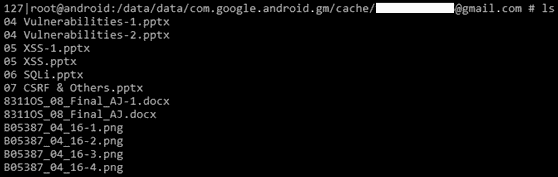

Gmail 缓存目录下的附件列表

+   **电子邮件主题**：通过分析`mailstore.<username>@gmail.com.db`文件中的`conversations`表格，可以恢复此电子邮件的主题：

    +   **路径**：`/data/data/com.google.android.gm/databases/mailstore.<username>@gmail.com.db`

+   **搜索历史**：应用内进行的任何文本搜索都会保存在`suggestions.db`文件中，文件位于以下位置：

    +   **路径**：`/data/data/com.google.android.gm/databases/suggestions.db`

让我们通过对 Google Chrome 应用程序进行最后分析来总结本节内容。

# Google Chrome Android 应用程序分析

Google Chrome 是 Google Pixel 及许多其他设备上的默认浏览器，广泛用于上网浏览。应用数据位于`/data/data`文件夹中，包名为`com.android.chrome`。通过分析 Gmail 应用程序，可以提取以下重要数据：

+   **个人资料照片**：用户的个人资料照片以`Google Profile Picture.png`文件名存储在以下位置：

    +   **路径**：`/data/data/com.android.chrome/app_chrome/Default/ Google Profile Picture.png`

+   **书签**：`Bookmarks`文件包含了所有与账户同步的书签信息。通过分析此文件，可以收集到站点名称、网址以及书签添加时间等详情：

    +   **路径**：`/data/data/com.android.chrome/app_chrome/Default/Bookmarks`

+   **浏览历史**：`History.db` 文件包含了用户在多个表中存储的网页历史。例如，如下图所示，`keyword_search_terms` 表包含了使用 Chrome 浏览器进行的搜索信息：

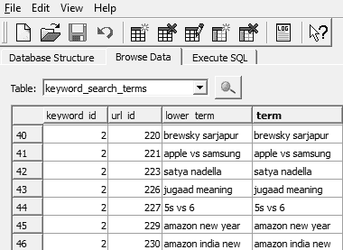

Google Chrome 浏览历史

+   +   `segments` 表包含了用户访问过的部分网站（并非所有网站）。值得注意的是，Chrome 不仅存储属于设备的数据，还存储账户相关的数据。换句话说，通过相同账户在其他设备上访问过的网站信息也会被存储在设备上；例如，`URLs` 表包含了 Google 账户在多个设备上访问的浏览历史。

    +   **路径**：`/data/data/com.android.chrome/app_chrome/Default/History`。

+   **登录数据**：`Login Data` 数据库包含了浏览器保存的不同网站的登录信息。网站的 URL，以及用户名和密码，都会存储在相应的表格中：

    +   **路径**：`/data/data/com.android.chrome/app_chrome/Default/Login Data`

+   **常访问的网站**：`Top Sites` 数据库包含了一个常访问网站的列表：

    +   **路径**：`/data/data/com.android.chrome/app_chrome/Default/Top Sites`

+   **其他数据**：其他信息，例如用户在不同网站表单填写时输入的电话号码或电子邮件地址，会存储在 `Web Data` 数据库中。这个数据库中任何存在的表格都包含了自动填充数据：

    +   **路径**：`/data/data/com.android.chrome/app_chrome/Default/Web Data`

现在我们已经分析了不同的第三方应用，接下来我们将看看可以用来逆向工程安卓应用的技巧。

# 逆向工程安卓应用的技巧

你可能需要处理一些应用，它们会成为访问所需信息的障碍。例如，考虑一下手机相册被 *AppLock* 应用锁定的情况。在这种情况下，为了访问相册中存储的照片和视频，你首先需要输入 *AppLock* 的密码。因此，了解 *AppLock* 应用如何在设备上存储密码会是一个有趣的话题。你可能会查看 SQLite 数据库文件。然而，如果这些文件被加密，那么甚至很难知道它是一个密码。逆向工程应用在这种情况下会非常有帮助，尤其是在你想更好地理解应用如何存储数据时。

简单来说，逆向工程是从可执行文件中提取源代码的过程。逆向工程安卓应用的目的是为了理解应用的功能、数据存储、所采用的安全机制等等。在我们学习如何逆向工程安卓应用之前，先简单回顾一下安卓应用的基本知识：

+   所有安装在 Android 设备上的应用程序都使用 Java 编程语言编写。

+   当一个 Java 程序被编译时，我们会得到字节码。这些字节码会被传送到 dex 编译器，转换成 Dalvik 字节码。

+   因此，类文件通过 dx 工具转换为 dex 文件。Android 使用一种叫做**Dalvik 虚拟机**（**DVM**）的技术来运行其应用程序。

+   JVM 的字节码由一个或多个类文件组成，具体取决于应用程序中 Java 文件的数量。不管怎样，Dalvik 字节码只由一个 dex 文件组成。

因此，dex 文件、XML 文件以及运行应用程序所需的其他资源都被打包到 Android 包文件（APK 文件）中。这些 APK 文件实际上是 ZIP 文件内的项目集合。因此，如果你将 APK 扩展名文件重命名为`.zip`文件，你就可以看到文件的内容。然而，在此之前，你需要访问已安装在手机上的应用的 APK 文件。以下是如何访问对应应用 APK 文件的方法。

# 从 Android 设备中提取 APK 文件

手机预装的应用存储在`/system/app`目录下。用户下载的第三方应用则存储在`/data/app`文件夹中。以下方法可以帮助你访问设备上的 APK 文件，适用于已 root 和未 root 的设备：

1.  通过执行`# adb.exe shell pm list packages`命令来识别应用的包名。

以下是前述命令的输出：

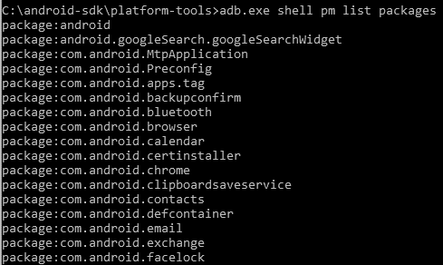

设备上存在的包名列表

如前面的命令行输出所示，显示了包名列表。尝试找到该应用程序与包名的匹配项。通常，包名与应用名密切相关。或者，你也可以使用 Android Market 或 Google Play 轻松识别包名。Google Play 中应用的 URL 包含包名，如下图所示：

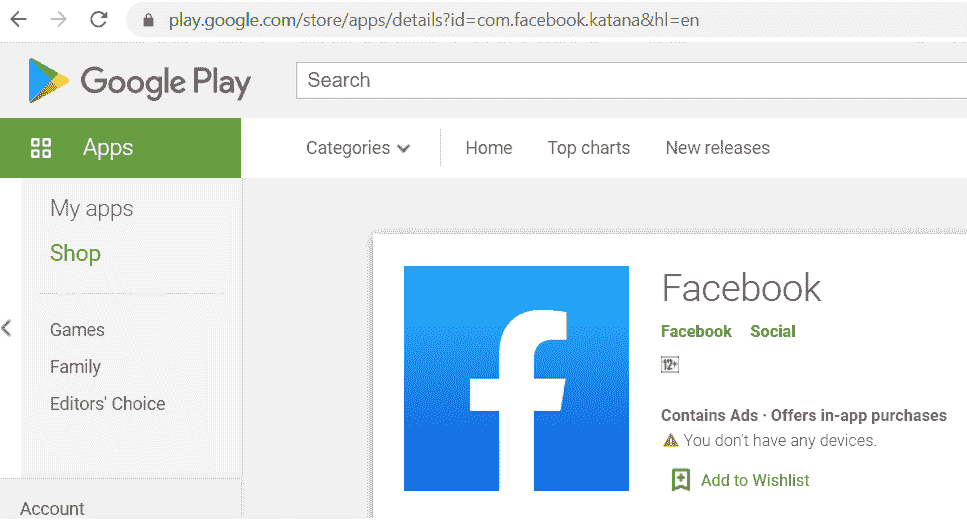

Google Play 商店中的 Facebook 应用

1.  通过执行`adb shell pm path`命令，识别所需包的 APK 文件完整路径，如下所示：

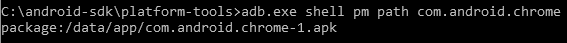

确定 APK 的完整路径名

1.  使用`adb pull`命令将 APK 文件从 Android 设备拉取到取证工作站：

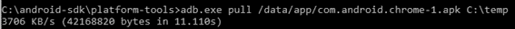

adp pull 命令

现在，让我们分析 APK 文件的内容。Android 包是 Android 应用程序的资源和可执行文件的容器。它是一个压缩文件，包含以下文件：

+   `AndroidManifest.xml`：此文件包含关于权限等信息。

+   `classes.dex`：这是通过 dex 编译器将类文件转换成的 dex 文件。

+   `Res`：应用程序的资源文件，例如图像文件、音频文件等，存储在此目录中。

+   `Lib`：此目录包含应用程序可能使用的本地库。

+   `META-INF`：此目录包含应用程序签名的信息以及所有其他文件的签名校验和。

一旦获得 APK 文件，您可以继续对 Android 应用进行逆向工程。

# 逆向工程 Android 应用的步骤

APK 文件可以通过不同的方式进行逆向工程，以获取原始代码。以下是一种方法，它使用 `dex2jar` 和 JD-GUI 工具来访问应用程序代码。以我们的示例为例，我们将分析 `com.twitter.android-1.apk` 文件。以下是成功逆向工程 APK 文件的步骤：

1.  将 APK 扩展名更改为 ZIP 以查看文件内容。将 `com.twitter.android-1.apk` 文件重命名为 `twitter.android-1.zip`，并使用任何文件压缩工具提取此文件的内容。以下截图显示了从原始文件 `twitter.android-1.zip` 中提取的文件：

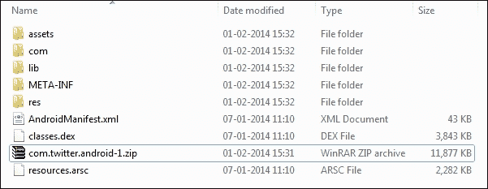

APK 文件提取的内容

1.  我们之前讨论过的 `classes.dex` 文件可以在提取 APK 文件内容后访问。这个 dex 文件需要转换为 Java 类文件，可以使用 `dex2jar` 工具来完成此操作。

1.  从 [`github.com/pxb1988/dex2jar`](https://github.com/pxb1988/dex2jar) 下载 `dex2jar` 工具，将 `classes.dex` 文件放入 `dex2jar` 工具目录中，并执行以下命令：

```
C:\Users\Rohit\Desktop\Training\Android\dex2jar-0.0.9.15>d2j- dex2jar.bat classes.dex dex2jar classes.dex -> classes-dex2jar.jar
```

1.  当上述命令成功运行后，它将在同一目录下创建一个新的 `classes-dex2jar.jar` 文件，如下图所示：

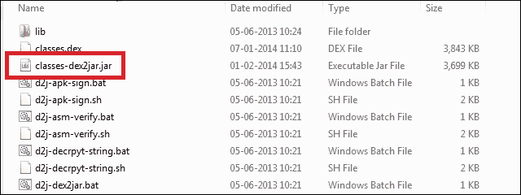

dex2jar 工具创建的 classes-dex2jar.jar 文件

1.  要查看此 JAR 文件的内容，您可以使用 JD-GUI 等工具。如以下截图所示，可以查看 Android 应用程序中存在的文件及其对应的代码：

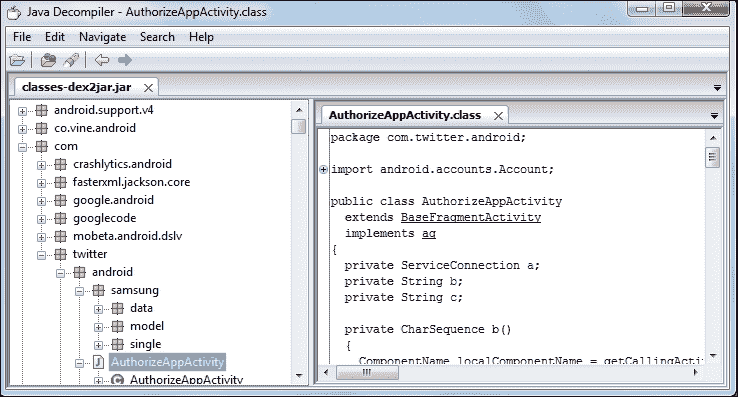

JD-GUI 工具

一旦我们获取到代码，分析应用程序如何存储值、权限以及其他有助于绕过某些限制的信息就变得容易了。当设备中发现恶意软件时，逆向工程和分析应用程序的方法可能非常有用，因为它将显示恶意软件正在访问哪些内容，并提供有关数据发送位置的线索。以下章节将详细讨论 Android 恶意软件。

# Android 恶意软件

随着 Android 市场份额的不断增加，针对 Android 用户的攻击或恶意软件也在增加。移动恶意软件是一个广泛的术语，指的是执行非预期操作的软件，包括特洛伊木马、间谍软件、广告软件、勒索软件等。根据 pandasecurity 的数据，Android 设备感染恶意软件的概率是 iOS 设备的 50 倍 ([`www.pandasecurity.com/mediacenter/mobile-security/android-more-infected-than-ios/`](https://www.pandasecurity.com/mediacenter/mobile-security/android-more-infected-than-ios/))。根据 Cybersecurity Hub 的新闻报道，2019 年，著名的 Agent Smith 恶意软件就感染了近 2500 万部 Android 设备 ([`www.cshub.com/malware/articles/incident-of-the-week-malware-infects-25m-android-phones`](https://www.cshub.com/malware/articles/incident-of-the-week-malware-infects-25m-android-phones))。

这种情况的主要原因之一是，与由 Apple 严密控制的 App Store 不同，Google 的 Play Store 是一个开放生态系统，没有任何详细的前期安全审查。恶意软件开发者可以轻松地将他们的应用上传到 Play Store，从而分发他们的应用。Google 目前拥有一款名为 Google Bouncer 的恶意软件检测软件，它会自动扫描上传的应用程序是否含有恶意软件，但攻击者已经找到几种方法可以绕过检测。此外，Android 官方允许我们加载通过互联网下载的应用（侧载），而 iOS 则不允许加载未签名的应用。

例如，如以下截图所示，当在 Android 设备上选择“未知来源”选项时，它允许用户安装从任何网站下载的应用：

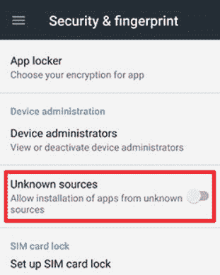

Android 中的侧载选项

托管 Android 应用的第三方应用商店已知是恶意软件的温床。这促使 Google 从 Android 4.2 开始推出 *验证应用* 功能，它会在 Android 设备上本地扫描应用，查找恶意活动，例如短信滥用。如以下截图所示，验证应用功能可能会警告用户，或者在某些情况下甚至会阻止安装。然而，这是一个自愿服务，因此用户可以选择禁用此功能：

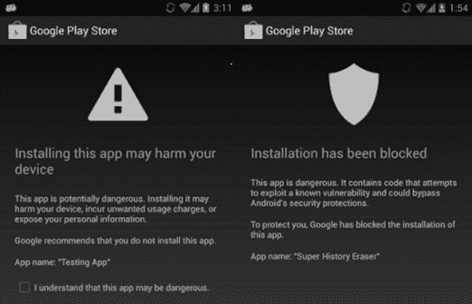

Android 中的验证应用功能

从 Android Oreo 开始，Google 推出了一个名为 Play Protect 的新功能，它是验证应用功能的改进版。Play Protect 的主要任务是阻止或警告用户已安装在 Android 设备上的恶意或有害应用。例如，如以下截图所示，Play Protect 功能在应用安装过程中可能会显示警告信息：

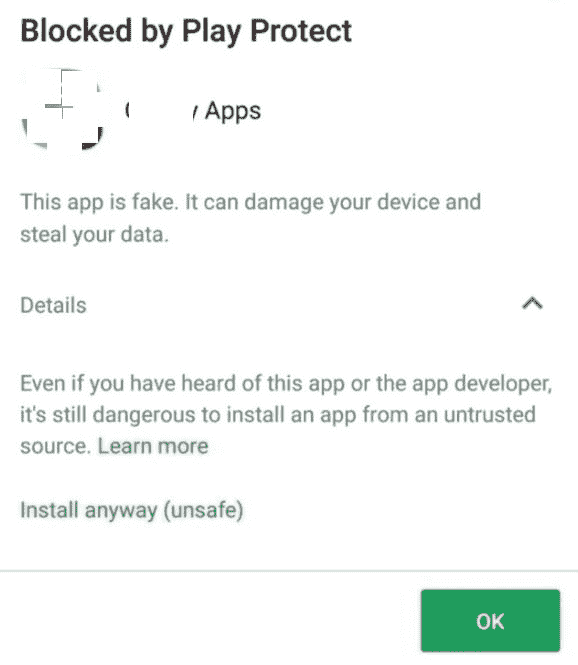

Play Protect 功能

接下来，让我们来看看恶意软件的类型。

# Android 恶意软件的类型

有多种类型的恶意软件可以感染 Android 设备。以下是一些最常见的类型：

+   **银行木马**：它可以伪装成虚假的银行应用程序，以窃取用户输入的银行凭据，或窃取用户账户中的任何其他敏感个人信息。银行木马可以拦截或修改银行交易，并执行发送、删除和拦截短信消息以及键盘记录等危险操作。

+   **间谍软件**：间谍软件监视、记录并将目标设备的重要信息发送到攻击者的服务器。这些信息可能包括短信消息、录音电话、截屏、键盘记录、电子邮件或任何可能对攻击者感兴趣的应用程序数据。例如，Kaspersky Lab 专家在 2018 年初发现的 BusyGasper 间谍软件，不仅具有收集来自 WhatsApp、Viber 和 Facebook 等热门通讯应用的信息的常见间谍软件功能，还具有设备传感器监听器，包括运动检测器。

+   **广告软件**：广告软件是另一种在 Android 设备上非常常见的恶意或不需要的应用程序类型。它相对容易检测，因为受害者会在设备屏幕上收到持续的弹出窗口和广告。这些不受欢迎的程序并不总是无害，因为弹出窗口可能导致下载其他恶意软件，包括前述的间谍软件和银行木马。

+   **勒索软件**：勒索软件主要攻击目标是基于 Windows 的桌面计算机和服务器，但也存在于移动平台上，尤其是在 Android 上。通常情况下，它只会锁定设备屏幕并附上勒索通知，但有时也会加密用户的数据。

+   **加密货币挖矿恶意软件**：由于加密货币如今极为流行，因此这种类型的恶意程序甚至在移动平台（如 Android）上也有。此类应用程序的目标是利用受害者设备的计算能力进行加密货币挖掘。有时，这种类型的恶意软件甚至会使智能手机硬件面临风险。

高级恶意软件还能够对设备进行 Root 操作并安装新的应用程序。例如，2016 年 2 月发现的 Android Mazar 恶意软件通过短信传播，能够在手机上获得管理员权限，从而可以抹掉手机、打电话或读取短信。

完整的 Android 恶意软件家族列表及其功能可以在[`forensics.spreitzenbarth.de/android-malware/`](https://forensics.spreitzenbarth.de/android-malware/)找到。

一旦恶意软件侵入设备，它可以执行以下危险操作之一：

+   发送和阅读您的短信消息

+   窃取敏感数据，如图片、视频和信用卡号码

+   操纵设备上存在的文件或数据

+   向高费率号码发送短信

+   感染您的浏览器并窃取其输入的任何数据

+   抹掉设备上的所有数据

+   锁定设备，直到支付赎金

+   持续展示广告

现在我们已经了解了不同类型的恶意软件，接下来我们将看看恶意软件是如何在您的设备中传播的。

# 安卓恶意软件是如何传播的？

安卓设备可以通过多种方式感染恶意软件。以下是一些可能的传播方式：

+   **重新包装合法应用**：这是攻击者使用的最常见方法。首先，攻击者下载一个合法的应用并进行反编译。然后，他们添加恶意代码并重新打包应用。这个新的恶意应用现在功能和合法应用相同，但在后台执行恶意活动。这类应用通常出现在第三方安卓应用商店，并被许多人下载。

+   **利用安卓漏洞**：在这种情况下，攻击者利用安卓平台中发现的漏洞或缺陷，安装他们的恶意应用程序或执行任何不必要的操作。例如，2015 年发现的安装程序劫持问题，攻击者利用这一漏洞，在安装过程中将安卓应用程序替换为恶意软件。

+   **蓝牙和 MMS 传播**：恶意软件也可以通过蓝牙和 MMS 传播。当设备处于可发现模式时，受害者会收到恶意软件，例如当设备可以被其他蓝牙设备看到时。在 MMS 的情况下，恶意软件会作为附件发送，就像计算机病毒通过电子邮件附件发送一样。然而，在这两种方法中，用户至少需要同意一次运行文件。

+   **应用下载恶意更新**：在这种情况下，原本安装的应用不包含任何恶意代码，但应用程序中的某个功能会在运行时下载恶意命令。这可以通过隐秘更新或用户更新进行。例如，Plankton 恶意软件使用隐秘更新，直接从远程服务器下载 JAR 文件，并且不需要任何用户权限。在用户更新的情况下，用户必须允许应用下载新版本的应用。

+   **远程安装**：攻击者可能会破坏用户设备帐户的凭证，从而远程在设备上安装应用程序。这通常发生在有针对性的场景中，且相比前面描述的两种方法，发生的频率较低。

现在我们已经看过了安卓恶意软件传播的可能方式，接下来让我们尝试识别设备中是否存在恶意软件。

# 识别安卓恶意软件

从取证的角度来看，在进行任何分析之前，首先要识别设备上是否存在恶意软件。这是因为恶意软件可能会改变设备的状态或设备上的内容，从而使分析或结果变得不一致。市场上有一些工具可以分析物理提取数据，识别恶意软件。例如，Cellebrite UFED Physical Analyzer 配备了 BitDefender 的反恶意软件技术，可以扫描恶意软件。如下图所示，一旦物理镜像加载到工具中，就可以扫描文件中的恶意软件：

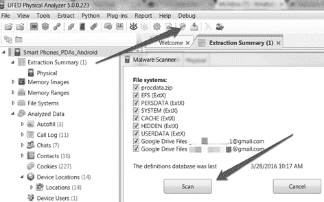

在 UFED Physical Analyzer 中扫描恶意软件

一旦扫描开始，BitDefender 软件会尝试解包 `.apk` 文件，并寻找感染或恶意文件。这个过程是自动的，工具会指示出恶意应用程序，如下图所示：

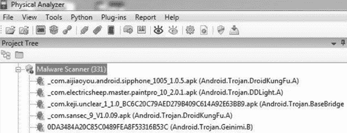

UFED Physical Analyzer 中的恶意软件扫描结果

该工具仅指出设备上存在恶意内容。取证调查员需要手动确认这是否是一个有效的问题，通过分析相关应用程序来确认。这正是我们在前面讨论过的逆向工程技能派上用场的时候。一旦应用程序被逆向工程并且获得了代码，建议你查看 `AndroidManifest.xml` 文件，了解应用程序的权限。这将有助于理解应用程序将数据存储在哪里、它尝试访问哪些资源等。例如，手电筒应用程序不需要读写你 SD 卡的数据，或者拨打电话的权限：

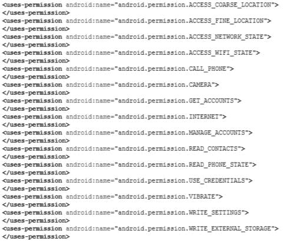

AndroidManifest.xml 文件中的权限

另外，你也可以将 `.apk` 文件上传到 VirusTotal，这是一个免费的服务，用于分析可疑文件中的恶意软件。VirusTotal 会通过 55 个杀毒引擎扫描你的文件。需要特别注意的是，如果 `.apk` 文件中的细节被混淆，工具可能无法识别出有效的恶意软件。因此，作为一名取证调查员，掌握逆向工程的技能，分析可疑应用程序的代码，识别恶意行为是非常重要的。

在一些调查中，设备上存在的恶意软件的性质可能会帮助得出某些关键结论，这些结论可能会影响案件的结果。例如，考虑一起涉及向其他员工发送辱骂性信息的公司内部调查。如果能在发送信息的设备上识别到恶意软件，将有助于解决此案件。

# 总结

Android 应用分析帮助取证调查员在设备的相关位置寻找有价值的数据。逆向工程 Android 应用是从 APK 文件中提取源代码的过程。使用某些工具，如 `dex2jar`，可以对 Android 应用进行逆向工程，以了解其功能和数据存储、识别恶意软件等。在本章中，我们对不同的 Android 应用进行了分析，现在能够从中提取数据。我们还学习了不同类型的 Android 恶意软件及其识别方法。像 UFED Physical Analyzer 这样的工具配备了 BitDefender 软件，可以自动扫描恶意软件。

下一章将介绍如何对 Windows Phone 设备进行取证分析。
