# 第一章：基本的安全概念

在这个不断发展的技术世界中，安全和数据隐私至关重要。本章将介绍 IT 基础设施安全的一些基本概念。为了确保系统安全，关键任务是识别和分类信息资产，并定义一个安全框架。

本章将介绍安全对网络和系统管理员意味着什么。还将探讨如何构建一个安全的网络，结合你所定义的安全框架中的安全原则。

让我们从网络基础设施安全开始。本章将涵盖以下主题：

+   为什么需要安全？

+   信息安全的构建模块

+   计算机安全

+   网络安全

+   互联网安全

+   安全问题、威胁和攻击

# 为什么需要安全？

随着互联网的不断发展以及现代计算机网络技术的进步，网络安全已成为每个人最重要的因素之一。这包括从终端用户到**中小型企业**（**SMBs**）再到云服务提供商的每个人。

由于网络攻击的数量不断增加，网络安全应在设计网络架构时成为优先考虑的事项。为了理解这一点，试想一下如果银行、证券交易所或其他金融数据库发生网络完整性漏洞，可能会带来什么后果。

网络安全的重要性不仅限于 IT 行业。它在医疗等行业中同样重要。健康记录包含一些最有价值的信息，包括社会保险号码、家庭住址和病人的健康历史。如果这些数据被未经授权的人访问，它可能会被盗取或出售给黑市。

安全意识对每个人都很重要，而不仅仅是 IT 部门的责任。如果你使用联网设备，这也是你的责任。然而，只有了解如何确保安全后，你才能控制信息安全。

在系统受到威胁之前，没有人能够进入你的系统。同样，如果你的门从外面上了锁，除非有人获得了复制钥匙或通过物理接触获得锁的类似钥匙，否则没有人能进入你的房子。以下是一些系统可能受到威胁的例子：

+   可能会向随机用户发送带有附件的定向邮件（Drive by Download）。如果用户打开该附件，他们的系统将会被攻破。

+   收到一封伪装成银行等领域的邮件，要求你通过提供的链接更改密码。一旦你这样做，你的用户名和密码可能会被盗取。

+   如果在浏览器中输入网站地址时犯了一个小小的错别字，可能会打开一个类似的页面（**网络钓鱼**），而这个页面并不真实，你的凭证可能会被盗取。

+   用于重置忘记密码的功能也可能非常危险。假设有人知道我的电子邮件 ID，并试图通过选择忘记密码选项来访问我的帐户。如果安全问题要求提供我的出生日期，这个信息很容易从我的简历中找到。

+   一个 Excel 文件的密码可以通过暴力破解攻击轻易破解。

+   最广泛的勒索软件类型会加密你电脑上所有或部分数据，然后要求支付一笔大额费用（赎金）以恢复对数据的访问。

+   在 DNS 劫持期间，在线攻击者将覆盖你电脑的 TCP/IP 设置，从而改变 DNS 解析。例如，输入`abc.com`会将其解析为此 IP：`140.166.226.26`。然而，DNS 劫持者会更改解析，使得`abc.com`将转到另一个网站的 IP 地址。

+   拒绝服务（DoS）网络攻击通过发送大量的流量扰乱目标服务的正常流量量。这可能会以各种方式造成损害。例如，如果某公司有周五的促销活动，而竞争对手发动攻击以关闭其服务，从而增加自己的销售额。

根据英国保险公司 Lloyd's 的研究，*黑客造成的损害每年让企业损失 4000 亿美元*。

要进一步了解网络犯罪的成本，请访问以下网页：[`www.forbes.com/sites/stevemorgan/2016/01/17/cyber-crime-costs-projected-to-reach-2-trillion-by-2019/#612db25c3a91.`](https://www.forbes.com/sites/stevemorgan/2016/01/17/cyber-crime-costs-projected-to-reach-2-trillion-by-2019/#612db25c3a91)

市场研究公司 Gartner 估计，2018 年全球在网络安全上的支出约为 960 亿美元。到 2020 年，预计全球公司将花费约 1700 亿美元——未来五年增长率接近百分之十。

# 信息安全的构建模块

你的数据可以轻松分为以下三类。了解这些分类尤其重要，因为它有助于在制定安全计划之前确定你的数据的价值：

+   **低业务影响**（**LBI**）：如果 LBI 数据被泄露，可能会发生有限的信息丢失。这类数据的例子包括姓名、性别和/或居住国家。

+   **中等业务影响**（**MBI**）：如果 MBI 数据被泄露，可能会发生灾难性的数据信息丢失，直接损害组织的声誉。MBI 数据的例子包括名字、姓氏、电子邮件 ID、邮寄地址和电话号码。

+   **高业务影响**（**HBI**）：如果 HBI 数据被泄露，可能会发生严重的信息丢失。访问权限必须受到控制，并限制在必要的知情范围内。HBI 数据的例子包括政府 ID、信用卡信息、医疗健康记录、密码和实时位置。

需要适当的安全控制措施来确保严密的安全性。以下流程图帮助我们理解安全过程：

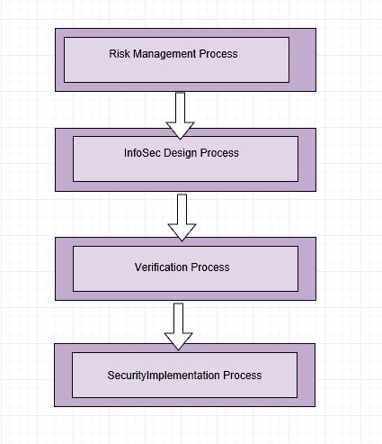

+   **风险管理过程**：在设计安全网络时，这一点尤其重要。必须提前进行风险管理分析，因为这有助于设计安全的基础设施。步骤应包括风险识别、风险分析、风险排序和缓解计划。例如，ISP 连接可以是公共或私有的**广域网**（**WAN**）连接。通过公共基础设施进行的两个站点之间的数据传输可以通过实施 VPN 来保障安全。通过私有链接进行的两个站点之间的数据传输可以通过链接设备未来加密。必须识别连接的目的和资金来源，并在安装或激活任何链接之前进行适当的风险评估。

+   **信息安全设计过程**：必须定义并记录外围边界。例如，连接到 WAN 互联网或通过 WAN 连接到其他地点必须被定义。当我说到*边界*时，我们应该始终采取分层的方法。没有理想的情况可以确保 100%的安全性，但通过在每一层实施安全措施，你可以确保严密的安全性。分层安全方法涵盖了技术和非技术的安全措施。

    例如，外围安全可以通过防火墙进行保护。必须识别基础设施细节，如服务器类型和系统中运行的服务。软件和操作系统的漏洞应记录下来。IP 空间和安全区应定义清楚。系统管理员访问权限应由安全组控制。

+   **验证过程**：每个外部网/内部网连接的验证过程目的是生成所有在安全设计合规程序中记录的审计证据。它将包含有关用户、远程 IP 以及他们执行的任务的信息。网络扫描、渗透测试和得分报告提供了基础设施安全的深入视图。

    定期审计总是必需的，以便了解是否存在意外活动。例如，防火墙日志、来自 IIS 负载均衡器的 TCP/IP 头信息、以及双重身份验证都是验证过程的示例。

+   **安全实施过程**：在这个阶段，你应该准备好以下项目以便实施：

    +   安全策略—密码策略和访问控制

    +   灾难恢复计划

    +   备份和恢复计划

    +   WAN 恢复计划

    +   网络安全区

    +   数据库安全

    +   IIS 或网页安全

    +   数据与资产分类

    +   数据加密

    +   应用用户的资源控制

    +   操作系统安全

    +   事件管理与响应

    +   变更管理和版本控制

# 计算机安全

计算机安全不仅仅是关于终端用户计算的，它还包括服务器/应用程序基础设施。对于服务器和客户端之间的任何数据传输，双方都应确保安全。即使是通信渠道，也应足够安全，以避免数据盗窃。

我们知道专业人员了解网络安全，但终端用户呢？我们可以强制用户实施安全策略，但那就够了吗？为了更好的安全性，意识是关键。我们每天使用的软件中经常会发现安全问题，包括常见且可靠的程序，如 Windows、Internet Explorer 以及 Adobe 的 PDF 阅读器。因此，采取一些简单的措施来提升安全性是非常重要的。

人们常常将计算机安全看作是技术复杂的事情，但实际上并非如此。接下来，我们将探讨一些最基本且重要的事情，帮助你在网上更加安全：

+   使用杀毒软件和反恶意软件，并了解哪些邮件链接是安全的可以点击的。

+   小心你下载和运行的程序；不要轻信弹出通知。

+   在服务器层面，可以使用加密芯片来避免硬件被盗。

大多数计算机设施在保护其物理资产方面做得比数据要好得多，即使数据的价值远远高于硬件的价值。

由于意识尤为重要，我们还应考虑组织内的意识水平。可以通过发送一些看起来真实的电子邮件，并统计有多少用户打开了这些邮件，来简单地实现这一点。活动可以通过数字进行跟踪。例如，可以查看有多少用户分享了密码，有多少人下载了附件。

# 网络安全

在今天复杂的网络架构和不断增长的网络环境下，保护数据和维护机密性发挥着非常重要的作用。复杂的网络包括企业网络、数据中心网络以及当然还有云端网络之间流动的网络流量。一个安全的网络帮助我们防止数据丢失、网络攻击和未经授权的访问，从而提供更好的用户体验。网络安全技术使得多个平台具备处理具体保护需求的能力。

# 防火墙

防火墙是一种网络安全设备，根据配置的规则和预配置的策略接受或拒绝流量。防火墙的放置完全取决于网络架构，包括对网络边缘、子网和区域的保护。外围防火墙始终放置在网络边缘，以过滤进入网络的数据包。外围防火墙是安全的第一层，如果恶意流量设法绕过了，主机防火墙通过允许或拒绝进入端主机设备的数据包提供另一层保护。这被称为多层安全方法。可以设置多个防火墙来设计高度安全的环境。

防火墙通常部署在网络的其他部分，以在企业基础架构内的访问层和数据中心提供适当的分段和数据保护。

防火墙可以进一步分类为以下几种：

+   简单的数据包过滤

+   应用程序代理

+   有状态检查防火墙

+   下一代防火墙

传统防火墙提供诸如**数据包地址转换**（**PAT**）、**网络地址转换**（**NAT**）和**虚拟专用网络**（**VPN**）等功能。传统防火墙的基本特征是根据规则工作。例如，来自子网（`10.10.10.0/24`）的用户希望在 UDP 端口`53`上访问 Google DNS `8.8.8.8`。

典型的防火墙规则如下所示：

| **源 IP** | **目标 IP** | **协议** | **端口** | **动作** |
| --- | --- | --- | --- | --- |
| `10.10.10.0/24** | **8.8.8.8/32` | UDP | `53` | 允许 |

然而，下一代防火墙基于应用程序和用户感知策略工作。应用程序级别的控制允许您根据用户和应用程序设置策略。

例如，您可以完全阻止**对等下载**（**P2P**）或者禁用 Facebook 聊天，而不影响 Facebook 的其他功能。

我们将在接下来的章节中详细讨论防火墙。以下图表反映了区域和连接性，展示了防火墙区域如何连接到多个业务：

+   **非军事区（DMZ）**：面向互联网的应用程序位于 DMZ 中。其他区域的服务对互联网不可访问。放置在 DMZ 中的最常见服务包括电子邮件服务、FTP 服务器和 Web 服务器。

+   **内部区域**：内部区域被用户称为受信任的区域。该区域内的应用程序被认为是高度安全的。在受信任区域中，默认情况下通过防火墙拒绝来自较不受信任区域的所有流量。

+   **云和互联网区域**：我们不要专注于对这些区域的命名。它们是企业网络中常见的标准段。这些区域被认为是低于安全区域。

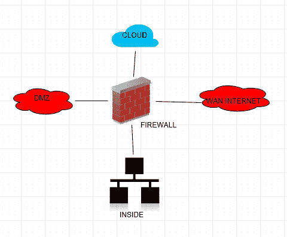

# 入侵检测系统 / 入侵防御系统

攻击进入网络的可能性很高。**入侵防御系统**（**IPS**）/**入侵检测系统**（**IDS**）是一种主动措施，用于检测和识别表示入侵的可疑或不希望发生的活动。在 IDS 中，部署可以是在线的或离线的，基本思想是将您希望监控的流量进行重定向。有多种方法，如交换机端口 SPAN 或光纤 TAP 解决方案，可以用于重定向流量。模式匹配用于通过签名和异常检测已知攻击。根据活动，可以设置监控警报，以便通知网络管理员。

如下图所示，SPAN 端口在交换机上配置，以便将流量重定向到 IDS 传感器。实际的 SPAN 端口会为特定接口流动的数据创建副本，并将其重定向到交换机上的另一个端口：

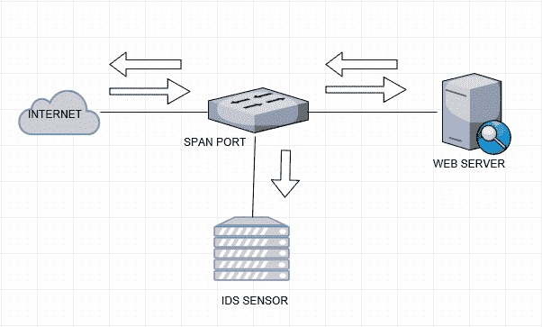

IPS 提供了针对不需要的网络流量的主动检测和预防功能。在 IPS 的内联部署中，所有流量将通过 IPS 设备传输。根据规则，可以采取相应的措施。当在 IPS 设备上检测到签名时，可以用来重置、阻止和拒绝连接，以及日志记录、监控和报警。系统管理员还可以定义基于策略的方法，设定政策违规规则和措施，以便在已知签名发布时牢记。行动应由系统管理员定义。

下图展示了 IPS 的内联部署拓扑结构。所有流量都经过 IPS 设备进行流量检测。这与端口 SPAN 有所不同，因为所有数据都会经过 IPS 设备。因此，您需要了解必须检测的数据类型：

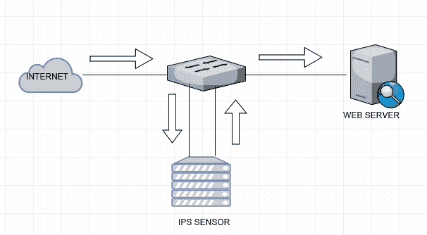

有许多不同类型的攻击可以通过 IPS 进行防御，包括：

+   拒绝服务

+   分布式拒绝服务

+   漏洞利用

+   蠕虫

+   病毒

# 多层拓扑结构

多层拓扑结构为您提供了基于角色和访问策略来分段资源的灵活性。在典型的三层应用架构中，具有 Web、应用程序和数据库服务器的架构可以根据位置进行分配。由于 Web/应用区始终暴露给最终用户，**隔离区**（**DMZ**）的 IP 空间始终是公开的。子网和数据库服务器不应直接访问，因此我们应该始终分配来自 RFC 1918 的私有 IP 空间。

**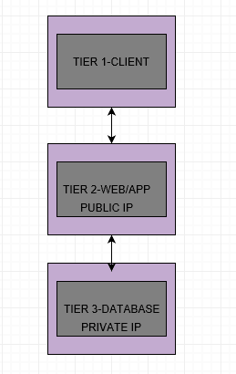**

这提供了基于 IP 和资源位置逐步控制的访问。当设计网络时，您可以引入多层防火墙方法。在多层设计方法中，基本思想是将资源彼此隔离，考虑到如果一层被攻破，其他层不会受到影响。

**跨站点 IPsec 隧道** 提供了一种在两个网络和多个本地站点之间，或在 Azure/AWS 中的其他虚拟网络之间建立安全连接的方法。这可以通过使用 IPsec 框架加密数据，确保数据传输的安全。在 AWS 中，虚拟网络称为 VPC，而在 Azure 中，则称为 VNET。

**分布式拒绝服务**：**拒绝服务**（**DoS**）攻击或**分布式拒绝服务**（**DDoS**）攻击是试图使网络资源对目标用户不可用的行为。

现实世界中的目标可能是在线服务，如电子商务和游戏行业，通过使前端资源对最终用户不可用来阻止商店进行任何业务。想象一下在大型购物节的销售时段，如果有人发起了 DDoS 攻击，使得你的电子商务门户关闭。

DDoS 攻击的两种最基本类型如下：

+   **WAN 攻击**：WAN DDoS 攻击利用物理链路上的可用带宽，通过传输大负载的高频数据包，或传输小负载的大量数据包。较大负载的网络资源，如路由器或防火墙，将处理这些数据包并消耗所有带宽。对于较小负载的网络资源，像路由器和防火墙将尝试处理所有数据包。然而，由于有限的 CPU 和硬件资源，可能无法处理来自最终用户的真实数据包，并可能因负载过重而失败。

+   例如，假设你有一个 10 Mbps 的 WAN 链接，在攻击带宽期间，利用率仅为 5 Mbps。然而，大量小数据包每秒可达到一百万个数据包。在这种情况下，假设你的网络设备没有足够的 CPU 周期来处理所有这些小数据包。

    另一个例子是，如果有人发起了一个使用大 ICMP 数据包的 DDoS 攻击。这会占用你的带宽，导致其他应用程序无法运行。

+   最常见的带宽攻击形式是数据包泛滥攻击，攻击者向目标或指定目的地发送大量合法的 TCP、**用户数据报协议**（**UDP**）或**互联网控制报文协议**（**ICMP**）数据包。如果攻击者使用伪造源地址等技术，这种攻击会变得更难检测。

+   ****应用程序攻击****：这些 DDoS 攻击利用了 TCP 和 HTTP 等协议的预期行为。应用程序攻击具有破坏性，但其规模小且隐蔽，非常难以检测，因为它们利用的是预期行为。应用层攻击很容易生成，并且需要更少的数据包和小负载就能让目标应用服务中断。应用程序攻击的目标是网页应用层。对于一个小的 HTTP 请求，实际服务器需要在网页服务器上执行大量资源操作，以获取内容或资源。每个这样的服务器资源都有有限的 CPU 和内存，容易成为攻击目标。在这个例子中，我并没有考虑基于云的网页应用程序，因为这些应用程序具备弹性特性，随着请求数量的增加，服务器资源会自动创建以适应这些请求。

让我们通过一个例子更好地理解这一点：

+   **HTTP 洪水攻击**：这是一种简单的攻击方式，试图通过自动化方式反复访问同一个网页。它们通常使用相同范围的 IP 地址。根据趋势，由于这些攻击来自相同来源，因此可以阻止源 IP 池来缓解攻击。

+   **随机 HTTP 洪水攻击**：这是一种复杂的攻击，使用来自多个位置的大量 IP 地址，并随机化 URL。由于这些攻击来自多个位置，因此很难阻止源 IP。然而，可以对服务器资源设置速率限制。

简单来说，DDoS 攻击是一种通过多个被攻破的网络/主机来攻击单一系统的攻击方式。这就像僵尸攻击，非常难以识别真正的用户。一旦感染，联网设备便成为僵尸网络的一部分，向目标发送恶意流量。

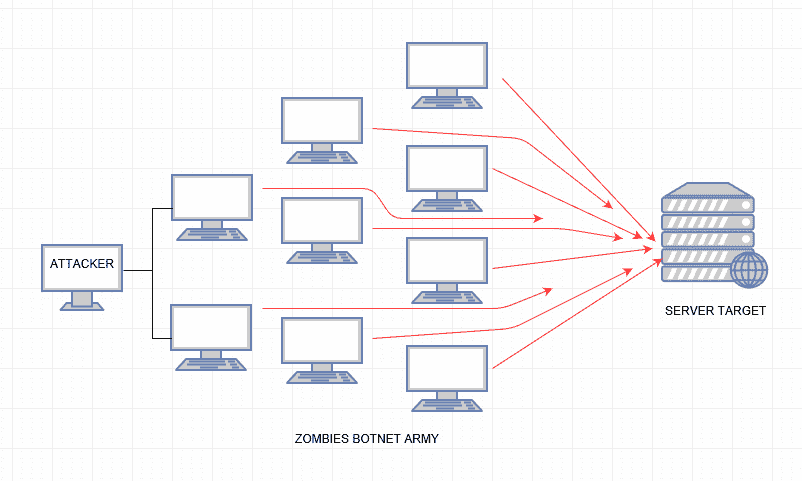

# 互联网安全

这些是你在使用在线系统时需要理解的基本内容。在日常使用中，我们会暴露自己于各种风险之中。

让我们深入了解互联网安全的基本组成部分。

# 密码

由于我们拥有互联网连接设备，因此我们对自己的安全负责。那么，让我们从密码开始。作为用户，我们必须选择一个强密码。或者，组织应鼓励用户选择一个强密码。

密码分析表明，`123456`及其他类似的简单模式是用户常用的密码。大多数用户在多个平台上选择相同的密码。如果服务器或数据库被黑客攻击，像这样的密码就容易被破解。

很多常见的网页门户包含个人信息。然而，如果要求员工创建一个由其姓名和员工编号组成的用户名，并且与一个简单的默认密码（如`abcX123`）结合使用，那么他们的信息就很容易被猜测。

# 系统升级与更新

WannaCry 勒索病毒攻击是 2017 年 5 月发生的全球网络攻击，由 WannaCry 勒索病毒加密蠕虫引发。这次攻击主要针对运行 Microsoft Windows 操作系统的计算机，通过加密数据并要求以比特币支付赎金。这种感染发生的原因是人们使用过时的软件，攻击者正是利用了这一点。这不仅限于个人电脑，还包括移动设备和其他联网设备。

# 网络钓鱼

网络钓鱼是一种在线欺诈形式，你会收到看似来自可信来源的电子邮件。该消息可能会要求你通过登录伪造网站来验证、确认或更新你的账户信息。目标通过电话、电子邮件和短信与受害者联系，借此窃取信用卡信息和密码。

这是我自己的电子邮箱，里面有一条信息说我应该收到 13,17422 印度卢比，并需要更新我的详细信息。虽然攻击者使用金钱作为诱饵，但重要的是要思考一下关于你 IT 部门的事情。是否应该期望收到这种类型的邮件？仅仅通过查看电子邮件标题，你就可以轻松判断出这不是一个真实的域名。按照此信息中的指示操作可能会带来灾难性的后果：

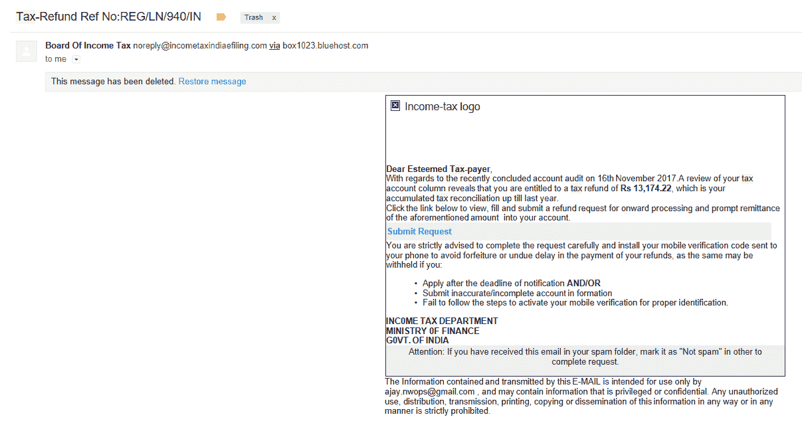

# 小心网络钓鱼电话

攻击者可能会打电话给你，声称通过向你出售软件许可或获取你的个人信息来解决你的计算机问题，以便在后台系统中更新你的信息。

一旦他们获得了你的信任，网络犯罪分子可能会要求你提供用户名和密码，或让你访问一个网站安装软件，从而让他们能够远程访问你的计算机进行修复。一旦你这样做，你的计算机和个人信息就会被劫持。

以同样的方式，银行诈骗也可能发生。这包括网络犯罪分子打电话给你，试图说服你分享你的信用卡和银行账户信息。

一些网络钓鱼电话的迹象包括：

+   您已被特别选中参与任何提供的项目

+   你在彩票中中奖了

+   你有所得税退税

+   有人询问信用卡 CVV 码和其他细节，以更新银行数据库

# 网络钓鱼防护

防范网络钓鱼攻击需要用户和企业共同采取措施。对于用户来说，提高意识是关键。伪造的消息通常包含一些错误，这些错误暴露了其真实身份。这些错误可能包括拼写错误或域名的更改，就像之前的 URL 示例中所看到的那样。用户还应停下来思考，为什么自己会收到这样的电子邮件或电话。

你应该将此类电子邮件报告给相关部门，以便采取适当的行动。

# 安全问题、威胁和攻击

我们每天都在使用计算机和手机连接互联网，查看电子邮件，进行在线交易，检查社交媒体，创建文件，拍摄朋友、家人或喜爱的地方的照片。

# 物联网安全风险

下一件将在我们生活中发挥重要作用的大事就是**物联网**（**IoT**）。一切都会连接到互联网——风扇、管灯、电冰箱、门、汽车，甚至在医疗术语中，我们的心脏——都可以连接到一个物联网传感器。这个清单会很长。想象一下，如果一个人的心率通过物联网传感器控制而被黑客攻击的情况。

最突出的物联网安全问题之一是个人使用相同的登录凭证进行所有操作的问题。

# 计算机安全风险

计算机安全风险是可能损坏或窃取数据，或未经用户通知允许未授权访问计算机的事件。你的计算机由操作系统和应用程序组成，其中大多数攻击都是通过恶意应用程序或坏软件实施的，换句话说，就是通过不良软件。通常认为所有损害仅由计算机病毒造成，但实际上有多种类型的不良软件。像后门程序、拨号器、间谍软件、病毒和蠕虫、键盘记录器、广告软件等特性都可能导致计算机安全风险。

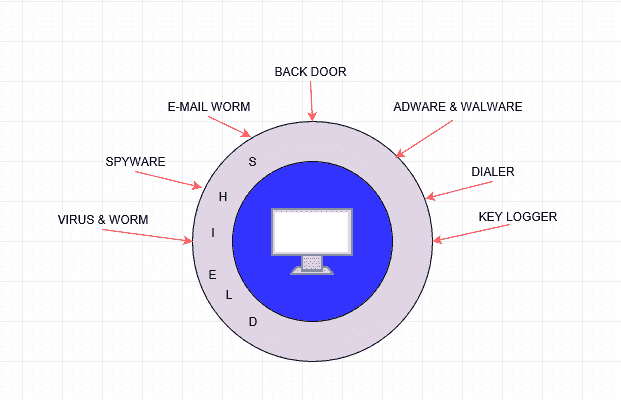

# 安全风险 - 边界网关协议

在网络世界中，设想一种情况，攻击者将他们的电缆插入你的网络，建立一个**边界网关协议**（**BGP**）会话，并嗅探进入线路的所有数据。这不仅限于嗅探你的信息，还可能给其他人带来很多麻烦。

例如：

+   **PTA 封锁 YouTube**：

    +   **场景**：巴基斯坦电信通过 PCCW 电信连接到全球互联网。

    +   **问题**：PCCW 未验证巴基斯坦电信广告的前缀，且 BGP 协议中没有内建的机制来验证信息。

    +   **影响**：对客户的拒绝服务（DoS）、流量重定向、前缀劫持和 AS 劫持。

+   2008 年 2 月 24 日，**巴基斯坦电信管理局**（**PTA**）开始发布 YouTube 的特定前缀。PTA 打算在巴基斯坦封锁对 YouTube 的访问，并广告了特定前缀`208.65.153.0/24`。这是 YouTube 使用的前缀之一`208.65.152.0/22-208.65.155.255`。目的是让 YouTube 的流量被转发到 Null0 接口，从而在巴基斯坦封锁 YouTube。然而，同一路由也被广告到上游 ISP（PCCW AS 号`3491`）。PCCW 也将此信息展示给其他对等方。于是 YouTube 启动了一个更具体的前缀（`208.65.153.128/25`）来恢复流量。

+   **中间人攻击（MITM）**：这是另一个例子。想象一个情况，你所在的组织中某个人通过配置交换机上的 SPAN，使得所有财务员工都能连接到这个网络进行数据监听。如果财务门户没有采取安全的访问方式，所有的用户名和密码信息都可能被提取出来。这就是我说应该为所有系统启用 HTTPS 的原因。即使黑客可以访问数据进行监听，他们也无法解密系统中的加密数据。这些类型的黑客行为属于 MITM 攻击，其中攻击者能够访问数据线路或劫持流量。

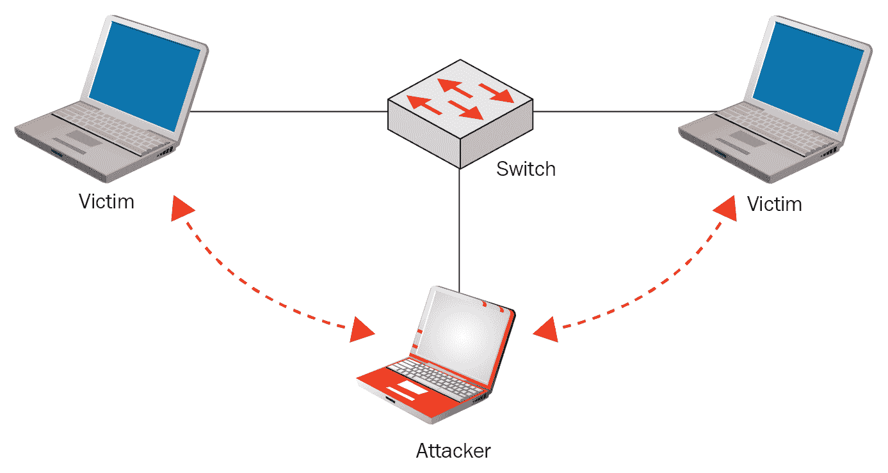

+   **地址解析协议**（**ARP**）：欺骗攻击可以是类似的攻击类型。对于局域网地址解析协议，必须知道计算机在**局域网**（**LAN**）中的身份。假设你在局域网中配置了互联网网关，并且所有互联网流量都经过该设备。攻击者可以进行 ARP 欺骗，将一个新系统伪装成互联网网关。现在所有的互联网流量都会经过攻击者的系统，他们可以监听你的数据。市场上有许多工具可以用来进行欺骗，它们的作用就是改变你机器的 MAC 地址。

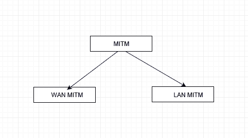

MITM 攻击可以进一步分为两类：WAN 和 LAN。

# 安全性和威胁

在一个日益互联的世界中，安全威胁不断发展，试图寻找新的方式来窃取或破坏数据。对于任何组织和任何有互联网连接系统的个人，保护这些信息变得尤为重要。恶意或无知的人为活动是计算机的主要威胁。恶意行为总是有一个目标，并且有特定的攻击对象。

攻击者通常有动机或目标。这些动机和目标通常遵循以下公式：

*动机 + 方法 + 漏洞 = 攻击*：

如下图所示，安全威胁由人为因素或自然灾害驱动。人为因素驱动的威胁可以进一步分为外部威胁或内部威胁，或者归因于用户的无知。我们将详细讨论这些威胁：

**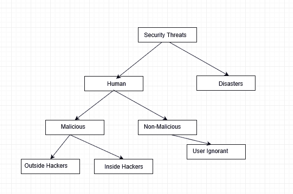**

# 自然灾害

自然灾害是由地球自然过程引发的重大不利事件。例子包括洪水、飓风、龙卷风、火山爆发、地震、海啸以及其他地质过程。没有人能阻止自然的进程。这些事件会对计算机系统造成严重损害。信息可能丢失，可能会发生停机或生产力损失，硬件损坏也可能中断其他关键服务。对自然灾害能采取的保护措施很少。最好的方法是制定灾难恢复计划和**业务连续性计划**（**BCP**）。

# 人为威胁

人为威胁包括内部攻击者或外部攻击者。内部攻击者可以是员工、供应商或拥有系统特权访问权限的承包商。外部攻击者则是指非员工或出于某种动机或目的，试图破坏和干扰组织的个人或团体。

最危险的攻击者通常是内部人员，因为他们可以访问系统并了解已有的安全措施。内部攻击可能是恶意的，也可能是疏忽的，甚至有时是偶然的。

世界上所有公司都必须应对员工的裁员和扩展。因此，控制和更改系统资产的权限是一个非常重要的行动项目。如果没有流程，且未能移除不再需要访问敏感资产的员工的权限，资产将暴露于未授权访问的风险之中。这常常是内部攻击的常见原因，但往往被忽视。

由于员工与雇主之间通常存在信任关系，大多数员工并非出于恶意。然而，无法确保所有员工都遵循这一点，因此最好的做法是保持谨慎，并采取适当的措施以防范内部威胁。

这里有一个经典例子：

一家公司的重要应用程序是由一名在公司工作多年的员工使用个人凭证操作的。然而，有一天公司解雇了这名员工。第二天，信息技术部门删除了他的凭证，结果该应用程序停止了工作。像这样的问题可能会对系统造成重大损害，并且肯定需要时间才能识别和修复问题。

人为安全威胁可能是非常简单的事情，比如一个人打开了一个附带恶意脚本或恶意软件的附件，这些脚本或恶意软件打开了系统的后门，允许外部人员提取信息。最糟糕的情况往往不是黑客突破内部系统，而是员工丢失了智能手机或笔记本电脑被盗。最好的防御是保护数据，而不仅仅是保护设备。这意味着要在文件级别进行加密，即使信息被盗，也能确保机密信息得到保护。

# 安全漏洞

恶意攻击者使用一种方法寻找目标资源，发现已知的漏洞，然后利用这些漏洞来实现某个目标。漏洞是安全中的弱点、配置错误或漏洞，攻击者通过这些漏洞获取对网络或网络资源的访问权限。

安全漏洞不仅限于 Web、SQL 数据库或操作系统。相同的方法适用于任何基础设施的网络设备。

这些是三个主要类别：

+   技术弱点

+   配置弱点

+   安全政策弱点

# 技术弱点

这些包括 TCP/IP 协议的弱点、操作系统的弱点、操作系统上运行的软件弱点和网络设备的弱点。

TCP/IP 是一组协议，用于通过网络传输数据。该协议组中最重要的部分是 IP，它代表网络中的用户身份。相关的主要协议包括：

+   **传输控制协议**（**TCP**）

+   **用户数据报协议**（**UDP**）

+   **互联网控制消息协议**（**ICMP**）

TCP 端口号用于标识应用程序。例如：

+   端口`21`：FTP

+   端口`23`：Telnet

+   端口`80`：HTTP

+   端口`443`：HTTPS

TCP/IP 本应提供两个主机之间的可靠连接，但没有内建安全功能，例如加密或身份验证。像 HTTP、FTP、TFTP 和 TELNET 这样的协议是不安全的，因为所有信息都是明文传输的。

SYN 洪水是一种 DoS 攻击形式，攻击者通过发送一系列 SYN 请求，试图占用目标系统所有的可用服务器资源，从而使系统无法对合法流量提供服务。

这是 TCP 三次握手的正常行为。SYN 数据包由用户发送，服务器确认后最终通过 ACK 回应。

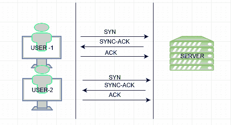

在 SYN 洪水攻击中，系统无法处理 SYN 数据包。攻击者（绿色）发送一系列 SYN 数据包，并且也会收到 ACK 回应。同时，攻击者消耗所有服务器资源，因此真正的用户（紫色）无法收到 SYN-ACK 回应。

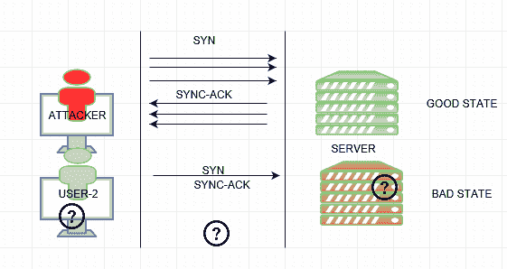

UNIX、Linux、Macintosh、Windows 和 OS/2 操作系统都存在安全问题。这些公司不时发布安全更新和漏洞修复。

路由器、防火墙、光纤设备和交换机等网络设备具有必须识别并加以保护的安全弱点。

在接下来的章节中，我们将详细讨论这些类型的攻击，分析如何在实际网络中应对它们。

# 配置弱点

作为网络/系统管理员，我们应该了解配置弱点是什么，以及如何为计算和网络设备采取纠正措施。

用户账户信息可能以明文方式在网络上传输，暴露用户名和密码给攻击者。例如，如果你通过 Telnet 管理设备，用户名和密码可能会被窃取。使用 HTTP 图形界面管理设备时，同样的风险也存在。

设备配置错误可能导致重大网络设备安全问题，并为未经授权的访问打开大门。例如，配置错误的访问控制列表、路由协议或 SNMP 社区字符串可能会造成严重的安全漏洞。配置错误的加密、缺少加密或使用低强度加密算法的远程访问控制也会引发严重的安全问题。

身份验证和授权是一个主要关注点。如果您想知道谁在网络设备或系统上做了什么，那么您可能希望通过启用日志记录的单一身份验证平台来集中身份验证，以便定期进行审计。

为了减少对您网络的威胁，最好的选择是在所有网络设备和计算系统上禁用任何未使用的服务。例如，如果您有一个 Web 服务器，您应该禁用 FTP、SMTP 和其他服务。另一个例子是，如果您正在使用 SSH 管理设备，您可以在同一台设备上禁用 Telnet、HTTP 和 FTP。

您应该只在设备上运行必要的应用程序。所有不必要的应用程序和服务都应该被禁用，以最大程度地减少对外部世界的暴露。

# 安全策略弱点

安全策略弱点可能会导致意想不到的安全威胁。如果系统管理员不遵循安全策略和行业最佳实践，网络基础设施本身可能对自身构成安全风险。每个组织都必须有一个安全策略，并且应该强制执行给所有用户/管理员/基础设施。当没有明确或书面的基线安全策略文件时，安全弱点就会出现。

始终遵循所有基础设施设备和网络的基线，以符合政策。应该建立系统来验证不符合规定的设备。例如，如果您在网络中有数百万台设备，很难检查它们是否都符合规定。然而，像 HPNA 和其他工具这样的系统可以扫描所有设备的基线配置集，并生成报告。

**单一密码验证**：有三种基本的身份验证方法：

+   用户名和密码

+   一次性密码

+   证书

在第一种方法中，密码基本上是用户定义的，证书是计算机生成的，基于密钥。暴力破解可以轻松破解密码；密码容易忘记，并且经常在多个服务或应用程序上重复使用。这些密码就像对称密钥一样，存储在服务的某个地方。服务提供者有责任保护您的密码。然而，在新闻中，我们经常听到密码数据库被黑客入侵，数百万个密码泄露。第三种方法基于密钥和强大的算法，但即使它们也不是 100%防不胜防，因为私钥也可能被盗。

**双因素认证**（**2FA**），通常称为两步验证，是一种安全流程，用户通过结合两种方法提供密码信息来验证用户是否真实。双因素认证通过保持密码的一部分静态和另一部分动态，在给定的时间间隔后不断更改，提供了额外的安全层。这使得攻击者更难以访问个人设备和在线账户；仅仅知道受害者的密码是不足以通过认证检查的，因为组合密码是动态的，并且与之关联有一个过期时间。长期以来，双因素认证一直被用于控制对敏感系统和数据的访问，越来越多的在线服务引入了 2FA，以防止黑客通过嗅探或窃取密码来访问用户的数据。

谷歌等公司正在遵循最佳实践。即使您更换智能手机或浏览器，您也会立即收到通知。公司采用智能卡认证以及电话认证的方法来验证用户的身份。银行业分发 RSA 令牌用于双因素认证。

# 使用未加密或弱加密的网站

诸如 Telnet、HTTP 或 FTP 等协议为中间人攻击打开了大门。其主要原因是这些协议不提供端到端加密。文件传输协议用于两个主机之间的数据传输，每次您需要输入明文的用户名和密码，这对于攻击者来说非常容易嗅探到凭据和传输的数据。为了保护信息免受攻击者的侵害，我们不应该使用任何不支持加密的协议。例如，为了管理目的，我们应该在任何设备上使用 SSH 而不是 Telnet。所有网站必须提供 HTTPS，而不是使用 FTP 进行数据传输应该使用 SCP 或 SFTP。特别是，历史上不安全的服务，如 Telnet、FTP、SNMP、POP 和 IMAP，必须被它们的加密等价物所取代。

SSL SHA1，一种极其流行的哈希函数，正在退出历史舞台。严格来说，这一发展并不新鲜。SHA1 存在弱点的迹象几乎出现在将近 10 年前。2012 年，一些计算显示，对于那些有能力的人来说，破解 SHA1 正在变得可行。2013 年 11 月，微软宣布他们将在 2016 年之后不再接受 SHA1 证书。

**保护域控制器**：消除 LM 和 NTLM（v1）的使用，转而使用 NTLMv2 或 Kerberos。Kerberos 是基于令牌的系统。刷新时间非常快，以至于即使有人入侵了您的会话，您也会得到新的令牌，刷新时间使其更加可靠。

同样，你应该制定资产安全管理的指导方针。所有的服务器和资产应该由域控制器安全组来管理。使用服务账户进行交互式登录也可能造成重大损害，因此应禁用服务账户的交互式登录。其原因在于，如果系统被攻破，攻击者也能访问域控制器。

**连接到不安全的 Wi-Fi 网络**：通过公共 Wi-Fi 网络或热点连接可能会危及你的计算机/移动安全，将你的信息置于风险之中。无论是在计算机还是移动设备上，黑客都能相对容易地通过不安全的 Wi-Fi 网络访问你输入并发送的信息，包括你的登录信息和密码。

用户需要接受如何使用 Wi-Fi 与计算机设备连接的教育。以下是每个公司员工都应该知道的一些重要提示：

+   如果可能，确保仅连接到安全的网络

+   对所有在线账户使用强密码，并定期更改密码

+   使用 VPN 访问公司资源

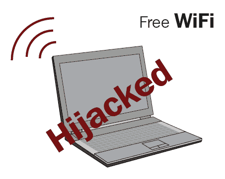

# 总结

到目前为止，我们讨论了为什么基础设施是当今互联网世界的绝对需求，以及这对系统管理员和互联网用户意味着什么。我们还了解了如何建立安全的 IT 基础设施和政策框架来保护信息。

当今信息安全的一个主要弱点是人为因素。员工和最终用户的日常行为构成了对组织和客户最大的风险之一。IT 技术的发展速度比以往任何时候都要快。我们看到组织内不断实施新的安全控制、政策和最佳实践，但每天安全漏洞仍在发生。从小型到大型组织，没有人能做到 100%的保护。只需一个未经教育的最终用户犯下简单的错误，就可能在信息安全中留下后门。组织需要关注他们与之合作的人，无论是内部还是外部。为员工和最终用户制定足够的培训和安全框架，对于保护系统变得非常重要，尤其考虑到不仅是技术发挥着重要作用，用户也是关键。我再强调一次：如果你有联网设备，那么保护它们也是你的责任。

在 2017 年，像 WannaCry、NotPetya 和 Bad Rabbit 等勒索病毒展示了这种威胁的危险性，以及对几乎任何行业的潜在影响。预计 2018 年，物联网（IOT）将成为未来几年攻击者的主要目标，此外，云基础设施、**人工智能**（**AI**）以及移动攻击者的崛起也日益增加。

在我们的下一章中，我们将讨论如何设计安全的基础设施，并牢记常见的风险因素。这从防火墙和 DDoS 保护技术的布局开始。

这是一个著名的名言，请记住：

*“如果你在咖啡上的花费超过了 IT 安全，你就会被黑客攻击。而且，更糟糕的是，你应该被黑客攻击。”*

― 理查德·克拉克

# 问题

1.  防火墙有哪些不同类型？

    1.  简单包过滤

    1.  应用代理

    1.  有状态检查防火墙

    1.  下一代防火墙

    1.  以上全部

1.  使用 IDS/IPS 可以防止哪些类型的攻击？

    1.  拒绝服务（DoS）

    1.  分布式拒绝服务（DDoS）

    1.  漏洞利用

    1.  蠕虫

    1.  病毒

1.  以下哪些信息可以在 IP 头部中找到？

    1.  IP 数据包的源地址和目标地址

    1.  IP 数据包的源端口和目标端口

    1.  IP 数据包的序列号

    1.  仅（1）和（2）。

1.  请求 HTTPS 的标准端口号是多少？

    1.  80

    1.  53

    1.  443

    1.  25

1.  以下哪一项不被认为是网络的外部威胁？

    1.  人类无知

    1.  病毒

    1.  黑客

    1.  恶意软件

# 进一步阅读

访问以下链接以获取更多信息：

+   [`www.sans.org/security-resources/policies`](https://www.sans.org/security-resources/policies)
