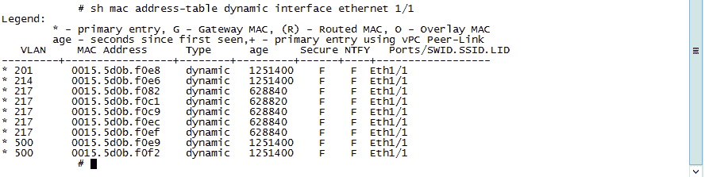
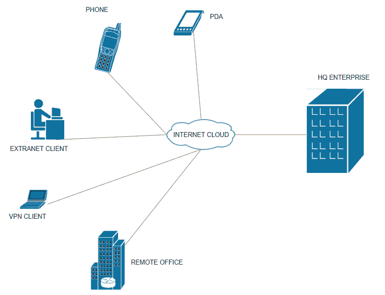

# 第二章：安全网络设计

在上一章中，你学习了基础设施安全的基本概念，并为理解网络空间中当前存在的安全威胁所需的信息安全领域打下了坚实的基础。

互联网发展迅速，已经进入一个每个人都必须连接才能交换信息的阶段。想象一下，数十亿拥有互联网设备的人直接连接到互联网，而某种不安全的网络成为网络犯罪分子的目标。

在本章中，我们将描述如何确保网络安全，并探讨网络安全的重要性。以分层的方式，我们还将讨论根据业务目标建立安全网络的方法和途径。

本章将涵盖以下主题：

+   访问控制

+   网络管理和安全设计

+   强化你的 TCP/IP 栈

+   DoS 和 DDoS 攻击

+   IP 欺骗

+   Ping 扫描和端口扫描

+   DNS 漏洞

+   双因素认证

# 访问控制

作为应用程序或网络的拥有者，我们应该知道谁或什么正在访问我们的网络资源。如果我们不知道或没有跟踪我们的活动，而只是假设网络上发生的事情，我们就无法保证数据安全和最终用户的安全。

我们需要从安全基础开始。这从了解我们的网络中包含什么开始。

# 资产分类和物理安全

网络安全中最基本（但往往最被忽视）的要素是防止硬件被盗或受到物理入侵。

如前所述，我们需要分类的第一个对象是我们的资产。一旦数据分类确定，网络服务器、网络交换机和其他核心网络组件应该放置在安全的设施中进行保护。机架和机柜应上锁，并根据需要授权，并且必须有适当的批准和安全指南。

# 认证、授权和计费

**认证、授权和计费** (**AAA**) 是一个用于集中和安全地控制 IT 基础设施资源访问的功能。通过执行策略和提供审计功能，跟踪在给定设备上执行的活动来实现这一点。简单来说，认证可以指通过用户名和密码识别用户。AAA 服务器将用户的认证凭证与存储在后端数据库中的凭证进行匹配。授权过程验证用户是否有权限执行指定的任务。这可以包括访问或在给定资源上执行任何命令。AAA 功能的最后一部分是计费，它记录用户在访问过程中所消耗的所有资源活动。

AAA 功能通常由一个专用的集中式 AAA 服务器提供，这是一个执行所有这些功能的软件程序。网络访问服务器与 AAA 服务器对接的当前标准是**远程身份验证拨号用户服务**（**RADIUS**）或**终端接入控制访问控制系统**（**TACACS**）协议。

TACACS 还可以进一步连接到域控制器的安全组，从而提供更高的安全访问权限。你需要在域控制器上创建两个安全组，例如*RO*和*RW*。经过一两次人工安全批准后，你的用户账户将自动添加到*RW*组中。这提供了一种动态请求管理员（admin）权限访问生产机器的方式。在指定时间后，账户会自动从该组中移除。

# 网络管理与安全设计

在管理网络和网络资产时，必须始终有一个集中式的安全管理工具子网，用于 DNS、DHCP、NTP、AAA 和网络管理等服务。通过定义边界，问题的排查变得更加容易，因为这些服务处于已知位置，并且有几个公认的访问路径和方法。

# 网络分段

我们大多数人专注于前门的安全，并通过在外围设置某种防火墙来防范来自外部世界的威胁。实际上，单靠外围安全并不能保护你的网络和信息数据。这样做就像把钱存进一个依赖单个武装守卫的银行。

*分段*的概念源于古代历史，当时罗马帝国根据俘获战士的民族和地理身份组建和作战单位。这个想法非常简单：根据相似的背景组成战士小组，以便他们能够相互联结，最终成为更强的战斗单位。

在关注基础设施安全时，资源整合、虚拟化和网络整合是有益的。通过提高安全性的网络基础设施整合一直是分段策略的关键部分。传统的分布式应用程序和复杂设计的服务模型现在正在向共享物理基础设施或云网络迁移，这要求进行隔离以保持强大的隔离性。同样，随着虚拟化、**软件定义网络**（**SDN**）、容器、无线连接、托管服务、数据中心基础设施和**物联网**（**IoT**）的引入，网络在过去几年经历了剧烈变化。通过实施 Layer-2 技术，如 VLAN，Layer-3 技术，如**虚拟路由与转发**（**VRF**）进行路由隔离，以及基于区域的防火墙进行段间隔离，可以实现网络分段。

在当今的网络安全环境中，你必须假设自己不是 100%免疫于这些威胁，并且可能已经有恶意软件在网络中存在。通过多层防御的方法，网络分段使得攻击者更难对整个网络发起攻击。同时，这也为内部人员增加了一层威慑，因为你可以将重要数据和资源与内部攻击进行隔离。

从网络设计的角度来看，分段有限、用户数量庞大且应用复杂的网络通常会遇到访问控制问题。每个用户组几乎都能访问企业网络中的所有应用。所有部门都能连接到网络上的所有其他资源，如下图所示：


# 分段策略步骤

分段设计和策略应基于关键资产的价值或资源，而不仅仅是基于网络边界的隔离。此设计策略应从高层网络设计开始，通过传统的网络边界（如 DMZ、数据中心、虚拟云和校园网络）隔离各个区域。然后，逐步深入每个区域，为其中的应用提供隔离：


**虚拟局域网（VLAN）**：一个扁平的局域网段构成一个单一的广播域。这意味着如果一个用户在局域网上广播信息，所有其他用户都会听到这个广播。为了限制广播并隔离用户和应用，局域网段可以被划分为逻辑分段，称为**VLAN**，同时共享相同的物理有线网络。在下图中，你可以将第一个 VLAN 称为 VLAN_1，专门为财务团队使用；VLAN_2 专为人力资源使用，VLAN_3 专为工资单管理使用。所有 VLAN 共享相同的物理介质，但在逻辑上被隔离，以限制广播：


在下图中，每种颜色代表不同的 VLAN。该图展示了连接的示意图：


红色电缆代表 VLAN1，紫色电缆代表 VLAN2，黄色电缆代表 VLAN3。

**虚拟路由与转发** (**VRF**)：虚拟化是一种技术，它具有隐藏计算机资源物理特性的巨大优势，这些资源与多个操作系统共享。最终用户与这些资源进行交互时，甚至无法意识到这些资源是共享的。VRF 是一种用于 **互联网协议** (**IP**) 网络路由器的技术，它允许在路由器中存在多个路由表实例并同时工作。VRF 还提高了网络安全性，这也是这些 VRF 资源不能相互通信的原因，除非它们通过单独的 Layer-3 设备进行通信。VRF 的主要优势在于，它们可以有重叠的 IP 地址而不会发生冲突。例如，在 MPLS 网络中，多个客户使用相同的 IP 范围，并且服务提供商资源是共享的。VRF 提供了灵活性，可以为多个客户使用相同的 IP 空间，同时确保安全性。如以下图所示，有四个 VRF，它们都在同一台路由器上使用相同的 IP 范围：


# 网络保护的考虑和设计

LAN 保护主要围绕 OSI 模型中的 Layer-2 保护。TCP/IP 的所有层都有自己的安全威胁和漏洞。防火墙是保护 LAN 的一种非常简单的方式，但它只保护来自外部的流量。Layer-2 攻击的来源是来自 *内部* 的 LAN。

对外部人员来说，执行 Layer-2 攻击是困难的，但绝不可低估内部人员的威力。内部人员通过从网络内部发起恶意攻击，能够造成比外部人员更多的损害。对这一点的主动威慑措施是：保持日志的记录，并设置 IDS 以检测此类攻击！

在深入探讨这个话题之前，让我们先了解一下网络交换机是如何工作的。

让我们检查一个 VLAN 段中的拓扑：A、B 和 C 是三个主机，它们连接到同一交换机的三个不同端口。当主机 A 通过端口 `Fastethernet0/1` 向主机 B 发送数据时，交换机会得知主机 A 位于端口 `Fastethernet0/1`，并将该映射记录到 **内容可寻址存储器** (**CAM**) 中。如果主机 B 没有发起连接，也没有发送任何数据包，那么交换机将无法定位到主机 B，并且会将由 A 发起的数据包泛洪到所有 VLAN 端口。通过泛洪学习是交换机的基本行为，它用于在网络上发现主机：


这里是已知的主要 Layer-2 攻击：

+   **CAM 溢出 / MAC 泛洪**：交换机将 MAC 地址存储在 CAM 表中。内存大小根据每个型号和容量不同而有所差异，但内存是有限的。很容易通过虚假的 MAC 地址数据泛洪网络交换机。交换机无法处理这些多余的数据时，会陷入困境，开始像集线器一样工作。攻击发生后，你可以使用 Wireshark 等程序或其他通用嗅探工具来监听网络上的所有流量，因为交换机会将数据转发到所有其他端口。Macof 是 `dsniff` 工具套件的成员，主要用于在本地网络中通过 MAC 地址泛洪交换机。Macof 每秒生成数千个数据包，每个数据包都会发送随机的源和目标 IP 地址。每个以太网帧的源和目标 MAC 地址也不同。

+   **CAM 流量保护和防御措施**：端口安全功能可以用于保护网络免受这种攻击，限制接口上的 MAC 地址数量。Cisco 在 IOS 中内置了这一功能，它允许你在交换机在一个端口上接收到超过一定数量的 MAC 地址时，将端口关闭。

Nexus 3064 交换机可以容纳 128k 条条目。通过以下命令可以查看此交换机学习到的所有 MAC 地址：


Cisco IOS 交换机 2960 可以容纳 8k 条条目：


一旦你启动`macof`攻击，所有可用地址会变为零，交换机开始像集线器一样工作。

你可以限制在此交换机接口上学习的 MAC 地址数量，并定义违规行为。请记住，这是确保用户端口安全的简单步骤，但在使用虚拟化的数据中心环境中，预计在同一个交换机端口上会学习到更多的 MAC 地址：


这是一个虚拟环境，多个 MAC 地址正在同一接口上被学习。这不是攻击，但你仍然可以根据设计指南限制 MAC 地址的数量：



**ARP 欺骗：地址解析协议**（**ARP**）是一种用于查找已知 IP 地址对应的未知 MAC 地址的协议或过程。所有需要在网络上通信的网络设备会广播 ARP 查询以查找其他机器的 MAC 地址。简单来说，任何 IP 网络上的通信，我们需要知道下一个跳点的 MAC 地址，才能将数据包放在网线中传输。

可以发送两种类型的 ARP 消息：

+   ARP 请求

+   ARP 回复

在 ARP 请求消息中，发送方将 ARP 请求广播到子网中的所有计算机，以发现目标 IP 地址的 MAC 地址。

在 ARP 回复中，目标系统将回复发送给发送者，提供 MAC 地址。

例如，目标伪装可能是互联网网关路由器。攻击者伪装路由器的 MAC 地址。为了转移流量，你需要将相同的 IP 配置到另一台设备上。然而，这会导致 IP 冲突，并可能引起网络管理员的警觉。路由器传输的 ARP 请求非常少，因为这类设备的 ARP 缓存时间可能非常长（例如，默认的 CISCO 路由器配置缓存时间为八小时）。所有这一切都是通过无意义的 ARP（gratuitous ARP）发生的，它会自动广播 ARP 的 MAC 地址到整个网络。在这种情况下，攻击者将发送 **无意义的 ARP** (**GARP**) 来毒化受害者机器中的 ARP 表：


上图展示了学习网关 MAC 地址的正常过程。受害者的主机向默认网关 `192.168.1.1` 发送 ARP 请求并得到响应，响应中包含 MAC 地址 `CC:CC:CC:CC:CC`：


攻击者发送 G-ARP，告知受害者他们现在拥有默认网关 `192.168.1.1` 和源 IP `192.168.1.2`。这就是游戏开始的地方。现在，通信可以通过嗅探器被劫持。这样，受害者和互联网网关就能通过攻击者的计算机交换流量，而不会被通知。

**WAN 保护**：WAN 是一种地理分布式的连接方式，连接多个网络。典型的 WAN 可能包括与互联网服务提供商的多个位置的连接、ISP 之间的互联网连接、分支机构的连接、托管设施、云服务、公共互联网连接和其他位置。例如，MPLS WAN、互联网 WAN、专线、IPLC 电路和暗光纤电路。

为了保护通过 WAN 传输的数据的机密性和完整性，我们需要确保数据被加密。通过互联网 VPN，IPsec 和 SSL 加密可以提供全面的保护。

所有 MPLS 服务提供商都使用术语 **虚拟专用网络** (**VPN**)，表示某种程度的安全性。但实际上，MPLS 默认并不提供加密。相反，该技术允许服务提供商为每个客户保持独立的路由表。攻击者无法直接访问 MPLS 客户网络，但他们可能会获得核心网络的访问权限。缺乏内建加密意味着攻击者可以嗅探数据并进行分析。为了防止核心网络被破解，IPsec 在 MPLS 网络上提供额外的安全性。


在规划加密时，我们需要决定我们希望加密的层级。

**为什么要加密第 1 层？**

在更高层加密 IP 数据流量可能会显著增加两个网络节点之间的延迟，而在第一层加密则提供极低的延迟和高吞吐量。考虑到 100 Gbps（甚至更高）的网络连接的普及，通过在第一层加密数据可以实现期望的结果。随着更高层次加密的复杂网络和加密管理的增加，需要管理更多的设备和复杂的加密密钥管理。光学加密包括传输机和接收机之间的加密解密过程以及密钥分发。

数据中心互连（**DCI**）是暗光纤的主要用例：


**为什么要加密第二层？**

在以太网为基础的 VPN 安全时，以太网加密器在第二层加密网络是最佳选择。网络窃听是一种常见且无法防止的做法。第二层加密是硬件处理的，几乎以全线速运行，并且适用于 L2 网络（点对多点和多模式链路）：


MACsec 提供的是第二层逐跳加密。每个跳设备将加密和解密数据包，但 IP 和 IP 载荷将被加密。在传输中查看数据包时，您将只看到第二层头部和其他内容。MACsec 是 IEEE 802.1AE 标准，用于在两个支持 MACsec 的设备之间认证和加密数据包。并非所有交换机都支持 MACsec。在实施 MACsec 之前，请检查交换机的能力。

TrustSec 使用 AES-128 **GCM 和 GMAC**（**Galois/Counter Mode Advanced Encryption Standard 128**）。MACsec 可以在主机之间配置 - 在此模式下，交换机被称为**下行 MACsec**。MACsec 还可以在交换机之间工作 - 此模式称为**上行 MACsec**。

对于下行模式，我们需要具备 NIC，它有助于 MACsec 或 Cisco 依赖于任何连接的软件：


**为什么要加密第三层？**

公共互联网便宜且更灵活。请记住，公共互联网并不安全，IPsec 提供了大量灵活性以加密数据并提供维护机密性、完整性、身份验证和反重放攻击的框架。IPsec 提供了一种基于标准的端到端加密解决方案，与底层物理网络基础设施无关。IPsec 也有几个限制。其中包括它不支持非 IP 流量，包括数据中心存储协议如**光纤通道**（**FC**）。

IPsec 加密在 OSI 模型的网络层（第三层）进行。第二层和第一层加密技术提供了与线速相同的 100% 吞吐量的“障碍消除”，远低于 IPsec VPN 的延迟。第三层加密对于低带宽环境是更好的选择：



# 加固你的 TCP/IP 协议栈

对于任何给定的操作系统，TCP/IP 协议栈的调优可以由系统管理员进行。更改 TCP/IP 协议栈变量的默认值可以提供额外的保护层，帮助你更好地保护主机的安全。

这主要是确定并决定服务器在触发 TCP/IP SYN 洪水攻击防护之前，能够在半开放状态下保持多少连接。这意味着，为了配置 TCP 连接的阈值，请求必须超过该值，才能触发 SYN 洪水防护。

以下参数可以在操作系统层面上调整，用于优化 TCP/IP 协议栈。这些调整不仅适用于操作系统，还适用于防火墙、负载均衡器等网络设备，帮助你精细调节 TCP 协议栈：

+   `TcpMaxHalfOpen`

+   `TcpMaxHalfOpenRetried`

+   `TcpMaxPortsExhausted`

+   `TcpMaxConnectResponseRetransmissions`

我们将在下一节详细讨论 DoS 攻击。

# DoS 和 DDoS 攻击

拒绝服务（Denial-of-Service，DoS）是一种攻击方式，在这种攻击中，由于恶意请求过度占用资源，在线服务无法响应来自合法主机的连接。当攻击来自多个来源时，这种攻击就变成了**分布式拒绝服务**（**DDoS**）攻击，且很难通过 IP 地址或地理位置来阻止攻击源。

DDoS 攻击通常采用以下形式：

+   基于流量的攻击

+   应用层攻击

+   低速攻击

# 基于流量的攻击

基于流量的攻击是迄今为止最常见的 DDoS 攻击类型。

根据 Arbor Networks 的报告，65%的 DDoS 攻击具有流量放大特性。

基于流量的攻击特点是流量过大（有时超过 100Gbps）。这些攻击并不要求流量来自某一个位置或某一个来源。

以下是这种攻击的一个示例：

+   **NTP 放大攻击**：NTP 放大攻击是一种基于流量的 DDoS 攻击，攻击者利用公开可访问的**网络时间协议**（**NTP**）服务器功能。这个名为`monlist`的命令会向请求者发送最近六百个连接到查询服务器的主机列表。对于一个小的查询，响应数据量非常大。假设查询：响应的比例为 1:50。也就是说，攻击者可以通过一个 1 Gbps 的网络接口卡（NIC）产生 50 Gbps 的流量，而这一过程会在多个来源中复制。这可能会在网络中引发多个太比特的流量。

在以下示意图中，你可以看到攻击者向公共 NTP 服务器发起查询，并伪造受害者的 IP 地址。NTP 服务器响应查询时，会将大量数据发送给受害者的 IP，从而使受害者的网络受到阻塞，导致资源不可用：


+   **缓解措施**：应启用源 IP 验证，以防止伪造的数据包离开网络。

其他类似的大流量攻击例子有：

+   **用户数据报协议**（**UDP**）洪水攻击

+   ICMP 洪水攻击

+   **域名服务器**（**DNS**）放大攻击

+   **字符生成器**（**Chargen**）

# 应用层攻击

应用层攻击是低流量攻击，非常难以检测。这些攻击针对应用程序或服务器的弱点，目的是建立连接并耗尽进程和事务。此类攻击不需要僵尸网络类型的军队；生成低流量的攻击只需要少量资源，且流量类型看起来是合法的。

最著名的第 7 层攻击示例是 HTTP Get/Post DDoS 攻击。

+   **HTTP 洪水攻击**：HTTP 洪水是一种非常常见的 DDoS 攻击类型，网络犯罪分子利用 HTTP `GET`或`POST`请求攻击在线 Web 服务器或应用程序。攻击者通过形成一个僵尸网络，向目标服务器发送大量的 GET（图像内容）或 POST（文件）请求。目标 Web 服务器会试图响应来自僵尸网络的每一个请求。根据正常的应用行为，服务器会分配最大量的资源来处理这些请求。这会阻止来自真实用户的请求到达 Web 服务器或应用程序，从而形成服务拒绝：


+   **云是攻击者的新平台**：云平台为黑客提供了一个新的平台来创建僵尸网络军队。几千个虚拟机/主机可以在几秒钟内创建并删除，且流量看起来是合法的：


+   **缓解措施**：基于环形的 Anycast 解决方案提供了内建的 DDoS 防护，能够防止此类洪水攻击。最有效的缓解机制依赖于结合流量分析方法，包括识别 IP 声誉。

# 低速攻击

低速攻击的目标是悄无声息地使目标瘫痪。这与高速暴力破解攻击有很大不同。这些攻击通过在一段时间内创建相对较少的连接并尽可能长时间保持这些会话开放，来让目标的连接保持打开状态。此类攻击的著名例子是**Slowloris**工具，它允许攻击者仅凭最小的带宽要求，而不需要同时发起大量连接，就能摧毁受害者的 Web 服务器。

**Slowloris**是一种应用层（第 7 层）DDoS 攻击，它通过利用有效的部分 HTTP 请求来运作。攻击者向目标 Web 服务器发送带有连接请求的 HTTP 头部，并保持这些连接尽可能长时间，但永远不会完成请求。为了避免连接超时，攻击者会定期向目标发送另一组部分请求头部，以保持请求活跃。最终，这会导致最大并发连接池溢出，从而使合法用户的后续连接无法获得服务。

**缓解措施**：

+   提高服务器可用性

+   限制传入请求的速率

+   限制来自一个 IP 地址的连接数。

# IP 欺骗

IP 欺骗是利用他人的 IP 地址作为 IP 数据包的源地址来创建 IP 数据包。

让我们来看看 IP 数据包中的 IP 头部：


在下图中，攻击者代表的是他人的 IP 地址：


# 使用访问列表进行防欺骗

网络运营商可以实施一个防欺骗的访问控制列表过滤器，防止源 IP 地址不正确的数据包进入或离开网络。使用以下命令，访问控制列表将阻止带有内部 IP 地址的数据包进入。`220.x.x.x`是我拥有的网络，所以我不期望会有来自我自己 IP 地址以外的数据包。

Cisco IOS 命令：

```
access-list 101 deny 220.x.x.0 0.0.0.255 any
```

# 加密

另一种防止 IP 欺骗的可能方法是加密所有网络流量，以防止源主机和目标主机被攻破。

# 使用 RPF 检查进行防欺骗

RPF 是一种支持多厂商的防止 IP 欺骗的功能。它可以用于单播和多播。RPF 检查数据包的源地址以及它从哪个接口学习到该地址。如果源地址在路由表中，则该数据包会被路由设备接受。如果不在路由表中，则会丢弃该数据包。RPF 的唯一问题是它不适用于不对称路由，因此要求严格的对称路由模式。

# Ping 扫描和端口扫描

在讨论 ping 扫描之前，让我们先来了解一下 ping。

+   **Ping**：Ping 是一种常用的工具，用于查找网络中主机的状态。Ping 基于 ICMP 协议。当发送一个 Ping 过程请求作为 ICMP 回显请求到目标主机时，目标主机会以 ICMP 回显应答来回复。

+   **Ping 扫描**：Ping 扫描是一种可以用来找出在指定 IP 范围内哪些主机处于活动状态的技术。允许 ICMP 的网络管理员容易受到基于 ICMP 的攻击。

多种工具可用于 ping 扫描。你甚至可以通过编写一个简单的脚本开发自己的工具。以下是如何从 Windows 机器运行 ping 扫描的简单示例：`FOR /L` 循环，这是一个计数器，变量为 `%i`。它从 `1` 开始，每次循环迭代增加 `1`，直到 `255`。我想在 `192.168.0.0/24` 网络中对 /24 子网进行 ping 扫描，并对每个 IP 地址进行一次 ping (`-n 1`)。可以使用过滤器 `| find "Reply"`，但这只会显示从中收到回复的 IP 地址。在我的实际网络中，有四个 IP 地址响应 ICMP ping，如下图所示：


+   **端口扫描**：首先，让我们了解一下什么是端口。主机上的任何应用程序都应该有一个有效的端口，这个端口就像一个小门，用于与网络上的其他主机进行通信。你可以有总共 65,535 个 TCP 端口和另 65,535 个 UDP 端口。端口范围 `0` 到 `1023` 保留给特权服务，并被指定为知名端口。

端口扫描是一种向目标主机的一系列服务器端口地址发送客户端请求的过程，目的是寻找活动端口并利用该服务的已知漏洞。

+   **TCP 端口扫描**：TCP 端口扫描是最基本的 TCP 扫描形式。端口扫描工具可以以每秒大约一千个端口或更多的速度快速扫描目标。这些工具使用操作系统打开与目标机器任何端口的连接，以便检测目标的可用服务数量。如果端口正在监听，初始连接握手将成功，否则该端口将无法访问。

+   **TCP SYN 扫描**：TCP SYN 扫描基于 TCP 三次握手，也被称为 **半开放** 扫描。攻击者不会建立完整的 TCP 连接，而是发送一个 SYN 包并等待响应。目标的 SYN/ACK 响应表示该端口正在监听，一旦收到 SYN/ACK，攻击者就会发送一个 RST 响应。

# 缓解措施

解决这个问题的一个简单方法是完全停止 ICMP。ICMP 可以在防火墙层、网络层或主机层停止。我们理解 ICMP 是网络管理员和系统管理员常用的故障排除工具，但我们应该避免依赖基于 ICMP 的 ping，而应依赖 TCP ping。这种扫描也可以被 IPS/IDS 系统检测到并停止。

对于主机级别的示例，可以通过配置入站规则轻松地在 Windows 上阻止 ICMP Echo。可以使用 Windows 系统中的工具 `wf.msc` 创建一个新规则：


# DNS 漏洞

DNS 依然是黑客非常感兴趣的目标，并且从用户的角度来看，DNS 是网络中非常重要的一部分。我们几乎每天在浏览网页或使用应用时都会无缝地使用它，甚至不知道它的存在。

DNS 提供了一种通过目录服务解析互联网中任何主机的 IP 地址的方法。

# DNS 如何工作？

一台主机向 DNS 服务器发送 DNS 查询请求，并且作为响应，获取了`1.1.1.1`的 IP 地址对应于`www.abc.com`。此时，主机可以直接使用该 IP 地址请求`www.abc.com`：


# DNS 协议攻击

**DNS 欺骗或 DNS 缓存中毒**：DNS 欺骗发生在特定 DNS 服务器记录被篡改，从而将流量重定向到攻击者处。这种流量重定向使攻击者能够窃取数据，因为用户很难识别实际网页和假网页之间的差异。

在此示例中，用户尝试获取真实 Web 服务器的 IP 地址`1.1.1.1`，但攻击者已篡改 DNS 记录，因此用户被重定向到一个假网站的 IP 地址`2.2.2.2`：


# 缓解措施

**域名系统安全扩展**（**DNSSEC**）是一项基于数字签名 DNS 记录的安全技术，用于帮助确定数据的真实性。DNSSEC 通过在现有的 DNS 记录中添加加密签名来创建一个安全的域名系统。DNSSEC 的主要目标是通过帮助保护用户免受被重定向到欺诈性网站和不必要地址的攻击，增强互联网的信任度。

# 双因素认证

**双因素认证**（**2FA**）是一种可选的安全层，它为您的账户增加了额外的保护层。该过程将您拥有的东西（令牌或代码）与您知道的东西（密码）结合起来。双因素认证比单纯的密码更有效地保护账户访问，使攻击者更难访问您的账户，因为它们具有动态特性。2FA 的两种常见方法如下：

+   **认证应用程序或令牌**：使用受信任的应用程序或安全 RSA 令牌生成安全代码

+   **短信验证**：通过短信将安全代码发送到与您账户关联的电话号码

双因素认证示例：

现在大多数银行都为客户提供双因素认证服务。网络管理的一个好例子是将 RSA 功能与 Cisco TACACS 或 Radius 结合使用，以获得对任何网络设备的访问权限。VPN 用户必须通过 2FA 认证来验证身份。

硬件令牌（如钥匙扣或读卡器形式）由于物流支持问题而难以维护，且令牌通常较小，容易丢失。双因素认证（2FA）通过利用手机短信技术使生活更加便捷。

以下是 RSA 硬件令牌的图片：


# 总结

设计安全网络的过程需要识别不安全区域，了解网络攻击的方法以及满足业务需求的最佳解决方案。网络设计的四个基本技术要求是可扩展性、可用性、安全性和可管理性。

我们讨论了在一个日益以互联网为导向的世界中采用正确方法来防范安全威胁的重要性。我们还涵盖了所有网络层的安全弱点，包括路由器、交换机、防火墙配置系统以及连接到互联网时的风险。我们还学习了最佳的安全方法，以及如何通过应用安全配置来保护网络免受漏洞、威胁和攻击。

在下一章中，我们将讨论更多关于服务器安全、加密方法和数据保护政策执行的内容。

# 问题

1.  AAA 代表什么？

+   1.  权威

    1.  授权

    1.  审计

    1.  身份验证

    1.  会计

1.  什么是最常见的两种 AAA 协议？

    1.  TCP/IP

    1.  RADIUS

    1.  TACACS+

    1.  PPP

1.  试图使目标系统对其预期用户不可用的攻击被称为：

+   1.  拒绝服务攻击

    1.  Slow read attack

    1.  伪造攻击

    1.  饥饿攻击

1.  以下哪项不是攻击，而是一种搜索可用服务以识别漏洞以便攻击给定目标的工具？

    1.  拒绝服务

    1.  端口扫描

    1.  内存访问违规

    1.  垃圾箱搜寻

# 进一步阅读

有关参考资料和更多信息，请参考以下链接：

+   [`gcn.com/Articles/2014/08/07/Layer-1-network-encryption.aspx`](https://gcn.com/Articles/2014/08/07/Layer-1-network-encryption.aspx)

+   [`www.uebermeister.com/files/inside it/2016_Introduction_Encryption_Metro_and_Carrier_Ethernet.pdf`](http://www.uebermeister.com/files/inside%20it/2016_Introduction_Encryption_Metro_and_Carrier_Ethernet.pdf)

+   [`ieeexplore.ieee.org/document/7781061/`](http://ieeexplore.ieee.org/document/7781061/)
