# 第三章：服务器级安全

在上一章中，我们讨论了如何构建安全的网络基础设施。本章将讨论如何在安全网络内部构建和确保服务器安全。

服务器/计算机安全是确保业务顺利运行的基础设施关键部分。信息安全随着依赖公共网络的增加而发展，以防止个人、财务及其他限制信息的泄露。因此，维护数据的机密性、完整性和可用性变得尤为重要。本章重点介绍如何确保数据安全，并实施各种政策来保护服务器基础设施。

本章将涵盖以下主题：

+   数据分类

+   物理安全

+   磁盘加密

+   强化服务器安全

+   认证 NTLM 与 Kerberos

+   密码策略

+   服务器级权限

+   服务器病毒和恶意软件保护

+   本地安全策略

# 数据分类

设置 IT 基础设施的主要目的是使应用程序运行起来。然而，在对资产进行分类后，我们需要解决服务器特定基础设施上的安全性问题。在一个包含多个厂商服务器和多操作系统环境的大型网络中，预期会有不同的应用程序集。基于角色、权限和操作系统的服务器分组可以解决多个安全问题。

# 物理安全

在大多数情况下，物理访问意味着完全丧失安全性。即使攻击者无法访问你的数据，他们也可以造成大量损害。我们将查看每个人都应该实施的最基本的安全措施，前提是这些措施尚未实施：

+   **锁好服务器机房**：服务器机房是你物理网络的电力站，任何能够物理接触到机房内的服务器、交换机、路由器、电缆和其他设备的人，都可能造成巨大损害。

+   **设置监控**：你需要一种方法来监控谁进出，做了什么以及何时做的。更好的解决方案是设置生物识别扫描仪，要求在解锁门时进行验证，并记录每位技术人员的身份。监控摄像头可以进行持续监控，或者使用运动检测技术来记录人的移动。如果在不该有动作的时候检测到运动，它们甚至可以发送电子邮件或手机通知。

+   **禁用驱动器**：当然，为了保护环境，我们不希望任何人将公司信息复制到可移动媒体。你应该简单地禁用或移除 USB 接口和其他连接外部驱动器的方式。

+   **教育你的员工**：除了技术之外，这是确保安全最重要的因素。必须对员工进行安全相关问题的培训，例如密码选择、社交工程策略和电子邮件钓鱼。这样几乎不可能让外部人员侵入。

# 磁盘加密

保护管理业务关键数据及其客户的任何服务器非常重要。尽管服务器存放在安全设施中，但这并不意味着它们不会面临数据丢失或盗窃的风险。有时，服务器中的存储驱动器在运输过程中被错放，这可能导致数据丢失。另一个例子是防止离线攻击。如果数据驱动器被盗并插入到另一台系统中以启动其他操作系统，这基本上绕过了密码保护。如果该驱动器没有加密，其信息可能会被检索出来并暴露给不必要的人员，导致组织面临合规性违规、个人诉讼以及公司声誉受损的风险。

# 全盘加密

让我们详细探讨一下整个磁盘加密的工作流程。全盘加密会对整个磁盘驱动器进行加密。当经过身份验证的用户从完全加密的驱动器访问文件时，加密技术会使用系统启动时提供的解密密钥对文件进行解密，其余部分的驱动器仍然保持加密状态。这种方法确保了在系统故障或系统故意关闭时硬盘的保护。全盘加密的主要目标是，在系统关闭状态下，驱动器和文件保持加密。在运行中的系统中，加密技术对用户访问文件实际上是不可见的。这是因为操作系统拥有解密密钥来访问磁盘上的文件。

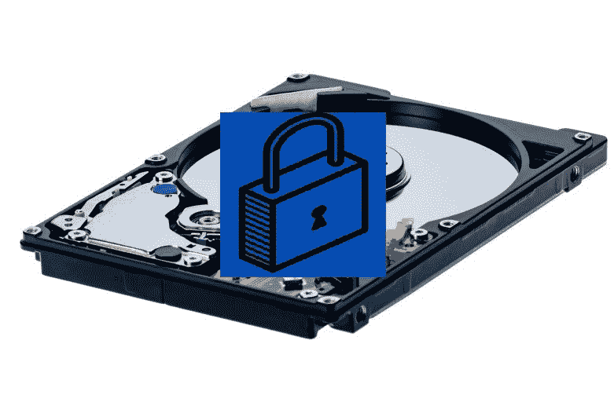全盘加密是笔记本电脑和台式机等设备的完美解决方案，因为这些设备会在某些时候关闭。全盘加密有助于在磁盘物理丢失的情况下保护数据，并且更适合便携设备。

# Bitlocker

BitLocker 是微软的本地技术，它使你能够加密整个硬盘，包括操作系统。为了获得 BitLocker 的最佳效果，硬件系统必须配备**受信平台模块**（**TPM**）芯片。这是一种特殊的微芯片，使设备支持高级安全功能。然而，你也可以在没有 TPM 的情况下使用 BitLocker，通过使用基于软件的加密方法。

在设备管理器的安全设备下可以看到 TPM 芯片 2.0：

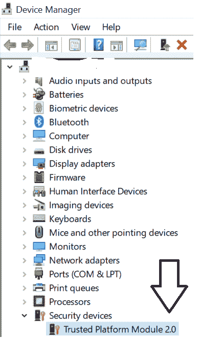

# 虚拟受信平台模块 – vTPM

**受信计算组** (**TCG**) 于 2009 年推出了 TPM。**受信平台模块** (**TPM**) 是一个通常集成在主板中的微芯片，提供基于硬件的安全性。如果你的主板支持，也可以在之后为定制系统添加 TPM。TPM 芯片是一个安全的加密处理器，旨在执行加密操作。如果你在具有 TPM 的计算机上使用 BitLocker 加密，部分密钥会存储在 TPM 本身中，而不仅仅存储在硬盘上。这意味着攻击者无法仅通过将硬盘从计算机中取出并尝试在其他地方访问其文件。

在 Windows Server 2016 Hyper-V 和 Windows 10 中，你可以在虚拟机中启用 vTPM。虚拟实例将映射到每个虚拟机，如下图所示：

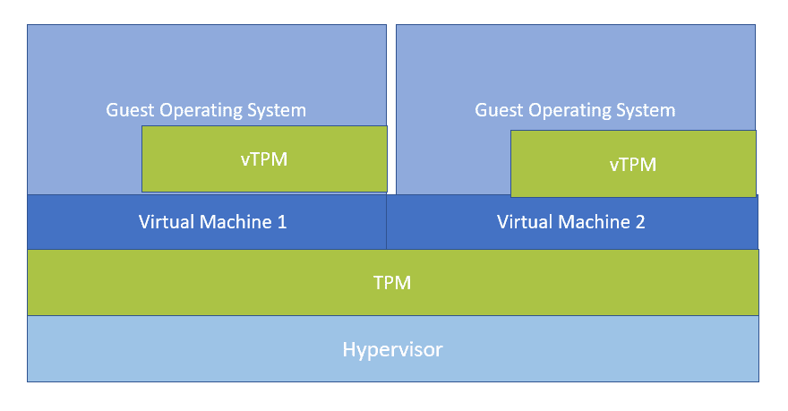

这是硬件 TPM 芯片的样子：

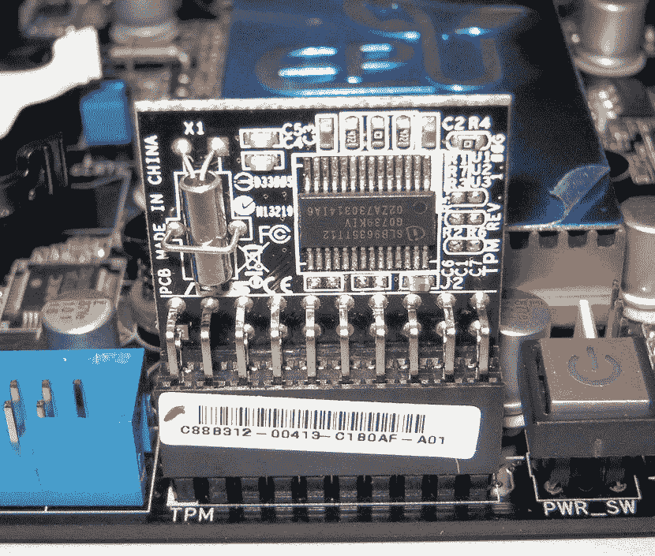

# 加密你的 Hyper-V 客户虚拟机

在虚拟化环境中，加密客户虚拟机是 Hyper-V 中可以增加的另一层保护。你可能会问，如果加密 Hyper-V 主机本身能保护物理磁盘被盗，为什么还需要加密虚拟机呢？启用 BitLocker 加密虚拟机内部的虚拟磁盘也能防止虚拟磁盘被盗。例如，如果攻击者设法访问了一个在线的 Hyper-V 主机，VHDX 或 VHD 文件就可能被下载或窃取。

这是来自 Hyper-V 2016 的截图，其中 vTPM 选项默认禁用。一旦启用该功能，它可以与虚拟机共享虚拟化 TPM 实例：

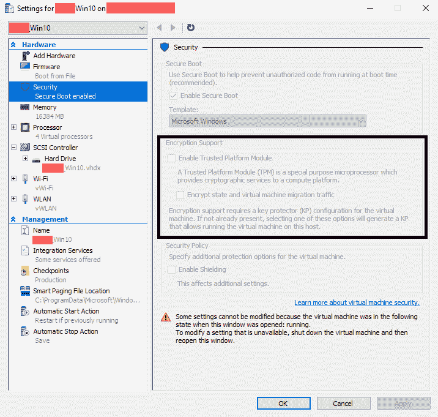

# 云虚拟机磁盘加密

在此图中，我截取了正在运行的 Azure 虚拟机的截图，显示与未加密的虚拟机相关联的磁盘（ENCRYPTION 未启用）。但它也指出该磁盘在静态时已使用**存储服务加密** (**SSE**)进行加密。欲了解更多信息，你可以参考 Azure 文档。静态加密是通过加密服务提供商的整个磁盘来保护数据，以防磁盘被盗或丢失时发生数据泄露：

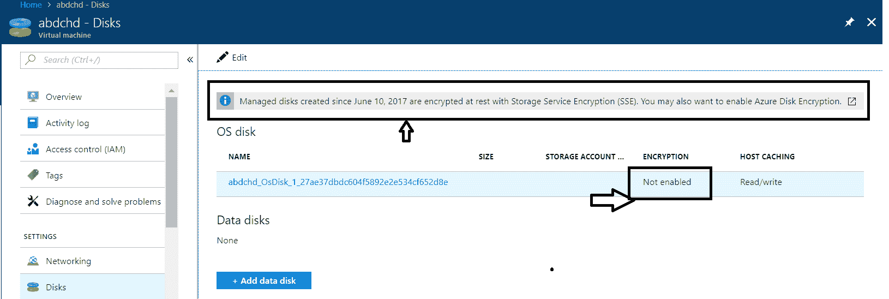

# 什么是静态加密？

静态加密是指在数据存储在物理介质上时对其进行加密编码。静态加密旨在保护数据免受静态攻击，包括尝试获取数据存储介质物理访问的攻击。在此类攻击中，服务器的硬盘可能被盗或丢失，攻击者可能会通过将其插入自己的计算设备来恢复硬盘上的数据。静态加密旨在通过确保数据在磁盘上存储时仍然加密，防止未经授权的人访问关键数据。攻击者可以获取包含加密数据的硬盘，但如果没有加密密钥，他们将无法解码数据。静态加密被高度推荐，并且是许多组织的优先要求，包括云服务提供商，以使其符合国家法律、政府规定和行业标准，如 HIPAA 和 PCI。

Google、Amazon 和 Azure 云服务提供商默认会加密存储在静态状态下的客户数据，您无需进行额外操作。

# 强化服务器安全

我们大多数人认为系统或服务器已经是安全的，但这可能是一个错误的假设。试想一下，如果任何系统服务器、防火墙或路由器在没有先进行加固的情况下被盗，攻击者很可能会首先尝试使用默认的用户名和密码破解目标系统。对于基于 Linux 的机器，我的默认用户名是`root`，密码是`root`，我们大多数人可能会继续使用它。服务器加固包括识别和修复安全漏洞。我们将讨论服务器加固以及您可以立即实施的最佳实践，以降低攻击者危害您企业关键系统和数据的风险。

# 检查开放端口或服务

识别服务器上的开放端口需要将端口打开并禁用或关闭不必要的服务。服务器应具有最小化的操作系统配置。

对于 Windows，请使用命令提示符运行以下命令：

```
netstat -a | findstr "LISTEN" 
```

上述命令的输出如截图所示：

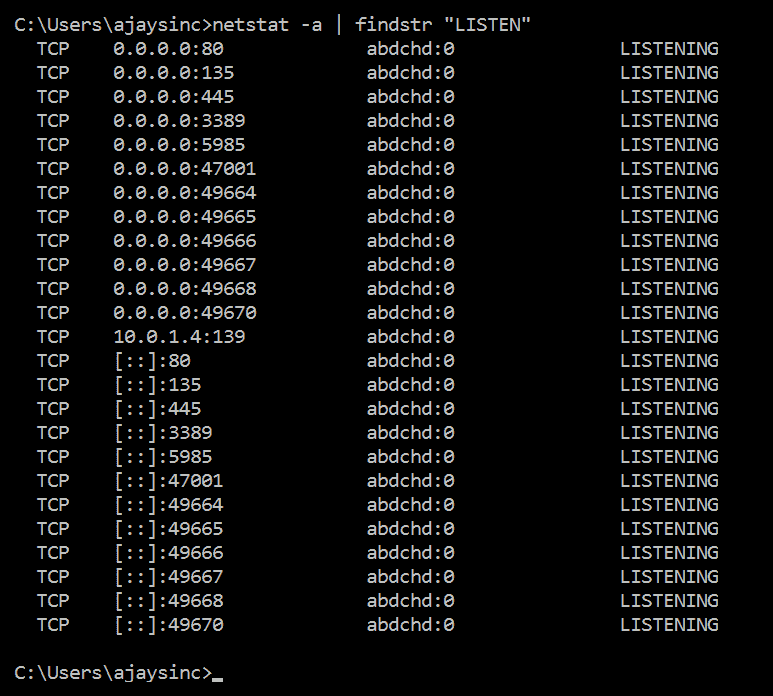

对于 Linux/Unix，请使用 Shell 提示符运行以下命令：

```
netstat -antp | grep "LISTEN"
```

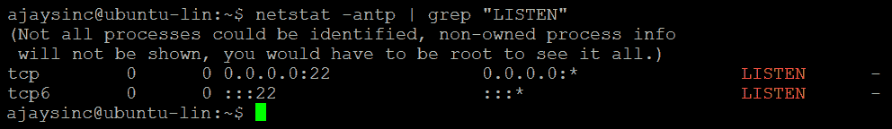

# 系统防火墙配置

为了基于防火墙规则限制流量，应该只允许流量进入需要为服务开放的端口。例如，安全的 Web 服务器需要为大多数用户提供对 TCP 端口`443`的访问，但它们不需要所有源 IP 地址的**远程桌面协议**(**RDP**)或**安全外壳**(**SSH**)管理访问。

对于 Windows，您可以使用高级安全选项配置新的入站和出站规则：

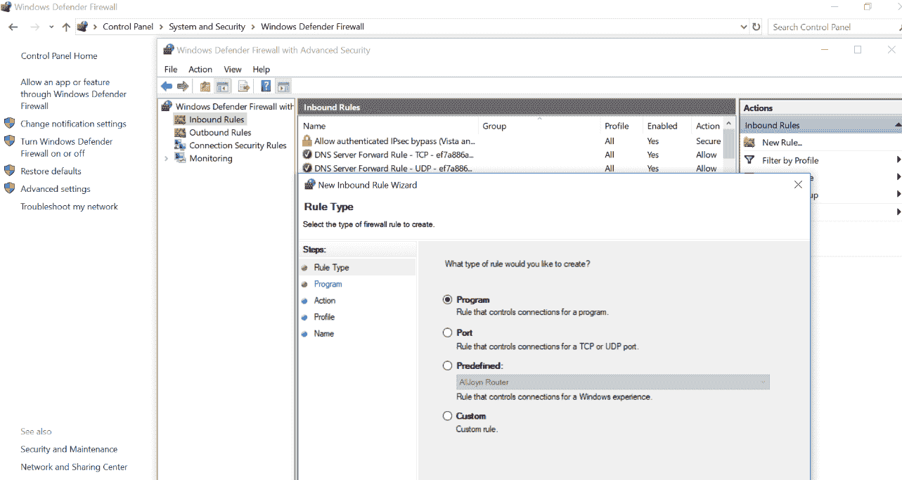

对于 Linux，`sudo iptables -L`会列出当前在`iptables`中的规则。如果你刚刚设置了服务器，应该没有任何规则，输出应类似于以下截图：

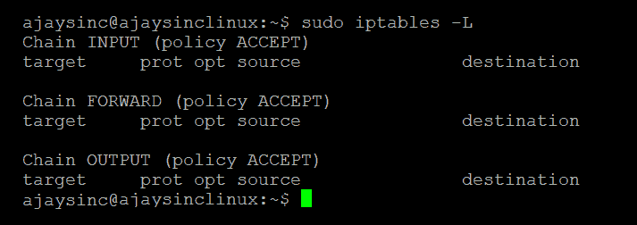

# 系统更新

第一次启动后的第一件事就是更新系统。应该尽快应用重要更新。一定要在测试环境中测试这些更新。首先做这个以确认功能正常。如果没有兼容性问题，再在生产环境中测试。

以下截图来自 2016 服务器，你可以使用 PowerShell 提示符进行更新：

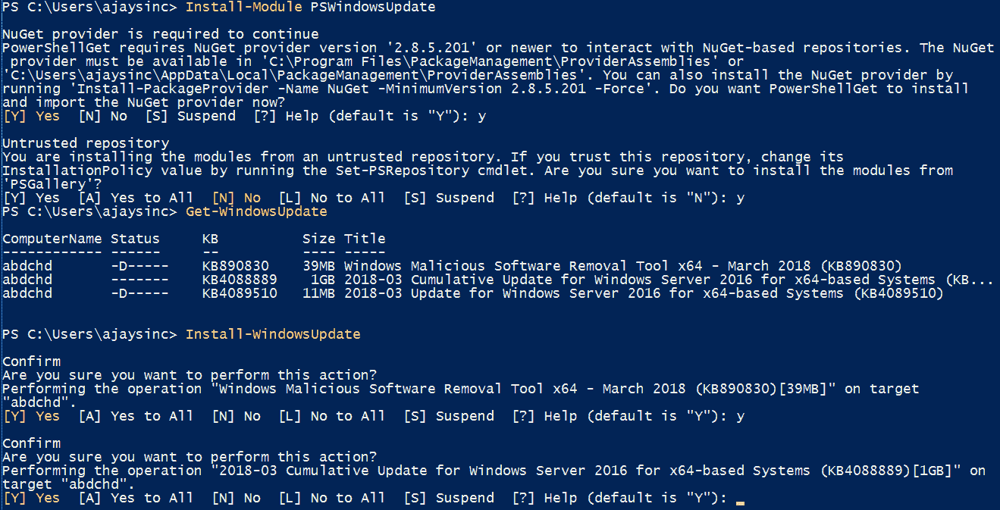

对于 Linux，你可以运行一个命令来获取所有更新：

```
sudo apt-get update
```

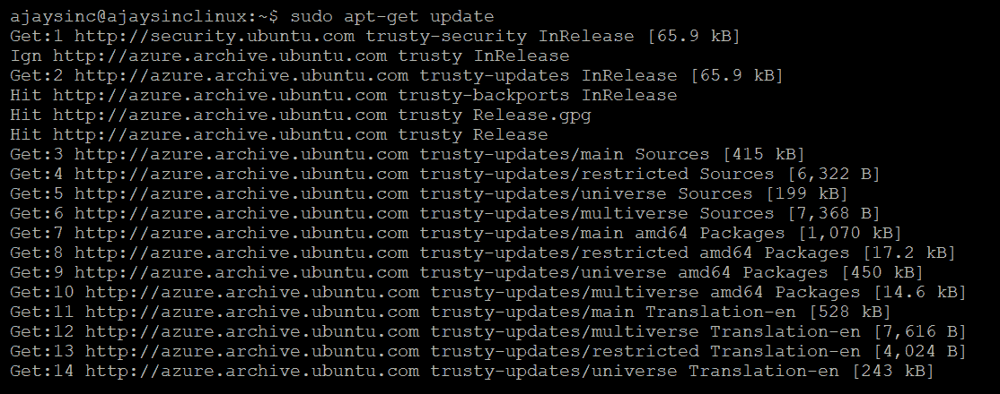

# 禁用 USB

**通用串行总线**（**USB**）连接通常是即插即用设备。例如，计算机的硬盘或优盘。由于其即插即用特性，操作系统会自动识别设备并为其安装驱动程序。由于 USB 设备便于携带且可以轻松连接到计算机，这些设备可能带来真正的安全威胁。为了防止员工将敏感信息保存在 USB 驱动器上，金融机构不允许使用 USB 设备。系统管理员可以通过组策略禁用或阻止 USB 设备。现在我们来看看如何通过组策略禁用 USB 设备的步骤。

对于 Windows，在组策略管理编辑器中，你可以启用“所有移除存储类：拒绝所有访问”，如下图所示：

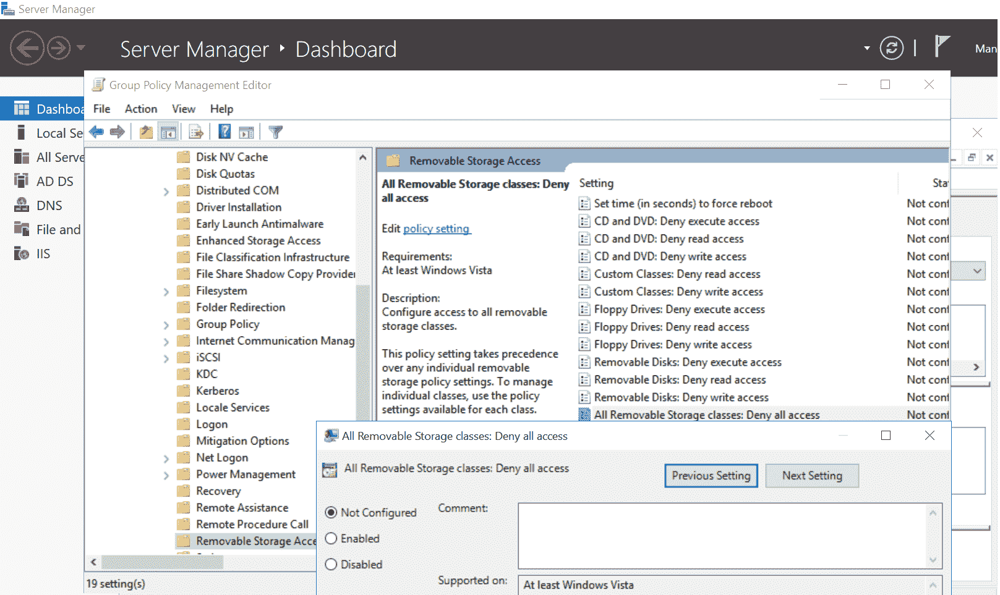

对于 Linux，你可以通过编辑该文件并添加`blacklist usb_storage`来禁用 USB 存储。

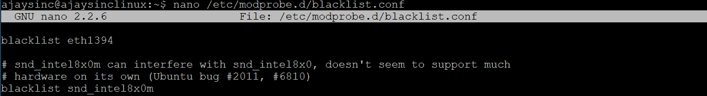

# 硬盘加密

磁盘加密在防止盗窃时非常重要。这是因为盗窃你电脑的攻击者，如果将硬盘连接到他们的机器并试图恢复数据，他们将无法解码你的数据。我们已经在本章的*全盘加密*部分详细讨论了这一选项。

# BIOS 保护

保护系统 BIOS 密码非常重要，这样攻击者就无法利用它来更改安全设置。你还需要禁用从外部媒体设备（如 USB/CD/DVD）启动。BIOS 保护只是一个认证机制，旨在防止未经授权的物理访问。现在的 BIOS 支持带外访问，意味着只要硬件配置正确，你就可以完全远程访问计算机，无论计算机处于何种状态。

# 检查已安装的软件包

列出操作系统上安装的所有软件包，并移除不必要的包。禁用不必要的服务将减少攻击面。让我们看看如何在不同操作系统上检查已安装的软件包。

对于 Windows，从管理员模式下的 PowerShell 运行以下命令：

```
Get-AppxPackage -AllUsers | Select Name, PackageFullName
```

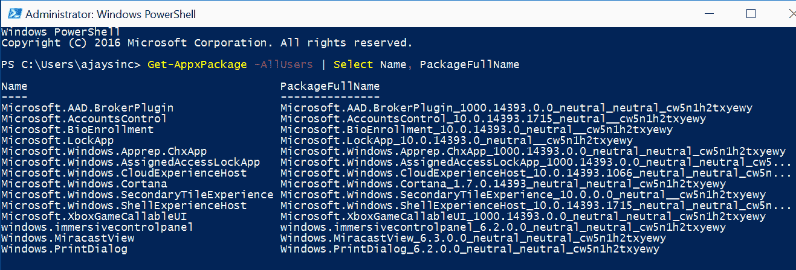

对于 Linux，Telnet 自带默认配置。在一个安全环境中，我们是否需要 Telnet？也许需要，但个人来说，我不推荐在安全环境中使用它，因为 Telnet 连接所使用的数据交换是明文的。

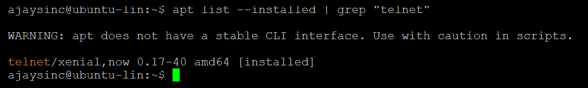

# 密码策略

不要忘记保护你的密码，也不要重复使用密码。使用密码策略来确保服务器上的账户不会被暴力破解或攻击。如果你的服务器是**Active Directory Domain Services** (**ADDS**)的成员，密码策略将会在域级别进行设置。我们将在接下来的章节中详细讨论密码策略。

# 安全加密远程访问

SSH 使用后台运行的加密过程，因此被认为是非常安全的。然而，你仍然需要对该服务进行加固。确保你正在运行最新版本的 SSH 协议，并且可以通过 IP 子网进一步限制 SSH 来源。远程桌面会话通过加密通道操作，防止任何人在网络上窃听你的会话。然而，早期版本的 RDP 在加密会话时所用的方法存在漏洞。最佳做法是更新软件，使用防火墙限制访问，并设置账户锁定策略以增强安全性。你还可以将 RDP 端口从`3389`更改为其他端口，使用 RDP 网关，并最终使用双因素认证（2FA）。

# 实现活动日志记录

你需要确保日志和监控已配置，并捕获你想要的数据，这样在出现问题时，你可以迅速发现问题发生的人员、时间和需要修复的内容。你必须设置集中式日志管理解决方案，监控日志、服务器健康状况（如磁盘空间、CPU、内存和网络活动）。

# 记录主机信息

最后，你应该有适当的文档，包含主机信息，如系统名称、IP 地址、MAC 地址、资产标签和所有者信息。

# 身份验证 NTLM 与 Kerberos

**NT LAN Manager** (**NTLM**) 和 Kerberos 都是身份验证协议，但它们在授权方面不起作用。NTLM 是微软开发的专有身份验证协议，而 Kerberos 是标准协议。从 Win2K 开始，微软将 Kerberos 作为 Windows 操作系统的默认身份验证协议。然而，如果因为某些原因无法协商使用 Kerberos 协议，那么**Active Directory** (**AD**) 将使用 LM、NTLM 或**NTLM 版本 2** (**NTLMv2**)。

Kerberos 是一种加密网络协议，用于对用户进行身份验证以访问资源，它涉及客户端、服务器和 **Key Distribution Center**（**KDC**）。Kerberos 的名字来源于希腊神话中的三头犬 Cerberus，因为它有三个组成部分。KDC 由 **Authentication Server** 和 **Ticket Granting Service** 两个部分组成，同时还有客户端和客户端想要访问的 **Print Server**，如以下图所示：

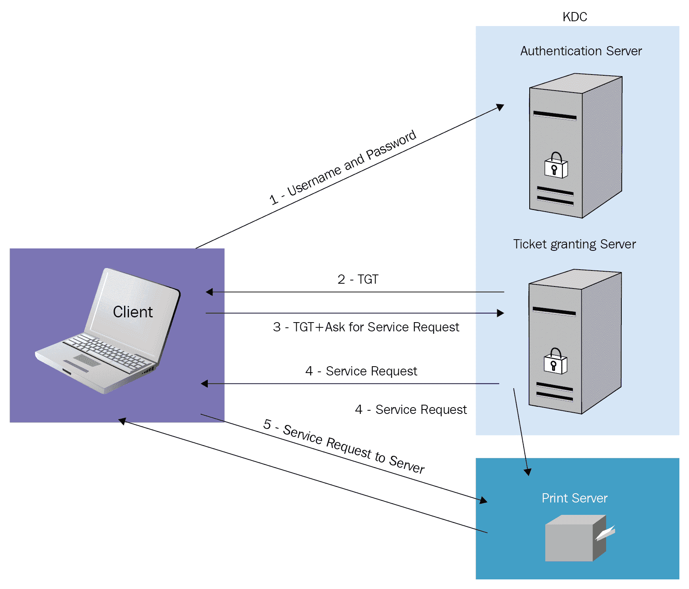

让我们一步步理解这个过程：

1.  对于网络域身份验证，客户端提供用户名和密码，由 KDC 的认证服务器进行验证。

1.  KDC 会授予一个 **Ticket Getting Ticket**（**TGT**），其默认有效期为 10 小时。

1.  当客户端尝试访问域中的打印服务器时，TGT 被用来发起请求，而不是一次又一次地输入凭证。客户端从 KDC 的一个组件 Ticket Granting Server 获取服务票证。

1.  服务票证是为客户端和客户端想要访问的服务器创建的。服务票证由票证和会话密钥组成。

1.  客户端提供服务票证以创建与服务器上服务的会话。服务器使用其密钥解密来自 TGS 的信息，并对客户端进行身份验证。

主要的区别可以在下表中看到：

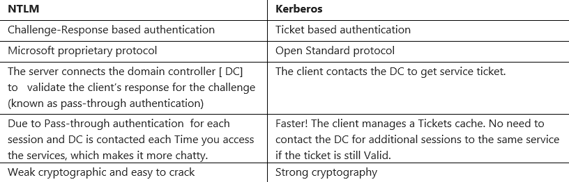系统管理员需要确保默认运行 Kerberos。在任何需要启用 NTLM 的情况下，都应谨慎使用，并牢记风险。

# 密码策略

密码是计算机安全的重要特征。构建不当或弱密码可能导致未经授权的访问或滥用组织的 IT 资源。此密码构建指南适用于所有密码，包括（但不限于）用户级账户、系统级账户、Web 账户、电子邮件账户和本地路由器登录。在 Windows 系统上，您可以从命令提示符运行 `secpol.msc`：

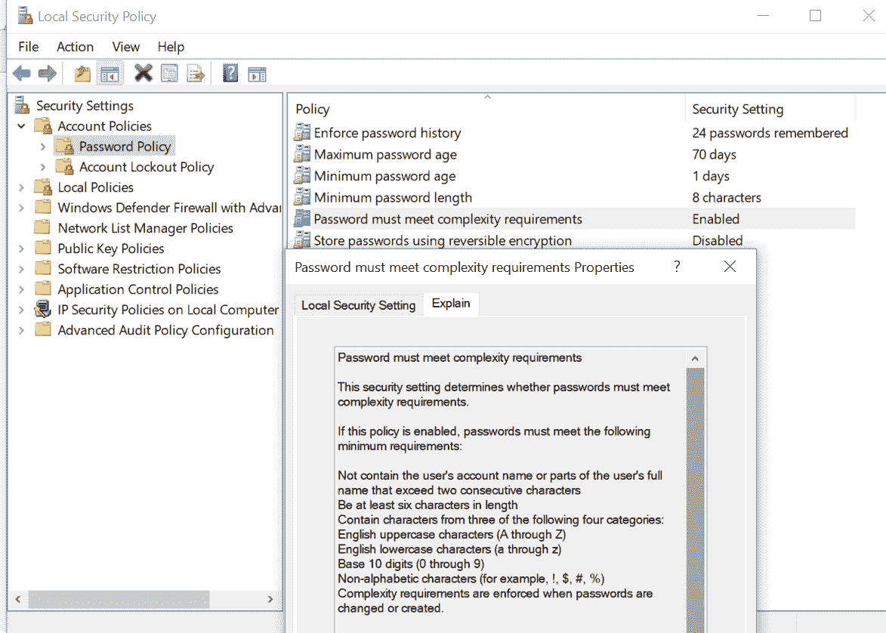

强密码具有以下特点：

+   它们至少包含十二个字母数字字符

+   它们包含大写字母和小写字母

+   它们至少包含一个数字（例如，0-9）

+   它们至少包含一个特殊字符（例如，!$%^*()_+|~-=\`{}[]:";'?,/）

以下是我们必须记住的一些密码策略：

+   **保护你的密码**：记住密码而不将其写在某个地方是非常具有挑战性的，因此请选择一个你容易记住的强密码或密码短语。如果你有很多密码，可以使用密码管理工具或保险库，但务必选择一个强大的主密钥并记住它。定期更改密码，即使它没有被泄露，你也可以设置一个每 90 天更改一次密码的政策，作为标准指南。不要为包含敏感信息的多个网站使用相同的密码。

+   **设置锁定策略**：我们都曾在某个时刻忘记过密码，并且经过几次尝试才能重新进入系统。然而，你应该设置一个可接受的登录尝试次数，当尝试失败次数超过时，将锁定用户。这将保护你的系统免受任何类型的暴力破解攻击。

+   **强制密码历史**：此安全设置确定在可以重新使用旧密码之前，必须与用户帐户关联的唯一新密码的数量。该值必须在零到二十四个密码之间，适用于域控制器。

+   **最小密码使用期限**：此设置确定密码必须使用的最短天数才能更改。只有当最小密码使用期限到期时，用户才允许更改密码。这确保用户不会更频繁地更改密码。该值可以设置为零到九百九十九天之间。域控制器的默认值为一，独立服务器的默认值为零。

+   **最小密码长度**：此设置确定密码应包含的最小字符数。该值可以设置为零到十四之间。域控制器的默认值为七，独立服务器的默认值为零。

# 服务器级别权限

在一个组织中，首先你需要根据服务器的类型识别资产，每个服务器都有一个特定的角色要执行。服务器级别的角色在权限范围内是全局性的。你可以将服务器级别的主体（服务器登录、用户帐户和 Windows 安全组）添加到服务器级别的角色中。安全组可以提供一种高效的方式来分配对网络资源的访问权限：

+   **Active Directory 中的安全组**：用户权限分配给安全组，以确定该组成员在域或森林的范围内可以执行哪些操作。例如，默认域管理员对该特定域的所有服务器部分具有完全权限，无论服务器角色如何。然而，我们可以创建用户定义的组并将所需的用户帐户添加到该组，以限制访问权限。

+   **Windows 服务账户**：一些在 Windows 服务器上运行的应用程序需要专门的账户来运行。服务账户可以帮助解决这个问题，它作为一个用户身份，与服务可执行文件关联，为该服务提供安全上下文。

# 服务器防病毒与恶意软件保护

理解恶意软件、间谍软件、木马病毒、勒索病毒、恐吓软件和计算机病毒之间的区别非常重要。例如，计算机病毒是最著名的恶意软件类型。*恶意软件*是恶意软件或代码的缩写，是一个统一的术语，用于指代病毒、间谍软件、蠕虫等，这些软件通过网络破坏、利用、窃取数据或禁用计算机。所有用户都必须了解如何识别并保护自己免受各种形式的恶意软件侵害。由于其特性，计算机病毒和蠕虫通过自我复制传播。大多数人认为防火墙能够保护我们免受恶意软件侵害，但实际上，正常的有状态防火墙（我们将在第十章，*防火墙部署与检测技术*中详细讨论有状态防火墙的工作原理）并不能保护我们免受网站上的恶意内容侵害，而反恶意软件则能保护服务器和工作站。在这里我想澄清的是，下一代防火墙通常配备有防病毒和恶意软件保护功能，但需要根据您希望检查的流量进行配置。您仍然需要端点保护。

一款强大的防病毒软件包是每个个人和企业计算机系统必须具备的主要技术防御层。设计良好的防病毒保护具有以下几个特点：

+   勒索病毒保护

+   恶意软件保护

+   网站安全

+   电子邮件安全

+   扫描引擎

+   反键盘记录器

WannaCry 勒索病毒在 2017 年 5 月感染了全球数百万基于 Windows 的系统。WannaCry 会搜索并加密 176 种不同的文件类型。勒索信中指出，支付金额将在三天后翻倍。如果七天内未支付，信中表示加密的文件将被删除。WannaCry 已经影响了个人用户，以及政府机构、医院和大学。你最终可以通过防病毒软件移除 WannaCry，但不幸的是，由于使用了 AES-128 与 RSA-2048 的强加密方式，这并不会神奇地解密你的文件。

为了防止 WannaCry 勒索病毒攻击，保持软件更新，尤其是操作系统，是非常重要的。建议通过端点防病毒软件安装第二层保护。

# 本地安全策略

本地安全策略是特定于本地系统或机器的。这使得可以强制执行许多系统、用户和安全相关的设置，例如密码策略、审计策略和用户权限。大多数 Windows 默认的策略设置是可以接受的，但有一些需要调整以增强安全性。这些策略可以通过本地组策略编辑器进行修改，该编辑器通常包含帐户策略、本地策略、防火墙、安全等内容。在 Windows 系统上，您可以通过运行`gpedit.msc`命令并使用命令提示符来访问策略编辑器。以下截图显示了本地组策略编辑器：

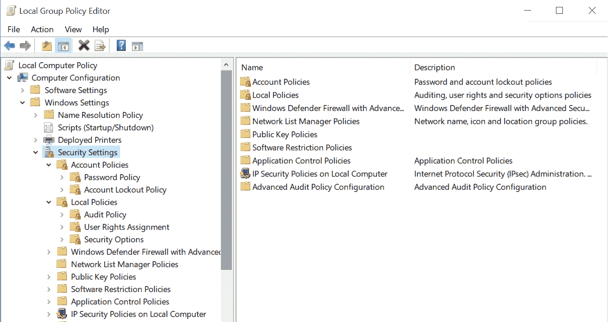

# 总结

无论您的网络基础设施有多安全，也无论您的服务器运行哪些服务，您都必须应用一些基本的强化技术。在本章中，我们特别关注适用于任何服务器的硬化步骤。我们讨论了服务器资源的物理安全，然后介绍了可以用于本地和云基础设施的磁盘加密技术。我们已经确定几乎每台服务器都有某种面对互联网的连接，并且必须通过防病毒和恶意软件解决方案进行保护。为了补充这些安全解决方案，我们还可以强化我们的服务器，并调整本地安全策略和权限。最后，我们讨论了一些服务器管理技术，用于限制对特定 IP 地址集的 SSH 和 RDP 服务访问。

# 问题

1.  与密码策略相关的不良做法是什么？

    1.  决定密码的最大使用期限

    1.  限制密码重用和历史记录

    1.  加密密码

    1.  每两年更改一次密码

1.  什么不是加密的特点？

    1.  保护数据在传输过程中免受未经授权的访问

    1.  确保用户身份验证

    1.  确保数据完整性

    1.  确保数据不发生损坏

1.  什么不是加密标准？

    1.  AES

    1.  TES

    1.  三重 DES

    1.  DES

1.  密钥分发中心的作用是什么？

    1.  它用于将密钥分发给全世界的每个人

    1.  其目的是减少交换密钥时的固有风险

    1.  以上所有

    1.  以上都不是

1.  理想情况下，应该在密码中使用哪些字符来确保其强度？

    1.  仅限字母和数字

    1.  混合大小写字母（大写和小写）

    1.  特殊字符

    1.  以上所有

# 进一步阅读

如需更多信息，您可以参考以下链接：

+   [`www.kerberos.org/software/tutorial.html`](https://www.kerberos.org/software/tutorial.html)

+   [`www.symantec.com/content/en/us/enterprise/white_papers/b-how-drive-encryption-works_WP_21275920.pdf`](https://www.symantec.com/content/en/us/enterprise/white_papers/b-how-drive-encryption-works_WP_21275920.pdf)

+   [`blogs.msdn.microsoft.com/azuresecurity/2016/01/22/azure-disk-encryption-white-paper-updated/`](https://blogs.msdn.microsoft.com/azuresecurity/2016/01/22/azure-disk-encryption-white-paper-updated/)
