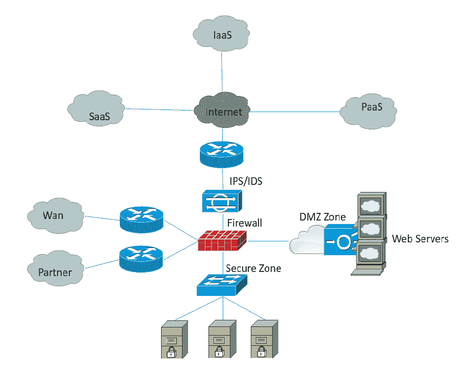

# 第四章：云安全设计

在上一章中，我们探讨了如何在安全网络中保护服务器基础设施。我们还讨论了在将系统迁移到生产环境之前考虑服务器硬化的重要性。在本章中，你将学习云基础设施的安全问题。作为用户，你不需要管理或保护服务提供商的物理基础设施。

IT 行业正在经历一场重大变革，云计算的采纳显然是许多公司和个人的战略方向。本章为你打下云计算的基础，帮助你清晰理解这一主题，然后再深入探讨关键应用和将数据迁移到公有云网络。云计算带来许多好处，但也有一些缺点。它还引入了确保云用户外包数据安全的难度。在本书中，我们将从通用的角度探讨云安全和风险问题。

本章将涵盖以下主题：

+   云服务

+   公有云与私有云

+   共享技术和共享危险

+   云计算的安全方法

+   DOS 攻击防护

+   数据丢失防护

+   被利用的系统漏洞

# 云服务

这是一个话题小但争议大的问题。这个争议探讨了在一个组织计划迁移到云时，哪种云模型更适合企业。基于云的虚拟基础设施相较于传统数据中心有其优势。私有云和公有云模型都有各自的优缺点。任何迁移到云的组织必须首先仔细分析这些内容，然后再决定适合他们的方式。

在本节中，我们将简要地回顾云服务，重点讨论两种服务的安全性好处。云计算的三种主要模型如下：

+   **基础设施即服务** (**IaaS**)

+   **平台即服务** (**PaaS**)

+   **软件即服务** (**SaaS**)

以下图表是自我解释的。它展示了云服务，并指出这些服务中哪些应该由客户管理，哪些应该由云服务提供商管理：

真正的云服务提供商不仅提供高度自动化的虚拟化环境，而且全球资源的覆盖才使其成为真正的云服务提供商。这里的全球覆盖由用户的接近程度和用户与服务提供商的距离定义。例如，如果我在一个名为*A*的区域，而我的云服务提供商也在*A*，那么我的用户体验将比在*B*或*C*的其他用户要好得多。AWS/Azure 拥有全球覆盖，能够提供所需的资源，将应用程序更接近全球的最终用户。全球覆盖还使得消费者能够指定其数据存储的位置。

# IaaS

IaaS 是一种高度自动化的云服务。在 IaaS 中，计算、存储和网络能力由云服务提供商拥有，并以按需自助服务的方式提供给客户。这种基础设施使用 GUI 界面或命令行界面，作为客户管理整体环境的控制台。云用户将对虚拟机拥有完全的管理员权限。下面的图示展示了一个典型的 IaaS 模型，其中计算、网络、负载均衡和存储由云消费者提供：

# PaaS

PaaS 是云计算的另一种服务形式，处于 IaaS 和 SaaS 之间的中间层，主要为开发人员提供运行时环境来构建和测试应用程序。使用 PaaS 时，用户不需要像从 AWS 或 Azure 请求虚拟机那样进行操作，而是可以请求一个实际的应用程序和底层的云基础设施，包括网络、服务器、操作系统、存储和安全性，这些都由云服务提供商进行管理。PaaS 帮助企业通过减少市场时间来最小化运营成本并提高生产力。PaaS 用户在将来希望更换云服务提供商时，常常担心供应商锁定和缺乏可移植性。然而，所有云服务提供商都会提供一个标准化平台，以避免供应商锁定的情况。

# SaaS

SaaS 云服务易于使用，是最流行的云计算形式之一。SaaS 还采用基于 Web 的交付模型。大多数 SaaS 应用程序可以直接在 Web 浏览器中运行，无需任何下载或安装，从而消除了在单独的计算机上安装和运行应用程序的需要。简单来说，用户可以访问安装在服务器上的应用服务。企业可以更加专注于实际业务，而不是 IT 管理，因为一切都由云服务提供商进行管理：应用程序、运行时、数据、中间件、操作系统、虚拟化、服务器、存储、安全性和网络。Gmail、Salesforce 和 Office 365 是由 Google、Salesforce 和 Microsoft 提供的著名 SaaS 服务示例。

# 公有云与私有云

选择公共云和私有云模型将取决于一个组织的业务模型、预算、安全性和合规性因素。我们来讨论一下它们之间的一些主要区别。

公有云基本上是基于互联网的云计算平台。主要的公有云服务提供商包括亚马逊**弹性计算云**（**EC2**）和 Windows Azure 服务平台。由于公有云使用共享基础设施和虚拟化环境，多个客户可以同时使用服务而不互相干扰。它采用基于订阅的按使用付费模式，产生的费用仅基于实际使用的容量。

另一方面，私有云解决方案提供的云服务几乎与公有云相同，但基础设施仅为一个组织或企业独立部署和运营。私有云也是依赖遗留应用程序、在迁移到公有云时可能出现性能差的组织，或者需要重写整个应用程序的组织的首选。

# 公有 IaaS 与私有 IaaS

现在，让我们深入探讨，尝试理解公有云和私有云在各自服务上的差异。IaaS 组件通常由公有云服务提供商定义，终端消费者对操作系统模板、版本和标准配置选项的定制化选项有限。服务提供商基于对更大范围消费者的需求以及减少不同组件变异的需求，推出标准服务。而私有云则为您提供更大的灵活性，允许您在更大程度上定制服务组件。

# 公有 PaaS 与私有 PaaS

对于 PaaS 服务的消费者来说，在决定使用 PaaS 部署模式之前，了解公有和私有 PaaS 的优缺点非常重要。公有 PaaS 运行在共享基础设施上，以托管多租户环境，而私有 PaaS 则运行在仅供一个组织使用的基础设施上。私有 PaaS 被认为更安全，可以避免公有云计算带来的商业和技术风险。选择私有云的主要考虑因素是数据安全性。这并不意味着公有云中的数据不安全，而是有时数据确实可能不安全。例如，银行行业不会将关键数据托管在公有云上。

# 公有 SaaS 与私有 SaaS

私有 SaaS 是基于单租户架构提供的 SaaS 应用程序。这些应用程序托管在本地或异地，始终在一个高度安全的网络上。应用程序定制化是其最大优势，因为在公有 SaaS 中，定制化选项非常有限。

# 共享技术与共享风险

今天，云计算已经成为一个成熟的行业。它具有成本效益，高度敏捷和灵活，能够提供按需的大规模云计算。数据安全是一个主要关注点，常见的问题是：将数据迁移到云端是否安全？在大多数情况下，数据是安全的。然而，当涉及到丢失关键信息的恐惧时，组织往往会选择私有云。

让我们讨论一下共享安全如何在公共云中工作。主要云服务提供商的安全实施并非云服务提供商的单方面责任，而是提供商和客户的共享责任。服务提供商负责底层基础设施，但资源访问和应用程序安全由客户负责。这类似于一个有很多守卫的大社区，入口处有主门被守卫着。一旦允许访客进入，访客的活动就成为了你的责任。在我们的情境中，如果在虚拟机监控器（Hypervisor）中发现了漏洞，服务提供商不会允许你进行修补。如果在操作系统中发现了漏洞，服务提供商不会为虚拟机进行修补，因此责任转移到了客户身上。

网络安全是多租户环境中的一个主要组成部分，严格的隔离是必须的。云服务提供商确实提供了一个网络基础设施，用以构建隔离的网络，但他们并不跟踪进出网络的流量类型。基础设施硬件和软件的漏洞可能导致租户之间隔离的失败。在发生故障时，如果攻击者获取了一个租户的访问权限，他们也可以访问其他租户的资源。

另一个主要威胁存在于云消费者数据中。消费者对于数据的物理存储位置可见性较差。一个非常简单的例子就是消费者数据的删除。租户数据可能存储在多个物理主机上；这些主机可能属于同一个集群，也可能不属于。如果消费者选择了地理冗余，数据可能位于一个区域，或者分布在多个区域。数据删除过程可能因服务提供商而异，消费者没有机制验证数据是否已删除。必须有可能在存储资源分配过程中，数据被下一个租户访问，否则攻击者可能会获取这些数据。

到目前为止，我们讨论了威胁的普遍性。在多租户环境中，当 CPU 在多个客户之间共享时，它可能会造成重大的风险。有趣吧？让我们详细讨论一下：

Meltdown 和 Spectre 漏洞使得共同托管的租户之间可能发生数据泄漏，尤其是在用户共享单一设备时，这种风险更为严重。云为每个客户提供独立的实例，隔离性非常强，并且没有办法从一个实例跳到另一个实例。在这种情况下，攻击者直接从处理器中提取正在处理的数据，针对共享相同芯片的客户。这可能包括你存储在密码管理器或浏览器中的密码、个人照片、电子邮件、即时消息，甚至是业务中的重要文件。当你不确定是否有人试图窃取你的数据时，这才是最大的担忧。该漏洞的利用不会在传统的日志文件中留下任何痕迹。

# 云计算的安全方法

从本地到云应用的转型过程中，消费者失去了对许多事物的可见性。网络安全*无法*为消费者提供虚拟化程度很高的云网络所需的可见性。云技术带来了某种程度的不确定性和恐惧。依赖云存储大量关键数据，而没有网络边界、较少的可见性和减少的安全控制，使管理员很难看到应用程序和数据的动态。

云计算围绕数据中心及其全球分布展开。消费者无法看到底层网络和云提供商的安全基础设施。所有云消费者面临的最大问题是，是否应该了解底层云基础设施的建设。对此问题的答案是*既是*又*不是*。对于底层网络和安全，答案是*不是*，因为你不应该管理和控制这些内容。而对于位于物理基础设施之上的逻辑基础设施，你必须有可见性，因此答案是*是*。

# 传统企业网络模型

在传统的企业和托管网络架构中，IT 资源如计算、防火墙、存储、负载均衡器和广域网都相对静态，且在明确的边界下定义，具有较高的控制度。网络安全团队实施了**安全信息和事件管理**（**SIEM**）、适当的安全区、被动 TAP、基于网络流的解决方案以及 IDS/IPS 工具，以便深入了解其网络环境中发生的安全威胁：

此图展示了一个传统网络的网页服务器、网络设备、广域网/合作伙伴连接和安全架构。在这种模型下，所有系统、网络、服务器和安全都在组织的控制之下。实现对网络的完全可见性并不是一个重大挑战。

这并不是一个完美的模型，它有自己的局限性，包括：

+   固定的架构和拓扑

+   专有协议

+   基础设施资源的低效使用

+   硬件为中心

+   手动配置过程

+   缺乏自动化和可编程性

# 混合数据中心和云网络

下图展示了混合数据中心从客户角度来看是什么样的。在这种情况下，你的大部分内容都位于组织网络边界之外，例如 SaaS、IaaS 和 PaaS，而你当前部署的安全解决方案已经失去了对部署在全球另一侧的基础设施的可见性。在网络可见性方面，IaaS 模型比 SaaS 更灵活。另一方面，SaaS 模型不允许查看云应用程序背后的基础设施：

让我们看看云数据中心网络是什么样的，以及为什么从客户的角度来看我们会失去 SaaS 的完全可见性。大多数大型云服务提供商都有一个非常灵活且具有弹性的无脂肪网络，看起来类似于以下图示：

在这个云设计中，通过利用**网络功能虚拟化**（**NFV**），所有网络功能，如防火墙和负载均衡器，都已经被移到服务器层。这种设计支持增加东西向流量，而传统的模型是基于传统的客户端-服务器（南北向）流量。这些服务器也是共享资源，虚拟机分配给客户。服务提供商可以使用 GRE 或 Vxlan 加密来连接一个虚拟机到另一个虚拟机：

在这种模型中，资源可以位于服务器集群的任何位置。作为客户，我们无法控制选择物理资源。从 ISP 到 L3 **机架顶端交换机**（**TOR**）以及从一台物理服务器到另一台，通信是加密的，并由服务提供商控制，因此你无法查看网络流量。IaaS 服务提供了配置虚拟设备的选项，如防火墙虚拟设备和虚拟 TAP。这些可以提供一定的可见性，但 SaaS 将是一个完全的零可见区。

# IaaS 的网络安全设备

虚拟设备可以用于保护或获得客户环境的可见性，特别是针对 IaaS。这与服务提供商的基础环境无关。

让我们来看看 Microsoft Azure 为客户提供的安全层级。对于来自互联网的入站流量，Azure DDoS 是第一层安全防护，帮助我们保护 Azure 客户资源免受大规模攻击。接下来是客户定义的公共 IP 地址（端点）。有些端点是标准的，其余的可以由客户定义，用于确定哪些流量可以通过云服务（公共 IP）传递到虚拟网络资源。原生的 Azure 虚拟网络隔离确保了与所有其他客户网络的完全隔离，并且提供了重新利用 IP 地址空间的灵活性。网络安全组是下一层，它充当基于用户定义规则的防火墙访问控制列表。网络虚拟设备是最后一层。这可以用于创建安全边界，保护受保护虚拟网络中的应用程序部署：

# 防火墙虚拟设备

多层架构是云应用程序中的常见做法。虚拟防火墙设备是一个预安装的软件解决方案，运行在虚拟机之上。所有进出流量都经过防火墙。这提供了完整的可见性和更好的控制。客户可以使用这些防火墙来实现流量控制和虚拟专用网（VPN）。

一个典型的部署可能如下图所示。这些产品可以从市场中选择，并且支持**BYOL**。主要供应商有 Cisco vASA、Barracuda、Palo Alto 和 Check Point：

让我们来看看网络安全组，这是 Azure 内置的一个功能。你可以在*虚拟机网络*部分找到这个选项：

你还可以根据需要添加/删除入站或出站流量规则，方法是指定不同的参数，如源、目标、端口范围、协议、动作和规则优先级：

# 虚拟 TAP vTAP

在传统网络中，你可以通过应用某种 TAP 设备或端口镜像（SPAN）来捕获数据流量。端口镜像会创建两个节点之间传输的数据包的副本，通常通过网络设备进行。在云中提供此功能，你必须使用 tap-as-a-service。启用并配置后，它将允许系统管理员在其租户网络上运行 IDS。此类解决方案的良好示例包括 Ixia 的 Phantom TAP 和 Gigamon1s 的 GigaVue。像 Cisco 1000V 这样的高级虚拟交换机也支持 SPAN 端口功能。

# 虚拟路由器

虚拟路由器是一种软件功能，运行在普通服务器上，而不是专用的硬件平台。你可以利用传统硬件路由器所提供的所有功能，如防火墙、高级路由、访问控制列表（ACL）和 NAT 功能。一个非常著名的产品是 Cisco 的 CSR 1000v。

# 虚拟 Web 应用防火墙  

Azure 云通过将**Web 应用防火墙** (**WAF**) 添加到 Azure 应用程序网关服务来提供 Web 应用安全。这是一个来自第三方的虚拟机设备，位于 Azure 市场，提供第 7 层安全性，可添加到应用程序网关进行应用层检查：  

典型的 WAF 解决方案可保护您免受以下攻击：  

+   SQL 注入  

+   XSS（跨站脚本攻击）  

+   常见 Web 攻击  

+   HTTP 协议违规和异常  

+   **分布式拒绝服务攻击** (**DDoS**)  

+   僵尸网络和扫描器  

+   常见的 IIS 和 Apache 配置错误  

# DDoS 攻击防护  

DDoS 攻击是托管在公共云上的应用程序面临的主要安全问题之一。游戏行业尤为容易受到 DDoS 攻击的影响。由于公共云的责任是共享的，服务提供商免费提供基本的 DDoS 保护服务，并通过服务分析、流量模式的变化以及提供遥测监控视图来提供定制化服务。  

在编写本章节时，Azure DDoS 保护标准处于预览阶段。Azure 提供基本和标准的 DDoS 保护，AWS 则称之为标准和高级 DDoS 保护盾。  

# 数据丢失防护  

**数据丢失防护** (**DLP**) 是一种保护静态数据、传输数据和终端数据的过程，旨在降低数据盗窃或未经授权泄露的可能性。企业数据中心内的本地备份技术和流程对公共云的保护效果较差。敏感数据的故意或意外删除可能给组织带来严重问题。由于缺乏可见性，客户数据始终容易遭受数据丢失。通过在将数据传输到云端或云供应商之间时进行加密，可以提供额外的数据保护安全层，降低数据丢失的风险。  

这两项任务将是数据丢失防护策略的主要考虑内容：  

+   **公共云数据的自动备份**：公共云敏感数据的备份极其重要，应高度自动化并采用适当的加密措施。  

+   **删除控制和验证**：如果数据删除验证失败，可能会因缺乏可见性而导致后续数据丢失，从而带来灾难性的后果。必须有一种方法来检测和显示数据是无论是意外还是故意删除的。必须实施多因素认证和严格的访问控制，以防止未经授权访问敏感数据。  

# 被利用的系统漏洞  

在迁移到云计算时，您需要考虑以下安全问题以增强数据安全性。  

会话劫持攻击基于会话 cookie，并利用用户之前已认证的会话。账户劫持或会话劫持对于云服务提供商和用户来说并不陌生。黑客能够获得登录凭据，并可以轻松追踪用户活动。当攻击者在没有用户凭据的情况下访问云驱动器文件时，也会发生类似的攻击。这种攻击通过通过钓鱼攻击或驱动器利用来窃取密码令牌，后者是一个小文件，通常驻留在用户设备上以方便用户（避免每次都输入密码）。一旦攻击者获得访问权限，他们就能访问并窃取文件，甚至向受害者的云文件夹添加恶意软件或勒索软件，用于进一步的攻击。

`Https://` 并不能防止会话劫持攻击。

基于云的 DDoS 攻击现在是一大威胁，因为快速启停成千上万的虚拟机变得非常容易。攻击者并非从单一的服务提供商和位置发起此类攻击——如果机器分布在多个位置，每个机器向受害者生成流量，那么攻击的强度会非常高。服务提供商通常有检测机制来检测异常流量，因此如果从单一服务提供商发起大量攻击，被发现的几率非常高。另一种攻击类型是暴力破解攻击。如果从云端发起，这种攻击可以非常强大，因为它每秒可以尝试成千上万的密码，甚至可以破解 SHA-1 哈希。

**云应用编程接口**（**Cloud API**）是一种 API，通常基于**表述性状态转移**（**REST**），用于开发应用程序和服务，提供云硬件、软件和平台的服务。云网络通常会因为不安全或不当使用 API 而面临风险。我们之前讨论过系统特定的漏洞，如 Meltdown 和 Spectre。

# 摘要

云计算是增长最快的计算模型，并被企业广泛采用。根据《福布斯》报道，到 2020 年，83%的企业工作负载将转移到云端。云计算提供了简化软件开发、动态服务器配置和按需 IT 资源的能力，并具有更大的灵活性。这改变了组织的 IT 运营模型。数据安全是已经将数据迁移到公有云或计划未来部署应用程序的组织中的一个关键部分。在本章中，我们讨论了云计算的不同服务以及作为云数据安全的一部分应该了解的内容。我们还讨论了云共享基础设施的安全性考虑因素以及云客户和云服务提供商之间的共享责任。在最后一节中，我们介绍了如何恢复丢失的数据并在云共享基础设施中实现网络可见性。

在下一章中，我们将讨论在应用程序发布和公开访问之前，应用程序安全性的考虑事项。

# 问题

1.  以下哪些服务为云提供商提供最低限度的内建安全性？

    1.  SaaS

    1.  PaaS

    1.  IaaS

    1.  所有提到的

1.  存储驱动器是一种云计算形式：

    1.  正确

    1.  错误

1.  以下哪项不是云计算使用的主要类型？

    1.  DDoS 即服务

    1.  PaaS

    1.  SaaS

    1.  IaaS

1.  哪些可能导致云资源服务中断？

    1.  僵尸

    1.  DOS

    1.  DDOS

    1.  后门通道攻击

    1.  2 和 3 两者都不是

    1.  以上所有

1.  以下哪项不是云服务提供商？

    1.  亚马逊

    1.  亚马逊 EC2

    1.  Hadoop

    1.  SAP

    1.  Azure

# 进一步阅读

欲了解更多信息，请参考以下链接：

+   [`meltdownattack.com/`](https://meltdownattack.com/)

+   [`docs.microsoft.com/en-us/azure/virtual-network/ddos-protection-overview`](https://docs.microsoft.com/en-us/azure/virtual-network/ddos-protection-overview)

+   [`aws.amazon.com/shield/`](https://aws.amazon.com/shield/)

+   [`www.cisco.com/c/en/us/products/routers/cloud-services-router-1000v-series/index.html`](https://www.cisco.com/c/en/us/products/routers/cloud-services-router-1000v-series/index.html)

+   [`www.sdxcentral.com/nfv/definitions/whats-a-virtual-router-vrouter/`](https://www.sdxcentral.com/nfv/definitions/whats-a-virtual-router-vrouter/)
