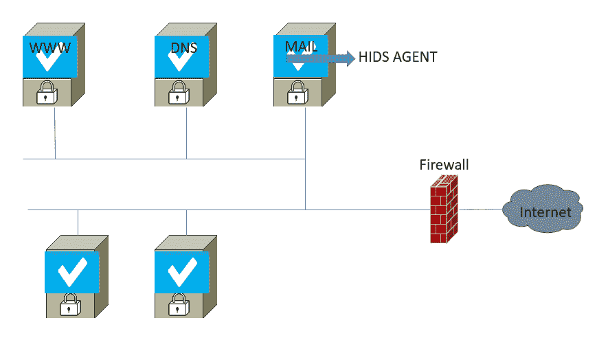
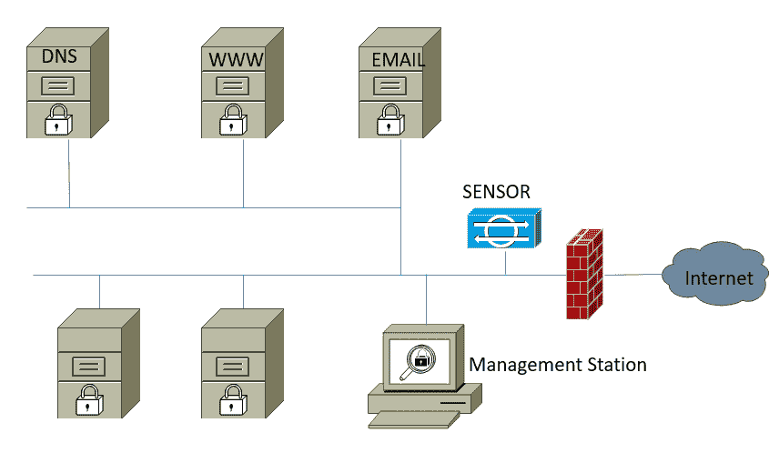
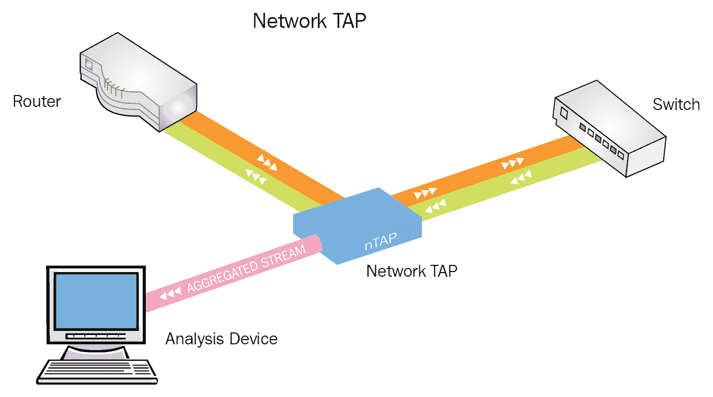
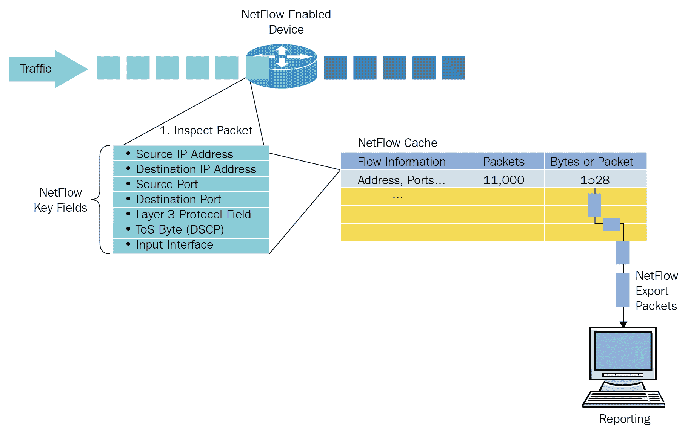
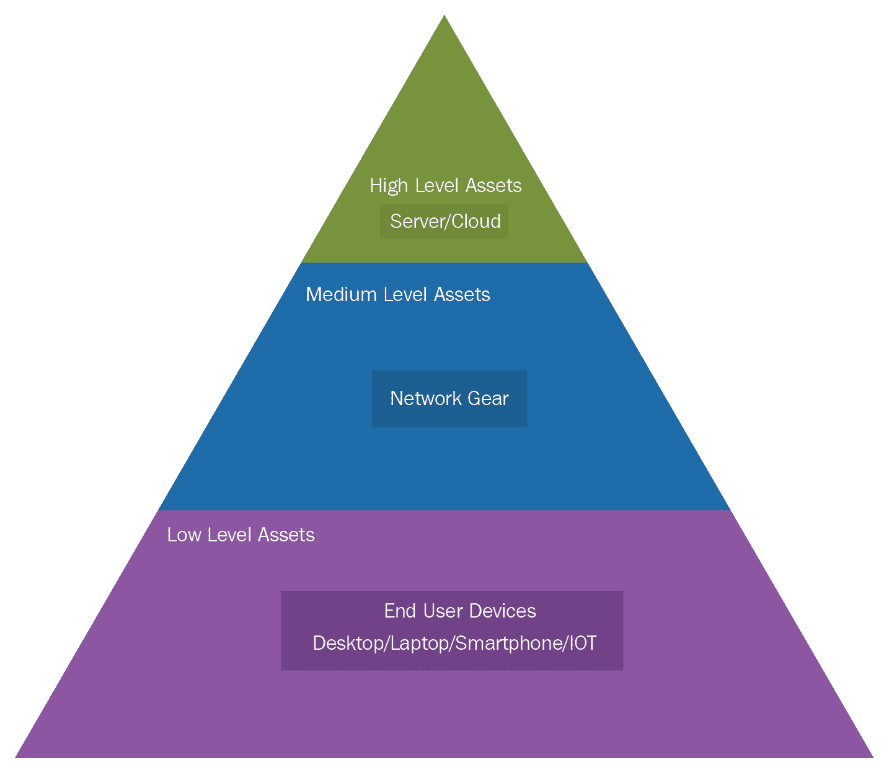
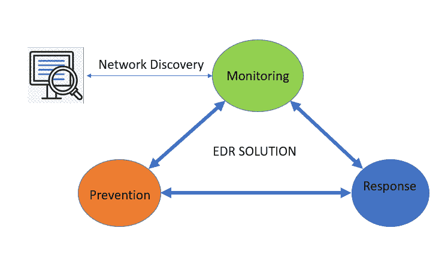
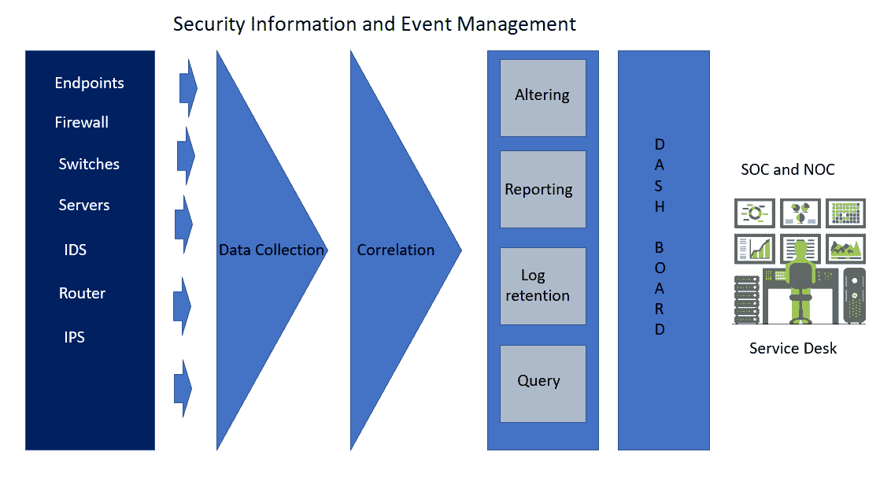
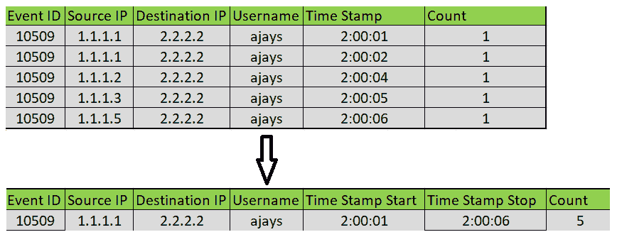
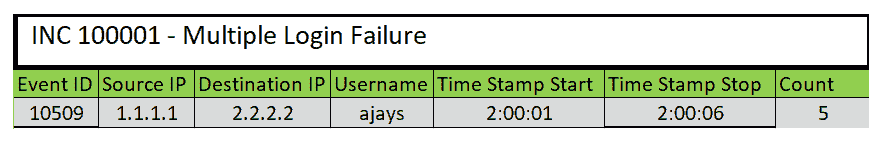

# 第六章：威胁检测与响应

在上一章中，您已经了解了在设计和启动应用程序时涉及的常见风险。您还学习了帮助用户安全浏览应用程序的常见保护方法。

在一个高度互联的世界中，应对网络威胁已成为组织和安全专业人员的新现实。在本章中，我们将探讨威胁检测的基础知识以及减轻持续威胁的方式。最后，您将学习如何根据业务目标选择和部署先进的威胁防护系统。典型的网络包含关于用户的信息，还包括安全信息。保护您的组织的一个关键步骤是对正常和异常流量模式、URL 扫描、被阻止的流量、访问恶意网站时的基于排名的网站、检测僵尸网络、DDoS 防护以及对未知威胁的防御实现端到端可见性。

在本章中，我们将涵盖以下主题：

+   网络威胁检测

+   端点威胁检测

+   安全信息与事件管理

# 网络威胁检测

为了保护信息，组织需要改变思维方式。管理员需要停止认为防火墙、IPS、IDS 和防病毒软件套件能够保护其系统免受所有类型的网络威胁。大多数传统的安全检测模型已经过时，甚至无法区分恶意软件和常规网络流量。一个组织的数据安全程序理想情况下可以阻止大多数已知威胁。然而，还有许多*未知的、恶意的*威胁，组织旨在检测这些威胁，但此前未曾遇到过。这可能是由于全新的方法和技术。

# 检测方法

网络入侵检测系统本身并不完美，常常会受到误报和漏报的干扰。因此，任何威胁检测系统都需要既有人力元素，又有技术元素。人力元素可以由安全分析师来参与，他们分析趋势、数据流量模式、行为和报告，并能够判断异常数据是否表明潜在威胁或是假警告。

让我们来看看不同的检测方法。

# 入侵检测系统

**入侵检测系统**（**IDS**）是一种基于特征的软件，旨在监控或扫描网络流量，寻找可疑活动，并在某些行为试图通过恶意活动或安全策略违规破坏信息系统时触发警报。警报信息包含入侵的源地址、目标/受害者地址以及怀疑的攻击类型。IDS 被称为攻击检测技术，但它不能防止或阻止攻击。相反，IPS 设备可以通过检测攻击并在它们到达目标之前主动阻止它们，从而防止攻击。

# IDS 类型

入侵检测系统可以根据其部署位置进一步分为两大类：基于主机的 IDS 和基于网络的 IDS。

+   **主机基入侵检测系统（HIDS）**：这是一个小型的、基于代理或传感器的软件，安装在网络中的单个或多个主机上。它通过监控和报告系统配置以及跟踪应用程序活动来保护单个主机。主机 IDS 本质上是被动的，提供通过识别、记录、警报和报告来收集信息的功能。你可以在不同的 DMZ 服务器上安装 HIDS，例如 web 服务器、邮件服务器、数据库服务器，或任何你希望在网络中监控或保护的服务器。任何掩蔽技术，如插入、填充、分段或乱序传输，虽然可以绕过基于网络的 IDS，但可以轻松被基于主机的 IDS 捕捉。任何 HIDS 的主要目标是监控和分析通过主机的**网络接口卡**（**NIC**）的流量，但也可以扩展到监控应用程序行为和活动。



+   **基于网络的入侵检测系统（NIDS）**：它提供了一种不同的方法，监控整体网络流量的活动，而不是每个单独的主机。NIDS 的操作基于窃听的概念，系统配有已知的攻击特征，也可以进行定制。特征更新由供应商定期发布。NIDS 的主要问题是性能。对于小型组织，这可能是一个合适的解决方案，可以处理数 GB 的流量。然而，对于高速网络的大型组织来说，它显然无法应付：

NIDS 不会解密加密流量。

# 网络捕获解决方案

通过在网络中部署网络 TAP，并将流量通过网络 TAP 或 SPAN 端口重定向到安全分析器，可以嗅探网络中的 IP 流量。下图展示了流量从路由器和交换机通过网络 TAP 传输的过程。之后，流量被引导到一个主机网络嗅探分析器的端口。该方法提供了对网络中所有流量的全面可见性。网络 TAP 的一个最大优势是能够在不干扰流量的情况下监控网络流量。

然而，也有一些缺点。包括 TAP 的部署会造成干扰，并且本质上很昂贵，对于大规模网络来说，管理起来也可能很困难。由于需要使用安全分析器来关联所有数据包捕获，识别并缓解安全攻击，TAP 的部署以及数据存储，可能会产生显著的费用。这些费用源自任何给定网络拓扑中的多个物理链路。



网络 TAP 可以分为两类：

+   **被动 TAP**：被动 TAP 是被动设备，它会复制网络数据并将其分发到在网络节点之间传递的第三方设备上。

+   **主动 TAP**：这是 TAP 内部的工作方式，是其与被动 TAP 的区别所在。主动 TAP 用于铜缆或光纤预算无法支持被动 TAP 的网络环境中。

安装 TAP 通常需要一定的网络停机时间，如果 TAP 出现问题，这个停机时间可能会延长。

# 使用 NetFlow/IPFIX 进行威胁检测

在云规模和高速数据网络中，趋势是基于 NetFlow 和**IP 流量信息导出**（**IPFIX**）来监控并触发可疑流量事件。大多数网络设备、路由器/交换机和防火墙都支持 NetFlow 和 IPFIX。这些流量方法使得通过设备的数据流量变得可见。你可以将这些方法与 Wireshark 捕获相联系，Wireshark 捕获包含如源 IP、目标 IP 和 TCP/UDP 端口等信息。Wireshark 捕获类似于电话录音，而流量则类似于包含元数据信息的通话记录。流量报告系统持续监控流量，并能够连接主机声誉数据库，以检查任何异常的流量模式：



在思科路由器上，可以为 NetFlow v9 进行此配置。在 NetFlow v9 发布之前，流量的字段仅限于大约 20 个常见字段，其余数据包内容会被丢弃。NetFlow v9 的引入使得可以使用数据导出逻辑来提取数据包中的任何细节：

```
 match ipv4 protocol
 match ipv4 source address
 match ipv4 destination address
 match transport source-port
 match transport destination-port
 match interface input
 collect routing source as
 collect routing destination as
 collect transport tcp flags
 collect interface output
 collect counter bytes
 collect counter packets
```

假设你正在导出 TCP 标志信息以及网络流量，你还知道网络流的源和目标。拥有这些信息可以轻松检测到 SYN（一个 TCP 标志）攻击。在流技术中，网络威胁检测主要集中在监控流量行为，而不是执行 DPI（如防火墙）并根据威胁签名匹配触发事件。DPI 方法对于大型基础设施（如云服务提供商）扩展性不佳，后者的流量以每秒 Tera/Peta 位的速度进入。由于缺乏流量处理能力，这使得用昂贵的设备（如防火墙和 IPS 系统）扫描所有流量几乎变得不可能。

# NetFlow vs. IPFIX

首先，IPFIX 是 NetFlow v9 的增强版，广泛被认为是 NetFlow v10。IPFIX 是一个 IETF 标准，专门设计用于使流数据更容易向各种厂商开放。

如你所知，IPFIX RFC 5101 和 RFC 5102 源自于 NetFlow v9 RFC。IPFIX 也与 v9 向后兼容，这得益于厂商们希望摆脱思科主导的标准。这本质上允许硬件厂商指定厂商 ID，将任何专有信息放入流中，并将其从收集器/分析器中导出，以便进一步剖析和监控。NetFlow v9 现在支持灵活的 NetFlow，几乎等同于 IPFIX。默认情况下，IPFIX 监听 UDP 端口 `4739`，而 NetFlow v9 监听 2055、2056、4432、4739、9995、9996 等端口。NetFlow v9 定义了 79 种字段类型，IPFIX 也定义了相同的 79 种，并继续扩展至 238 种。

# 端点威胁检测

无论你的防御有多强，攻击者总有可能绕过你的安全系统并获得访问权限。端点安全通常指的是一种保护组织数据和网络的明确定义方法，这些数据和网络是由最终用户和连接设备访问的。笔记本电脑和台式机不仅被认为是端点；智能手机和其他无线设备也具有网络访问功能，成为安全威胁的目标和入口点。

# 什么是端点

端点是指任何连接的设备，用于访问组织的数据和网络资源。如何处理端点设备，以保护通过这些系统可访问的数据资产，是安全管理员的一项艰巨任务。

当你允许员工使用**自带设备**（**BYOD**）时，安全管理员面临的挑战更加复杂。像物联网（IoTs）这样的未来技术也被视为端点。

以下图表显示了在任何组织网络中发现的不同类型资产的层级结构。从底到顶的方式反映了设备数量和业务价值在风险方面的关系。就数量而言，终端用户设备的数量通常多于其他任何设备，网络设备和关键业务端点的数量相对较少：



从业务角度来看，金字塔图展示了被攻击的风险。金字塔底部的设备更容易受到严重威胁，这为攻击者打开了通向高价值资产的大门。攻击者在金字塔上攀爬得越高，影响越大。

# 端点检测与响应（EDR）系统

网络交互的每个点都是潜在的网络攻击面。端点安全简单来说就是通过加固设备来减少攻击面，并限制网络攻击向量。**端点检测与响应**（**EDR**）是整体安全战略的重要组成部分，旨在满足持续监控和应对高级威胁的需求。保护端点始于端点发现，因为了解网络上有什么至关重要。资产发现有助于建立包括固件、操作系统和其他许多属性的清单。安全管理员现在可以为端点分配适当的安全策略，并继续监控，以帮助应对任何策略违规、未经授权的更改和访问：



EDR 系统也可以是轻量级的程序，称为代理程序，它们以应用程序的形式在每个端点上运行。它们甚至可以以内核级插件的形式运行在可能不支持直接托管应用程序的设备上。在某些场景下，也可以使用无代理的方法。代理提供对通过网络接口卡（NIC）传输的数据流量的实时监控、分析和警报。你的端点可以托管在本地网络上，例如企业数据中心，也可以托管在云网络上，使用各种设备，如虚拟桌面，或使用多种操作系统，如亚马逊 Web 服务（AWS）和 Azure 部署。

# 案例研究 – 为什么需要 EDR 系统？

**端点检测与响应**（**EDR**）解决方案本质上是一套下一代安全工具，专注于监控、检测、调查和缓解恶意活动以及可能针对端点的攻击，超越了传统安全工具中基于签名的遗留方法。

让我们看一个 EDR 系统可以提供帮助的例子：

一家在线购物公司的**网络运营中心（NOC）**开始收到 500 内部服务器错误日志的警报，其中 10% 的交易失败。在初步调查过程中，NOC 认为这可能是某种 DDoS 攻击，但他们的防火墙和网络入侵检测系统并未报告任何相关事件。然后他们认为这是一个被利用的系统漏洞，但他们的漏洞扫描器也未报告与此事件相关的任何信息。最后，通过使用带配置管理的 EDR，查看系统状态历史记录后，确定服务器农场中的四台系统（共 20 台服务器）上部署了错误的操作系统更新补丁。补丁被重新部署后，错误消失了！

# 安全政策

安全政策是一份定义了保护各种资产（包括物理资产和虚拟资产）计划的文件。以下领域必须被涵盖：

+   风险评估政策

+   密码政策

+   电子邮件政策

+   网络政策

+   灾难恢复

+   入侵检测

任何违反这些政策的行为都应被监控，并优先进行分析和响应。这些可以用于及早发现任何安全漏洞。任何希望实现高水平安全成熟度的组织，应不定期检查和调整其终端安全政策。

# 如何选择 EDR 解决方案？

网络攻击越来越多地针对组织，导致近年来多次数据泄露事件。这些攻击不仅在数量上增加，而且在性质上也变得更加复杂。这些复杂的新方法更加复杂，且更难被发现和阻止。EDR 与其他**终端保护平台**（**EPP**）如杀毒软件（AV）和反恶意软件不同，其主要焦点不仅仅是自动停止终端执行前的威胁。对于任何一个注重业务并希望确保免受攻击威胁的组织来说，EDR 解决方案是最优先的需求。

市场上有许多 EDR 解决方案。然而，平台之间的功能可能有所不同。在评估 EDR 平台时，您必须考虑包括可视化水平、报告、自动化、响应效果、部署简便性、对环境的影响，最后是符合预算的解决方案等能力。

以下是组织在选择合适的 EDR 解决方案时需要考虑的事项：

+   EDR 解决方案应作为基于复杂分析的托管服务运行，组织需要能够查看 EDR 操作和管理。这可能会因组织的需求而有所不同，是否仅需要防护，或者是否还需要可视化。

+   任何可行的 EDR 候选方案必须支持其网络上的所有类型终端。

+   以可扩展且具有成本效益的方式快速部署数万或数十万个终端。

+   该解决方案应足够智能，能够关联跨多个终端的活动。

+   该解决方案不应消耗大量的终端资源，如带宽和 CPU。

+   最后，购买和部署的成本，加上所有的持续费用，必须符合您的安全预算。

这个链接为您提供了市场上不同 EDR 解决方案的比较：[`www.gartner.com/reviews/market/endpoint-detection-and-response-solutions`](https://www.gartner.com/reviews/market/endpoint-detection-and-response-solutions)

# 安全信息和事件管理

理解网络内部发生的情况是确保网络安全并持续进行监控的关键元素。管理来自服务器和安全设备的数据流，包括活动和使用这些可用服务的情况，是提供此类安全保障的关键。SIEM 是一个工具，它将来自网络传感器（如 IPS、IDS、蜜罐、防火墙或任何能够检测安全事件并将信息提供给 SIEM 工具的设备）汇总的信息整合起来。SIEM 提供您网络的当前状态，并为 IT 环境提供 360 度视图。与日志事件的关联使得能够查看网络中发生的情况，加入此功能后，事故响应团队可以做出反应。

# SIEM——事件与事故和数据泄露的区别

如果您曾经是网络或安全专业人士，您可能会熟悉诸如日志、警报、通知、事件和事故等术语。这些术语的含义取决于您如何标记某个事件，这将决定您的响应方式。

# 什么是事件？

根据**国家标准与技术研究院**（**NIST**）的定义，"*系统或网络中的任何可观察到的事件，如发送电子邮件、SSH 登录到任何设备，或防火墙阻止连接尝试，都被定义为事件*。"

# 什么是安全事件？

安全事件是违反组织安全政策和程序，并危及信息资产的完整性、机密性和可用性的事件。例如，简单地登录到 SSH 服务器被视为一个**事件**，但使用多个登录尝试对 SSH 服务器进行暴力破解攻击则被视为安全事件。所有类型的安全事件应能采取行动，无论是通过自动化方式还是由安全分析员处理。

# 什么是数据泄露？

数据泄露是最为关键和确凿的安全或隐私事件。这些事件可能涉及个人或商业敏感信息。存储敏感数据总是受州法律定义的法律约束。数据泄露还需要通知受影响的个人或用户、监管机构，有时还包括信用报告机构和媒体。

到目前为止，Facebook–剑桥分析数据丑闻是迄今为止发生的最严重的数据泄露事件。

# SIEM 系统是如何工作的？

SIEM 可以提供由任何可以生成可收集日志流的系统产生的安全警报的实时分析。



# 事件生成传感器

日志是可视化网络中发生的事情以及谁在攻击的关键和基本要求。每个组织都希望从网络和业务的所有关键资源中获得日志。作为安全管理员，你总是希望从防火墙、IPS 和 IDS 中获取日志。你还希望从位于 DMZ 的关键服务器中获取日志，当然，你还会包括 Active Directory 服务器以及关键应用程序、端点和数据库服务器的日志。

# 事件和日志收集或数据聚合

日志收集或聚合是 SIEM 解决方案的核心。SIEM 不应与 SYSLOG 数据混淆，SYSLOG 是由设备生成的简单日志。必须有人查看这些日志，以找出警报的根本原因。其目的不仅是收集日志数据，还要从日志数据中创建有意义的上下文。SIEM 平台从安装在各种设备上的成千上万的不同传感器中收集事件日志，这些事件提供活动数据，这是分析我们 IT 环境安全所必需的。为了获得 360 度的视角，我们需要将收集的数据整合到一个平台上，以找出模式。聚合是将来自不同类型源的数据转换为通用存储库和有意义的标准格式的过程。

例如，事件 ID 10509 导致了登录失败，日志数据传送到 SIEM 解决方案。很容易将此事件与攻击或事故相关联：



# 关联

事件关联是 SIEM（安全信息和事件管理）将一系列事件联系起来，生成事故或更有意义的事件的过程。在我们之前的示例中，有五次来自多个源机器的相同用户账户的登录失败尝试。对于安全分析师来说，这可能值得调查。记录关联是提出警报的最佳方式：



# 报告与警报

警报是使 SIEM 系统根据配置的规则触发警报的功能。所有解决方案至少会在 SIEM 控制台发出警报，但一些解决方案可能提供扩展的警报功能。

# 仪表板

对于大规模 SIEM 部署，SIEM 解决方案必须拥有有效的仪表板，用于合规性、基础设施和安全分析。仪表板使安全管理员能够更容易地可视化趋势和活动报告，识别异常，跟踪安全指标，并评估 IT 环境的整体安全态势。大多数 SIEM 产品都带有预构建的仪表板，但这些仪表板也可以根据需求进行定制。

# 自动化

安全专业人员花费大量时间运行自定义查询以获取所需的数据。他们还花费大量时间浏览多个仪表板和数据源，只为找到调查单个警报所需的细节。随着网络攻击的不断增加，开发更好的识别和响应潜在攻击与安全威胁的能力变得尤为重要。

为了说明这一点，让我们看一下以下场景：

这是一个星期六的晚上，你收到 IT 环境中类似 WannaCry 的恶意软件感染警报。你做的第一件事是尝试远程访问你的网络，但由于某种原因，这并没有成功。你有其他选择吗？你可以换好衣服，去公司查看 IPS/IDS 报告以及分析安全报告，但这可能会花费很多时间。在报告上投入时间可能会造成更多损害，因为此类攻击传播迅速。此时，最简单的方法是通过关闭设备或拔掉电缆来隔离网络。但这可能行得通吗？是的，但仅适用于小型网络，仅有少数几台服务器和少量网络设备。然而，对于大规模的地理分布式网络，这种方法几乎不可能实现。

现在想象一个自动化事件响应系统，一旦检测到恶意软件，它就会发出警报，并通过短信通知你。你的 SIEM 解决方案将通过将感染的机器从网络中隔离来响应此类威胁，当你收到短信通知，告知问题已暂时解决时，平静将恢复。到周一你返回办公室时，可以分析安全报告并恢复关键系统。

让我们再看几个例子：

+   **阻止恶意 IP 地址**：任何组织的第一道安全防线是外围防火墙。我们知道防火墙是根据规则工作的，这种情况可以通过创建新规则，在检测到可疑活动时立即阻止恶意 IP 来解决。

+   **节点隔离**：SIEM 可以自动进行漏洞扫描，识别处于风险中的系统。响应工具可以通过禁用感染系统的网络连接，将其与网络隔离。

+   **DDoS 攻击**：通过仅使用日志监控，SIEM 工具可以用于检测拒绝服务（DoS）攻击，这是最危险和最常见的网络攻击类型之一。根据日志分析，系统可以生成 DoS 攻击的警报，并进一步自动化流量重定向到 DDoS 清洗器。

# 网络发现

网络发现基本上用于发现给定网络上的多个活动主机。对此有许多方法可以进行配置。

# 日志管理

日志管理的基本前提非常简单。网络设备和操作系统都会生成事件和通知。SIEM 解决方案根据时间周期组织并存档这些日志事件数据。任何超过安全管理员定义的时长的日志通常会被移到某种备份位置。

# SIEM 商业产品

以下是根据 2017 年调查结果列出的市场上最著名的产品：

+   LogRhythm

+   LogPoint

+   Splunk

+   QRadar

+   AlienVault OSSIM

+   RSA Security Analytics 平台

+   ArcSight

# 总结

安全的定义有多种方式，但对 IT 安全专业人士来说，这只是与网络犯罪分子的简单竞争。在这场竞争中，赢家拥有网络。我们无法保护我们不理解的东西——就是这么简单。在本章中，我们讨论了如何在潜在的安全威胁影响我们的网络、主机基础设施和应用程序之前进行检测。我们还讨论了一个事实，即对于人类来说，阅读来自各种设备的所有日志是非常困难的。考虑到这一点，我们讨论了 SIEM 工具及其与自动化和自动化威胁响应技术的未来发展。

在下一章中，我们将讨论漏洞评估以及为什么每个组织都需要这些来保护信息。

# 问题

1.  在 SIEM 环境中，通常会包括哪些元素？

    1.  客户端、服务器、代理

    1.  存档、云处理器、贡献网络

    1.  中央处理节点、传感器、数据库/日志记录

    1.  代理、传感器、日志记录、报告、中央处理节点

1.  SIEM 如何直接支持增强的安全服务？

    1.  通过提高事件消息的完整性

    1.  通过使用认证信息叠加额外的上下文信息。这将实现认证的关联视图。

    1.  通过提高处理环境的整体可用性

    1.  通过提高事件消息的机密性

1.  在考虑 SIEM 服务的预算时，应该考虑哪些组件？

    1.  监控代理和控制台

    1.  软件许可、实施费用

    1.  实施项目、硬件（平台/存储）、软件、运营成本

    1.  存档存储系统和处理节点

1.  黑客攻击的哪个阶段对网络或系统执行实际攻击？

    1.  侦察

    1.  维持访问权限

    1.  扫描

    1.  获得访问权限

1.  哪个陈述最适合利用 IT 系统安全的弱点？

    1.  威胁

    1.  攻击

    1.  漏洞利用

    1.  漏洞

# 进一步阅读

欲了解更多信息，请访问以下链接：

+   [`www.sans.org/course/siem-with-tactical-analytics`](https://www.sans.org/course/siem-with-tactical-analytics)

+   [`www.cisco.com/en/US/technologies/tk648/tk362/technologies_white_paper09186a00800a3db9.html`](https://www.cisco.com/en/US/technologies/tk648/tk362/technologies_white_paper09186a00800a3db9.html)

+   [`www.sans.org/reading-room/whitepapers/detection/understanding-intrusion-detection-systems-337`](https://www.sans.org/reading-room/whitepapers/detection/understanding-intrusion-detection-systems-337)
