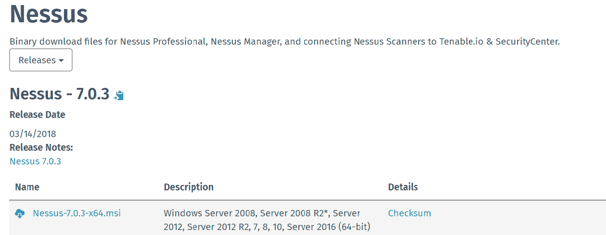

# 第七章：漏洞评估

在上一章中，我们学习了有关安全 IT 基础设施的各个方面，包括监控和应对事件、威胁检测以及分散攻击者的注意力。

在今天的数字世界中，信息是以电子方式访问、存储和传输的。这些信息及其存储系统的安全性对公司的声誉至关重要，同时也对提供更好的用户体验有重要作用。因此，分析和修复 IT 基础设施中的漏洞，已成为任何安全专家、系统管理员或网络管理员最重要的任务之一。即便一个组织已建立了良好的安全基础设施，例如防火墙、杀毒软件和入侵检测系统，攻击者依然可能通过利用漏洞获得未经授权的访问权限。在软件安全的背景下，漏洞是指软件中的特定缺陷或疏忽，攻击者可以利用这些漏洞。通过评估方法，我们将在本章中重点关注安全功能和安全评估。

在本章中，我们将讨论以下主题：

+   基础设施问题

+   Nessus 安装和漏洞评估方法

+   示例报告

# 基础设施问题

随着网络攻击威胁的日益增加（包括来自自身网络的攻击），组织保护其 IT 资源变得越来越重要。世界发展的速度比以往任何时候都要快——每年，网络犯罪分子发动的攻击次数多于软件开发者发布的补丁数量。没有任何单一系统是由一个供应商管理的——它们通常是多供应商环境：主板制造商不同；操作系统由其他厂商提供；存储则来自不同的供应商。在这个永无止境的列表之上，你的操作系统中安装了多个应用程序，此外，为了保护你的 IT 资源，你还需要防火墙和加密系统。这些系统没有万无一失的保障，始终会受到攻击的威胁。

改变整个生态系统将是一项巨大的、繁琐的任务。每天都有新技术面世，每日的补丁和版本更新发布，厂商还提供免费升级。因此，对于 IT 组织而言，保持所有资源的最新状态变得非常困难。

除了前面提到的因素外，以下是一些常见的假设：

+   我们受到防火墙和**入侵检测系统**（**IDS**）的高度保护

+   许多组织直到灾难发生，迫使他们做出反应时才进行审计

+   我的组织由于业务性质不是攻击的目标

+   漏洞评估太昂贵，我看不到任何投资回报

+   攻击者比我们更聪明；我们无法战胜他们

+   我的基础设施运行正常，我们从未觉得需要审计

+   我们不了解自己的网络基础设施

# 什么是漏洞评估？

在 IT 领域，漏洞评估是识别和分类组织系统、网络和通信基础设施中安全漏洞的过程，这些漏洞可能受到内部或外部威胁的影响。漏洞评估通常涉及使用高度自动化的测试工具，如云托管实例和网络安全扫描设备进行内部扫描。结果通常会提供漏洞及相应解决方案。当涉及识别这些安全漏洞时，我们需要决定是选择常见问题解答、漏洞评估、渗透测试还是合规性测试。实际上，漏洞评估和渗透测试是不同的活动。从合规性监管的角度来看，选择漏洞评估还是渗透测试将取决于你尝试满足的具体控制目标。在这个不断发展的数字时代，组织的数据管理和安全方法必须符合由受监管的机构或组织（如 PCI、HIPPA、GDPR、ISO 或 SOX）规定的标准。这是确保满足最低安全要求以便开展业务的重要因素。

下图总结了漏洞评估：

# 计划

一切从规划开始。规划组件将包括收集所有相关信息，定义活动范围，获取许可，角色和责任，并通过变更管理流程让其他人知晓。

# 漏洞扫描

保持系统安全和最新的最有效方法是定期进行漏洞测试，发现漏洞并突出需要采取的措施，以帮助你做出明智的决策，降低业务风险。

# 报告

漏洞报告在将每一项重要信息纳入扫描报告时非常重要。报告应包含问题类型、严重性、产品和服务、漏洞类型、潜在威胁以及概念验证的详细信息。

# 补救

补救计划应包括详细的自下而上的技术措施，如应用程序补丁、防火墙或其他基于网络设备的配置更改、政策、流程和程序的变更，或配置标准。

# 为什么我们需要漏洞评估？

漏洞评估的总体目标是扫描、调查、分析并报告与外部资源上发现的任何漏洞相关的风险严重性。它还应为组织提供适当的缓解计划，以解决之前发现的弱点或漏洞。网络漏洞扫描可以帮助组织识别其网络安全中的弱点。结果好坏取决于谁先进行扫描——系统管理员还是攻击者。

# 漏洞评估类型

漏洞评估大致可以分为两个主要类别：

+   基于网络的评估

+   基于主机的评估

为了最大化效果和安全性，必须同时进行上述两种漏洞评估。这是因为漏洞可能被内部人员、合法用户、外围外部的坏人或未经授权的用户利用。

# 基于网络的评估

基于网络的漏洞评估由内部或外部安装的扫描工具完成。这些工具允许网络管理员发现并消除组织内的基于网络的安全漏洞。

网络漏洞评估通常包括以下任务：

+   针对网络设备如路由器/交换机/无线网络的密码分析

+   审查网络抵御**分布式拒绝服务攻击**（**DDoS**）的能力

+   网络入侵

+   设备级别的安全分析（如路由器、交换机、计算机）

+   扫描已知和潜在的威胁和漏洞

一些常用工具有：

+   Nessus

+   OpenVAS

+   Qualys

Nessus 是一个免费的开源工具。它的功能与一些最好的商业漏洞评估扫描仪一样强大。

大多数著名的网络扫描仪以虚拟和物理设备的形式出现。这些硬件设备设计用于放置在客户场所，如数据中心或办公室。这些扫描仪提供对 IT 资产的持续安全性和合规性监控，并将数据发送到云实例后台扫描引擎。扫描引擎在后台自动更新最新的漏洞特征。客户部署后无需再接触这些设备。下图展示了一个典型的基于网络的扫描仪架构：

# 基于主机的评估

基于主机的漏洞评估采用客户端-服务器模型，客户端执行扫描并将报告发送回服务器/管理器。基于主机的扫描器安装在你想要监控的系统的每台主机上。基于主机的漏洞评估工具可以提供对潜在损害的洞察，这些损害可能会在系统获取一定级别的访问权限后，来自内部人员或外部攻击者。它们通常有助于发现初始访问控制设置后的弱点。基于网络的扫描器无法进行深度的低级安全检查，因为它们无法直接访问目标主机的文件系统。几种著名的开源工具包括 OSSEC、Prelude 和 SNORT。

# Nessus 的安装、配置和漏洞评估方法

Nessus 是一个非常强大的远程安全扫描工具，能够扫描设备，并在发现黑客可能利用的漏洞时发出警报，从而帮助黑客访问你连接到网络的计算机。在漏洞公开发布几天内，Nessus 就会为新的漏洞发布插件。Nessus 使用 Nmap 进行端口扫描。

让我们一步步来看如何扫描指定的网络和主机。

# 安装

要下载 Nessus 的最新版本，请访问 [`www.tenable.com/downloads/nessus`](https://www.tenable.com/downloads/nessus)。我选择下载适用于 Windows 2016 的安装包：

安装成功后，可以通过端口 `8834` 访问控制台，`https://localhost:8834`。首先，你需要提供激活密钥，并创建用户名和密码。然后，Nessus 将安装所有必需的文件和插件来扫描你的资产。插件和文件下载完成后，你将被重定向到登录页面。

# 策略

登录后，你将看到首页。请按照以下步骤操作：

1.  点击策略：

1.  点击新建策略。在这里，你会看到许多默认和内置的策略。你可以选择使用这些默认策略，或者选择一种策略来自定义自己的扫描策略：

1.  让我们进行一次基本的网络扫描。点击新建扫描，并选择基本网络扫描策略。

1.  分配一个唯一的名称，反映此扫描的目标或用途。

1.  在目标中，输入目标的 IP 地址范围。你也可以在这里输入一个范围。例如，`10.0.0.1-255` 或整个子网，`10.0.0.0/24`：

第二个最重要的因素是凭证。在扫描网络之前，你应该根据网络中主机的类型提供必要的凭证。你可以为 Windows、SSH、数据库（MySQL、Oracle 等）、虚拟机和端口（FTP、POP3 等）添加凭证：

我已经为 SSH 和 Windows 通过了凭证认证。以相同的方式，你可以从列表中添加更多的凭证，如下图所示：

默认情况下，网络扫描会在常见端口和协议上运行，如下图所示：

你可以通过将扫描类型更改为自定义，来定制发现过程，这样你可以自定义主机发现、端口扫描和服务发现：

发现模块已被划分为三个部分：

+   主机发现

+   端口扫描

+   服务发现

让我们详细讨论这些模块：

+   主机发现：主机发现是一种方法，用于检查给定网络或网络范围内的活动主机数量。当你希望 Nessus 尽快完成扫描时，可以使用快速网络发现选项。个人来说，我不会选择这个选项，因为使用此选项时，Nessus 不会深度探测网络。Nessus 还可以使用 TCP Ping，并且可以定义具体的端口号。出于安全考虑，大多数系统管理员会阻止 ICMP。最后一种方法是基于 ICMP 的，如果没有防火墙阻止 ICMP，这种方法效果较好。你还可以上传 MAC 地址列表进行扫描。由于 UDP 是一种无连接协议，有时无法被检测到，因此它可能不是一个好的选择。

+   端口扫描：默认情况下，Nessus 会将所有未扫描的端口视为关闭状态。你可以定义要扫描的端口范围，但默认情况下，只有`4790`个常见端口会被扫描并列出在 Nessus 中。而“All”表示扫描所有`65365`个端口，典型的系统最多可以有`65365`个端口。还可以选择端口号的范围，例如从 1-99。局部端口枚举是基于凭证的扫描。`netstat`工具是专门为 Unix 系统设计的，它使用`netstat`命令查找任何运行系统中开放的端口及其状态。相比之下，WMI（netstat）是针对 Windows 系统的，也需要凭证来使用`netstat`命令，后者也可以通过 Windows 命令提示符启动。TCP 使用三次握手过程，首先发送一个 SYN 包到远程主机。扫描器将 SYN 包发送到目标，收到目标机器的 ACK 消息后，根据签名预测操作系统。Nessus 的后台进程利用 NMAP 签名来检测操作系统：

**简单网络管理协议**（**SNMP**）测试适用于路由器、交换机、防火墙及其他网络设备。可以通过查看 SNMP Walk 回复来预测设备类型。在启动扫描之前，请确保提供一个 SNMP 社区字符串：

+   服务发现：这是一个 Nessus 设置，用于查找与端口号相关的服务。它会探测所有端口，以找到在所有端口上运行的服务。启用 CRL 检查（连接到互联网）将检查证书的吊销：

+   评估：评估设置可以分为不同的类别**：**

    +   一般

    +   暴力破解

    +   Web 应用程序

    +   Windows：

+   一般：一般选项卡代表基于响应的结果准确性。如果你希望 Nessus 不报告任何不确定的漏洞，则选择避免潜在的误报：

+   暴力破解：在第一次尝试时，Nessus 将尝试使用 Nessus 管理员提供的凭据进行登录。如果你还希望测试系统安全性，则可以选择使用 Nessus 存储的默认账户进行测试的第二个选项：

+   Web 应用程序：如果你希望 Nessus 执行 Web 应用程序测试，可以启用 Web 应用程序扫描选项：

+   Windows：在 Nessus Windows 选项卡中，你可以配置域用户的枚举值。为反向域查找配置 UID 值：

+   报告：默认情况下，覆盖正常的详细程度选项是禁用的，你有两个选项。首先，如果你有有限的磁盘空间，则选择报告尽可能少（或尽可能多）的信息。对于报告输出，使用主机名而不是 IP 地址，并报告成功响应 Ping 的主机。这些也是基于你希望在报告模式中看到的内容而自解释的选项：

完成凭据设置后，保存并启动扫描器。

# 示例报告

让我们看一下基于我的 Azure 托管网站应用程序的示例报告。该报告是通过使用默认 Web 扫描策略扫描 URL [myapptestsec.azurewebsites.net](http://myapptestsec.azurewebsites.net)生成的：

Nessus 将漏洞的级别分为五个不同的部分（从低到高）：

+   信息

+   低

+   中

+   高

+   严重：

在以下截图中，你可以看到 Nessus 没有发现任何严重漏洞，但列出了十二个信息项。欲了解更多详情，你可以点击信息选项卡以展开并查看详细信息：

# 总结

漏洞日益增加，网络变得越来越难以保护。漏洞评估已经成为许多关注声誉的组织管理安全缺陷的首选、强制性方法。网络漏洞评估可以快速识别并提供目标网络的 360 度安全弱点视图，并辅以主机评估。有许多自动化工具可以检测并报告所有关键漏洞。这些系统的设计方式、使用的技术和漏洞测试的方法可能差异很大。由于漏洞扫描通常针对特定的主机或一系列主机，它通常进行比网络扫描仪更深入的检查，识别软件版本、操作系统、特定的软件应用程序和服务，以及系统配置属性。

在本章中，我们已经探讨了如何安装 Nessus VA 工具以及启动、扫描和生成报告之前你应该了解的不同设置。

在下一章中，我们将讨论使用 NMAP 进行远程操作系统检测的技术。

# 问题

1.  Nessus 将漏洞分为多少级？

    1.  1

    1.  3

    1.  5

    1.  7

1.  以下哪项不是系统安全加固的一部分？

    1.  关闭未使用的服务

    1.  实施 IDS（入侵检测系统）

    1.  打补丁操作系统

    1.  日志分析

1.  运行系统工具 `NetStat` 的最重要原因是什么？

    1.  为了减轻 DDoS 攻击的尝试

    1.  编辑系统注册表

    1.  检查密码

    1.  确定主机上的开放端口

1.  使用扫描仪时的最佳方法是什么？

    1.  使用外部扫描仪

    1.  使用多个扫描仪

    1.  使用一个扫描仪扫描所有远程网络

    1.  为了获得最佳结果，每个网络段使用一个扫描仪

1.  哪个不是网络扫描仪？

    1.  Qualys

    1.  Openvas

    1.  Nessus

    1.  Radware

# 进一步阅读

有许多工具、文章、指南和在线资源可以帮助你更好地理解漏洞评估。更多信息，我建议你探索以下三种著名工具：

+   [www.tenable.com](http://www.tenable.com)

+   [www.openvas.org](http://www.openvas.org)

+   [www.qualys.com](http://www.qualys.com)
