# 第八章：远程操作系统检测

在本章中，我们将介绍可以用来检测远程操作系统的技术和方法。操作系统的漏洞是特定且不可避免的。因此，网络管理员需要了解所有在网络中运行的主机上安装的操作系统。对于一个小型网络，可能很容易识别所有主机的操作系统。然而，对于大规模的云组织来说，维护一个数据库，其中每分钟都在删除和创建数千台主机，且这些主机不断变化，将变得非常具有挑战性。

市面上有许多扫描工具，但 Nmap 和 Wireshark 是最受欢迎和广泛使用的工具。为了成功使用 Wireshark 捕获功能，您应该已经做过一些背景阅读。在本章中，我们将使用 Nmap 和 Wireshark 进行扫描和捕获数据包。在下一章中，我们将讨论 SSL、基本安全性和技术问题，以及基于 Web 服务的实现。

在本章中，您将学习以下内容：

+   操作系统检测的原因

+   确定目标主机的漏洞

+   定制漏洞利用

+   使用 Nmap 进行操作系统检测技术

+   Nmap 支持的 TCP/IP 指纹识别方法

+   理解 Nmap 指纹

+   操作系统匹配算法

# 操作系统检测的原因

在我们讨论为什么要检测操作系统之前，让我们先理解一下操作系统到底是什么。操作系统是一组编译的程序，负责管理与计算机相关的多个硬件资源，并且设计用于提供资源平台池以运行其他应用程序：

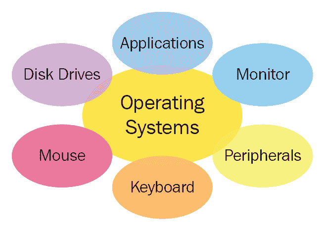

以下是市场上最常见的操作系统：

+   Linux

+   Windows

+   Red Hat

+   FreeBSD

+   Solaris

+   macOS

现在让我们来讨论为什么我们需要检测操作系统。您可以在以下有趣的网站上查看计算机上安装的操作系统：[`whatsmyos.com/`](http://whatsmyos.com/)。作为系统管理员，您会希望跟踪 IT 资源。同样，攻击者也希望访问您的资源清单，这将帮助他们找到资源并针对漏洞发起攻击。

# 网络操作系统清单 – 追踪您的基础设施

作为系统管理员，了解网络中运行的内容非常重要，市面上有多种工具可以用来创建清单。清单可以帮助你确定操作系统的生命周期、许可费用、预算和补丁管理。最重要的是，它能为你提供基础设施上运行的操作系统的可视性和分析。系统管理员和攻击者之间唯一的相似之处在于，他们都使用类似的方法来修复或利用系统。系统管理员需要在攻击者利用任何漏洞之前，进行扫描并修复问题。

# 确定目标主机的漏洞

漏洞扫描（通常称为基于网络的扫描）可以远程进行。直接在主机上运行扫描的方法称为主机扫描。仅仅确定应用程序版本并不总是有助于我们找到漏洞来攻破系统。检测操作系统版本同样非常重要，以便结合扫描结果。有时候，操作系统会发布更新，修补应用程序而不改变应用程序版本。通过远程扫描找到漏洞有点困难，因为结果可能会出现误报。

# 定制利用攻击

缓冲区溢出是最著名、最强大且最常用的攻击之一，用来利用应用程序漏洞。缓冲区溢出攻击可以让攻击者获得执行命令或定制 shell 代码的权限。一旦你获得了对目标机器的访问权限，你可以添加账户、访问命令提示符、远程控制图形界面，并修改系统配置。

当我说*缓冲区内存*时，我指的是用于暂时存储数据、在数据传递到目标应用程序之前的**随机存取存储器**（**RAM**）。系统中的每个应用程序都有一个固定大小的数据缓冲区（内存来自公共池）。攻击者使用技术将数据填充到缓冲区，直到缓冲区没有空间可用——这就是所谓的**缓冲区溢出**。在你尝试执行此类脚本以利用漏洞之前，了解或检测实际操作系统非常重要。首先使用操作系统检测，否则你可能会把 Linux shellcode 发送到 FreeBSD 服务器。

# 使用 Nmap 进行操作系统检测技术

在我们讨论远程操作系统检测之前，让我们先了解一下 Nmap 是什么，以及它能做什么。我还会向你展示 Nmap 工具的一些不同标志和选项。

# Nmap 工具

**网络映射器**（**Nmap**）是一个免费开源工具，供系统和网络管理员使用，允许他们执行诸如收集企业网络清单、管理服务升级计划、基本安全审计以及监控主机或服务的正常运行时间等任务。Nmap 在主要计算机操作系统平台上都有官方版本，如 Linux、Windows 和 macOS X。

Nmap 可执行文件可以从 [`nmap.org/download.html`](https://nmap.org/download.html) 下载。安装成功后，你可以通过输入 `nmap -V` 命令来检查版本：

+   **Windows**：Windows 上的输出显示当前安装的程序是 `Nmap version 7.60`：

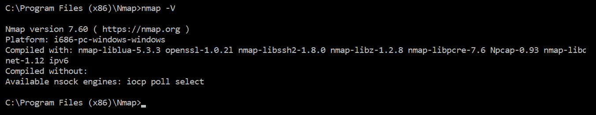

+   **Linux**：Linux 上的输出显示当前安装的程序是 `Nmap version 6.40`：

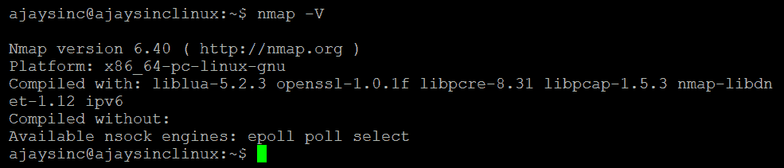

Nmap 可以通过 Linux/Unix shell 或 Windows 命令提示符界面在具有 root 或管理员权限的情况下运行。

Nmap 的基本语法如下：

```
# nmap [scan type] [options] [target]
```

只需输入目标 IP 地址而不使用其他选项，就可以执行非常简单的扫描。目标字段可以是 IPv4 地址 `address:1.1.1.1`，IPv6 地址 `address :2001:db8:0:0:0:5678:d334:8af`，主机名 `www.xyz.com`，IP 地址范围 `192.168.0.1` - `192.168.0.10`，以及 **无类域间路由** (**CIDR**) 块 `10.10.10.0/24`：

+   **示例 1**：扫描主机名为 `myapptestsec.azurewebsites.net` 的主机。默认情况下，它将扫描一千个端口。共计九百九十八个端口被过滤，两个端口开放，如截图所示。

请只提及网站的主机名：

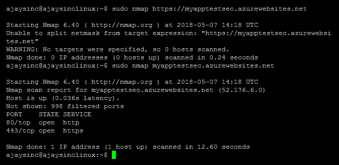

请参考帮助选项以获取更多信息：

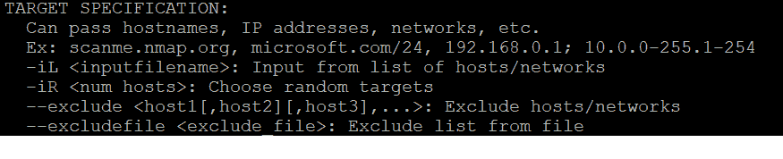

+   **示例 2**：扫描具有指定端口号的主机。如我们所见，默认情况下只扫描一千个端口，但 Nmap 让你可以通过输入 `-p` 标志并选择端口范围 `-p <Port 1>-<Port 2>`，端口列表 `-p <Port 1>,<Port 2>` 等，来定义端口选项：

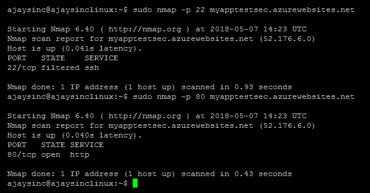

请参考帮助选项以获取更多信息：

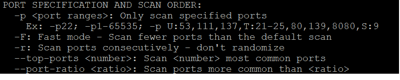

+   **示例 3**：使用不同的扫描类型扫描主机。你可以指定多个标志来执行不同类型的扫描，包括 SYN 扫描 `-sS`、没有端口扫描的主机发现 `-sN`、版本扫描 `-sV`、TCP 连接扫描 `-sT` 和操作系统检测 `-O`：

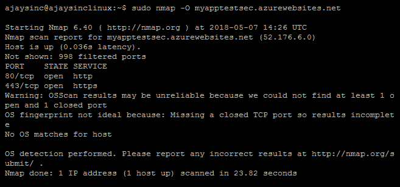

请参考帮助选项以获取更多信息：

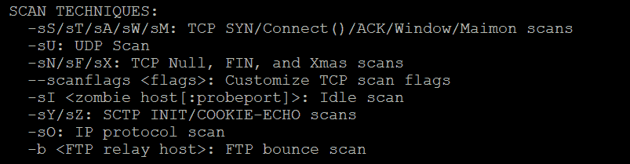

# 操作系统检测

操作系统检测提供了关于目标主机上当前安装和运行的操作系统的宝贵信息。我们来讨论一下发现的逻辑，以及 Nmap 是如何猜测操作系统的。

Nmap 解码标准探针的属性和响应模式，并将其发送到远程主机以确定操作系统。这个过程被称为 TCP/IP 指纹识别。在以下输出中，您可以看到在目标主机 IP `23.100.21.174` 上运行的多个服务。接下来是我的 Linux 主机。为了测试目的，我安装了 Apache2 Web 服务器。在以下屏幕截图中，我们可以看到启动浏览器时显示的默认页面：

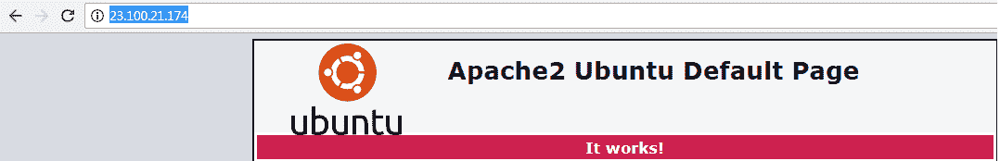

Nmap 的最佳猜测（激进的操作系统猜测）是，系统有 86% 的概率运行在 Linux 3.5 或 Linux 2.6.32 系统上，且这一猜测是准确的。如果您发现此信息不正确，可以将输出上传至 Nmap 门户。这将帮助 Nmap 开发者改进下一个版本：

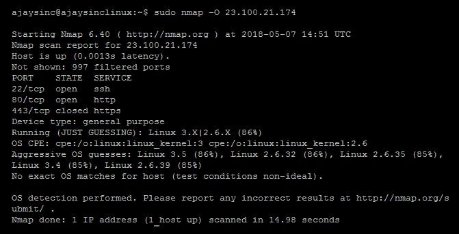

使用 Nmap，让我们尝试进一步挖掘服务版本。这次扫描花费的时间稍长，完成时间为 26.4 秒，而常规扫描完成的时间为 14.98 秒。输出显示了此主机上运行的不同服务的版本，以及它们的软件版本：

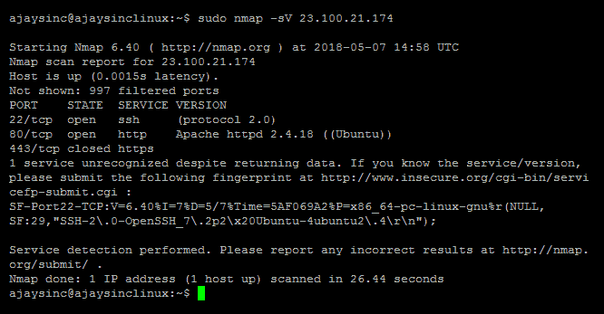

TCP/IP 指纹识别需要收集有关目标 IP 栈的详细信息。这里是 Nmap 当前数据库签名的链接 [`svn.nmap.org/nmap/nmap-os-db`](https://svn.nmap.org/nmap/nmap-os-db)。

在当前的 Nmap 数据库（6.47）中，有 4485 个指纹，涵盖了 5009 个 CPE（平台）名称，其中超过 800 个与不同版本的 MS-Windows 匹配，超过 1000 个与各种 Linux 系统（包括设备）匹配。

# Nmap 支持的 TCP/IP 指纹识别方法

过去，曾使用横幅抓取方法来检测远程操作系统。通过 Telnet 连接，发送到目标系统，系统会显示主机上运行的操作系统的横幅。这种方法不太准确，因为系统管理员也可以禁用横幅或更改实际的横幅，以误导攻击者。

新的远程操作系统检测方法是分析源和目标之间的数据包。此检测技术不仅可以检测操作系统平台，还可以检测操作系统版本。

# TCP/UDP/IP 基础

用一个类比来说，如果 IP 是建筑物地址，服务端口就是楼层号码。TCP 和 UDP 都使用进出端口进行数据通信。大多数基于 IP 的服务使用标准端口（HTTP `TCP:80`，SMTP `TCP:25`，DNS `TCP-UDP:53`）。

TCP 栈有六种标志消息类型，用于完成三次握手：

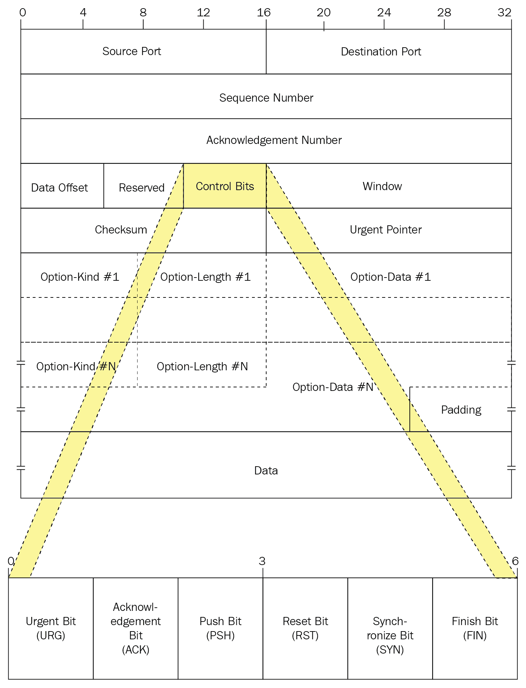

这是我在网页浏览器上打开的一个网站的数据包捕获。这显示了一个三次握手过程，包含 SYN-SYN-ACK。默认情况下，Wireshark 会跟踪所有 TCP 会话，并将所有的序列号（SEQ 号）和确认号（ACK 号）转换为相对数字。这意味着，Wireshark 不会在显示中显示真实/绝对的 SEQ 和 ACK 号码，而是显示相对于会话中首次出现的段的 SEQ 和 ACK 号：

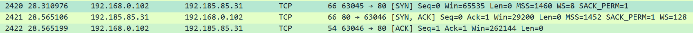

如果你有兴趣了解 TCP 序列号的确切实数值，那么你需要通过勾选与序列号相关的未勾选框来调整 Wireshark 的设置：

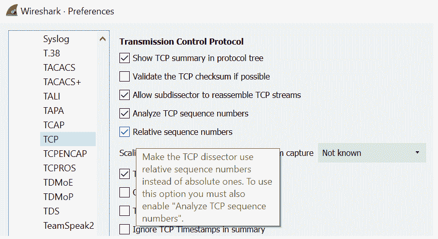

在 Wireshark 中，我已扩展第一个连接以显示 SYN 标志设置为`1`。同样，你也可以扩展其余连接：

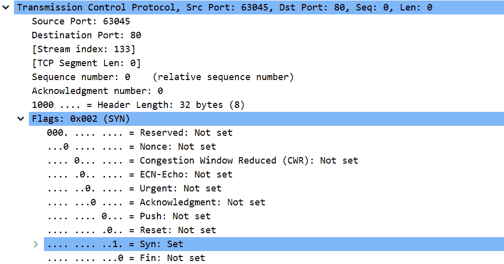

+   **SYN 和 SYN-ACK**：任何 TCP 通信都将以一个 SYN（同步）包开始，通过将标志位设置为`1`。服务器会响应一个 SYN-ACK，这意味着服务端口正在监听并处于开放状态。

+   **ACK**：在接收到服务器的 SYN-ACK 后，客户端会发送最终的 ACK 以通过设置 ACK 标志为`1`来完成三次握手。

+   **RST**：复位标志表示服务器不接受在服务端口上建立的连接，或者它拒绝请求。

+   **FIN**：当任一方希望完成连接时，完成标志会被设置为`1`，这可以通过关闭浏览器来实现。

以下技术用于确定系统上的操作系统。

# FIN 探测

FIN 包用于关闭客户端和服务器之间的 TCP 连接。关闭连接比建立连接要复杂，因为双方都必须释放各自的资源。在下图中，你可以看到 FIN 包与最后的 ACK 一起工作：

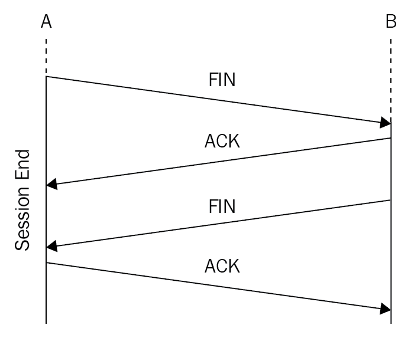

像 Nmap 这样的工具可以生成一个没有设置 ACK 为`1`的 FIN 包。操作系统可能会对此做出 RST 响应，这能为你提供关于远程操作系统的线索。

在设计 TCP/IP 实现时，厂商对 RFC 793《传输控制协议》有不同的解释。当一个 TCP 段到达并且 FIN 标志被设置，但 ACK 标志没有被设置时，一些实现会发送 RST 段，而其他一些实现则会丢弃该包而不发送 RST。

让我们通过数据包捕获来测试一个实际环境。我在我的无线路由器上测试了 FIN，下面是我在 Wireshark 中跟踪 TCP 流时的结果：

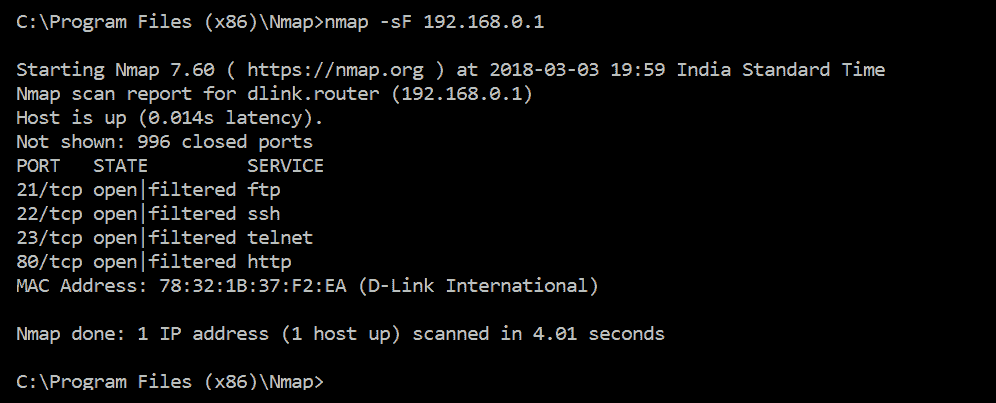

让我们在 Wireshark 中测试端口`80`的结果，我知道这个端口在此设备上是开放的。你可以看到，只发送了 FIN 包，并且路由器没有响应：

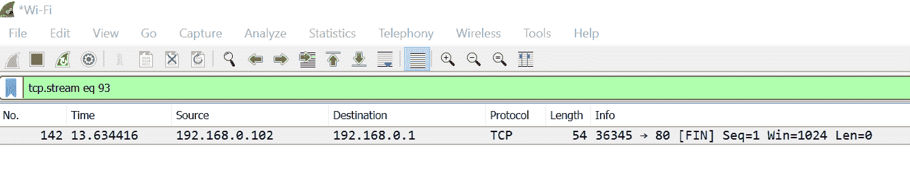

发送到端口`443`的 FIN 会收到一个 RST，因为该路由器上的此端口未打开：

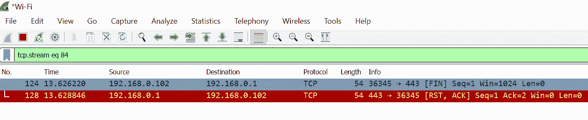FIN 扫描只在 Linux 机器上有效，且在最新版本的 Windows 上无效。CISCO、HP/UX、MVS 和 IRIX 会返回一个 RST 包。

# TCP ISN 采样

在 TCP 栈序列和确认中，字段为 32 位[4 字节]。有*2³²= 4,294,967,296*种生成随机数的可能性：

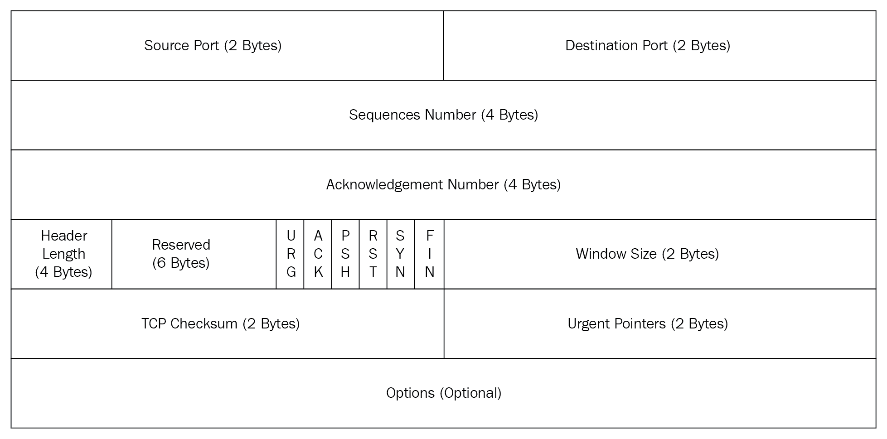

在客户端和服务器之间，当客户端发起连接时，它会生成一个**初始序列号**（**ISN**）。每个操作系统都有自己生成 ISN 的算法，而这个过程是可以预测的。

Windows NT 4.0 生成可预测的随机 TCP ISN，这使得远程攻击者能够进行欺骗和会话劫持。

随机 ISN 值很好，因为它们使得预测序列号变得更加困难。从 Windows 2003 开始，ISN 算法已经被修改，使得 ISN 在系统启动时通过使用基于 RC4 的随机数生成器和一个 2048 位的随机密钥以随机增量方式增加。

RFC 6528 规定，初始序列号生成算法 TCP 应使用以下表达式来生成 ISN：

*ISN = M + F(localip, localport, remoteip, remoteport, secretkey)*

这里，*M*是四微秒计时器，*F()*是连接 ID 的**伪随机函数**（**PRF**）。总的来说，ISN 值完全基于不同操作系统所使用的 TCP/IP 栈实现和算法，但总有一个共同的模式可以帮助预测操作系统。

# TCP 初始窗口

这是检查返回数据包上的窗口大小，这个值对于不同操作系统似乎相当恒定。

# 服务类型

该字段通常对所有操作系统设置为零。Linux 将 ToS 字段的优先位设置为 0xC0。ICMP 错误消息总是使用默认的 ToS 值 0x0000 发送。ICMP 回显应答消息应与 ICMP 请求消息具有相同的 ToS 值。

# 生存时间（TTL）

基于主机之间的网络流量，可以预测系统上运行的操作系统。每个操作系统都有自己独特的方式来实现 TCP/IP 栈。一种非常简单但有效的被动方法是检查 IP 头部中的初始**生存时间**（**TTL**）：

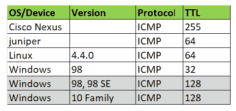

我在一台 Windows 10 机器上，尝试了对主机`4.2.2.2`的 ICMP ping。在下面附带的 Wireshark 抓包中，你可以看到 Windows 10 的初始 TTL 值为`128`：

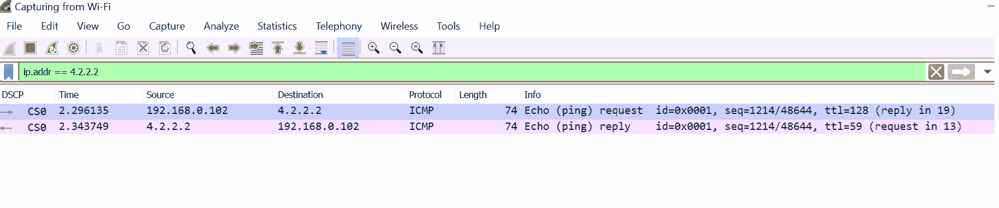

我从 Wireshark 中展开了第一个数据包，确认 TTL 为`128`：

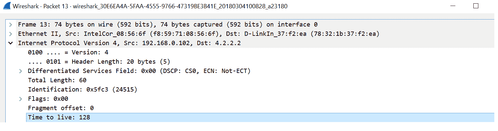

让我们尝试展开返回的数据包，让我们看到 TTL 值为`59`：

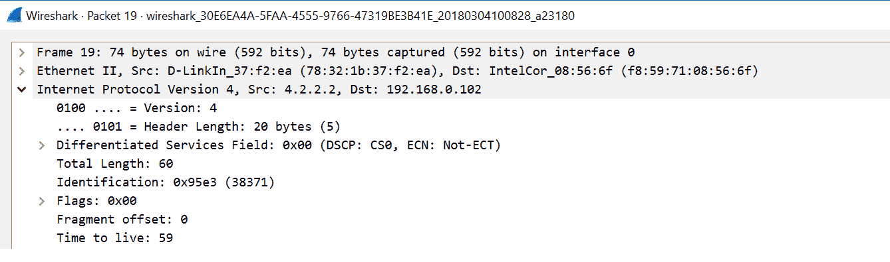

现在，您可以通过 Nmap 远程操作系统检测获取匹配结果。系统运行 Linux 操作系统的概率为 90%。这应与我们的参考表匹配。Linux 的 TTL 值为 64，值为 59 表示该主机距离我有五跳。

# 不分片（DF）位

一些操作系统会设置此位，而其他操作系统则不会。

还有许多其他工具和扫描技术可以用来检测远程操作系统。请阅读 [`nmap.org/book/osdetect-methods.html`](https://nmap.org/book/osdetect-methods.html) 以获取更多信息。

# 理解 Nmap 指纹

操作系统指纹识别是一种用于确定远程主机上运行的操作系统类型和版本的技术。`nmap-os-db` 数据文件包含成千上万的签名。然而，不同的远程操作系统会对 Nmap 的专用操作系统检测探针做出响应。一个指纹包含操作系统的名称、其一般分类以及响应数据模式。

一个典型的指纹格式如下图所示。在检测探针过程中，属性和结果会与 Nmap 的 `os-db` 操作系统数据库进行比较。可以使用简单的命令进行操作系统检测，使用的标志是 `-O`：

```
#sudo nmap --O <ip or ip subnet> 
```

以下截图特定于 Cisco 2820 设备，显示在 Nmap 确认该设备为 Cisco 2820 之前将执行多个测试。此 Nmap 数据库将为大多数已知设备提供类似的指纹，而且它不断增长：

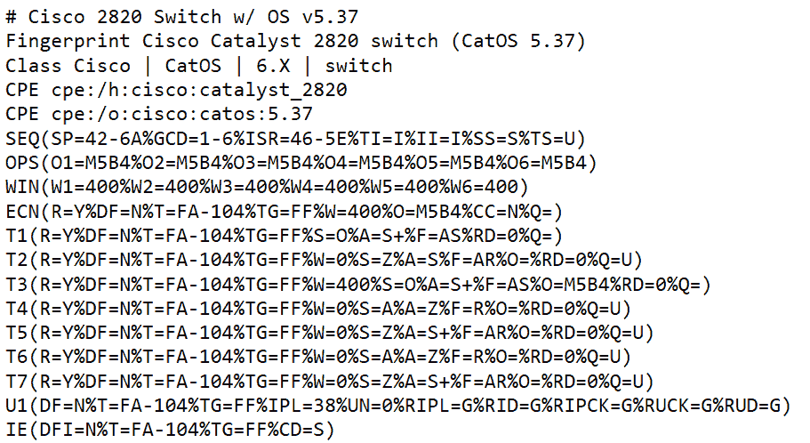

我们可以在上面的快照中看到以下术语：

+   **SEQ 测试**：SEQ 测试返回有关序列分析的信息

+   **OPS 测试**：OPS 测试返回每个 [01-06] 探针接收到的 TCP 选项信息

+   **WIN 测试**：WIN 测试返回每个 [W1 -W6] 探针的 TCP 初始窗口大小信息

+   **ECN 测试**：ECN 测试返回显式拥塞通知响应

+   **T1 至 T7 测试**：这些是 TCP 探针：

    +   T1 是带有多个 TCP 选项用于打开端口的 SYN 包

    +   T2 是带有打开端口选项的 NULL 包

    +   T3 是带有打开端口选项的 SYN/FIN/URG/PSH 包

    +   T4 是带有打开端口选项的 ACK 包

    +   T5 是带有关闭端口选项的 SYN 包

    +   T6 是带有关闭端口选项的 ACK 包

    +   T7 是带有关闭端口选项的 FIN/PSH/URG 包

+   **PU 测试**：PU 测试是一个用于关闭端口的 UDP 包

# 操作系统匹配算法

Nmap 的匹配检测算法是一个简单的过程，它收集目标指纹并将其与 `nmap-os-db` 中的每个参考指纹进行测试。在对所有探针进行指纹测试后，Nmap 会将 NumMatchPoints 除以可能的点数。这个结果是一个置信因子，描述了目标指纹与特定参考指纹匹配的概率。

# 防御端口扫描

到目前为止，我们已经学习了如何使用端口扫描技术来发现和检测远程主机的信息。让我们尝试理解，任何服务/主机都会受到端口扫描的影响，这些主机通过某种方式与用户连接。可能包括企业 WAN 或互联网。端口扫描也不被归类为非法活动，除非信息被用来利用系统漏洞。

应该暴露给外界的信息量取决于系统管理员。任何 IP 扫描都以 ICMP 开始，你可以在企业边缘设备上阻止所有传入的 ICMP。这将使 Ping 无效，并且会过滤 ICMP 不可达消息，从而阻止 Traceroute，作为第一道防线。但这能解决所有问题吗？不能，端口扫描同样适用于 TCP/UDP 端口。

限制信息的另一种方式是禁用系统中所有不必要的服务。当然，你不能封锁所有服务。例如，如果你在主机上运行 HTTPS 服务，那么只有端口 `443` [HTTPS] 应该暴露到互联网。另一个简单的方法是通过源 IP 地址来限制服务。来自其他 IP 地址的扫描将无法发现这些服务。

一个巧妙的最终解决方案是配置防火墙/IPS/IDS 上的策略进行威胁签名检测。就像其他应用程序一样，Nmap 本身也有自己的签名。

# 总结

在本章中，我们讨论了 TCP/IP 的基础知识，以及如何利用其不同的属性进行端口扫描技术和远程操作系统检测。我们还讨论了如何在不同操作系统上使用 Nmap 工具，以及如何使用 Wireshark 进行数据包捕获分析。优秀的黑客知道如何破解系统，而伟大的网络管理员知道如何防范这些攻击。

“最好的防守是进攻”

在下一章中，我们将讨论 SSL 的基础知识，为什么它对于基于 Web 的应用程序至关重要，以及在保护应用程序之前需要考虑哪些安全事项。

# 问题

1.  端口扫描是以下内容的一部分：

    1.  Traceroute

    1.  Nmap

    1.  路由

    1.  Ipconfig/all

1.  TCP 连接的模式是什么？

    1.  SYN-ACK

    1.  SYN-ACK-FIN

    1.  SYN-RST-ACK

    1.  SYN-SYN-ACK

1.  系统黑客中最重要的活动是什么？

    1.  信息收集

    1.  破解密码的暴力攻击

    1.  DDoS 攻击

    1.  漏洞利用

# 进一步阅读

+   [`nmap.org`](https://nmap.org)
