# 第九章：公钥基础设施-SSL

在上一章中，我们了解了用于检测远程操作系统的网络映射工具和端口扫描技术。

在今天的数字时代，越来越多的互联网用户正在开展网络业务。小型到大型企业推出了更多的营销工具，例如广告、网页服务、电子邮件、社交媒体、数字内容、网上银行、手机应用程序，当然还有在线购物。然而，直到信息安全得到保障，没有人愿意在互联网上存储或传输信息。

**安全套接字层**（**SSL**）为基于网页的应用程序提供传输层安全性，并为最终用户或客户提供安全的浏览体验。在本章中，我们将讨论什么是 SSL，它如何工作以及谁需要它。我们还将讨论 SSL 的发展，重点介绍你需要知道的内容，以便实施它。这将包括了解当前的威胁和验证方法。

我们将涵盖以下主题：

+   SSL 的基础

+   TLS 与 SSL

+   **公钥基础设施**（**PKI**）

+   针对 PKI 的攻击

+   微软 Windows 和 IIS

+   OpenSSL

+   SSL 管理工具

# SSL 的基础

在本节中，我们将从最终用户的角度学习 SSL 的基础知识，重点是用户在安全浏览时应该了解的 SSL 内容。在你的网站上拥有 SSL 证书标志对安全性至关重要。为了保护数据免受攻击者的侵害，SSL 技术用于在最终用户（通常是一个网页浏览器）和网页服务器之间创建加密连接。SSL 允许像信用卡号、社会安全号码和登录凭证等敏感信息以加密格式安全地传输。即使攻击者能够拦截客户端和网页服务器之间发送的所有数据，他们仍然无法读取和使用加密数据中的信息。

要了解 SSL 在 TCP/IP 或 OSI 模型中的位置，让我们看看下图。对于像 HTTPs 这样的安全应用程序，SSL/TLS 位于应用程序和第四层传输层之间：

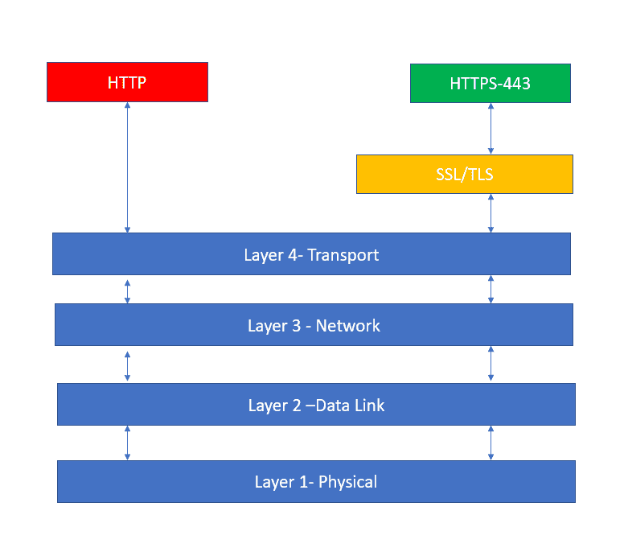

# 我怎么知道 SSL 是否正常工作？

在交换任何信息之前，用户必须知道他们所访问的网站区域是否安全和受保护。不同的浏览器展示 SSL 状态的方式各不相同，但通常可以通过检查浏览器顶部的地址栏来查看 SSL 状态。让我们看一下几个浏览器：

**微软 Edge：**

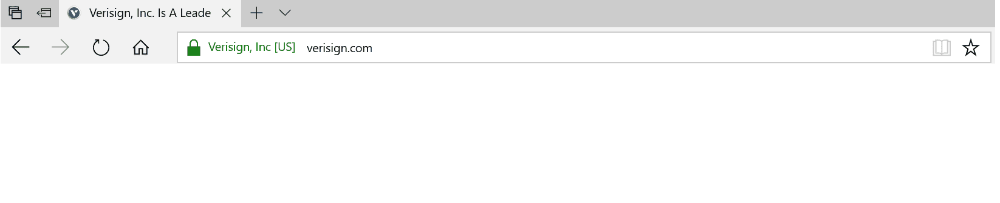

**微软 IE：**

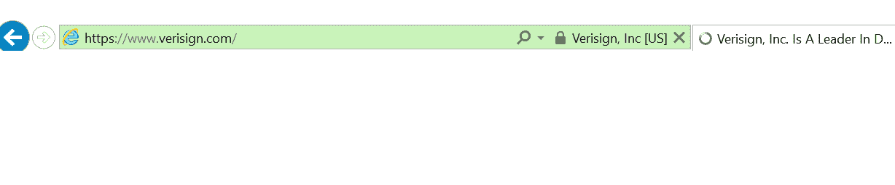

**谷歌 Chrome：**

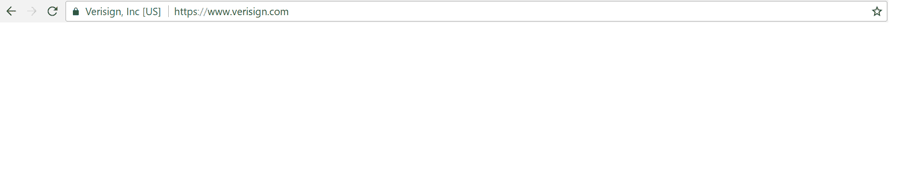

我们可以清楚地观察到，所有浏览器的共同点是它们都有绿色的突出显示色、锁头符号，并且信息显示在状态栏中，告诉你这是一个安全站点。

# 为什么没有锁头？

现在的浏览器足够智能。让我们来看一下我在访问银行网站时收到的警告错误信息。在这种情况下，你不应该分享你的信息：

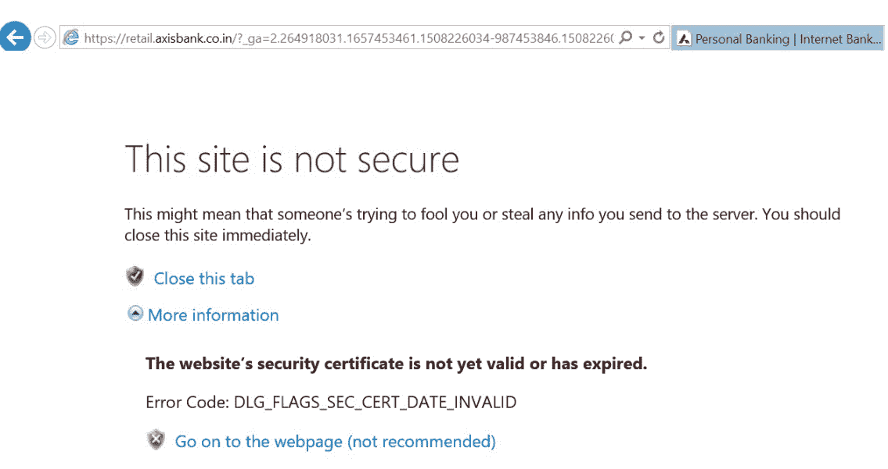

在这里，你可以清楚地看到状态栏没有绿色和锁形图标，浏览器还会显示该网站不安全的原因。

# SSL 证书

SSL 证书是一个数字公共文档，将加密密钥与所有者或组织的详细信息绑定，如通过域名、主机名或位置。这验证了访问的网页确实属于合法公司所有。

SSL 证书有三个特定功能：

+   身份认证

+   验证

+   数据加密

换句话说，SSL 证书将包含关于证书颁发者以及证书颁发对象的信息。这不仅限于网页服务器，它还可以用于终端用户机器、手机及更多应用程序。每个 SSL 证书都会附有一个到期日期，就像考试证书在到期后不能再使用一样。因此，要延长证书的有效期，必须进行续期。SSL 证书还将包含公钥和数字签名。如其名称所示，公钥被纳入 SSL 证书中，并与网页浏览器共享；而数字证书是一种过程，保证消息的内容在传输过程中没有被篡改。

# SSL 和 TLS 的演变

**传输层安全性**（**TLS**）协议是目前互联网上最广泛使用的协议。SSL 最初由 Netscape 在 1993 年开发。让我们来看看 SSL 协议的历史：

+   **SSL 1.0**：这是 Netscape 在 1994 年初发布的第一个规范，但从未公开发布。这是因为它在加密社区中遭到了广泛的批评，原因是其采用了弱加密算法。

+   **SSL 2.0**：1995 年初，Netscape 发布了 SSL 2.0，这是原版的改进版本。然而，这个版本同样没有成功。在这个版本中，消息认证使用了 MD5，大多数注重安全的用户已经不再使用该算法。握手消息没有受到保护，这使得 MITM（中间人）攻击能够欺骗客户端选择比正常情况下更弱的密码套件。

+   **SSL 3.0**：SSL 版本 3 由 Netscape 于 1996 年发布，用以增强 SSL 版本 2 并支持更多的算法。当时，许多 SSL 版本 2 平台已被部署，因此没有简单的方式可以切换到 SSL 版本 3。这迫使 SSL 版本 3 允许与 SSL 版本 2 的向后兼容性。因此，除非你明确知道服务器支持哪些 SSL 版本，否则你的 SSL 应用程序应该在 SSL 版本 2 和 SSL 版本 3 模式下运行。这使得客户端可以与 SSL 版本 2 和 SSL 版本 3 的服务器进行通信，也允许服务器与 SSL 版本 2 和 SSL 版本 3 的客户端建立连接。然而，如果客户端或服务器仅支持 SSL 版本 2，则仅会使用该版本。

SSL 3.0 易受 POODLE 攻击的影响，标志着 SSL 3.0 时代的结束。此漏洞由 Google 安全团队发现，并于 2014 年 10 月 14 日公开披露。

+   **TLS 1.0**：TLS 协议本身基于 Netscape 于 1999 年 1 月发布的 SSL 3.0 规范。这个协议与 SSL 3.0 之间的差异并不显著，但足够重要，TLS 1.0 和 SSL 3.0 无法互操作。

+   **TLS 1.1、TLS 1.2 和 TLS 1.3**：RFC 4346 于 2006 年 4 月发布，TLS 1.1 是 TLS 1.0 的更新版本。所做的更改包括用显式的 **初始化向量**（**IV**）替代隐式的 IV，以防止 **密码块链式连接**（**CBC**）攻击。2008 年 8 月，TLS 1.2 基于 TLS 1.1。

截至 2018 年 1 月，TLS 1.3 是最新的协议，尽管它仍是一个工作草案。让我们通过浏览器（Internet Explorer）查看当前支持的 SSL 和 TLS 版本。

# 当前支持的标准

对于 Microsoft Internet Explorer，按照以下步骤操作：工具|Internet 选项|高级。在以下截图中，我们可以看到 TLS 1.0 到 TLS 1.2 的选项已被勾选，而 SSL 3.0 被禁用或未勾选：

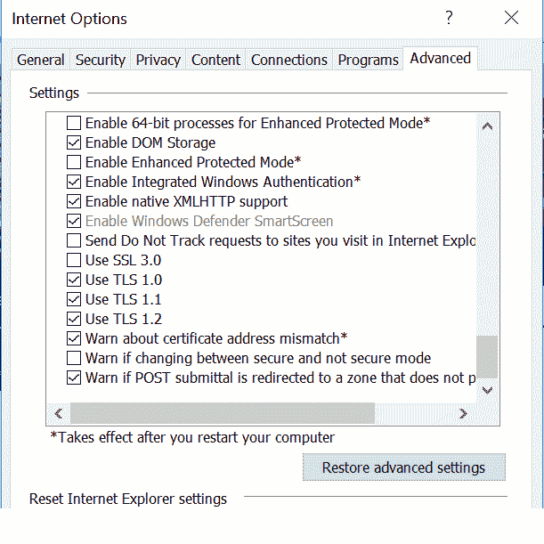

# 为什么 TLS 1.3 还没有实施？

这种安全升级本质上很复杂。在多厂商的互联网环境中，你需要更新客户端和服务器以支持新的安全标准。到目前为止，没有主流浏览器默认启用 TLS 1.3。不能假设在某个特定日期，所有服务器和终端设备都会支持所有新的安全标准。此外，TLS 1.3 并不是一个扩展，而是一个完全重构的重大变化。TLS 或 SSL 版本协商的工作方式是，终端用户设备将最新支持的协议版本发送给服务器，服务器回应以其支持的最新版本，并选择双方都支持的版本。

# 是时候告别 SSL 和早期的 TLS 了。

根据 **PCI 数据安全标准** (**PCI DSS**) 保护支付数据，2018 年 6 月 30 日是禁用 SSL/早期 TLS 并实施更安全的 TLS 1.1 或更高版本加密协议的最后期限。SSL 和早期 TLS 存在许多漏洞，如果不加以解决，将使组织面临被攻击的风险。广泛存在的 POODLE 和 BEAST 漏洞就是攻击者利用 SSL 和早期 TLS 弱点入侵组织的两个例子。

访问以下网站获取更多信息：

[`blog.pcisecuritystandards.org/are-you-ready-for-30-june-2018-sayin-goodbye-to-ssl-early-tls`](https://blog.pcisecuritystandards.org/are-you-ready-for-30-june-2018-sayin-goodbye-to-ssl-early-tls)

# SSL 证书组件

我们先讨论客户端 SSL，然后再关注服务器端。您的浏览器预装了受信任的 CA。每次访问网站时，浏览器都会验证信任链，并在握手过程中以本地受信根证书之一结束。

# 根证书

让我们看一下微软 IE 预装的 CA。您可以通过工具|Internet 选项|内容|证书|受信根证书颁发机构来检查此内容：

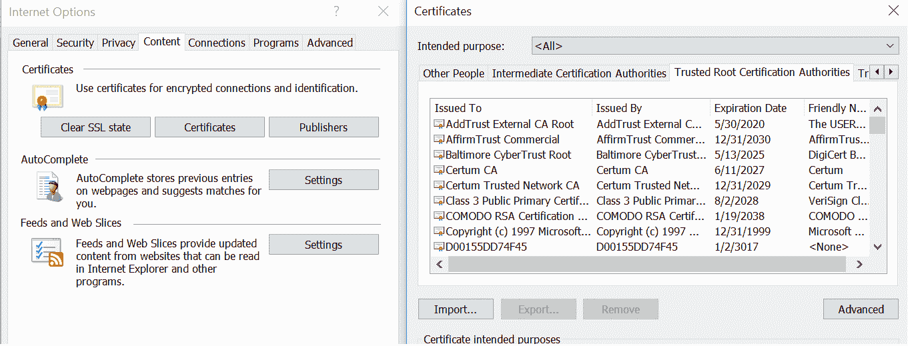

根证书确实有到期日期，但它们通常有非常长的有效期（通常在 10 至 20 年之间）。作为浏览器或操作系统更新补丁的一部分，您将在旧证书过期之前获得新的根证书。如果没有 CA 的根证书，浏览器就无法知道是否接受该 CA 签发的 SSL 证书。这些 SSL 证书被称为 *单根* 证书。

# 中间证书

从安全角度来看，根证书的私钥至关重要，应保存在证书提供商的安全数据中心。此外，根证书的公钥会交给像微软和谷歌这样的浏览器，以便将其加入到它们的受信根列表中。如果根证书的密钥被泄露，证书提供商构建的整个证书链将被视为不可信。

中间证书颁发机构是被授权签发证书的实体。从逻辑上讲，根 CA 必须签署所有证书。出于安全原因，中间 CA 代表根 CA 签署证书，但中间证书仍然是由根 CA 签署的。

让我们浏览几个网站，查看一个中间证书。在这个例子中，我已经在 IE 中打开了 [www.google.com](http://www.google.com)。我提到过，GeoTrust Global CA [Root] 反映了根签名权限，Google Internet Authority G2 [Intermediate] 反映了中间证书，最后，*.google.com [End Host] 是终端主机身份：

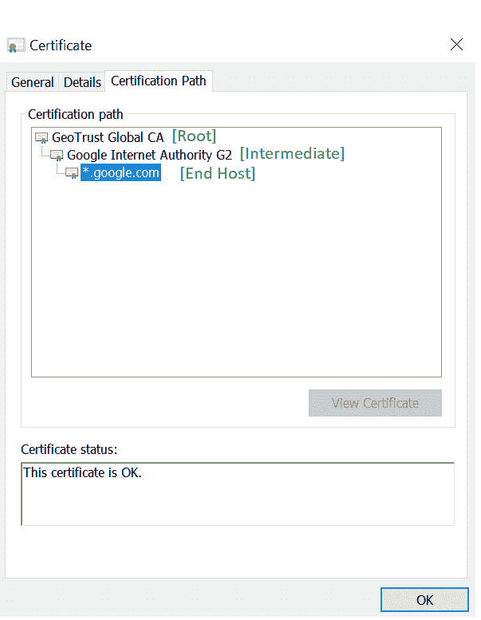

我们再来看一个例子。这一次是[www.flipkart.com](http://www.flipkart.com)。这里有两个中间证书，并且按照逻辑，可能会有多个，因为它们是主证书的一个子集。困惑的地方在于当你试图将不同类别和与证书相关的群体进行关联时：

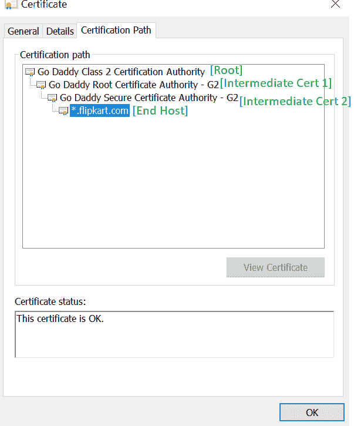

这些类别由供应商定义，但在所有顶级证书颁发机构中基本一致。我们来看看证书颁发机构（CA）向客户提供的不同类别的证书以及这些类别对客户意味着什么。

# SSL 证书类别

CA 使用类的概念来定义不同类型的数字证书，但这些类别并未在任何 SSL/TLS RFC 中明确说明。我们来尝试理解不同类别对 SSL 终端用户的意义。

+   **1 类**：1 类证书在没有任何验证的情况下交付。这也称为**域验证**（**DV**）证书，依赖于`WHOIS`信息数据库（你必须证明你拥有该域）。DV 证书是低认证产品，不保证网站所有者的身份，也不保证组织的实际存在。它仅表示两个实体通过加密通道进行通信，而彼此互不认识。

注意：攻击者可以通过发起钓鱼网站来严重滥用这一点。用户会假设网站拥有由主要证书颁发机构颁发的有效证书。永远不要对基于网页的应用程序使用低验证的证书。

+   **2 类**：对于 2 类证书（中等安全级别），需要进行背景调查，包括查看拥有该域名的组织、企业或个人，并确认其存在。这些通常被称为组织验证证书。

+   **3 类**：这些是客户端证书（扩展验证高安全性），在审核后交付。它们会检查组织的详细信息，包括通过多个可信来源验证物理地址和证书所有者。

+   **4 类**：4 类证书用于公司之间的在线商务交易。

+   **5 类**：5 类证书是为私营组织或政府安全而设计的。

# TLS 与 SSL

TLS 和 SSL 都是为基于 Web 的应用程序提供数据加密和身份验证的安全框架，以确保数据保护。SSL 和 TLS 握手是一个 Web 应用程序的机制，它发生在客户端和服务器之间的 TCP 握手之后。握手本身并不加密任何内容，而是实际协商一个共享的密钥和加密类型，双方达成一致。

在下图中，我们可以看到，在 TCP 和 SSL 握手开始后，安全客户端向服务器发送了一个带有支持加密算法的“hello”消息。服务器响应一个支持的最高加密算法，并分享其证书及公钥：

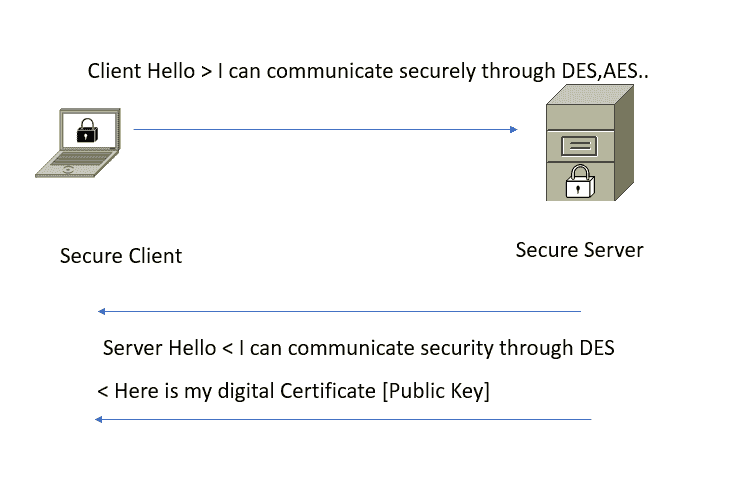

让我们看一下 Wireshark 来验证。客户端将所有可用的加密套件发送给服务器，标记在黑框中：

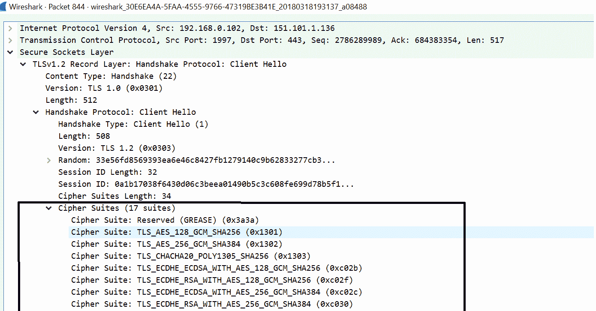

在服务器的 hello 消息中，服务器会发送它能用于安全的最高加密算法，显示在黑框中：

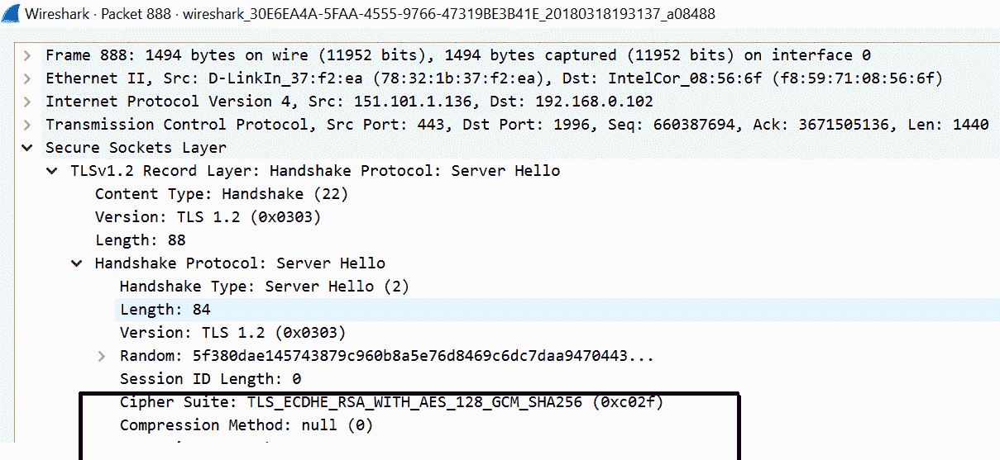

# 公钥基础设施

公钥基础设施（PKI）是指提供两个节点在不安全的基础设施上进行安全数据交换的过程和技术。它通过使用私钥和公钥对来实现基础的安全服务。

有三种类型的加密算法：

+   对称

+   非对称

+   哈希函数。

# 对称加密

在对称加密中，使用一个密钥同时进行加密和解密。对称加密速度快，简单且易于实现。然而，一些简单的加密算法容易受到暴力破解攻击，使得管理变得复杂。如果密钥被泄露，整个系统都会变得脆弱。**数据加密标准**（**DES**）和**高级加密标准**（**AES**）是对称加密系统，但 AES 比 DES 更加可靠。

对称加密方案有五个要素：

+   **明文**：指需要加密的原始数据。

+   **加密算法**：指的是用于加密数据的密码组合。

+   **安全密钥**：指的是加密算法中的输入。

+   **密文**：指的是输出和格式，它取决于明文和密钥输入。

+   **解密算法**：该算法与加密相反 - 密文变为输入数据，输出变为原始明文：

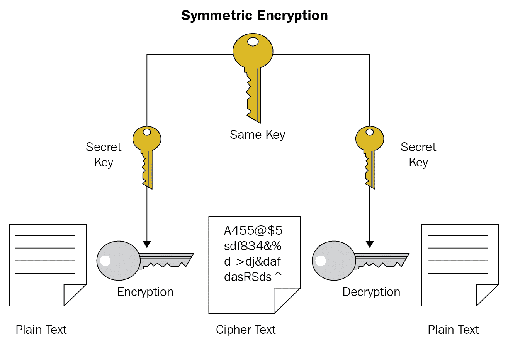

# 非对称加密

非对称加密也称为公钥加密，相较于对称加密，这是一种相对安全的方法。在这种方法中，使用两个密钥，一个用于加密，另一个用于解密。公钥顾名思义是公开的。它会在 SSL 握手过程中提供给浏览器。当访问 Web 服务器时，公钥会被使用。另一方面，私钥必须保持机密，并且对其拥有者保密。假设客户端生成了一个密钥，使用服务器的 RSA 公钥加密后发送给服务器，服务器再用其私钥解密。保护私钥非常重要，因为如果密钥丢失，系统将无法使用：

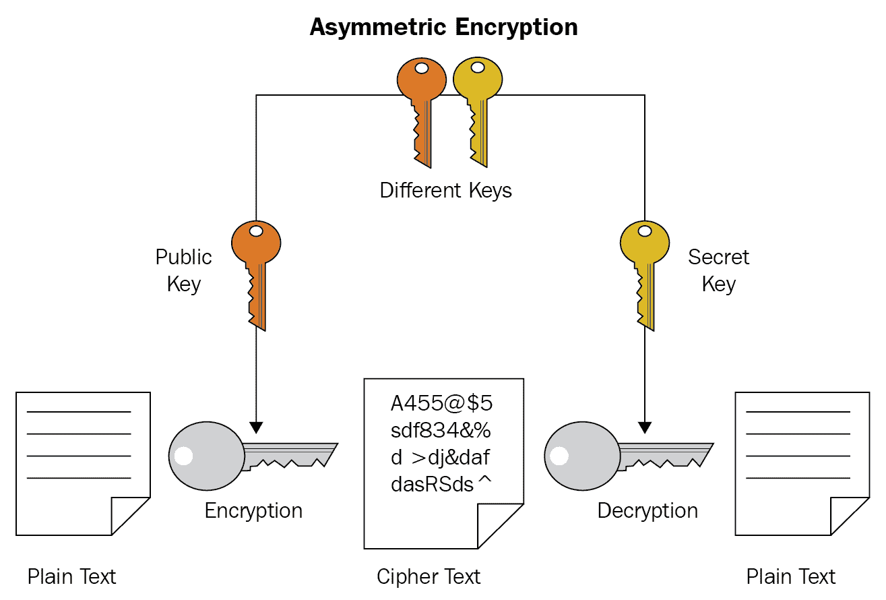

两种最流行的非对称加密算法是：

+   **Rivest-Shamir-Adleman (RSA)**：这是最广泛使用的非对称加密算法。让我们查看 SSL 证书来验证正在使用的算法。在证书详情下，你可以看到公钥值是 RSA (2048)，这表示使用 RSA 加密：

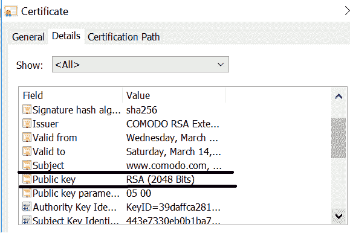

+   **椭圆曲线密码学 (ECC)**：在第二个示例中，你可以通过查看证书详情看到公钥值是 ECC。ECC 正在业界逐渐获得关注，作为 RSA 的替代方案：

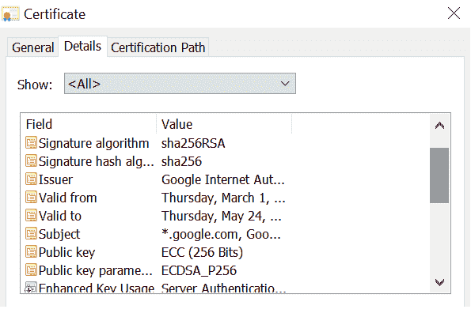

# 哈希函数

哈希是从文件内部信息生成的数字，可能是一个明文文件。生成的字符串长度固定，并且在输入发生微小变化时，输出结果会有很大不同。哈希与加密不同，它不使用加密和解密数据的过程。然而，哈希是一个单向函数，它将明文数据混淆成一个独特的消息摘要。通过合理设计的算法，哈希过程是单向的，因此无法反转哈希过程以揭示原始密码：

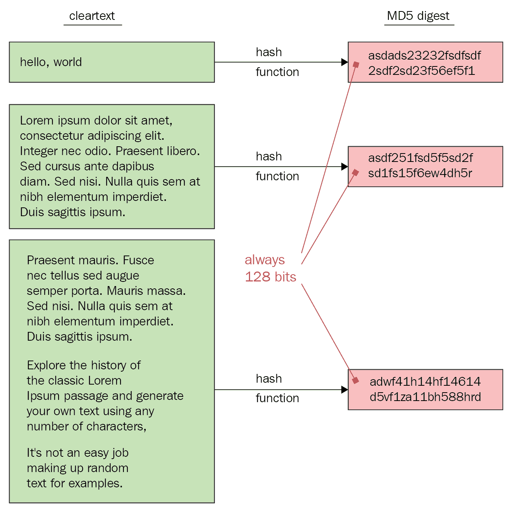

让我们理解其工作原理。

用户在浏览器中输入密码和用户 ID，并通过安全通道将其发送到认证服务器。服务器使用用户 ID 查找相关的消息摘要。用户提交的密码将使用相同的算法进行哈希处理，如果生成的消息摘要与服务器上存储的相匹配，则密码验证成功。

一些流行的哈希算法包括：

+   **MD 家族**：MD2、MD4 和 MD5（1989 -1992）。这些都是 128 位的哈希函数。MD5 是最著名的哈希算法。MD6 也曾进入业界，但从未获得广泛使用，最终被 SHA3 取代。

+   **SHA 家族**：SHA 有四个版本，包括 SHA0（最脆弱）、SHA1（最流行）、SHA2（广泛部署）和 SHA3，后者在 2012 年推出。

+   **AES 家族**：AES 有三个块密码，包括 AES-128、AES-192 和 AES-256。每个密码算法使用 128、192 和 256 位的加密密钥，以 128 位块对数据进行加密和解密。

# 针对 PKI 的攻击

如果你问任何安全专家 PKI 是否 100% 安全，答案将是一个大大的 *不*——安全专家时不时会提出一些问题和担忧。我将从 CA 证书和私钥的管理开始讨论。互联网充斥着数十亿的网站和服务，因此存在多个证书颁发机构。推出新标准需要多年时间，因为这会影响整个安全生态系统。

作为一个系统，PKI 不过是数学而已。一旦有人破解了这个公式，行业将推出一个新的公式，看起来更强大、更安全。但这能维持多久呢？另一个主要问题是私钥的安全。通常情况下，你作为客户端会在自己的机器上生成私钥对，然后将 CSR 发送给 CA，作为证书请求的一部分。在某些情况下，允许 CA 生成密钥对并发送给你也是个不错的选择。如果私钥丢失，CA 可以为你提供私钥。

让我们看一下最近发生的一起事件。在这起事件中，成千上万的客户收到了来自安全公司 DigiCert 的邮件，告知他们的 SSL 证书由于 Trustico 的安全漏洞而被吊销。如果证书当前处于有效状态，这将意味着客户开始收到不受信任的证书警告。根据官方声明，23,000 个私钥已被泄露。此事件主要影响了使用 Trustico 网站生成私钥/公钥和 CSR 的客户。

你永远不应当信任任何人你的私钥。私钥应该仅在你希望安装证书的服务器上生成并妥善保管。

你还可以访问[`www.ssllabs.com/ssl-pulse.`](https://www.ssllabs.com/ssl-pulse) SSL Pulse 是一个持续更新的全球仪表盘，用于监控 150,000 个启用了 SSL 和 TLS 的网站的 SSL/TLS 支持质量，数据来源于 Alexa 世界上最受欢迎的网站列表。

# 微软 Windows 和 IIS

在本节中，我们将讨论使用 Microsoft IIS 安装 SSL 证书：

1.  启动 IIS 管理器并双击服务器证书。

1.  选择操作菜单（右侧），点击创建证书请求：

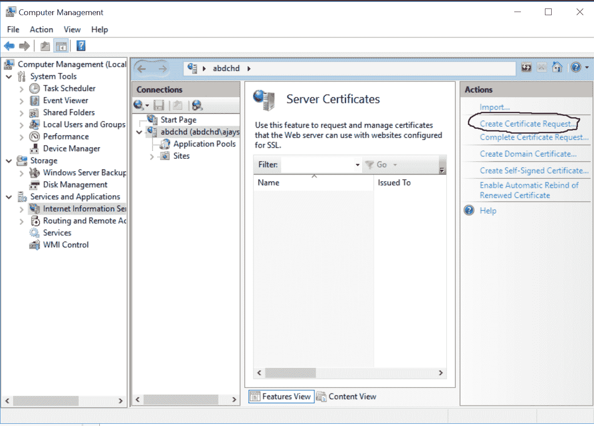

这将打开请求证书向导：

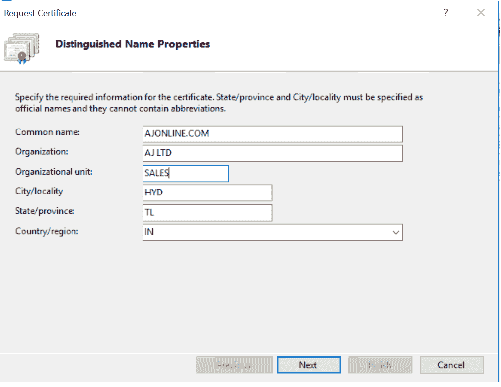

在加密服务提供者属性窗口中，保持两个设置为默认值（Microsoft RSA SChannel 和 2048），然后点击下一步：

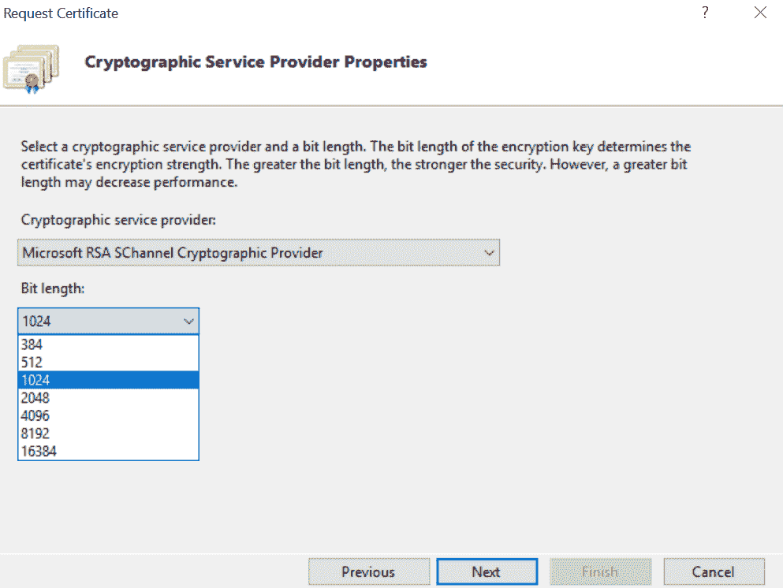

输入一个文件名和保存 CSR 的位置：

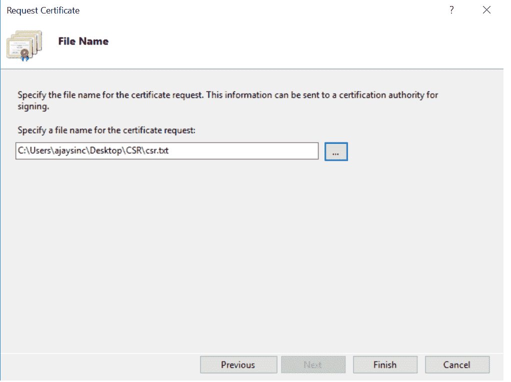

你现在可以打开文本文件来检查 CSR 请求。此文件应提交给 CA 以接收签名：

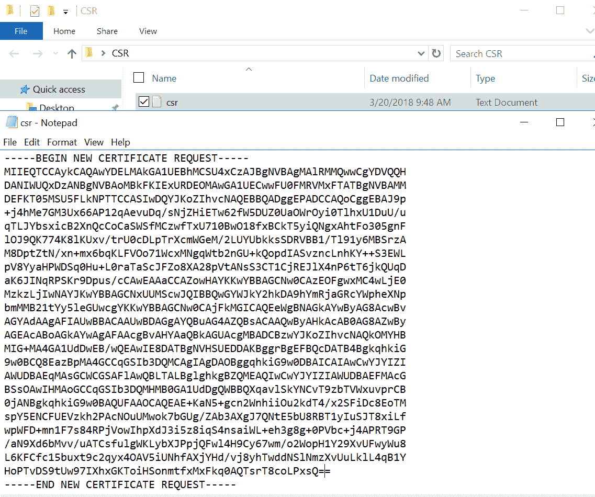

# OpenSSL

OpenSSL 是一个开源项目，包含一个加密库和一个 SSL 工具包。

根据该项目官网的描述，OpenSSL 项目是：

“一个合作努力，旨在开发一个强大、商业级的，

功能齐全且开源的工具包，实施 **安全套接层**（**SSL**）和 **传输层安全性**（**TLS**）协议，以及一个全功能的通用加密库。该项目由一个全球性的志愿者社区管理，社区成员通过互联网沟通、计划并开发 OpenSSL 工具包及其相关文档。

OpenSSL 库可以用来创建证书请求（CSR）、自签名证书，甚至作为 CA 签发证书。如果你在运行一个小型或企业组织，并且能够将根信任证书导入所有计算机系统，你就可以成为自己的 CA，并自行签发证书。

例如，我将使用我的 Ubuntu 服务器。这是一个较旧的版本，但当然你可以选择升级它：

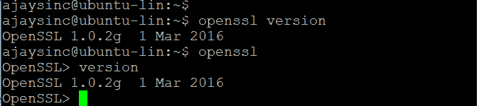

最新版本可以从 OpenSSL 官方网站下载：[`www.openssl.org/source/`](https://www.openssl.org/source/)：

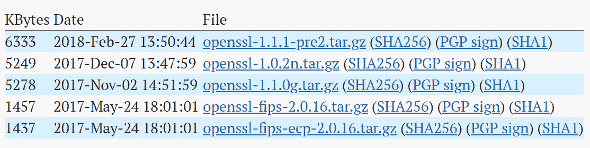

在 Ubuntu 服务器上，你可以在 `/usr/lib/ssl` 路径下找到文件：

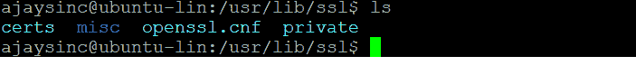

让我们看看如何生成私钥和 CSR：

1.  首先，我们将生成私钥。这将是一个 RSA 2048 密钥。不过，你也可以选择 DSA 或 EC 密钥。要求提供电子邮件地址、可选的公司名称和挑战密码的字段可以留空：

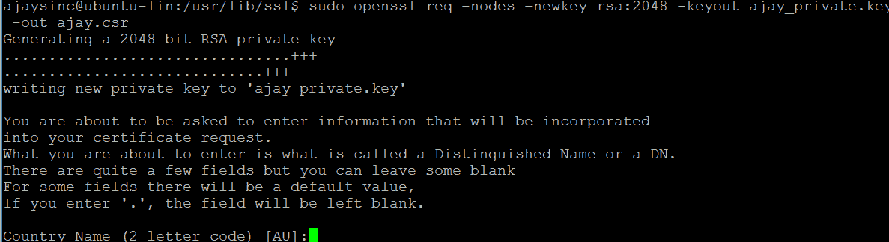

1.  在第二步中，你将被要求提供证书所需的信息，如组织、州、组织名称、FQDN 和电子邮件地址：

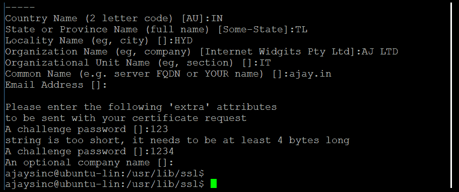

现在，私钥和 CSR 可以在同一文件夹中找到：

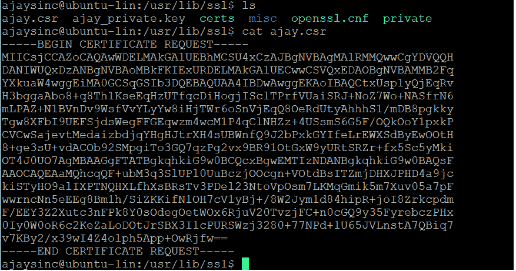

这只是一个概述。欲了解更多信息，可以访问 [`www.openssl.org/`](https://www.openssl.org/) 或官方网站。

# SSL 管理工具

根据我个人的经验，管理证书时最常见的问题是证书到期。对于小型组织来说，手动跟踪是可能的，但这会是一项繁重的工作。最好有一个自动化框架来监控所有服务资产的证书到期/续期。

一些非常著名的 SSL 管理工具包括：

+   **SolarWinds SSL 证书管理**

+   **Qualys CertView**

# 总结

本章作为了解 PKI 世界的导论。章节从用户的角度出发，介绍了 SSL 的基本原理，并讨论了 SSL 如何用于基于 Web 的应用程序。我们还介绍了可以用来生成强证书的功能和算法。此外，我们还看到了如何为 Windows IIS 生成证书，并了解了如何使用 OpenSSL 工具。本章还让你了解了 PKI 面临的威胁，以及如何采取防护措施来提升用户体验。

在下一章中，我们将讨论防火墙作为一种安全设备，并探讨它在网络基础设施中的作用。

# 问题

1.  SSL 的全称是：

    1.  串行会话层

    1.  安全套接字层

    1.  会话安全层

    1.  系列套接字层

1.  运输层提供安全性的是哪个？

    1.  SSL

    1.  TLS

    1.  （1）或（2）

    1.  （1）和（2）两者都

1.  SSL 支持的应用程序的标准 TCP 端口是什么？

    1.  `420`

    1.  `1032`

    1.  `443`

    1.  `322`

1.  如何识别一个安全网站？选择所有正确的答案。

    1.  `http`

    1.  `https`

    1.  开放的挂锁

    1.  锁定的挂锁

# 深入阅读

欲了解更多信息，请参考以下链接：

+   [`tools.ietf.org/html/rfc6101`](https://tools.ietf.org/html/rfc6101)

+   [`tools.ietf.org/html/rfc5246`](https://tools.ietf.org/html/rfc5246)

+   [`www.ssllabs.com/`](https://www.ssllabs.com/)

+   [`blog.pcisecuritystandards.org/are-you-ready-for-30-june-2018-sayin-goodbye-to-ssl-early-tls`](https://blog.pcisecuritystandards.org/are-you-ready-for-30-june-2018-sayin-goodbye-to-ssl-early-tls)

+   [`www.openssl.org/`](https://www.openssl.org/)
