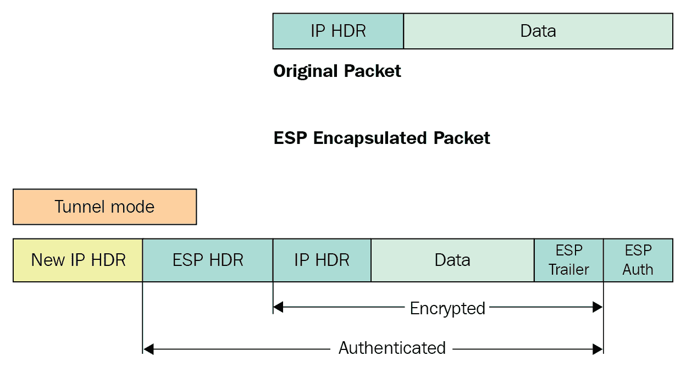

# 第十一章：VPN 与 WAN 加密

在上一章中，我们通过研究防火墙和防火墙网络设计以及其部署方式来讨论了数据保护和安全技术。在本章中，我们将重点关注在通过公共互联网基础设施或服务提供商共享的网络基础设施传输数据之前保护数据。

在本章中，我们将讨论以下主题：

+   概述

+   VPN 的分类

+   VPN 协议类型

+   VPN 设计

+   IKE V1 与 IKE V2

+   WAN 加密技术

# 概述

数据是新的货币或石油。它可以在你的购物模式、电子邮件、网上银行、订餐等许多地方找到。每年，我们都遇到像网络威胁、非法监视（维基解密）和反隐私倡导等问题，攻击这些领域。在像互联网这样的互联世界中，保护数据时，安全性和隐私至关重要。作为终端用户，我们无法全面了解我们每天使用的公共互联网基础设施。幸运的是，我们有**虚拟私人网络**（**VPN**），这是一种在两个或多个支持 VPN 的设备之间形成安全隧道的屏障。VPN 有助于保护数据流量免受窥探或中间人攻击。然而，为了选择最好的 VPN 服务，我们首先需要了解不同类型的 VPN 及其使用场景。

VPN 有很多使用场景。一个非常常见的理由是，VPN 可以用于移动用户或分支机构与总部之间的安全通信，因为它提供了对企业 IT 资源的安全访问：

你的本地 ISP 作为互联网访问的网关，你的活动可以通过它被追踪。就像你尝试访问任何资源时，资源提供方也可以根据你的 IP 地址追踪你的所在位置。这将是另一种使用案例，在这种情况下你通过使用第三方 VPN 来隐藏自己的身份。在下面的示意图中，你可以看到一个坐在马尼拉的用户可以连接到一个全球资源，而这个资源可能会被马尼拉的本地 ISP 封锁：

这些 VPN 可以以应用程序格式提供，或内置于浏览器中。一些组织还提供完整的隧道功能。在这种情况下，一旦你连接到企业 VPN，你通向互联网的出口点将是你所在组织的互联网网关。

# VPN 的分类

VPN 信任用户通过公共基础设施网络安全地连接到私有资源，而这些公共基础设施网络是我们不信任的。VPN 创建一个加密连接（称为安全 VPN 隧道），所有数据流量都通过这个安全隧道传输。

让我们考虑几种不同的 VPN，并思考它们的适用场景。我们将重点讨论两大类 VPN，我将其称为远程访问 VPN 和基于网络的站点到站点 VPN：

+   **远程访问 VPN**：这是一个完美的解决方案，适用于需要连接到企业网络以远程访问 IT 资源的用户。例如，远程工作者、移动用户和外联网用户。用户与公司网络之间的连接通过互联网进行。VPN 可能要求用户安装 VPN 客户端防火墙供应商的特定软件，或者可能要求使用基于网页的客户端。VPN 客户端软件与 VPN 服务器形成一个安全隧道，并在将信息通过互联网发送到 VPN 服务器之前对其进行封装和加密。IPSec 或隧道协议可以用来在网络的端点之间建立隧道。VPN 技术提供了 IPSec 和 SSL，这是部署远程 VPN 的两种最著名和广泛应用的方法。

远程访问 VPN 用户必须拥有 AAA 配置文件，以控制访问和授权。

+   **站点到站点 VPN**：站点到站点 VPN（通常称为点对点 VPN）主要用于企业领域，为不同地理位置的分支机构和合作伙伴的办公室提供 IT 资源访问。当同一组织的远程办公室通过站点到站点 VPN 连接时，它被称为基于内联网的 VPN。如果目的是为合作伙伴的域提供连接，则被称为外联网 VPN。

# VPN 协议类型

VPN 类型通过各种隧道协议区分，如 PPTP 和 L2TP 与 IPSec。每种 VPN 协议提供不同的功能和安全级别。

# 点对点隧道协议

PPTP 仍然是一个流行的网络协议——特别是在 Windows 计算机上——它是最古老的仍在使用的协议之一。该协议由微软开发，用于封装另一种名为点对点的协议。PPTP 使用底层认证协议，如 MS-CHAP（**挑战握手认证协议**（**CHAP**））——v1/v2，但这些协议存在严重的安全漏洞。PPTP VPN 使用 128 位加密来加密数据，这使其成为最快的，但在安全性方面是最弱的。

# 层 2 隧道协议

L2TP 是通过将**层 2 转发协议**（**L2F**）的特性（由思科设计）与 PPTP 的特性（由微软设计）结合开发的。由于 L2TP 本身不提供保密性和加密功能，因此需要与另一个协议——IPSec 一起使用，以确保连接的安全性。对于终端主机客户端，不需要安装软件，因为几乎所有操作系统都提供内置的 VPN 客户端。256 位加密是 L2TP VPN 的强制性附加项。由于双重封装，L2TP 是一个 CPU 处理器密集型的协议。第一次封装发生在 L2TP VPN 工作时，然后再加上第二次 IPSec 封装。

让我们来看看 Windows 10 内置的 VPN 选项：您可以选择使用带有预共享密钥和证书的 L2TP：

# 安全套接字隧道协议

基于 VPN，**安全套接字隧道协议**（**SSTP**）最适合用于需要高度保密的在线活动，如银行交易、电子商务交易或商务通信。SSTP VPN 是微软的 SSL VPN，运行在`443`端口上，这个端口可能不会被任何 ISP 阻塞。SSTP 带有集成的**网络访问保护**（**NAP**）支持，用于客户端健康检查，包括防病毒和防火墙。与其他 VPN 协议不同，SSTP 从客户端到服务器建立一个单一的 HTTPS 通道，还支持强身份验证，例如智能卡、RSA SecureID 等。

从 Windows 10 开始，NAP 平台不可用。

# 互联网协议安全

**互联网协议安全**（**IPsec**）是一种广泛部署的开放标准，支持多厂商的框架设计，基于密码学实现 IPv4 和 IPv6 的安全性与数据保护。IPsec 支持对称和非对称加密以保护通信。非对称加密总是需要更多的 CPU 处理能力和更高的性能。这是因为实施过程中，使用非对称加密共享一个共享密钥，然后进行对称加密。

IPSec 的主要组成部分如下：

+   **认证头部**（**AH**）

+   **封装安全负载**（**ESP**）

+   **互联网密钥交换协议**（**IKE**）

AH 仅提供消息认证。换句话说，AH 只允许接收方验证消息是否完整且未被篡改；它并不加密数据。下图展示了 AH 封装前后数据包的格式：

基本的区别是 ESP 提供了实际的加密。它加密数据包的有效载荷，防止被窃听和重放。下图展示了数据包

：目前没有 IPsec 部署使用 AH。

IPsec 通信有两个阶段：

在第一阶段（用蓝色标记），IKE 建立了一个安全通道。在第二阶段（用绿色标记），加密数据被传输。

IKE 有两个版本：IKE V1 和 IKE V2。我们将在后续章节讨论 V2 的优势。更多细节请参考[`tools.ietf.org/html/rfc6311`](https://tools.ietf.org/html/rfc6311)：

# SSL VPN

对于远程访问漫游用户，SSL VPN 是最佳解决方案。SSL 协议在公共互联网中提供机密性和真实性。SSL 使用 TCP `443`端口，这是一个不会被任何 ISP 阻塞的端口。用户需要在浏览器中输入 SSL VPN 的 FQDN，例如，[`vpn.corp.com`](https://vpn.corp.com)。认证成功后，用户可以与公司 IT 资源进行通信。SSL VPN 不需要在用户端安装和配置客户端软件。

让我们尝试了解 SSL VPN 的安全性。 拥有 VPN 并不意味着一切都很好，数据传输是安全的。 SSL VPN 依赖于 SSL PKI 加密。 使用不安全或过时的弱加密简单地意味着将企业数据置于风险之中。 请参考第九章了解最新的 SSL/TLS 标准。

请记住，SSL 安全通道始终在主机和网关之间建立，而不是到达终端资源。

# MPLS VPN

MPLS VPN 是实现企业网络多站点全球连接的最佳用例。企业连接到同一家 MPLS 服务提供商的两个或更多站点，形成 VPN。 MPLS L3VPN 是在**多协议标签交换**（**MPLS**）网络上最常部署的应用程序。 MPLS 允许服务提供商在服务提供商边缘上虚拟化其网络资源，因此客户可以共享物理网络但仍保持逻辑隔离。 企业客户使用诸如 MPLS 基础设施之类的服务提供商连接到多个全球站点。 或者，大型企业可能在其自己的全球基础设施内部使用 MPLS。 **提供者边缘**（**PE**）路由器将客户的电路终止到对每个客户唯一的**虚拟路由转发**（**VRF**）实例中，然后将其转发到提供者核心路由器，使用 MPLS 对流量进行标记并识别流量所属的 VRF：

MPLS 默认不提供加密。

对于远程访问 VPN，除非没有其他选择并且正在进行不需要安全性或安全性的基本活动（如流媒体 Netflix），否则永远不要选择 PPTP。 当必须使用时，请使用 L2TP/IPsec，并牢记 SSTP 是 Windows 设备需要更强安全性的良好选择。 IKEv2 是最新和最好的选择，因为在 Wi-Fi 网络或蜂窝连接之间切换时不会中断安全 VPN 连接。 我们将在下一节讨论 IKEv2 功能。

# VPN 设计

让我们讨论站点到站点防火墙终止点的设计考虑。

+   **单独的 VPN 防火墙**：您可能已经看到了企业网络的多种情景。 仅有一个防火墙会使网络缺乏灵活性和单一的 VPN 终止点。 但是，从安全角度来看，大多数网络至少有一个双防火墙层。 第一个防火墙用于阻止所有不需要的数据流量并控制 DMZ 流量，而第二个防火墙可用于终止 VPN 连接，以及具有 URL 过滤和防病毒等下一代防火墙功能：

+   **远程访问 VPN 隧道——分隔还是不分隔？**：每当一个组织评估为其远程工作者和合作伙伴设置 VPN 的选项时，一个安全考虑是是否支持分隔隧道模型。让我们探讨一下这种模式的利弊。完整隧道意味着当所有流量都通过 VPN 时建立了一个安全连接。分隔隧道意味着只有公司流量通过隧道。对于其余流量，将使用本地互联网连接。

以下图表显示了一个分隔隧道：红色流量通过本地互联网网关。

以下图表显示了一个完整的隧道：所有流量都通过 VPN。

正如我们所见，分隧道可能通过本地互联网网关实现更快的互联网连接，但直接连接会绕过所有公司的控制和安全策略，如 URL 过滤和恶意软件保护。在完整隧道中，所有流量都通过公司网关传输，提供了很好的安全性。然而，额外的网络跳转可能导致网络访问缓慢。完整隧道还可以帮助您在互联网上隐藏身份。

如果您的企业有足够的带宽来容纳所有远程用户，那么网络和安全管理员必须使用完整隧道。一个拥有大量远程员工的组织可能会消耗大量带宽。

大多数网络管理员遵循的常见做法是选择预共享密钥进行身份验证，这在连接终止点的两端是相同的。这样做是为了避免设置**证书颁发机构**（**CA**）并为每个 IPSec 端点发放单独的密钥。因此，如果一个端点被破坏或被盗，整个网络就会变得脆弱。随着 IT 员工的变动，预共享密钥的保密性随着时间的推移而失去意义。基于 SSL/TLS 证书的 VPN 运行良好，但这也带来了设备配置方面的开销。然而，如果您仍然决定使用预共享密钥，那么您应该制定一个在一定时间后更改它们的流程，并且您应该在不同的 VPN 连接上使用不同的预共享密钥。对于经过批准和强大的加密，您必须查看由国家标准与技术研究所发布的**联邦信息处理标准**（**FIPS**）。

# IKE V1 与 IKE V2

在本节中，我们将介绍 IKE 是什么，以及 IKEv1 和 IKEv2 之间的区别。

IKE 是 IPsec 协议套件中的一个协议，负责建立一个安全关联（双方之间的协议），使两个启用 IPsec 的设备能够安全地发送数据：

+   IKEv2 更快速且对带宽要求较轻，因为建立隧道时需要的消息较少。对于 IKEv1，我们有主模式（9 条消息）和攻击模式（6 条消息）。相比之下，IKEv2 只有一种模式，且只需要 4 条消息。

+   IKEv2 提供了内置的 NAT 穿越功能，而默认情况下，IKEv1 并不提供这一功能。大家普遍知道，IPSec 协议在设计时并没有考虑到**网络地址与端口转换**（**NAPT**）。在使用 IPSec ESP 模式时，初始有效载荷，尤其是头部会被加密。中间的 NAT 设备无法更改这些加密头部为其自身的地址。在第一阶段协商期间，如果启用了 NAT 穿越检测，那么双方或其中一方会向对方表明自己正在使用 NAT 穿越，随后 IKE 协商会切换到使用 UDP 端口**4500**。

+   IKEv2 内置了隧道存活状态检查。如果隧道断开，它具备检测和重新建立隧道的功能。然而，IKEv1 并没有这种功能。虽然有一些针对 IKEv1 的解决方法，但这些方法并没有标准化。

+   IKEv1 支持通过预共享密钥、数字签名和公钥加密进行身份验证。IKEv2 支持预共享密钥、数字签名和**可扩展身份验证协议**（**EAP**）。在 IKEv1 中，IPSec 对等体必须使用相同类型的身份验证——例如，双方都使用预共享密钥或双方都使用数字签名。然而，IKEv2 支持非对称身份验证——一方可以使用预共享密钥进行身份验证，而另一方则使用数字签名。

+   IKEv2 移动性和多宿主协议 RFC 4555（MOBIKE）支持远程访问 VPN 用户在不重新建立所有安全关联的情况下，从一个 IP 地址迁移到另一个 IP 地址。通过无须进行加密计算且无需重新连接 VPN 网关的方式，IKEv2 提升了用户体验。而 IKEv1 并不支持这一机制。

# 广域网加密技术

在今天的互联网和广域网连接环境中，为了确保数据安全并减少间谍窃听的风险，加密关键信息至关重要。数据泄露也包括光纤窃听。随着视频流量、在线游戏行业和云服务的不断发展，广域网带宽持续增加，我们已经看到网络速度从 1GB 提升到 10GB，再到 40GB，现如今甚至达到 100GB。随着链路速度的不断提高以及对带宽需求的持续增加，传统的第三层加密将不足以满足需求。

实现加密的三种最常见方法如下：

1.  IPsec，或第三层（L3）加密

1.  MACsec 或第二层（L2）加密

1.  **光网络**（**OTN**）或第一层（L1）加密

# IPsec 第三层加密

我们在前一节已经讨论了 IPsec。这里，我们将讨论 IPsec 如何与 WAN 技术互补。三层加密非常适合带宽较低且没有设备支持二层或一层加密的环境。组织正在以不同的方式运行 WAN 技术，例如使用 ATM、Frame-Relay、Metro-Ethernet 和基于 MPLS 的解决方案。最终的安全问题是：*你信任谁来处理你业务关键数据？* 如果您的回答是服务提供商，那么您可能不需要加密您的数据。然而，如果您的回答是没有人可信，那么您必须将数据传输到一个加密的服务提供商那里。

让我们来看一下广泛部署在 WAN 技术中的 MPLS VPN 提供商。这种服务提供商的主要好处是更快的传输技术，同时在客户之间进行适当的隔离。术语中包括 VPN，但这并不意味着您的数据默认情况下会被加密。

如下图所示，两个客户可以使用相同的子网，并通过适当的隔离连接到同一台路由器提供的服务：

为了确保 MPLS 上的数据传输安全，您可以采用从 CE 到 CE 的 IPsec 方法来保护 VPN 客户端的流量，避免通过不受信任的基础设施进行传输。引入 IPsec 可防止虚假的 CE 被插入到 VPN 中，以及防止加密的 VPN 流量泄漏到不受信任的 VPN 中。这增加了大规模部署的复杂性和可扩展性问题。

**动态多点 VPN**（**DMVPN**）模型基于**下一跳解析协议**（**NHRP**）的原理。每个 IPsec 节点都保存着如何到达下一跳服务器的信息，该服务器返回目标 IPsec 节点的地址给源节点。这是一种非常可扩展的方式，可以根据需要动态建立 IPsec 隧道。这几乎是一种独立于底层 WAN 基础设施的可扩展解决方案：

在利用 IPSec 进行高速链路加密之前，必须考虑性能。路由器的吞吐能力受限于 IPSec 加密引擎的限制，而不是使用能够利用路由器最大聚合吞吐能力的加密解决方案。使用 IPsec 加密会增加 57 字节的开销，以封装原始数据包的 IP 头并增加额外的认证头和尾部。将 IPsec 与 GRE 一起使用时，会增加 76 字节的额外开销。更多的开销直接导致更低的带宽吞吐量。

# MACsec—二层加密

正如其名称所示，MACsec 是一种 MAC 层或链路层加密，为安全的下一代高带宽部署提供了简化的、每端口加密选项。遵守 FIPS、HIPAA 和 PCI DSS 的组织必须实施强大的加密以保护传输过程中的敏感数据。MACsec 提供了很好的逐跳部署灵活性。每当您觉得公共基础设施不安全时，您可以在传输节点之间实施 MACsec。

用例：您可以使用以下示例端到端使用 MACsec 加密：

+   主机到交换机

+   交换机到交换机

+   路由器到交换机

+   路由器到路由器数据中心互连

让我们看看 802.1 AE（MACsec）格式：实际 Ether-type + Payload 如下加密：

现在让我们看一个思科数据中心互连的 MACsec 示例。在 Layer-3 和任何路由协议之间引入 Layer-2 设备可以在 Layer-3 设备之间运行路由协议。DWDM WAN 链路将被加密；加密此链路的主要原因是它可能是由第三方提供的共享基础设施：

# 光网络—第 1 层加密

有多种访问光纤的方式。包括：

+   点击街道柜

+   光纤耦合器件

+   协议分析仪和拼接盒。

第 1 层加密解决方案支持金融机构的安全数据中心连接、运营商的加密托管服务以及政府机构的安全网络。由于它是在 OSI 模型中可能的最低层进行的，第 1 层加密在技术上提供了最高级别的安全性。它还具有快速速度和低延迟，以及 100%的吞吐量和 0 字节的开销：

# 摘要

本章详细介绍了 VPN，重点介绍了使用 IPSec 作为 VPN 技术。它从覆盖 VPN 的各种用例和可用选项开始。然后介绍了不同 VPN 协议的技术细节，如 PPTP、L2TP、SSTP、IPsec 以及组成 IPSec 的组件。

本章的中间部分通过查看全隧道和分隧道选项及其优势，介绍了企业远程访问 VPN 的设计原则。该章节最后查看了 WAN 加密技术，从企业到云服务和金融机构，以确保数据通信模型的不同层次上的安全性。

现在您对从网络到应用安全的所有层有了基本了解，下一章将介绍基础设施安全和未来技术的整体方法。

# 问题

1.  以下哪项可能用作站点到站点 VPN 隧道的终止点？

    1.  防火墙

    1.  路由器

    1.  集中器

    1.  以上所有内容

1.  以下哪项不是 Layer-2 隧道协议？

    1.  PPTP

    1.  IPsec

    1.  L2TP

    1.  .MPLS VPN

1.  IKE 为以下内容创建 SA：

    1.  SSL

    1.  PGP

    1.  IPSec

    1.  VP

1.  IPSec 定义了两个协议：_______ 和 ________。

    1.  AH；SSL

    1.  PGP；ESP

    1.  AH；ESP

    1.  以上所有

1.  ______ 提供 IP 层级的认证。

    1.  AH

    1.  ESP

    1.  PGP

    1.  SSL

# 深入阅读

欲了解更多信息，请访问以下链接：

+   [`tools.ietf.org/html/rfc2409`](https://tools.ietf.org/html/rfc2409)

+   [`tools.ietf.org/html/rfc5996`](https://tools.ietf.org/html/rfc5996)

+   [`tools.ietf.org/html/rfc3031`](https://tools.ietf.org/html/rfc3031)

+   [`www.sans.org/reading-room/whitepapers/vpns/`](https://www.sans.org/reading-room/whitepapers/vpns/)
