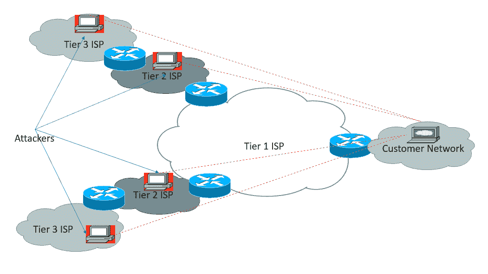

# 第十二章：安全技术的总结和范围

在上一章中，我们讨论了广域网基础设施的安全性以及技术如 IPSec 和 VPN 设计在公共互联网基础设施上建立安全网络的能力。

目前大约有 30 到 40 亿设备连接到互联网，随着物联网（IOT）设备的增加，这一数字将会翻倍。在这种情况下，黑客的攻击范围将不仅限于一个空间，而是几乎可以涵盖从医院到交通信号灯的各个领域，因为这些设备也将通过某种形式的广域网（WAN）连接进行控制和操作。这里的主要问题是：网络安全的长期影响是什么？有一点是肯定的，那就是它将与今天不同。我们还将讨论人工智能如何帮助提升网络安全领域的防护能力。

本章我们将涵盖以下主题：

+   DDoS 防护

+   BGP FlowSpec

+   人工智能在网络安全中的应用

+   下一代 SIEM

+   SDN 防火墙

+   **自带身份认证**（**BYOI**）

# DDoS 防护

**DDoS**，即**分布式拒绝服务攻击**，是一种攻击形式，其中多个被攻陷的网络/主机被用来攻击单一系统。组织需要认真考虑这样一个事实，即使它们对 DDoS 攻击有足够的防护，如果它们的**互联网服务提供商**（**ISP**）、托管服务提供商或**域名服务**（**DNS**）提供商没有足够的 DDoS 防护，它们的业务也可能被停止服务或脱机。在本节中，我们将讨论旧的 ISP 机制，同时也会重点讨论新的自动化机制。

# 远程触发黑洞路由（RTBH）

你还记得曾经网络管理员拨打互联网服务提供商电话来缓解 DDoS 攻击的日子吗？**远程触发黑洞**（**RTBH**）路由是**边界网关协议**（**BGP**）作为服务提供商网络中的安全工具的一个有趣应用。RTBH 的一种常见用途是缓解 DDoS 攻击。RTBH 提供了两种方法：

+   基于源

+   基于目标

基本方法是要么丢弃来自源的所有流量，要么丢弃所有到目标的流量。这些流量可能是既有用的也可能是无用的。此时，我们理解 RTBH 路由是一种可以用来防护 DDoS 攻击的技术。接下来，让我们讨论它是如何保护你的网络的。

下图展示了一家 ISP，拥有多个提供商边缘路由器，并且客户网络通过边缘路由器连接到公共互联网。

请记住，RTBH 路由与 BGP 一起工作。

假设一个 DDoS 攻击针对客户的应用程序发起，例如 Web 服务器。如果 ISP 没有任何保护措施来阻止攻击，并且攻击持续发生，这将导致客户的应用程序瘫痪，同时影响其他客户，造成服务质量下降。当我提到服务质量下降时，这取决于发起的 DDoS 攻击类型，可能会导致 ISP 链路拥堵。ISP 路由器在攻击期间可能无法处理大量数据包。

在这张图中，你可以看到一个客户网络连接到 Tier-1 ISP，Tier-1 ISP 进一步连接到 Tier-2 ISP。一旦攻击者发起攻击，它可以从互联网上的任何地方朝着客户网络发起。图中用红色标记的 PC 符号代表攻击者的机器或互联网上已被入侵的机器，这些机器属于**僵尸网络**。

在攻击发生时 ISP 可以做些什么？

+   从攻击源处的黑洞流量

+   从攻击目标处的黑洞流量

最大的问题是：你应该选择哪种 ISP 方法？我们将详细讨论这两种选择。

# 从攻击源处的黑洞流量

基于源的方法是 ISP 首选的方法。这将丢弃所有来自攻击者的流量到客户的 Web 服务器，同时允许其他合法流量通过。如果源 IP 地址是固定的，这可能是一个不错的解决方案，但问题出现在今天的复杂攻击中，攻击源地址不断变化。

# 从攻击目标处的黑洞流量

使用基于目标的方式将会丢弃所有流量（包括合法流量）到客户的 Web 服务器。这实际上意味着帮助攻击者实现他们的目标，使客户的服务不可用。这个方法唯一的优点是，它不会影响其他 ISP 客户，也不会导致任何服务质量下降。

# BGP FlowSpec

BGP FlowSpec 是 RFC 5575 中定义的一种新方法，可以通过利用 BGP 自动化地防止 DDoS 攻击。BGP **流量规范**（**FlowSpec**）功能允许你自动传播过滤和监管功能到服务提供商的上游 BGP 对等路由器。这将减轻 DDoS 攻击对网络的影响。大多数厂商仍然将此实现列入他们的路线图中。实施之前，请向 ISP 查询是否支持此解决方案。

BGP FlowSpec 采用更精细的方式，提供灵活性，让你能够有效地构建指令，以匹配特定数据流的源、目的地、L4 参数和数据包细节（如长度和分片）。在这个示例中，客户路由器（即 FlowSpec 路由器）将这些流量通告给 ISP 边缘路由器。然后，边缘路由器将这些流量安装到硬件中。一旦流量被安装到硬件中，传输路由器就能进行查找，看是否有传入流量与定义的流量匹配，并采取适当的措施。

在下图中，客户将`1.1.1.1/32`主机网络通过特殊社区`100:100`通告给服务提供商。一旦该社区在服务提供商端匹配，所有面向客户网络的流量将被服务提供商 1 内的所有边缘路由器丢弃。

这些是 BGP FlowSpec 的规格及可采取的操作列表。

BGP FlowSpec 可以包含以下信息：

+   类型 1–目标前缀

+   类型 2–源前缀

+   类型 3–IP 协议

+   类型 4–源或目标端口

+   类型 5–目标端口

+   类型 6–源端口

+   类型 7–ICMP 类型

+   类型 8–ICMP 代码

+   类型 9–TCP 标志

+   类型 10–数据包长度

+   类型 11–DSCP

+   类型 12–分片编码

动作通过 BGP 扩展社区来定义：

+   流量速率（丢弃/限制）

+   下一跳重定向

+   VRF 重定向

+   DHCP 标记

配置 BGP FlowSpec 之前，请检查硬件规格和支持情况。

# DDoS 清洗

组织处理 DDoS 攻击只有两个选择：**黑洞**或**清洗**。如我们之前所讨论的，黑洞技术扩展性差，可能会关闭指定目标，以保护其他用户。另一种解决方案是清洗，使用独立的 DDoS 清洗引擎。棘手的部分是 BGP 公告，它将所有目标 IP 地址的网络层数据包重定向到你的清洗服务提供商的服务器。恶意数据包被过滤掉，清洗后的流量或非 DDoS 流量则转发到实际服务。

云服务提供商或互联网服务提供商，通常会将这些清洗设备配置到本地数据中心。业内已经观察到，DDoS 攻击的规模已经达到超过 1 Tbps 的流量，拥有如此大的网络容量是一项巨大的任务。部署如此大带宽来应对 DDoS 攻击既昂贵又复杂。清洗设备是一些简单的设备，必须由专家进行配置。这意味着你必须在所有层次和所有协议上建立相应的能力。清洗中心通常在离线模式下运行，只有在 DDoS 攻击发生时才会被激活。这意味着在流量被重定向到清洗中心之前，互联网应用会首先遭遇 DDoS 攻击。

# 区块链技术用于应对 DDoS 攻击

DDoS 攻击的增加促使我们发现了更先进、更有效的保护系统的方法。基本思路是创建一个系统，让人们可以租用未使用的带宽，从而将其用于吸收恶意 DDoS 流量，减轻攻击影响。互联网服务提供商（ISP）向客户收取最低费用，客户则因未能利用带宽而损失这笔费用。

更多信息请访问[`gladius.io/`](https://gladius.io/)。

# AI 在网络安全中的应用

在未来，AI 可能会成为网络安全的游戏规则改变者。网络安全供应商正在创新，致力于将基于 AI 的网络安全产品大规模推向市场。随着这种技术的部署，未来几年将会迎来更大的发展势头。**机器学习**（**ML**）是 **人工智能**（**AI**）的一个子领域，指的是通过经验让计算机学习和适应的技术。ML 可用于识别恶意行为或恶意实体、黑客、攻击者、恶意软件、不当行为等。最大的挑战是定义应用程序的正常行为。

例如，你可以查看一个在线购物公司在最大用户数量时的在线情况，以及查看与数据模式相关的连接数。当进行大促销时，预计用户数量会很高，因此你可以增加一个新的模式来适应这种情况。通过使用 ML，你可以记录用户和数据流量在该门户上的模式。任何意外的情况，如夜间的连接激增，都可以视为攻击。另一个例子是，如果你在网络中安装了一个网络打印机，那么这里的预期行为是什么？它会正确打印文档，但如果你的网络打印机开始将文档发送到外部的其他人怎么办？

基本的做法是部署一个扫描你网络上所有设备的解决方案。这包括员工的登录主机、打印机、网络服务、网络设备和防火墙。你还应该学习行为模式，识别什么是正常的，什么是异常的。像 Datatrace 和 Splunk 这样的工具是网络行为分析的典型代表。

AI 可以解决以下网络安全领域的问题：

+   恶意的外部和内部威胁

+   DDoS 和大规模攻击

+   数据丢失

+   用户行为分析

# 下一代 SIEM

安全运营中心常常面临着来自传统 SIEM 系统的警报洪流，假阳性继续困扰着网络，导致数据泄露。随着计算机技术的进步，网络安全也发生了变化。让我们回顾一下员工们使用办公桌面访问公司应用程序的时代。很快，桌面电脑被笔记本和智能设备取代，这些设备能在全球任何地方安全地访问公司应用程序。传统的安全威胁检测和响应方法在应对当今的安全挑战时已经失效。如今，组织需要一个能够扩展以支持来自各种 IT 资源的大数据量，并且能够更快分析数据以实时检测安全威胁的 SIEM 解决方案。同时，它还应适应组织的预算。

在本节中，我们将讨论下一代 SIEM 平台应具备的关键能力。

+   **大数据存储能力**：网络连接设备的数据增长方式正在扩展。这不仅仅是收集大量数据；数据还需要用于威胁分析、取证和合规性审查。你必须具备以不同方式存储数据的能力，而这种不同的方式就是大数据模型。大数据能够实时处理和分析 TB 级的数据。基于查询的数据还可以进一步用于分析和报告。

下图展示了一个具有本节之前讨论的功能的**SIEM 模型**：

+   **实时分析**：网络威胁和网络攻击变得越来越复杂。随着表面攻击的数量增加，攻击者现在能够轻松地攻击组织。传统的 SIEM 解决方案是基于规则的，依赖于已知的威胁模式。下一代 SIEM 应该能够在任何动态环境中实时检测威胁。这是通过使用机器学习（ML）和行为分析来发现当今环境中的高级威胁。

+   **准确性**：威胁情报可以通过提供丰富的外部背景帮助你始终领先于网络威胁。在没有正确背景的情况下，安全警报很可能会在警报洪流中丢失，或者与**安全运营中心**（**SOC**）分析员混淆。作为 SOC 专业人员，我们应该如何应对这些警报？下一代 SIEM 应当提供带有有意义背景的警报。这个有意义的背景可能包括 IP 地址、位置、漏洞类型、所需的操作，以及当然还有警报的优先级或严重性。

+   **自动化事件响应**：检测网络安全威胁只是 SIEM 的一部分，而更快速地响应威胁被认为是 SIEM 中最关键的部分。SIEM 生成的每个警报都会有一个相关的推荐操作。下一代 SIEM 应该遵循最佳实践，通过 API 与网络和系统厂商的设备（如防火墙、路由器、交换机和终端保护设备）进行交互。其基本思想是，一旦发现事件，就采取一组适当、明确定义且自动化的措施。

+   **轻松部署**：对于任何企业和 IT 流程，SIEM 系统的部署从彻底规划和审查影响及政策开始。你还应该审查安全政策和行业内的最佳实践。部署模型应与组织的整体 IT 战略相对应。SIEM 解决方案应向客户提供虚拟、基于云的和基于硬件的设备。

+   **低成本**：安全分析适用于大量数据。随着设备数量的增加，大量日志数据和存储可能会导致解决方案的成本上升。定价模型不应基于收集的数据量，因为这可能导致成本模型的不确定性。下一代 SIEM 的成本可以基于用户和设备的数量，这是一个可预测的数字。使用普通硬件可能进一步降低成本。

# 软件定义网络防火墙

近年来，持续的创新和适应传统网络限制的需求使得**软件定义网络**（**SDN**）变得非常流行。让我们来探讨一下，SDN 有什么特别之处是传统技术无法实现的。

当前的网络基础设施设计不支持动态可扩展性、集中控制和管理、端到端可视化以及动态流量负载分配。这是一种将网络控制平面与数据平面物理分离的方法。这样，网络管理员可以直接进行编程，而无需担心商业硬件的规格。

下图显示了 SDN 架构。SDN 架构可以分为三个层次：**应用层**、**控制平面**和**转发平面**。

在这一部分，我们将讨论如何利用 SDN 功能来为防火墙提供服务。防火墙是一种设备，用于根据防火墙规则过滤通过网络设备进出的流量。传统的防火墙通常位于公共网络和私人网络之间。规则配置由网络管理员定义，并且每当有新规则时，防火墙都需要进行配置。硬件防火墙价格昂贵且存在厂商锁定，这意味着只有厂商才能修改防火墙的行为。如前所述，软件定义网络（SDN）是一种新的网络方法。SDN 提供了灵活性，可以将基于普通硬件的 OpenFlow 支持设备转换为由软件管理的防火墙。

控制平面用于管理任务，并具有网络拓扑的全局视图。所有关于数据包转发的决策都由控制平面做出。控制器使用 OpenFlow 协议与普通交换机进行通信，并且还具备将流条目直接修改到交换机的 TCAM 表中的能力。类似于防火墙规则，流条目用于匹配目的，并且与流相关联的动作。

一个典型的流表看起来如下图所示。表头字段是应与 IP 数据包匹配的字段，动作将由管理员定义。

总体来说，这种方法创建了一个分布式防火墙架构，并且规则会推送到所有设备或指定的设备组中。在此图中，您可以看到三个层次：**防火墙应用**、**控制平面**和**转发平面**。

下表展示了一个防火墙流和规则：

# 自带身份验证（BYOI）

**自带身份验证**（**BYOI**）是一种身份验证机制，它比为多个服务设置多个密码更具安全性，并且提供了更好的用户体验。BYOI 简单地指与社交网络站点（例如，Facebook、Google 和 Yahoo）集成。在实践中，BYOI 的一个示例是在网站上提供使用 Facebook 注册的选项，如下截图所示：

你可能熟悉典型组织中的用户抱怨，必须使用不同的密码、应用程序和认证方法。如果所有的云服务、SaaS、Web 应用程序或本地应用程序都能使用统一的解决方案和相同的身份认证，岂不是很好？Citrix 工作空间体验是一个很酷的解决方案，提供了更好的用户体验。

许多网站吸引更多用户，因为他们不必管理独立的密码，而密码管理通常是我们大多数人的一大烦恼，尤其是在面对安全问题时。通过允许用户使用单一受信任的提供商进行双重身份验证，这增强了安全性。单一身份提供商虽然方便，但也带来了一些隐私问题，可能会导致跨多个服务追踪和分析用户活动。

# 总结

在本章中，我们讨论了安全领域如何变化，并考虑到网络攻击从蠕虫和病毒发展到如今复杂的网络攻击。现在是时候将我们的焦点从保护转向预防了。最近的数据泄露证明，旧的遗留系统不足以保护资产免受先进的安全威胁。在本章中，我们讨论了通过使用 BGP Flowspec 进行 DDoS 防护的旧方法和新方法。

此外，我们学习了 DDoS 清洗如何工作，以及区块链技术将如何改变安全领域。我们还讨论了网络空间中对人工智能的需求，以及这将如何帮助构建智能化的下一代 SIEM 解决方案。最后，我们讨论了基于软件定义网络构建的防火墙概念，以及“自带身份”（Bring-Your-Own-Identity），这是一种通过提供更好的安全性和用户体验的创新方法。

# 进一步阅读

欲了解更多信息，请参考以下链接：

+   [`www.nanog.org/sites/default/files/tuesday_general_ddos_ryburn_63.16.pdf`](https://www.nanog.org/sites/default/files/tuesday_general_ddos_ryburn_63.16.pdf)

+   [`conference.apnic.net/data/37/apricot-2014-wei-yin-scalable-ddos-mitigation-using-bgp-flowspec_1393312254.pdf`](https://conference.apnic.net/data/37/apricot-2014-wei-yin-scalable-ddos-mitigation-using-bgp-flowspec_1393312254.pdf)

+   [`tools.ietf.org/html/rfc5575`](https://tools.ietf.org/html/rfc5575)

+   [`www.opennetworking.org/sdn-definition/`](https://www.opennetworking.org/sdn-definition/)

+   [`www.sdxcentral.com`](https://www.sdxcentral.com)
