# 第一章：构建一个易受攻击的 Web 应用实验室

在了解 Web 应用漏洞的工作原理时，第一步是要有一个探索这些漏洞的环境，比如 SQL 注入和跨站脚本。如果这是你第一次听说这些漏洞类型，不用担心，我们会在本书后面更深入地讲解它们。

在本章中，我将向你展示如何安装一个名为**Mutillidae**的易受攻击的 Web 应用。我知道这个名字听起来有点怪，其实，Mutillidae 是一种蚂蚁（如果你想知道这个词是什么意思的话）。

在本章中，你将学习如何在 Windows 或 Ubuntu Linux 上安装该应用程序；我会把选择权留给你。

在本章中，我们将涉及以下内容：

+   下载 Mutillidae

+   在 Windows 机器上安装 Mutillidae

+   在 Linux Ubuntu 主机上安装 Mutillidae

+   熟悉 Mutillidae

+   介绍 OWASP 社区

# 下载 Mutillidae

下载 Mutillidae 的最佳方式是通过[`sourceforge.net/`](https://sourceforge.net/)。这款 Web 应用的旧版本也存在于 Metasploitable 2 **虚拟机**（**VM**）中。如果你在想 Metasploitable 是什么，它是另一个虚拟机，里面充满了漏洞，供安全专业人员进行测试。

最好从 SourceForge 获取最新版本，网址是[`sourceforge.net/projects/mutillidae/`](https://sourceforge.net/projects/mutillidae/)：

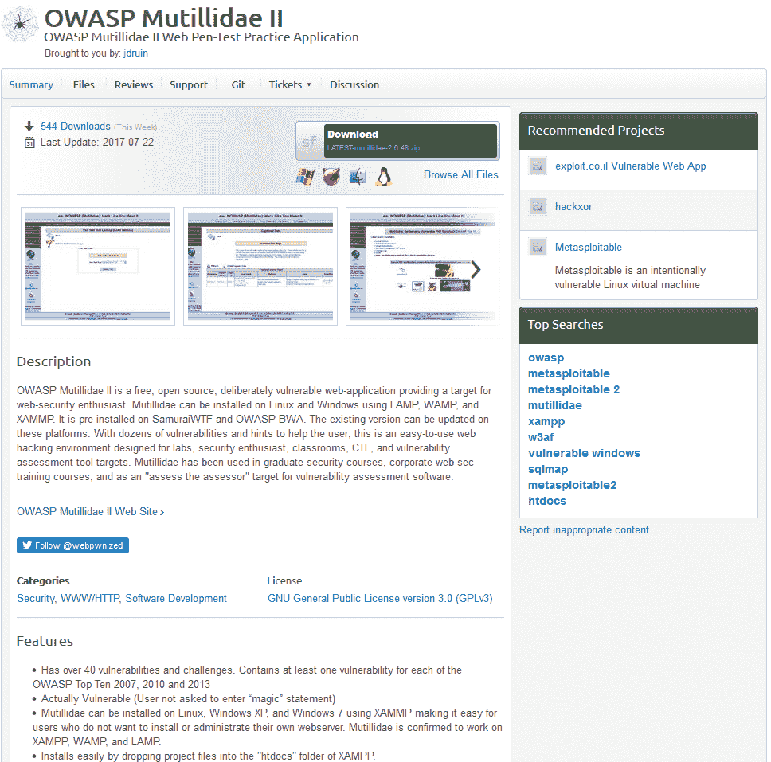

要下载它，你只需要点击下载按钮，你就能在 Windows 和 Linux 上准备好安装。最新版本（在写这本书时）是 2.6；等你阅读时，可能会有更新的版本，带来更多令人兴奋的功能。值得一提的是，这个应用的所有者始终在致力于增强其功能。

# 在 Windows 上安装 Mutillidae

Mutillidae 可以轻松地安装在 Windows 操作系统上。在这个例子中，我将它安装在 Windows 7 上（这只是个人选择）。

首先，我们将下载并安装 XAMPP，XAMPP 代表 Apache、MySQL、PHP 和 Perl（开头的 X 表示该应用程序是跨平台的——在 Windows 上，有些人称之为 WAMPP，直接将 X 替换为 W）。所以，正如你可能已经猜到的，安装 XAMPP 后，你将拥有 Apache（Web 服务器）、MySQL（数据库）和 PHP（编程语言）。

# 下载并安装 XAMPP

要下载 XAMPP，请浏览到[`www.apachefriends.org/download.html`](https://www.apachefriends.org/download.html)，然后从列表中选择最新版本，就像我这边是 7.1.10（见下图）。然后，点击下载按钮，将其保存到你的本地 Windows 机器中：

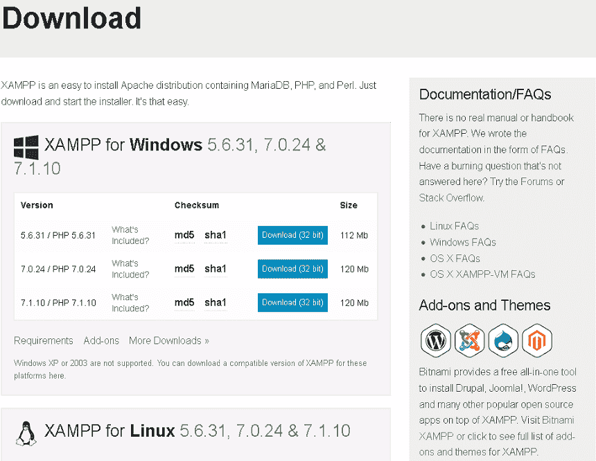

在开始安装 XAMPP 之前，我们需要更改 Windows 用户帐户控制设置。为此，打开控制面板并点击“用户帐户”。当新对话框打开时，点击“更改用户帐户控制设置”：

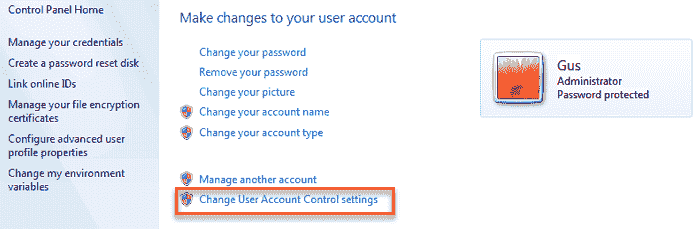

在 UAC 窗口中，你需要将滑块完全拖到底部，并点击 OK 按钮以保存更改：

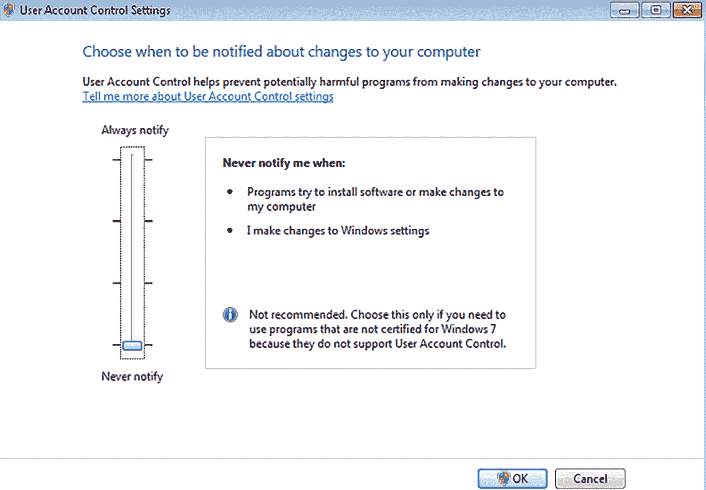

现在是安装 XAMPP（或 WAMPP）的时间了。双击下载的文件以开始安装过程，在第一个对话框中点击“下一步”按钮。在下一个窗口中，接受所有默认组件，然后点击“下一步”：

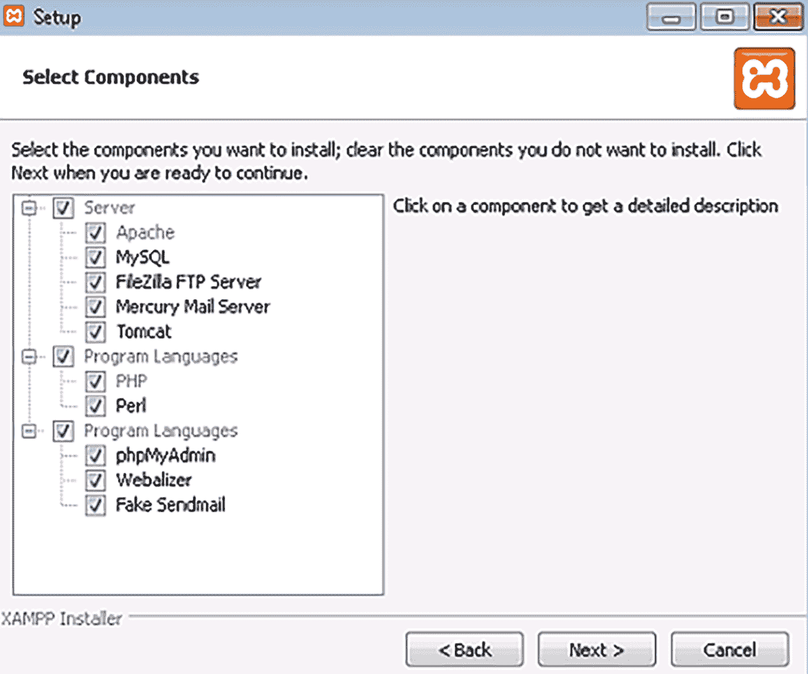

在下一步中，你需要选择一个文件夹来安装 XAMPP。一般情况下，我将其保持为默认路径 `C:\xamp`，然后点击“下一步”。

完成后，系统会提示你是否希望了解 Bitnami。我建议保持勾选状态，然后点击“下一步”。

在此阶段，设置已经准备好开始安装 XAMPP。点击最后一个“下一步”按钮，最终你将看到安装对话框。

安装完成后，系统会询问你是否希望启动控制面板；保持勾选状态，这样我们可以启动安装 Mutillidae 所需的服务。

在开始时，控制面板中的服务已被停止。我们需要通过点击它们的“启动”按钮来启动 Apache 和 MySQL 服务：

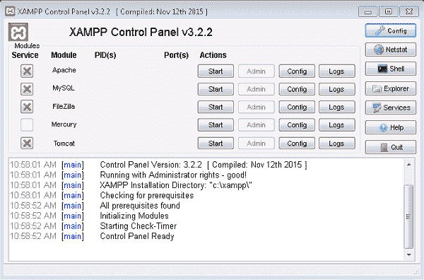

# Mutillidae 安装

我假设你已经按照本章之前的指示下载了 Mutillidae。解压压缩档案文件，复制 `mutillidae` 文件夹，并将其粘贴到 `C:\xamp\htdocs` 文件夹中。

为了从内网访问 Mutillidae 网站，我们需要调整配置文件 `.htaccess`。打开你刚刚复制的 `Mutillidae` 文件夹，`.htaccess` 文件就在里面（用记事本打开）：

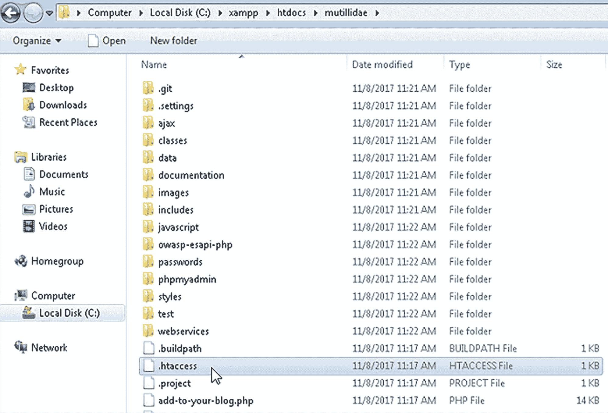

由于我的网络 IP 地址范围是 `10.0.0.0/24`，我将在 `allow` 部分添加 `Allow from 10.`：

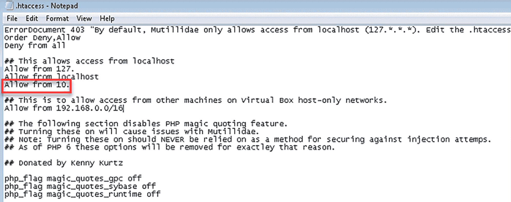

打开浏览器，输入 `http://[你的机器 IP]/mutillidae`。页面加载后，点击设置/重置数据库链接，Mutillidae 将开始安装。如果一切正常，系统会告诉你在重置数据库时未检测到任何错误。

最终！Mutillidae 的安装完成：

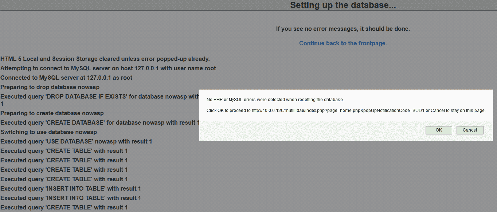

看这个！我们已经成功启动了 Mutillidae 首页，它正在大声呼喊，*黑客攻击我*，*拜托*：

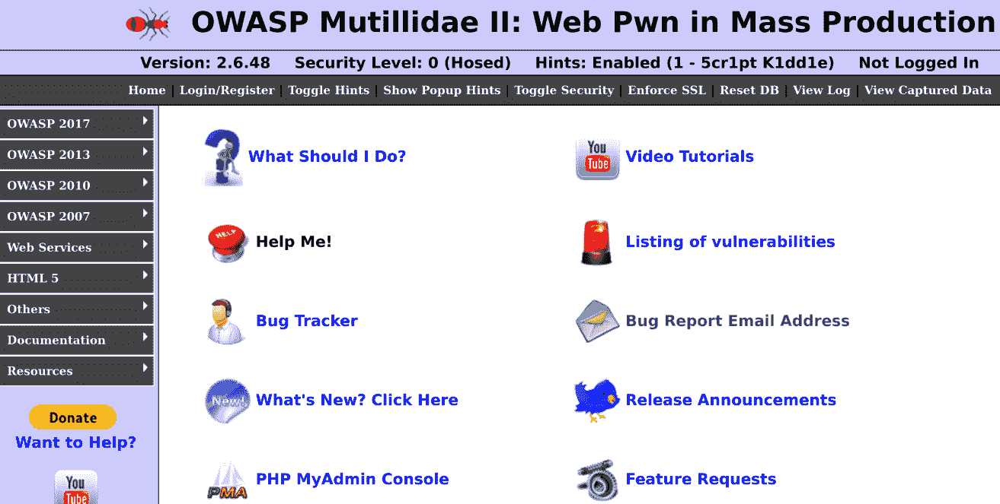

# 在 Linux 上安装 Mutillidae

你可能不喜欢 Windows，因此 Linux 可能是你最喜欢的操作系统，你会更愿意在 Linux 上安装 Mutillidae。在这一部分，我将使用 Ubuntu 版本 17.10 来安装 Mutillidae。如果你跳过了 Windows 安装部分，告诉你，在安装 Mutillidae 之前，你需要先在 Linux 上安装 XAMPP。现在，如果你不知道 XAMPP 是什么，别担心；它是指 Apache、MySQL、PHP 和 Perl。X 前缀表示该应用程序是跨平台的（在 Linux 上它也叫 LAMPP，L 代表 Linux）。所以，正如你可能猜到的那样，通过安装 XAMPP，你将得到 Apache（Web 服务器）、MySQL（数据库）和 PHP（编程语言）。

# 正在下载和安装 XAMPP

要下载 XAMPP，请浏览到 [`www.apachefriends.org/download.html`](https://www.apachefriends.org/download.html)，然后从列表中选择最新版本，在我的例子中是 7.1.1（见下图）。然后，点击下载按钮将其保存到本地机器上：

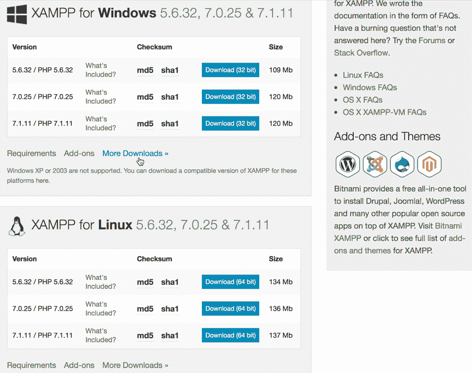

打开终端窗口，确保当前目录是文件所在位置（在我的例子中，是 `Downloads` 文件夹）。接下来，你需要使用以下命令授予安装程序执行权限：

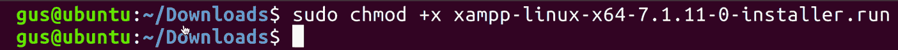

现在，安装程序已经具有执行权限，让我们运行它：

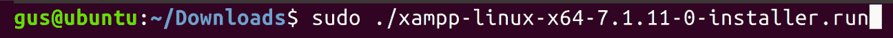

执行安装程序后，你将被提示几个问题；按字母 *Y* 表示同意并继续：

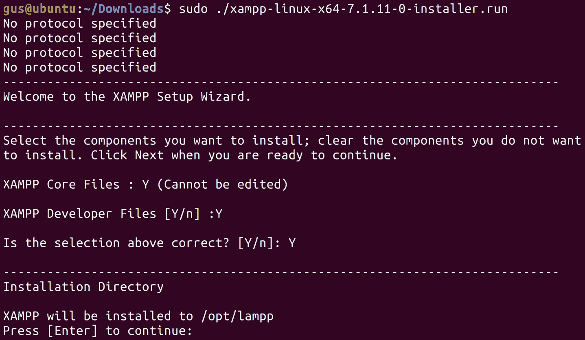

在开始安装 XAMPP 之前，输入最终的*Y*：

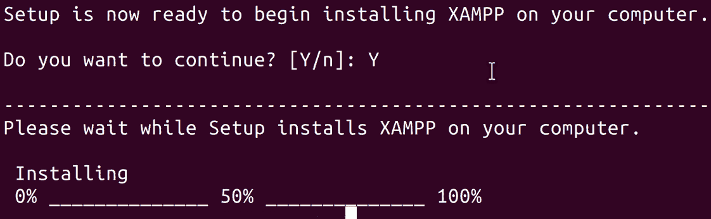

好了！XAMPP 已经在 Ubuntu 机器上成功安装：

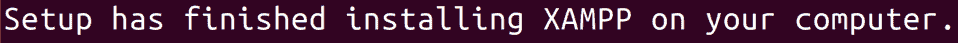

恭喜！你刚刚完成了 XAMPP 的安装。请注意，LAMPP 安装在 `/opt/lampp` 路径下，你将在哪里管理你的 Web 项目。

# Mutillidae 安装

我假设你已经按照之前的描述下载了 Mutillidae。首先，你需要解压压缩的归档文件。右键点击并从菜单中选择“提取到此处”。

接下来，将 `mutillidae` 文件夹复制到 `/opt/lampp/htdocs` 文件夹中：

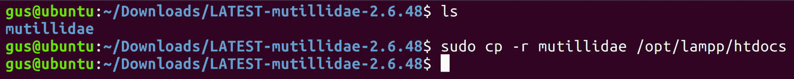

复制 `mutillidae` 文件夹后，切换目录到 `/opt/lampp`，并启动 XAMPP 服务器：

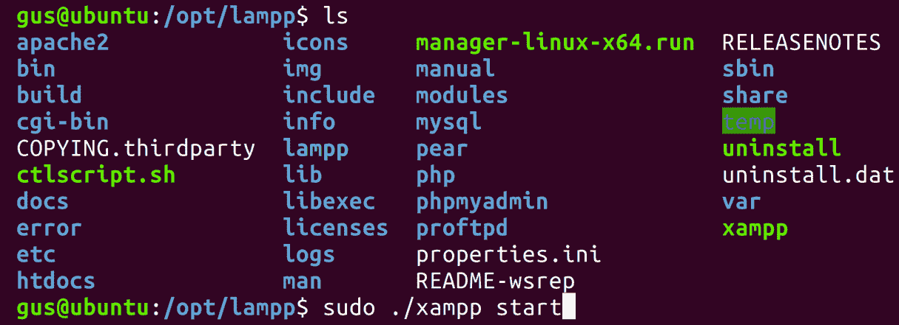

打开浏览器，输入 `http://[Ubuntu IP 地址]/mutillidae`，将 IP 地址替换为你在安装 XAMPP 的 Ubuntu 主机上的本地 IP 地址。或者，如果你在 Ubuntu 服务器上的浏览器中使用，直接使用 localhost 即可。要获取 Linux 上的本地 IP 地址，在终端窗口中输入命令 `ifconfig`：

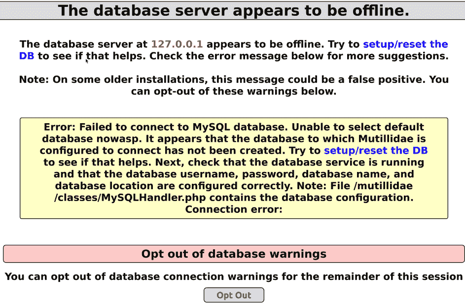

别慌！当页面首次加载时，它会要求您设置服务器。为此，请点击设置/重置数据库链接，Mutillidae 将安装在 XAMPP 服务器上：

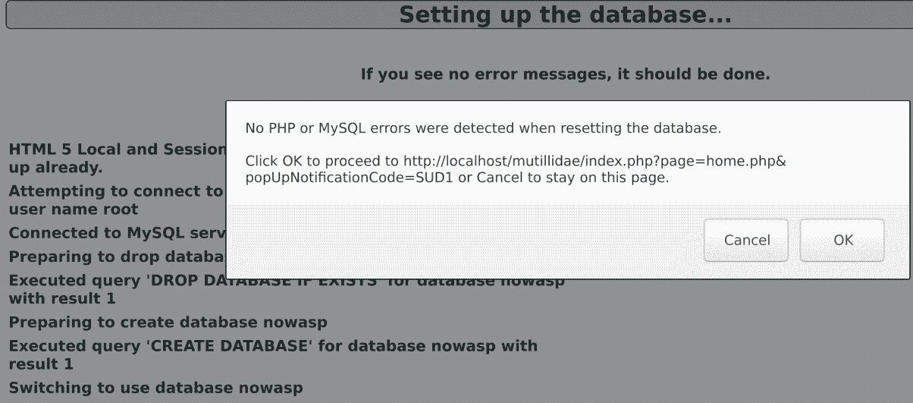

完美！根据弹出的消息，Mutillidae 安装成功，没有错误。此时，您只需要点击“确定”按钮，系统将把您重定向到 Mutillidae 的主页。厉害吧？

# 使用 Mutillidae

恭喜！现在您已经在 Windows 或 Linux 上成功安装了 Mutillidae。您应该可以从任何同一子网掩码的主机访问它。我邀请您通过点击顶部和左侧菜单来开始熟悉该站点。

# 用户注册

让我快速介绍一下如何开始使用 Mutillidae。

首先，让我们注册一个账户，用于本书后续的渗透测试。在顶部菜单中，点击“登录/注册”按钮，您将被重定向到登录页面：

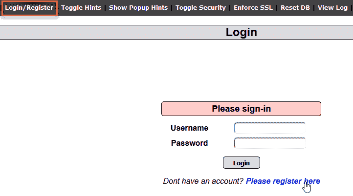

你猜对了！在此页面上，点击“请在此注册”以进入注册页面。让我们注册一个用户名为 `gus`，密码为超级秘密的 `password123`：

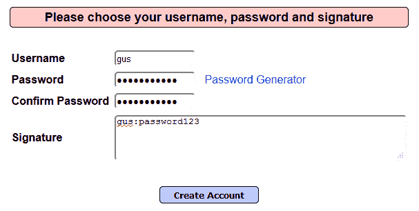

最后，点击“创建账户”按钮以创建账户：

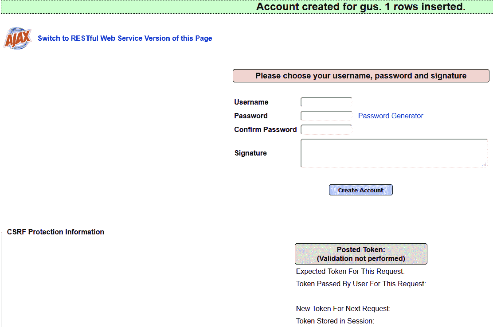

# 显示提示和设置安全等级

本应用程序是为那些希望练习 Web 应用程序漏洞的专业人员设计的。（例如，SQL 注入、跨站脚本攻击等等。别担心，您将在本书后续章节中学习到这些。）在练习时，Mutillidae 提供了显示提示的选项，以防您遇到困难，无法找到您要解决的漏洞。

首先，在顶部菜单中点击“切换提示”按钮来启用/禁用提示。接下来，点击“显示弹出提示”来启用弹出提示，您会注意到文本会变为“隐藏弹出提示”，以防您改变主意并希望再次禁用它：

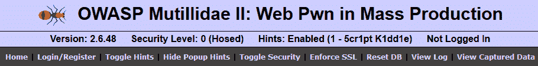

您还可以更改破解此应用程序的复杂性等级。默认情况下，安全性设置为 0（完全脆弱）；点击“切换安全性”按钮，级别将更改为 1（客户端激活）。再点击一次，级别 5 将激活（服务器端）。如果您想返回到级别 0，请在级别 5 时点击“切换安全性”，它应该会回到 1。接下来我会将它保持在级别 1，直到本书结束。

# 应用重置

有时事情可能会出错，应用程序可能会停止工作。如果 Mutillidae 出现这种情况，意味着您的应用程序生病了，需要一些药物。开个玩笑！您只需要做的是重置它。重置 Mutillidae 非常简单；只需点击顶部菜单栏中的“重置数据库”按钮，您的应用程序将焕然一新。

# OWASP 前 10 名

**开放 Web 应用安全项目**（**OWASP**）是一个致力于帮助个人和组织解决应用安全问题的社区。如果你将作为 AppSec 专家工作，那么 OWASP 应该是你的圣经；他们有大量的帮助章节，可以让你的工作变得更轻松。只需按照他们的指南和教程进行操作，访问[`www.owasp.org`](http://www.owasp.org)。

OWASP 社区定义了与 Web 应用相关的前 10 个漏洞。至于 Mutillidae，它为这些漏洞专门设置了一个菜单。在左侧菜单中，你将看到按年份组织的 OWASP 项目（最新的是 2017 年的 OWASP 前 10 名；参见以下截图）。OWASP 始终保持该列表更新，以反映最新的 Web 漏洞：

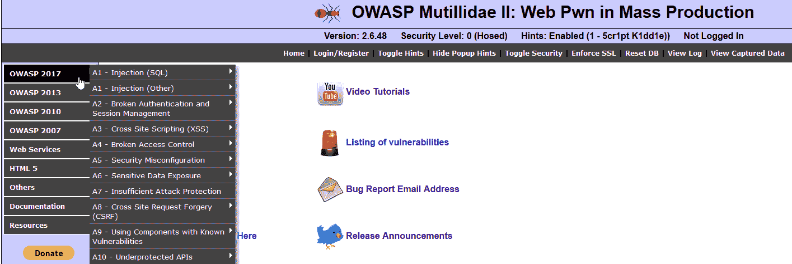

我在本书后面的章节中专门讨论了这些漏洞。现在，先尝试熟悉一下菜单项目。

# 总结

恭喜大家！你们刚刚完成了第一章，希望你们喜欢这章内容并学到了一些新东西。让我们回顾一下这一章的内容：

+   Mutillidae 是什么

+   如何下载 Mutillidae（以及在哪里找到它）

+   在 Windows 上安装 XAMPP

+   在 Windows 上安装 Mutillidae

+   在 Ubuntu Linux 上安装 XAMPP

+   在 Ubuntu Linux 上安装 Mutillidae

+   在 Mutillidae 中注册新用户

+   在 Mutillidae 中显示提示

+   OWASP 是什么，它与 Mutillidae 有什么关系

在下一章，你将学习如何安装你的渗透测试机器——Kali Linux。
