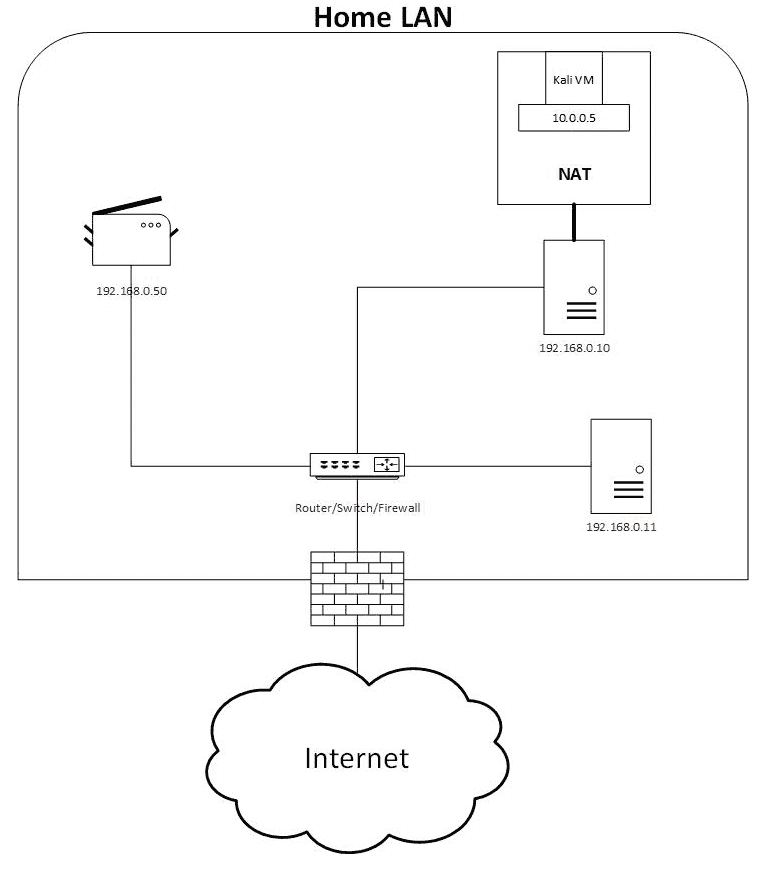

# 第二章：Kali Linux 安装

所以，你是 Kali Linux 的新手，对吧？（如果你曾经安装过 Kali Linux，你可以跳过本章。）欢迎来到黑客的玩具：Kali Linux。你兴奋吗？你还没有看到真正的内容！这个神奇的操作系统将带你进入更高的安全成就。

到本章结束时，你将学会如何安装 Kali Linux；在下一章中，你将深入学习如何使用这个操作系统。

我们已经创建了受害者机器（Mutillidae 主机），所以现在是时候创建攻击机器了。在本章中，我们将涵盖：

+   Kali Linux 简介

+   如何从零开始安装 Kali Linux

+   如何在 VMware 上安装 Kali

+   如何在 VirtualBox 上安装 Kali

# 介绍 Kali Linux

Kali Linux 到底是什么？

Kali Linux（以前叫做 BackTrack）是一个免费的、开源的、基于 Debian 的 Linux 发行版。这个操作系统安装了数百个应用程序，可以帮助我们进行成功的渗透测试。

你猜怎么着？Kali Linux 也被坏黑客（也就是黑帽黑客）使用。这意味着我们（安全专家）将得到更准确的结果，因为我们使用的工具和坏人用来入侵系统的工具是一样的。

你可以将这个“怪兽”安装在任何虚拟化主机上（VMware、VirtualBox 或 HyperV）。另外，你还可以将它安装在基于 ARM 处理器的计算机上，例如 Raspberry Pi。

最后，你需要知道 Kali Linux 是由 Offensive Security 开发、资助和维护的，你可以访问他们的网站：[`www.Kali.org`](https://www.Kali.org)。

# 从零开始安装 Kali Linux

假设你有一台笔记本电脑或专用主机，并且你想安装 Kali Linux。按照本节中的步骤，你可以将这个“怪兽”安装到你的机器上。另外，你还可以在虚拟机上安装一个全新的副本（如果你想自己了解安装过程的细节），但 Kali Linux 提供了预先构建的虚拟机，我们将在本章后面学习它们。

1.  首先，你需要下载 Kali。只需浏览到 [`www.kali.org/downloads`](https://www.kali.org/downloads)，你将进入这个操作系统（OS）的下载页面。

1.  我将选择 2018.1 64 位版本，并点击 HTTP 链接直接下载到我的机器上。下载完成后，你需要将 ISO 文件复制到可启动 USB 驱动器上。你可能在问自己一个问题：我如何让我的 USB 可启动？有一个我总是用来创建可启动 USB 的 Windows 工具，叫做 **Win32 Disk Imager**。你可以在 [`sourceforge.net/projects/win32diskimager`](https://sourceforge.net/projects/win32diskimager) 下载这个工具，而且它是免费的！

1.  我假设你已经创建了 Kali 的可启动 USB 副本，并且你刚刚启动了物理机器。在第一个屏幕上，你需要选择图形安装选项：


1.  当你按下*Enter*键时，你需要选择语言；我会选择英语，并点击继续按钮。接下来，你需要选择所在的国家，所以我会选择加拿大，因为它是我的家乡，然后点击继续按钮。接着，你要选择**键盘布局**。在我这里，我会选择美式英语。然后我们可以进入下一步。

1.  此时，系统会提示你输入 Kali 机器的主机名。这由你自己决定，命名什么都可以。

1.  接下来，输入你的本地域名。如果你没有，可以随便写一个`workgroup`，或者任何对你有意义的名称（我有一个本地域名叫`home.lan`）：


1.  在下一步中，你需要为 Kali 的 root 账户设置密码，并确认两次，然后点击继续。之后，系统会要求你配置时钟。我住在东部时区，你的时区可能不同，具体取决于你所在的城市：


1.  现在，是时候设置分区进行安装了。我通常会选择“引导 - 使用整个磁盘”（用于未加密的安装）或“引导 - 使用整个磁盘并设置加密 LVM”（用于加密安装——这种设置会加密你的磁盘驱动器）。我会选择前者，但如果你在物理机器上安装，特别是笔记本电脑，我强烈建议你选择加密设置：


1.  接下来，你需要选择安装 Kali 的磁盘分区。大多数情况下，你只会看到一个大的分区，选择它并点击继续：


1.  在下一个屏幕中，选择将所有文件放在一个分区中；这就是我为 Kali 始终选择的选项。如果你是一个资深极客，想要分开分区，可以随意选择。

1.  完成此步骤后，系统会要求你完成分区并将更改写入磁盘；你还能选择什么呢，对吧？

选择“是”以将更改写入磁盘。

最终！安装将开始，根据你的机器，可能需要几分钟才能完成。

还没到庆祝的时候；在你开始使用 Kali 之前，还有几个步骤。当安装完成后，系统会要求你选择一个网络镜像。选择“是”并继续（你将需要这个网络镜像来更新你的 Kali Linux）。

1.  完成这一步后，除非你的网络中有代理，否则请保持代理文本框为空：


离完成只差一步了。在下一个屏幕上，系统会要求你选择是否安装 GRUB 启动加载程序。我会选择“是”，因为我喜欢这个功能。这个选项将允许 GRUB 安装到主引导记录（即启动机器时看到的第一个屏幕）。

1.  接下来，你需要选择 GRUB 启动加载程序的磁盘分区。在这种情况下，你只会看到一个选项，因此选择它继续：


在此阶段，将执行最终的安装（完成设置过程），并且会显示一条信息，告诉你 Kali 已准备好。太棒了！

1.  点击继续，系统将重新启动。当你进入登录界面时，输入用户名 `root`，然后输入在安装过程中选择的密码。

# 在 VMware 上安装 Kali

如果你有**VMware**并且想在其上安装 Kali Linux，那么这个部分适合你。在前面的部分中，你看到了如何从零开始安装 Kali，但如果你有 VMware，就不需要那样做。你需要做的只是下载映像文件并将其导入 VMware，就可以开始使用了：

1.  要下载 VMware 映像文件，请访问 [`www.kali.org/downloads`](https://www.kali.org/downloads)，然后稍微向下滚动，直到看到以下部分：


1.  请按照链接访问 Offensive Security 下载页面。在该页面上，你将看到一个表格，其中包含了 VMware 的虚拟映像副本：


1.  选择 32 位或 64 位版本，并将其下载到本地计算机。然后，你需要将其导入 VMware，因此找到文件菜单（点击它），然后点击打开：


1.  会弹出一个对话框，你应该选择你下载的映像文件。一旦 Kali 被导入 VMware，你需要更改其默认设置。为此，点击编辑虚拟机设置：


1.  首先，你需要检查内存设置。点击内存设备，确保至少有 2,048 MB（2 GB）的内存。如果你的主机性能较好，最好将其增加到 4 GB：


1.  接下来，点击处理器设备，确保你的 Kali Linux 主机有足够的处理能力。要对你的新机器宽容一些：


1.  现在是时候设置网络设置了。如果你想将虚拟机与**本地网络**（**LAN**）隔离，那么你需要选择 NAT 选项。如果选择 NAT，你的虚拟机将会自动分配一个动态 IP 地址，使用虚拟 DHCP 服务器（查看接下来的章节，*桥接模式与 NAT 与内部网络*，获取更多详情）：


1.  当你使用虚拟机时，你需要在 Kali Linux 和本地机器之间共享文件。为此，你需要一个共享文件夹。要添加一个，点击选项标签并选择“始终启用”单选按钮。然后，点击“添加...”按钮，指向你本地机器的文件夹。此设置特定于 Windows，但在 macOS 上也非常相似：


1.  现在，你可以启动 Kali 虚拟机，但在第一次启动时，我建议你安装 VMware 工具。为此，打开你的终端窗口并执行以下命令：

```
apt-get update && apt -y full-upgrade
reboot
# After reboot 
apt -y install open-vm-tools-desktop fuse
reboot
```

有时候，共享文件夹不会开箱即用。要启用它们，你需要在终端窗口执行以下脚本：

```
cat <<EOF > /usr/local/sbin/mount-shared-folders
#!/bin/bash
vmware-hgfsclient | while read folder; do
 vmwpath="/mnt/hgfs/\${folder}"
 echo "[i] Mounting \${folder}   (\${vmwpath})"
 mkdir -p "\${vmwpath}"
 umount -f "\${vmwpath}" 2>/dev/null
 vmhgfs-fuse -o allow_other -o auto_unmount ".host:/\${folder}" "\${vmwpath}"
done
sleep 2s
EOF
chmod +x /usr/local/sbin/mount-shared-folders
```

如果你希望操作更简单，可以通过在终端窗口执行以下脚本，添加一个桌面快捷方式：

```
ln -sf /usr/local/sbin/mount-shared-folders /root/Desktop/mount-shared-folders.sh
gsettings set org.gnome.nautilus.preferences executable-text-activation 'ask
```

# 在 VirtualBox 中安装 Kali

**VirtualBox** 是一款非常流行的虚拟化产品，因为它是免费的，并且提供专业的功能。你很可能会使用 VirtualBox 作为你的虚拟化环境。我的基础机器是 Windows 或 macOS，我在其上安装了 VirtualBox，因此我可以使用 Kali Linux 进行渗透测试任务。

Kali 为我们提供了预构建的 VirtualBox 镜像，因此我们只需导入它们，并立即开始使用 Kali。是不是很棒？请参见以下步骤：

1.  要下载 VirtualBox 镜像文件，访问[`www.kali.org/downloads`](https://www.kali.org/downloads)，然后稍微向下滚动，直到你看到以下部分：


1.  访问链接到**攻击性安全下载**页面。在该页面中，你会看到一个包含虚拟镜像文件的表格，适用于 VirtualBox：


1.  选择 32 位或 64 位版本，并将其下载到本地机器。然后，你需要将其导入到 VirtualBox 中，打开 VirtualBox，找到文件菜单（并点击它），然后点击导入虚拟机（我在此演示中使用的是 macOS，Windows 应该非常相似）。

1.  一旦 Kali 被导入到 VirtualBox 中，你需要修改其默认设置。为此，选择新的虚拟机，并点击设置按钮。

1.  首先，我们需要检查内存设置。点击系统标签页，然后点击主板子标签。确保你至少有 2,048 MB（2 GB）的内存。如果你的主机性能良好，建议将内存增加到 4 GB：


1.  接下来，点击处理器子标签，确保 CPU 游标位于绿色区域和橙色区域之间，如下图所示：


1.  现在，是时候设置网络设置了。如果你希望将虚拟机与**本地局域网**（**LAN**）隔离开，那么你需要选择 NAT 或 NAT 网络。选择 NAT 时将始终分配相同的 IP 地址，但如果你选择 NAT 网络，虚拟机将会自动分配一个动态 IP 地址，使用虚拟 DHCP 服务器：


1.  如果你选择了 NAT 网络选项，你需要退出设置窗口并选择 VirtualBox 菜单，然后点击偏好设置。接着，选择网络标签页，并点击 NAT 网络子标签页。最后，点击右侧的添加按钮（加号所在位置，如下截图所示），一个新的网络将自动为你创建：


1.  如果你是一个技术宅，想要重命名网络或分配特定的 IP 地址范围，你需要点击编辑按钮（在添加按钮下方，图标是一个刷子）。你会看到一个弹出窗口，可以在其中根据个人喜好调整设置：


1.  使用虚拟机时，你需要在 Kali Linux 和本地机器之间共享文件。为了实现这一点，你需要一个共享文件夹。让我们回到虚拟机设置，选择共享文件夹标签页。然后，点击右侧的添加按钮。一个弹出窗口将打开，在其中你可以输入本地机器（Windows 或 macOS）中共享文件夹的路径，并给你的共享文件夹命名。我个人也使用了自动挂载选项，以确保每次启动 Kali 主机时该功能都能正常工作：


1.  现在，你可以启动你的 Kali 虚拟机了。在第一次启动时，我建议你安装 VirtualBox 客户端增强工具。为此，打开终端窗口并执行以下三个命令：

```
apt-get update
apt-get install -y virtualbox-guest-x11
reboot
```

在执行 `reboot` 命令后，你的虚拟机会重启。你将准备好开始使用出色的操作系统 Kali Linux！

# 桥接模式 versus NAT 模式 versus 内部网络

大家对于 VirtualBox 和 VMware 中网络配置的工作方式完全感到困惑。最受欢迎的三种配置是**桥接模式**、**NAT 模式**和**内部网络**。

我们从最简单的选项开始，那就是桥接网络。这个架构将让你的 Kali Linux 直接连接到你的网络（LAN），并从家庭路由器获取自动的 IP 地址。所以，如果你的网络是 `192.168.0.0`，那么你的 Kali IP 地址会是类似 `192.168.0.x` 的形式（例如，`192.168.0.101`）。现在，你可以通过 Kali Linux 与网络中的机器进行交互：


有些人害怕将 Kali 连接到网络，因为它是开放的，能够连接到个人计算机。如果你对此感到焦虑，你可以选择 NAT 或 NAT 网络（在 VirtualBox 中）。如果你使用 VirtualBox，建议使用 NAT 网络，而不是 NAT，因为 NAT 网络会自动分配 IP 地址（有关此架构的更多实现细节，请参见*在 VirtualBox 上安装 Kali*一节）。当你选择 NAT（或 NAT 网络）时，你的 Kali 主机会被分配一组不同的 IP 地址。例如，如果你家庭网络的 IP 地址范围是`192.168.0.0`，那么使用 NAT 时，你应该使用一个不同的**虚拟局域网**（**VLAN**），例如`10.0.0.0`：



内部网络是为特定的人群设计的，这些人希望将计算机完全与局域网（LAN）和广域网（WAN）隔离。你可能会问自己以下问题：这一切的目的是什么？如果你提前知道自己在测试一台安装了恶意软件的虚拟机，你将使用这种架构。此外，当安全专家与他们不信任的**夺旗**（**CTF**）机器进行交互时，也会使用这种架构：


# 更新 Kali Linux

在开始使用你的 Kali Linux 机器之前，你需要确保你的系统是最新的。更新 Kali Linux 的命令非常简单，你会习惯它的，因为你至少每周需要执行一次，或者在安装任何新应用之前执行：

```
apt-get update
apt-get upgrade -y
reboot
```

`upgrade`命令中的`-y`会自动接受提示。你不需要每次升级时都按*Y*键来确认。

你可能很好奇 Kali 的更新仓库配置文件在哪里。该配置文件的路径是`/etc/apt/sources.list`（行首的`#`表示该行被注释掉）：


# 总结

到这一步，你已经准备好开始使用 Kali Linux 了。在下一章，你将通过掌握操作系统的使用技巧，将自己的技能提升到一个新的水平。

我喜欢把总结简洁一些，不想用无用的细节让你感到无聊。希望你喜欢这一章，也学会了如何从零开始下载并安装 Kali Linux。我假设你已经学会了如何在 VMware 或 VirtualBox 上安装 Kali；别忘了为这两者都安装额外的工具。

最后提醒一下，别忘了在进入下一章之前更新你的 Kali Linux 主机。
