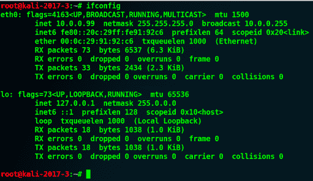
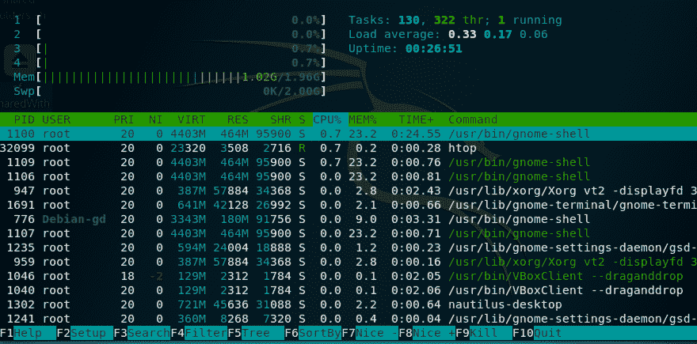

# 第三章：深入探讨 Kali Linux 的使用

我非常兴奋能写下这一章，并分享你需要掌握 Kali Linux 使用的所有信息。本章中的很多内容在 Debian Linux 发行版中也很常见，到本章结束时，你将能够像真正的黑客一样轻松使用 Kali Linux。说到黑客，值得一提的是，Kali Linux 被黑帽黑客和专业渗透测试员广泛使用。我一直在我的任务中使用它，并且偶尔（但很少）使用 Microsoft Windows 操作系统。

Kali Linux 包含大量专用于渗透测试的工具，一次性适应所有这些工具将是一个巨大的挑战。在本章中，我将向你展示我最常用的命令。我在执行任务时会随身携带它们，以便操作 Kali Linux 系统。你将看到本章中有很多命令；将它们作为备忘单，帮助你达成目标。这只是如何将 Kali Linux 用作操作系统的开始，在接下来的章节中，你将学习 Kali 中安装的渗透测试工具。

在开始阅读本章之前，我想强调使用**终端窗口**的重要性。如果你想在使用 Kali Linux 方面表现出色，你应该把所有精力集中在掌握终端窗口的使用技巧上。实际上，除非某些工具是为像 Burp 这样的任务设计的，否则我几乎不使用 GUI；那只是一个例外，朋友们。

你激动吗？在这一章中，你将学到以下内容：

+   Kali Linux 文件系统结构

+   处理应用程序和软件包

+   在 Kali 中管理文件系统

+   Kali 安全管理

+   处理安全外壳

+   配置 Kali 中的网络服务

+   进程管理命令

+   系统信息命令

# Kali 文件系统结构

你首先需要理解的是 Kali Linux 的**文件系统结构**，它基于 Debian 发行版的文件系统。如果你以前使用过 Microsoft Windows 操作系统，那么 Linux 的结构会与之有些相似。例如，Windows 从`C:\`目录开始，而 Linux 操作系统从`**/**`开始，这个目录被称为`root`目录。

在 Kali 中使用的`root`目录（`**/**`）和根`home`目录（`/root`）并不相同。后者是 root 用户的主目录。

在 Kali 中，我们始终使用 root 用户登录到我们的机器，这意味着你在操作系统中没有任何限制。Linux 系统中的每个组件都是基于文件的；四处查看是可以的，但如果你决定更改任何配置文件，请小心。

Kali 中的目录结构基于 Unix 的**文件系统层次标准**（**FHS**），该标准定义了 Linux 的目录及其内容：


| 目录 | 内容描述 |
| --- | --- |
| `/bin` | 所有用户的基本系统命令二进制文件。（例如，`grep`，`ls`，`cat`。类似 Windows 中的`c:\Windows\System32`。） |
| `/boot` | 包含启动加载器、内核和`initrd`文件。 |
| `/dev` | 该目录包含指向各种设备的位置指针。 |
| `/etc` | 该文件夹包含所有的`管理`/`配置`文件和密码。 |
| `/lib** | **/bin/` 和 `/sbin/` 中二进制文件所需的库。 |
| `/lost+found` | 之前恢复的文件。 |
| `/mnt` | 包含临时挂载的目录。 |
| `/media` | 可移动媒体的挂载目录，如 CD-ROM。 |
| `/opt` | 附加应用软件包（预编译的，非`.deb`二进制分发文件（压缩文件）存放在这里）。 |
| `/proc` | 包含内核和进程状态（通常是文本文件，例如，系统运行时间和网络信息）。 |
| `/root` | 根用户的主目录。 |
| `/sbin` | 包含专用于管理命令的系统二进制文件（例如，`守护进程`，`init`，`route`等）。 |
| `/tmp` | 一个临时文件夹，包含用于短时间内的文件。 |
| `/srv` | 系统提供的某些特定数据。 |
| `/sys` | 与`/proc`非常相似。 |
| `/home` | 包含用户的主目录。 |

| `/usr` | 包含只读数据（以前来自 UNIX 源代码库；现在来自 UNIX 系统**r**esources）：

+   `/usr/bin/`：与顶级层次相同

+   `/usr/include/`：标准包含文件

+   `/usr/lib/`：与顶级层次相同

+   `/usr/sbin/`：与顶级层次相同

+   `/usr/share/`：与架构无关（共享）数据

+   `/usr/src/`：源代码（用于构建 Debian 软件包 - 请参见`/usr/local/src/`）

+   `/usr/X11R6/`：X Window 系统，版本 11，第 6 版

+   `/usr/local/`：系统管理员安装的本地数据的三级层次

+   `/usr/local/bin`：本地编译的二进制文件、本地 Shell 脚本等

+   `/usr/local/src`：源代码（提取和构建非 Debian 化软件的地方）

|

| `/var` | 包含可变数据（例如，网站、日志、数据库等）。 |
| --- | --- |

# 处理应用程序和软件包

Kali Linux 软件包存储在仓库中，并下载到系统中以确保软件包的完整性。请确保始终更新系统，如前一章所述。仓库配置文件位于`/etc/apt/sources.list`。确保该文件不为空（如果在安装过程中没有选择网络镜像选项，它会为空）；如果为空，你的 Kali 将无法更新。

# 高级打包工具

**高级打包工具**（**APT**）用于安装或升级软件包，并处理所有必需的依赖项。APT 还可以用于升级完整的 Kali 发行版：

+   `apt-get update` 或 `apt update`：此命令用于将本地软件包索引文件与其源进行同步，源定义在`/etc/apt/sources.list`中。在执行`upgrade`或`dist-upgrade`之前，应始终先使用`update`命令。

+   `apt-get upgrade` 或 `apt upgrade`：此命令用于安装系统上已安装的所有软件包的最新版本，使用`/etc/apt/sources.list`。`upgrade`命令不会更改或删除未升级的软件包，并且不会安装尚未安装的软件包。与此命令一起使用`-y`开关，以自动接受提示消息。

+   `apt-get dist-upgrade` 或 `apt dist-upgrade`：此命令升级系统上当前安装的所有软件包及其依赖项。它还会从系统中删除过时的软件包。与此命令一起使用`-y`开关，以自动接受提示消息。

要完全升级您的 Kali Linux 操作系统，请使用以下命令：

```
apt update
apt dist-upgrade -y
**reboot** 
```

您可以通过使用`&& apt update && apt dist-upgrade -y && reboot`将前面三个命令组合成一个命令。

+   要显示软件包的完整描述并识别其依赖项，请使用以下命令：

```
apt-cache show [package name]
```

+   要从 Kali 中删除一个软件包，请使用以下命令：

```
apt-get remove [package name]
```

+   要从存储库安装应用程序，请使用以下命令：

```
apt-get install [application name]
```

有时，您会从网络上下载应用程序，并且需要使用以下命令进行安装：

`./configure && make && make install`

如果您想从 GitHub 存储库下载一个工具包，请使用以下命令（要获取 URL，在存储库主页上，点击克隆或下载按钮，URL 将显示）：

```
git clone [Github repo URL]
```

# Debian 的软件包管理系统

此打包系统使用`dpkg`命令来安装、删除和查询软件包。

# 使用 dpkg 命令

接下来的命令是我经常使用的最常见的命令，但如果您好奇并想了解更多关于所有命令的信息，那么在您的终端中执行以下命令：

+   要获取`dpkg`命令的`help`说明，请使用以下命令：

```
dpkg --help 
```

您可以使用`--help`查看您喜欢的任何命令的说明。此外，您还可以使用手册命令：

`man [应用程序名称]`

+   要列出 Kali 上安装的所有软件包，请使用以下命令：

```
dpkg -l
```

您可以在后渗透阶段使用`dpkg -l`命令列出受损 Linux 系统上安装的所有应用程序。

+   要查找系统上已安装的特定应用程序，请使用以下命令：

```
dpkg -l | grep [application name]
```

+   要安装新下载的`.deb`应用程序，请使用以下命令：

```
dpkg -i [path\filename.deb]
```

+   要卸载已安装的应用程序，请使用以下命令：

```
dpkg -r [application name]
```

# 处理 Kali 中的文件系统

我可以为这一部分写一本整书，但我会尽力向您展示作为渗透测试人员必备的命令。

在开始列出所有命令之前，我想分享一个独特的命令行工具，您需要在开始使用本章中的任何工具之前掌握它。您可能已经猜到了，它被称为帮助选项！这个选项将为您提供关于您即将执行的命令的有用信息。

例如，如果您想列出目录的内容并且不确定命令的选项，只需附加`--help`选项，您就能查看命令的所有可能功能：


准备好了吗？这将是一个很长的列表（类似备忘单）。我们开始吧：

+   要列出目录和文件，请使用以下命令：

```
ls
```

+   要以格式化方式（`-l`）列出隐藏项目（`-a`），请使用以下命令：

```
ls -la
```

+   要以人类可读的格式列出文件和目录，请使用以下命令：

```
ls -lh
```

+   要将当前目录更改为新目录，请使用以下命令：

```
cd [directory path]
```

+   要打印当前工作目录，请使用以下命令：

```
pwd
```

+   要创建新目录，请使用以下命令：

```
mkdir [path/directory name]
```

+   要删除文件，请使用以下命令：

```
rm [path/file name]
```

+   要删除目录，请使用以下命令：

```
rm -r [path/directory name]
```

+   要将文件复制到新位置，请使用以下命令：

```
cp [path1/file name] [path2/filename]
```

+   要将目录复制到新位置，请使用以下命令：

```
cp -r [path/directory name]
```

+   要移动/重命名文件或目录，请使用以下命令：

```
mv [path1/file name] [path2/file name]
mv [path1/directory name] [path2/directory name]
```

+   要创建一个空文件，请使用以下命令：

```
touch [path/new file name]
```

+   要显示文件内容，请使用以下命令：

```
cat [path/file name]
more [path/file name]
#list the first 10 lines
head [path/file name]
#list the last 10 lines
tail [path/file name]
```

+   要打开文本文件进行编辑，请使用以下命令：

```
gedit [path/file name]
#Terminal window text editor (Some people use the Vim editor but that's not my choice)
nano [path/file name]
```

+   要在 Kali 系统上查找文件，请使用以下命令：

```
locate [file name]
find [Path where to start the search] -name [file name patterns]
```

+   用于列出系统上的驱动器（分区）（例如，`/dev/sda1 或 /dev/sda2`）的命令如下：

```
fdisk -l
```

+   要挂载一个未挂载的分区，请使用以下命令：

```
mount [path source]  [path destination]
#Example mounting a hidden windows drive that is already installed on the same machine
#Already executed $fdisk -l and saw a drive /dev/sda2
mount /dev/sda2 /mnt/windowsmount
```

+   要检查文件类型，请使用以下命令：

```
file [path/file name]
```

+   要为文件添加执行权限（有时您需要此权限，因为默认情况下无法执行文件），请使用以下命令：

```
chmod +x [path/file name]
```

+   要将终端窗口的输出重定向到文件，请使用以下命令：

```
[command] > [path/filename]
#Example to save the ls command output to a file called output.txt
ls -lh > /root/temp/output.txt
```

+   要过滤文本文件或命令终端输出中的文本，请使用以下命令：

```
grep [text to filter]
```

`grep`命令最常与`Pipe`符号`|`一起使用，用于过滤从终端窗口输出的文本。例如，要过滤名为`config.txt`的文本文件中的`password`，您可以使用以下命令：

`cat config.txt | grep password`

# 文件压缩命令

您可以使用以下命令在任何 Linux Debian 发行版上管理压缩文件：

+   以下命令创建`file.tar`，包含文件：

```
tar cf [file.tar] [files]
```

+   以下命令从`tar`文件`file.tar`中提取文件：

```
tar xf  [file.tar]
```

+   以下命令创建带有 Gzip 压缩的`tar`文件：

```
tar czf [file.tar.gz] [files]
```

+   以下命令使用 Gzip 提取`tar`文件：

```
tar xzf [file.tar.gz]
```

+   以下命令创建一个带有 bzip2 压缩的`tar`文件：

```
tar cjf [file.tar.bz2]
```

+   以下命令提取一个 bzip2 压缩的文件：

```
tar xjf [file.tar.bz2]
```

+   以下命令使用`gzip`压缩文件（或多个文件）：

```
gzip [files]
```

+   以下命令解压一个压缩的`gz`文件：

```
gzip -d [file.gz]
```

+   以下命令解压一个 ZIP 文件：

```
unzip [file.zip]
```

# 安全管理

在 Kali 中管理用户不是日常任务，但你可能会偶尔使用它。就个人而言，我很少使用以下命令，但有时你可能需要处理用户管理：

+   要在 Kali 中为用户`sudo`权限添加一个用户，使用以下命令：

```
useradd -m [username] -G sudo -s /bin/bash
```

+   如果你已登录并想提升权限为 root 用户，尝试以下命令：

```
su - [desired root user name]
```

+   如果你已登录并想执行 root 命令，使用以下命令：

```
sudo [application name]
```

+   要更改 root（或任何用户）的密码，使用以下命令：

```
passwd [user name]
```

+   `shadow`文件在 Kali 中非常重要，因为它存储了哈希密码以及一些关于用户的有用信息。例如，我在 Kali 上创建了一个名为`gus`的用户，所以，要获取他的相关信息，我应该执行以下命令：

```
ls /etc/shadhow | grep gus

#output
gus:$6$mNP6T4jA$sn0eAgo7o1pjSUxe6loigq1wWhC4agpWpWopv0mVBr2V21ZfU./hAMPJTO/7Ecajd0SVozLGwDOrc37hN1ktL0:17517:0:99999:7:::
```

我们来看一下输出中每个以`:`分隔的字段：

+   第一个字段显而易见；它是用户名（`gus`）

+   第二个字段是哈希后的密码（`$6`表示它使用的是 SHA-512 算法）

+   第三个字段（`17515`）是密码更改时的 Unix 时间（天数）

+   第四个字段（`0`）指定密码更改之间所需的天数

+   第五个字段（`9999`）指定需要更改密码后的天数

+   下一个字段（`7`）表示在要求更改密码之前的天数，并且用户会收到警告

# 安全外壳协议

**安全外壳协议** (**SSH**) 是一种网络协议，用于在服务器和客户端之间建立加密通信，使用 TCP 协议。SSH 服务基于 TCP，并默认监听`22`端口。一般来说，公私钥对允许用户在不需要密码的情况下登录系统。公钥存在于所有需要安全连接的系统中，而用户将私钥保存在安全的位置。在目标系统上，公钥会与被授权的密钥列表进行验证，以允许远程访问服务器。当公钥的加密强度不足时，SSH 可能会受到威胁，并且有可能被猜测。

+   启动 SSH 服务，使用以下命令：

```
service ssh start
```

+   要检查服务是否正常运行，使用以下命令：

```
netstat -antp|grep sshd
# or
service ssh status
```

+   要启用服务在启动时自动启动，使用以下命令：

```
systemctl enable ssh
```

+   要停止 SSH 服务，使用以下命令：

```
service ssh stop
```

+   要连接到远程 SSH 服务器，使用以下命令：

```
ssh [username@IP]
```

+   要连接到使用自定义`端口号`（而非`22`）的 SSH 服务器，使用以下命令：

```
ssh -p [port number]
```

+   要生成一个新的 SSH 密钥，使用以下命令：

```
dpkg-reconfigure openssh-server
```

+   要允许 root 用户远程登录 SSH，执行以下操作：

    1.  打开文件`/etc/ssh/sshd_config`

    1.  将 PermitRootLogin 参数改为 Yes，并重启 SSH 服务器

如你所猜测的那样，要管理任何服务，你可以使用以下命令：

`service [service name] start (启动服务)`

`service [service name] stop (停止服务)`

`service [service name] restart (重启服务)`

`service [service name] status (获取服务状态)`

# 在 Kali 中配置网络服务

我会尽力展示每个部分所需的命令。你不需要了解所有 Kali 中管理网络服务的命令，但你肯定会用到其中的一些命令。在本节中，我将向你展示我最喜欢的 Kali Linux 网络服务相关命令。

为了正确操作 Kali，你需要确保它能连接到有线或无线网络。你可能需要通过 **动态主机配置协议**（**DHCP**）获取 IP 地址，或者静态分配一个地址。

第一个重要的命令是 `ifconfig`，你将用它来检查 Kali 机器上的 IP 地址：


在执行这个命令后，你可以看到我的 Kali IP 地址，`10.0.0.197`（在前面的截图中）。另外，你需要注意网络接口名称——`eth0` 代表以太网线，操作系统会为其分配一个编号（在这个例子中是 `0`）。如果你连接了另一根以太网线，你可能会看到另一个接口，叫做 `eth1`。如果你连接了无线适配器（或者它是内置的），Kali 会显示另一个接口，叫做 `wlan0`。

在前面的示例中，我们从 DHCP 服务器获取了一个动态 IP 地址。如果由于某种原因你想刷新 IP 地址，可以执行以下命令：

```
dhclient [interface name]
#Example
dhclient eth0
```

# 在 Kali 中设置静态 IP

有时，你需要为 Kali Linux 配置一个专用的静态局域网 IP 地址。一个非常实际的场景是，当你值班时，你想避免与客户端（或雇主）的 DHCP 服务器通信，保持低调。另一个静态 IP 地址的用途是，如果你有一个独立的 VLAN，想手动加入它。

让我们看看如何实现静态 IP 地址：

1.  首先，使用你喜欢的文本编辑器打开文件 `/etc/network/interfaces`：


我将在文件末尾添加一个新的静态 IP 地址，`10.0.0.99`，属于 `10.0.0.0/24` 网络。在你的情况下，网络可能是 `192.168.0.0/24`。至于我，我使用的是 `10.0.0.0` 网络架构：

```
# This file describes the network interfaces available on your system
# and how to activate them. For more information, see interfaces(5).

source /etc/network/interfaces.d/*

# The loopback network interface
auto lo
iface lo inet loopback

#Static IP Address
auto eth0
iface eth0 inet static
 address 10.0.0.99
 netmask 255.255.255.0
 network 10.0.0.0
 broadcast 10.0.0.255
 gateway 10.0.0.1
```

1.  保存文件（*Ctrl* + *S*），并重启 Kali 机器。（提示：我将在终端窗口使用 `reboot` 命令重启 Kali。）重启后，执行 `ifconfig` 命令，你应该能看到设置的新 IP 地址。然后，你就可以开始使用了：



# 检查 Kali 中的活动连接

**网络统计**（`netstat`）是一个命令行工具，用于显示 Kali 上的活动网络连接。它用于发现问题（例如，查找正在监听传入连接的恶意软件，或试图联系外部（外发）服务器的恶意软件）。`netstat` 有很多用途。大多数情况下，`netstat` 会与 `grep` 命令结合使用，以过滤输出结果：

```
netstat -antp
```

+   `-a`：显示监听和非监听的套接字。

+   `-n`：显示数字地址，而不是尝试确定符号主机、端口或用户名。

+   `-t`：显示 TCP 连接。

+   `-p`：显示**进程标识符**（**PID**）和每个套接字所属程序的名称：


正如您在上面的截图中所看到的，我的 Kali 主机正在侦听端口`80`，因为我已经启动了 Apache web 服务器服务。

要在 Kali 上启动 Apache web 服务器，请执行命令`service apache2 start`。

# 进程管理命令

一般来说，Kali Linux 是一个稳定的系统。然而，事情偶尔可能出错，有时，我们会希望调整系统以更好地满足我们的需求。在本节中，我们将简要介绍如何在 Kali Linux 系统上管理进程。

# Htop 实用程序

在我开始列出 Kali 中管理进程的所有内置命令之前，有一个我总是使用的方便工具。不幸的是，它在 Kali 上没有预安装。它被称为`htop`。这个命令行工具在终端窗口中以一个漂亮、用户友好的布局列出所有正在运行的进程：

```
#To install it
apt-get install htop
# To execute it
htop
```

通过使用`htop`，我可以看到我有一个几乎满的内存问题。这告诉我应该增加这个虚拟机的内存设置。

# 进程管理的常用命令

我们还没有完成；以下是在使用 Kali Linux 时非常有用的一些进程管理命令：

+   要显示所有活动进程，请执行以下命令：

```
ps
```

如果你有一个远程 shell 连接到 Linux 主机，并且想要列出所有当前进程以进行权限提升，`ps`命令非常有用。

+   要显示所有正在运行的进程，请使用以下命令：

```
top
```

+   要终止具有 ID（`PID`）的进程，请使用以下命令：

```
kill [PID Number]
```

+   要终止所有名为`hello`的进程，请使用以下命令：

```
killall hello
```

+   要强制终止一个进程，请使用以下命令：

```
kill -9 [PID Number]
```

# 系统信息命令

这一部分在后渗透阶段将非常有用。

假设您刚刚在 Linux 主机上提升了权限；您如何知道自己是否真的是管理员？只需执行`id`命令，您将得到结果。不要低估这一部分！仔细审查，并查看您可以在 Linux 机器后渗透阶段利用的命令：

+   要显示当前主机的运行时间，请使用以下命令：

```
uptime
```

+   要显示当前登录用户，请使用以下命令：

```
w
whoami
```

+   要显示您是谁（作为用户），请使用以下命令：

```
id
```

+   要显示有关用户的信息，请使用以下命令：

```
finger [user name]
```

+   要显示内核信息，请使用以下命令：

```
uname -a
```

+   要显示 CPU 信息，请使用以下命令：

```
cat /proc/cpuinfo
```

+   要显示内存信息，请使用以下命令：

```
cat /proc/meminfo
```

+   要显示磁盘使用情况，请使用以下命令：

```
df
```

+   要显示内存和交换使用情况，请使用以下命令：

```
free
```

+   要搜索先前执行的所有命令，请使用以下命令：

```
**history** 
```

+   要检测 GPU 型号，请使用以下命令：

```
lspci | grep VGA
```

# 摘要

又一章已经完成。你现在比昨天更聪明了。命令那么多，对吧？别担心，你不需要记住所有这些命令。你随时可以回到这一章，并将其作为你终端窗口忍者技能的参考。

如你所察觉，我直接切入主题，不会浪费你时间去讲那些无用的信息和你在职业生涯中永远用不上的琐碎细节。希望你喜欢这一章，并学到了一些新知识，这样你就可以开始使用你的 Kali Linux 小机器了。
