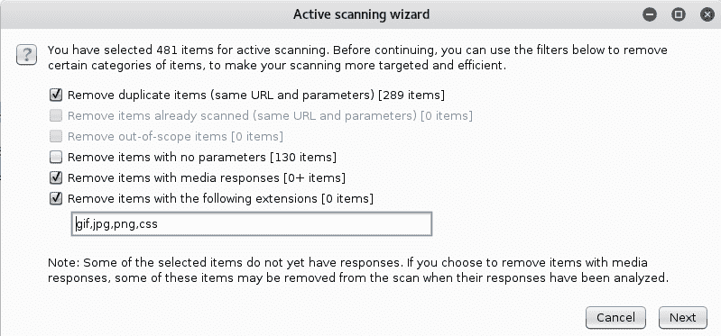

# 第四章：关于使用 Burp Suite

你距离成为应用安全测试专家越来越近了。本章将介绍一个令人惊叹的应用——**Burp Suite**。它是进行 Web 应用安全测试的必备工具。我不是要推销这个应用，而是基于我作为 Web 应用渗透测试员的个人经验，给出一个诚实的意见。Burp 是由 PortSwigger Ltd.开发的。我无法足够感谢他们，感谢他们让我们可以测试 Web 应用，确保它们能够抵御各种威胁。

你可能会想，为什么选择 Burp？为什么不选择市场上那些花哨的、昂贵的一键式工具呢？

首先，仅仅因为它们很贵并不意味着它们就是好的；其次，不要盲目跟随 Gartner 图表的排名。当大公司出现在 Gartner 图表的顶部时，它们会提高价格；它们是大企业，想赚取巨额利润。另一方面，Burp 仅需每年 350 美元，提供多种选项（从手动到自动化测试），相比其他大品牌扫描工具每年需花费数千美元。当你从事安全领域工作时，你会对这些工具的高价感到震惊。作为专业人士，我们的工作是帮助客户或公司根据预算选择合适的工具，同时确保提供专业的成果。

假阳性（扫描器标记的虚假漏洞）永远存在，而你的工作就是区分真实的漏洞和虚假的漏洞。在没有理解报告内容的情况下，绝不要复制粘贴任何报告的内容。尝试测试一个漏洞，确保它是真的，然后再将其写入最终报告中。

在本章中，我将尽力覆盖 Burp Suite 的各个方面，包括以下内容：

+   介绍 Burp Suite

+   使用 Burp Suite 的实际示例

+   如何使用 Burp Proxy

+   如何安装 Burp SSL 证书

+   如何爬取 Web 应用

+   如何使用 Burp 查找隐藏项

+   使用 Burp 漏洞扫描器

+   如何使用 Repeater 标签

+   探索 Intruder 标签的功能

+   如何在 Burp 中安装额外的应用

# Burp Suite 简介

Burp Suite 是一个简洁的 Web 应用安全测试平台。这个应用包含了许多工具，组合在一起形成了一个强大的测试工具，能够帮助你测试 Web 应用的每个组件。

在需要检查网站安全强度、会话令牌的可预测性或应用程序中检查点数据有效性时，Burp 将成为关键工具。此外，Burp 还支持详细的手动评估和自动化技术组合，从而进行 Web 应用安全分析的枚举和分析。

Burp 提供两个版本可以下载：

+   Burp Suite 社区版（已预装在 Kali 上）

+   Burp Suite 专业版（需要每年许可证，大约 350 美元/年）

总结：Burp 是一个本地 web 代理，允许您手动修改、拦截和检查用户浏览器与目标网站之间的 HTTP/S 请求和响应。在用户手动浏览 web 应用程序时，工具会拦截所有访问页面的必要细节。服务器和浏览器之间的流量可以被分析、修改、可视化，并最终多次重复。Burp 的专业版允许您扫描并发现 web 应用程序的漏洞。

Burp Suite 中包含的不同工具可以在标签区看到（见下图）：

+   目标：该工具允许您以与网站 URL 结构对应的文件夹结构层次来可视化目标应用程序的内容。本节展示了通过手动浏览网站页面所发现的所有内容。

+   代理：这是 Burp 的主要引擎，它允许拦截和修改所有 web 流量。

+   蜘蛛工具：这是一个 web 蜘蛛工具，能够爬取应用程序以定位内容和功能。

+   扫描器：这是一个 web 漏洞扫描工具，能够自动发现多种类型的 web 漏洞（SQL 注入、XSS 和 CSRF）。此功能仅在专业版中提供。

+   入侵者：这是一个强大的工具，用于对 web 应用程序进行自动化的定制化攻击。我称之为 web fuzz 工具；web fuzzing 通常包括向目标应用程序发送意外的输入。这个过程有助于识别 web 应用程序的安全漏洞。

+   重发器：顾名思义，它用于手动修改并重新发送 web 请求。

+   序列器：此工具分析应用程序会话令牌或其他重要数据项的随机性质量，这些数据项应该是不可预测的。

+   解码器：此工具用于编码和解码数据。

+   比较器：Burp Comparer 是一个方便的工具，用于执行任何两项数据（如相似的 web 响应）之间的视觉差异对比。

+   扩展工具：Burp Extender（BApp Store）允许您加载 Burp 扩展，这些扩展通过使用第三方应用程序扩展 Burp 的功能。

# 一个快速示例

在我深入讲解各部分功能之前，最好从一个简单的示例开始，这样您可以快速了解如何使用这个强大的应用程序。 *“不只是说，而是通过实践！”*

这将是一个过于简化的示例，因此我不会进入过多的细节。我希望您理解大致框架。稍后在本章中，您将学习到各个功能的具体细节：

1.  启动 Burp，并在 Kali Linux 中打开浏览器（我已经在 Firefox 中设置了代理设置；稍后我会展示如何设置）。

1.  浏览到 Mutillidae 主页；您会发现页面未加载，这是正常的，因为 Burp 中的代理已拦截请求，并正在等待您采取行动。

1.  切换到 Burp，您将在代理/拦截部分看到 Web 请求。此时，您可以更改请求，但我将仅使用“转发”按钮将其发送到服务器：

1.  当您单击“转发”按钮时，Burp 将请求发送到 Web 服务器。如果您在选项标签中启用了拦截响应的选项，那么您也会看到响应。

1.  默认情况下，响应不会被拦截；如果您想更改此行为，请转到选项标签，并确保以下设置：

前述设置是我每天在 Burp 中进行请求和响应拦截时使用的设置（默认情况下，你会有不同的请求/响应拦截设置）。

1.  接下来做什么？通过单击“转发”按钮，让响应返回客户端。然后，通过单击“拦截已开启”按钮关闭拦截。请注意，通过单击此按钮，Burp 仍然会收集 Web 请求/响应，但它们不会阻止页面加载，并且不会给您拦截和更改内容的机会。

1.  现在我将返回 Mutillidae 网站并尝试登录，然后手动浏览几页，因为我希望 Burp 开始识别此网站的结构。现在，返回 Burp 并单击“目标”选项卡，您应该看到类似以下内容：

1.  看起来 Burp 拦截了我浏览器尝试连接的所有内容，这是正常的，因为我还没有过滤或设置范围。要做到这一点，我将右键单击 Mutillidae 服务器 IP 地址，然后选择添加到范围：

1.  我还没有完成；我们仍然需要清理混乱，只显示站点地图树中的范围内项目。要实现这一点，请单击“过滤器：隐藏未找到的项目”部分，会出现一个菜单。选中复选框以“仅显示范围内项目”：

好了！你已经完成了这个基础教程。在完成所有上述步骤之后，渗透测试员可以做以下事情：

1.  **爬取**Web 应用程序分支

1.  发现**隐藏内容**

1.  **检查**每个页面的 Web 请求/响应

1.  **被动地扫描**Web 应用程序

1.  **主动扫描**Web 应用程序

1.  使用入侵者和重复器标签**执行一些手动测试**

1.  测试**假阳性**的漏洞

1.  生成**报告**

如果您已购买 Burp Pro，则可以通过以下命令在终端窗口中启动它：

` java -jar -Xmx2G /[path]/[burp.jar]`

# 使用 Burp Target 可视化应用结构。

在前一部分中，你看到了如何通过 Burp 在 Target 标签下映射一个应用。在本节中，我希望你了解 Burp Target 的工作原理（以简化的方式），这样你在进行渗透测试时就可以处理工作流程。

Burp Target 工具为你提供了以下功能（我只列出重要的功能）：

1.  使用 Site Map 标签**可视化**应用结构。

1.  使用 Add To Scope 定义目标网站的**范围**。

1.  使用 Spider this branch 对 web 应用进行**爬虫**，以发现更多内容。

1.  使用 Discover Content 功能搜索**隐藏内容**。

1.  使用 Passively Scan this branch 进行**被动扫描**，以识别一些漏洞。

1.  使用 Engagement Tools 菜单列出**评论**、**脚本**和**参考**。

1.  **分析** web 应用目标，使用 Analyze Target 来识别所有动态 URL 和参数。

1.  **发送** **web 请求**到其他工具标签（例如，Repeater、Sequencer、Decoder、Comparer 和 Intruder）。

1.  使用 Actively scan this branch 进行全面的 web 应用漏洞扫描。

1.  使用 Issues/Report issues 为该分支保存**报告**：

如你所见，Target 标签是你使用 Burp 启动所有操作的**控制面板**。你将经常花时间在这一部分/标签上。从前面的截图来看，你可以看到中间部分，所有的**web 请求/响应**都列出了（在 Contents 部分），以便进一步分析。在屏幕的右侧，Burp 显示了 Issues 和 Advisory，帮助你修复每一个缺陷。是不是很棒？

# 使用 Burp Proxy 拦截请求/响应。

Proxy 工具是 Burp 的核心。简而言之，它会拦截你尝试通过浏览器手动访问的所有请求和响应。它作为一个 web 代理服务器工作，位于你的浏览器和目标 web 服务器之间，充当中间人。这使你能够拦截、检查和修改双向传输的原始流量（请求/响应）：

# 在浏览器中设置代理。

我假设你正在使用 Kali Linux 进行 web 应用渗透测试，所以你将使用 Firefox 或 Iceweasel 浏览器。你可以安装 Chrome，但我使用的教程是针对 Firefox 的（如果你使用 Chrome，不用担心，设置应该与 Firefox 非常相似）。

默认情况下，Burp 的端口代理号是 `8080`，可以在 Proxy 标签下的 Options 子标签中进行更改：

打开 Firefox，从菜单中选择“偏好设置”。点击左侧菜单中的“高级”选项卡；之后，选择顶部菜单中的“网络”选项卡，然后点击连接部分中的“设置”按钮。最后，在“手动代理配置”部分输入代理设置（见以下截图）：

+   在完成渗透测试后别忘了禁用代理，否则当你关闭 Burp 时，浏览器将无法加载任何页面。

+   确保“无代理的：”文本框不包含 `127.0.0.1:8080`，否则 Burp 将无法拦截连接。

+   有一个非常简单的快捷方式，可以避免手动进行所有这些更改。你可以使用 Firefox 的 FoxyProxy 插件，试试看！

# BURP SSL 证书

为了最有效地使用 Burp Proxy 与 HTTPS 网站，你需要将 Burp 的 CA 证书安装为浏览器的受信根证书。如果你还没有这样做，配置浏览器使用 Burp 作为其代理，并将 Burp 配置为生成 CA 签名的每个主机证书（这是默认设置）。让我们看看如何在 Kali 的 Firefox 浏览器中安装它：

1.  打开 Firefox 并访问 `http://burp`，然后点击 CA 证书按钮，将其下载到本地的 `Downloads` 文件夹：

1.  下载 CA 文件后，从菜单中打开 Firefox 偏好设置。点击左侧菜单中的“高级”选项卡；之后，选择顶部菜单中的“证书”选项卡，点击“查看证书”按钮。最后，点击“导入”按钮安装你刚刚从 Burp 下载的证书（见以下截图）：

# Burp Proxy 选项

在我之前与您分享的实际示例中，我向您展示了我的请求/响应配置，位于 Proxy/Options 选项卡中。查看一下，并尝试实现它，如果这是你在 Web 入侵测试中需要的内容。

我拦截请求/响应的原因如下：

+   检查请求/响应的内容以进行分析

+   截取请求以覆盖 JavaScript 验证

+   当我需要覆盖服务器发送的任何值（例如，任何头部值）时，拦截响应

一个有趣的配置部分是响应修改（Response Modification），它允许你自动取消隐藏表单字段或移除 JavaScript 表单验证：

# 使用 Burp Spider 爬取 Web 应用

这里的思路很简单：你需要做的就是找到目标范围内 Web 应用的所有页面。有三种方法可以完成这个任务：

+   使用 Intruder 工具手动爬取

+   使用 Burp Spider 自动爬取

+   使用 Discover Content 工具自动查找隐藏项目

# 使用 Intruder 工具手动爬取

在某些情况下，你可能希望使用预定义的字典文件进行手动爬取，若要执行此操作，请按照以下步骤进行：

1.  选择根路径；在我们的示例中，它是 `mutillidae`，因为这是我们开始爬取的起点。接下来，右键点击请求并将其发送到 Intruder 标签：

1.  此时，Intruder 标签将开始闪烁，表示它已经准备好（让我们点击 Intruder 标签）。你首先会看到的是 Target 部分；保持不变，然后继续到 Positions 部分：

1.  在 Positions 子标签中，将攻击类型保持为 Sniper，并在 `mutillidae/` 后面写下任何单词（在我的例子中，我选择了单词 `attack`）。然后，我们需要确保清空所有内容，因此点击 Clear 按钮以删除任何预生成的位置：

1.  然后，选择你刚才写的单词。在前面的截图中，我选择了单词 `attack` 并点击 **Add** 按钮，告诉 Burp 这是我要进行目录模糊处理的地方：

1.  之后，点击 Payloads 标签，并确保 Payload 类型为简单列表。接下来，从 Add from list ... 下拉菜单中选择 Directories – short。现在，你可以点击 Start Attack 按钮，它将启动一个弹出窗口，向你展示结果的进度：

1.  最后，点击 Status 列表头来根据响应状态码对项目进行排序。对于 Mutillidae 应用，我找到了一块有趣的密码区域（见前面的截图）。我将把检查密码目录的内容留给你作为练习：

你可以使用 Repeater 标签，我们将在接下来的部分中探索它，以验证前面的发现。

# 自动爬取和寻找隐藏点

在上一节中，我向你展示了手动寻找有趣目录的方法，你也可以用相同的方法寻找页面。如果你没有时间并希望使用自动化方法，Burp 为你提供了一种简单的方式来扫描你的项目：

1.  转到 Target 标签，在站点地图中，右键点击你的目标项目并从菜单中选择 Spider this branch。此时，Spider 标签将开始闪烁，告诉你它正在进行中；根据应用程序的深度，这个操作执行起来应该不会太长时间。

1.  如果你想检查爬取进度，去 Spider 标签并选择 Control 子标签，你应该能看到那里的进度：

1.  Burp 中还存在一种更强大且耗时的工具，可以查找隐藏的文件和目录。对于这个工具要小心使用，因为它很具侵略性，有时会导致网站发生故障。如果你使用它，请请求开发团队备份数据库，以防事情朝着错误的方向发展。

1.  要查找隐藏内容，请右键单击目标/站点地图部分中的 `Application` 目录。从菜单中选择 Engagement tools；然后，单击 Discover content 菜单项。执行此操作后，将出现一个弹出菜单。要运行它，您只需单击 Session is not running 按钮，高级爬行将开始执行：

# 使用扫描程序查找 Web 漏洞

对于有效的 Web 应用程序渗透测试，您需要进行手动测试和自动化测试。如果您只执行其中之一，那就不对了。这一直是一个争论的话题，有时我看到团队依赖花哨的自动化工具，因为他们缺乏手动测试的知识。另一方面，我见过自负自大的团队；他们认为手动测试是为精英人士准备的，认为这些测试应该足够了。我的理念是您两者都需要。在本节中，我将向您展示扫描漏洞的自动化方法。手动方法将在即将到来的章节中介绍。

在 Burp 中，第一种扫描类型是被动扫描，它涉及分析 HTTP 消息以查找某些类型漏洞的证据。它不会向服务器发送任何额外的请求。当您手动浏览时，可以通过右键单击站点地图上的目标范围来触发它。然后，从菜单中单击 Passively scan this branch。

第二种扫描技术是真正自动化模糊测试以查找 Web 应用程序漏洞的技术：

1.  要执行它，只需右键单击您希望测试的目录，然后从菜单中单击 主动扫描此分支。执行此操作后，将出现一个弹出菜单。通常，我使用您在以下截图中看到的选项：

1.  单击下一步，第二步将显示将在此过程中扫描的文件列表。查看它们，然后单击 OK 按钮开始扫描：

1.  要查看此事件的进度，请选择扫描器选项卡，然后单击扫描队列子选项卡。首先，您将看到扫描程序已开始查找漏洞；您可以使用状态列作为扫描进度的指示器：

1.  稍后，当所有状态都变为已完成状态时，您可以通过双击每个项目来查看结果：

这个对话窗口（见前面的截图）允许你分析 Burp 生成的请求，以便产生错误的响应。稍后，你将使用 Repeater 标签页来再次检查结果，并确保没有假阳性。

1.  最后，是时候生成报告了。为此，请返回 Target 标签页，选择你的目标应用程序根目录（在我们的案例中，它将是`mutillidae`文件夹）。右键点击并从菜单中选择 Issues，然后点击“为此分支报告问题”：

1.  之后，你将看到一些需要填写的对话框；它们非常直接。我通常只是选择默认选项，直到报告以 HTML 格式生成：

在这个阶段，你的角色是识别假阳性。从逻辑上讲，当你看到 Burp 告诉你置信度是**Certain**（大于 90%）时，它是一个真正的漏洞。当置信度是**Firm**时，表示有 60%的可能性不是假阳性，而**Tentative**大概率是一个假阳性。Burp 将缺陷和漏洞称为问题——这是为了确保你理解该应用程序用于识别 Web 应用漏洞的术语。

请不要在没有检查假阳性问题的情况下，直接复制 Burp 报告并交给客户；如果你想有一个良好的声誉，那就不要这么做。我曾看到一些公司直接将缺陷从报告中复制出来——我认出了 Burp 报告中的字体，你可以想象我看到那份报告时的反应。

# 使用 Repeater 标签重放 Web 请求

如其名所示，Repeater 标签允许你手动重复 Web 请求。为什么？是为了检查 Web 响应。大多数时候，你会使用“Send to repeater”菜单项将结果发送到这个部分。之后，只需点击“Go”按钮，你就能重放请求：

以下是我在使用 Repeater 标签时会实施的检查清单：

1.  测试页面的逻辑漏洞

1.  生成报告后检查假阳性问题

1.  更改参数值（例如，测试基于输入的漏洞）

# 使用 Intruder 标签进行 Web 请求模糊测试

Burp Intruder 是一个自动化怪物，它允许你对目标 Web 应用进行枚举、模糊测试并收集数据。在我刚开始使用 Burp 时，我学到的第一件事就是使用 Intruder 工具进行暴力破解登录凭证。我们将在接下来的章节中讨论更多示例，但在这一节，我希望你理解这个工具的基本用法：

# Intruder 攻击类型

对初学者来说，最令人困惑的事情之一就是 Intruder 工具中的攻击类型。我会尽力以实际的方式向你解释它们，这样它们就不会成为你使用这一部分的障碍：

+   **狙击手**：这是最受欢迎的一种，你只能使用*一个*有效载荷。这个类型的有效载荷的一个实际例子就是我们之前看到的，用于模糊测试目录名称。另一个例子是模糊测试查询字符串的值。黑客在 URL 中模糊测试产品编号，以查看哪些产品在上线前有折扣。

+   **攻城锤**：这种攻击也使用*单一*有效载荷，但它允许你将*相同的有效载荷插入所有定义的位置*。一个实际的例子是，当你希望在表单字段和查询字符串中插入电子邮件地址时。

+   **集束炸弹**：这种攻击使用*多个*有效载荷针对每个位置（最多为 20）。换句话说，当一次攻击需要在请求中的多个位置插入不同但*无关*的输入时，就使用这种攻击。最好的解释方式是通过一个实际的例子，也就是*密码凭证攻击*——我最喜欢的那种。所以，你会在一个字段中使用用户名，在密码字段中使用密码。

+   **草叉**：这种攻击使用*多个*有效载荷针对每个位置（最多为 20）。换句话说，当一次攻击需要在请求中的多个位置插入不同但*相关*的输入时（与集束炸弹相反），就使用这种攻击。例如，当你希望在一个字段中插入用户名，在另一个字段中插入其关联的 ID 时。

# 实际示例

到现在为止，你可能已经猜到这个工具能做什么了，但让我拓宽你的想象力，给你更多的例子，让你在使用 Intruder 标签时能够应对自如：

+   枚举用户名

+   枚举账户 ID

+   枚举任何 ID（articleID、BlogID、ProductID 等）

+   枚举文档（PDF、TXT 等）

+   枚举页面

+   枚举目录

+   模糊测试漏洞

+   模糊测试用户名/密码

还有很多其他工具；这只是一个示例，包含了我每天使用的最重要的工具。希望它们也能帮助你。

# 使用 Burp Extender 安装第三方应用

在我开始这一部分之前，我想通知你，我在本章中没有包含 Sequencer、Decoder 和 Comparer 标签。事实上，我故意没有包含它们，因为它们的使用非常直观。在你的日常工作中，你很少使用它们，那么为什么要浪费时间呢？

Burp Extender 是一个重要的标签，它允许你在 Burp 中添加额外的强大功能。例如，如果你想增加扫描过时 JavaScript 库的功能，可以安装模块`Retire.js`，它会为你完成这项工作。每种需求都有相应的工具：WAF、错误、Java、.NET、SQLi、XSS 等。

在开始使用 BApp Store 之前，你需要从[`www.jython.org/downloads.html`](http://www.jython.org/downloads.html)下载**Jython**独立 JAR 包。

Jython 是一个 Java 和 Python 的库，一些应用程序使用这个库，因此它是应用程序正常工作的前提。下载文件后，前往 Extender/Options 标签页，并包含你复制下载文件的路径：

要安装你最喜欢的应用，前往 BApp Store 标签页，选择适合你需求的应用，然后点击安装按钮进行安装。有时候，安装应用需要几秒钟的时间，所以请耐心等待。有些应用会在 Burp 中注入一个额外的标签页，这样你就能同时配置它并管理结果：

我经常使用这些应用，觉得应该分享一份我最喜欢的应用清单：

+   主动扫描++

+   额外的扫描器检查

+   反斜杠驱动扫描器

+   CO2

+   错误消息检查

+   JSON Beautifier

+   随机 IP 地址头

+   Retire.js

+   扫描手动插入点

+   SQLiPy

+   WAFDetect

+   单词列表提取器

如果你看到类似`java.lang.OutOfMemoryError: PermGen space`的错误，你可以通过以下命令启动 Burp 来解决：

`java -XX:MaxPermSize=1G -jar [burp_file_name.jar]`

# 总结

恭喜！你现在已经了解了 Burp 的方方面面。在接下来的章节中，我们将使用 Burp 进行 Web 入侵测试。我邀请你开始练习和使用 Burp，它是你进行每次 Web 应用入侵测试的瑞士军刀。如果你有条件购买许可证，现在就去做吧！它对提升和加强你的 Web 应用黑客技能非常值得。

在下一章节中，我将向你展示 Web 应用漏洞的基础知识：这是一个非常有趣且激动人心的话题，它将帮助你提升和加深你的渗透测试技能。
