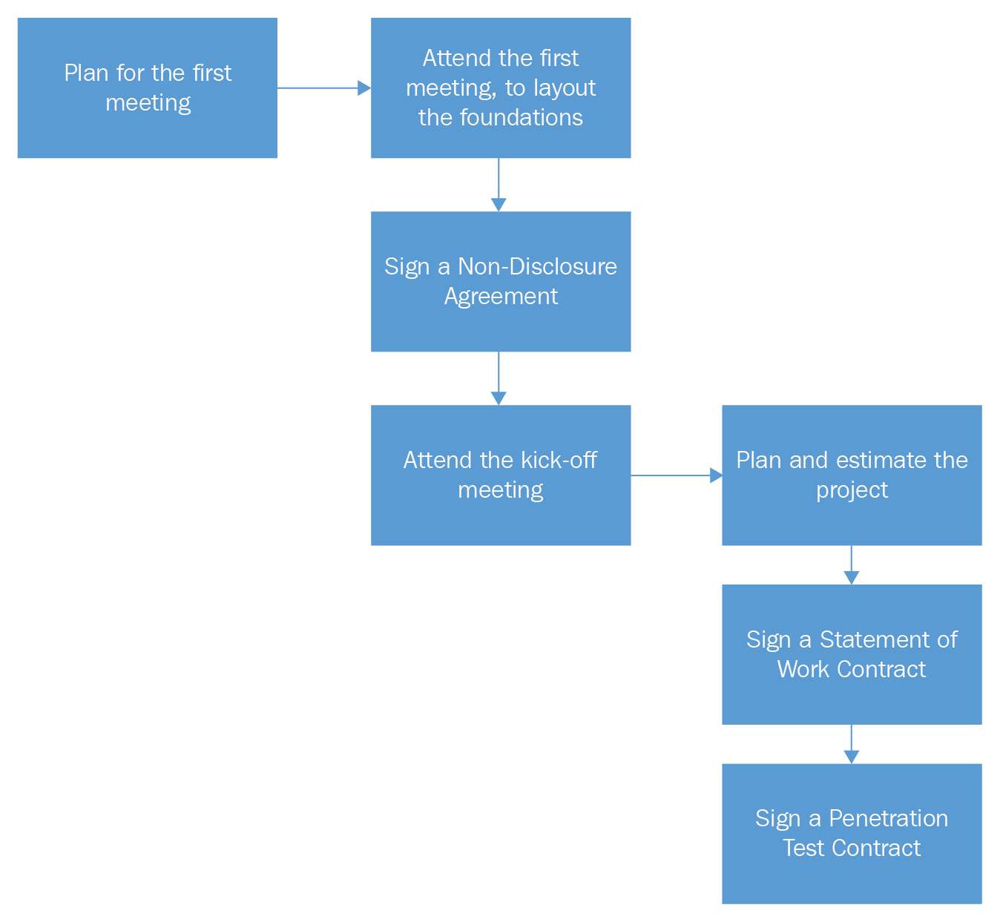

# 第六章：应用安全预先参与

本章将向你介绍应用安全预先参与过程。在开始渗透测试活动之前，有很多事情需要考虑。如果你是自由职业顾问，请准备与当地律师紧密合作，以帮助你成功完成这一阶段，并避免将来对你采取法律行动。如果你是员工并且属于公司安全团队，那么你不需要律师，实际上，你只需要经理的批准。

是的，本章专门针对自由职业承包商，但这并不意味着如果你是员工，你就不需要阅读它。实际上，作为员工，你将始终与承包商打交道，你必须理解他们业务的性质。

这是你开始渗透测试活动之前的计划：



# 介绍

人们认为网络应用渗透测试是一项简单的任务，但事实并非如此，开始测试之前有很多准备工作需要做。网络应用渗透测试的主要活动包括：

+   **源代码审查或静态代码分析**：此活动涉及分析源代码，以识别不良的安全实践。

+   **Web 入侵测试或动态代码分析**：此活动检查客户的网站是否容易受到诸如跨站脚本、SQL 注入等攻击。

+   **基础设施测试**：这将涉及评估和利用（如果可行）Web 服务器和数据库服务器的漏洞。

+   **信息收集**：在此活动中，你将通过互联网资源收集有关客户的信息。此测试将揭示任何数据泄露给公众的情况。

本章将帮助你学习如何在开始测试之前签署所有必要的合同。此外，你还将学会如何在开始测试之前进行估算、确定范围和安排时间。一个精心规划的项目成功的概率最高。你能想象一个工程师在没有计划的情况下建房子吗？你的项目也应该如此！

# 第一次会议

在第一次会议之前，你需要做好准备，以避免出现不专业的后果。确保遵循以下清单，帮助你在会议前成功达成目标：

+   确保记住你将要见面的人的全名

+   提前规划好你的行程，确保准时参加会议，并再次确认日期和时间

+   即使你更喜欢极客的外表，也要穿着专业

+   准备你的材料（例如笔记本电脑）以及任何你愿意与客户分享的宣传单

+   准备好你的演讲，以确保在谈论该主题时听起来专业

+   规划你想要讨论的主题，并根据会议的时间间隔将其写下来

+   访问客户的网站，了解他的业务，并对他的安全意识有个大致了解

+   使用你喜欢的搜索引擎（例如，Google），通过在搜索框中输入公司名称，快速查找有关客户的信息。

# 与客户的会议日期。

如果这是一个老客户，那么此会议将没有意义，在这种情况下，你可以跳过这一步，直接进入下一步——合同准备。

如果你事先做足了准备，研究了我之前提到的步骤，那么这次会议应该对你来说轻松如意。你和团队到达前台后，毫不犹豫地询问与会者的名字。然后，联系人出现，你会带着微笑与他们握手并介绍你的团队成员。进入会议室后，你打开你的笔记本电脑，在此之前你应该已经测试过它。现在该怎么办？别担心！在接下来的列表中，我会展示你需要考虑的所有细节：

1.  向会议上的其他与会者介绍自己和团队成员（包括他们的职务，例如`John Doe`，`市场经理`）。接下来，介绍你的公司：

    +   公司历史。

    +   公司位置。

    +   公司客户。

    +   它的功能（例如，专注于 web 应用程序安全等）。

    +   说一些能引起客户注意的话；例如，如果你的客户从事电子商务业务，可以提到你上一次电子商务测试的成功经验。如果你事先做了功课并了解了客户的兴趣，这项任务应该很简单。

1.  解释你的渗透测试方法（你的团队将支持的测试类型）：

    +   应用威胁建模将为你提供一个渗透测试活动的架构概览。

    +   Web 应用程序基础设施测试将包括以下服务器：Web 服务器和数据库服务器（端口映射、漏洞评估、DOS）。此外，还应涵盖所有与 Web 应用程序基础设施相关的服务器，如 FTP 服务器、邮件服务器、Telnet 服务器和 SSH 服务器。有时，攻破一台服务器可能会导致对整个网络的完全控制，如果目标服务器允许全局管理员权限。

    +   代码审查测试会显示你客户的 web 应用程序源代码中的任何漏洞。

    +   Web 应用程序入侵测试将允许你像黑客一样测试和攻击 Web 应用程序。在测试过程中，讨论你将遇到的漏洞类型非常有趣。例如，你可以谈论 SQL 注入测试以及你公司在测试这些漏洞时所考虑的重要因素。你还可以提到你的团队经过良好的培训，并遵循 OWASP 方法论的国际标准来进行此类测试。

    +   信息收集是一种渗透测试人员使用的技术，通过互联网资源收集关于客户的信息。

    +   报告是一个关键话题，你应该向客户展示并解释你在完成渗透测试后使用的典型报告模板。

    +   提到你将在测试中使用的工具，以展示你的专业水平以及你对发现漏洞的严肃态度。

1.  黑盒测试与灰盒测试与白盒测试：

    +   **白盒测试**：如果客户认真对待测试结果的有效性，应该推荐这个测试。白盒测试将要求客户提供完成测试所需的所有信息。这将包括 Web 应用程序的基础设施图（IP 地址、域名和 URL），包括源代码和任何有助于团队达成目标的信息。如果你能获得所有必要的信息，你的团队将领先于任何攻击者，无论是外部还是内部的。

    +   **灰盒测试**：由于客户的时间和预算考虑，有时这种测试是可以接受的。灰盒测试员会获得有关公司基础设施的有限信息。此测试能够部分覆盖来自外部入侵者或内部员工的攻击。

    +   **黑盒测试**：这个测试不太推荐，但最终还是由客户决定。如果你决定进行此测试，意味着你的团队将无法获得公司基础设施的任何信息。你的团队应像黑客一样进行测试，信息是有限的。你的任务是向客户解释这种测试的副作用，以及拥有全部基础设施信息的重要性。

1.  你需要让客户了解你收取的评估费用，并且合同中将包含所有测试的估算成本：

    +   基础设施测试将根据每台服务器（Web、数据库、FTP 等）收费

    +   代码审查将根据代码行数收费

    +   Web 应用程序入侵测试将根据需要测试的 URL 和页面数量收费

1.  向客户说明接下来的步骤；这应该让他们知道你接下来的计划，首先是签署**保密协议**（**NDA**）以及启动会议。我将在接下来的章节中详细讲解这两个步骤。在会议结束时，告诉客户安排启动会议并确认日期和时间，并提到你会等待他的会议邀请。

1.  与客户讨论信息传输方式。最好是你拥有一个安全的云平台，可以用来与客户交换文件（例如合同）。所有邮件通信应该在必要时进行签名和加密，以保护客户数据，并表明你在安全方面是认真的。

# 保密协议

在这个阶段，您需要在进一步进行之前咨询您所在地区的律师，因为接下来的步骤是启动会议，您和客户之间将交换机密信息。为了保护您的公司和客户，您需要签署 NDA 合同，以保护客户信任给予您的所有交换信息。

要找到 NDA 样本，请查看您所在国家/地区的法律；例如，在加拿大，我们有一个很好的网站`LawDepot.ca`，提供根据您所在省份的法律合同样本的大量选择。

# 启动会议

假设您已经签署了我在前一节提到的保密协议，那么您可以继续进行启动会议。对于您的渗透测试阶段来说，这个事件非常重要，因为它将使您能够了解完整的基础设施以及客户网站支持的功能。在此会议之前，您应该要求客户准备一个与利益相关者一起进行的演示。将整个渗透测试团队带到这次会议上是个好主意，这样他们将更好地理解客户的需求。对客户架构的良好理解是您成功的关键。这次会议可能会更长，这取决于客户的基础设施和网站的复杂性。以下是为了会议成功而需要考虑的一些重要想法：

1.  客户应向您展示一个展示 Web 应用程序基础设施的架构文档。该图应显示**非军事区（DMZ）**网络的高级概述。问清楚所有必要的问题，以理解基础设施的所有内容。确保客户的图表包含

    +   所有服务器；Web、数据库、FTP、Telnet、SSH、邮件

    +   服务器之间的连接；HTTP/HTTPS/VPN

    +   该图应显示面向互联网的服务器与内部网络的服务器

    +   它应显示所有安全基础设施，包括：非军事区（DMZ）/防火墙/入侵检测系统（IDS）/入侵防御系统（IPS）/虚拟专用网络（VPN）/Web 应用防火墙（WAF）/路由器/交换机

1.  客户应向您展示 Web 应用程序的功能，其中应包括以下几个方面：

    +   客人区域，每个人都可以访问

    +   已认证区域，只有经过认证的用户可以访问

    +   管理区域，只有管理员可以使用

1.  尝试确定 Web 应用程序是否与本地 Web 服务和第三方 Web 服务进行交互。

1.  客户的网站架构师应在会议期间出席，以展示应用程序源代码架构。在此会议中，您还应识别所有后端和前端技术，如 ASP.NET 或 Java 用于后端，以及 JavaScript / JQuery / Angular 用于前端。

1.  在会议结束时，你需要要求客户通过安全渠道发送会议中展示的所有图表（或使用安全的 USB 交换），因为你将需要它们进行以下操作：

    +   估算项目的成本

    +   估算项目范围

    +   估算测试计划

    +   签署并填写正式合同

    +   准备应用程序威胁建模文档

# 时间和成本估算

时间估算至关重要，这将向客户证明你在提供服务方面的高效性和专业性。你也不想浪费客户的时间和金钱。如果你想高效地估算项目时间，你需要考虑多个因素。

+   顾问的经验非常重要，因为高级顾问可能需要 5 小时完成一次渗透测试，而初级顾问可能需要 10 小时来完成相同的测试。

+   在估算项目时，始终增加 15-20%的风险。

+   启动会议是时间估算中最重要的部分。此次会议将揭示你在测试过程中可能遇到的大部分障碍。

假设你已经完成了启动会议，并且客户已提供以下架构图：


此外，在启动会议期间，我们的应用程序安全专家在客户网站的展示过程中做了笔记（[www.clientdomain.com](http://www.clientdomain.com)）：

| **页面复杂度** | **页面数量** | **估算** | **备注** |
| --- | --- | --- | --- |
| 非常高 | 10 | 16 小时/页 = 160 小时 | 关键页面，涉及资金交易/管理页面 |
| 高 | 20 | 8 小时/页 = 160 小时 | 动态页面，输入控件/查询字符串较多 |
| 中等 | 50 | 4 小时/页 = 200 小时 | 动态页面，输入控件较少 |
| 低 | 15 | 1 小时/页 = 15 小时 | 静态页面 |

接下来，客户的架构师向我们的团队展示了代码源结构以及他们如何实现现有的安全措施。我们的.NET 专业渗透测试员在演示过程中做了些笔记。此举的目的是能够发现测试人员可能遇到的复杂问题，并避免在测试过程中出现意外：

| **项目** | **备注** | **估算** |
| --- | --- | --- |
| 配置 | `web.config`包含未加密的关键数据。此文件需要检查。 | 4 小时 |
| 关键数据配置 | 数据库保存信用卡和凭证，但未考虑最新的安全最佳实践。 | 8 小时 |
| 日志记录 | 异常堆栈跟踪保存到数据库中。此信息应进行审查。 | 4 小时 |
| 技术问题 | 客户没有使用最新的.NET 框架最佳实践。 | 不适用 |
| 需要手动测试的关键类 | 150 个类需要手动评估。 | 2 小时/类：300 小时 |
| 代码行数 | 约 10,000 行代码 | 1 天 – 8 小时 / 每千行代码：80 小时 – 10 天 |

在阅读并分析前面的基础设施图后，我们的渗透测试员在会议期间编写了以下表格：

| **服务器类型** | **地址** | **估算** |
| --- | --- | --- |
| Web – IIS Server 8.0 | 10.100.100.100 | 3 天 – 24 小时 |
| FTP – Microsoft Server 2012 | 10.100.100.100 | 3 天 – 24 小时 |
| Telnet – Microsoft Server 2012 | 10.100.100.100 | 3 天 – 24 小时 |
| DB – MS SQL Server 2012 | 10.0.0.201 | 5 天 – 24 小时 |

最终，我们的团队能够对项目进行全球估算，并能够在工作声明中向客户提供以下费用：

+   **Web 应用入侵测试**：160 + 160 + 20 + 15 = 355 小时

+   **代码审查**：4 + 8 + 4 + 300 + 80 = 396 小时

+   **基础设施**：3 + 3 + 3 + 5 = 14 小时

+   **应用威胁建模**：16 小时

+   **信息收集**：9 小时

+   **总计**：790 小时

这将给出以下最终估算结果：

| **项目** | **编号** | **持续时间** | **费用 100$/小时** |
| --- | --- | --- | --- |
| 网站入侵测试 | 1 个网站 | 355 小时 | 35,500$ |
| 服务器基础设施测试 | 2 台物理服务器 | 14 小时 | 1,400$ |
| 应用威胁建模 | 1 份文档 | 16 小时 | 1,600$ |
| 代码审查 | 10000 行代码 | 396 小时 | 39,600$ |
| 信息收集 | 无 | 9 小时 | 900$ |
| 总计 |  | 790 小时 | 79,000$ |

您可能会看到这些数字并说：“这太贵了！”根据我的经验，我可以告诉您，扫描仪会生成很多假阳性结果；您的任务是识别它们，这需要花费大量时间。如果您想将扫描仪生成的报告交给客户，那就是不专业。优质的工作需要时间和金钱。

# 工作声明

本文件是您作为渗透测试员开始工作的一份正式协议。该文件的目的是定义：

+   客户期望

+   工作范围

+   工作进度安排

+   定价

+   所有渗透测试结束时的可交付成果

+   付款条款

+   法律协议

+   最终，签名

当然，如果您认为这些信息不足，可以添加您自己的内容。根据您的喜好和经验进行调整。以下是工作声明合同的示例。

**工作声明 – Web 应用渗透测试**：

```
For [Client Company Name] [Date]
```

**内容**：

1.  描述

1.  期望

1.  范围

1.  时间表

1.  定价估算

1.  可交付成果

1.  付款条款

1.  协议

1.  签名

**描述**：

[贵公司名称]将承担所有必要任务，以帮助客户满足其 Web 应用程序的机密性、完整性和可用性业务要求，旨在实现为客户交付结果和良好服务的业务目标。

[贵公司名称]将为[客户公司名称]提供 Web 应用程序渗透测试服务。此服务将涵盖所有必要的安全测试，确保[客户公司名称]的网站得到保护。[贵公司名称]将前往客户现场，进行所有渗透测试活动，并尝试通过利用所有已发现的漏洞来测试所有的假阳性。

在安全测试结束时，[贵公司名称]将向[客户公司名称]呈交一份专业报告，展示其 Web 基础设施中的所有残留漏洞。[贵公司名称]将确保报告清晰简洁，符合客户的需求。

**期望**：

+   在开始每次测试之前，[客户公司名称]将签署一份渗透测试协议。这份协议将授权[贵公司名称]进行每次适当的安全测试。

+   [贵公司名称]将在客户公司提供一个房间，用于进行渗透测试。该房间应为私人且封闭，以确保机密性。顾问应被允许使用洗手间。客户应确保每位渗透测试员都有访问卡，以便进入客户公司设施。

+   [贵公司名称]将获得所有必要的文件和信息，以便顺利进行渗透测试。

+   [客户公司名称]应始终提供一名主要联系人，以协助渗透测试员解决他们在完成任务过程中遇到的任何问题。

+   [贵公司名称]提供的服务旨在提升客户的安全态势。这些服务无法消除所有风险，无论是来自未经授权的还是授权方对环境的影响。

+   [客户公司名称]应理解，安全测试活动可能由于使用测试工具的激进性而无意中导致服务中断。[贵公司名称]不对任何服务中断负责。

+   [客户公司名称]将同意支付任何额外的服务费用（例如培训）。

**范围**：

本项目将包括多名渗透测试员，他们将确保测试 Web 应用程序及其基础设施。[贵公司名称]将提供所有必要的工具和专业知识以进行渗透测试。

[贵公司名称]将尝试使用以下方法进行渗透测试：

+   **应用威胁建模**：一旦[贵公司名称]与客户完成启动会议，[贵公司名称]将准备一份《应用威胁建模架构》文档，并提供给[客户公司名称]，以识别、量化并解决安全风险，在开始渗透测试活动之前。

+   **代码审查**：客户需要确保将源代码副本交给[您的公司名称]以进行安全代码审查（静态代码分析）。[您的公司名称]将使用所有必要的工具来识别导致安全风险的所有不当安全实践。

+   **Web 应用程序入侵测试**：[客户公司名称]将向负责渗透测试的顾问提供所有必要的关于其网站的信息，包括 URLs 和不同账户的凭证。[您的公司名称]将尝试利用在入侵测试中发现的漏洞进行攻击。

+   **基础设施测试**：与[客户公司名称]的 Web 应用程序相关的任何服务器将接受漏洞扫描。将使用工具和技术进行漏洞评估，确保这些服务器不具备风险。

+   **信息收集**：此活动将帮助[客户公司名称]识别任何在互联网上的信息泄露。

+   **报告**：[您的公司名称]将记录之前提到的每个安全测试。[您的公司名称]将提供一份专业报告，帮助客户识别和量化其 Web 应用程序基础设施中的所有风险。

**时间安排**：

上述*服务概述*部分中提到的每项测试预计需要大约 5 个工作日完成。最终报告将在测试完成后约 2 周内提供。[您的公司名称]和[客户公司名称]将在合同签署后的 30 天内确定开始日期。工作日为周一至周五，上午 8:00 至下午 5:00，[客户公司名称]的当地时间，不包括[您的公司名称]的官方假期。

**价格估算**：

[您的公司名称]将完成所有必要的工作以进行安全测试，从而为客户提供更好的安全态势。[您的公司名称]将按照每小时 100$的费用向[客户公司名称]收费。为成功实现这一目标，将提供以下服务：

| **项目** | **数量** | **持续时间** | **成本 100$/小时** |
| --- | --- | --- | --- |
| 网站入侵测试 | 1 个网站 | 355 小时 | 35,500$ |
| 服务器基础设施测试 | 2 台物理服务器 | 14 小时 | 1,400$ |
| 应用程序威胁建模 | 1 份文档 | 16 小时 | 1,600$ |
| 代码审查 | 10000 行代码 | 396 小时 | 39,600$ |
| 信息收集 | 无 | 9 小时 | 900$ |
| 总计 |  | 790 小时 | 79,000$ |

**交付物**：

[您的公司名称]将进行本文件中提到的所有必要的安全测试。所有测试完成后，我们的团队将确保通过安全文件传输方式将报告交付给[客户公司名称]。

**付款条款**：

[客户公司名称]将在收到发票后 30 天内支付[您的公司名称]。在签署本合同后，初期将收取总价的 50%。

**协议**：

[在此部分，您列出您的公司期望与客户签订的所有法律协议，填写此部分时最好请当地律师进行审核。]

**签名**：

[贵公司名称]和[客户公司名称]应同意此文件并在下方签名。

# 渗透测试协议

本合同将列出所有必要的信息，以便您和为您工作的顾问能够进行并执行渗透测试活动。以下展示了包含这些标题的示例合同：

+   合同简要描述

+   您的主要联系人和客户的主要联系人

+   如何交换机密信息

+   不同的渗透测试活动及其详细信息

+   发生不良情况时的责任范围

+   最后，合同签字

**Web 应用程序渗透测试协议**：

```
For [Client Company Name] [Date]
```

**内容**：

1.  描述

1.  联系人

1.  机密信息交换

1.  Web 应用程序入侵测试

1.  代码审查

1.  基础设施安全测试

1.  信息收集

1.  责任范围

1.  签名

**描述**：

本文件描述了[客户公司名称]的应用程序渗透测试活动执行。此文件确定了各方的联系人和机密信息的交换方式。此文件将列出所有必要的信息，以便我们的顾问进行渗透测试工作。

**联系人**：

```
[Your Company Name] Contact: Miss [Jane Doe] Title: Application Security Coordinator Phone: [111222 3333] Email: [email@yourcompany.com] [Your Company Name] Contact: Mr. [Joe Xing] Title: Application Security Manager Phone: [111222 4444] Email: [email@yourcompany.com] [Client Company Name] Contact: Mr. [Don Moe] Title: IT Manager Phone: [111333 5555] Email: [email@clientcompany.com] [Client Company Name] Contact: Mr. [Jenny Doe] Title: Administrative Assistant Phone: [111333 6666] Email: [email@clientcompany.com]
```

**机密信息交换**：

对于机密信息，我们将在云端建立一个安全平台，供[贵公司名称]和[客户公司名称]安全地上传和下载所有完成渗透测试所需的文档。

要访问云环境，请访问：[www.your-secure-environment.com]。

[客户公司名称]将通过安全邮件提供用户名和密码。

**Web 应用程序入侵测试**：

为了成功执行 Web 应用程序入侵测试，[客户公司名称]应将所有必要的信息提供给[贵公司名称]的顾问：

| **网站** | `http://www.yourclientdomain.com` |
| --- | --- |
| **登录凭据** | 将安全发送至云平台 |
| **开始日期** | 2017 年 2 月 1 日 |
| **持续时间** | 355 小时 |
| **约束条件** | 无拒绝服务攻击 |
| **测试工具** | Burp Suite |
| **方法论** | OWASP 指南 |
| **备注** | 不适用 |

**代码审查**：

[贵公司名称]将进行安全代码审查，[客户公司名称]应提供所有必要的信息：

| **应用程序** | `http://www.yourclientdomain.com` |
| --- | --- |
| **代码行数** | 10000 |
| **内容** | 源代码将安全上传至云平台 |
| **开始日期** | 2017 年 2 月 15 日 |
| **持续时间** | 396 小时 |
| **约束条件** | 不适用 |
| **测试工具** | Veracode |
| **备注** | 需要进行一些手动测试 |

**基础设施安全测试**：

[贵公司名称] 将对与 Web 应用程序相关的每个服务器进行所有必要的安全测试。[客户公司名称] 应提供所有必要的信息：

| **服务器** | **Web:** IIS Server 8.0: `10.100.100.100` **FTP:** Microsoft Server 2012: `10.100.100.100` **Telnet:** Microsoft Server 2012: `10.100.100.100` **DB:** MS SQL Server 2012: `10.0.0.201` |
| --- | --- |
| **开始日期** | 1/Jan/2017 |
| **持续时间** | 14 小时 |
| **限制** | 不适用 |
| **测试工具** | Nessus 和 Metasploit |
| **备注** | [贵公司名称] 将等待服务器资产经理的签名 |

**信息收集**：

[贵公司名称] 将利用互联网资源收集关于 [客户公司名称] 的信息。这项活动将帮助 [客户公司名称] 识别互联网上的任何信息泄露：

| **开始日期** | 15/Jan/2017 |
| --- | --- |
| **持续时间** | 9 小时 |
| **备注** | 不适用 |

**责任范围**：

[填写此部分时，最好与当地律师核对]

**签名**：

[贵公司名称] 和 [客户公司名称] 应就此文档达成一致并在下方签名。

# 外部因素

您的客户的应用程序总是有可能与第三方服务和远程基础设施交互。如我之前提到的，您需要律师陪伴，以便为您提供有关测试的建议。您需要向客户询问以下重要问题，关于他们与第三方的合作。

您的客户应用程序是否与第三方 Web 服务交互？如果答案是肯定的，那么您需要获得客户的许可，以便调查第三方的活动。如果客户同意，您需要让他们安排与第三方代表的会议。在与第三方的访谈中，询问以下问题：

+   第三方是否收集有关您的客户的信息？如果是，收集的是什么信息？

+   Web 服务使用的是什么身份验证模式？您需要确保第三方提供了安全的身份验证机制。

+   应用程序托管在哪里？如果应用程序托管在外国，那么您需要检查该国的隐私法规。

+   通信是如何加密的（HTTP 和 HTTPS）？这个问题将确保传输中的信息是保密的。

如果第三方（您的客户供应商）持有您客户的敏感信息，那么您需要深入挖掘并询问以下问题：

+   您是否对您的服务器进行静态和动态安全测试？如果答案是肯定的，那么请向供应商索取这些测试的高级报告。

+   当发布安全补丁时，您如何与客户沟通？

+   您多久发布一个新版本到生产环境？

+   当客户拨打您的支持热线时，您如何处理？在这个问题中，您需要确保支持人员能够以安全的方式识别您的客户。

你的客户的应用程序是否托管在云端？如果答案是“是”，那么你需要请求云服务商的许可进行渗透测试：

+   对于**Amazon AWS**，你可以使用以下链接提交表单：[`aws.amazon.com/security/penetration-testing/?nc1=h_ls`](https://aws.amazon.com/security/penetration-testing/?nc1=h_ls)

+   对于**Microsoft Azure**，你也可以使用以下链接提交表单：[`security-forms.azure.com/penetration-testing/terms`](https://security-forms.azure.com/penetration-testing/terms)

# 总结

我希望你喜欢本章内容，我知道其中没有包含一些令人兴奋的黑客命令，但如果你打算从事这个领域的工作，你应该了解预参与阶段。

让我们总结一下你在本章中学到的内容：

1.  关于你与**客户的第一次会议**

1.  什么是**保密协议**

1.  如何**启动一次会议**

1.  如何估算你项目的**时间和成本**

1.  什么是**工作声明**？

1.  什么是**渗透测试协议**

1.  渗透测试项目的**外部因素**

在下一章中，你将学习到应用程序威胁建模，这对我来说是成功应用安全任务的支柱之一。
