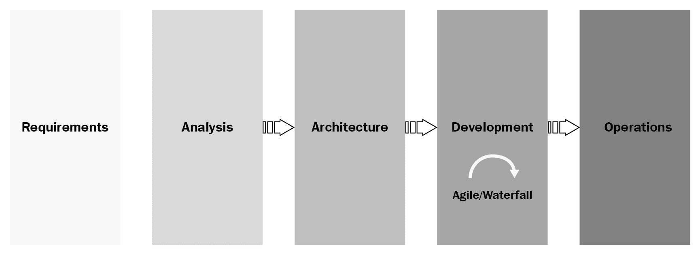
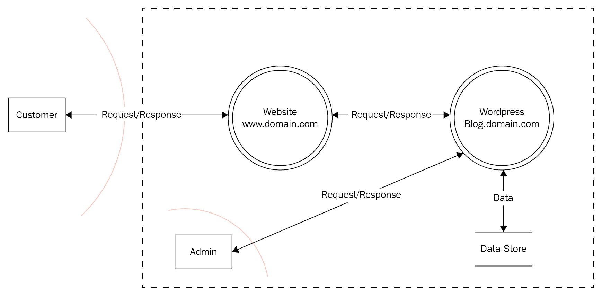
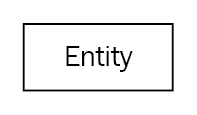
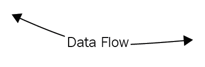
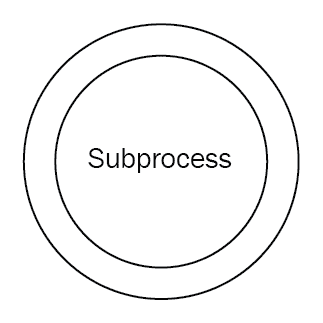
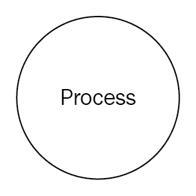
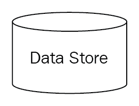
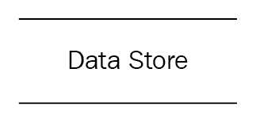
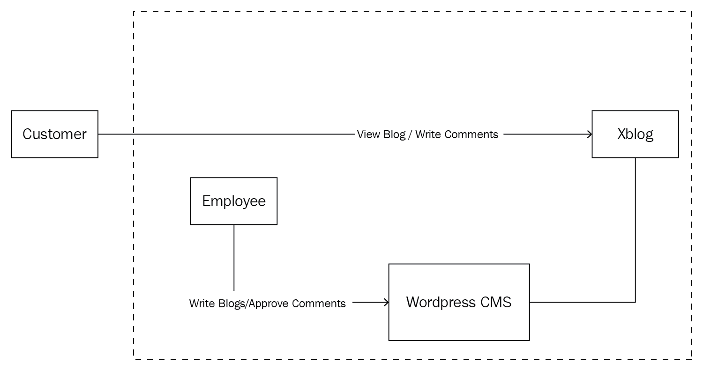
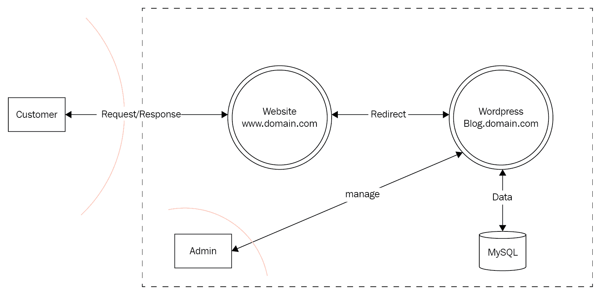

# 第七章：应用威胁建模

我已经为这个话题专门安排了整整一章，因为人们往往低估了**应用威胁建模**（**ATM**）的重要性。如果你是应用安全的员工或顾问，你将总是遇到需要在其产品发布新版本的项目，在它们部署到生产服务器之前，你需要确保对这些项目进行测试。ATM 发生在项目的架构阶段，这时候项目还在初期阶段。事实上，ATM 是一个安全架构文档，它能帮助你识别未来的威胁，并指明在未来部署网站应用程序项目时需要执行的不同渗透测试活动。

下面是这一精彩章节的计划：

+   介绍软件开发生命周期

+   一瞥应用威胁建模

+   现实生活中的应用威胁建模

+   应用威胁建模文档的结构和内容

+   一个应用威胁建模文档的实际示例

本章（以及本书中的许多原则）都可以在**OWASP**网站上找到。我强烈建议你在处理应用安全的日常任务时，时刻关注 OWASP 网站：[`www.owasp.org`](http://www.owasp.org)。

# 软件开发生命周期

每个应用程序都必须经过开发生命周期，然后才能部署到生产环境中。首先，项目团队提出一个新产品（如网站）的构想，该产品将帮助公司赚取更多的钱和客户。这是**分析/架构**阶段，大家围坐在一起讨论新项目的所有挑战。在这个阶段结束时，将产生一份架构文档，并提交给架构委员会，若该项目符合公司政策，委员会将批准它。获批后，项目将进入**开发**阶段，开发团队和质量保证工程师将共同合作，交付产品。经过几轮迭代后，一个稳定版本将准备好部署到生产环境中；团队将测试该应用程序，确保它没有漏洞。如果一切顺利（符合要求），团队将继续推进，并将该网站应用程序部署到生产环境中：

作为一名应用安全专家，你在这个工作流程中扮演着重要角色。在第一阶段的架构/分析阶段，你需要参加会议，了解新应用程序。一旦架构文档完成，你将创建你的 ATM 文档。之后，在开发阶段，你将根据最初编写的 ATM 文档执行所有渗透测试活动（源代码审查、网络入侵测试和基础设施安全测试）。

# 一瞥应用威胁建模

ATM 是一种分析应用程序安全态势的方法，旨在帮助你在开始渗透测试活动之前铺设基础。该文档应在架构阶段解决安全风险，通过在项目进入开发阶段之前识别和量化这些风险。你会看到很多处理威胁建模文档的方法（我推荐的最佳方法是 OWASP 的应用威胁建模文档；自己查看一下，你就会明白我的意思），但根据我的个人经验，我建议你尽可能简化，不要浪费时间过度描述应用程序的安全风险，因为在这种情况下，你实际上是在重复信息安全风险评估文档的内容。将该文档作为指南和头脑风暴工具，用于实现渗透测试活动的目标。

在你开始撰写此文档之前，你需要参加一些会议（项目启动会议），以便了解你将要测试的应用程序。通常，在架构阶段结束时，会生成一份详细的架构文档，这将帮助你最终确定你的工作内容。

# 现实中的应用威胁建模

本章结束时，我将提供一个 ATM 文档的实际示例。如果你觉得我在这里讨论的某些内容不够清晰（过于理论化），我邀请你查看本章末尾的示例。如果你希望你的团队在渗透测试阶段取得成功，那么你必须在渗透测试活动之前编写一份 ATM 文档。让我举一个我每天都能见到的例子。当我使用这种方法时，一个新的项目开始了，**项目经理**（**PM**）联系管理层，寻求应用安全方面的专家，因为他们将要建设一个新的网站。管理团队随后将你分配到这个仍处于架构阶段的新项目。你参加几场会议，以了解项目的内容。很可能，信息安全部门的另一名安全分析师也会被指派参加这些会议，因为他的工作是为同一项目编写风险评估文档。当项目团队准备好后，将通过电子邮件发送架构文档。然后，我可以开始编写我的应用威胁建模文档，并将副本发送给信息安全分析师和项目经理，以便他们将其作为下一阶段工作的指南。请参阅下表，了解每个阶段是如何受到我们干预的影响的。

这张表列出了我在多个大公司中见过的行动清单；你所在的公司可能有不同的方法，但这是我见过的最好的方法：

| **需求** | **架构** | **开发** | **部署前门控** | **生产** |
| --- | --- | --- | --- | --- |

| **培训**：开发人员、开发主管和架构师应接受关于应用安全最佳实践的培训。公司应鼓励 IT 的安全培训。每个团队成员都应了解自己的角色：

- 安全冠军

- 开发主管

- 开发人员

- 质量保证代理

- 项目经理

- 架构师

- 应用安全代理

- 信息安全代理

- 架构同行审查团队

- 运营安全

- 部署门控代理 | **架构阶段**：项目团队将邀请**应用安全代理**（**ASA**）参加他们的启动会议。通过参加这些会议，ASA 将发现设计中的任何缺陷，并可以就应用安全提出建议。**应用威胁建模**：最终，ASA 应编写一份应用威胁建模文档，该文档将与**信息安全代理**（**ISA**）编写的安全风险评估一起保存。 | **沟通**：在开发阶段有一些重要的关键角色：**安全冠军**：通常是开发主管，此人将与应用安全代理沟通，以修正静态/动态代码分析中的缺陷。误报总是存在的，因此 ASA 的角色是帮助冠军区分好的缺陷和坏的缺陷。安全冠军将确保他/她的团队遵循安全编码的最佳实践。**QA**：质量保证代理应该知道谁是 ASA，因为他们将需要彼此确定预生产环境何时准备好进行测试。 | **入侵测试**：在部署到生产环境之前应执行手动入侵测试。在开发阶段执行的自动化测试不足以解决任何隐藏的基于 Web 应用程序的漏洞。**代码审查**：应进行手动静态代码分析，ASA 应该足够专业，不依赖自动化工具发现漏洞。**基础设施测试**：将针对将部署应用程序的 Web 服务器执行网络漏洞评估，以发现和评估现有的漏洞。**信息安全**：ISA 将获得测试结果，并将与高级管理层沟通，签署与部署 Web 应用程序相关的任何风险。 | **运营安全**：**运营安全代理**（**OSA**）将了解新应用程序的部署，并将审核 ASA 和 ISA 编写的所有安全文档。 |

| **需求**：应为开发人员提供安全编码标准。这份文档应该在开发人员加入公司后的第一天就交给他们。拥有这份文档将减少后期开发生命周期中的安全漏洞。 | **同行评审**：在每个人完成自己的工作并且我们拥有正式的架构文档以及之前提到的安全文档后，同行评审委员会将验证一切是否符合公司政策。 | 通常，QA 将为 ASA 提供测试凭证和测试的 URL。**PM**：项目经理将与 ASA 沟通工作时间表，并解决任何可能延迟项目部署的障碍。 | **门控**：部署门控代理将在允许项目进入生产之前检查是否执行了安全测试。部署门控代理将与 ISA 和 ASA 通信，以验证一切是否正确完成。 | **健康检查**：OSA 将确保应用程序定期测试（至少每年一次）。测试应涵盖三个类别：源代码、入侵测试和基础设施测试。 |
| --- | --- | --- | --- | --- |

ATM 文档的一个大优点是，它能让我在执行测试时记住项目的整体内容。实际上，在架构阶段和项目部署到生产环境之间会有数月的延迟。通常，你并不是只处理一个项目，由于将要遇到大量的测试，这份文档将成为你的参考，帮助你记住项目开始时发生了什么。

# 应用威胁建模文档部分

ATM 文档包含多个部分。事实上，这份文档可能长达 40-70 页。理解每个部分对于成功完成项目至关重要。我知道我之前告诉过你要保持文档简洁，但也不能简化得过头；你不应该遗漏 ATM 文档中的重要细节。

所以，这里是 ATM 文档应包含的最重要部分的列表：

+   数据流图

+   外部依赖

+   信任级别

+   入口点

+   资产

+   测试策略

+   安全风险

# 数据流图

我把这个标题**数据流图**（**DFD**）放在开头是有原因的，因为这是我最喜欢的部分，我会将其作为 ATM 文档中的参考。数据流图将通过提供网页应用程序各个部分的可视化表示，帮助我们更好地理解应用程序。DFD 的重点是数据如何从用户端流动，直到到达其最终目的地（例如数据库或文件系统）。通常，我使用在架构阶段你已经收到的架构文档（该文档应包含应用程序的架构图）来开发数据流图：

从前面的图示可以看到，应用程序安全社区在设计 DFD 时使用了多种形状：

+   **外部实体**：此形状表示与应用程序交互的实体（例如，客户、员工、经理等）：

+   **权限边界**：权限边界形状用于表示数据在系统不同区域流动时，权限级别的变化。它由红色虚线表示（参见前面的 DFD 示例）。

此外，我使用虚线矩形形状将一组项目的边界进行分组（例如，公司内部的边界）。

+   **数据流**：数据流形状表示数据在应用程序内部的流动。数据流动的方向由箭头表示：

+   **子流程**：此形状用于表示一组子流程。当你知道任务可以在另一个数据流图（DFD）中分解成子流程时，使用此形状：

+   **过程**：过程形状表示在应用程序内部处理数据的部分。实际上，我大多数时候使用子流程形状，但这是我的方法，你不必强迫自己按照我的方法（有时跳出常规，不受形状束缚是件好事）：

+   **数据存储**：数据存储形状用于表示数据存储的位置（例如，文件和数据库）。我通常使用以下形状：

我也使用这个形状（OWASP 风格）：

以下是我自己总结的一些规则，用于成功绘制 DFD 图：

+   保持简单（不要加入过多细节），但也不要忽视重要的细节

+   要有艺术感，不要仅仅成为社区设计的奴隶，你也可以有自己的设计（如果你有经理，可以与其讨论这个问题）

+   该图应该是自解释的，即使你在一年（或更长时间）后再看，也能轻松理解。

# 外部依赖项

这个形状有时会令人困惑，因为它的名称。外部依赖项通常是与网络应用程序交互的项目。这里的例子不胜枚举，但以下是你最常遇到的几种：

+   网络服务器厂商/操作系统（例如，IIS、Apache 和 Linux Redhat）

+   数据库服务器操作系统及版本（例如，MSSQL、MySQL、Oracle 和 Windows Server 2016）

+   防火墙及其版本（例如，Palo Alto 防火墙）

+   网络服务服务器（例如，IBM Datapower）

+   外部供应商的网络服务/云服务（例如，MS Azure、Amazon 和云服务）

在*外部依赖*部分中不要列出所有详细信息，如思科交换机或路由器；你明白的。

# 信任级别

信任级别代表应用程序将授予与其交互的任何实体的访问权限。例如，如果 Web 应用程序将其数据存储在数据库后端，那么问问自己：谁与数据库交互？简单的答案可能是数据库管理员、数据库读取用户和数据库读/写用户。你应该对每个与 Web 应用程序交互的项目提问这个问题（例如，Web 服务、文件系统、日志等）。

# 入口点

入口点是潜在攻击者与应用程序交互的方式（读/写数据）。示例可以是任何网页或 Web 服务端点。如果你有一座房子，这就代表着房子的任何门窗，允许小偷进入并偷取东西。

# 资产

资产是黑客可能感兴趣的应用程序的不同部分（也称为威胁目标）。大多数时候，攻击者关注的是数据，但这里还有一些你可以在开发该部分时使用的更多示例：

+   读取用户数据（例如，密码、信用卡、个人信息）

+   执行未经授权的功能（例如，添加新用户和删除账户）

+   访问未经授权的系统（例如，通过终端窗口访问数据库、访问 Web 服务器文件系统）

+   不同系统的可用性（例如，针对 Web 服务器的 DOS 攻击）

# 测试策略

你的 ATM 文档应该包括在部署到生产环境之前，你将执行的不同安全测试。你需要向项目方解释你为何进行这些测试，以及这项任务所需的必要细节。例如，你需要指定测试环境（开发、预生产或生产）。另外，你是否需要凭证进行测试？如果需要，多少个凭证？（例如，管理员或访客。）

# 安全风险

ATM 文档并不是风险评估的替代品，但它是一个指导，帮助你仅关注高层次的应用程序安全风险。

始终提出以下问题，以快速了解整个应用程序的风险级别：

+   应用程序是否处理任何机密数据？Y/N

+   应用程序是否会向后端写入数据？Y/N

+   是否对公司的公共形象有影响？Y/N

+   是否对公司客户有影响？Y/N

+   应用程序是否可以从互联网上访问？Y/N

+   应用程序是否可以从移动设备访问？Y/N

+   应用程序是否与第三方服务交互？Y/N

+   应用程序是否由第三方开发？Y/N

等一下，还有更多——这只是一个总体问卷，可以帮助你入门。接下来，你需要使用**STRIDE**方法对攻击者的目标进行分类，STRIDE 代表：

+   **欺骗**：当黑客窃取受害者的凭证/会话时

+   **篡改**：威胁通过操控静态数据和传输数据来完成

+   **否认**：当我们无法追踪是谁做了什么时，就会发生这种情况

+   **信息泄露**：这种威胁使黑客在未授权的情况下揭露机密信息

+   **拒绝服务**：目标是使系统无法为客户使用的威胁

+   **特权提升**：针对远程系统获取管理员权限的威胁

然后，我们针对每个安全威胁，使用**DREAD**方法为其打上风险排名点。

这里是一个简单的**DREAD**排名说明：

+   **损害**（影响？）

+   **可重现性**（有多容易？）

+   **可利用性**（所需时间和努力？）

+   **受影响的用户**（有多少用户，包括客户和员工？）

+   **可发现性**（容易发现吗？）

计算时，你需要为每一项打分，分数范围为 1 到 10，其中 1 表示低，10 表示高。然后，将所有分数相加，再除以五，得到平均值。别担心，稍后你将看到一个实际示例；目前，先尝试理解大概概念。

使用 DREAD 评分/评级的方式很简单；下表讲述了这一过程：

|  | **名称** | **高 (8-10)** | **中 (4-7)** | **低 (1-3)** |
| --- | --- | --- | --- | --- |
| D | 损害 | 攻击者可以颠覆安全系统；上传内容；获取远程 Shell；以管理员身份运行。 | 泄露一些机密信息。 | 泄露非机密信息。 |
| R | 可重现性 | 可以在短时间内重现。 | 在某些情况下可以重现。 | 很难重现攻击。 |
| E | 可利用性 | 一个脚本小子可以利用该漏洞。 | 需要一些技能才能利用该漏洞。 | 需要高度先进的技能才能利用该漏洞。 |
| A | 受影响的用户 | 超过 1,000 名客户受到影响。 | 介于 100 到 1,000 名客户受到影响。 | 少于 100 名客户受到影响。 |
| D | 可发现性 | 可以使用简单工具轻松发现。 | 发现漏洞需要一些技能。 | 发现漏洞非常困难。 |

一些人喜欢使用信息安全公式来计算安全风险：

*风险 = 可能性 x 影响*

# 实际示例

我们的实际示例基于 XYZ 公司。XYZ 的营销团队希望添加一个博客页面以吸引更多客户，并且他们想将这个项目命名为 xBlog。你参加了几次启动会议，现在，他们终于把架构文档发给你了，里面有以下图表：

根据此图，客户（用户）可以从任何地方访问博客，并可以添加评论（客户的身份验证过程不在本范围内，因为客户将通过公司网站的主页进行身份验证）。另一方面，XYZ 的员工可以通过 WordPress CMS 添加博客或批准客户评论。很简单，对吧？作为应用安全专家，你的工作是在架构评审委员会之前提交 ATM 文档给项目团队；让我们开始吧！

# xBlog 威胁建模

与[公司名称]的目标合作，旨在保护其数字信息资源的安全，了解与正常业务运营中使用[xBlog]应用相关的安全风险和威胁，对于[公司名称]的管理层至关重要。

本文档包含使用应用威胁建模技术的安全评估报告。我们将评估[xBlog]应用，以了解可能对[公司名称]业务运营产生影响的安全风险。

# 范围

本文档仅适用于[公司名称]的[xBlog]应用。[xBlog]应用物理位置位于[公司名称]的设施中。

# 威胁建模

[要在这里定义威胁建模，请参考本章节的*应用威胁建模概览*部分。]

# 项目信息

在本节中，我们将添加[xBlog] web 应用的描述。下表旨在识别该项目的全貌，并识别将与之互动的用户：

| **应用版本** | [xBlog v1.0] |
| --- | --- |

| **描述** | [xBlog]应用是一个新应用，旨在服务于[公司名称]的客户，允许他们阅读博客及其评论。博客[`blog.domain.com`]将使用 WordPress CMS 单独托管。一个本地管理员可以通过添加新文章和管理博客评论来管理博客。该应用将由两类用户使用：

+   客户

+   WordPress 管理员

|

| **文档拥有者** | 古斯·卡瓦贾 |
| --- | --- |
| **参与者** |

+   约翰·多（解决方案架构师）

+   简·多（项目经理）

+   埃利奥特·多（信息安全总监）

|

# 数据流图

[要在这里定义数据流图，请参考本章节的*数据流图*部分：]

# 外部依赖

[要在这里定义外部依赖，请参考本章节的*外部依赖*部分：]

| **ID** | **描述** |
| --- | --- |
| 1 | 网站[`www.domain.com`]由 Cisco 防火墙保护在 DMZ 区域，唯一可用的通信方式是 TLS。 |
| 2 | 网站[`www.blog.domain.com`]使用 WordPress，并通过 Cisco 防火墙保护在 DMZ 区域。唯一可用的通信方式是 TLS。 |
| 3 | WordPress 的管理页面 [`wpadmin.blog.domain.com`] 可通过 HTTPS 链接在内部访问。 |
| 4 | [`www.domain.com`] 的 Web 服务器正在使用 Microsoft IIS 和 Windows Server 2016，并安装了最新的安全补丁。（请参阅内部网 [rs66988_nessus.pdf] 上的 Nessus 报告。） |
| 5 | [`www.blog.domain.com`] 的 Web 服务器正在使用 Apache 和 Ubuntu Server 2016，并安装了最新的安全补丁。（请参阅内部网 [rs56389_nessus.pdf] 上的 Nessus 报告。） |
| 6 | 数据库正在使用 MySQL，并存储在与 Web 应用程序相同的服务器上。（请参阅内部网 [rs56389_nessus.pdf] 上的 Nessus 报告。） |
| 7 | 客户将通过位于网站菜单上的超链接[`www.domain.com`] 访问博客，该超链接将重定向他们到[`www.blog.domain.com`]。 |

# 信任级别

[要在此定义信任级别，请参考本章的*信任级别*部分：]

| **ID** | **名称** | **描述** |
| --- | --- | --- |
| 1 | 匿名网络用户 | 这是任何试图使用[xBlog] 应用程序的匿名网络用户。这种类型的用户将阅读博客，但由于他们之前没有登录，将无法添加评论。 |
| 2 | 客户 | 客户将使用[xBlog] 应用程序阅读博客并添加评论。客户应登录以添加评论到博客文章。 |
| 3 | WordPress 管理员 | WordPress 管理员将管理网站并批准博客文章。管理员的角色还包括在客户评论上线之前批准客户评论。 |
| 4 | 博客创建者 | 博客创建者将创建一个新博客，管理员将在发布之前批准此博客。 |
| 5 | 数据库管理员 | 数据库管理员是一位 MySQL 专业人士，将确保维护和管理存储 WordPress 数据的数据库。 |

# 入口点

[要在此定义入口点，请参考本章的*入口点*部分：]

| **ID** | **名称** | **描述** | **信任级别** |
| --- | --- | --- | --- |
| 1 | HTTPS | 网站只能通过 TLS 访问。该网站的所有页面也将使用它。 |

+   匿名网络用户

+   客户

|

| 2 | 博客页面 | 这是博客文章列表页面。 |
| --- | --- | --- |

+   匿名网络用户

+   客户

|

| 3 | WordPress 登录页面 | WP-Login 页面将是员工用来登录 WordPress 的页面。 |
| --- | --- | --- |

+   WordPress 管理员

+   博客创建者

|

# 资产

[要在此定义资产，请参考本章的*资产*部分。可选地，您可以将信任级别（用户）作为此表的附加列添加，但我在我的 ATM 文档中大多数情况下不包括它；这是您的选择：]

| **ID** | **名称** | **描述** |
| --- | --- | --- |
| 1 | 博客 | 与博客网站相关的资产 |
| 1.1 | WordPress 访问 | 获取管理员/版主的凭据以访问 WordPress 平台 |
| 1.2 | 网站的可用性 | 使网站对客户或管理网站的员工不可用的能力 |
| 2 | 数据库 | 与保存网站数据的 MySQL 数据库相关的资产 |
| 2.1 | 访问数据库 | 能够本地或远程访问 MySQL |
| 2.2 | 数据库可用性 | 使数据库对用户不可用 |
| 2.3 | 执行 SQL 语句的能力 | 能够执行 SQL 查询来提取或操纵数据库中的数据 |
| 2.4 | 访问审计日志数据 | 访问审计日志查找机密信息 |

# 威胁列表

[要在此定义安全风险，请参考本章的*安全风险*部分。]

# 伪造 – 身份验证

| **威胁描述** | 威胁行动旨在非法访问和使用另一个用户的凭据，如用户名和密码。 |
| --- | --- |
| **威胁目标** | 客户和员工凭据。 |

| **攻击者步骤** | 攻击者可以执行以下操作：

+   通过社会工程学窃取凭据

+   对系统进行暴力破解尝试

+   执行 SQL 注入绕过身份验证或提取用户凭据

+   截取并窃取用户的会话 Cookie

|

| **对策** |
| --- |

+   安全密码策略

+   会话超时

+   针对暴力破解攻击的账户锁定

+   记录失败的尝试

+   针对 SQLi 和 XSS 的验证

+   WordPress 的管理员控制台仅能通过内网访问

|

| **现有对策** | 暂无 - 这是一个新项目 |
| --- | --- |

DREAD 评估如下：

| **DREAD** | **详细信息** | **得分 /10** |
| --- | --- | --- |
| 损害 |

+   获取管理员账户将使黑客能够上传远程 Shell 并控制主机

+   获取客户账户将使黑客只能代其发布博客

| 8 |
| --- |
| 可重现性 | 它可以在中长期内复现。 | 6 |
| 可利用性 | 执行此攻击不需要太多技巧。 | 7 |
| 受影响的用户 | 攻击可以针对单个用户。导出 MySQL 数据库将包括大多数客户和管理员账户。 | 7 |
| 可发现性 | WordPress 的登录页面（管理员身份验证）仅能通过内网访问。因此，发现该应用程序将仅限于内网区域。 | 3 |
|  | **总分** | **6.2** |

# 篡改 – 完整性

| **威胁描述** | 威胁行动主要旨在改变静态或传输中的数据。 |
| --- | --- |
| **威胁目标** | 网站数据。 |

| **攻击者步骤** | 攻击者可以为这种类型的威胁执行以下操作：

+   可以通过 SQL 注入攻击/XSS 攻击来操纵数据

+   内部攻击者可以通过直接访问数据库来操纵数据，而无需拥有正确的权限

+   攻击者可以拦截通信并进行篡改

|

| **对策** |
| --- |

+   WordPress 的管理员控制台仅能通过内网访问

+   数据库无法直接由数据库管理员访问（只能通过 WordPress 访问）

+   通信仅能通过 TLS 进行访问

|

| **现有对策** | 暂无 - 这是一个新项目。 |
| --- | --- |

DREAD 评估如下：

| **DREAD** | **详情** | **得分/10** |
| --- | --- | --- |
| 损害  | 操控数据会损害博客网站及其完整性。 | 7 |
| 可重现性 | 在中长期内可以复现。 | 6 |
| 可利用性 | 执行此攻击需要较高技能。 | 1 |
| 受影响的用户 | 大部分客户可能会受到这种类型攻击的影响。 | 6 |
| 可发现性 | WordPress 中的登录页面（用于管理员身份验证）仅能通过内网访问。因此，发现该应用程序将仅限于内网区域。 | 3 |
|  | **总计** | **4.6** |

# 否定

| **威胁描述** | 旨在执行非法操作的威胁行为，且系统缺乏追踪禁止操作的能力。 |
| --- | --- |
| **威胁目标** | 网站（WordPress）功能。 |
| **攻击者步骤** | 如果应用程序不支持适当的安全日志记录，攻击者可以否认其攻击。 |

| **对策** | 应用程序应：

+   记录所有活动

+   在威胁发生时抛出错误（例如 SQLi 尝试）

|

| **现有对策** | 不适用——这是一个新项目。 |
| --- | --- |

DREAD 评审如下：

| **DREAD** | **详情** | **得分/10** |
| --- | --- | --- |
| 损害 | 一些或少量。 | 2 |
| 可重现性 | 可以随时复现。 | 7 |
| 可利用性 | 攻击者需要一些应用程序日志方面的经验。 | 3 |
| 受影响的用户 | 可能从 1 个用户到超过 100 个用户不等。 | 5 |
| 可发现性 | 攻击者需要了解日志/监控架构。 | 1 |
|  | **总计** | **3.6** |

# 信息泄露——保密性

| **威胁描述** | 将信息（静态和传输中的）暴露给未经授权的人员。 |
| --- | --- |
| **威胁目标** | 应用程序（WordPress）数据。 |

| **攻击者步骤** | 攻击者可以采取以下步骤进行此类威胁：

+   读取传输中的数据

+   从日志中读取数据

+   从错误信息中读取数据

+   博客文章内容可能泄露机密信息

+   黑客可以通过 SQL 注入攻击窃取数据

+   黑客如果直接访问数据库，可以查询数据

|

| **对策** |
| --- |

+   仅使用 TLS 传输数据

+   日志不应包含机密信息

+   错误信息应为通用信息

+   博客文章将在发布前由管理员审核

+   管理员将在发布前审核客户的评论

+   数据库将无法直接由 DB 管理员访问（仅能通过 WordPress 访问）

|

| **现有对策** | 不适用——这是一个新项目。 |
| --- | --- |

DREAD 报告如下：

| **DREAD** | **详情** | **得分/10** |
| --- | --- | --- |
| 损害 | 查看 WordPress 内的数据的损害仅限于公司博客。 | 3 |
| 可重现性 | 可以随时复现。 | 7 |
| 可利用性 | 攻击者需要一些应用程序编程和高级攻击经验。 | 3 |
| 受影响的用户 | 可能从 1 个用户到超过 100 个用户不等。 | 5 |
| 可发现性 | 攻击者需要了解应用程序架构。 | 3 |
|  | **总计** | **4.2** |

# 拒绝服务 - 可用性

| **威胁描述** | 应用程序将暂时无法使用或不可用。 |
| --- | --- |
| **威胁目标** | 应用程序操作。 |
| **攻击者步骤** | 攻击者可以发送大量请求，旨在使网站崩溃。 |
| **对策** | 在应用程序配置文件或 Web 服务器中设置一个阈值。 |
| **现有对策** | 生产服务器负载均衡。 |

DREAD 报告如下：

| **DREAD** | **详情** | **分数 /10** |
| --- | --- | --- |
| 损害 | 网站将无法访问。 | 8 |
| 可重现性 | 可以随时重现。 | 8 |
| 可利用性 | 即便是脚本小子也可以执行此攻击。 | 8 |
| 受影响的用户 | 大约在 100 人至 1000 人以上。 | 7 |
| 可发现性 | 任何人都可以通过 URL 发现该漏洞。 | 9 |
|  | 总计 | **8** |

# 权限提升 - 授权

| **威胁描述** | 旨在获取对资源的特权访问，进而未经授权地访问信息或危害系统的威胁。 |
| --- | --- |
| **威胁目标** | 网络基础设施。 |
| **攻击者步骤** | 在系统认证后，攻击者可以上传远程 Shell 来远程操控服务器。如果存在任何配置或补丁漏洞，黑客可以利用该漏洞提升其权限。 |
| **对策** |

+   服务器也会定期扫描是否缺少补丁和配置

+   监控应用程序以发现任何可疑活动

|

| **现有对策** |
| --- |

+   入侵检测系统

+   智能数据丢失防护系统

+   智能防火墙

+   使用 VLAN 和防火墙进行网络隔离

|

DREAD 报告如下：

| **DREAD** | **详情** | **分数 /10** |
| --- | --- | --- |
| 损害 | 在这种情况下，损害非常大，因为黑客将拥有系统和网络。 | 10 |
| 可重现性 | 如果未实施对策，任何时候都可以重现。 | 10 |
| 可利用性 | 该攻击可以由具备中等技能的黑客执行。 | 9 |
| 受影响的用户 | 大约在 100 人至 1000 人以上。 | 7 |
| 可发现性 | 该漏洞可以在内部被发现，因为管理员控制台无法外部访问。 | 6 |
|  | 总计 | **8.4** |

# 测试策略

信息安全管理下的应用安全团队将进行必要的安全测试，以增强 Web 应用程序的安全性。以下表格中的活动将包括所有需要在安全渗透测试中执行的项目：

| **ID** | **名称** | **工具** | **描述** | **环境** |
| --- | --- | --- | --- | --- |
| 1 | 手动源代码审查 |

+   Veracode

+   Visual Studio IDE for .NET

+   Eclipse IDE for JAVA

| 我们不需要检查源代码，因为该应用程序将使用 WordPress CMS。 | 预生产环境 |
| --- | --- |
| 2 | Web 入侵测试 | Burp Suite Pro | 安全分析员将执行手动和自动化 Web 入侵测试。这将模拟网站可能发生的攻击。 | Pre-Prod |
| 3 | Web 服务模糊测试 | Burp Suite Pro | N/A | N/A |
| 4 | Web 服务器基础设施测试 |

+   Nessus

+   Nmap

| 安全分析员将测试 web 服务器基础设施的安全性，并寻找任何缺失的安全补丁或不安全的设置。 | PROD |
| --- | --- |

# 总结

正如你在本章中看到的，ATM 其实并不难。人们往往低估了这个文档的重要性，但一旦你开始使用它，你就再也停不下来了，因为它有太多好处。要富有创意，不要局限于本章讨论的模板；相反，应该将其作为下一个应用威胁建模文档的指导方针。

任何专业的网站项目都从架构阶段开始，这时你需要展示你的技能，并将 ATM 文档视为一个安全架构文档。你的工作不仅仅是成为一个渗透测试员，这是在安全领域中非常重要的概念。你可以自由地添加你希望的章节，例如监控、日志记录、安全编码、安全控制，或任何你认为在项目初期对开发阶段有帮助的建议。

在下一章中，我们将讨论应用安全中的另一个重要主题：静态代码分析（源代码审查）。我暂时不会详细讨论这一点，我会把发现所有有趣内容的乐趣留给下一章。
