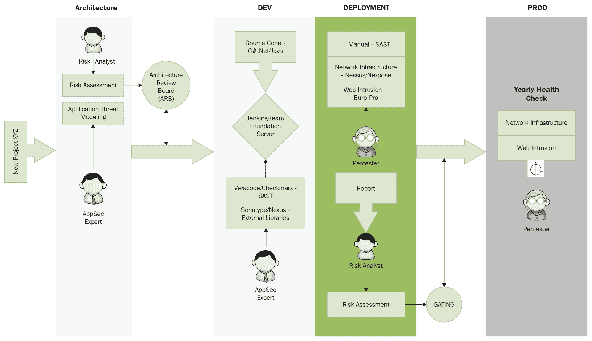

# 第八章：源代码审查

你准备好迎接又一精彩的章节了吗？我假设到目前为止你喜欢这本书，如果是这样，我很高兴。? 本章将教你如何处理源代码审查过程。源代码是网络应用程序的核心或引擎，必须从安全角度正确构建。作为应用安全专家，你的角色是确保开发人员真正遵守安全模式。看到这里，你可能会说，*但是 Gus，我不擅长编程*。你将在本章稍后看到我的回答，但现在，请放心，我会尽力帮助你在职业生涯中取得进展。

静态代码分析是源代码审查的另一种流行词汇。但等等，我还没说完。还有另一个流行词汇，**静态应用程序安全测试**（**SAST**）。这个词汇在应用安全专家中非常常见，特别是当我们处理自动扫描工具（也称为 SAST 扫描器）时。

我将在本章后面详细讲解这个话题，所以继续阅读，避免错过所有有趣且有教育意义的内容。

在这一阶段，我假设你已经完成了应用威胁建模文档，并且理解了网络应用程序的高层次工作原理。确保你审阅了威胁建模文档，了解项目架构（入口点、资产、外部依赖、信任等级和安全威胁）。我在上一章中提到威胁建模是有原因的，因为我想展示你在典型内部项目中使用的逻辑流程。

以下是本章将要涵盖的主题：

+   如何评估你的编程背景

+   理解企业安全编码指南

+   理解手动代码审查与自动化代码审查的区别

+   安全编码检查清单

# 编程背景

在本章继续之前，我必须详细讨论一下你的编程背景，以便帮助你在编程语言方面朝正确的方向前进。在转行做全职网络安全专家之前，我做了大约 10 年的程序员。我可以告诉你，我在编程生涯中获得的经验极大地帮助了我在应用安全领域取得成功。毕竟，如果你从未开发过一个网络应用程序，又怎么能给专家提供建议呢？

编程语言被分为不同类别，它们之间有很多相似之处（比你想象的要多）。稍后在本章中，我将展示网络应用程序的编码安全检查清单，但不指向具体的某一种，因为这个检查清单可以应用于任何网络应用程序编程语言。

这里是你需要了解的最流行编程语言，以及它们所属的类别（再次强调，这些是流行的语言，并非全部）：

+   **Web 应用开发**：Java、C#、.NET 和 PHP

+   **驱动程序和硬件**：C、C++ 和 汇编语言

+   **逆向工程**：汇编语言

+   **数据库**：结构化查询语言 SQL

+   **脚本语言**：Python、Perl 和 Ruby

你真的需要学习所有这些语言吗？是的，有点，但让我简化任务，帮助你轻松应对。首先，从学习一种脚本语言开始。在接下来的章节中，你将遇到一章专门讲解 Python。这门语言将在自动化渗透测试活动中帮助你很多，同时也能帮助你学习编程基础。接下来，你需要学习至少三种语言中的一种：Java、C#、.NET 或 PHP。你还需要通过自己开发 Web 应用来练习这些语言的使用。学习 Web 应用编程的同时，你还将学习 SQL，因为你将与数据库进行交互，这样就能一举两得。汇编语言是一种特殊的低级语言，但如果你学习它，将获得更多的编程技能。作为应用安全专业人员，你几乎不需要处理驱动程序/硬件或恶意软件逆向工程，因此你可以完全排除这些类别。

# 企业安全编码指南

每个企业都需要制定安全政策，以定义其开发团队的最佳安全实践。这些政策之一就是安全编码。你将是这些最佳实践文档（或清单）的守护者，并通过技术的发展不断更新它们。只要可能，安全编码指南应通过公司内部网站与开发人员共享。如果这个文档不存在，作为应用安全专业人员，你的工作是创建一个新的文档并向管理层建议，相信我，他们会非常感激。某些公司鼓励开发人员参加安全编码培训，以使他们参与到这一过程中。你可以参考本章中的*安全编码清单*部分，获取如何为你的公司（作为顾问或员工）制定自己的安全编码指南的思路。

在上一章中，我提到过一个重要话题——SDL。这是一个我希望你掌握并理解其实际运作方式的话题，因为安全编码是 SDL 的前提，在开发普通项目时，安全编码应该贯穿每一个步骤，具体如下：

1.  **架构阶段**：在项目开始时，将定义架构，安全编码实践文档将作为所有技术挑战的参考。

1.  **开发阶段**：在开发阶段，将使用持续集成，并在每次项目在构建服务器上编译时执行。静态代码分析器将在每次构建后自动扫描代码，如果开发者没有遵守安全指南，扫描器很可能会将其标记为缺陷。稍后在本章中，我们将更详细地讨论自动化扫描器。

1.  **部署前**：在部署到生产环境之前，你将执行不同的测试（Web 入侵测试和手动源代码审查）。在这个阶段，你可以重用安全编码指南，以便在面对项目团队成员（Web 应用项目）时，针对他们可能说的“没人告诉过我们这个”的说辞提出反驳。

# 静态代码分析 – 手动扫描与自动扫描

在前面的图片中（在上一节），你可以清楚地看到，当项目准备好部署到典型的安全开发生命周期中时，手动代码审查将被执行。这里我需要你理解的主要思想是，手动扫描发生在自动扫描之后，因此手动代码审查是为了发现自动扫描器未能捕捉到的缺陷。有些人可能会对这个想法提出异议，你会惊讶于你会听到的不同意见——有人可能会告诉你，手动扫描就足够了，不需要扫描器，这种想法过于自负，因为我们是人类，不管多么优秀，我们总会犯错。另一方面，有些人会说扫描器就足够了，但根据他们的经验，总是会有些东西是在运行扫描后才被捕捉到的。你迷失了吗？嗯，答案很简单——你需要两者兼备。

这可能听起来有些枯燥，但我正在尽力分享我在日常工作中见证的事件中，能够帮助你职业发展的重要建议。现在让我们更深入地讨论 SAST 扫描器，因为你将在典型的 SDL 中与它们打交道。我不是在推荐任何产品，但我与 Veracode 有过很多接触，总体来说它是一个不错的产品。我也尝试过 Checkmarx，发现它也非常好。

使用 SAST 扫描器的最佳方式是实施持续集成方法。在完成架构阶段后，程序员将开始开发产品，完成后将其保存并推送到构建服务器（每天完成后）。像 Veracode 这样的扫描器会在构建后立即扫描代码，并标记出新保存的代码中发现的任何漏洞。应用安全分析师将密切审查扫描器的结果，并确保与开发负责人（也称为安全冠军）合作进行漏洞修复。之后，当项目准备发布时，扫描器的待办事项中不应包含任何高危或关键漏洞，以便在手动源代码审查开始前通过评分。|

大多数情况下，在 CI 集成过程中，你将协助项目团队评估误报。安全冠军将在 SAST 门户中提交需求，并等待你的批准，将其标记为误报。扫描工具并不完美，可能会出现许多问题。你的角色是始终支持开发团队，并确保将扫描器本身的任何漏洞报告给产品供应商。|

如果你的雇主要求你评估一个 SAST 扫描器，我建议你查看 Gartner 榜单上最好的扫描器，并自行进行测试。带上多个应用程序并进行扫描。之后，将每个扫描器找到的漏洞与误报进行比较；不要盲目假设 Gartner 选择的扫描器就一定是正确的，而不亲自测试它们。|

# 安全编码检查清单|

我写这本书是为了让你在职业生涯中能够每天使用一本应用安全“圣经”。我希望这本书尽可能包含实际场景，例如本节中提到的检查清单。填充文字不是我的风格——我喜欢行动（快速引用：“没有行动的规划只是空想”），接下来的检查清单包含了直截了当的规则，既可以作为开发人员的安全指南，也可以作为你手动检查源代码时使用的检查清单：|

**身份验证和凭证管理**：|

| ** √ ** | 身份验证凭证必须使用 TLS，而非 HTTP 明文传输。 |
| --- | --- |
| **√** | 除了公开页面外，所有页面必须强制执行身份验证。 |
| **√** | 错误信息（如在登录页、重置密码页和注册页）不应导致信息泄露（例如，在用户名无效的情况下）。 |
| **√** | 必须在服务器端验证身份验证逻辑。 |
| **√** | 身份验证密码必须在安全哈希算法下保存（避免使用 MD5 或 SHA1），并建议使用盐值。 |
| **√** | 密码的哈希逻辑必须在服务器端。 |
| **√** | 在最终用户完成所有数据输入后，验证身份验证数据。 |
| **√** | 如果应用程序与第三方 Web 服务交互，必须确保对这些服务和端点的身份验证。 |
| **√** | 与第三方 Web 服务交互的身份验证凭证应加密，且不得以明文形式存储（检查配置文件；开发人员通常会把它放在这里）。 |

| **√** | 强制执行政策或法规中规定的密码复杂度/长度要求。使用以下常见最佳实践： |

+   至少为 10 个字符

+   至少包含一个大写字母

+   至少包含一个特殊字符

+   至少包含一个数字

|

| **√** | 确保所有密码字段在输入密码时不回显用户密码，并且密码字段禁用自动完成。 |
| --- | --- |
| **√** | 密码重置问题应支持足够随机的答案（例如，*你最喜欢的颜色是什么*是一个糟糕的问题，因为*红色*是一个非常常见的答案）。 |
| **√** | 如果使用基于电子邮件的重置，仅向预先注册的地址发送包含临时*随机*链接/密码的电子邮件（短期有效期）。 |
| **√** | 临时密码必须在下一次使用前更改。 |
| **√** | 当用户更改或重置密码时，通过电子邮件或短信通知用户。 |
| **√** | 在多次登录失败后强制禁用账户（五次尝试是常用限制）。账户必须被禁用足够长的时间，以阻止暴力破解凭证，但又不能禁用得太久，以免造成拒绝服务攻击。 |
| **√** | 在执行关键操作前重新认证用户。 |
| **√** | 对于高度敏感或高价值的交易账户，必须使用多因素身份验证。 |
| **√** | 禁用密码字段的*记住我*功能。 |

**授权与访问控制**：

| **√** | 授权必须在服务器端开发。 |
| --- | --- |
| **√** | 如果应用程序无法访问其安全配置数据（例如，无法连接到数据库），则拒绝所有访问。 |
| **√** | 每个网页请求（例如，Web API 端点）必须存在授权。 |
| **√** | 文件（例如源代码、配置文件）和资源（包括受保护的 URL 和 Web 服务）的访问必须限制为管理员；只有管理员可以访问这些资源。 |
| **√** | 如果授权数据必须存储在客户端，则必须加密该数据。 |
| **√** | 使用`Referer`头作为额外的检查，但要小心不要依赖它，因为它可能被伪造。 |
| **√** | 操作系统/应用服务账户应当具有最小权限。 |
| **√** | 仅授权以下 HTTP 方法：`GET`、`POST`、`PUT`和`DELETE`。 |
| **√** | 提交授权变更到服务器后，确保立即应用这些更改，并强制用户退出应用程序。 |

**会话管理**

| **√** | 会话必须在服务器端进行管理。 |
| --- | --- |
| **√** | 会话标识符（会话 ID）必须是随机的（黑客不应能够预测它）。 |
| **√** | 登出功能应完全终止会话，并且应该在所有已认证的页面上可用。 |
| **√** | 在无操作后设置会话超时。为了正确计算超时周期，你需要计算该资源的安全风险。 |
| **√** | 不要将会话 ID 放入 URL、日志和错误信息中（会话 ID 位于 cookie 头中）。 |
| **√** | 为 cookies 设置 `secure` 属性。 |
| **√** | 为 cookies 设置 `HttpOnly` 属性。 |

**加密**：

| **√** | 任何用于保护数据的加密功能应当在服务器端实现。 |
| --- | --- |
| **√** | 关键数据（例如数据库连接字符串、密码、密钥等）必须加密，不应以明文形式存储。 |
| **√** | 加密密钥必须防止未经授权的用户访问（只有超级管理员可以访问）。 |
| **√** | 所有生成的随机项目——例如数字、文件名和字符串——必须使用高度加密的随机生成器。 |
| **√** | 所有加密算法必须使用最新和最安全的算法。请参考 NIST 组织获取所有所需信息，网址：[`csrc.nist.gov`](https://csrc.nist.gov)。 |

**输入验证**：

| **√** | 所有数据验证必须在服务器端进行。 |
| --- | --- |
| **√** | 在验证之前对数据进行编码。 |
| **√** | 所有验证失败的情况应当在自定义错误信息中被拒绝。 |
| **√** | 验证应当应用于所有后台处理的内容，包括隐藏的表单值、URL 和头信息（不应仅限于表单输入）。 |

| **√** | 危险字符，如 `<>" ' % () & + \ /`，应当进行验证。你还应验证以下内容：

+   空字节 (%00)

+   新行（\r,\n,%0d,%0a）

+   点点斜杠（../ 或 ..\）

|

| **√** | 确保源代码中没有硬编码的 SQL 查询。 |
| --- | --- |
| **√** | 在将输入字符串传递给 `copy` 和 `concatenation` 函数之前，应将其截断到合理的长度。 |

**输出编码**：

| **√** | 所有输出编码逻辑必须在服务器端进行。 |
| --- | --- |
| **√** | 对所有来自不可信数据的输出进行清理，防止 SQL、XML、LDAP 和操作系统命令注入。 |

**日志记录与错误处理**：

| **√** | 不要在错误信息中透露敏感信息，包括调试信息，如堆栈跟踪。 |
| --- | --- |
| **√** | 使用自定义的错误信息和错误页面。 |
| **√** | 日志控制必须在服务器端执行。 |
| **√** | 无论成功还是失败，日志事件都必须被触发。 |
| **√** | 日志数据必须足够清晰，以便能够理解发生了什么。 |
| **√** | 如果日志数据依赖于输入，它必须进行清理。 |
| **√** | 日志记录功能必须集中管理，在同一个类或模块中。 |

| **√** | 确保你记录以下事件：

+   验证失败

+   身份验证尝试

+   授权失败

+   篡改事件（例如，URL 操作用于 SQL 注入）

+   使用无效或过期的会话

+   所有管理功能

+   加密模块失败

+   来自特定国家的访问

+   高频率的网页请求

|

| **√** | 当出现异常时，你需要能够安全退出该功能。 |
| --- | --- |
| **√** | 错误或监控日志不应保存在同一服务器上，以避免 DOS 攻击（通过填满磁盘驱动器的随机数据）。 |

**数据保护**：

| **√** | 临时敏感数据（例如缓存或传输文件）必须存储在安全位置，并且必须尽快清除这些数据。 |
| --- | --- |
| **√** | 删除源代码中的注释，避免泄露有关应用程序的关键信息。 |
| **√** | 确保保护 Web 服务器上的文件，且仅客户端能够访问预定的文件。保护配置文件、备份文件、部署脚本（或任何脚本）、不公开的文档、临时文件和任何包含机密信息的文件。 |
| **√** | 敏感信息不应出现在 URL 查询字符串中。 |
|  | 禁用处理机密信息的页面缓存。使用 `Cache-Control:no-store` 和 `Pragma:no-cache`。 |
| **√** | 传输中的数据必须使用最新最强的 TLS 算法加密。 |
| **√** | 小心使用 *HTTP 引荐*，处理外部域名时特别注意。 |

**杂项**：

| **√** | 确保在部署之前删除测试代码（不用于生产环境）。 |
| --- | --- |
| **√** | 避免在 `robots.txt` 文件中泄露不必要的目录结构。应该创建一个父目录，并将所有隐藏的目录和文件放在其中，而不是在 `robots.txt` 中禁止每个目录/文件。 |
| **√** | 从 HTTP 头中删除任何不必要的信息（例如，操作系统版本、Web 服务器版本和编程框架）。 |
| **√** | 如果出于某种原因，应用程序必须提升其权限，确保尽快恢复权限。 |

| **√** | 在设计 REST Web API 时，除了 200 表示成功和 404 表示错误之外，你有很多其他错误代码的选择。正确的错误代码有助于正确验证传入的请求。以下是为每个 REST API 状态返回代码提供的一些最佳实践：

+   **200 成功**：操作成功。

+   **202 已接受**：创建资源的请求已被接受。

+   **204 无内容**：POST 请求未包含客户端生成的 ID。

+   **400 错误请求**：请求格式错误。

+   **401 未授权**：身份验证 ID 或凭据错误。

+   **403 禁止访问**：经过身份验证的用户没有权限访问该资源。

+   **404 未找到**：请求的资源不存在。

+   **405 方法不允许**：请求中出现了不支持的 HTTP 方法。

+   **429 请求过多**：当检测到 DOS 攻击时，可能会发生此错误。

|

| **√** | 确保以下头部存在： |

+   `X-frame-options`

+   `X-content-type-options`

+   `Strict-transport-security`

+   `Content-security-policy`

+   `X-permitted-cross-domain-policies`

+   `X-XSS-protection:1;mode=block`

+   `X-content-type-options:nosniff`

|

| **√** | 在完成函数并在所有退出点正确释放分配的内存。 |
| --- | --- |

**文件管理**：

| **√**  | 用户必须在上传任何文件到应用程序之前进行身份验证。 |
| --- | --- |
| **√** | 限制可以上传到应用程序的文件类型。 |
| **√** | 通过检查文件头验证上传的文件。仅检查扩展名是不够的。 |
| **√** | 上传的文件应保存在与 Web 服务器不同的服务器上。 |
| **√** | 仔细检查并验证（或在必要时删除）上传的文件，这些文件将由 Web 服务器执行和解释。 |
| **√** | 文件上传服务器必须关闭执行权限。 |
| **√** | 上传文件的服务器必须安装防病毒软件和端点安全。 |
| **√** | 不要传递目录或文件路径；而是使用映射到预定义路径列表的索引值。绝不在响应中发送完整的绝对路径给客户端。 |
| **√** | 网络应用程序的文件和资源必须是只读格式。 |

**第三方库**：

| **√**  | 使用校验和来验证从互联网下载的文件（如库和脚本）的完整性。 |
| --- | --- |
| **√** | 确保在应用程序中下载和使用的库是最新的稳定版本。 |
| **√** | 使用第三方库扫描器（例如，Sonatype，Blackduck）。 |

# 概要

静态代码分析是应用安全的支柱之一，我希望你能轻松理解这一章节。如果因为缺乏编程经验而在理解本章概念时遇到困难，不用担心！这是你深入学习编程的好时机。请参阅本章的*编程背景*部分，了解更多详情。

在下一章中，我们将涵盖所有必要的主题，帮助你从头到尾成功执行网络基础设施安全测试。跟随我，一起深入探索这一令人兴奋的主题吧！
