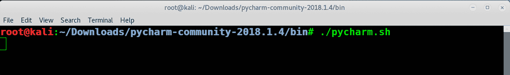
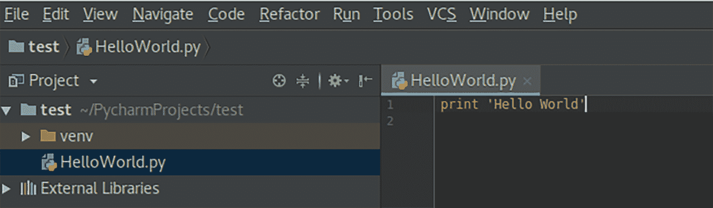

# 第十一章：使用 Python 进行渗透测试自动化

各位，这本书的最后一章到了，我想祝贺你们走到今天这一刻。只有有纪律且有动力的人才能到达终点线，你们每一个人都值得我的尊敬。到目前为止，你们已经学习了许多可以在安全测试中执行的终端命令。然而，在渗透测试过程中你们会发现，很多命令会重复多次，那么为什么不使用像 Python 这样的脚本语言来**自动化**这些命令呢？

在本章中，我将快速演示如何在 Kali 上安装 Python IDE，之后我们将通过实际场景来开发一个使用 Python 的程序。我会带领你完成所有步骤，帮助你开始自动化渗透测试任务，并尽量使用实际示例。

我在*附录 E*中创建了一个完整的 Python 参考部分，快去看看吧。

你准备好开始了吗？首先，让我给你介绍一下本章的内容：

+   学习如何在 Kali 上安装 Python IDE

+   学习如何在 Python 中开发自动化脚本

# Python IDE

你需要一个 Python **集成开发环境**（**IDE**）来开发你自己的脚本。你不一定非要使用 Python IDE，实际上，你可以使用 Kali Linux 中的任何文本编辑器（例如 nano、vim 或 gedit）。然而，如果你希望轻松开发大型脚本，能够调试错误、格式化源代码、可视化输出，并且在应用程序运行之前就能发现错误，使用专业的 IDE 是必不可少的。在本章中，我们将使用一个非常流行且免费的 Python IDE，叫做 **PyCharm**。你可以在[`www.jetbrains.com/pycharm/`](https://www.jetbrains.com/pycharm/)找到它。

你也可以通过终端窗口使用 Python 解释器。假设你有了一个想法，并希望快速测试它。打开 Kali 中的终端窗口，输入 `python`，然后按 *Enter*。让我们看一个例子。我将创建一个名为 `ip_address` 的变量，给它赋值，然后将其打印在屏幕上：


你可以在前面的截图中看到，Kali 默认的 Python 解释器是 2.7.14，实际上，我将在本章使用的也是这个版本。是的，Python 有更新的版本（版本 3），但本书不会涉及。如果你想加深对 Python 的了解，建议你观看一些在线课程，以加快学习进程，并至少购买一本书作为你高级项目的参考资料（另外，别忘了查看*附录 E*）。

# 下载并安装 PyCharm

在本节中，我们将下载并安装 PyCharm 到 Kali 上：

1.  打开浏览器，直接进入下载区：[`www.jetbrains.com/pycharm/download`](https://www.jetbrains.com/pycharm/download)：


1.  一旦你进入下载页面，下载 PyCharm 的免费社区版。下载完成后，你需要右键点击新下载的文件，并选择“解压到此处”：


1.  一旦你解压了归档目录，尝试打开`bin`文件夹，然后执行`pycharm.sh`文件：



执行上述命令后，系统会提示你几个对话框来帮助安装。没什么特别的！你只需要接受协议并使用默认的安装参数。如果改变主意，别担心，你可以稍后修改它们。这样一来，我们就完成了下载和安装 PyCharm 的步骤。

# PyCharm 快速概览

在本节中，我们将尝试使用 PyCharm 执行一个简单的`Hello World`示例，并且我们还将更改其配置以使用 Python 2.7 版本。要运行它，执行我们之前在安装 PyCharm 时执行的`pycharm.sh`命令：

1.  在对话框中，点击“创建新项目”按钮。接下来，选择你想保存项目的位置路径：


1.  正如你在前面的截图中看到的，我已将基础解释器更改为 Python 2.7，以确保代码按照此版本的语法规范进行编译。此外，请注意，在前面的示例中，我选择将源文件保存在`/root/PycharmProjects/test`路径中。点击“创建”按钮以创建新项目。

1.  IDE 界面将会打开，首先你需要做的是创建 Python 文件。为此，右键点击 PyCharm 左侧的`test`目录，选择“新建”，然后从菜单中点击“Python 文件”：


1.  我将调用并创建`HelloWorld`文件。接下来，让我们尝试创建你的第一个 Python 程序。我将添加以下简单的代码行，打印`Hello World`到屏幕上：



1.  如果你犯了错误怎么办？IDE 会在你运行代码之前通过红色线条标出错误，并告诉你代码中出了什么问题。接下来，让我们运行`Hello World`脚本。为此，选择“运行”菜单，然后从列表中选择“运行...”来执行脚本：


如果你仔细看 IDE 底部，你会看到脚本的输出：


恭喜！你刚刚完成了使用 PyCharm IDE 构建你的第一个程序。接下来让我们进入下一节，开发真正的自动化脚本。

# 渗透测试自动化

在本节中，我将向您展示如何开发一个完全功能的应用程序，可以自动执行 TCP 扫描并执行服务枚举。该应用程序将首先执行 Nmap TCP 扫描，然后我们将检查 FTP 或 HTTP 端口是否打开，最后我们将枚举这些服务。我将此应用程序限制为仅限 FTP 和 HTTP 端口，但您可以根据自己的喜好添加更多服务。

# Automate.py 的操作

我强烈鼓励您前往[`github.com/PacktPublishing/Practical-Web-Penetration-Testing`](https://github.com/PacktPublishing/Practical-Web-Penetration-Testing)下载源代码。确保在 Kali 中安装`gobuster`（使用`apt-get install gobuster`命令）。

在 Kali Linux 中，打开终端窗口并在终端窗口中执行以下命令（确保您在相同目录中）：

```
python Automate.py
```


执行命令后，您将输入要扫描的目标 IP 地址，应用程序将显示扫描进度，直到完成。最后，您可以在`reports`文件夹中检查扫描报告内容：


# 实用函数

在工具的这一部分，我添加了我们将在整个源代码中重复使用的实用函数。这些函数显示在以下项目列表中：

+   用以下内容打印分隔线：

```
separator_single_line = '------------------------------------------------------------' separator_double_line = '============================================================'
```

+   要在终端窗口上打印彩色文本，请使用以下内容：

```
# Printing Red Text for errors def print_red(text): print("\033[91m {}\033[00m".format (text))

# Printing Green Text for messages def print_green(text): print("\033[92m {}\033[00m".format (text))

# Printing Yellow Text for warnings def print_yellow(text): print("\033[93m {}\033[00m".format (text))
```

+   要将报告结果保存到文件中，请使用以下内容：

```
def save_results(results, folder_name, file_name):
    try:
        # Save the results to a folder/file
  file_name_path = folder_name + "/" + file_name

        # If the folder does not exist then create it
  if not os.path.isdir (folder_name):
            os.mkdir (folder_name)

        # Create the file object
  file_to_save = open (file_name_path, 'w')
        # Make sure the output is correctly encoded
  results = results.encode ('utf-8')
        # Write the changes
  file_to_save.write (results)
        # Close file object
  file_to_save.close ()
    except Exception, e:
        exception_message = str (e)
        print_red ('[!] Error: Cannot save the results to a file! Reason:\r\n' + exception_message)
```

+   要执行终端窗口命令，请使用以下内容：

```
def execute_cmd(tool_name, cmd):
    start_msg = "[+] Starting %s ..." % tool_name
    print_green (start_msg)
    # The output variable that stores the output from the command line
  output = ''    try:
        # Cleanup the command string
  cmd = cmd.rstrip()
        # Execute the command
  output += subprocess.check_output(cmd, shell=True, stderr=subprocess.STDOUT)
        # Add a new line
  output += '\r\n'
  except Exception, e:
        exception_message = str (e)
        output += exception_message
        print_red ("[!] Error executing the command: " + cmd + " Reason:\r\n" + exception_message)
        output += '\r\n'    output += separator_single_line + '\r\n'    end_msg = "[+] Finished %s ..." % tool_name
    print_green (end_msg)
    return output
```

+   在命令执行后打印错误消息，请使用以下内容：

```
def error_execution(tool_name): print_red ("Error Executing " + tool_name)
```

# 服务枚举

正如我之前提到的，应用程序在运行 Nmap TCP 扫描后将枚举 HTTP 和 FTP 服务（如果端口开放）：

+   使用 Nmap 进行 FTP 枚举，请使用以下内容：

```
nmap_ftp_tool_name = 'NMAP FTP Enum' def execute_nmap_ftp_enum(ip_address, port_number):
 command = "nmap -sV -p %s --script=ftp* %s" % (port_number, ip_address)
 return execute_cmd (nmap_ftp_tool_name, command)
```

+   对于 HTTP，我使用 Nmap 进行脚本扫描和`gobuster`查找隐藏的 URL：

```
nmap_tool_name = 'NMAP HTTP Enum' crawler_tool_name = 'Gobuster'   # Description: Execute an Nmap HTTP enum command # Return: The output after command execution def execute_nmap_http_enum(ip_address, port_number):
    command = "nmap -sV -p %s --script=http-enum,http-vuln*  %s" % (port_number, ip_address)
    return execute_cmd (nmap_tool_name, command)

# Description: Execute an HTTP browsing enum command # Return: The output after command execution def execute_directories_http_enum(ip_address, port_number):
    command = "gobuster -u http://%s:%s -w /usr/share/wordlists/dirb/common.txt -s '200,204,301,302,307,403,500' -e" % (
        ip_address, port_number)
    return execute_cmd (crawler_tool_name, command)
```

# DTO 服务类

**数据传输对象**（**DTO**）服务类将保存 TCP 扫描后找到的每个服务的结果。一个服务将有三个标准：

+   服务端口

+   名称

+   描述

在使用 Nmap 结果解析器时，我们将调用这个类，如下所示：

```
class ServiceDTO:
    # Class Constructor
  def __init__(self, port, name, description):
        self.description = description
        self.port = port
        self.name = name
```

# 扫描器核心

核心部分将使用 Nmap 运行 TCP 扫描，然后解析结果，最后，对于找到的所有服务，我们调用之前讨论过的枚举方法，如下列表所示：

+   要使用 Nmap 执行 TCP 扫描，请使用以下内容：

```
def start_nmap_tcp_scan(ip_address):
    nmap_tcp_command = "nmap -T4 -sS -sV -sC -p- -O --open --osscan-guess --version-all %s" % ip_address
    nmap_tcp_output = execute_cmd ('Nmap TCP Scan', nmap_tcp_command)
    #Parse the nmap scan results
  service_names_list = parse_nmap_output(nmap_tcp_output)
    #Start the enumeration process
  start_enumeration_process(service_names_list,ip_address)
    print_yellow("[!] The Program Scanner Has Finished The Execution (report saved to /reports)")
```

+   要解析 Nmap 输出结果，请使用以下内容：

```
def parse_nmap_output(nmap_output):
    service_names_list = {}
    nmap_output = nmap_output.split ("\n")
    for output_line in nmap_output:
        output_line = output_line.strip ()
        services_list = []
        # if port is opened
  if ("tcp" in output_line) and ("open" in output_line) and not ("Discovered" in output_line):
            # cleanup the spaces
  while "  " in output_line:
                output_line = output_line.replace ("  ", " ")
            # Split the line
  output_line_split = output_line.split (" ")
            # The third part of the split is the service name
  service_name = output_line_split[2]
            # The first part of the split is the port number
  port_number = output_line_split[0]

            # It's time to get the service description
  output_line_split_length = len (output_line_split)
            end_position = output_line_split_length - 1
  current_position = 3
  service_description = ''    while current_position <= end_position:
                service_description += ' ' + output_line_split[current_position]
                current_position += 1    # Create the service Object
  service = ServiceDTO (port_number, service_name, service_description)
            # Make sure to add a new service if another one already exists on a different port number
  if service_name in service_names_list:
                # Get the objects that are previously saved
  services_list = service_names_list[service_name]

            services_list.append (service)
            service_names_list[service_name] = services_list

    return service_names_list
```

+   在 TCP 扫描和结果解析后开始枚举过程：

```
# Start the enumeration process after the TCP scan def start_enumeration_process(nmap_output_services_list, ip_address):
    enum_output = ''
  for service_name in nmap_output_services_list:
        services = nmap_output_services_list[service_name]
        if service_name == "http":
            for service in services:
                port_number = service.port.split("/")[0]
                enum_output += enum_http(ip_address,port_number)
        elif "ftp" in service_name:
            for service in services:
                port_number = service.port.split ("/")[0]
                enum_output += enum_ftp(ip_address,port_number)

    save_results(enum_output,'./reports', ip_address+".txt")
```

再次邀请您从 GitHub 下载源代码，并在 Kali Linux 的 IDE 中进行操作。

# 摘要

我们完成了，朋友们！希望你们喜欢阅读这本书，并为了确保能够帮助你解答有关本书内容的任何问题或意见，以下是可以用来与我联系的联系方式：

+   **邮箱**: `gus.khawaja@guskhawaja.me`

+   **推特**: `@gusKhawaja`

+   **领英**: `https://ca.linkedin.com/in/guskhawaja`

+   **博客**: `http://ethicalhackingblog.com`

**黑客不是罪恶——它是一门艺术！**
