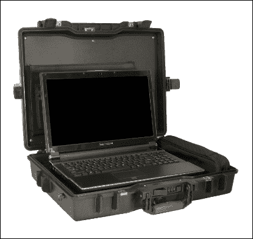

# 第二章：事件响应与实时分析

准备应对事件的各个阶段是一个需要特别关注的问题。在某些情况下，事件发生时缺乏必要的工具，导致无法在合适的时机采取必要的行动。

考虑到事件的反应时间取决于事件处理过程的效率，可以明确的是，为了准备 IR 团队，必须非常小心地进行技术支持。

整个要求集可以分为几个类别来应用于 IR 团队：

+   技能

+   硬件

+   软件

让我们更详细地考虑在准备事件响应团队过程中可能出现的主要问题。

如果我们想要建立一个计算机安全事件响应团队，我们需要具备一定技能和技术专长的人员，来执行技术任务并有效地与外部联系人沟通。现在，我们将考虑团队成员的技能。

团队成员所需的技能可以分为两类：

+   个人技能

+   技术技能

# 个人技能

个人技能对于一个成功的响应团队至关重要。这是因为与技术专家但社交能力较差的团队成员互动，可能导致误解和结果的误读，而这些后果可能影响团队的声誉。

一些关键的个人技能将在接下来的部分中讨论。

## 书面沟通

对于许多 IR 团队来说，沟通的一大部分是通过书面文件进行的。这些沟通可以采取多种形式，包括涉及事件的电子邮件、事件或事故报告的文档、漏洞以及其他技术信息通知。事件响应团队的成员必须能够清晰简洁地写作，准确描述活动，并提供易于读者理解的信息。

## 口头沟通

通过口头沟通有效传达信息的能力也是一项重要技能，确保事件响应团队成员能对正确的人说出合适的话语。

## 演讲技巧

并非所有技术专家都有良好的演讲技巧。他们可能不擅长在大规模观众面前发言。提升演讲技巧的信心将需要时间和努力，团队成员需要逐渐积累经验，在这种情况下感到更加自如。

## 外交手段

事件响应团队的成员需要与目标和需求可能各异的人互动。熟练的事件响应团队成员能够预见潜在的争议点，作出恰当回应，保持良好的关系，避免冒犯他人。他们还会理解自己代表着 IR 团队及其组织。

外交和机智非常重要。

## 遵循政策和程序的能力

团队成员需要的另一个重要技能是能够遵循并支持组织或团队已建立的政策和程序。

## 团队合作技能

IR 人员必须能够在团队环境中作为高效而友好的团队成员工作。他们需要意识到自己的责任，为团队目标作出贡献，并共同分享信息、工作量和经验。他们必须灵活，并愿意适应变化。他们还需要与其他方互动的技能。

## 诚信

IR 工作的性质意味着团队成员经常处理敏感信息，偶尔他们还可能接触到具有新闻价值的信息。团队成员必须值得信赖、谨慎，并能够根据指南、任何利益相关方协议或规定和/或任何组织政策和程序保密处理信息。

在提供技术解释或响应的过程中，IR 人员必须小心提供适当且准确的信息，同时避免传播任何可能对其他组织声誉造成负面影响、导致 IR 团队诚信受损或影响涉及其他方的活动的机密信息。

## 了解自己的局限

IR 团队成员必须具备的另一个重要能力是能够在某一领域遇到自己知识或专业的局限时，迅速承认这一点。无论承认局限有多困难，个人都必须认识到自己的局限，并积极寻求团队成员、其他专家或管理层的支持。

## 应对压力

IR 团队成员经常面临压力情况。他们需要能够识别自己何时感到压力，愿意让其他团队成员意识到这一情况，并采取（或寻求帮助）采取必要措施来控制和保持冷静。特别是，他们需要在紧张情况下保持冷静的能力——从超负荷的工作量到攻击性的来电，再到可能危及人类生命或关键基础设施的事件。团队的声誉和个人的声誉将取决于如何处理这些情况。

## 问题解决

IR 团队成员每天都面临大量数据，有时信息量非常庞大。如果没有良好的问题解决技能，团队成员可能会被与事件和其他任务相关的大量数据所压倒。问题解决技能还包括 IR 团队成员“跳出框框思考”的能力，或从多个角度看问题以识别相关信息或数据。

## 时间管理

除了解决问题的能力，IR 团队的成员还需要能够有效地管理时间。他们将面临许多任务，从分析、协调和响应事件，到执行诸如优先处理工作负载、参加和/或准备会议、填写时间表、收集统计数据、进行研究、提供简报和演示、参加会议以及可能提供现场技术支持等职责。

## 技术技能

另一个有效 IR 团队所需的重要技能组件是其员工的技术技能。这些技能定义了团队所使用的技术以及其服务的群体的理解深度和广度，以下各节将进行说明。

反过来，IR 团队成员应具备的技术技能可以分为两大类：**安全基础**和**事件处理技能**。

# 安全基础

让我们在以下小节中看看一些安全基础。

## 安全原则

IR 团队的成员需要对基本的安全原则有一般性了解，例如以下内容：

+   保密性

+   可用性

+   身份认证

+   完整性

+   访问控制

+   隐私

+   不可否认性

## 安全漏洞和弱点

要理解任何特定攻击如何在给定的软件或硬件技术中表现出来，IR 团队的成员需要首先能够理解漏洞的根本原因，通过这些漏洞大多数攻击得以利用。他们需要能够识别和分类最常见的漏洞类型及相关攻击，例如那些可能涉及以下内容的攻击：

+   物理安全问题

+   协议设计缺陷（例如，中间人攻击或欺骗）

+   恶意代码（例如，病毒、蠕虫或特洛伊木马）

+   实现缺陷（例如，缓冲区溢出或时序窗口/竞争条件）

+   配置弱点

+   用户错误或漠不关心

## 互联网

重要的是，IR 团队的成员还需要了解互联网。没有这一基本的背景信息，他们将难以或无法理解其他技术问题，例如互联网底层协议和服务缺乏安全性，或者无法预见未来可能出现的威胁。

## 风险

IR 团队的成员需要具备计算机安全风险分析的基本知识。他们应当理解各种风险对其所服务群体的影响（例如，可能广泛传播的互联网攻击、与团队和服务对象相关的国家安全问题、物理威胁、财务威胁、业务损失、声誉或客户信任丧失，以及数据损坏或丢失）。

## 网络协议

IR 团队成员需要对团队和所服务的用户所使用的常见（或核心）网络协议有基本的理解。对于每个协议，他们应当了解协议的基本概念、规范以及如何使用。此外，他们还需了解该协议常见的威胁或攻击类型，并能采取策略来减轻或消除这些攻击。

例如，至少，工作人员应当熟悉一些常见的协议，如 IP、TCP、UDP、ICMP、ARP 和 RARP。他们需要了解这些协议的工作原理、用途、它们之间的差异、一些常见的弱点等。除此之外，工作人员还应当对类似 TFTP、FTP、HTTP、HTTPS、SNMP、SMTP 等协议有类似的理解。

专业技能包括对前述所有领域的安全概念和原则的更深入理解，并且具备对导致这些协议漏洞的机制和技术的专业知识，了解可以被利用的弱点（以及为何会被利用），可能使用的攻击方法类型，以及减轻或消除这些潜在问题的策略。他们还应当对其他协议或互联网技术（如 DNSSEC、IPv6、IPSEC 以及其他可能与用户网络兼容或交互的电信标准，如 ATM、BGP、宽带、IP 语音、无线技术、其他路由协议、或新兴技术等）有专家级理解。这样，他们可以为团队或用户的其他成员提供专家技术指导。

## 网络应用与服务

IR 团队的成员需要对团队和所服务的用户常用的网络应用与服务（如 DNS、NFS、SSH 等）有基本的了解。对于每一个应用或服务，他们应当了解其目的、工作原理、常见用途、安全配置以及该应用或服务常见的威胁或攻击类型，此外，还需了解相应的缓解策略。

## 网络安全问题

IR 团队的成员应当具备网络安全概念的基本理解，并能够识别网络配置中的弱点。他们应了解网络防火墙的基本外围安全概念（如设计、数据包过滤、代理系统、DMZ、堡垒主机等），路由器安全性，数据在网络中传输时可能遭遇的信息泄露风险（例如，数据包监控或“嗅探器”），以及与接受不可信信息相关的威胁。

## 主机或系统安全问题

除了了解网络级别的安全问题外，IR 团队的成员还需要了解各种操作系统（UNIX、Windows 或团队或管辖范围使用的任何其他操作系统）在主机级别的安全问题。在了解安全方面之前，IR 团队的成员必须首先具备以下内容：

+   使用操作系统的经验（用户安全问题）

+   对管理和维护操作系统（作为管理员）有一定的熟悉度

然后，对于每个操作系统，IR 团队成员需要知道如何执行以下操作：

+   安全地配置（强化）系统

+   审查配置文件中的安全弱点

+   识别常见攻击方法

+   确定是否发生了入侵尝试

+   确定入侵尝试是否成功

+   审查日志文件中的异常

+   分析攻击结果

+   管理系统权限

+   安全的网络守护进程

+   从入侵中恢复

## 恶意代码

IR 团队的成员必须了解发生的不同类型的恶意代码攻击及其如何影响他们的管辖范围（系统入侵、拒绝服务、数据完整性丧失等）。恶意代码可能具有不同类型的载荷，可能导致拒绝服务攻击或网页篡改，或者代码可能包含更多“动态”载荷，可以配置以产生多方面的攻击向量。工作人员不仅要理解恶意代码是如何通过一些显而易见的方法传播的（磁盘、电子邮件、程序等），还需要理解它如何通过其他方式传播，如 PostScript、Word 宏、MIME、对等文件共享或影响运行在 PC 和 Mac 平台上的操作系统的启动扇区病毒。IR 团队的成员必须了解此类攻击如何发生及其传播方式，相关的风险和损害，预防和缓解策略，检测和移除过程，以及恢复技术。

专业技能包括执行分析、黑盒测试、逆向工程与此类攻击相关的恶意代码的专业知识，并为团队提供有关有效响应最佳方法的建议。

## 编程技能

一些团队成员需要具备系统和网络编程经验。团队应确保在团队和管辖范围使用的操作系统中涵盖多种编程语言。例如，团队应具备以下经验：

+   C

+   Python

+   Awk

+   Java

+   Shell（所有变种）

+   其他脚本工具

这些脚本或编程工具可用于帮助分析和处理事件信息（例如，编写不同的脚本来计数和排序各种日志、搜索数据库、查找信息、从日志或文件中提取信息，以及收集和合并数据）。

## 事件处理技能

+   本地团队政策和协议

+   理解和识别入侵者的技术

+   与站点的通信

+   事件分析

+   事件记录的维护

# IR 和 Jump Bag 的硬件

当然，可能在事件处理中需要的设备集应该提前准备，并且应给予充分重视。这个套件被称为 **Jump Bag**。

这种套件的形成在很大程度上取决于组织能够承担的预算。然而，仍然有一个必要的最低配置，可以让团队处理小数量的事件。

如果预算允许，可以购买一个完整的解决方案，其中包含所有必要的设备和用于运输的箱子。作为此类解决方案的示例，可以推荐 FREDL + Ultra Kit。**FREDL** 是 **Forensic Recovery of Evidence Device Laptop** 的缩写。配合 Ultra Kit，这个解决方案大约需要 5000 美元。

Ultra Kit 包含一套写保护器和一套适配器与连接器，用于获取具有不同接口的硬盘镜像：


### 注意

更多细节可以在制造商网站上找到，[`www.digitalintelligence.com/products/ultrakit/`](https://www.digitalintelligence.com/products/ultrakit/)。

当然，如果我们忽略这种解决方案的主要缺点，与成本相比，这个决策有很多优势。除此之外，你还可以获得一套完整的入门套件来处理事件。此外，Ultra Kit 允许你安全地运输设备，而不必担心损坏。

### 注意

FRED-L 笔记本基于现代硬件，规格不断更新，以满足现代要求。当前规格可以在制造商网站上找到，[`www.digitalintelligence.com/products/fredl/`](http://www.digitalintelligence.com/products/fredl/)。



然而，如果你想替代昂贵的解决方案，可以构建一个更便宜的替代品，这样可以节省 20-30% 的预算。你可以单独购买决策评审中包含的组件。

作为工作站，你可以选择一台具有以下规格的笔记本电脑：

+   英特尔 Core i7-6700K Skylake 四核处理器，4.0 GHz，8MB Intel Smart Cache

+   16 GB PC4-17000 DDR4 2133 内存

+   256 GB 固态内部 SATA 驱动器

+   英特尔 Z170 Express 芯片组

+   NVIDIA GeForce GTX 970M，配备 6 GB GDDR5 显存

该规格将提供一个舒适的工作站，用于在路上工作。

### 注意

作为设备运输的案例研究，我们建议关注 Pelican（[`www.pelican.com`](http://www.pelican.com)）箱子。在这种情况下，制造商可以选择符合你需求的设备。

处理事件的典型任务之一是从硬盘获取镜像。对于这个任务，你可以使用复制器或一组写保护器和计算机。

复制器无疑是一种更便捷的解决方案；使用它们可以快速获取磁盘镜像，而无需额外的软件。它们的主要缺点是价格较高。然而，如果你经常需要提取硬盘镜像，并且预算有几千美元，那么购买复制器是一个不错的投资。

如果硬盘镜像是相对少见的问题，而且预算有限，你可以购买一个写保护器，价格大约在 300 到 500 美元之间。然而，使用该工具时需要电脑和软件，后续章节会进行详细讨论。

要购买所需的设备，你可以访问 [`www.insectraforensics.com`](http://www.insectraforensics.com)，那里有来自不同制造商的设备。

同样，也不要忘记硬盘本身。值得购买一些大容量的硬盘，以确保良好的性能。

总结一下，响应人员需要在基本工具包中包括以下物品：

+   几根网络电缆（直通电缆或环回电缆）

+   一根带有串口 USB 适配器的串行电缆

+   网络串口适配器

+   硬盘（不同尺寸）

+   闪存驱动器

+   一张 Linux Live DVD

+   带写保护器的便携式驱动器复制器

+   各种驱动器接口适配器

+   一台四端口集线器

+   数码相机

+   电缆扎带

+   电缆剪刀

+   各种螺丝和六角驱动工具

+   笔记本和笔

+   监控链表格

+   事件处理程序

## 软件

在讨论硬件之后，我们没有忘记你应该始终随身携带的软件。可以用于事件处理的软件种类繁多，可以根据个人的偏好、技能和预算来选择。有些人喜欢使用命令行工具，而有些人则发现图形界面（GUI）更加方便使用。

有时候，某些工具的使用是由工作所需的具体情况决定的。

一些工具将在后续章节中讨论。然而，我们强烈建议你提前准备并彻底测试所有需要的软件。

## 活体与死亡（Live versus mortem）

对事件的初步反应是计算机事件管理过程中非常重要的一步。正确执行此步骤的方法直接影响调查的成功与否。

此外，及时且正确的响应对于减少事件造成的损害至关重要。

传统的磁盘分析方法并不总是实用的，在某些情况下，根本无法使用。

在今天的世界里，计算机技术的发展使得许多公司在多个城市、国家和大陆建立了分销网络。由于计算机与网络的物理隔离，传统的对每台计算机进行调查的方法已不再可行。

在这种情况下，事件响应者应能够远程进行先期评估，并尽快查看正在运行的进程列表、开放的网络连接、打开的文件，以及获取系统中注册的用户列表。然后，如有必要，进行全面调查。

在本章中，我们将探讨应答者在特定情况下可能采用的一些方法。然而，即使在我们可以物理访问机器的情况下，实时响应仍然是唯一的事件响应方式。

例如，当我们处理大容量磁盘阵列时。在这种情况下，一次性会遇到几个问题。第一个问题是，存储大量数据的空间也很难识别。除了这个问题外，分析大量数据所需的时间也过于高估。

通常，这类大量数据由一个高负载服务器提供服务，支持数十万用户，因此它们的访问，甚至重启，都是不可接受的商业行为。

另一种需要采用实时取证方法的情境是使用加密文件系统的情况。在没有解密密钥的情况下，实时取证是一种有效的替代方法，可以从使用加密文件系统的系统中获取数据。

这并不是实时分析可能适用的所有情况的详尽列表。

值得注意的是一个非常重要的点：在实时分析过程中，无法避免系统的变化。

连接外部 USB 设备或网络连接、用户登录或启动可执行文件等操作会在系统的各种日志文件、注册表项等中进行修改。因此，您需要了解应答者的操作所造成的变化，并记录下来。

## 易失性数据

根据“易失性顺序”原则，您必须首先收集被归类为易失性数据的信息（如网络连接列表、正在运行的进程列表、登录会话等），这些信息在计算机关机时会不可恢复地丢失。

然后，您可以开始收集非易失性数据，这些数据也可以通过传统的磁盘映像分析方法获得。此时的主要区别是，使用正常工作的机器时，获取实时取证数据更为简便。

获取内存转储和磁盘映像以及对其进行分析的过程将在其他章节中详细描述。本章将重点讨论易失性数据的收集。

通常，这个类别包括以下数据：

+   系统运行时间和当前时间

+   网络参数（NetBIOS 名称缓存、活动连接、路由表等）

+   网络接口卡（NIC）配置设置

+   登录用户和活动会话

+   加载的驱动程序

+   正在运行的服务

+   正在运行的进程及其相关参数（加载的 DLL、打开的句柄和所有权）

+   自启动模块

+   共享驱动器和远程打开的文件

记录数据收集的时间和日期可以帮助定义一个时间间隔，调查人员将在该时间段内对系统进行分析：

```
(date / t) & (time / t)>%COMPUTER_NAME% \ systime.txt
systeminfo | find "Boot Time" >>% COMPUTERNAME% \ systime.txt

```

最后一条命令可以显示自上次重启以来机器的运行时间。

使用 `%COMPUTERNAME%` 环境变量，我们可以为每台计算机设置单独的目录，以防需要重复在网络中不同计算机上收集信息的过程。

在某些情况下，通过分析网络活动，可以清楚地看到妥协的迹象。下一组命令允许您获取这些信息：

```
nbtstat -c> %COMPUTERNAME%\NetNameCache.txt
netstat -a -n -o>%COMPUTERNAME%\NetStat.txt
netstat -rn>%COMPUTNAME%\NetRoute.txt
ipconfig / all>%COMPUTERNAME%\NIC.txt
promqry>%COMPUTERNAME%\NSniff.txt

```

第一条命令使用 `nbtstat.exe` 从 NetBIOS 缓存中获取信息。您可以显示与相应 IP 地址关联的 NetBIOS 名称。第二条和第三条命令使用 `netstat.exe` 记录所有活动连接、监听端口和路由表。

获取网络设置信息时，使用 `ipconfig.exe` 网络接口命令。

最后一条命令启动了 Microsoft `promqry` 工具，它允许您定义本地计算机上处于混杂模式的网络接口。此模式是网络嗅探工具所需的，因此检测到此模式表明计算机可能运行监听网络流量的软件。

要列出计算机上所有登录的用户，可以使用 Sysinternals 工具：

```
psloggedon -x>%COMPUTERNAME% \ LoggedUsers.tx:
logonsessions -p >> %COMPUTERNAME%\LoggedOnUsers.txt

```

`PsLoggedOn.exe` 命令列出了两类用户：一类是本地登录到计算机的用户，另一类是通过网络远程登录的用户。使用 `-x` 参数，您可以获得每个用户登录的时间。

使用 `-p` 键，`logonsessions` 将显示该用户在会话期间启动的所有进程。

应注意，`logonsessions` 必须以管理员权限运行。

要获取加载到系统中的所有驱动程序列表，可以使用 WDK `drivers.exe` 工具：

```
drivers.exe>%COMPUTERNAME%\drivers.txt

```

获取运行中的进程及其相关信息的下一组命令如下：

```
tasklist / svc>%COMPUTERNAME% \ taskdserv.txt
psservice>%COMPUTERNAME% \ trasklst.txt
tasklist / v>%COMPUTERNAME% \ taskuserinfo.txt
pslist / t>%COMPUTERNAME%\tasktree.txt
listdlls>%COMPUTERNAME%\lstdlls.txt
handle -a>%COMPUTERNAME%\lsthandles.txt

```

使用 `/svc` 参数的 `tasklist.exe` 工具枚举运行中的进程和服务及其上下文。尽管前一条命令显示了正在运行的服务列表，但 PsService 通过注册表和 SCM 数据库中的信息获取服务信息。

服务是攻击者访问之前已被妥协系统的传统方式。服务可以配置为在没有用户干预的情况下自动运行，并且可以作为另一个进程的一部分启动，如 `svchost.exe`。

此外，远程访问可以通过完全合法的服务提供，如 telnet 或 ftp。要将用户与其运行的进程关联，可以使用 `tasklist / v` 命令。

要列出每个进程中加载的 DLL 及其完整路径，可以使用 SysInternals 的 `listsdlls.exe`。

另一个 `handle.exe` 工具可以用来列出所有已打开的句柄，这些句柄是打开的进程。它处理注册表键、文件、端口、互斥体等。

其他工具需要以管理员权限运行。这些工具可以帮助识别被注入到进程中的恶意 DLL，以及这些进程未访问的文件。

下一组命令允许你获取配置为自动启动的程序列表：

```
autorunsc.exe -a>%COMPUTERNAME% \ autoruns.txt
at>%COMPUTERNAME% \ at.txt
schtasks / query>%COMPUTERNAME% \ schtask.txt

```

第一个命令启动 SysInternals 工具，autoruns，并显示在系统启动和用户登录时运行的可执行文件列表。这个工具可以帮助你检测使用流行且著名的持久安装方法将恶意软件安装到系统中的情况。

另外两个命令（`at` 和 `schtasks`）会显示计划中运行的命令列表。启动 `at` 命令也需要管理员权限。

要安装后门机制，通常使用服务，但服务始终在系统中运行，因此可以在实时响应期间轻松被检测到。因此，创建一个按计划运行的后门以避免被发现。例如，攻击者可以创建一个任务，在工作时间外运行恶意软件。

要获取已删除的网络共享驱动器和磁盘文件列表，可以使用以下两个命令：

```
psfile>%COMPUTERNAME%\openfileremote.txt
net share>%COMPUTERNAME%\drives.txt

```

## 非易失性数据。

在收集了易失性数据之后，可以继续收集非易失性数据。这些数据可以在分析磁盘阶段获取，但正如我们之前提到的，在某些情况下，无法对磁盘进行分析。

这些数据包括以下内容：

+   已安装的软件和更新列表。

+   用户信息。

+   文件系统时间戳的元数据。

## 注册表数据。

然而，在接收到这些数据并在系统实时运行时，会遇到困难，因为许多文件无法以通常的方式复制，因为它们被操作系统锁定。为此，使用其中的一种工具。一个这样的工具是由*Joakim Schicht* 编写的 `RawCopy.exe` 工具。

这是一个控制台应用程序，它通过低级磁盘读取方法从 NTFS 卷中复制文件。

该应用程序有两个必需的参数，目标文件和输出路径：

+   `-param1`：这是要提取的目标文件的完整路径；它也支持使用 `IndexNumber` 替代文件路径。

+   `-param2`：这是有效的输出目录路径。

这个工具可以让你复制通常无法访问的文件，因为系统已将它们锁定。例如，注册表配置单元，如 `SYSTEM` 和 `SAM`，位于 `SYSTEM VOLUME INFORMATION` 中的文件，或者卷上的任何文件。

这支持通过完整文件路径或其 `$MFT` 记录号（索引号）指定输入文件。

这是从正在运行的系统中复制 `SYSTEM` 配置单元的示例：

```
RawCopy.exe C:\WINDOWS\system32\config\SYSTEM  %COMPUTERNAME%\SYSTEM

```

这是通过指定索引号提取 `$MFT` 的示例：

```
RawCopy.exe C:0  %COMPUTERNAME%\mft

```

这是提取 `MFT` 引用编号 `30224` 及所有属性（包括 `$DATA`）并将其转储到 `C:\tmp` 的示例：

```
RawCopy.exe C:30224 C:\tmp -AllAttr

```

要下载 RawCopy，请访问 [`github.com/jschicht/RawCopy`](https://github.com/jschicht/RawCopy)。

了解安装了哪些软件以及这些软件的更新信息有助于进一步调查，因为这显示了可能通过软件漏洞破坏系统的方式。攻击者进行的第一步通常是在系统扫描过程中进行攻击，以检测活动服务并利用其中的漏洞。

因此，未打补丁的服务可以被用来进行远程系统渗透。

安装一组软件和更新的方式之一是使用 `systeminfo` 工具：

```
systeminfo > %COMPUTERNAME%\sysinfo.txt.

```

此外，熟练的攻击者还可以自行执行相同的操作并安装必要的更新，以隐藏渗透系统的痕迹。

在识别出易受攻击的服务及其成功被利用后，攻击者会创建一个账户以便随后以合法方式进入系统。因此，对系统用户数据的分析揭示了以下被妥协的痕迹：

+   `Recent` 文件夹内容，包括 LNK 文件和跳转列表

+   `Office Recent` 文件夹中的 LNK 文件

+   `Network Recent` 文件夹内容

+   整个 `temp` 文件夹

+   整个 `Temporary Internet Files` 文件夹

+   `PrivacyIE` 文件夹

+   `Cookies` 文件夹

+   `Java Cache` 文件夹内容

现在，让我们考虑前述情况，如下所示：

1.  收集 `Recent` 文件夹的操作如下所示：

    ```
    robocopy.exe  %RECENT% %COMPUTERNAME%\Recent /ZB
        /copy:DAT /r:0 /ts /FP /np /E log:%COMPUTERNAME%\Recent
        \log.txt

    ```

    这里 `%RECENT%` 取决于 Windows 版本。

    +   对于 Windows 5.x（Windows 2000、Windows XP 和 Windows 2003），如下所示：

        ```
        %RECENT% = %systemdrive%\Documents and
            Settings\%USERNAME%\Recent

        ```

    +   对于 Windows 6.x（Windows Vista 及更高版本）：

        ```
        %RECENT% =%systemdrive%\Users\%USERNAME%\AppData\Roaming
            \Microsoft\Windows\Recent

        ```

1.  收集 `Office Recent` 文件夹的操作如下所示：

    ```
    robocopy.exe  %RECENT_OFFICE%
        %COMPUTERNAME%\Recent_Office /ZB /copy:DAT /r:0 /ts /FP
        /np /E log:%COMPUTERNAME%\Recent_Office\log.txt

    ```

    +   这里 `%RECENT_OFFICE%` 取决于 Windows 版本。

    +   对于 Windows 5.x（Windows 2000、Windows XP 和 Windows 2003），如下所示：

        ```
        %RECENT_OFFICE% = %systemdrive%\Documents and
            Settings\%USERNAME%\Application Data\Microsoft\Office
            \Recent

        ```

    +   对于 Windows 6.x（Windows Vista 及更高版本），如下所示：

        ```
        %RECENT% =%systemdrive%\Users\%USERNAME%\AppData\Roaming
            \Microsoft\Windows\Office\Recent

        ```

1.  收集 `Network Shares Recent` 文件夹的操作如下所示：

    ```
    robocopy.exe  %NetShares% %COMPUTERNAME%\NetShares /ZB
        /copy:DAT /r:0 /ts /FP /np /E 
        log:%COMPUTERNAME%\NetShares\log.txt

    ```

    +   这里 `%NetShares%` 取决于 Windows 版本。

    +   对于 Windows 5.x（Windows 2000、Windows XP 和 Windows 2003），如下所示：

        ```
        %NetShares% = %systemdrive%\Documents and
            Settings\%USERNAME%\Nethood

        ```

    +   对于 Windows 6.x（Windows Vista 及更高版本），如下所示：

        ```
        %NetShares % =''%systemdrive%\Users\%USERNAME%\AppData
            \Roaming\Microsoft\Windows\Network Shortcuts''

        ```

1.  收集 `Temporary` 文件夹的操作如下所示：

    ```
    robocopy.exe  %TEMP% %COMPUTERNAME%\TEMP /ZB /copy:DAT
        /r:0 /ts /FP /np /E log:%COMPUTERNAME%\TEMP\log.txt

    ```

    +   这里 `%TEMP%` 取决于 Windows 版本。

    +   对于 Windows 5.x（Windows 2000、Windows XP 和 Windows 2003），如下所示：

        ```
        %TEMP% = %systemdrive%\Documents and Settings\%USERNAME%
            \Local Settings\Temp

        ```

    +   对于 Windows 6.x（Windows Vista 及更高版本），如下所示：

        ```
        %TEMP% =''%systemdrive%\Users\%USERNAME%\AppData
            \Local\Temp ''

        ```

1.  收集 `Temporary Internet Files` 文件夹的操作如下所示：

    ```
    robocopy.exe  %TEMP_INTERNET_FILES%
        %COMPUTERNAME%\TEMP_INTERNET_FILES /ZB /copy:DAT /r:0
        /ts /FP /np /E log:%COMPUTERNAME%\TEMP\log.txt

    ```

    +   这里 `%TEMP_INTERNET_FILE%` 取决于 Windows 版本。

    +   对于 Windows 5.x（Windows 2000、Windows XP 和 Windows 2003），如下所示：

        ```
        %TEMP_INTERNET_FILE% = ''%systemdrive%\Documents and
            Settings\%USERNAME%\Local Settings\Temporary Internet
            Files''

        ```

    +   对于 Windows 6.x（Windows Vista 及更高版本），如下所示：

        ```
        %TEMP_INTERNET_FILE% =''%systemdrive%\Users\%USERNAME%\
            AppData\Local\Microsoft\Windows\Temporary Internet
            Files"

        ```

1.  收集 `PrivacIE` 文件夹的操作如下所示：

    ```
    robocopy.exe  %PRIVACYIE % %COMPUTERNAME%\PrivacyIE /ZB
        /copy:DAT /r:0 /ts /FP /np /E
        log:%COMPUTERNAME%/PrivacyIE/log.txt

    ```

    +   这里 `%PRIVACYIE%` 取决于 Windows 版本。

    +   对于 Windows 5.x（Windows 2000、Windows XP 和 Windows 2003），如下所示：

        ```
        %PRIVACYIE% = ''%systemdrive%\Documents and
            Settings\%USERNAME%\ PrivacIE''

        ```

    +   对于 Windows 6.x（包括 Windows Vista 及更高版本），具体如下：

        ```
        %PRIVACYIE% =''%systemdrive%\Users\%USERNAME%\
            AppData\Roaming\Microsoft\Windows\PrivacIE "

        ```

1.  收集`Cookies`文件夹的方法如下：

    ```
    robocopy.exe  %COOKIES% %COMPUTERNAME%\Cookies /ZB
        /copy:DAT /r:0 /ts /FP /np /E log:%COMPUTERNAME%\Cookies
        \.txt

    ```

    +   这里的`%COOKIES%`取决于 Windows 的版本。

    +   对于 Windows 5.x（包括 Windows 2000、Windows XP 和 Windows 2003），具体如下：

        ```
        %COOKIES% = ''%systemdrive%\Documents and
            Settings\%USERNAME%\Cookies''

        ```

    +   对于 Windows 6.x（包括 Windows Vista 及更高版本），具体如下：

        ```
        %COOKIES% =''%systemdrive%\Users\%USERNAME%\
            AppData\Roaming\Microsoft\Windows\Cookies"

        ```

1.  收集`Java Cache`文件夹的方法如下：

    ```
    robocopy.exe  %JAVACACHE% %COMPUTERNAME%\JAVACACHE /ZB
        /copy:DAT /r:0 /ts /FP /np /E
        log:%COMPUTERNAME%\JAVACAHE\log.txt

    ```

    +   这里的`%JAVACACHE%`取决于 Windows 的版本。

    +   对于 Windows 5.x（包括 Windows 2000、Windows XP 和 Windows 2003），具体如下：

        ```
        %JAVACACHE% = ''%systemdrive%\Documents and
            Settings\%USERNAME%\Application Data\Sun\Java\Deployment
            \cache''

        ```

    +   对于 Windows 6.x（包括 Windows Vista 及更高版本），具体如下：

        ```
        %JAVACACHE% =''%systemdrive%\Users\%USERNAME%\AppData
            \LocalLow\Sun\Java\Deployment\cache"

        ```

# 远程现场响应

然而，如前所述，通常需要远程进行信息收集。在 Windows 系统上，通常使用 SysInternals PsExec 实用程序来执行此操作。PsExec 允许您在远程计算机上执行命令，而无需安装系统。

程序的工作原理是`psexec.exe`是另一个 PsExec 的资源可执行文件。此文件在特定目标机器上运行 Windows 服务。在执行命令之前，PsExec 会在远程计算机的管理员权限域中解压此隐藏资源到`Admin$`（`C:\Windows`）文件`Admin$\system32\psexecsvc.exe`。

复制后，PsExec 使用 Windows 管理服务的 API 函数安装并运行服务。然后，在启动 psexesvc 后，psexesvc 与 psexec 之间建立数据连接（输入命令和获取结果）。工作完成后，psexec 停止服务并从目标计算机中移除。

如果需要远程信息收集，则运行 UNIX 操作系统的工作机器可以使用 Winexe 实用程序。

Winexe 是一个基于 GNU/Linux 的应用程序，允许用户在 WindowsNT/2000/XP/2003/Vista/7/8 系统上远程执行命令。它在远程系统上安装一个服务，执行命令，然后卸载该服务。Winexe 允许执行大部分 Windows shell 命令：

```
 winexe -U [Domain/]User%Password //host command 

```

要在 Linux 系统内启动 Windows shell，请使用以下命令：

```
 winexe -U HOME/Administrator%Pass123 //192.168.0.1 "cmd.exe"

```

# 总结

在本章中，我们讨论了应急包中应该包含的内容以处理计算机事件，以及 IR 团队成员需要的技能。

我们还审视了现场响应并从现场系统收集了易失性和非易失性信息。我们还讨论了收集信息的不同工具。我们还讨论了何时应该使用现场响应方法作为传统取证的替代方法。

在接下来的章节中，我们将考虑与易失性数据收集相关的问题。
