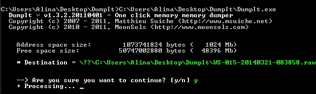
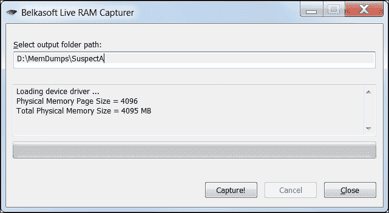
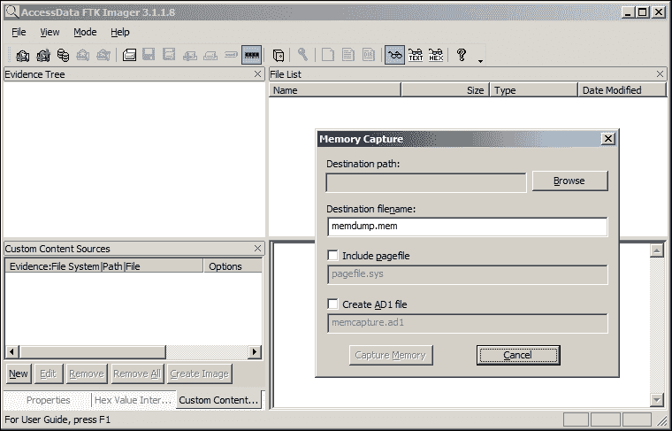
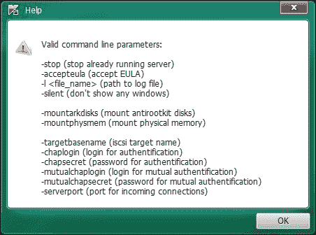
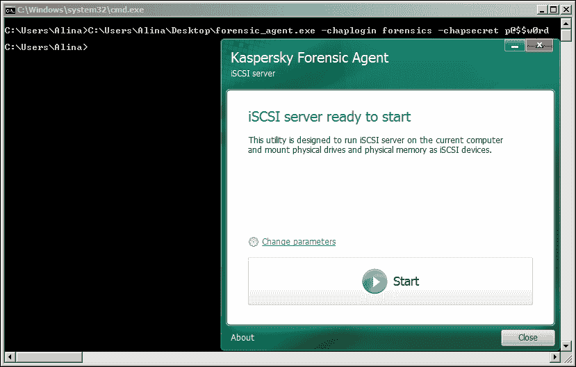
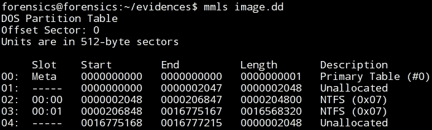
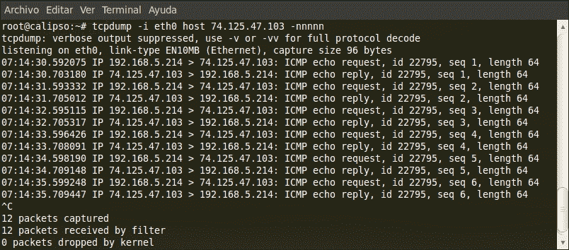
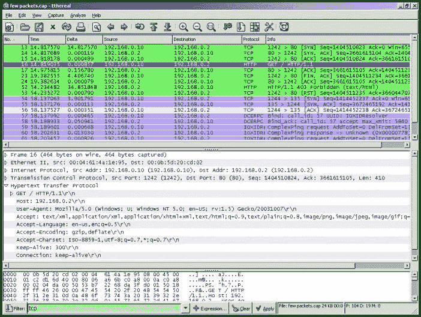
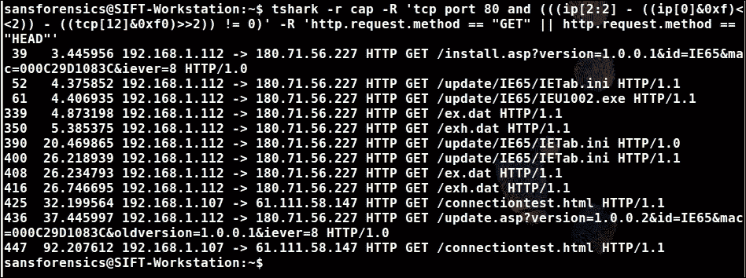

# 第三章。易失性数据收集

本章专注于与获取数据相关的一些问题，这些数据变化非常快。由于其特性，它反映了系统在某一特定时间点的状态，因为数据的收集是在一个活动系统上进行的。

**请求评论 RFC** 3227 文档提供了数字证据的列表及其收集顺序。应该指导这一过程的主要原则是首先收集变化最快的数据。

RFC 提供的证据清单包括以下内容：

+   寄存器和缓存 CPU

+   路由表，ARP 缓存，进程表，内核统计和内存

+   临时文件系统

+   硬盘

+   与系统媒体相关的远程日志记录和监视数据

+   物理配置和网络拓扑

+   存档媒体

根据这个列表，应首先收集的易失性数据是与内存和网络相关的数据。

# 内存获取

多年来，进行数字取证的主要技术是分析硬盘镜像。当然，如果有硬盘镜像可用，我们有很大机会获取大量数据来解决事件。然而，这种方法也有一些缺点。

现代硬盘具有巨大的容量，有时我们不得不处理 RAID 阵列，因此分析如此大量的数据将需要很长时间。此外，全磁盘加密技术可能已实施，没有加密密钥将无法访问磁盘上的文件。此外，分析硬盘内容并不总是能够完整展现特定时间点发生的整个情况。而且，如今存在许多无身体的恶意软件；在这种情况下，恶意代码不会作为文件出现在文件系统中。

所有这些列出的事实都迫使法证专家寻求新的替代方法来解决法证任务。因此，研究人员将 RAM 作为替代信息源。

由于众所周知和现代的 PC 是建立在冯·诺伊曼体系结构上的，因此在计算机上执行的任何代码片段应该出现在内存的某处。内存可能是一个有用的证据来源。使用内存的另一个优势是其尺寸较小。尽管如今用户的工作站拥有越来越多的 RAM，但其尺寸仍远小于现代硬盘。然而，长时间以来，内存分析的过程并不广泛使用。内存分析的过程仅仅是扫描转储内存以搜索一些字符串。当诸如 Volatility Framework 之类的工具出现时，情况发生了变化。

因此，如今，内存取证不再是可选项，而是专业调查的强制步骤。但是，在进行内存分析之前，我们应该先获取内存转储，并且应该以正确的方式进行。否则，即使使用如 Volatility 之类的强大工具，内存分析也将不成功。

有很多工具可以为任何操作系统（MS Windows、Linux 或 Mac OS X）创建内存转储。其中一些工具非常简单，你只需按下按钮。然而，专业人员应了解其工作原理，并做好在出现问题时进行修复的准备。

## 与内存访问相关的问题

现在，让我们讨论一些与 MS Windows 上内存访问相关的问题。在 MS Windows 中，有一个 `\Device\PhysicalMemory` 内核对象，它提供对系统物理内存的直接访问。为了获取内存的内容，我们应该读取这个文件。在 Windows Server 2003 SP2 之前，给定的文件可以从用户空间访问。然而，从这个更新开始，并且在之后的所有 MS Windows 版本中，这个对象只能从内核空间访问。用户空间应用程序可以读取这个文件，但要打开和编辑它，则需要内核空间代码或驱动程序。此外，任何对这个对象的操作都是危险的。设备内存是物理内存的一部分，它映射到系统中的其他设备。操作系统通过将数据发送到这些设备来访问这一部分物理内存，这些设备如显卡等，它们的数据存储在特定的内存块中，这些内存块专门为这些设备保留。写入或请求访问这些为设备保留的内存区域的操作会被转换成一个请求，然后发送到实际的设备。

设备如何处理请求取决于设备本身。此外，这可能导致系统挂起或崩溃，并破坏证据。因此，用于内存转储的软件和硬件应排除这些内存区域。我们建议在使用之前测试所有工具。除了刚刚描述的问题外，还有恶意软件可能会改变工具的行为并更改内存转储的结果。

尽管我们在实际生活中从未遇到过这样的恶意软件，但有一些研究人员编写的 PoC 可以证明这种威胁。因此，如果内存获取过程失败，可能会导致系统崩溃并丢失数据。

### 选择工具

要选择工具，我们需要回答以下问题：

+   支持的操作系统版本是什么？

+   支持的硬件架构是什么（x32, x64）？

+   所需的权限级别是什么？

+   结果存储在哪里？

目前，市场上有许多免费和商业工具支持所有版本的 MS Windows，可以用于内存转储：

| **免费工具** | **商业工具** |
| --- | --- |
| DumpIt | F-Response |
| WinPMEM (rekall) | Guidance Winen |
| FTKImager | HBGary Fastdump PRO |
| BelkaSoft Live RAM Capturer |  |

我们需要注意，商业工具并不总是更好。我们应该使用哪种工具取决于使用案例、响应者的经验和资质以及其他因素。

尽管有很多可能的选项，但我们建议您遵循的原则是相同的：

1.  尽量减少对系统的影响。

1.  从安全环境运行工具。

1.  将结果存储在系统外部。

我们将所有用例分为三组，分为两种方法，即硬件和软件：

+   本地

+   远程

+   死后

它们每个都有其优点和缺点。例如，让我们看看硬件方法。在这种情况下，不需要管理员权限，但您应该能够物理访问正在调查的 PC。所采用的方法基于**直接内存访问**（**DMA**）和一些技术，如 Firewire、Thunderbolt、ExpressCard 或 PCI。这种方法的缺点是在使用之前需要将一些硬件和软件安装到系统中。此外，此操作需要重新启动系统。因此，这样做可能会破坏一些证据。另一个缺点是使用 FireWare 技术可以倾倒的 4 GB 内存大小的限制。但是，基于 PCI 的解决方案很少见且昂贵。

正如我们之前提到的，有很多用例变体。因此，在一个单独的章节中观察每一个是不可能的。

最简单和最常见的情况是本地软件方法。在这种方法中，我们可以使用多种实用程序，现在我们来看看其中一些。

### DumpIt

在系统内存不超过 4 GB 的情况下，DumpIt 工具是一个不错的选择。DumpIt 具有非常简单的命令行界面，即使对于没有经验的人来说也很容易使用。要倾倒整个系统内存，你应该将其复制到某个可移动设备上，该设备有足够的空间来存储内存转储。然后，将此设备插入系统并从该驱动器运行。运行完成后，DumpIt 将在执行 DumpIt 的相同路径下创建一个包含系统内存转储的文件：



不幸的是，DumpIt 的免费版本在处理超过 4 GB 内存时无法正常工作。

如果您有 8 GB 或更多内存，我们建议使用 Belkasoft Live RAM Capturer。此软件也具有简单的图形界面。它适用于 x32 和 x64 位架构：



### FTK Imager

另一个用于内存转储的流行工具是 FTK Imager。它也是免费的。有两个版本。我们建议使用 FTK Imager Lite 版本。它不需要安装，具有易于使用的界面，并且具有许多有用的功能：



## 使用 iSCSI 从远程计算机获取内存

另一个常见的场景是从远程计算机获取内存。考虑一下这种情况，我们需要从远程 Windows 工作站中转储内存，且操作系统可能包括 MS Windows、Mac OS X 和 Linux。为此，我们可以使用**iSCSI**协议。互联网小型计算机系统接口协议（Internet Small Computer System Interface，iSCSI）是由 IBM 和 CISCO 于 1998 年开发的。该协议允许客户端（称为启动器）向远程服务器上的 SCSI 存储设备（称为目标）发送 SCSI 命令（CDB）。

启动器是一个 iSCSI 客户端，它的工作方式类似于 SCSI 适配器，只不过它使用的是 IP 网络而非物理总线。iSCSI 目标是一个提供存储设备网络接口的服务器。因此，我们应该在调查员的工作站上安装 iSCSI 目标，在那里我们将存储内存转储。有几个免费的 iSCSI 实现可供 Microsoft 和 StarWind 使用。此外，F-Response 提供通过 iSCSI 访问远程 PC 的功能。大多数操作系统都带有免费的内置启动器客户端软件，包括 MS Windows 2000 SP4 及更高版本。

所以，在我们的用例中，我们将使用我们自己编写的 iSCSI 目标软件，**KFA**（**Kaspersky Forensics Agent**），以及在 Linux 工作站上的`iscsiadm`工具作为启动器。

要使用 Kaspersky Forensics Agent 转储内存，在目标系统上运行该工具，并使用`-mountphysmem`选项：



为了提供授权访问，我们可以使用`chaplogin`和`chapsecret`选项：



现在，可以使用任何 iSCSI 启动器连接到选定的介质：

1.  现在，我们测试连接：

    ```
    sudo iscsiadm -m discovery -t st -p TargetAddress

    ```

1.  验证 iSCSI 连接正常后，我们建立完整的连接：

    ```
    sudo iscsiadm -m node --login

    ```

1.  确保在 Ubuntu 环境中内存作为新设备可见。

1.  现在，你可以像往常一样使用`dd`工具进行转储。

现在，你有了内存转储，可以开始分析它了！

## 使用 Sleuth Kit

我们还想讨论一个用例。可能调查人员只有硬盘镜像，无法从感兴趣的系统中转储内存。在这种情况下，我们仍然能够获得某些系统内存信息。MS Windows 在系统进入休眠状态时，会将内存内容保存在`hiberfil.sys`文件中。所以，如果我们有硬盘镜像，我们可以从磁盘中提取`hiberfil.sys`。

为了实现这个，我们需要使用 Sleuth Kit。让我们来看看我们如何做到这一点：

1.  要获取有关磁盘分区的信息，请使用以下命令：

    ```
    mmls image

    ```

    输出将如下所示：

    

1.  然后，使用`fls`列出 NTFS 分区根目录中的文件：

    ```
    fls -o 2048 image.dd | grep hiberfil.sys
    r/r 32342-128-1: hiberfil.sys

    ```

1.  最后，提取`hiberfil.sys`：

    ```
    icat -o 2048 image.dd 32342 > hiberfil.sys

    ```

现在，你可以使用分析工具，如 Volatility，分析`hiberfil.sys`。

# 基于网络的数据收集

如今，找到没有任何网络连接的计算机已经相当困难。这在企业环境中几乎是不可能的。网络连接反映了计算机与外界的互动。此外，网络是主要的威胁来源。今天，互联网是一个非常具有攻击性的环境，各种层级的威胁，从垃圾邮件到 APT，经常通过网络渗透到计算机中。

因此，在几乎所有的事件中，计算机的网络活动都与该事件相关。有很多此类事件的例子，例如接收到带有恶意附件的电子邮件和访问恶意网址。然而，有时仅凭主机级别的证据无法完整了解事件的全貌。在这种情况下，基于网络的证据可以提供很大帮助。

网络取证是一个广泛的话题，我们不会涉及所有问题。在这一章中，我们只是希望将其视为一种额外的证据来源。网络证据有很多，但我们将重点关注网络流量的获取。

法医调查员可以从物理介质（如电缆或空气）和网络设备（如交换机或集线器）捕获网络流量。

现在，我们将简要介绍这一话题，以便理解如何收集网络流量。

## 集线器

这些是简单的网络设备，允许将所有设备连接到本地子网。集线器除了实现所有设备的物理连接外，并不具备其他功能。

当这样的设备接收到网络帧时，它会将数据包转发到其他端口。因此，连接到集线器的每个设备都会接收到所有专门为其他设备准备的流量。在基于集线器的网络中，捕获来自特定网络段的流量相对简单。我们需要注意的是，有时候一些制造商将一些实际上是交换机的设备标记为集线器。

了解你正在处理的设备类型的最可靠方法是将工作站连接到该设备，将网络接口设置为混杂模式，并使用`tcpdump`工具或类似工具捕获流量。如果你只收到广播且数据包只针对该工作站，这意味着你遇到的是**交换机设备**。如果流量包含其他工作站的数据包，则说明你遇到的是**集线器**。

调查员在使用集线器捕获流量时应当小心。在这种情况下，调查员可以看到所有流量，但也可能是来自本地网络的所有设备。一台被攻陷的系统可以作为被动嗅探器，窃听所有传输的数据。网络中的任何调查活动和数据都可能被截获。因此，使用已安装的集线器是一个好主意，但安装新的集线器来捕获网络流量则会带来新的风险。

## 交换机

交换机是构建本地网络中最常见的网络设备。它们还作为集线器，用于将网络设备连接到网络中。然而，与集线器不同，交换机使用软件跟踪连接到交换机端口的站点。这些信息会保存在 CAM 表中。当交换机接收到新的数据包时，它只会根据 CAM 表将该数据包转发到特定端口。因此，每个站点只接收自己的流量。

调查人员通常可以在交换机设备上捕获网络流量，因为大多数交换机具备将一个或多个端口的流量复制到其他端口以进行聚合和分析的功能。不同厂商使用不同的术语，最常用的术语是**SPAN**（**交换端口分析仪**）或**RSPAN**（**远程 SPAN**）。有时，也会使用端口镜像这一术语。此外，交换机的硬件容量各不相同。端口镜像受到设备物理容量的限制。考虑以下示例：我们有一个 100 Mbps 的交换机，想要将四个端口的流量镜像到另一个端口。如果每个端口的平均负载为 50 Mbps，那么镜像端口的负载将达到 200 Mbps，远超每个端口的容量。因此，在此过程中会丢失一些数据包。

我们应当注意，使用 SPAN 端口的方法可能会改变所收集的流量。然而，还有一种方法可以捕获流量，那就是网络 Tap。

网络 Tap（网络分接器）被放置在站点和交换机之间，能够查看并捕获此主机的所有流量。网络 Tap 复制所有流量，包括损坏的流量和其他任何数据包。因此，这种方法更适合于取证。

在我们最终选择了捕获流量的方法后，我们需要一些软件。一个常见的解决方案是`libpcap`库及其基础上的软件，包括`tcpdump`、Wireshark 等。

使用此类软件捕获流量有两种主要方法：一种是捕获时进行过滤，另一种是先捕获所有数据，再进行过滤。

在某些情况下，如果你有有限的存储空间来存储流量，捕获时进行过滤是一个好主意。另一方面，libpcap 具有一个非常强大的过滤功能，叫做**Berkley 数据包过滤器**（**BPF**）。通过使用 BPF 过滤器，我们可以控制要捕获的流量以及要丢弃的流量。如果你确切知道要捕获的内容，这种方法可以节省大量的时间和资源。BPF 可以根据第二、第三和第四层协议中的字段进行比较来过滤流量。此外，BPF 语言有一些内置的原语：`host id`、`dst host id`、`src host id`、`net id`、`dst net id`、`src net id`、`ether id`、`dst ether id`、`src ether id`、`port id`、`dst port id`、`src port id`、`gateway id`、`ip proto id`、`ether proto id`、`tcp`、`udp`、`icmp` 和 `arp`。你可以在`pcap-filter`的手册文档中找到更多内容。

## Tcpdump

`tcpdump` 是一款用于捕获、过滤和分析网络流量的工具。该工具的主要目的是捕获流量并打印出来或将其存储到文件中。`tcpdump` 捕获的流量按比特流传输，保持原始传输格式。我们可以使用 `tcpdump` 分析网络流量，帮助故障排除。在这种情况下，您将使用 BPF 进行预过滤。然而，通常这种方法更适用于初步的筛查：



在取证实践中，其他方法更加普遍。Tcpdump 用于长时间捕获流量并将其存储到磁盘文件中，之后进行分析并与其他数据进行关联。

`tcpdump` 是一款高保真度工具，但捕获的流量质量取决于运行 `tcpdump` 的主机上可用的资源。例如，`tcpdump` 的性能将依赖于 CPU 的处理能力。数据包捕获是一项 CPU 密集型活动，如果 CPU 超负荷，`tcpdump` 将无法正常工作并丢失数据包。在取证案例中，我们希望捕获所有数据包，这个问题可能非常关键。在高负载的网络中，流量存储空间也是一个重要问题。如前所述，您可以通过过滤流量，只保留有用信息。

尽管过滤可以节省资源，如 CPU、磁盘空间和带宽，但需要谨慎实施，因为过度过滤可能会导致证据丢失。

## Wireshark

另一个流行的捕获和流量分析工具是 Wireshark：



Wireshark 是一款拥有易于使用的图形用户界面的工具，因此它是网络取证初学者的好工具。它还具有许多过滤、解密和分析网络流量的功能。因此，这使得 Wireshark 成为任何网络调查员必备的工具。Wireshark 允许您在系统的任何接口上捕获流量，只要您拥有必要的权限，可以实时显示流量，并将其存储到磁盘文件中。

此外，还有一些有用的命令行工具，它们与 Wireshark 一起分发。

## Tshark

Tshark 是 Wireshark 的命令行版本。它几乎具有相同的功能，并与相同的文件格式兼容：



## Dumpcap

Wireshark 工具包中的另一个有用工具是 Dumpcap。它专门用于捕获网络数据包。因此，它在捕获方面经过优化，可以更好地发挥性能，并且占用的系统资源更少。如果您计划捕获流量并使用 Wireshark 进行分析，那么 Dumpcap 工具将是捕获网络流量的好选择：


# 总结

在本章中，我们讨论了与易失性数据收集相关的问题。我们讨论了不同的工具和方法来收集内存和网络流量。

在下一章，我们将讨论与非易失性数据收集相关的问题。我们将讨论如何复制硬盘，以及如何使用独立工具如 IR CD 来完成此操作。
