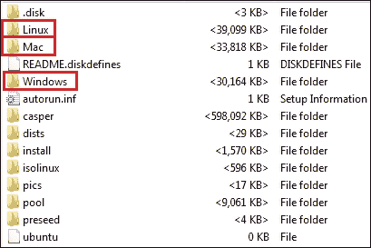

# 第四章：非易失性数据获取

在本章中，我们将讨论**硬盘驱动器**或**HDD**的数据获取。数据获取至关重要，因为对原始硬盘执行分析可能导致包含数据的唯一硬盘损坏，或者你可能会不小心写入该原始硬盘。

因此，从硬盘创建法医映像必须在分析之前进行。HDD 的获取可以在事件现场或分析实验室进行，无论是实时系统还是关机系统，且可以通过网络或本地进行，正如本章所述。

简而言之，我们将涵盖以下主题：

+   法医映像

+   事件响应 CD

+   硬盘的实时映像

+   使用 Linux 进行硬盘映像

+   数据获取中的虚拟化

+   证据完整性

+   Linux 中的磁盘擦除

# 法医映像

硬盘映像是创建受害者或嫌疑人硬盘的精确法医映像的过程，以便对映像硬盘进行分析，而不是对原始硬盘进行分析。要创建硬盘的精确副本，可以遵循两种选项：

+   **复制**：这是指该过程的目标是整个硬盘。在某些参考资料中，当目标硬盘与源硬盘具有相同的品牌、型号和大小时，此步骤可以称为克隆。复制可以使用所谓的**法医硬件复制器**进行。这些是硬件设备，基本上具有两个接口，用于连接源硬盘和目标硬盘。一旦它们开始工作，它们将仅仅将数据块从源硬盘复制到目标硬盘，而不管源硬盘使用的文件系统结构。

    通常，硬件复制比其他软件工具更快，因为它以线速运行。一些复制器具有特殊的功能，例如在获取过程中执行某些搜索操作，或者它们可以在相同的时间内创建最多八个副本。复制也可以使用软件工具进行，例如`dd`，前提是工具的目标是一个完整的硬盘，而不是文件。本章稍后会讨论这一点。

+   **映像**：这是指硬盘的目标是一个容器文件或映像文件。这个映像可能具有不同的格式，这将在本章稍后讨论。

在接下来的部分，将介绍一些技术和工具——这些包括软件复制和映像——并进行说明。

# 事件响应 CD

由于**事件响应**（**IR**）过程中所需的速度，使用事件响应 CD 可以节省宝贵的时间。IR CD 通常是 Linux 发行版。这些发行版包含许多事件响应和数字取证工具，主要用于从目标系统启动，以获取不同类型的可能证据，而无需断开硬盘。

该工具的设计旨在对目标系统留下最少的痕迹，因此它默认启用对所有连接的硬盘的写保护。这样，用户仅能授予目标硬盘写入权限。最好在系统从事件响应 CD 启动之前不要连接目标硬盘。当然，从 IR CD 启动意味着所调查的系统已关闭，您将启动机器并从 CD 启动。在这种情况下，无法访问正在运行的系统内存。

IR CD 还具备采集实时系统内存和硬盘的功能。您需要插入 CD 并运行成像程序以获取内存和硬盘数据。

在接下来的章节中，我们将讨论一些可用的 IR CD 示例。

## DEFT

**数字证据与法医工具包** (**DEFT**) 包含许多采集与分析工具，可用于在调查员从其启动机器时进行现场分析：


启动 DEFT CD

DEFT 还配备了 **数字高级响应工具包** (**DART**)。DART 可以在 Windows 实时系统中运行，并在每个事件响应步骤中提供一套独特的工具。使用 DART，您可以执行以下操作：

+   获取 Windows 内存和硬盘

+   在需要时执行实时数据恢复

+   对一些 Windows 伪影进行法医分析

+   收集正在运行的系统信息

+   监控系统网络

您可以在以下截图中查看 DART 界面：


事件响应工具 DART

## Helix

Helix 是一款 IR CD，提供免费版和商业版。它可以在三种操作系统上运行：**Windows**、**Linux** 和 **Mac**，并支持实时数据采集。以下截图展示了这一功能：



图 A：Helix 在实时采集中的不同操作系统支持

和 DEFT 类似，您可以从 Helix CD 启动，以应对系统断电的情况。在这种情况下，您可以将硬盘克隆到另一块硬盘，并执行硬盘复制器的相同功能。请前往 **应用程序** | **采集与分析** | **Helix pro**。在打开的窗口中，您可以将硬盘克隆或制作最多四个镜像，无论是从系统内存还是系统硬盘。Helix 还可以计算镜像的哈希函数：MD5、SHA1、SHA256 或 SHA512，甚至全部计算：


从 Helix IR CD 启动

# 硬盘的实时成像

在实时系统的情况下，您需要执行以下操作：

+   如前所述，首先制作易失性数据的镜像，例如系统内存

+   关闭系统电源

+   断开硬盘连接

+   单独成像硬盘

然而，在某些情况下，您还需要在不关闭系统的情况下成像硬盘。例如，如果系统是托管关键服务的服务器，无法停机，或者系统中存在加密，如果系统关闭将重新激活加密。这就是为什么实时采集始终是首选的原因。

## FTK Imager 在实时硬盘采集中的应用

在本节中，我们将使用 FTK Imager 对实时目标机器的硬盘进行成像。我们将使用 FTK Imager Lite（[`accessdata.com/product-download/digital-forensics/ftk-imager-lite-version-3.1.1`](http://accessdata.com/product-download/digital-forensics/ftk-imager-lite-version-3.1.1)），它无需安装，以便在实时系统中留下最少的痕迹。导航到 **文件** | **创建磁盘映像**。

在弹出的窗口中，选择以下源证据类型之一：

+   **物理磁盘**：这是整个硬盘，从 MBR 开始，一直到硬盘的最后一个扇区

+   **逻辑磁盘**：这是硬盘中的一个分区。

+   **图像文件**：这是指如果您需要将图像从一种格式转换为另一种格式，也就是从 E01 格式转换为原始格式

在我们的案例中，我们将选择整个物理硬盘。现在，您需要选择源硬盘，并确保选择目标机器的正确硬盘。完成此操作后，您将有机会选择您希望使用的图像类型。以下是三种最重要的选项：

+   **原始图像格式**：这只是硬盘的逐位拷贝，没有丢失或添加任何一个比特。此图像格式通常伴随一个单独的文件，包含图像文件的元数据信息。

+   **E01**：这是**EnCase 证据文件**。它包含与采集过程相关的信息，例如调查员姓名、时间戳和采集期间的键入笔记。它会为每 32 KB 的数据计算校验和，并在图像文件末尾添加整个比特流的 MD5 哈希值。

+   **AFF**：这是**高级取证格式**，用于存储磁盘映像和取证图像的元数据。这不是专有格式，而是开放格式，可以与任何分析工具一起使用，并且不会仅限于单一工具。

在原始成像过程后，您仍然可以将图像从一种格式转换为另一种格式。因此，我们可以始终选择原始格式，然后转换为在分析阶段需要的任何其他格式。现在，您需要添加目标信息，考虑到您正在操作一个实时系统，并且没有启用写保护。请小心并选择外部附加存储或网络共享文件夹中的目标文件夹。

有一个选项可以将映像划分为多个文件。你可以指定单个文件的大小。如果你在单个硬盘上没有足够的存储空间并需要将映像分割到不同的硬盘上，这个选项会非常有用。对于 FAT32 格式的卷，它无法处理超过 4 GB 大小的文件，这个选项也会很有帮助。

此外，你可以在同一过程中创建多个映像，如果有多个调查员在同一案件中工作，这将节省一些时间。

你可以选择在创建映像后验证该映像，方法是计算映像的哈希函数并将其结果与硬盘的哈希函数结果进行比较。如果匹配，则说明映像未被更改。哈希函数将在本章稍后讨论：


FTK——选择映像目标位置

### 注意

FTK Imager 将硬盘逐位成像到一个单独的文件映像中。你不能像使用复制工具那样将硬盘成像到另一个硬盘。

## 使用 FTK Imager 进行网络映像

在某些情况下，你无法通过 USB 连接到目标系统以运行工具并连接存储设备。在这种情况下，你可以通过网络获取该系统的映像。

你需要做的是将你的机器与目标系统连接到同一个网络，并确保目标系统能够通过 ping 命令访问你的机器。从你的机器验证是否有足够的空间可用。现在，创建一个新文件夹，并以合适的读/写权限共享该文件夹。

在我们的示例中，共享文件夹的名称是`Share`，并且位于`C:\`。处理机的 IP 地址为 192.168.57.128，源/目标机器是 Windows 7 系统：

1.  为了测试共享文件夹的可用性，请从源机器的**运行**窗口中运行`\\192.168.57.128`命令，如下所示：

    打开共享文件夹

1.  必须弹出认证窗口。输入机器 IP、用户名和用户密码：

    共享文件夹认证

1.  如果一切顺利，你将看到一个名为**Share**的文件夹。右键单击该文件夹并选择**映射网络驱动器**。你可以选择任何驱动器字母，在我们的案例中，我们选择了字母`Z`：

    映射共享文件夹

1.  现在，从源机器运行 FTK Lite 程序，然后从**文件**中打开**创建磁盘映像**。按照相同的步骤进行操作，并在选择映像位置时浏览到已映射的网络驱动器；它可能会要求你再次进行身份验证：

    将映像保存到共享文件夹

1.  点击**完成**按钮后，你会看到一个进度条，表示已从整个硬盘大小中捕获的数据量。

在处理机上，你将找到一个名为`image.raw`的文件，它被创建在 Share 共享文件夹下，并且你可以看到文件大小的增加，直到它达到目标机器硬盘的最大大小。

## 事件响应光盘在实时采集中的使用

如前所述，事件响应光盘带有内置的、易于访问的工具来执行不同的任务。这个任务之一是对实时系统的硬盘进行镜像，正如 DART 工具集和 Helix 所做的那样。

使用 Helix 时，如果它在实时系统中没有自动启动，你可以从合适的操作系统文件夹中打开该程序（在*Helix*部分的*图 A*中）。该程序将以相同的界面工作，但如果在实时系统中工作，你将无法复制硬盘。由于硬盘处于不稳定状态，并且操作系统的操作会不断改变它，克隆选项将不会出现在列表中。在映像过程之后，会进行验证过程。它会计算结果映像的哈希值，并将其与映像过程中比特流的哈希值进行比较。如果哈希值匹配，意味着映像没有错误。

为了通过网络获取映像，Helix 内置了相应的功能，采用相同的服务器/客户端概念。在目标机器上，即处理机，你需要从相同的 `receiver.exe` 文件夹中运行网络监听器：


Helix 网络监听器

在提供了完整的信息后，开始监听任何网络连接请求。

在源机器上，选择目标为 Helix 接收器。然后设置连接，输入监听器的 IP 地址、相同的端口，以及密码（如果有）：


启动采集过程后，监听器中将开始一个新连接，并且在目标机器上指定的位置可以找到一个新的映像文件。

# 用于硬盘镜像的 Linux

假设你已经有一个无法启动的系统，并且需要取出机器的硬盘以进行镜像。你需要做的第一件事是确保通过写保护器将硬盘连接到你首选的 Linux 机器，以防止任何意外写入硬盘，这可能会改变证据并使其无法作为证据使用。

## `dd`工具

在 Linux 操作系统中，有一个内置工具叫做`dd`。`dd`工具被认为是一个法医学上可靠的工具，因为它复制数据块，不管其结构如何。关于`dd`的含义有很多建议，但我们可以说，`dd`代表**重复磁盘**或**重复数据**，如果有人错误使用它，它也可能成为**磁盘销毁器**或**删除数据**。这个工具可以转换并复制文件和硬盘。

假设可疑的硬盘是源硬盘，并且通过写入阻断器连接，挂载为`/dev/sda`，目标硬盘挂载为`sdb`。我们有以下两个选项：

+   将硬盘映像到一个文件中，这在空间管理、在同一案件中不同调查员之间传输映像文件以及案件归档时非常有用，如前所述。在这种情况下，你将使用具有根权限的`dd`工具，命令如下：

    ```
    dd conv=sync,noerror bs=64K if=/dev/sda of=/media
        /Elements/HD_image/image.dd

    ```

    从这里，我们可以看到以下内容：

    +   `conv = sync, noerror`：如果由于某种原因无法读取数据块，则会用空值填充该块的左侧；`dd`将继续执行，并且不会因错误而停止。

    +   `bs`：这是每个传输数据块的大小。考虑到较大的块大小可能更快，但选择较小的块大小更高效。假设你选择`bs`为 4MB，那么如果发生错误在第一个 4MB 的扇区，后续的所有数据块都会被忽略，这可能会导致在成像过程中丢失一些重要数据。

    +   `if`：这是输入文件，可以是整个硬盘或单个分区。

    +   `Of`：这是输出文件。

    +   `/media/Elements`：这是目标硬盘的挂载点。

    +   在这种情况下，光标将在成像结束之前保持静默。

+   现在，有一种方法可以查看成像过程的进度，这有助于故障排除并检测在采集过程中发生的任何问题，可以通过将`dd`命令与`pv`结合使用，像下面这样进行管道传输：

    ```
    dd conv=sync, noerror bs=64K if=/dev/sda | pv | dd
        of=/media/Elements/HD_image/image.dd

    ```

    在这里，你将看到一个移动的进度条，这意味着进程仍在运行，显示成像大小和成像速度：

    

    添加进度状态

### 通过网络使用 dd

你也可以通过网络使用`dd`，结合`nc`（netcat）。要执行此操作，在目标机器（IP 为`192.168.57.128`）上打开端口 3333 的监听器，并将接收到的数据通过管道传输给`dd`，指定所需的存储位置和输出文件名：

```
nc -l -p 3333 | dd of=/media/root/elements/HD_image
    /image.raw

```

否则，你可以直接将输出重定向到所需的文件：

```
nc -l -p 3333 >  /media/root/elements/HD_image/image.raw

```

你可以在下面的截图中看到这一点：


通过网络使用 netcat 的 dd（在目标机器上）

在目标机器上，启动`dd`并将输出通过管道传输到`nc`客户端，如下所示：

```
dd conv=sync,noerror bs=64K if=/dev/sda | pv | nc 
    192.168.57.128 3333

```

输出如下：


通过网络使用 netcat 的 dd（在源机器上）

将整个硬盘复制到另一块硬盘。在这种情况下，你可以使用之前的所有步骤，但需要在`/dev`下提到硬盘的驱动器分配位置，而不是指定目标文件路径。因此，在第一个示例中，`/media/Elements/HD_image/image.dd`将被替换为`/dev/sdb`。

使用`dd`工具，你可以将一个镜像恢复到硬盘。你只需要将输入文件改为镜像，将输出文件改为硬盘，如`/dev/sda`：

```
dd if=/media/Elements/HD_image/image.dd of=/dev/sda

```

# 数据采集中的虚拟化

虚拟化为数字取证科学提供了巨大的优势。在虚拟化中，一切都是文件，包括客户机内存和客户机硬盘。操作人员需要做的是识别需要获取的源文件，并将该文件复制到外部存储。

大多数虚拟化程序中的快照概念为调查人员提供了在不同时间点的更多机器图像。如果获取并分析这些图像，可以查看机器的时间轴行为，即恶意软件感染前后的状态：


虚拟机中的 Windows 内存文件

在上一张图像中，我们可以看到 VMware 程序的 `vmem` 文件。VMware 是一种虚拟化程序。此图像包含当前内存文件以及两张在两个不同日期拍摄的快照所对应的两个 `vmem` 文件。这些文件的大小都相同，因为这就像内存转储过程，它复制了整个机器的内存。

# 证据完整性（哈希函数）

我们如何证明证据没有被篡改或更改呢？如果需要在法庭上证明这一点，这是非常重要的，证明在成像或分析过程中你没有添加、删除或编辑证据。大多数成像工具都包含多种哈希函数实现，如 MD5、SHA1 和 SHA256。哈希函数是一种数学实现，它是不可逆的或单向的。这意味着如果你有输入数据 A 和哈希函数 F，你将得到 *F(A) = H*。然而，已经证明 *F'(H) != A*，其中 *F* 是哈希函数，*F'* 是任何数学函数。我们无法从 *H*（哈希摘要）得到 *A*（原始数据）。

例如，如果我们有不同的字符串应用于相同的哈希函数，则哈希函数必须将每个字符串映射到不同的哈希值：


哈希函数

如前图所示，应用所有文本到相同哈希函数后，每个文本的结果哈希都不同。即使是单一字符的变化，如前图中的 **Handling** 和 **Handlin**，输出也会截然不同。如果输入的微小变化引起哈希值的轻微变化，则该哈希函数被认为不够完美。

哈希碰撞发生在两个不同的输入在应用相同的哈希函数时产生相同的哈希值。因此，最好使用多种哈希函数，如 MD5 和 SHA512。

哈希摘要的长度不依赖于输入的长度。无论输入的长度如何，哈希的长度始终相同。这是与时间、可用处理能力和资源有关的事项。下表列出了几个著名的哈希函数及其摘要长度：

| **哈希算法** | **摘要长度** |
| --- | --- |
| MD5 | 128 位 |
| SHA-1 | 160 位 |
| SHA-256 | 256 位 |
| SHA-512 | 512 位 |

> *不同哈希算法的哈希长度*

使用 FTK Imager，你可以选择并创建图像进行验证。在图像创建后，这将使用不同的哈希函数来运行创建的图像，并将结果与在源文件成像过程中创建的摘要进行比较。此过程将生成一份小报告，显示摘要值以及是否匹配：


FTK Imager 中的哈希验证

你可以通过在链条的证据记录中写下接收到的证据摘要来证明你没有篡改证据。

### 注意

在 Linux 操作系统中，内置了一个叫做**md5sum**的功能，你可以将图像应用到它，它将为你计算 MD5 哈希。

值得一提的是，文件的内容是唯一影响哈希函数的因素，元数据和文件名不会影响哈希摘要。

在现场磁盘获取过程中，成像在特定的时间点运行。由于操作系统会不断使用和修改原始磁盘，因此无法保持原始磁盘的完整性。然而，从第一个创建的系统磁盘图像开始，证据的完整性可以得到保持。

# Linux 中的磁盘清除

如果调查员使用硬盘复制方法来成像硬盘，他们不能使用同一块硬盘处理两个不同的硬盘。这可能会导致来自不同案件的文件重叠，进而产生不可靠和不真实的结果。在完成复制硬盘的工作后，必须清除它并准备好用于另一个案件或硬盘。不要等到另一个案件分配给你后再清除，清除操作需要较长时间。

这个过程等同于成像过程，但源文件是一个充满零的文件。在 Linux 操作系统中，有一个`/dev/zero`文件。你需要将此文件作为输入文件提供给`dd`工具，输出文件则是需要清除的硬盘。另一个可以在此过程中使用的文件是`/dev/null`：

```
dd if=/dev/zero of=/dev/sda bs=2K conv=noerror,sync

```

# 总结

在本章中，我们介绍了一些 IRCDs，讨论了如何使用 IRCDs 和 FTK Imager 进行现场获取，以及如何通过 IRCDs 和`dd`工具进行网络成像。我们还讨论了如何保持证据完整性，以及如何为取证用途清除磁盘。

在下一章中，我们将讨论如何创建系统活动的时间轴，以及从数字取证角度来看，这一点为什么如此重要。
