# 第六章：文件系统分析与数据恢复

尽管现在有许多自动化和商业工具可供使用，理解这些工具的工作原理可以将它们区分开来，并在法庭上的专家证词中提供很大支持。文件系统分析和数据恢复被认为是数字取证过程中的主要类别。从存储设备中提取文件或恢复已删除的文件及其相关证据数据，能够解决案件。

在本章中，我们将介绍两种不同的文件系统：FAT 和 NTFS。我们将基本上解释每个文件系统中文件的结构，以及删除文件的恢复过程是如何工作的。我们将从著名的 TSK（The Sleuth Kit）开始，讲解其命令行工具如何分类，因为这些工具是基于硬盘或取证镜像中的每一层。之后，我们将讨论 TSK 的图形用户界面——Autopsy。最后，我们将向您展示 Foremost，它是一个基于 Linux 的文件雕刻工具，用于根据文件签名恢复文件。

# 硬盘结构

在我们开始解释不同的文件系统结构之前，我们需要说明 Windows 操作系统中分区硬盘的不同部分。下图简单地展示了整个分区硬盘的结构：

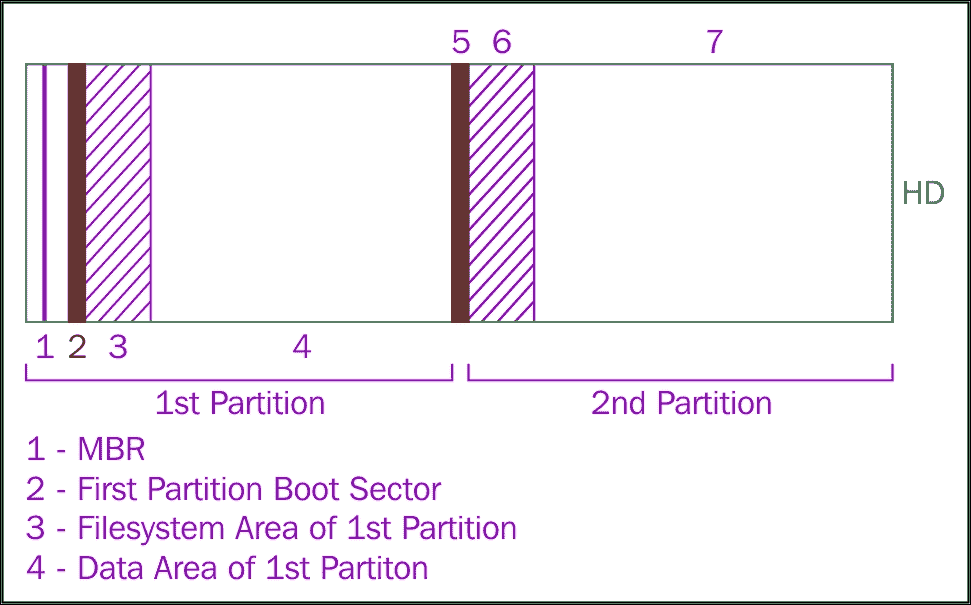

简单的硬盘逻辑分区

## 主引导记录

主引导记录是硬盘的第一个扇区（512 字节）。它包含除了引导代码之外的所有硬盘信息。在 MBR 中可以找到的一项重要信息是分区表，它包含关于硬盘分区结构的信息，对于每个分区，它能告诉分区的起始位置、大小和类型。

调查员可以通过 MBR 中的信息以及硬盘的打印大小来检查现有的分区是否匹配。如果有部分空间丢失，处理程序可能会假设有意图的操作隐藏了一些包含通常相关重要信息的空间。

## 分区引导扇区

每个分区的第一个扇区（512 字节）包含诸如文件系统类型、引导代码位置、扇区大小和与扇区相关的簇大小等信息。

## 分区中的文件系统区域

如果用户将分区格式化为例如 NTFS 文件系统，分区开始的某些扇区将被保留给**主文件表**（**MFT**）。MFT 是存储系统中文件元数据的位置。每个条目的大小为 1KB，当用户删除文件时，文件在 MFT 中的条目会被标记为未分配。然而，文件的信息仍然存在，直到另一个文件使用该 MFT 条目并覆盖之前文件的信息。

正常的备份通常只存储已分配的条目，忽略 MFT 中的未分配区域。这在分析步骤中无法帮助恢复已删除的文件。

## 数据区

在保留文件系统区域后，分区的其余空间将用于存储文件的数据，这些数据包含文件的实际内容。数据区的每个单元称为**簇**或**块**。同样，如果用户从硬盘中删除文件，包含与该文件相关的数据的簇将被标记为未分配，数据将一直存在，直到新的文件数据覆盖它。

这些簇被视为已分配或未分配：

+   **已分配簇**：这是包含与现有文件相关的数据的簇，并且该文件在文件系统 MFT 区域中有一个条目。

+   **未分配簇**：这是一个未连接到现有文件的簇，它可能是以下任何一种：

    +   **空**：这意味着没有已删除文件的数据，或者其内容已被擦除。

    +   **非空**：这包含与已删除文件相关的数据，并且仍未被新文件的数据覆盖。

在运行备份工具时，它只备份当前文件系统 MFT 区域中存在的文件，并将其相关的簇标记为数据区中的已分配。这不是一个取证上有效的影像，它需要获取所有硬盘区域，即使这些区域是用户删除的。这就是为什么当你使用无压缩方式备份系统时，备份的大小将是分区中已使用空间的大小。

然而，当使用取证影像技术时，生成的影像的大小将与源的大小完全相等；它将包括整个硬盘或单个分区。

在接下来的部分中，我们将快速概述 FAT 和 NTFS 的工作原理。

# FAT 文件系统

FAT 或文件分配表随着 1980 年微软发布 DOS 操作系统而广为人知。此后，FAT 经历了许多改进，试图使其适应快速发展的技术。因此，我们可以看到 FAT12、FAT16、FAT32 和 exFAT。每个版本都克服了文件系统的一些限制，直到 NTFS 文件系统的发布。

## FAT 组件

FAT 分区包含五个主要区域。它们包括以下内容：

+   **引导扇区**：这是分区的第一个扇区，加载到内存中。如果这个分区是活动分区，它包含的信息包括但不限于以下内容：

    +   **跳转代码**：这是引导程序和操作系统初始化代码的位置。

    +   **扇区大小**：这是几乎固定的（512 字节）。

    +   **簇大小**：这是以扇区为单位（扇区/簇）。

    +   **扇区数量**：分区中的扇区总数。

    +   **根目录项数量**：此值仅在 FAT12 和 FAT16 中使用。

+   **FAT 表**：这是文件系统，其名称来源于该区域。从文件的第一个簇开始，可以在文件的根目录项中找到，FAT 区域跟踪文件在数据区域中的其余部分。例如，簇 X 是包含文件 Y 数据的第一个簇，它在 FAT 区域中有一个条目。该条目可以有四个值：

    +   0：这表示簇 X 是一个未分配的簇

    +   **Number**：这表示簇 X 后续簇的编号，它包含文件 Y 的下一部分

    +   **EOF**：这是文件结束符，它表示簇 X 是包含文件 Y 数据的最后一个簇，即文件 Y 的结束。

    +   **BAD**：这表示簇 X 是一个坏簇，操作系统不能使用或访问它。此数据跟踪模式被称为 FAT 链，并且每个文件必须存在该链。

+   **FAT 表的另一个副本**：如果第一个 FAT 损坏，则使用此副本。

+   **根目录项**：每个条目描述文件系统中的目录或文件，以及它从根目录的起始位置。每个条目包含以下信息：

    +   使用 8.3 命名规则的短文件名；文件名有 8 个字符，扩展名有 3 个字符

    +   长文件名：如果文件名超过 8.3 规则，则会保留另一个完整条目来存储文件名

    +   条目的状态，如目录、文件或已删除

    +   一些文件属性，如只读、隐藏和归档

    +   文件大小，在目录的情况下不重要

    +   文件的时间戳

    +   包含文件数据的第一个簇的地址

    正如我们所看到的，无法向文件添加现代属性，如压缩、权限和加密，这也是 FAT 文件系统的局限之一。

+   **数据区域**：这是分区的其余部分。它包含分区中文件的实际内容，并且它被分为簇，簇的大小在引导扇区中定义。簇编号从簇 2 开始，因此簇 0 和簇 1 不存在。

关于这个工作原理的示例，我们创建了表 1。每一列代表 FAT 区域之一，不包括引导扇区。现在，假设第一个文件 `F1.txt` 的大小为 1KB，并且从簇 2 开始：

+   簇 2 包含 `F1.txt` 文件的第一部分

+   在描述簇 2 的 FAT 条目中，我们将找到链中下一个簇，在我们的例子中是簇 3

+   在簇 3 中，我们可以找到 `F1.txt` 文件的下一部分

+   在描述簇 3 的 FAT 条目中，我们可以找到 EOF，因为 `F1.txt` 文件中不再需要存储其他数据。

同样适用于其他文件：

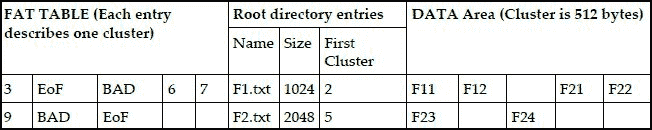

FAT 文件系统

## FAT 的局限性

FAT 存在一些严重的局限性，这引发了对更先进文件系统的需求：

+   每个 FAT 后面的数字，如`FAT12`、`FAT16`或`FAT32`，代表在 FAT 表中分配给簇的位数：

    +   **FAT12**：这是 2¹² = 4,096 个簇的最大值。

    +   **FAT16**：这是 2¹⁶ = 65,536 个簇的最大值。

    +   **FAT32**：这是 2³² = 4,294,967,296 个簇，但它有 4 个保留位，因此实际上是 28 位。所以，2²⁸ = 268,435,456 为最大值。

    +   **exFAT**：使用全部 32 位进行寻址。

+   FAT32 中的最大分区大小 = 最大簇数，即 268,435,456，乘以最大簇大小，即 23 KB = 8,589,934,592 KB = 8 TB。

+   以 FAT32 为例，FAT32 中的最大文件大小，存储文件大小的比特字段为 32 位。它能够存储的最大数字是 2³² = 4,294,967,296 字节 = 4 GB。所以，FAT32 能够处理的最大文件大小为 4 GB。这就是为什么我们无法在 FAT32 文件系统中存储大于 4 GB 的文件。

+   诸如访问控制和加密等属性在 FAT 文件系统中不可用。

# NTFS 文件系统

**NTFS**或**新技术文件系统**是 Windows NT 中的默认文件系统，源于存储容量的增加，以及对更安全、可扩展和高级文件系统的需求。NTFS 克服了 FAT 的限制，更适合高存储容量。在 NTFS 中，一切都是文件，包括文件系统区域本身，正如我们将在下一节中看到的。

## NTFS 组件

像 FAT 和其他任何文件系统一样，NTFS 也有以下组件：

引导扇区是分区中的第一个扇区，包含有关文件系统本身的一些信息，如启动代码、扇区大小、簇大小以及保留扇区数量。文件系统区域包含许多文件，包括 MFT（主文件表），它存储分区中文件和目录的元数据。稍后会详细讨论。

+   数据区存储文件的实际内容，并且它被分成簇，簇的大小是在格式化时确定并在引导扇区中标明的。

## 主文件表（MFT）

由于 NTFS 中的一切都是文件，因此文件系统区域也是一个名为$MFT 的单一文件。在这个文件中，每个分区中的文件都有一个条目。每个条目的大小为 1,024 字节。实际上，$MFT 文件本身也有一个条目。每个条目开头都有一个 42 字节的头部，并且具有 0xEB52904E 的签名，这在 ASCII 中等同于 FILE。

签名也可以是 BAD，这表明此条目发生了错误。头部之后，会有剩余的 982 字节用于存储文件元数据。如果还有空间存储文件内容，通常是小文件，文件的数据会直接存储在条目中，而不会占用数据区的空间。

每个 MFT 条目都有另一个称为**属性**的子结构。MFT 使用属性来存储文件的元数据。在单个 MFT 条目中可以使用不同类型的属性。每个属性都被指定用于存储不同的信息。例如，标准信息属性包含文件的时间戳和大小，而数据属性则包含文件的实际内容。

属性可以是以下之一：

+   **驻留**：此属性将其所有数据保存在 MFT 条目内。

+   **非驻留**：由于 MFT 大小的限制，一些属性可能需要将其数据存储在数据区。这种属性的一个明显例子就是数据属性。

将文件元数据存储在属性中为 NTFS 提供了灵活性，使其能够在未来添加操作系统可以识别的更多属性类型。如果一个文件有多个属性并且需要多个 MFT 条目来存储其元数据，它可以使用另一个条目，并通过序列号将两个条目链接在一起。

# The Sleuth Kit (TSK)

The Sleuth Kit（TSK）是由*Brian Carrier* 和 *Wieste Venema* 开发的一组开源数字取证工具。TSK 可以读取并解析不同类型的文件系统，如 FAT、NTFS 和 EXT。图中硬盘的每个区域在*硬盘结构*部分都有一组工具，这些工具会解析该区域并提取对调查人员重要的取证信息。通常，在分析时使用 TSK 的每一步都会引导到下一步。

在接下来的章节中，我们将详细介绍 The Sleuth Kit 的不同工具集。我们将使用一张安装了 Windows 7 的硬盘映像，展示硬盘各部分的结果。该映像是通过 FTK Imager lite 从一台 Windows 7 虚拟机获取的，大小仅为 15 GB，并且只有一个 NTFS 分区。

如我们将看到的，TSK 工具的名称易于理解，因为它们由两部分组成。第一部分代表正在调查的区域或层次，例如 `mm` 表示媒体管理，`fs` 表示文件系统，`i` 表示元数据，`f` 表示文件名层次。第二部分是正常的 Linux 命令，反映该工具的作用，例如 `ls` 列出和 `cat` 显示内容，例如 `mmls` 工具。

## 卷层（媒体管理）

在硬盘的这一部分，TSK 从**MBR**（主引导记录）中解析有关整个硬盘结构的信息，MBR 是硬盘的第一个扇区。我们可以使用 TSK 和不同的工具解析这一部分。

每个分区的信息都位于硬盘上，并且可以从 MBR 扇区末尾的分区表中确定。每个分区的偏移量将作为输入传递给即将使用的 TSK 工具，用以指定感兴趣的分区。`mmls` 工具用于列出信息，如下图所示：

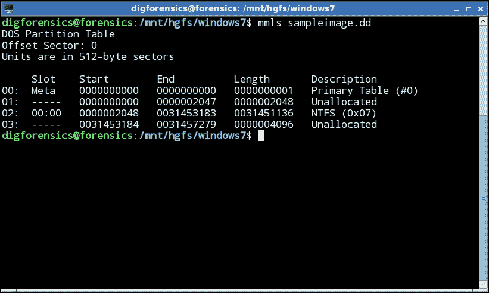

mmls 工具

从对图像运行 `mmls` 的结果中，我们可以看到只有一个 NTFS 分区，从扇区（2,048）开始。这个分区是我们关注的分区，因此在需要时，我们将使用起始扇区作为其他工具的偏移量。此结果还提供了分区表类型，在我们的例子中为正常的 DOS 类型。要仅显示已分配的卷，我们可以使用 `-a` 选项：

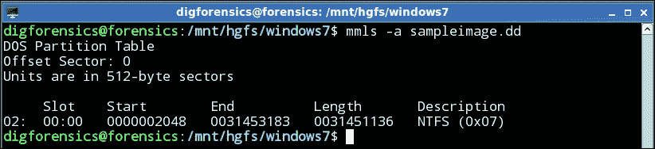

仅列出已分配的卷

下一个命令是 `mmcat`，它显示分区内容，如下图所示：

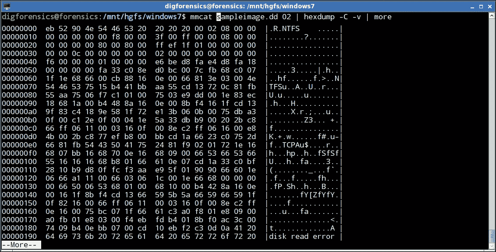

mmcat 工具

在前面的图中，我们使用 `mmcat` 和图像名 `sampleimage.dd` 以及目标分区编号 `mmls` 输出中的 `02`。然后，我们将输出管道传递给 `hexdump` 工具。你可以看到在分区的开头，卷引导记录以 NTFS 分区签名从偏移量 0x03 开始，值为 (NTFS) 或 0x(4E54465320202020)。

## 文件系统层

该层的 TSK 工具解析提供的分区中使用的文件系统，并向调查员显示一些相关信息。使用此工具时，我们必须提供从 mmls 工具输出中获得的目标分区的偏移量，在我们这里是（2,048）：

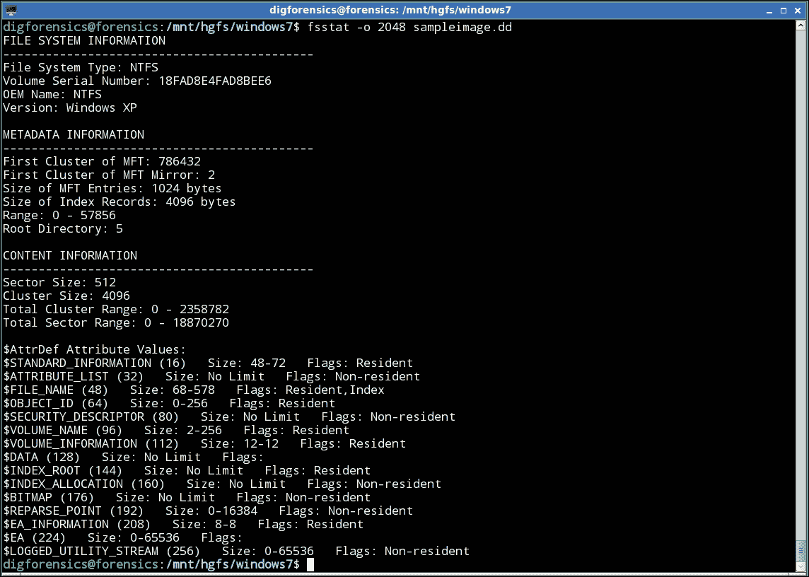

fsstat 工具

我们可以在分区中找到 MFT 位置、簇大小以及有关 NTFS 属性的信息，这些信息可能在进一步分析中使用。

## 元数据层

元数据层（或称 inode）解析并描述文件系统中记录的文件信息或元数据。此工具的输出也可以与其他工具一起使用，以便在图像中针对特定文件缩小结果范围。

此层命令中的 `i` 字符代表 inode——EXT 文件系统中文件的唯一元数据编号。

`ils` 命令用于列出图像中已删除文件的 inode 编号，直到被告知列出图像中所有文件的 inode 信息。`ils` 的所有结果都包含关于文件的信息，包括文件的 inode、Unix 时间格式的时间戳（MACB）以及文件大小。如果需要为文件活动创建时间线，我们可以使用带有 `-m` 选项的 `ils` 生成与 `mactime` 工具兼容的输出。

此外，使用 `--m` 选项将允许我们读取文件名，如下图所示：

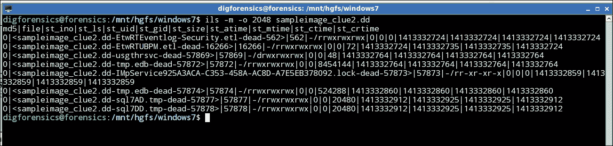

使用 `ils` 列出已删除文件

结果仅显示已删除的文件，因为我们可以注意到所有文件在结果中的 'dead' 状态。

### istat

该工具用于通过唯一的元数据编号解析 MFT 或 inode 记录，并查看提供的记录中的所有信息。结果信息仅包含元数据，因此我们可以找到时间戳、文件属性等，但不能看到数据本身，即使数据足够小，可以适应一个 MFT 记录的 1,024 KB 长度，这种情况称为“驻留”数据。

显示文件的数据内容可以通过 TSK 中的另一个工具来确定，接下来将讨论这个工具。NTFS 文件系统中的每个文件都有这种类型的条目，甚至包括 MFT 文件本身。在下面的图中，我们将列出关于第一个记录号 0 的信息，这就是 $MFT 文件本身：

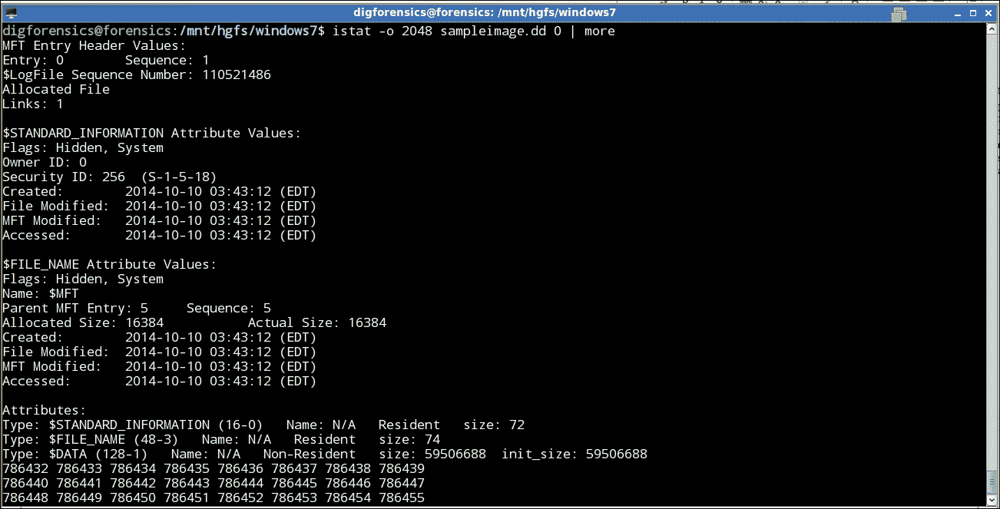

istat 工具用于查看文件的元数据

### icat

这个工具用于查看特定数据单元的内容。它使用 inode 号作为参考，查看与该文件相关的数据块。在正在调查的取证镜像中，我们将查看 inode 0 的 $MFT 文件内容：

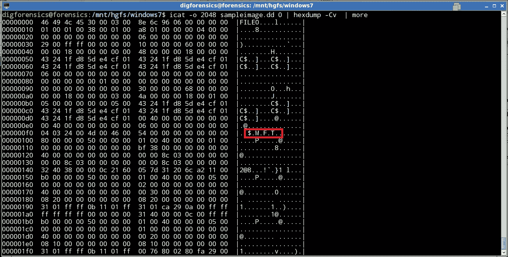

$MFT 文件的内容

在某些情况下，恢复已删除的文件对正在调查的案件会有帮助。我们可以使用 icat 工具将任何已删除文件的内容复制到调查员机器上的另一个文件中以供进一步分析。对于 $MFT 文件，还有一些其他工具，可以单独解析 MFT 文件并以树状视图列出文件系统的内容：

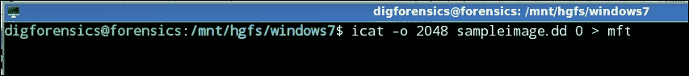

使用 icat 复制已删除文件的内容

### ifind

在分析过程中，如果调查员例如进行了一次文字搜索，并且在某个分区的数据单元中找到匹配项，那么他们现在需要将这个数据单元与文件系统中的一个条目关联起来，`ifind` 正是他们需要的工具。与之前的工具不同，`ifind` 可以接受数据单元号或文件名作为输入，并将该输入映射到文件系统中相应的条目，以收集关于该文件的其他信息。在我们的例子中，我们将尝试找到 `hiberfile.sys` 文件。

若要通过文件名进行搜索，我们需要使用 `--n` 选项：

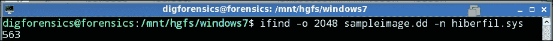

使用 ifind 按文件名搜索

结果显示，与名为 `hiberfil.sys` 的文件相关的 inode 号是 `563`。再次使用 `istat` 查看与该文件相关的信息，将揭示该文件的详细信息：

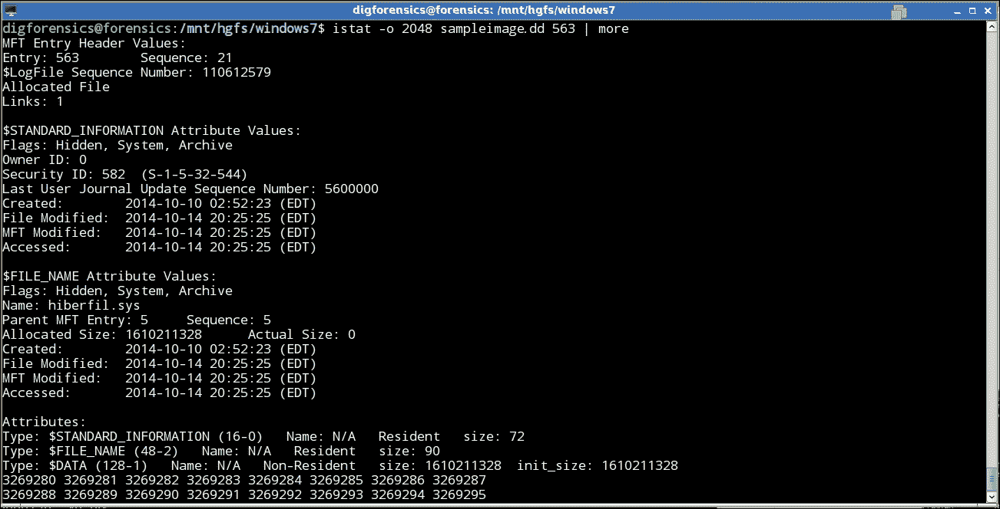

关于 inode 563 的文件的完整信息

`hiberfil.sys` 文件是在用户选择使用休眠选项时，将内存的副本存储到硬盘中，用于死机系统分析。该文件对调查员有很大帮助，因为它提供了系统在上次休眠时内存的快照，并且可以从该文件的时间戳中获取。这文件是一个已分配文件，像之前处理 $MFT 文件一样，它可以从镜像中提取出来，然后用于内存分析。

如果我们需要使用 ifind 工具与数据单元号一起使用，则需要使用-d 选项。我们将获得另一个唯一 ID，描述文件在镜像中的位置。这个唯一 ID 将在下一部分——文件名层中讨论。在此示例中，我们使用了数据单元 ID 3269280，这是`hiberfil.sys`文件的一个数据单元：

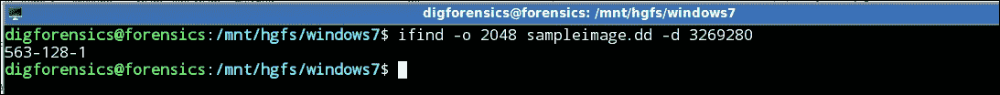

使用 ifind 进行数据块地址查找

## 文件名层

工具在此层中工作，用于列出硬盘镜像中的文件结构。每个文件都会分配一个唯一的 ID，可以与其他工具结合使用，特别地定位此文件。

要列出分区下的文件，我们只需提供分区偏移量给工具：

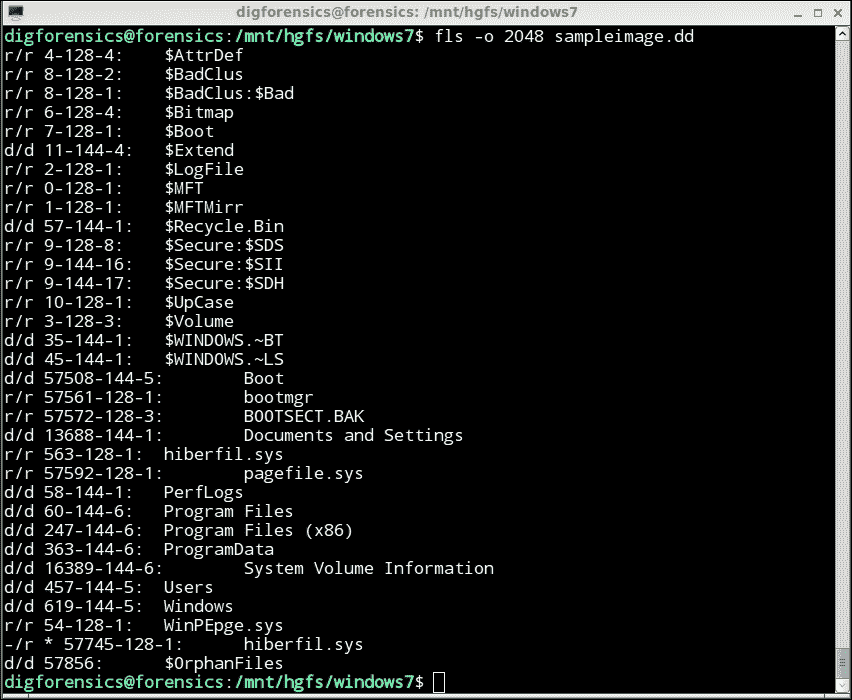

使用 fls 工具浏览分区内容

在前面的图中，我们可以看到已删除的`hiberfil.sys`，其元数据地址为 57745，已分配的则是元数据地址 563。

如果我们需要浏览另一个目录（例如，Users 目录），我们可以向工具提供 Users 目录的唯一 ID（457-144-5）：

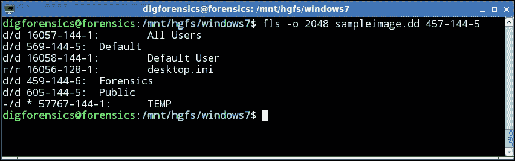

使用目录 ID 与 fls 工具进行内容列举

如我们所见，我们正在浏览镜像的内容，而无需将任何分区或文件系统挂载到运行中的操作系统。

ffind 工具仅用于将元数据地址映射到文件名，无论其相关文件是已删除还是已分配：

映射元数据地址到其文件名

## 数据单元层（块）

在这一层中，文件的实际内容被存储。文件的元数据必须指向文件内容在此区域中的位置，正如我们之前用`ifind`工具讨论的那样。

### blkcat

这是用于显示镜像中特定数据单元内容的。假设我们需要显示 Windows 目录中`ntdll.dll`文件的第一个数据单元。首先，我们可以使用`ils`工具找到该文件的元数据地址，并用`ntdll.dll`文件名进行 grep 查找：

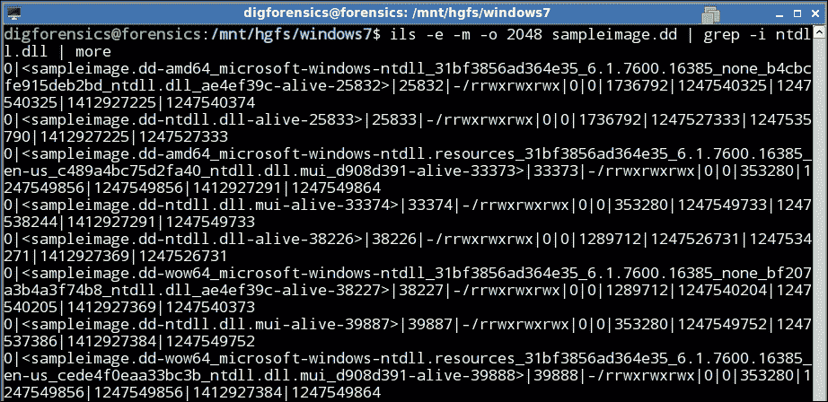

ntdll.dll 文件的元数据地址

从结果来看，`ntdll.dll`文件中的一个文件有元数据地址`25833`。第二步是使用`istat`工具通过其元数据地址查找分配给该文件的数据单元：

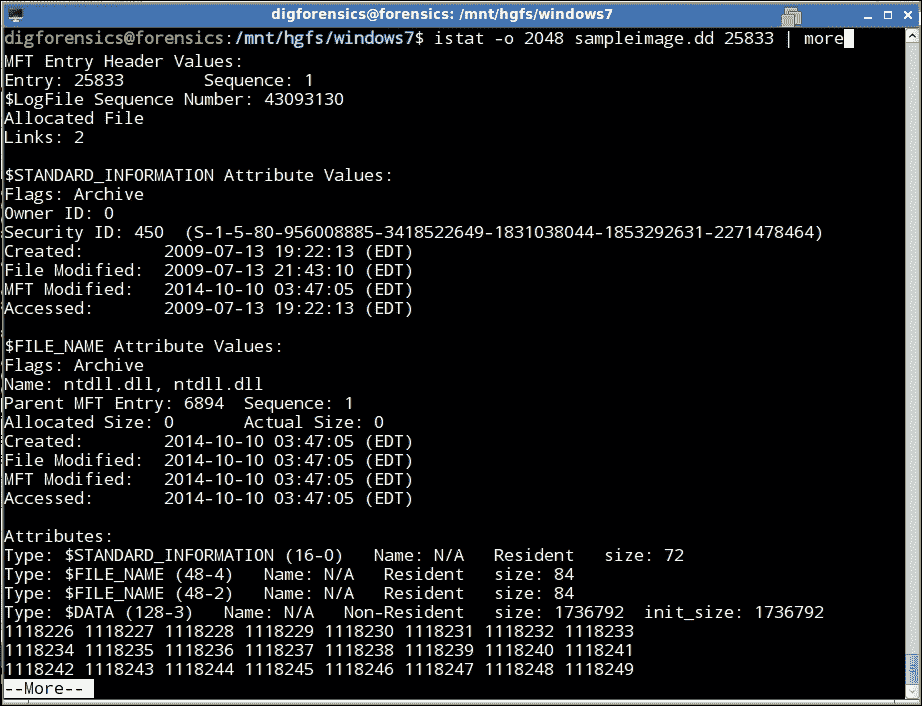

通过 istat 工具获取的 ntdll.dll 文件的完整信息

结果显示，该文件的第一个数据单元号为`1118226`。我们现在需要做的是使用`blkcat`工具查看该数据单元的内容。我们将使用`--h`选项以十六进制视图查看内容：

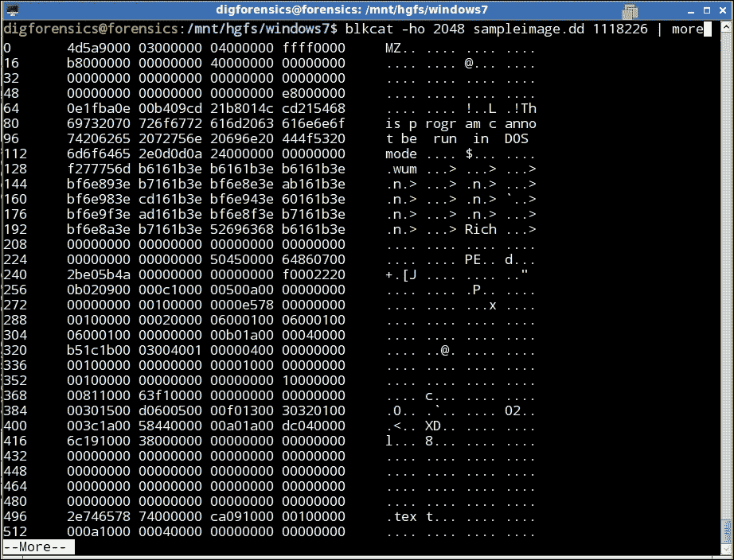

使用 blkcat 显示一个数据单元的内容

### blkls

该工具的默认设置是显示镜像文件中的未分配簇，以便进行进一步分析，如文件雕刻和恢复。如果我们使用带有 -e 选项的该工具，它会收集一个文件系统的所有块，如果我们需要从一个多分区的大镜像中提取一个分区，这将非常有用。在这里，我们只需收集镜像中的所有未分配空间，并将输出定向到一个名为`unallocated.blkls`的文件或屏幕上。

生成的文件将具有分区中空闲空间的相同大小。然后，可以对该文件进行进一步分析：

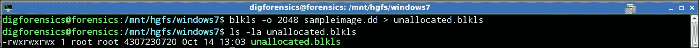

使用 blkls 收集所有未分配空间到一个文件中

### Blkcalc

为了理解这个工具的目的，假设我们对未分配空间进行了某些分析，例如关键词搜索，并且找到了与正在调查的案件相关的匹配项。为了将找到的位置映射到完整镜像，我们需要使用`blkcalc`工具。

# Autopsy

Autopsy 是一个基于 Web 的 TSK 界面，它使用 TSK 中相同的工具并以图形界面展示结果。为了使用 TSK 进行分析，调查员需要首先从命令行启动服务器。启动 Autopsy 后，它会给调查员提供一个 URL，通过该 URL 可以从互联网上访问它，在此案例中为`http://localhost:9999/autopsy`。在分析过程中不要关闭 Autopsy 进程，否则分析将无法进行：

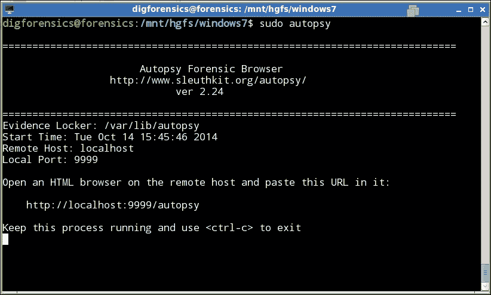

启动 Autopsy

然后，从浏览器中打开该 URL 以开始创建案件：

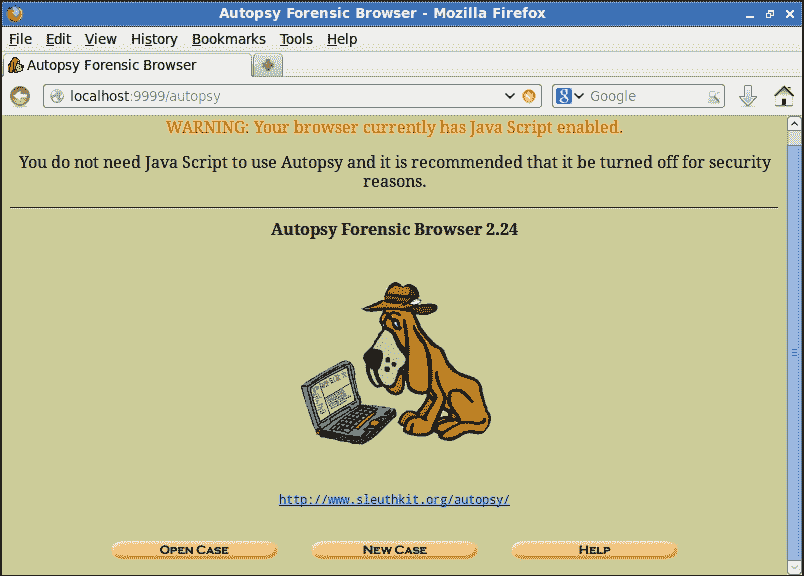

Autopsy 界面

我们需要创建一个新案件，然后输入一些案件信息，以便调查员能够方便地跟踪案件以及每个案件的负责人：

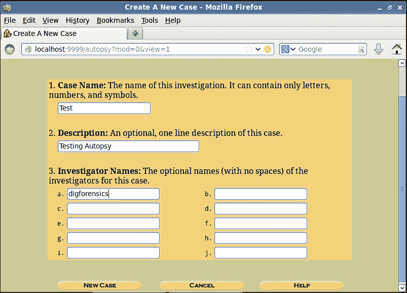

创建新案件

创建案件后，默认会在`/var/lib/autopsy`下创建一个与案件同名的目录，其中包含案件的所有文件。我们所做的仅仅是创建案件；现在，我们需要添加与案件相关的所有主机，并添加我们之前从每个主机获取的镜像。这样做是为了跟进分析结果，并能够区分结果的来源。

如果调查中的案件发生在不同的时区，也就是说，涉及的硬盘运行在不同的时区，调整每个主机的时区是一个非常好的主意，以便获得标准化的结果：

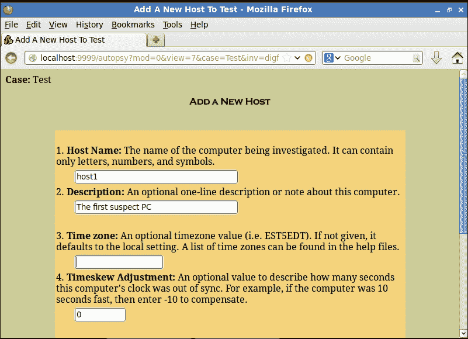

将主机添加到案件中

添加主机后，我们需要将主机映射到一个镜像：

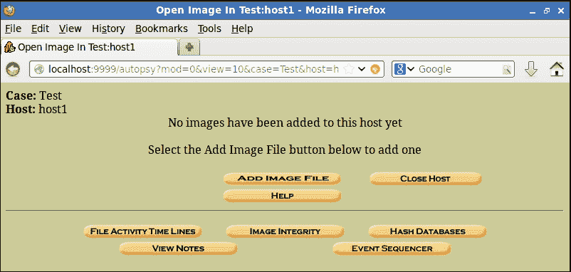

将主机映射到取证镜像

在此之后，您需要将每个主机映射到其对应的镜像。您需要输入镜像路径并指定它是磁盘镜像还是分区镜像。在我们的例子中，它是完整的磁盘镜像。我们可以选择使用同一个镜像并仅使用符号链接，或者直接复制或移动该镜像：

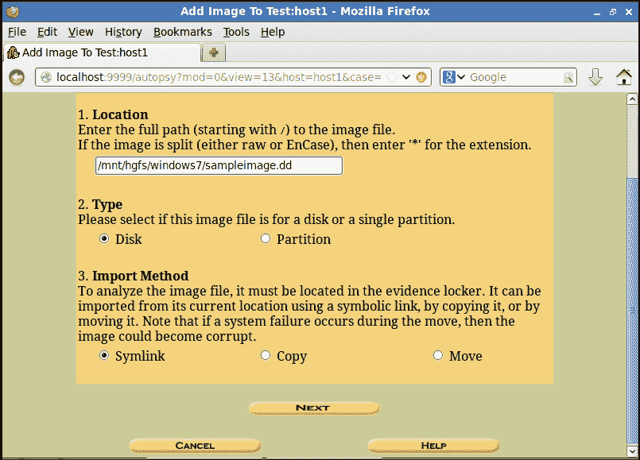

向主机添加图片

然后，系统会自动列出该镜像中所有已分配的分区，并显示每个分区的起始和结束扇区。这与我们在命令行中使用`mmls`工具时得到的结果相同，后者要求我们选择每个分区的挂载点。在我们的案例中，只有一个 NTFS 分区，我们将把它挂载为`C:`分区：

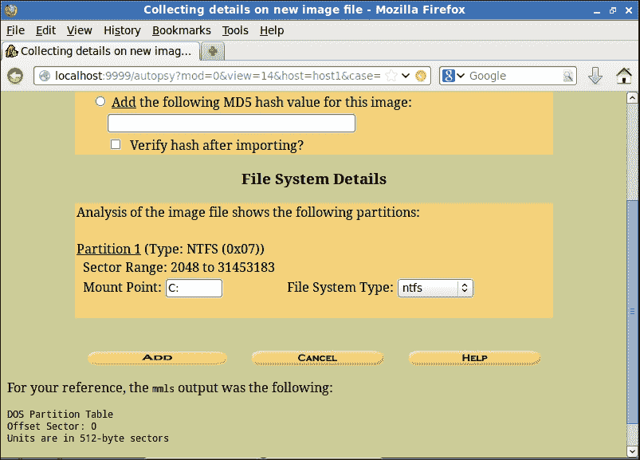

将已分配的分区挂载到案件中

一条确认消息将总结您所建立的配置：

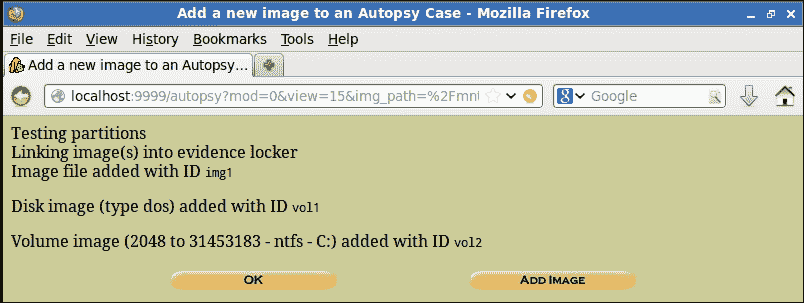

确认消息

然后，将显示一个案件首页，调查员可以在其中选择对分区或整个磁盘镜像进行的操作：

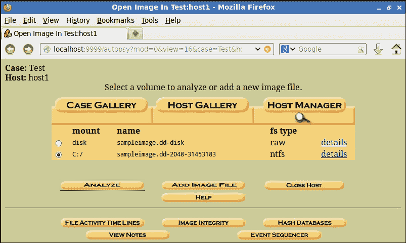

开始案件分析

现在，我们将使用`C:`分区，它相当于在每个命令中使用`-o`选项指定偏移量，这样我们就为工作分区提供了偏移量。这里，接下来的分析将针对`C:`分区的内容。

在声明分析之后，调查员将找到一些选项卡，针对我们之前提到的所有调查层次，例如文件分析、元数据分析和数据集群分析。然而，命令行工具在定制结果方面仍然更为强大。例如，如果我们需要使用 Autopsy 重新做我们在`ntdll.dll`文件上的工作，我们需要首先从文件分析标签中搜索文件名：

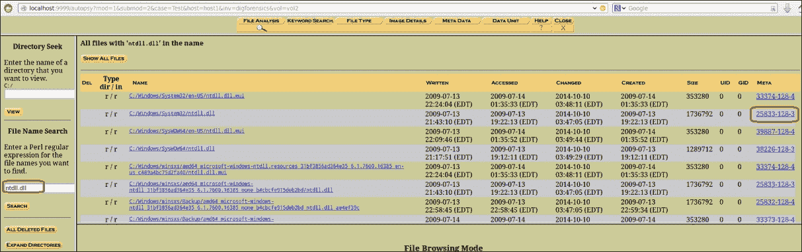

按文件名搜索文件

我们现在有了元数据编号`25833`。您可以点击该编号或在**Meta Data**标签下搜索该编号。这将列出该文件的所有信息，包括所有包含该文件内容的集群。我们关注的是第一个集群编号 1118226，如下图所示：

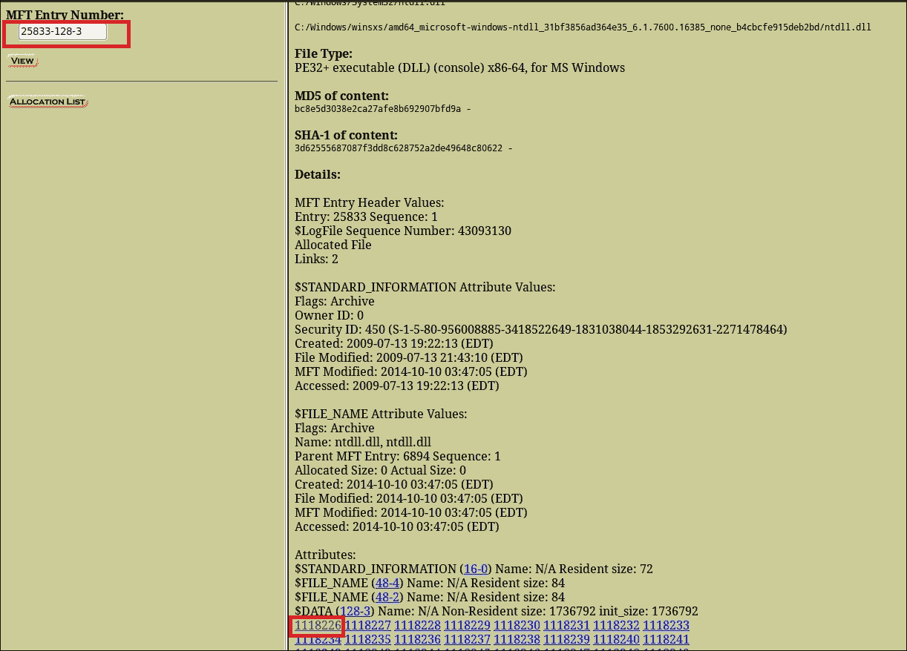

按元数据 ID 列出元数据信息

然后，以相同的方式，您可以点击集群编号或在“DATA UNIT”标签下输入集群编号，它将以 ASCII、十六进制或 ASCII 字符串视图显示文件内容：

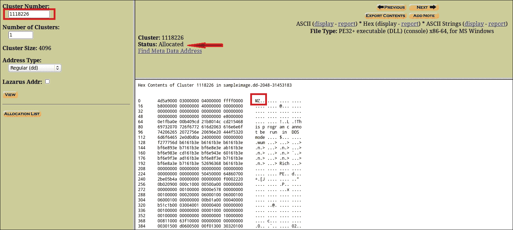

按集群编号列出集群内容

我们可以看到集群的状态为已分配，文件的签名（在其十六进制视图中）依然是`0x4D5A`（MZ）。

# 首先

使用 TSK，我们可以找到并恢复已删除的文件。这些已删除的文件仍然在元数据区域中保留其信息，这就是我们能够识别其信息并知道它们在数据区域位置的原因。如果没有已删除文件的条目，而我们只在数据区域中有文件的内容且没有该文件的元数据（根据这一假设，该文件将位于硬盘的未分配区域），在这种情况下，文件雕刻技术将有助于恢复此类文件。

每个文件有不同的类型，例如 Microsoft Office、Adobe、exe 和 AVI。文件名末尾的扩展名并不是区分文件类型的依据。每个文件的开头都有一个头部，且各类型文件的头部不同。有些文件类型在文件的结尾有一个尾部，但这并非强制要求。文件雕刻技术利用这些头部和尾部在图像或硬盘的未分配区域中切割并识别文件的位置，以恢复这些文件。

**Foremost** 是一款基于文件雕刻技术恢复数据的 Linux 工具。我们可以将 foremost 应用到所有图像上，但我们已经知道，雕刻操作将仅对未分配区域有效。那么，为什么不将 foremost 应用于未分配区域作为一个单独的文件呢？这个单独的文件是通过 `tsk` 的 `blkls` 工具从图像中生成的，命名为 `unallocated.blkls`。我们可以从硬盘中雕刻出这个生成的文件，以查找已删除的文件（如果有的话）。

foremost 的输出结果是在工作目录下的不同目录，使用 `--o` 选项时，每个文件类型都会有一个以文件类型命名的目录。如我们所知，每个文件会从簇的开始处开始，因此我们不需要搜索簇中其余的内容。我们可以使用 `--q` 选项，仅搜索簇的开始部分，以快速得到结果：

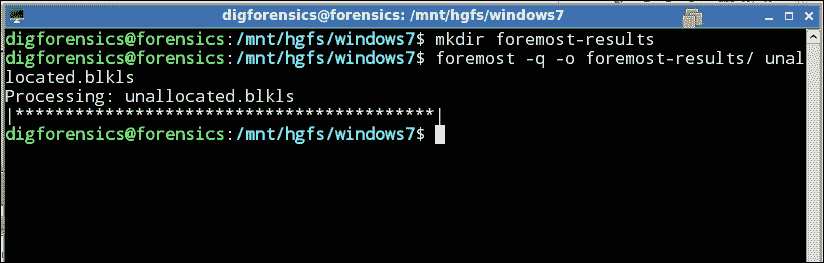

使用 Foremost 在图像中雕刻未分配区域

然后，在运行该工具的结果中，我们会发现一个 `audit.txt` 文件和一个 PDF 目录被创建在 foremost-results 目录下。打开 `audit.txt` 文件，我们可以看到一些关于文件雕刻过程的信息，例如时间、大小和提取的文件。在我们的案例中，只有一个 PDF 文件是从图像的未分配区域中提取的：

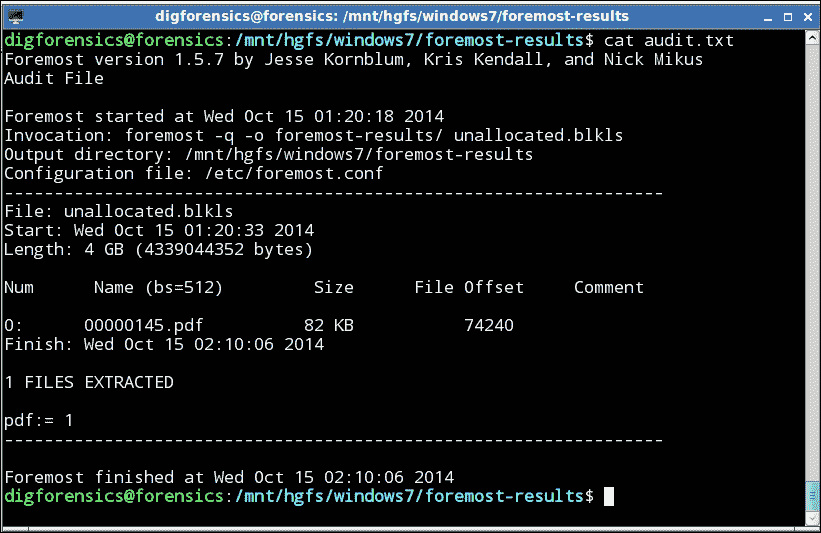

通过 foremost 提取的文件

由于如前所述，这个文件缺乏元数据，我们无法知道关于该文件的任何信息，除了文件的大小和内容。这个 PDF 文件是为了测试目的而创建的，我们假设它包含与正在调查的案件相关的证据数据：

提取的 PDF 文件

# 总结

在这一章，我们了解了文件在文件系统中的组织方式，以及它如何从 FAT 到 NTFS 发生变化。接着，我们学习了如何使用 TSK 和它的图形界面工具 Autopsy 从取证镜像中读取文件。我们还讨论了文件切割技术以及如何根据文件的签名使用 Foremost 恢复文件。

在下一章，我们将学习关于 Windows 注册表的内容——这是 Windows 操作系统中一个复杂但非常重要的组成部分。我们将了解注册表结构及其在调查中的重要性，以及不同的工具来解析和分析注册表。
