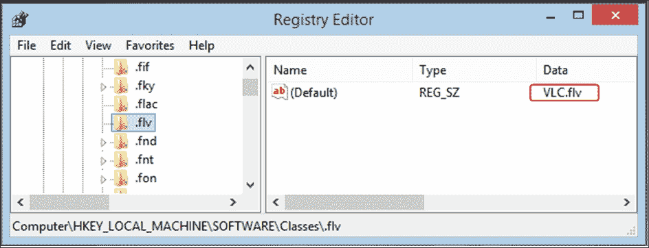

# 第七章：注册表分析

理解系统配置、设置和用户活动始终是取证分析过程中的重要步骤。过去，这些配置存储在 INI 文件中，这些文件是简单格式的文本文件。然而，从 Windows 3.1 开始，引入了注册表的概念，仅用于存储基于 COM 的组件。**COM** 或 **组件对象模型** 是微软在 1993 年推出的，用于支持跨进程通信和在多种编程语言中动态创建对象。从那时起，它被广泛用于存储大多数 Windows 设置。

注册表可以看作是一个 Windows 结构化的数据库。它包含操作系统的配置和设置，也包含正在运行的服务和已安装应用程序的设置以及用户的偏好设置。安装的应用程序不必使用注册表来存储其配置和设置。有些程序使用 XML 或文本文件来存储它们的配置。

便携应用程序通常将其配置信息保存在应用程序可执行文件所在目录或文件夹中的文件里。注册表还会跟踪用户的活动，保存他们的设置，并支持多用户配置结构，每个用户都有自己的账户配置。每个用户的注册表存储在该用户目录下的一个独立文件中，文件名为 `NTUSER.DAT`，本章稍后将详细讨论。

数字取证过程中对注册表的分析是调查人员获取证据的重要来源。恶意程序与其他程序一样，在运行时会使用系统资源，因此它们可能在注册表中留下某些痕迹。这些痕迹将有助于了解正在调查的事件的具体情况。

在本章中，我们将讨论注册表的结构以及用于执行分析的一些工具。

# 注册表结构

注册表有一个特定的结构，分为键和值。像目录结构一样，根键表示根目录，子键表示子文件夹，值表示文件。图 1 展示了通过 Windows 原生工具 "注册表编辑器" 打开的注册表结构。通过在运行窗口中输入 regedit.exe 可以以可编辑模式打开该工具。

圆角矩形中的项目是根键，而下方矩形中的项目是子键。椭圆形中的项目是注册表的值。每个值都有以下三个条目：

+   名称

+   类型

+   数据

要访问特定的值，用户需要知道该值的路径。路径可以在 regedit 窗口的末尾找到。在我们的例子中，路径是 `Computer\HKEY_CURRENT_USER\Environment`：


图 1：注册表的主要组件

## 根键

Windows 系统，在本例中为 Windows 8.1，拥有五个根键。每个根键存储有关正在运行的系统和系统用户的不同信息和设置。在注册表编辑器中显示的每个根键实际上是文件系统中的一个名为**注册表哈希**的文件。这些根键如下所示：

+   `HKEY_CLASSES_ROOT`

+   `HKEY_LOCAL_MACHINE`

+   `HKEY_USERS`

+   `HKEY_CURRENT_USER`

+   `HKEY_CURRENT_CONFIG`

在接下来的章节中，我们将简要讨论每个根键及注册表哈希结构，然后讨论分析程序，解释它如何在分析过程中发挥作用。

### HKEY_CLASSES_ROOT 或 HKCR

此键包含子键。每个子键以系统中可以找到的扩展名命名，例如 `.exe` 和 `.jpeg`。此根键描述了必须使用的默认程序来打开系统中的该扩展名。此外，该键还存储了右键菜单的详细信息和程序的图标。

假设在分析过程中，我们（调查员）需要知道哪个程序用于打开特定的文件类型，例如带有 flv 扩展名的可执行文件。然后我们将使用以下过程：

+   首先，我们需要在根键下搜索名为 `.flv` 的子键（不带引号），并定位该子键的关联值。

+   然后，我们需要在相同的根键下搜索另一个名为 `VLC.flv` 的子键。此子键包含有关操作系统如何处理 `.flv` 媒体文件的一些值：

    图 2：注册表中与 flv 扩展名关联的值

+   在同一注册表键下搜索 `VLC.flv` 值时，我们将定位到用于运行 `.flv` 文件类型的可执行文件。在这种情况下，它是 VLC 媒体播放器。它还提到文件系统中可执行文件的位置：

    图 3：VLC 播放器的所在位置，用于运行 .flv 文件类型

例如，在多用户 Windows 环境中，如果两个不同的用户安装了两个不同的程序来打开 PDF 文件，则当一个用户登录系统时，操作系统将加载该特定用户的配置文件，包括其选择的打开 PDF 文件的程序。

然而，HKCR 中的信息来自两个不同的位置：

+   `HKEY_LOCAL_MACHINE\SOFTWARE\Classes`

+   `HKEY_CURRENT_USER\SOFTWARE\Classes`

通常，这是仅指向 `HKEY_LOCAL_MACHINE\SOFTWARE\Classes` 的别名。当用户为特定文件类型注册不同的关联时，它使用每个用户的类注册功能，仅将新关联注册到该用户。

在这种情况下，如果用户打开一个特定类型的文件，并且该文件类型在 `HKEY_LOCAL_MACHINE\SOFTWARE\Classes` 和 `HKEY_CURRENT_USER\SOFTWARE\Classes` 中有两个不同的关联，那么将使用与该特定用户相关的 `HKEY_CURRENT_USER\SOFTWARE\Classes` 中的关联。

### HKEY_LOCAL_MACHINE

此键包含系统启动过程中使用的配置和设置。它与用户登录无关。该根键包含以下五个子键：

+   **系统**：此项包含系统配置，例如计算机名称、系统时区和网络接口。

+   **软件**：此项包含有关系统中已安装应用程序和操作系统服务的设置和配置。

+   **SAM**：这是安全帐户管理器，存储用户和组的安全信息。它总结了管理员在本地系统和域上授予用户的所有权限。它包含用户名、用户的唯一 SID 和用户密码的哈希消息。由于 Windows 安全性，从运行中的系统通过 `regedit.exe` 工具打开时此文件将为空。可以将其提取并在另一台分析机上打开，以显示所有内容。

+   **安全**：此项包含系统中的安全策略（如果有的话）。它与 SAM 相同，其内容无法从运行中的系统查看。

+   **硬件**：此项包含有关连接到系统的硬件设备的信息。这些信息在系统启动时存储。

### HKEY_USERS 或 HKU

HKU 注册表根键包含多个子键。我们将使用 Windows 8.1 作为本示例：


图 4：HKEY_USERS

其子键如下：

+   **S-1-5-18**：这是系统配置文件，位于 `%systemroot%\system32\config\systemprofile`。

+   **S-1-5-19**：此项与 LocalService 相关，位于 `%systemroot%\C:\Windows\ServiceProfiles\LocalService`。

+   **S-1-5-20**：此项与 NetworkService 相关，位于 `%systemroot%\C:\Windows\ServiceProfiles\NetworkService`。

+   **S-1-5-21-4123892437-111928464-3716307427-1002**：这是当前登录的用户及其完整的 SID。我们的位置在用户目录 `C:\Users\Forensics2`。

+   **默认用户**：这是任何新用户的默认配置文件，位于 `%SystemDrive%\Users\Default`。当创建新用户时，该配置文件的副本会被复制到该用户下，用户在配置中所做的所有更改都会记录在该配置文件下。该过程直到该用户第一次登录时才会发生。系统开始构建该用户配置文件，如下图所示：

    图 5：在 Windows 中创建新用户配置文件

在 HKU 下只能找到当前登录的用户，而不是所有用户。然而，在运行中的系统中，我们可以通过注册表中的 `HKEY_LOCAL_MACHINE\SOFTWARE\Microsoft\Windows NT\CurrentVersion\ProfileList` 键找到系统用户的位置及更多详细信息。

在这个键中，我们可以找到关于所有系统用户配置文件的基本信息，包括每个配置文件的位置，但不能找到每个用户的配置和设置。在以下截图中，我们可以找到另一个 SID 以 1002 结尾的用户配置文件，这在 HKU 下找不到：


图 6：系统配置文件列表

### HKEY_CURRENT_USER 或 HKCU

HKCU 只是当前用户在 HKU 下的一个指针，具有相同的配置和设置：


图 7：HKCU 与 HKU 对比

## 将配置单元映射到文件系统

注册表中的每个根键实际上映射到文件系统中的一个文件，这在不同版本的 Windows 中有所不同。在下表中，我们针对 Windows NT 到 Windows 10。 这些文件具有特定的格式，操作系统根据格式解析数据以读取或写入注册表。

我们可以在下表中查看每个配置单元在文件系统中的位置：

| **配置单元名称** | **文件系统中的位置** |
| --- | --- |
| `HKEY_LOCAL_MACHINE\System` | `%WINDIR%\system32\config\System` |
| `HKEY_LOCAL_MACHINE\SAM` | `%WINDIR%\system32\config\Sam` |
| `HKEY_LOCAL_MACHINE\Security` | `%WINDIR%\system32\config\Security` |
| `HKEY_LOCAL_MACHINE\Software` | `%WINDIR%\system32\config\Software` |
| `HKEY_USERS\User SID` | 这是用户配置文件（`NTUSER.DAT`）；`Documents and Settings\User`（在 Vista 中已更改为 `Users\User`）。每个 HKU 下的配置文件必须链接到用户配置文件目录下的一个 `NTUSER.DAT` 文件。该目录可以通过图 6 中的路径确定：`HKEY_LOCAL_MACHINE\SOFTWARE\Microsoft\Windows NT\CurrentVersion\ProfileList` |
| `HKEY_CURRENT_USER` | 作为指向当前登录用户的 HKU 的指针。 |
| `HKEY_USERS\.Default` | `%WINDIR%\system32\config\default` |

> 表 1：配置单元与文件系统映射

# 备份注册表文件

Windows 操作系统默认每 10 天备份一次配置单元文件。备份文件位于 Windows XP 中的 `%WINDIR%\repair`，在 Windows Vista 及更高版本中位于 `%WINDIR%\System32\config\RegBack`。备份的配置单元文件对于确定自上次更新以来的配置变化非常有用。如果正常的配置单元文件损坏，它们也能发挥重要作用。

备份由本地系统在 Windows 任务下完成，路径为`%WINDIR%\System32\Tasks\Microsoft\Windows\Registry`：


图 8：Windows 中的注册表备份任务

# 提取注册表配置单元

执行系统注册表的事后分析需要从文件系统中提取配置单元。在本节中，我们将介绍如何从实时系统和法医镜像中提取文件。

## 从实时系统中提取注册表文件

在实时系统中复制备份文件非常简单；只需复制并粘贴，或在管理员命令提示符下键入以下命令：

```
reg save HKLM\<hive name> <savename>

```

如前所述，这些文件可能是 10 天前的。这可能不包含任何与正在调查的事件相关的痕迹。因此，我们需要提取正在使用的蜂窝文件，而系统是不允许这么做的，因为这些文件在实时系统中正在使用：


图 9：在实时系统中复制注册表文件时出现的错误

为了从实时系统中复制注册表文件，我们需要使用一些程序，如 FTK Imager。在本次练习中，我们将使用精简版，这在实时分析时更加有效，因为与安装版相比，它不会在系统中留下大量痕迹：

1.  在 Windows 实时系统中，打开 FTK Imager Lite 程序。

1.  从**文件**中选择****添加证据项****。

1.  这将要求你选择一个源。在这种情况下，我们可以选择物理驱动器或逻辑驱动器。在我们这里没有区别；我们可以选择逻辑驱动器：

    图 10：FTK 源类型

1.  之后，我们需要选择源驱动器，并选择 Windows 工作分区，在我们的例子中是分区 C：

    图 11：源分区

    分区 C 的内容将在程序的左侧窗格中显示。

1.  我们需要浏览到注册表文件所在的位置。选择注册表蜂窝文件，并将这些文件导出到外部连接的存储设备或网络共享文件夹中，而不是导出到本地计算机。这可以避免覆盖可能相关的证据数据，如下图所示：

    图 12：通过 FTK Imager 导出注册表文件

之后，我们可以将提取的文件带到我们的 Linux 机器上进行分析。

值得一提的是，FTK Imager 具有一个内置功能，可以获取所有注册表文件和受保护的系统文件。可以通过导航到“文件” à 获取实时系统中的受保护系统文件，而无需添加任何设备或分区来访问此功能。

## 从取证镜像中提取注册表文件

要从取证镜像中提取文件到 Linux 中，我们需要首先将系统分区挂载到系统中作为只读，然后进行简单的复制和粘贴操作来提取注册表文件。

要在 Linux 中从取证镜像挂载一个分区，首先需要知道该分区在取证镜像中的偏移量。这个任务可以通过使用 TSK（The Sleuth Kit）中的 mmls 命令来完成。TSK 将在后续详细讨论：


图 13：Windows 分区

结果显示，系统分区从扇区 2048 开始。利用这一信息，我们可以将该分区挂载为只读：

1.  首先，我们需要在`</mnt/mountpoint>`创建一个目录作为挂载点，然后运行挂载命令，如下所示：

    图 14：创建挂载点并挂载映像

    如我们所见，偏移量必须以字节为单位。因此，我们需要将其代入此公式（512*2048），其中 512 为扇区大小，2048 为扇区号。在此命令中，我们还选择将映像挂载为只读，显示系统文件，并忽略大小写，以便更容易浏览文件而不会出错。

1.  因此，我们可以看到，所有的文件系统结构都可以从挂载点轻松访问：

    图 15：挂载的系统分区

1.  由于我们知道系统中注册表文件的位置，因此可以开始复制它们：

    图 16：复制注册表文件

1.  同样也可以对用户配置文件执行此操作。这里我们有两个用户：forensics 和 forensics2：

    图 17：复制用户配置文件

# 解析注册表文件

假设你有一个损坏的注册表文件，或者你需要恢复一些数据，或者你想验证一个新分析工具的结果。除了你需要知道分析工具如何解析和恢复注册表文件外，这些原因使得理解注册表文件结构变得非常重要。

注册表文件由与文件系统中集群相同概念的块组成。块大小为 4KB。hive 会扩展到整个块，就像文件系统中的集群一样。第一个集群被称为**基块**。

## 基块

基块是 hive 文件的前 4KB，它包含以下内容：

+   hive 签名，用于标识该文件为 hive 文件。

+   此 hive 的最后写入操作时间戳。

+   校验和。

+   hive 格式，不同操作系统版本之间有所不同。在不同版本中，数据的处理方式也有所不同。

+   hive 文件的真实名称及其在系统中的完整路径。

+   根单元的偏移量，相对于 hbin 的起始位置。（这两者稍后将会解释。）

+   这两个序列号。我们可以将序列号视为一种保护 hive 文件完整性的方法。

当需要在注册表 hive 中执行写入操作时，首先会在内存中进行。这时操作系统需要将这些更改写入非易失性磁盘文件，以保持其更新。操作系统会跟踪所有 hive 的扇区。

为了写入磁盘文件，操作系统会调度所谓的惰性写入操作或 hive 同步。惰性写入开始将内存中的 hive 更改同步到磁盘文件，并更新最后的写入时间。如果在同步过程中发生崩溃，文件将被损坏。

为了避免这种情况，延迟写入会在开始同步过程之前更新序列号的第一个数字。完成写入过程后，它会将第二个序列号更新为相同的值。如果操作系统发现序列号中有两个不同的值，它会知道在上次同步过程中发生了崩溃。接着，操作系统会启动恢复过程，按照注册表文件的日志文件进行恢复，以保持文件的一致性。

在本节中，我们将考虑一个 `forensics2.dat` 注册表文件的示例。为了以原始数据查看注册表文件，我们将使用 hexdump 工具或 hd，并开始解析注册表文件数据。

在法医机器上，运行以下命令以查看基块的前 200 个字节：


图 18：基块的前 200 个字节

现在，让我们解释上一张图片中的值。请注意，当前这些值是小端格式的，因此我们需要从右到左逐字节读取它们：

| **偏移量** | **长度（字节）** | **值** | **描述** |
| --- | --- | --- | --- |
| 0x0000 | 4 | Regf | 这是注册表文件的签名。 |
| 0x0004 | 4 | 0x00000055 | 这是操作系统在编辑注册表之前写入的第一个序列号。 |
| 0x0008 | 4 | 0x00000055 | 这是第二个序列号。第一个和第二个序列号相同，这意味着上一次写操作成功。 |
| 0x000C | 8 | 0x01D048BC17BA58E0 | 这是最后一次写操作的时间戳。这个值可以通过 `dcode.exe` 程序解码，程序来自 [`digitaldetective.com/`](http://digitaldetective.com/)： 从这些结果中，我们可以看到最后一次写入时间是 2015 年 2 月 15 日星期天，协调世界时（UTC）01:09:48。 |
| 0x0014 | 4 | 0x00000001 | 这是文件的主要版本号。在这个例子中，它是 1。 |
| 0x0018 | 4 | 0x00000003 | 这是文件的次要版本号。在这个例子中，它是 3。所以，文件格式版本是 1.3。 |
| 0x0024 | 4 | 0x00000020 | 这是第一个单元格相对于第一个 hbin 的偏移量。 |
| 0x0030 | 64 最大值 | `C:\Users\Forensics2\ntuser.dat` | 这是文件的位置和名称。从这条信息中，我们可以知道该文件是 `C:\Users\Forensics2` 下的用户配置文件。尽管调查中的文件名为 `ntuser.dat`，但文件的名称为 `ntuser.dat`。 |

> *表 2：解析基块*

## Hbin 和 CELL

单元格是注册表文件中的数据容器；它包含一个键、子键或值。每种类型在单元格内有不同的签名和数据结构。如果单元格签名是 kn 或键节点，那么以下信息将被解释为键。操作系统将在另一个容器中分配这些单元格，该容器称为 HBIN。HBIN 可以包含多个单元格，并且它在签名文件中有自己的头部。对于我们这里的示例，假设我们取第一个 hbin 内的第一个单元格。

第一个 hbin 可以直接在基本块之后找到，即从文件开头的 4,096 字节处开始。我们将显示第一个 4,096 字节后或 0x1000 十六进制后的前 200 字节：


图 19：第一个 HBIN 的前 200 字节

我们可以解释头部信息如下：

| **偏移量** | **长度（字节）** | **值** | **描述** |
| --- | --- | --- | --- |
| 0x1000 | 4 | hbin | 这是 hbin 签名的开始。 |
| 0x1004 | 4 | 0x00000000 | 这是相对于第一个 hbin 结构的偏移量。此处的值为 0，表示这是文件中的第一个 hbin。 |
| 0x1008 | 2 | 0x1000 | 这是当前 hbin 的大小。它为 4096 字节。通常情况下，它要么等于 4096 字节，要么是这个数字的倍数。 |

> *表 3：hbin 的头部*

从解析 0x0024 处的基本块开始，相对于第一个 hbin，第一个单元格的偏移量为 0x20。

因此，要找到第一个单元格的头部，我们需要转到当前 hbin 的偏移量 0x1020：

| **偏移量** | **长度（字节）** | **值** | **描述** |
| --- | --- | --- | --- |
| 0x1020 | 4 | 0xFFFFFF78 | 这是负实现中单元格的大小。负号表示此单元格正在使用。这里的值为(-136)，表示此单元格被使用，其大小为 136。 |
| 0x1024 | 2 | nk | 这是 nk 签名，表示此单元格包含一个键节点值。 |
| 0x1026 | 2 | 0x002C | 这是记录的属性标志；它具有不同的值。二进制表示或这里的值为 00101100，指示文件为：CompressedName: (00100000)[2]NoDelete: (00001000)[2]HiveEntryRootKey: (00000100)[2]正如我们之前预期的那样，此条目包含根键信息。 |
| 0x1028 | 8 | 0x01D048B03FC412EF | 这是此条目的最后写入时间戳。根据`Dcode.exe`的解码值，该值是 UTC 时间 Sat, 14 February 2015 23:45:01。 |
| 0x1034 | 2 | 0x0600 | 此值是父键记录的偏移量。由于这是父 kn 记录，此值在这里可以忽略，只要这已经是 kn 根键记录。 |
| 0x1038 | 4 | 0x0000000B | 这是此根键下子键列表的数量。在这里，该值为 11，因此该键下有 11 个子键。 |
| 0x1040 | 4 | 0x00011E28 | 这是指向此根键下子键列表的指针。 |
| 0x104C | 4 | 0xFFFFFFFF | 这是指向此根键下值列表的指针。这里的值为 0xFFFFFFFF，表示此根键下没有值。 |
| 0x106C | 2 | 0x0034 | 键名的大小。在这种情况下，它是 52 字节。 |
| 0x1070 | 52 | CMI-CreateHive{D43B12BB-09B5-40DB-B4F6-F6DFEB78DAEC} | 这是根键的名称。其长度为 52 字节或字符。 |

> *表 4：单元格分析*

现在，我们可以得出结论，这是一个名为`CMI-CreateHive{D43B12BB-09B5-40DB-B4F6-F6DFEB78DAEC}`的根键，大小为 136 字节，包含 11 个子键，没有值。现在，我们需要找出这个根键下的子键名称。

根据之前的分析，从 hbin 开始，子键列表的偏移量为 0x11E28。因此，我们需要加上 0x1000，从 hive 文件的开头获取它。最终偏移量为 0x12E28：


图 20：子键列表

我们可以看到这是一个新的单元格，需要解析，内容如下：

| **偏移量** | **长度（字节）** | **值** | **描述** |
| --- | --- | --- | --- |
| 0x12E28 | 4 | 0xFFFFFFA0 | 这是单元格的负值实现大小。负号表示该单元格正在使用。此处的值为（-96）。该单元格已被使用，大小为 96。 |
| 0x12E2C | 2 | lf | lf 签名表示这包含一个子键列表。 |
| 0x12E2E | 2 | 0x000B | 这是列表中元素的数量。在这种情况下，数量为 11，与之前分析的值匹配。 |
| 0x12E30 | --- | ---- | 从此点开始，每 8 个字节代表一个子键。前 4 个字节是子键相对于 hbin 开头位置的偏移量，后 4 个字节作为校验和。 |

> *表 5：lf 条目分析*

根据之前的分析，我们可以确定每个子键的位置对应以下偏移量：

+   0x00011DC8

+   0x00003C30

+   0x00000EB8

+   0x00000318

+   0x00018BF0

+   0x000499F0

+   0x0001E2F0

+   0x00006820

+   0x00006BD8

+   0x00000160

+   0x00000C60

要查看与 hive 文件开头相关的内容，我们需要在每个偏移量上加上 0x1000，表示基块的大小，然后查看前 100 个字节。我们将看到每个偏移量会指向另一个具有不同名称的条目，如下图所示：


我们可以看到，在新的条目中，父单元格偏移量为 0x0020，这是名为`CMI-CreateHive{D43B12BB-09B5-40DB-B4F6-F6DFEB78DAEC}`的第一个条目的偏移量。

子键的完整列表如下：

+   应用事件

+   控制台

+   控制面板

+   环境

+   EUDC

+   身份

+   键盘布局

+   网络

+   打印机

+   软件

+   系统

为了通过实际案例验证这些结果，我们可以使用本地的 regedit 工具在我们的测试机上显示注册表。如果列表与结果匹配，则说明解析成功，如下图所示：


图 21：来自实际测试机的子键

# 自动运行键

恶意程序通常会试图在系统中保留其存在，以防系统重启或不同的用户登录系统。以下列出了在系统启动时运行的两个重要自动运行键：

+   `HKEY_LOCAL_MACHINE\System\CurrentControlSet\Services`

+   `HKEY_LOCAL_MACHINE\SOFTWARE\Microsoft\Windows\CurrentVersion\ShellServiceObjectDelayLoad`

这些位置可能会托管针对机器本身的恶意软件，如 rootkit、僵尸网络或后门。其他恶意软件可执行文件则针对系统上的某些用户，在特定用户或任何用户登录系统时运行。

它们可以在以下位置找到：

+   `HKEY_LOCAL_MACHINE\Software\Microsoft\Windows\CurrentVersion\Runonce`

+   `HKEY_LOCAL_MACHINE\Software\Microsoft\Windows\CurrentVersion\Run`

+   `HKEY_CURRENT_USER\Software\Microsoft\Windows\CurrentVersion\Run`

+   `HKEY_CURRENT_USER\Software\Microsoft\Windows\CurrentVersion\RunOnce`

+   `HKEY_LOCAL_MACHINE\Software\Microsoft\WindowsNT\CurrentVersion\Winlogon\Userinit`

这些键的一个例子是 Zeus 银行木马。它将其可执行文件添加到 Userinit 键中，以便在任何人登录系统时运行：


图 22：Zeus 自动运行技术

# 注册表分析

在我们从实时系统或取证镜像中提取注册表文件后，需要对它们进行分析。

我们将使用 RegistryRipper 和 sysinternals 进行注册表解析和分析。

## RegistryRipper

Regripper 是由 Harlan Carvey 开发的一个 Perl 开源跨平台工具，可以从 [`code.google.com/p/regripper/`](https://code.google.com/p/regripper/) 下载。它解析注册表结构，搜索取证中重要的区域，并列出这些区域的内容。调查人员需要理解结果，并从输出中提取异常。

该工具是一个命令行工具，它也有一个简单的 GUI，可以分析不同类型的 hive。通过图形界面，调查人员可以选择一个 hive 文件进行分析，并通过从配置文件下拉框中选择 hive 文件的类型来选择要在该 hive 文件上运行的插件列表。报告将以 txt 格式创建，并且在分析过程中会创建一个日志文件，以便查看成功和失败的插件：


图 23：RegRipper 图形界面

RegRipper 还提供了一个命令行接口，可以与其他 Linux 工具（如 grep）一起使用，直接过滤分析结果。命令行非常简单，如下所示：

+   对 hive 文件运行完整配置文件，其中配置文件将提供针对特定 hive 运行的插件列表：

    图 24：对 hive 文件进行完整配置文件分析

+   或者，你也可以只运行一个插件来分析 hive 文件，从中提取一条单独的信息。在以下图中，只有 appcompatcache 插件在系统 hive 上运行：

    图 25：从 hive 文件中提取单个信息。

值得一提的是，appcompatcache 会解析注册表中的应用程序兼容性缓存，该缓存存储有关系统中可运行程序的信息。它存储有关路径、大小、最后修改时间戳、可执行文件的最近运行时间以及是否在系统中执行过的信息。

一个可能表明系统上安装了恶意软件的恶意结果是与以下图示的某银行恶意软件相关的可执行文件：


图 26：应用程序兼容性缓存中的恶意软件

在这里，我们可以在临时文件夹中找到一个可执行文件，这可能是指示在浏览过程中从互联网下载此可执行文件的迹象。它有一个恶意的名字，并在被调查的系统中执行。

## Sysinternals

Sysinternals 是一个用于故障排除 Windows 系统的工具集。它由 Mark Russinovich 开发，可以在 [`technet.microsoft.com/en-us/sysinternals/bb545021.aspx`](https://technet.microsoft.com/en-us/sysinternals/bb545021.aspx) 找到。它可以用于取证分析，以提供感染的指示。它通常运行并解析实时系统，但也可以在离线系统上工作。我们只需指向注册表位置；这些是离线系统中的 Windows 目录和用户名目录。

在 Linux 系统中，Wine 环境下无法进行权限提升，且该程序需要以管理员身份运行。因此，我们需要在任何 Windows 机器上运行此工具。如果提供的是只读挂载的镜像，程序将无法运行。从取证的角度来看，将镜像挂载为读写模式是不可接受的。

在这种情况下，我们只需要模拟注册表文件的位置：

+   `Windows`：这应该是一个包含以下子文件夹的文件夹：

    +   `System32`：这应该是一个包含以下子文件夹和文件的文件夹：

        +   `Config`：这应该是一个包含以下文件的文件夹：

            +   `SYSTEM`：这是一个提取的注册表蜂巢

            +   `SOFTWARE`：这是一个提取的注册表蜂巢

            +   `SAM`：这是一个提取的注册表蜂巢

            +   `SECURITY`：这是一个提取的注册表蜂巢

            +   `ntdll.dll`：也要从挂载的镜像中复制此文件（或者只是一个同名的空文件）

+   `<Username>`：这应该是一个包含以下文件的文件夹：

    +   `NTUSER.DAT`：这是一个提取的注册表蜂巢：

        图 27：模拟 Windows 注册表文件夹

1.  然后，我们在 Wine 中运行 `autoruns.exe`。`autoruns.exe` 工具将显示许多自动运行的注册表项和服务，以及更多有用的分析信息。

1.  从文件中选择 **分析离线系统...**，并浏览到新创建的文件夹：

    图 28：打开模拟的目录

该程序具有不同的选项卡来过滤注册表。例如，登录选项卡会过滤整个注册表，在系统登录时运行。这些键通常由恶意软件可执行文件使用，以在重新启动后保持其在系统中的存在，正如前面讨论的那样：


图 29：离线系统注册表分析示例

如图 29 所示，对于所有处于黄色并且在`Image Path`下的条目，我们将找到文件未找到。这是正常的，因为相关系统实际上未运行。

### 小贴士

计划任务列表很重要，需要进行检查。一个恶意可执行文件保持其存在的技术是将自身添加为定期运行的任务。

## MiTeC Windows 注册表恢复

MiTeC WRR 是另一个值得一提的注册表分析程序。它一次只能打开一个注册表集合，并且可以同时打开所有注册表集合。除了以结构化格式查看注册表之外，它还可以根据任务过滤注册表，例如启动程序和用户数据。WRR 可以在 Linux 中在 Wine 环境下运行：


图 30：MiTeC WRR

# 总结

在本章中，我们介绍了注册表作为 Windows 操作系统中最重要的工件之一，它包含大部分操作系统和安装程序的配置和设置。我们解释了每个注册表集合的功能及其在文件系统中的位置。此外，我们分析了一个注册表文件的结构，这是在需要分析损坏的注册表文件或恢复的注册表文件片段时的重要过程。然后，我们解释了恶意软件如何利用注册表来保持其在系统中的存在，并介绍了如何发现它们的存在。我们使用不同的工具来查看和分析注册表文件。

在下一章中，我们将介绍 Windows 操作系统的另一个重要工件，即事件日志文件。我们将探讨如何使用事件文件来跟踪系统用户的活动，以及如何发现系统中的恶意活动。
