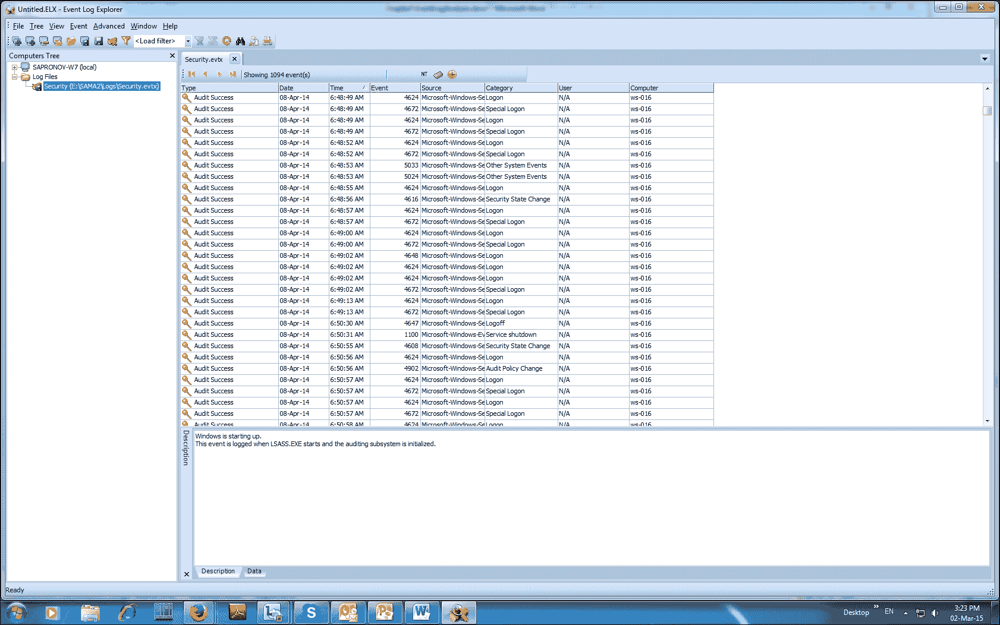
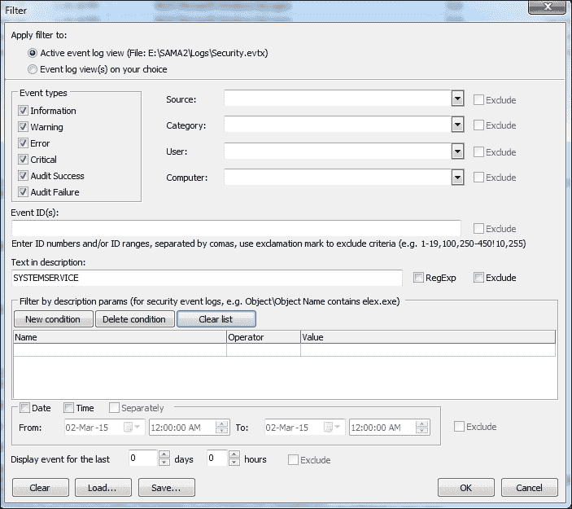
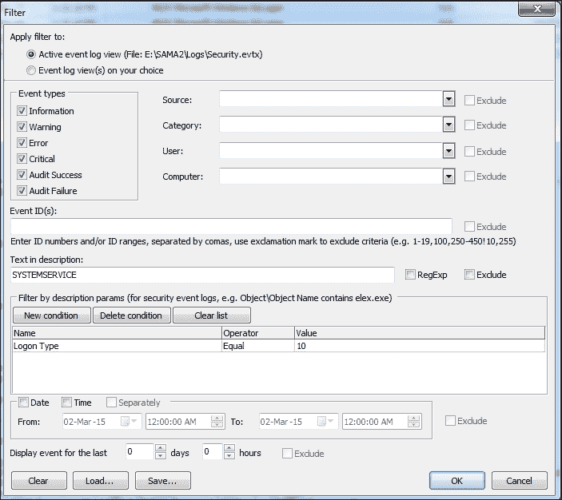

# 第八章：事件日志分析

本章我们将学习微软操作系统中的事件日志。我们将讨论为何涉及事件日志的问题对于成功调查非常重要。我们还将考虑根据 MS Windows 版本，事件日志之间的差异。

# 事件日志 - 简介

当操作系统运行时，系统中会发生许多事件。这些事件的范围非常广泛，其中大部分可以在系统中注册。为了在系统中注册事件，存在一个强大的机制叫做**事件日志**。它提供了一种标准的集中式方式，操作系统和应用程序用它来记录来自软件和硬件的重要信息。一个事件可以是系统中或某个应用中发生的事情，并且需要通知用户。每个事件的信息都应该被记录。

事件由事件日志服务收集并存储。它将来自不同来源的事件保存在事件日志中。事件日志提供了按时间顺序排列的信息，使我们能够确定系统环境和安全中的问题，并跟踪用户的活动以及系统资源的使用情况。然而，实际记录在事件日志中的数据类型取决于系统配置和应用设置。例如，在旧版 Windows 操作系统中，安全事件日志默认是关闭的。

事件日志为调查人员提供了大量数据，能够帮助回答以下问题：

+   **发生了什么**：事件日志记录中的某些项，如事件 ID 和事件类别，帮助我们获取某个特定事件的信息。

+   **何时**：时间戳是事件日志的一个关键部分，它为事件提供了时间背景。在一个生成大量事件的系统中，时间戳可以非常有用，帮助缩小搜索的时间范围。

+   **谁**：哪些用户涉及其中。所有在 Windows 操作系统上执行的操作都在某个账户上下文中执行。有些操作不是由普通用户执行的，而是由操作系统执行，这将发生在系统的账户上下文中，例如 System 或 Network Service。我们可以识别在某个特定事件背后是哪个用户。

+   **涉及哪些系统**：在网络环境中，事件日志通常包含来自远程系统的账户引用。最初，只有工作站的 NetBIOS 被记录在事件日志中。然而，这增加了追踪涉及系统的复杂性。在 Windows 2000 之后的系统中，事件日志中也会保存 IP 地址。

+   **哪些资源被访问**：事件日志服务可以配置为存储关于系统上各种对象的非常详细的信息。几乎系统的任何资源都可以被视为一个对象，从而，我们可以检测到任何未经授权的资源访问请求。

# 事件日志系统

既然我们已经弄清楚了 Windows 事件日志包含大量有用信息，并且它们可以成为检测安全事件的宝贵资源，让我们看看在不同版本的 MS Windows 中，事件日志存储的位置。

在 MS Windows 的演变过程中，事件日志系统也发生了变化。它最初出现在 MS Windows 3.1 中。每个 Windows 版本都进行了些许改动，但事件日志文件的名称和路径在 Windows 2003 之前保持不变。最初的版本使用了.evt 二进制格式。该格式不适合进行字符串搜索或在没有特殊软件的情况下浏览信息。此外，这些日志有大小限制，因此新的事件可能会覆盖旧的数据。

在 Vista 之前，事件日志如下所示：

```
%System root%\System32\config

```

然而，从 Vista 和 Server 2008 开始，事件日志的结构、类型和文件系统中的位置进行了重大更改。事件日志系统的原始版本对系统性能造成了很大负担。为了解决与性能相关的一些问题，开发了新版本的事件日志系统，并引入了新的.evtx 格式。然而，最重要的变化是事件日志结构的调整。

在 Vista 中，增加了许多新的事件日志类型，总数超过 70 种。这些事件日志可以在以下位置找到：

```
 %System root%\System32\winevt\logs

```

此外，新的事件日志系统允许将事件发送到远程收集器，因此需要记住，额外的事件日志可能位于其他服务器上。请注意，所提供的事件日志存储路径是默认值，可以通过注册表键进行更改：

+   `HKLM\SYSTEM\CurrentControlSet\Services\Eventlog\Application`

+   `HKLM\SYSTEM\CurrentControlSet\Services\Eventlog\System`

+   `HKLM\SYSTEM\CurrentControlSet\Services\Eventlog\Security`

最初在 MS Windows 中，存在三种类型的事件日志：

+   系统

+   安全性

+   应用程序

所有其他额外的事件日志可以统一归类到自定义组中。Vista、Win7、Server 2008、Win 8 和 Server 2008 现在有许多额外的事件日志，包括一些特定进程的专用事件日志，例如 PowerShell、任务计划程序和 Windows 防火墙。

让我们看看不同类型的事件日志记录了什么信息：

+   **安全日志**：此项记录基于本地和组策略的事件。

+   **系统日志**：此项记录来自操作系统及其组件的事件，例如启动系统时服务失败的情况。

+   **应用程序日志**：此项记录来自应用程序的事件，例如访问文件失败或病毒防护通知。

+   **目录服务**：此项记录来自活动目录及其基础上的一些服务的事件。它是域控制器上的标准事件日志。

+   **文件复制服务器**：此项记录有关域控制器之间更新的事件。它是域控制器上的标准事件日志。

+   **DNS 服务器**：这是一个标准的事件日志服务器，DNS 服务器软件正在运行。它记录有关区域管理以及 DNS 服务器的启动和停止的事件。

专门为新事件日志分配一个单独的目录的主要原因是它们的数量庞大。正如我们前面提到的，它超过了 70 个。

新的事件日志可以分为以下几类：

+   **安装**：这是一个新的事件日志，其中存储了有关 Windows 安全更新、补丁和热修复的信息。

+   **转发事件**：这是一个新的事件日志，用于记录来自远程计算机的事件。

+   **应用程序和服务**：这一组包括所有其他新事件日志，这些日志是在 Windows 2008 中引入的。

## 安全事件日志

旧的事件日志系统在性能方面存在一些问题。在该版本中，事件日志需要完全加载到内存中。有时，仅为了一个日志就需要分配 300 MB 的 RAM。这种行为严重影响了系统性能，迫使管理员关闭事件日志记录。在新的事件日志系统中，每个事件日志文件都有一个小的头部，后面是 64KB 的数据块。现在，只有当前使用的数据块会被加载到内存中。这无疑提高了性能并减少了资源的使用。同时，日志记录的可能性也增加了。几乎所有事件日志在调查过程中都可能证明有用，尽管如此，我们在取证过程中要找的绝大多数答案都可以在安全事件日志中找到。系统和应用程序事件日志对于系统管理员进行故障排除更为有用。

安全事件日志记录每当系统中发生审计事件或受本地或组审计策略覆盖的用户活动时。它们可以提供关于各种用户活动的详细信息，包括用户身份验证（登录、以其他身份运行命令和远程访问）以及登录后的用户活动。使用特权和对象审计可能成为触发事件，显示访问受保护文件的情况，包括哪个用户访问了文件，发生的日期和时间。审计允许将安全设置应用于自身，这样所有审计策略的修改都可以被追踪。

请记住，安全策略可能会注册具有成功和失败结果的事件。它允许调整策略，并且只记录感兴趣的数据。从调查者的角度来看，我们希望尽可能多地记录数据。这可能会增加系统性能负担，并需要大量的磁盘空间来存储信息。在许多环境中，这并不可行。对于一些非取证专业人员来说，为什么成功和失败的登录尝试应该被记录，以及它如何帮助检测暴力破解攻击，可能并不明显。此外，还可以为特定用户设置额外的审计策略，使用内置的`gpedit.msc`管理单元。因此，我们可以为关键用户设置更详细的审计。

由于其性质，安全日志比系统和应用程序事件日志有更多的保护。从 Windows XP SP2 开始，发送事件到安全事件日志的应用程序 API 被弃用，排除了 Windows 安全服务。现在，这个功能仅对本地安全授权系统服务（LSASS）可用，因为它负责在系统中应用安全策略。此外，只有具有管理员权限的用户才能查看、导出或清除安全事件日志。

让我们来看看安全事件日志中存储了什么样的信息：

+   **账户登录**：这些是存储在系统上的事件，用于授权用户登录。因此，可能是工作站或域控制器的登录。

+   **账户管理**：这是账户的维护和修改。

+   **登录事件**：这是本地系统中的每次登录或注销事件。

+   **目录服务**：这些是访问 Active Directory 对象的尝试。

+   **对象访问**：这是对具有自己访问控制列表的对象的访问。

+   **策略更改**：这些是用户权限和审计策略的修改。

+   **特权使用**：这是账户行使用户权限的每个实例。

+   **进程跟踪**：这记录了进程的启动、停止及对象访问。

+   **系统事件**：这是系统的启动和关闭。

安全事件类别让我们了解哪些事件可能对我们有意义。对于每个类别，我们可以设置审计策略，其值可以是无审计、成功、失败或成功和失败两者。每当事件被记录在事件日志文件中时，它会被标记为所属的类别。当审计被关闭时，我们将无法在事件日志文件中看到此类事件的任何信息。

调查过程中最令人失望的事情之一就是走到死胡同。这种情况常常发生，因为我们缺少事件日志。有些调查，如入侵和事件日志分析，对于追踪入侵者的活动非常重要。而在其他一些调查中，如员工滥用，事件日志提供了额外的证据，这些证据包含了重要的信息，比如登录时间、安装的程序以及对特定文件的访问。不幸的是，审计策略没有规则，事件日志也不包含有用的信息。因此，配置审计策略非常重要，以确保 Windows 仅记录我们需要的信息。

此外，执行各种角色的系统设置可能有所不同。工作站、服务器和域控制器的审计策略以及默认启用的事件日志数量也会有所不同。Windows 7 或 Windows 8 上的事件日志系统记录较少，Windows XP 和 Vista 上默认始终关闭。由于 Windows 7 和 Windows 8 越来越普及，我们可以预期更多的系统将包含安全、系统和应用程序事件日志。需要注意的是，在企业网络中，有域策略。本地策略将被组策略重写，从而增加日志信息。

许多调查人员错误地认为，Windows 的服务器版本默认就有很好的事件日志设置。然而，类似的工作站服务器标准配置只会记录最少的数据。

从 Windows 2008 开始，每个事件类别都被划分为一个名为**扩展审计策略**的子类别。这些详细选项的引入是为了更好地控制管理员需要监视的事件。这项功能从 Windows 7 及之后的版本开始提供。

事件类型为我们提供了事件被记录到事件日志文件中的原因。此外，它们还可以提供有关事件严重性的关键信息，帮助管理员关注更为关键的事件。

我们有以下几种类型的事件：

+   **错误**：这些是严重的问题，例如数据或功能丧失；例如，服务器无法加载。

+   **警告**：这些并不是严重问题，但可能在未来成为问题；例如，磁盘空间不足。

+   **信息**：这些是应用程序或服务的成功操作；例如，某个服务已启动。

+   **成功审计**：这些是已审核事件成功完成的通知，例如，成功的用户登录。

+   **失败审计**：这些是已审核事件未成功完成的通知，例如，访问设备失败。

# 提取事件日志

当分析事件日志时，最常见的方法是导出日志，然后在取证工作站上查看它们。采用这种方法有几个原因。通常，我们需要分析几个事件日志（例如，系统、安保和应用程序日志），来自多个工作站和域控制器。因此，将所有事件日志文件集中在一个地方非常方便。此外，许多取证工具在处理事件日志时效果不佳。

导出事件日志有两种主要方法：

+   实时系统

+   离线系统

它们各自有一套独特的功能；我们来看看它们的特点。

## 实时系统

在处理现场系统时，请记住事件日志文件始终在使用，这会带来一些额外的挑战。从现场系统导出数据的一种方法是使用事件查看器。如果右键单击事件日志文件，则将显示 **保存所有事件为...** 选项。日志可以保存为各种格式，包括 `.evtx`、`.csv`、`.xml` 或 `.txt`。如果担心可能的日志损坏，这是最安全的方式。

对于现场系统的另一种选择是使用 FTK Imager，这样您可以将驱动器挂载为物理磁盘并导出事件日志文件。在实践中，可能会出现事件文件损坏的情况。但是，仍然可以进行分析。MS 事件查看器可能拒绝打开这些文件。新的 `.evtx` 格式的情况稍好一些，因为新文件日志损坏发生的频率要低得多，而 MS 事件查看器对这种格式更加宽容。

MS 资源工具包包括 elogdump 实用程序，允许从本地或远程计算机保持事件日志的内容。 PsLogList 实用程序是 elogdump 的模拟，有一个区别：PsLogList 允许登录到远程系统，并在尝试失败时接收来自远程系统的消息。它是对现场系统的最佳替代方案，并且是 SysInternals 的免费工具。这个命令行工具具有许多功能。它可以将实时事件日志转储到 `.csv` 文件中，读取并以本地 `.evt`/`.evtx` 格式输出导出的数据，过滤输出并转储远程系统的事件日志。默认情况下，它输出系统事件日志文件。

## 离线系统

事件日志是二进制数据库，因此要查看 `.evt/.evtx` 文件，我们需要能解析这些格式的工具。有几个很好的免费工具可以将事件日志的二进制格式转换为人类可读的文本格式。

TZWorks 发布了 `evtwalk` 和 `evtx_viewer`。Harlan Carvey 编写了几个 Perl 脚本来解析事件日志文件，Andreas Schuster 发布了 `evtx_parser`。

从离线系统提取事件日志通常是调查人员遇到损坏事件日志时的最后希望，但这种方法也有一些好处。例如，事件日志中存储了一些数据，使用标准日志查看器难以访问。其中最重要的一个是事件日志文件中的 *记录数*。记录数是按顺序分配给日志文件中的事件的。因此，错过的号码将成为事件日志中事件操纵的标记。获取访问这些数据的最佳方式是提取特定事件并使用数据库或电子表格进行排序。

### 注意

TZWorks 的 evtwalk 工具可用于现场和离线系统。对于现场系统，我们可以使用 `-livesys` 选项；它将检查主机上的所有事件日志。evtwalk 工具将确定操作系统的版本，并扫描适用于该版本 Windows 的相应事件日志目录。

对于离线分析，当事件日志作为调查的一部分被收集时，可以使用`-pipe`选项调用 evtwalk 工具。`-pipe`选项允许`evtwalk`每行接收一个单独的路径或文件名作为输入，并分别处理它们。

对于 Windows，可以使用内置的`dir`命令以及一些伴随的开关来获取所需的结果。以下是使用此选项的示例：

```
 dir c:\forensicscases\*.evtx /b /s | evtwalk -pipe
        > events.txt

```

`evtwalk`命令可以处理一个或多个通过-log 选项指定的事件文件，并通过|字符分隔。

evtwalk 工具的另一个独特功能是其将数据输出为时间线格式的能力，使用`cvsl2t`（log2timeline）和`bodyfile`（mactime）选项。由于这一点，我们能够将事件日志活动与文件系统和注册表活动结合起来，从而确定计算机上发生了什么。

可以通过过滤某一类事件数据，而不是显示事件日志中呈现的所有记录。

对于 evtwalk，以下报告类别是可用的：

+   密码更改

+   时钟变化或更新

+   用户登录和注销事件

+   系统启动和停止时间

+   用户凭据或权限变化

+   USB 事件

分析员可能希望拥有自己的报告模板。在这种情况下，他们可以确定报告模板并使用 cmdfile 选项指定它。需要注意的是，如果您想在实时系统上运行 evtwalk，应该以管理员权限运行它。

Evtx_view 是 evtwalk 工具的图形界面版本。这是一个很好的工具，可以准确理解事件是如何记录的以及哪些数据是可用的。这两个工具都有独特的功能，使它们能够根据所代表的动作过滤特定类型的事件。调查人员可以请求仅报告特定的事件，例如登录、密码更改、修改时间、USB 使用等。TZWorks 工具很不错，但它们不是免费的。

## 事件查看器

一种可以免费使用的工具是事件查看器。事件查看器的一个最有趣的功能是，您可以查看来自企业网络中远程计算机的事件。这可能是远程桌面使用的一个很好的替代方案。在实时响应中，这在需要非常快速地检查特定内容时非常有用。例如，如果我们需要知道受损的用户账户是否被使用，或是否启动了某些恶意软件特定的服务。能够快速回答至关重要的问题对有效的事件响应具有很大的价值：

1.  要查看来自其他计算机的事件日志，请右键单击事件查看器（本地），并选择连接到另一台计算机。

1.  选择另一台计算机，输入 IP 地址或主机名，然后单击确定。

### 注意

从 Windows 7 开始，事件查看器允许为远程身份验证指定不同的账户（类似于“以其他身份运行”）。

请记住，当你在实时系统上查看事件日志时，所有与你的活动相关的事件都会被记录到事件日志中，包括执行日志审查时的远程登录。根据网络设置和审计策略，你可能还会在事件日志中看到新的 4624、4776、4769 和 4674 事件。

内置的 Windows 事件查看器存在显著的缺点。它在事件查看器界面中查看大量事件非常繁琐。无法加载来自不同系统的多个日志，也不能并行筛选和搜索。除此之外，事件查看器对事件日志文件格式有严格的要求。在实际操作中，你可能会遇到损坏的文件，而一些经验不足的分析员可能会放弃在无法通过事件查看器打开这些文件的情况下进行事件日志分析。

## 事件日志浏览器

另一个用于事件日志分析的工具是事件日志浏览器。这是一款基于内置 Microsoft 工具的事件日志管理软件，提供了分析员快速分析事件日志所需的所有功能。它支持所有当前版本的 MS Windows 及 `.evt` 和 `.evtx` 格式。然而，更重要的是，它能够处理损坏的文件。它有两种选项：

+   通过 API 打开事件日志

+   以直接解析模式打开事件文件

事件日志浏览器允许同时打开多个事件日志文件并使用事件进行合并。此外，它具有强大的筛选功能，包括访问事件描述文本字段，那里包含重要的取证证据。另一个非常实用的功能是通过不同颜色标记不同的事件 ID。事件日志浏览器可供个人使用免费，商业用途的费用约为 100 美元。

## 有用资源

不可能在一章中描述所有事件，因此你可以通过一些互联网资源了解更多关于你感兴趣的事件的信息。

以下是与事件日志主题相关的一些有用资源：

+   关于许多取证主题的一个重要信息来源是 SANS 阅读室（[`www.sans.org/reading-room/`](https://www.sans.org/reading-room/)）。在这里，你可以找到许多有用的白皮书和分析报告，供学生和取证调查员参考。其中有一篇由 Russ Antony 撰写的白皮书（[`www.sans.org/reading-room/whitepapers/logging/detecting-security-incidents-windows-workstation-event-logs-34262`](http://www.sans.org/reading-room/whitepapers/logging/detecting-security-incidents-windows-workstation-event-logs-34262)）。该白皮书描述了事件日志在检测系统异常和安全事件调查中的重要性。

    ### 注意

    记住所有与事件 ID 和错误代码相关的信息既不可能，也不必要。幸运的是，我们有一些在线资源提供这类信息。

+   一个很好的查找事件信息的地方是 MS TechNet（[`www.microsoft.com/technet/support/ee/ee_advanced.aspx`](https://www.microsoft.com/technet/support/ee/ee_advanced.aspx)）。该资源包含大量关于不同事件 ID、各种 MS 操作系统及应用程序的事件信息。

    Event ID.net ( [`www.eventid.net/`](http://www.eventid.net/) ) 是另一个非常好的资源，涉及该主题。它包含关于不同事件日志问题的有用信息。

+   Ultimate Windows Security ([www.ultimatewindowssecurity.com](http://www.ultimatewindowssecurity.com/)) 提供由社区支持和更新的数据库。

## 分析事件日志 – 一个示例

让我们来看一个小示例，看看如何使用事件日志浏览器来分析事件日志。假设我们有来自分析系统的事件日志文件：

1.  首先，加载安全日志。此操作将显示所有与登录、新账户创建等相关的事件。我们来尝试显示所有登录系统的用户。一个登录事件的标识符是 4,624。我们可以应用事件 ID = 4,624 的筛选器。请注意，我们应当调整时间。根据法医工作站与 GMT 的时差，在“查看”中选择**时间修正...**。例如，如果你在一个时区为 GMT + 3 的系统上工作，则需要输入-3，以便获得事件在 GMT 时区的时间：

1.  现在，我们可以整理用户账户。我们看到有一个不寻常的用户，`SYSTEMSERVICE`。我们来筛选出与该账户相关的所有事件。我们可以在**描述**字段中筛选`SYSTEMSERVICE`：



应用此筛选器后，我们将得到以下结果：

我们可以看到该账户的以下事件，按时间顺序排列：

| **事件 ID** | **描述** |
| --- | --- |
| 4624 | 这是一次成功的登录到系统的事件 |
| 4634 | 这是一次从系统注销的事件 |
| 4647 | 这是一次从系统注销的事件 |
| 4648 | 这是一次登录失败的尝试 |
| 4672 | 这是一次新权限分配事件 |
| 4720 | 这是一个账户创建事件 |
| 4722 | 这是一个账户激活事件 |
| 4724 | 这是一次更改密码的尝试 |
| 4726 | 这是一个账户删除事件 |
| 4738 | 这是一个账户修改事件 |

我们可以看到该账户是在 2014 年 4 月 8 日 12:40:52 UTC 创建的。

我们来查看登录类型（使用 RDP 登录的类型是 10）；为此，只需筛选登录类型等于 10：



应用筛选器后，我们将得到以下结果：

该用户于 2014 年 4 月 8 日 12:10:18 UTC 远程访问了系统。

所以现在，我们可以搞清楚这是一个恶意账户，它是在何时创建的，以及它何时、如何登录到系统中。

# 总结

在本章中，我们已经看到事件日志可以作为法医调查的有用证据来源。我们检查了事件日志的结构，并了解了不同 Windows 操作系统中事件日志系统的特点。我们还介绍了一些工具，你可以用来分析事件日志。

在下一章，我们将查看一些与 Windows 操作系统相关的文件。这些文件是 Windows 活动的产物，它们反映了系统中发生的事情。我们将学习如何分析预取、链接和作业文件。
