# 第九章。Windows 文件

在上一章中，我们讨论了 Windows 日志文件，并讨论了它们在分析中的重要性。然而，Windows 日志并不是 Windows 中唯一重要的证据文件。本章将讨论更多重要的 Windows 文件，这些文件通常是在正常的 Windows 操作过程中创建的，但从我们调查案件的角度来看，可能具有证据价值。

# Windows 预取文件

Windows 操作系统使用所谓的预取文件来加速程序启动过程。它会存储程序启动时使用的所有文件和 DLL 的列表，以便在程序启动时预先将这些文件加载到内存中，从而加快启动速度。每个可执行文件都有一个预取文件，其中包含以下内容：

+   可执行文件的名称

+   可执行文件的路径

+   程序在系统中运行的次数

+   最后一次运行时间

+   程序使用的 DLL 列表

预取文件位于`%SystemRoot%\Prefetch`目录中，每个文件都有“pf”扩展名。这些文件的命名规则是：将可执行文件名大写后，加上“-”，然后是应用程序启动位置的八字符哈希值，如图 1 所示，`calc.exe`是 Windows 自带工具：

图 1：预取文件示例

如果您发现同一个可执行文件有两个不同的 pf 文件，这意味着要么是两个具有相同名称的可执行文件，要么是同一个可执行文件从两个不同的路径运行。此外，运行此程序的用户不会在预取信息中存储该信息。然而，可以通过将最后一次运行时间和文件系统中 pf 文件的修改时间戳与安全日志信息相关联，查看哪个用户最后运行了该可执行文件，从而弥补这一点。

从 Windows 8 开始，预取文件的最大数量为 1,024 个。从 Windows XP 到 Windows 7，最大数量为 128 个。当达到文件的最大数量时，Windows 会删除最旧的文件，以便创建一个新的文件。这意味着，如果您在预取文件夹中找到了最大数量的预取文件，您可以假设可能存在另一个 pf 文件用于任何现有的可执行文件，并且它之前被覆盖并重新创建，因此程序的首次运行时间和最后一次运行时间可能不准确。

Windows 预取可以加速应用程序启动时间或两者兼有的启动过程。这些信息将写入以下注册表键值：`HKEY_LOCAL_MACHINE\SYSTEM\CurrentControlSet\Control\Session Manager\Memory Management\PrefetchParameters`。

在`EnablerPrefetcher`注册表值下，您可以找到四个数据值中的一个：

+   0: 这意味着预取功能已禁用。

+   1: 这意味着仅启用应用程序预取。

+   2: 这意味着仅启用引导预取。

+   3: 这意味着启用引导和应用程序的预取功能：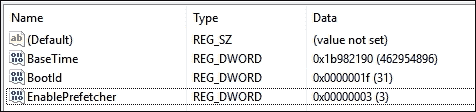

    图 2：注册表中的预取

恶意软件也是一种程序。因此，如果预取功能配置为启用应用程序的预取，则会在`prefetch`文件夹中为该恶意软件创建一个预取文件。找到恶意软件的预取文件将具有极大的证据价值，因为它将显示恶意软件使用的所有文件和 DLL，这将提供关于其操作的线索，并为后续分析提供起点。

此外，在某些攻击中，攻击链需要在本地系统上运行不同的工具，以便攻击者远程控制该系统。按时间顺序排列预取文件，并按事件时间过滤文件，将帮助我们及时排序在系统中运行并导致感染的工具。这些事实将帮助我们对攻击场景做出更好的假设，并有助于事件响应周期中的根除和恢复阶段。

另一个名为`layout.ini`的文件也位于相同的`prefetch`文件夹中。在此文件中，有一些路径指向频繁使用和加载的文件，这些文件被预取过程加载。Windows 磁盘碎片整理过程使用此文件，将所有频繁打开的文件物理上移动到系统磁盘中的连续位置，以便快速加载并减少顺序访问这些磁盘位置所需的时间。这个过程的效果在 HDD 中比在 SSD 中更为明显，因为在 HDD 中访问任何物理位置都需要机械运动。

## 预取文件分析

值得一提的是，预取文件的结构在不同版本的 Windows 之间有所变化。为了分析预取文件，调查员可以手动使用十六进制编辑器打开它，了解其结构，并开始解析文件内容，甚至创建自动化工具以更快地执行此功能。幸运的是，已经有一个现成的工具，并且支持 Windows 10 及以前版本的预取文件。WinPrefetchView 工具可以从[`nirsoft.com/`](http://nirsoft.com/)下载。

WinPrefetchView 自动解析活动系统中预取文件的位置，并对其进行查看以供进一步分析。为了在我们的 Linux 分析机器上进行事后分析并解析预取文件，我们可以在 Wine 环境中运行 WinPrefetch 程序，并从挂载的镜像中复制`prefetch`文件夹。

程序界面由两个小窗口组成，一个用于显示与每个预取文件相关的应用程序，另一个则列出从上方窗口选择的程序所使用的所有文件。在图 3 中，我们可以看到 ntosboot 文件，它指的是系统的引导过程，并列出了在此过程中打开的所有文件。在图 3 中，程序在 Wine 环境下的 Linux 机器上运行：

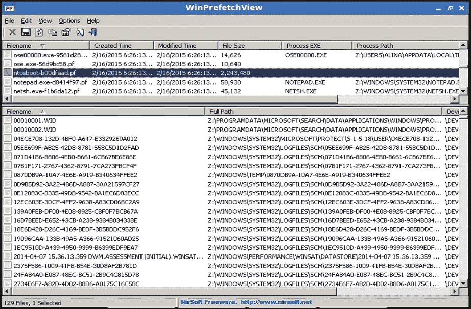

图 3：WinPrefetchView

# Windows 任务

一些程序需要在 Windows 环境中在特定时间执行特定事件。为此，Windows 允许程序创建所谓的**计划任务**。任务存储在`C:\Windows\System32\Tasks`中。每个任务以 XML 文件格式存储，其中包含创建任务的用户、任务发生的时间或触发条件，以及将要执行的命令或程序的路径，这就是任务本身。从 Task Scheduler 2.0 开始，它首次出现在 Windows Vista 中，触发条件可以是基于日历的，也可以是事件，例如当特定事件被记录到事件日志系统时启动任务。操作还可以是：运行程序、发送电子邮件或向用户显示消息。

在实时系统中，调查员可以使用常规的`任务计划程序`来打开任务。从取证镜像中，调查员可以从`C:\Windows\System32\Tasks`提取任务，其中每个文件都是以 XML 格式存储的单个任务。在图 4 中，我们可以看到 Google 在 Windows 操作系统中用于更新 Google 产品的任务：

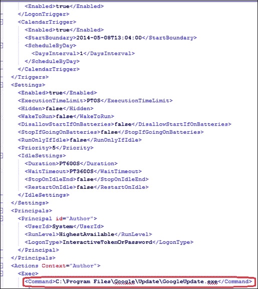

图 4：Google 更新任务

一些恶意软件可以创建一个任务，在特定触发条件下启动自身，比如每天早晨运行恶意软件可执行文件，或在特定时间段后运行。这是恶意软件作者确保恶意软件在感染机器上存在的另一种方式，除了将其可执行文件添加到启动注册表键或作为系统服务。

# Windows Thumbs DB

当用户使用`Windows`文件夹查看选项中的**缩略图**或**胶片条**视图时，系统会创建一个小的图片缩略图版本并将其存储在一个文件中。这个文件在 Windows XP 中与图片位于同一目录，并命名为`Thumbs.db`。`Thumbs.db`文件包含了现有图片以及已删除图片的缩略图版本。`Thumbs.db`是一个隐藏文件，通常用户不会注意到它：

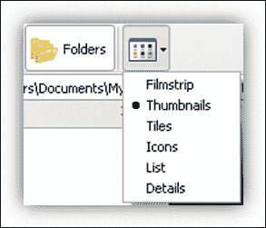

图 5：文件查看选项

如果用户删除了图片，但没有删除`Thumbs.db`文件，那么就有可能恢复该目录中已删除图片的缩略图版本，这为图片内容提供了很好的线索。除了图片的缩略图版本，`Thumbs.db`还包含文件名以及最后修改的日期和时间。

这个`Thumbs.db`文件在与图片相关的案件中非常重要，例如儿童色情案件。

从 Windows 7 开始，处理缩略图文件的过程发生了变化。所有 `Thumbs.db` 文件都分配在一个文件夹中，即 `C:\Users\<UserName>\AppData\Local\Microsoft\Windows\Explorer`。从取证角度来看，这更为便捷，因为所有文件都在同一位置，无需在整个分区或磁盘中搜索任何 `Thumbs.db` 文件，并且如果用户删除了整个照片文件夹，文件也不会被删除。此外，文件名已更改为 `Thumbcache.db`。

在现代 Windows 版本中，文件的视图有不同的大小：小、中、大和超大。每种视图布局大小都需要分配不同的 Thumbcache 文件。每种大小都有一个单独的 Thumbcache 数据库，Thumbcache 文件的名称带有一个数字，表示视图布局的大小，例如 `thumbcache_32.db` 或 `thumbcache_256.db`：

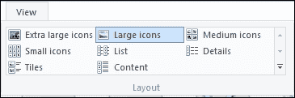

图 6：现代 Windows 操作系统中的文件视图选项

## Thumbcache 分析

Thumbcache Viewer 是一个免费工具，可从 [`thumbcacheviewer.github.io/`](https://thumbcacheviewer.github.io/) 下载。它从 Thumbcache 文件中提取缩略图图像，如下截图所示：

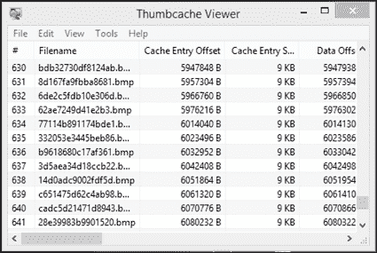

图 7：Thumbcache Viewer

请注意，还有另一种版本用于解析 `Thumbs.db` 文件。

原始文件路径未存储在 `Thumbcache` 文件中。要将文件映射到其原始位置，我们可以在目标 Windows 系统中运行程序，并从活动系统开始映射。或者，我们可以提取并使用来自目标系统（正在调查的系统）的 Windows 搜索数据库 `Windows.edb` 文件，这是位于 `C:\ProgramData\Microsoft\Search\Data\Applications\Windows\` 下的 ESE 数据库：

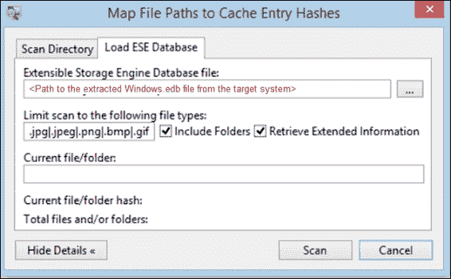

图 8：映射 Thumbcache 文件到位置

这是由 Windows 索引服务创建的，用于加速 Windows 操作系统中的搜索过程。Thumbcache Viewer 使用此文件将条目映射到其在目标系统中的原始位置。Thumbcache Viewer 可以在另一个 Windows 系统上运行，并且仅使用目标 Windows 系统中的此数据库文件。但是，在此情况下，主机 Windows 操作系统必须是目标 Windows 系统的相同或更高版本。基于 `Windows.edb` 文件中的数据，不会映射所有条目，但成功映射的条目将以绿色显示：

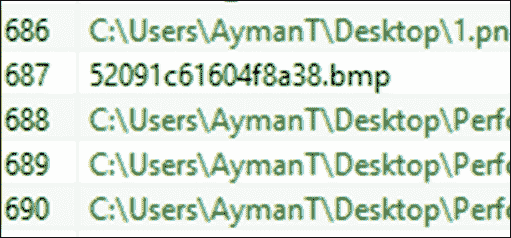

图 9：使用 Windows.edb 文件映射条目。

## 损坏的 Windows.edb 文件

提取的 `Windows.edb` 文件在某些情况下可能会损坏。如果 `Windows.edb` 文件损坏，该工具将警告您，并要求首先恢复此文件以在映射中使用。幸运的是，可以使用 `esentutl.exe` Windows 原生工具并带有 /p 开关来恢复这样的文件：

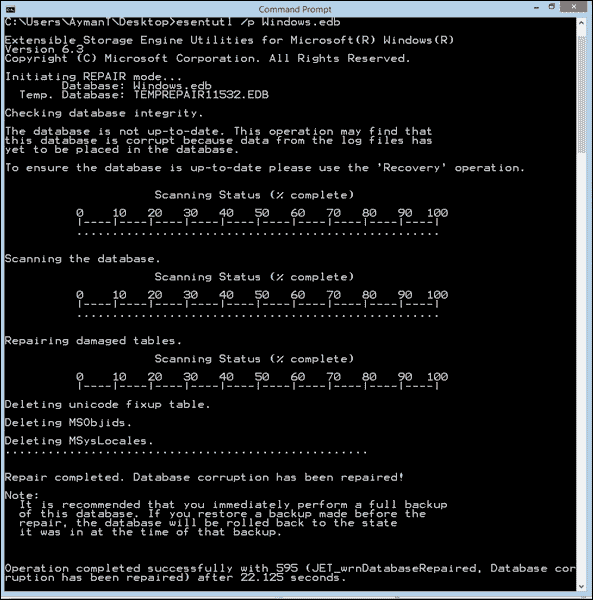

图 10：修复损坏的 Windows.edb 文件

# Windows 回收站

当用户使用正常的删除过程删除文件时，文件实际上并没有从硬盘中消失。它只会在文件系统中标记为已删除，所有文件的元数据和内容会继续存在于硬盘上，直到被其他文件的元数据和内容覆盖。这使得用户可以在误删文件的情况下进行恢复。已删除的文件将位于 Windows 操作系统中的**回收站**中。

通常，先进的取证工具能够找到并查看已删除的文件，如果系统仍然保存其元数据，并且能够在不进行数据雕刻的情况下读取这些文件。然而，如果调查员只有回收站文件，并且需要了解哪些文件被删除了，可以通过分析 `回收站` 文件夹来实现。

回收站的名称在不同版本的 Windows 中有所不同。在 Windows 95 和 98 版本中，回收站位于系统分区下的一个名为 `RECYCLED` 的文件夹中。从 Windows XP 到 Vista 之前，位置相同，但文件夹名称更改为 `RECYCLER`。从 Windows Vista 开始，名称更改为 `$Recycle.Bin`。

实时系统中的普通用户可以浏览回收站，但他们需要在资源管理器的查看菜单中显示隐藏文件和受保护的系统文件。从回收站中，用户可以通过右键单击文件来将其恢复到原来的位置。只要文件仍然存在于回收站中，它就可以被恢复。

在事后分析中，文件不会像在实时系统中那样显示，且需要更多了解其结构，而这种结构在不同的 Windows 版本之间有所不同。

## RECYCLER

在 `RECYCLER` 文件夹中，还有其他以用户 ID 命名的子文件夹。在这些文件夹中，已删除的文件没有正常名称，而是按顺序命名：DC1、DC2 等等。还有一个名为 INFO2 的二进制文件，它将回收站文件映射到实际的文件名、日期和时间，以及文件的回收站名称。在以下截图中，我们可以看到使用 FTK Imager 打开 Windows XP 实时系统时 `RECYCLER` 的结构：

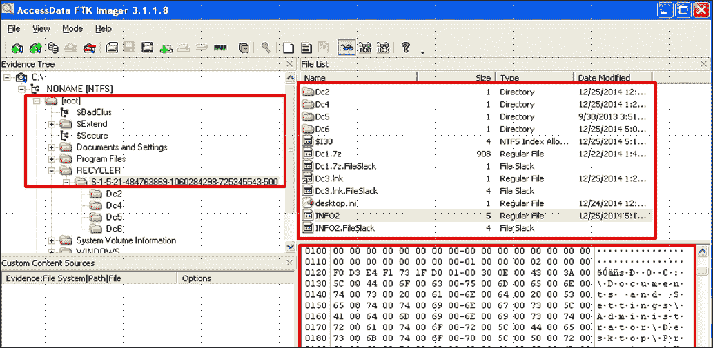

图 11：使用 FTK Imager 查看 Windows XP 中的回收站

如我们所见，文件没有名称，只有按顺序编号的 DC# 名称。INFO2 文件包含所有实际文件的名称和路径，并将它们映射到相应的 DC 名称。通过使用任意十六进制编辑器或 FTK Imager 本身打开 INFO2 文件，可以看到这一点：

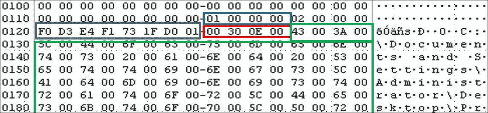

图 12：十六进制格式的 INFO2 文件

这些值可以解析，具体如下：

+   回收站中的文件序列号：`Dc1`

+   删除日期：2014 年 12 月 24 日，星期三 12:20:03 UTC。可以使用 Dcode 程序解码删除时间，具体如下：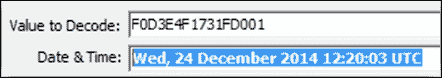

+   实际文件大小（字节）：929792 = 908 KB

+   文件位置和名称：`C:\Documents and Settings\Administrator\Desktop\<FileName>`

## $Recycle.bin

从 Windows Vista 开始使用此功能。与 RECYCLER 中的 DC 命名方案和 INFO2 文件不同，对于每个删除的文件，将有一个类似 INFO2 的文件和另一个包含文件内容的文件，而不是 DC 文件。每个删除的文件的内容将位于一个以 `$R` 开头的文件中，其类似 INFO2 的文件将以 `$I` 开头，并且名字相同，如下图所示：

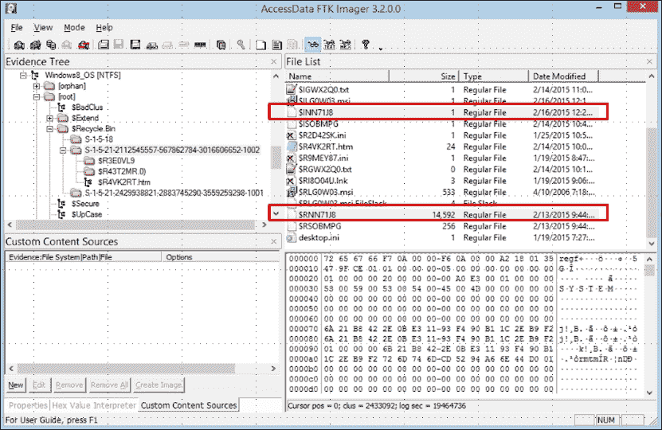

图 13：Windows 8.1 中的 Recycle.bin

如果我们尝试解析类似 INFO2 的文件和 $I 文件，我们可以像以前一样从不同的偏移量提取以下信息：

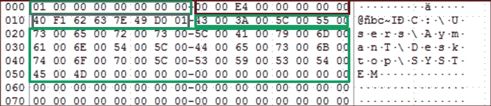

图 14：以十六进制打开的 $I 文件

+   $I 文件头：0x0000000000000001

+   实际文件大小（字节）：14942208 = 14592 KB

+   删除日期：2015 年 2 月 16 日，星期一 00:20:37 UTC

+   文件位置和名称：`C:\Users\AymanT\Desktop\SYSTEM`

# Windows 快捷方式文件

Windows 系统的普通用户可以创建指向系统中任何文件的快捷方式。快捷方式就像是从文件系统中另一个位置指向特定文件的指针。用户创建这个文件以便于访问文件系统中的某些位置或文件。

Windows 操作系统默认在以下位置为最近打开的文件创建快捷方式文件：

+   `C:\users\<username>\AppData\Roaming\Microsoft\Windows\Recent`

+   `C:\users\<username>\AppData\Roaming\Microsoft\Office\Recent`

Windows XP 将快捷方式文件保存在以下位置：

+   `C:\Documents and Settings\<username>\Recent\`

Windows 会存储这些快捷方式文件，如果用户在系统中打开了数据或媒体文件。它会存储时间戳、原始文件的名称和位置，以及卷标名称。

这些链接文件的重要性在于，即使原始文件已经从系统中删除，它们也不会被删除，特别是在 Windows 操作系统中“最近使用”文件夹中自动创建的快捷方式文件。在这种情况下，你可以证明一个特定的文件（可能是一个被感染的 pdf 文件）在被调查的系统中已被打开，即使该文件是从一个现在已被移除的外部存储中打开的。此外，在这种情况下，你将会在链接文件中找到指向该外部存储中文件的路径。

## 快捷方式分析

快捷方式文件的文件系统时间戳可以揭示一些关于文件本身的信息。我们可以将快捷方式文件的创建时间视为文件第一次被打开的时间，而修改时间则是文件最后一次被打开的时间。如果两个时间戳相同，这表明该文件仅从快捷方式文件中提到的位置打开过一次：

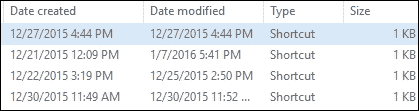

图 15：快捷方式文件的文件系统时间戳

为了在事后分析中显示快捷方式文件的内容，我们可以在运行中的系统中展示它。然而，内容可能会发生变化，以匹配正在运行的 Windows 机器中的某些路径，或者我们可以使用一个工具，如 Exiftool 工具，网址为 [`www.sno.phy.queensu.ca/~phil/exiftool/`](http://www.sno.phy.queensu.ca/~phil/exiftool/)。Exiftool 是一个平台独立的 Perl 库，旨在读取和编辑多种文件的元信息，包括具有不同格式的照片和 `.lnk` 文件。所有支持的文件可以在 [`www.sno.phy.queensu.ca/~phil/exiftool/#supported`](http://www.sno.phy.queensu.ca/~phil/exiftool/#supported) 上找到。

我们可以使用此工具的命令行版本打开任何快捷方式文件，它将显示不同的信息，包括原始文件位置和快捷方式文件的时间戳：

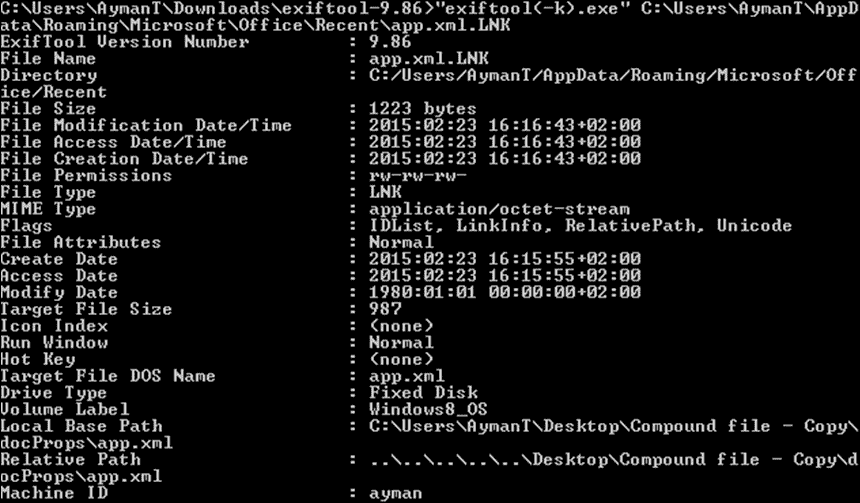

图 16：Exiftool 打开 .lnk 文件

# 总结

因此，在本章节中，我们讨论了对数字取证分析重要的不同 Windows 系统额外工件。我们讨论了预取文件，以及它们如何用于追踪在系统中运行的恶意可执行文件。我们还展示了可以用于保留恶意软件在感染的 Windows 系统中存在的 Windows 任务。然后，我们向您展示了如何通过 Thumbcache 文件调查即使在删除后仍存在于系统中的照片。通过提到删除，我们讨论了回收站及其在不同 Windows 操作系统版本中的结构。最后，我们讨论了快捷方式或 `.lnk` 文件，并说明了如何读取它们的数据及其取证重要性。

由于打开恶意 URL 或恶意附件是感染计算机最常见的方式，在接下来的章节中，我们将讨论浏览器取证，并向您展示如何使用不同的工具和浏览器跟踪用户活动，调查访问过的网站。同时，我们将解释如何进行电子邮件取证，调查收到的电子邮件及其附件或嵌入的链接。
