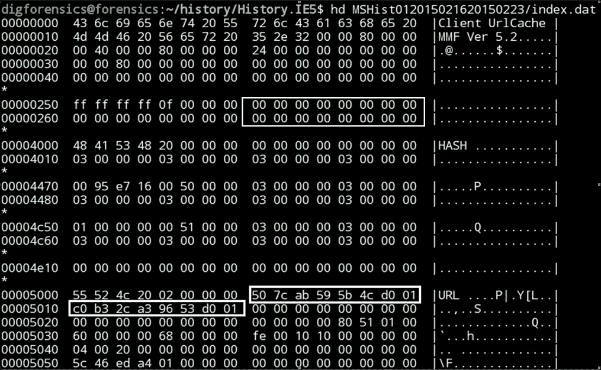

# 第十章：浏览器和电子邮件调查

互联网和万维网如今是搜索和查看数据与信息的主要方式。浏览器是最常用的工具。因此，当分析师试图调查用户活动并为该用户建立画像时，调查浏览器非常重要。这项任务并不简单，因为如今市场上有大量浏览器，且每种浏览器的遗留文件结构各不相同。本章将重点介绍三款最常用的浏览器：Internet Explorer、Firefox 和 Chrome。

电子邮件仍然是数字世界中许多人之间沟通的主要方式，尤其是在企业环境中。本章将介绍不同格式的电子邮件客户端存档，并解释如何从这些存档中读取电子邮件，以便进行分析或追踪发送者。

# 浏览器调查

诱使用户访问恶意链接并下载恶意可执行文件是犯罪分子最常用的感染用户计算机的技术之一。通过分析受害者的浏览活动，可以识别出第一次感染的途径及其工作原理。此外，在分析犯罪计算机时，通过浏览历史记录可以帮助分析用户资料，并通过识别他们通常访问的网站类型以及下载文件的内容来明确他们的意图。

分析浏览器活动需要调查员了解浏览器的不同遗留文件及其位置，并了解每个文件的数据结构。从这一点可以看出，进行深入的浏览器取证是多么棘手。市场上目前有许多浏览器，且一个用户可能同时使用多个浏览器。

在本节中，我们将解释不同浏览器的遗留文件，并探讨如何从本地浏览器文件中提取所有这些遗留文件。

# 微软 Internet Explorer

微软的 Internet Explorer（也称为 IE 或 MSIE）是市场上最早的互联网浏览器之一。它默认随 Windows 操作系统一起提供。版本 1 于 1995 年发布，而在撰写本书时的最新版本是版本 11。在版本 1 与版本 11 之间，以及不同版本的 Windows 之间，MSIE 的遗留文件已经有所变化。

此外，从 Windows Vista 开始，目录结构和遗留文件的位置已在文件系统中发生变化。因此，有两个因素控制着 Internet Explorer 的分析过程：

+   安装的 Internet Explorer 版本

+   正在运行的 Windows 操作系统的版本

## 历史记录文件

通过浏览历史记录，调查员可以对系统用户进行画像，并跟踪他们的活动，从而缩小调查范围。Windows 默认保留浏览历史记录 20 天，可以从程序本身或注册表中进行编辑。

调查员可以使用这些信息查看用户是否最近清除了浏览历史，或者调查员发现的历史记录是否是系统中能找到的最大历史记录。MSIE 保留历史记录的天数可以在软件配置文件中的 `\Microsoft\Windows\CurrentVersion\Internet Settings\Url` 下找到名为 `DaysToKeep` 的值。

不同版本的 Windows 中，历史记录文件的位置有所不同，如下所示：

+   在 Windows Vista 之前，历史记录文件称为 `History.IE5`，位于 `C:\Documents and Settings\<Username>\Local Settings\History.IE5`

+   在 Windows Vista 和 Windows 7 中，位置发生了变化，但仍使用相同的文件结构 `History.IE5`：

    +   `<SystemPartition>\Users\<Username>\AppData\Local\Microsoft\Windows\History\History.IE5`

    +   `<SystemPartition>\Users\<Username>\AppData\Local\Microsoft\Windows\History\Low\History.IE5`

+   在 Windows 8、Windows 8.1 和 Windows 10 中，位置和结构发生了变化：`<SystemPartition>\Users\<Username>\AppData\Local\Microsoft\Windows\WebCache\WebCacheV#.dat`

### 注意

从 Windows Vista 开始，MSIE 版本 7 及之后的版本，在 Windows 7 中运行时，MSIE 以受保护模式运行以提高安全性。此受保护模式默认开启，用户可以关闭它。该模式以低权限运行 MSIE，这意味着任何在浏览过程中由 MSIE 安装的恶意软件也会以相同的低权限运行，从而无法访问和操作操作系统中的敏感区域，如系统文件或注册表键。Windows Vista 或 Windows 7 中受保护模式下 MSIE 的所有活动都位于 `Low` 文件夹下：`<SystemPartition>\Users\<Username>\AppData\Local\Microsoft\Windows\History\Low\History.IE5`。

### History.IE5

这个方法曾在 MSIE 版本 5 到版本 9 中用于存储浏览历史。在活系统中，访问此位置将显示不同的文件夹，表示不同的浏览时期。每个文件夹都包含访问过的网站的链接。用户可以从此位置重新打开这些网站：

活系统上的历史记录

现在，让我们尝试通过命令行打开相同的位置。我们将使用 `dir` 命令列出 `content.IE5` 目录下的文件：

使用 `dir` 命令列出历史记录内容

我们可以看到，文件夹结构不同，只有一个名为 `index.dat` 的文件。但是，如果我们尝试通过 `dir` 命令并使用 `/a` 参数列出所有目录结构，我们会得到不同的结果，如下图所示：

`dir` 命令与 `/a` 参数

我们可以看到两个新目录，目录名以`MSHist01`开头。这两个文件夹代表了前面截图中的两个文件夹。名称的其余部分表示每个文件夹包含的浏览历史的时间段，结构如下：

*常量*`MSHist01`*，开始年份的四位数字，开始月份的两位数字，开始日期的两位数字，结束年份的四位数字，结束月份的两位数字，以及结束日期的两位数字*

因此，这两个文件代表了以下浏览历史：

+   第一个文件显示了从 2015 年 2 月 16 日到 2015 年 2 月 23 日的日期，这表明这是一个每周的历史记录。

+   第二个文件表示 2015 年 2 月 28 日的日常历史记录。

在 Linux 中，如果我们尝试打开相同的`History`目录，我们可以使用`ls`命令看到所有的详细信息：

使用`ls`命令在 Linux 中列出历史记录内容

所以，从这个简短的列表中，我们可以看到有三种不同类型的`index.dat`文件，可以总结如下：

+   主`index.dat`，位于`History.IE5`下

+   每周的`index.dat`文件，位于`weekly`文件夹下。

+   每日`index.dat`文件，位于`daily`文件夹下

每个索引文件包含有关访问过的网站的条目。每个条目以 URL 作为签名开始。每个条目包含网站标题、URL、用户名、点击次数，以及两个时间戳——第一个时间戳位于每个条目的偏移量 8 处，第二个时间戳位于偏移量 16 处。每个时间戳是 32 位或 8 字节长：

每周`index.dat`文件的十六进制转储

了解机器的时区是分析过程中的一个非常关键的信息，但你还必须知道 Windows 中的每个文件如何存储其时间戳——是以 UTC 还是本地时间存储。在`History.IE5`中，有三个不同的`index.dat`文件，每个文件以不同的方式存储时间戳：

| `index.dat`文件类型 | 偏移量 8 处的第一个时间戳 | 偏移量 16 处的第二个时间戳 |
| --- | --- | --- |
| 主文件 | 上次访问时间（UTC） | 上次访问时间（UTC） |
| 每日 | 上次访问时间（本地时间） | 上次访问时间（UTC） |
| 每周 | 上次访问时间（本地时间） | `index.dat`文件的创建时间（UTC） |

> *不同的`index.dat`文件对应不同的时间戳*

使用`DCode.exe`工具可以将时间戳转换为人类可读的格式（[`www.digital-detective.net/digital-forensic-software/free-tools/`](http://www.digital-detective.net/digital-forensic-software/free-tools/)）：

使用 DCode.exe 工具解码每周`index.dat`中的第一个时间戳

每周`index.dat`条目的第一个时间戳显示了其最后一次访问的日期，按本地时间计算。所以，这个页面的最后访问时间是**2015 年 2 月 19 日星期四 13:47:22 UTC**，考虑到机器时区为 UTC+2。

同样，第二个时间戳是****2015 年 2 月 28 日星期六 20:39:24****，这是每周`index.dat`文件本身的创建日期（UTC 时间）。

如果我们不知道计算机的时区，那么在同一条目中，第一个和第二个时间戳之间的时间差就是 UTC 时间与本地时间之间的差异，位于每日的`index.dat`文件中。

### IEHistoryView

IEHistoryView ([`www.nirsoft.net/utils/iehv.html`](http://www.nirsoft.net/utils/iehv.html)) 可以打开`history`文件并解析它，可以在实时系统或 Linux 中的 Wine 环境下通过 History 文件夹进行解析。它可以解析到 MSIE 版本 9：

IEHistoryView 工具（index.dat 解析器）

### BrowsingHistoryView

BrowsingHistoryView ([`nirsoft.net/utils/browsing_history_view.html`](http://nirsoft.net/utils/browsing_history_view.html)) 是另一个可以解析所有版本 MSIE 的程序，它有 32 位和 64 位系统的两个版本。它也可以在实时系统中运行，或者通过提供 webcache 目录的位置进行事后分析。它还可以解析其他不同浏览器的历史记录：

BrowsingHistoryView 自定义分析

### MiTeC Internet History 浏览器

MiTeC Internet History 浏览器是 MiTeC 公司提供的免费软件 ([`www.mitec.cz/ihb.html`](http://www.mitec.cz/ihb.html))。它适用于所有 MSIE 版本，也适用于其他浏览器。它解析计算机并在同一输出中显示不同浏览器的结果：

MiTeC IHB 输出（Windows 8.1 上的三种不同浏览器）

## 缓存

当用户访问网页时，这些页面会被缓存到系统中，以加速浏览。例如，如果用户点击浏览器的后退按钮，浏览器会从本地系统中获取该页面，而不是再次从远程服务器请求它。从取证的角度来看，这对于找出恢复用户访问页面内容的方式非常有用。缓存数据使我们能够做到这一点。

缓存数据的位置因 Windows 版本不同而有所不同，如下所示：

+   在 Windows Vista 之前，缓存文件被命名为`Content.IE5`，并位于`<SystemPartition>\Documents and Settings\<Username>\Local Settings\Temporary Internet Files\Content.IE5`

+   在 Windows Vista、Windows 7 和 Windows 8 中：

    +   `<SystemPartition>\Users\<Username>\AppData\Local\Microsoft\Windows\Temporary Internet Files\Content.IE5`

    +   `<SystemPartition>\Users\<Username>\AppData\Local\Microsoft\Windows\Temporary Internet Files\Low\Content.IE5`

+   在 Windows 8 或从 MSIE V10.0 开始，缓存与`WebCacheV#.dat`文件结合在一起，但旧位置仍然存在，只是有一个名为`container.dat`的文件，大小为 0 字节：

    在 Windows 7 上运行的 MSIE 11 的 Content.IE5

+   在 Windows 8.1 中，`WebCacheV#.dat` 文件仍被操作系统用来保存缓存，但自 MSIE V11.0 起，旧位置已更改为 `INetCache` 目录：

    +   `<SystemPartition>\Users\<Username>\AppData\Local\Microsoft\Windows\INetCache\IE`

    +   `<SystemPartition>\Users\<Username>\AppData\Local\Microsoft\Windows\INetCache\Low\IE`

以下截图显示了 Windows 8.1 中的新缓存位置：

Windows 8.1 缓存位置

### Content.IE5

`Content.IE5` 文件夹从 MSIE5 开始使用，它包含随机命名的文件夹，这些文件夹包含访问页面的实际数据。位于 Content.IE5 文件夹中的 `index.dat` 文件包含每个缓存文件的元数据。该文件跟踪缓存内容并标识位于子目录中的文件。

它包含以下内容：

+   从请求中返回的带有 HTTP 头的原始地址

+   为此 URL 缓存的文件位置

+   缓存记录的类型，即 URL 和 LEAK 用于普通记录，REDR 用于重定向页面，HASH 用于索引文件内容：

    `index.dat` 文件中的一个 URL 示例条目

除此信息外，`index.dat` 文件中还存储了一些时间戳。

### IECacheView

来自 [`www.nirsoft.com`](http://www.nirsoft.com) 的 IECacheView 程序可以解析实时 Windows 系统上的缓存信息。在实时分析的情况下，它将检测缓存信息的正确位置。然而，在事后分析中，应该提供缓存数据的位置：

IECacheView 解析 Windows 7 上 MSIE V8 的缓存数据

该程序可以对上下文菜单中的每个条目执行许多操作，例如查看页面的实际代码，这对于识别页面中带有 iframe 的恶意重定向非常有用。

### Msiecf 解析器（Plaso 框架）

我们将在 第五章 *时间轴* 中突出显示来自 Plaso 框架的 Msiecf 解析器或 MSIE 缓存文件解析器，该解析器用于解析来自法证镜像或备份的系统分区缓存文件，并将所有结果包含在由 log2timeline 工具创建的存储文件中。

我们可以为此解析器创建存储文件，与创建完整存储文件（例如，Win7 解析器）相比，这将花费较少的时间。在这种情况下，我们需要挂载镜像并指向挂载镜像中的用户配置文件位置：

来自 Plaso 框架的 Msiecf 解析器

然后，我们可以像之前一样使用 `psort.py` 工具来过滤创建的存储文件。

## Cookies

Cookies 被远程网站用来跟踪用户在网站上的活动。远程网站将一些信息添加到一个名为 cookie 的单一文件中。这些信息在不同网站之间有所不同。

例如，用户使用一个在线购物网站，开始将商品添加到购物车，并在不同的页面之间浏览，而不会丢失之前添加的商品，也无需登录该网站。实现这一点的方式之一就是将 Cookies 添加到用户的机器上。

有两种不同类型的 Cookies：

+   **会话 Cookies**：这些仅存储在运行机器的内存中。此类型的 Cookies 可以在内存取证中进行调查。

+   **持久性 Cookies**：这些 Cookies 将存储到本地文件系统中，本节我们关注的就是这种类型的 Cookies。

与历史记录和缓存一样，Cookies 在不同版本的机器中的位置也有所不同，具体如下：

+   在 Windows Vista 之前：`<SystemPartition>\Documents and Settings\<Username>\Cookies`

+   在 Windows Vista、Windows 7 和 Windows 8 中：

    +   `<SystemPartition>\Users\<Username>\AppData\Roaming\Microsoft\Windows\Cookies`

    +   `<SystemPartition>\Users\<Username>\AppData\Roaming\Microsoft\Windows\Cookies\Low`

    ### 注意

    从 Windows Vista 开始，微软对操作系统中的用户配置文件文件夹结构和操作进行了某些更改，以提高安全性。一个改进是更广泛地使用漫游配置文件，允许用户在同一域中的机器上访问其配置文件数据。在此远程访问过程中，一些数据，包括用户浏览时的 Cookies，会存储在漫游目录中，而不是远程机器上。

+   在 Windows 8.1 中：

    +   `<SystemPartition>\Users\<Username>\AppData\Local\Microsoft\Windows\INetCookies`

    +   `<SystemPartition>\Users\<Username>\AppData\Local\Microsoft\Windows\INetCookies\Low`

### IECookiesView

IECookiesView 是一个程序（[`www.nirsoft.net/utils/internet_explorer_cookies_view.html`](http://www.nirsoft.net/utils/internet_explorer_cookies_view.html)），可以直接检测活动系统中 Cookies 的位置，它还可以提供来自法医镜像中提取的 Cookies 位置进行事后分析：

在运行 MSIE V8 的 Windows 7 上使用 IECookiesView

IECookiesView 的输出包含以下内容：

+   创建此 Cookie 的网站

+   访问此网站的次数（点击次数）

+   存储的 Cookies 时间戳使用 UTC 时间

+   访问 URL 的用户，可以通过以下模式中提到的文件名的一部分看到：`<UserName>@<SiteURL>`

### 收藏夹

收藏夹是用户为将来使用而存储的一些网站。这些收藏夹有助于识别和描绘用户活动。Windows Vista 之后，收藏夹的位置发生了变化，具体如下：

+   在 Windows Vista 之前：`<SystemPartition>\Documents and Settings\<Username>\Favorites`

+   在 Windows Vista 之后：`<SystemPartition>\Users\<Username>\Favorites`

### FavoritesView

FavoritesView 是 Nirsoft 的另一个程序 ([`www.nirsoft.net/utils/faview.html`](http://www.nirsoft.net/utils/faview.html))，它可以在同一个窗口中解析 Mozilla Firefox 和 Netscape 的书签。在某些情况下，如果程序在实时系统下运行，它可能无法打开书签的正确位置，因此调查员需要打开正确的路径：

Windows 8.1 上的 FavoritesView

## 会话恢复

从 MSIE V8.0 开始，微软实现了一种恢复模式，以便在 MSIE 崩溃时恢复打开的标签页：

MSIE 崩溃恢复消息

每个打开的标签页都有一个文件，描述了在此标签页中打开的页面。包含数据的路径在不同版本的 Windows 中有所不同，如下所示：

+   在 Windows Vista 之前和 MSIE V8 版本：`<SystemPartition>\Documents and Settings\<Username>\ Local Settings\Internet Explorer\Recovery`

+   Windows Vista、Windows 7、Windows 8 和 Windows 8.1: `<SystemPartition>\Users\<Username>\AppData\Local\Microsoft\Internet Explorer\Recovery`

这将为调查员提供很大的帮助，特别是当历史记录被关闭时。每个文件都是一个 OLE 结构的存储文件，签名为 `0xD0CF11E0A1B11AE1`。这种类型的文件需要特殊的解析器。

### MiTeC SSV

MiTeC 结构化存储查看器，来自 [`www.mitec.cz/ssv.html`](http://www.mitec.cz/ssv.html)，可以读取结构化存储格式并进行解析。

通过打开 SSV 中恢复目录下的最后一个活动文件，我们可以找到该文件本身的一些时间戳：

SSV 中的时间戳

创建时间表示会话结束的时间，只要该文件位于最后活动文件夹中。如果我们调查活动文件夹，时间将表示标签页打开的时间：

MSIE 最后活动会话的示例

在之前的图示中，这个标签页打开了两个页面。我们现在关注两个文件：

+   `|KjjaqfajN2c0uzgv1l4qy5nfWe`：这包含了在该标签页中最后打开的 URL

+   `TL#`：这是标签页中打开的页面。# 符号将被一个数字替代，表示该标签页在会话中的顺序

每个 TL# 页面都有页面标题、页面 URL 以及如果有的话，引用的站点。

### Inprivate 模式

**Inprivate** 或 **Incognito** 模式现在几乎在所有浏览器中都有。在 Inprivate 模式下，硬盘上不会保存任何痕迹。所有的痕迹都保存在内存中，包括会话 cookie。内存取证在这种情况下能提供很好的结果。这也是我们需要捕获运行中系统内存而不是关闭系统的另一个原因。

在 Inprivate 模式下的会话恢复文件被创建在相同的位置，但在关闭会话后会被删除。使用 MSIE 的 Inprivate 模式，恢复这些文件可以提供有关在 Inprivate 会话期间访问的网站的信息。通过刻录 OLE 文件头的未分配空间，可能足以恢复这些文件。

## WebCacheV#.dat

MSIE 版本 10 随 Windows 8 一起发布。从此版本开始，推出了一个相对较新的数据文件，即 `WebcacheV#.dat` 文件。`WebcacheV#.dat` 是一个包含多个浏览器数据的单一文件，包括历史记录、缓存和 cookies。文件名中的 `#` 位置为一个两位数的数字，该数字可能因系统不同而有所不同，但在 ` <SystemPartition>\Users\<Username>\AppData\Local\Microsoft\Windows\WebCache\` 目录下，只会有一个这样的文件：

Windows 8.1 中的 WebCacheV#.dat

该文件是一个 **可扩展存储引擎** (**ESE**) 数据库文件或 EDB 文件。这种类型的数据库广泛应用于许多微软应用程序中，例如 Windows 搜索、Active Directory 和 Windows Mail。

尽管该文件包含许多浏览器的混合数据，但浏览器旧位置的文件仍然存在，但它们未被使用（稍后我们会解释）。

### 注意

大多数数据不会从正在运行的系统中提取，因为它们已经被操作系统使用。它们可以从取证镜像中提取。否则，如果我们有适当的权限，可以使用如 **FTK imager** 等程序，从正在运行的系统中转储这些文件，如前所述。

由于它是一个 ESE 数据库，可以使用 Windows 工具 `Esentutl` 来测试 `WebcacheV#.dat` 文件是否损坏：

用于测试 WebCacheV01.dat 文件的 Esentutl 工具

### ESEDatabaseView

Nirsoft 的 ESEDatabaseView 可用于打开 `.dat` 文件。打开后，我们可以在数据库中找到多个容器（表）。我们可以列出容器表中的所有容器：

WebCacheV01.dat 文件中的容器列表

我们可以看到位于 `WebCacheV#.dat` 文件中的所有数据，例如以下截图中突出显示的历史记录数据：

WebCacheV01.dat 文件中的历史记录容器（裁剪图像）

然后，使用容器 ID，我们可以列出包含实际数据的表或容器。例如，容器 1 包含 `History.IE5` 数据：

WebCacheV01.dat 文件中的 History.IE5 容器（裁剪图像）

# Firefox

Firefox 是一款广泛使用的浏览器，自 2004 年发布以来一直在不断发展。从版本 3 开始，它采用 SQLite 格式存储除缓存外的使用数据，自该版本以来，这些数据的存储位置保持不变。

缓存的位置如下：

+   在 Windows Vista 之前：`<SystemPartition>\Documents and Settings\<Username>\Local Settings\Application Data\Mozilla\Firefox\Profiles\<profile folder>`

+   从 Windows Vista 开始：`<SystemPartition>\Users\<Username>\AppData\Local\Mozilla\Firefox\Profiles\<profile folder>`

其余的文件位于以下位置：

+   在 Windows Vista 之前：`<SystemPartition>\Documents and Settings\<Username>\Application Data\Mozilla\Firefox\Profiles\<profile folder>`

+   自 Windows Vista 起：`<SystemPartition>\Users\<Username>\AppData\Roaming\Mozilla\Firefox\Profiles\<profile folder>`

### 注意

`<profile folder>` 文件夹包含 `<RandomText>.default`，例如 `918159wp.default`。

## Places.sqlite

`Places.sqlite` 包含 Firefox 浏览器的浏览历史。它包含许多信息，包括以下内容：

+   URL

+   首次访问的日期/时间

+   上次访问日期/时间

+   访问次数

+   引荐来源

+   访问页面的标题

+   访问类型，包括以下内容：

    +   点击的链接

    +   输入的 URL

    +   重定向

    +   从书签中打开

### MozillaHistoryView

要解析 Firefox 历史记录，可以使用 MozillaHistoryView（[`www.nirsoft.net/utils/mozilla_history_view.html`](http://www.nirsoft.net/utils/mozilla_history_view.html)）。这个工具通常在实时系统中运行，自动检测运行系统中的配置文件位置，或提供 SQLite 数据库的位置：

MozillaHistoryView 选项

## Cookies.sqlite

`Cookies.sqlite` 包含 Firefox 的浏览 Cookie。它存储以下信息：

+   远程网站

+   Cookie 名称

+   创建时间

+   上次访问时间

+   连接类型——安全或非安全

+   存储的来自网站的数据

### MozillaCookiesView

要解析 Firefox 的 Cookie，可以使用 MozillaCookiesView，访问 [`www.nirsoft.net/utils/mzcv.html`](http://www.nirsoft.net/utils/mzcv.html)。它会解析并列出运行系统中的 Cookie 或指向的配置文件目录中的 Cookie：

MozillaCookiesView

## 缓存

Firefox 缓存格式在所有版本中都是相同的。其位置在各版本之间没有变化。它包含关于系统中缓存文件的以下信息：

+   名称

+   类型

+   下载的源 URL

+   大小

+   时间戳（最后修改时间、最后请求时间和过期时间）

+   计数（此文件从缓存数据中被使用的次数）

### MozillaCacheView

MozillaCacheView（[`www.nirsoft.net/utils/mozilla_cache_viewer.html`](http://www.nirsoft.net/utils/mozilla_cache_viewer.html)）可以解析并查看 Firefox 的缓存数据。它还可以导出缓存数据中的任何文件以供检查：

MozillaCacheView

# 其他浏览器

从前述对 MSIE 和 Firefox 的分析中，我们可以理解，由于市场上浏览器数量庞大且各自存储浏览数据的方式不同，数字取证调查员在进行浏览器取证时面临巨大的挑战。Nirsoft.net 包含了许多其他工具，可以解析不同浏览器的数据，网址为[`www.nirsoft.net/web_browser_tools.html`](http://www.nirsoft.net/web_browser_tools.html)，涵盖了 Google Chrome、Opera 和 Safari。

# 电子邮件调查

电子邮件是当今最常用的通信方式之一，特别是在企业环境中。发送、接收或阅读电子邮件会在电子设备中留下痕迹。这些痕迹有助于分析针对性攻击、勒索、间谍活动、信息泄露和骚扰案件。电子邮件的痕迹会根据使用电子邮件账户的方式（通过 Web 邮件或已安装的电子邮件客户端）有所不同。

在 Web 邮件中，浏览器调查和内存取证有助于恢复一些电子邮件数据，甚至在某些情况下恢复电子邮件账户的访问凭据。在本节中，我们将讨论 Outlook 电子邮件客户端在计算机上的遗留数据。

## Outlook PST 文件

市场上有许多电子邮件客户端。微软的 Outlook 是最常用的客户端之一。Outlook 将所有邮件、联系人和日历存储在一个**个人文件夹**（**PFF**）文件中。PFF 文件之一是**个人存储表**（**PST**）文件，默认保存在以下位置：

+   `My Documents\Outlook Files`（在 Windows XP 中）

+   `Documents\Outlook Files`（从 Windows Vista 开始）

用户可以将电子邮件存档到本地计算机，从而释放邮件服务器上的空间。已存档的电子邮件也会存储在 PST 文件中。已存档的 PST 文件不会连接到服务器，也不会与用户账户相关联。它仅在用户的本地计算机上可用，且不会出现在任何其他与用户关联并与其账户同步的设备上，除非用户将存档的 PST 文件复制到另一台设备。

存档文件的位置如下：

+   `<SystemPartition>\Documents and Settings\<username>\Local Settings\Application Data\Microsoft\Outlook`（在 Windows XP 中）

+   `<SystemPartition>\Users\<username>\AppData\Local\Microsoft\Outlook`（从 Windows Vista 开始）

PST 文件可以导入到 Outlook 中，但它不会被上传到服务器。它仅在本地运行的客户端上可用。

## Outlook OST 文件

另一个 PFF 文件是**离线存储表**（**OST**）文件。它主要用于微软 Exchange 服务器账户。它允许用户在本地计算机上创建、编辑或删除邮件，而无需连接到服务器；一旦建立连接，客户端会与服务器同步，并更新用户所做的所有新更改，使服务器和客户端上的两个副本保持一致。

OST 文件可以位于以下位置：

+   在 Windows XP 中，文件存储路径为 `<SystemPartition>\Documents and Settings\<username>\Local Settings\Application Data\Microsoft\Outlook`。

+   从 Windows Vista 开始，文件存储路径为 `<SystemPartition>\Users\<username>\AppData\Local\Microsoft\Outlook`。

与 PST 文件不同，OST 文件不能导入到 Outlook 中；它需要先转换为 PST 文件格式。不同的商业工具可以完成这个转换。

## EML 和 MSG 文件

EML 文件包含用户保存的单一邮件。EML 文件是一个纯文本文件，包含邮件的详细信息，包括标题、正文和附件。EML 文件可以通过 Outlook 或任何兼容的电子邮件客户端打开。此外，还有一些 EML 查看器。

另一种保存邮件的格式是 MSG 格式。MSG 是一种二进制格式，可以作为复合文件进行分析，使用复合文件解析器，如 Joachim Metz 的 **Libolecf**：

使用 Libolecf 解析 MSG 文件

## DBX（Outlook Express）

Outlook Express 在 Windows Vista 之前被使用，之后被 Microsoft Outlook 替代。Outlook Express 使用 DBX 文件作为邮件存储。一个 DBX 文件存储在 `<SystemPartition>\Documents and Settings\<username>\Local Settings\Application Data\Identities\<Identity number>\Microsoft\Outlook Express` 中。Outlook Express 文件夹包含以下文件：

+   `Folder.DBX`：这是 Outlook Express 中的主文件。它包含邮件中文件夹的树状结构。每个邮件结构中的文件夹都有一个不同的 DBX 文件，包括 `Inbox.DBX`、`SentItems.DBX` 和 `Drafts.DBX`。

+   `Cleanup.log`：此日志文件用于记录已删除文件的清理操作。Outlook Express 为最后一次归档创建日志。在归档过程中，Outlook Express 实际上会清理已删除的项目。在正常情况下，它只是将项目标记为已删除，并保留在 DBX 文件中。

## PFF 分析 (libpff)

库 libpff ([`github.com/libyal/libpff/`](https://github.com/libyal/libpff/)) 是一个跨平台库，用于打开和解析 PFF 文件。此库包含两个工具：`pffinfo` 和 `pffexport`。

让我们尝试分析从 Windows 7 的取证镜像中提取的 OST 文件。首先，让我们使用 `pffinfo` 查找 OST 文件的信息：

获取 OST 文件的信息

现在，我们知道 OST 文件没有加密，那么让我们从文件中导出数据：

从 OST 文件中导出数据

在工作目录下将创建一个新文件夹 `<OSTfilename>.export`。在我们的案例中，它将是 `test.ost.export`。由于 OST 文件中包含许多项目，我们创建了 `log.txt` 文件来记录所有这些导出的项目，然后我们可以过滤日志文件并定位感兴趣的项目。在我们的案例中，如果我们只对电子邮件感兴趣，我们可以通过 `grep` 来筛选 `log.txt` 文件中的电子邮件：

OST 文件中的电子邮件

所以，电子邮件存储在不同的文件夹中，比如“已删除邮件”和“收件箱”。如果我们对收到的电子邮件感兴趣，这些邮件可能包含欺骗用户感染计算机的恶意链接或附件，那么我们可以检查“收件箱”文件夹中的邮件。

在创建的导出文件夹中，我们将找到与 OST 相同的文件夹结构。我们可以导航到某个消息的位置，并查看该消息文件夹的内容，如下图所示：

每个消息的内容

我们将为每个消息找到不同的文件，包括消息头和消息正文。通过消息头，我们可以追踪发件人。消息正文将帮助我们检查是否有恶意或钓鱼链接。如果消息包含附件，附件文件会在消息目录下的另一个目录中找到。附件可能是恶意的。

## 其他工具

有许多工具可以用于读取和解析不同的电子邮件文件。其中一些工具可以在实时系统上运行，进行实时分析。

以下是其中的一些工具：

+   MiTeC 邮件查看器支持 Microsoft Outlook Express 4、5、6 消息数据库 [`*.idx`/`*.mbx`/`*.dbx`]，Windows Vista 邮件/Windows Live Mail 和 Mozilla Thunderbird 消息数据库，以及独立的 EML 文件。你可以从 [`www.mitec.cz/mailview.html`](http://www.mitec.cz/mailview.html)下载该工具。

+   用于查看 PST、OST、EML 和 DBX 文件的不同工具来自 [`www.freeviewer.org`](http://www.freeviewer.org)：

    +   PST 文件查看器

    +   OST 文件查看器

    +   EML 文件查看器

    +   Outlook DBX 查看器

+   用于查看 PST、OST 和 EML 文件的不同工具来自 [`www.nucleustechnologies.com`](http://www.nucleustechnologies.com)：

    +   内核 PST 查看器

    +   内核 OST 查看器

    +   内核 EML 查看器

# 总结

在本章中，我们讨论了浏览器分析的重要性、浏览器伪迹，以及如何在不同浏览器中查找和解析这些伪迹。然后，我们学习了如何解析 Microsoft Outlook 的 PFF 文件以及不同的电子邮件文件，如 MSG 和 EML。

在下一章中，我们将介绍 Windows 内存分析，并展示为什么执行内存取证不再是可选的。
