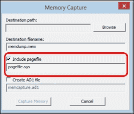
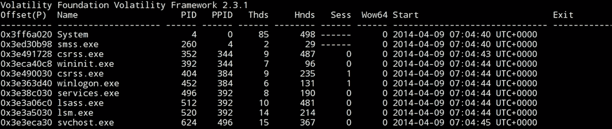
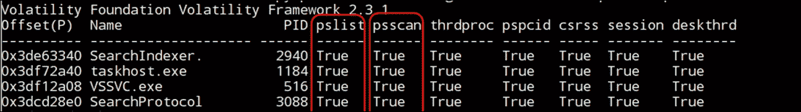
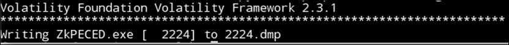
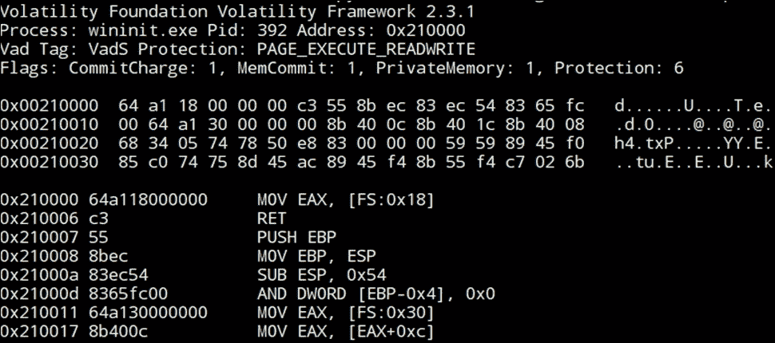

# 第十一章：内存取证

系统内存是操作系统的工作空间。操作系统使用内存来存放执行程序所需的数据和程序本身。这就是为什么在数字取证中，获取系统内存是必须执行的步骤之一。分析内存可能揭示恶意进程或程序的存在，而这些程序在机器硬盘中没有任何痕迹。内存还包含了打开的网络连接，其中可能包括攻击者控制机器或窃取用户数据和信息的连接。

本章我们将简要讨论 Windows 内存结构、攻击者用来隐藏恶意活动和存在的一些技术，以及用于调查内存转储的工具。

# 内存结构

每个运行中的进程都会在内存中分配空间来存储其代码和数据。这个空间由内存页组成。在 x86 系统中，每个内存页的大小为 4 KB。所有进程都通过虚拟地址来寻址其内存空间，系统会将虚拟地址转换为物理地址，且无需任何进程的干预。

在现代操作系统中，运行中的进程分为两类：一类是运行在用户模式下的进程，另一类是运行在内核模式下的进程。这两种模式的区别在于操作系统授予的访问权限级别。在用户模式下，进程不能修改分页或访问其他进程的内存位置，除非通过一些进程间通信使用 Windows API。除 SYSTEM 进程外，所有进程都从用户模式开始运行。

内核模式由 Windows 内核在系统启动时用于设置内存空间和分页。在某些情况下，例如执行 Windows API 时，处理器会接收到中断，这要求它切换到内核模式以执行该中断，然后再返回到用户模式。

# 内存获取

我们在*第三章*《易失性数据收集》中曾讨论过内存获取。然而，现在我们需要在现代 Windows 操作系统中重点介绍这一点，包括禁止进程访问整个内存的不同安全控制措施，以及任何获取工具获取系统内存所需的步骤。这可能会导致系统崩溃和系统内存丢失，或者在活动硬盘加密的情况下丢失整个硬盘。

因此，现代数字取证获取工具通常会首先在操作系统中安装一个驱动程序，然后使用这个驱动程序来访问系统内存，这需要更高的系统权限。

# 内存转储的来源

我们可以将事件响应过程中的内存转储视为内存取证的主要来源。然而，如果我们有一台关闭的机器，或者因某些原因无法获取该机器的内存呢？这里的问题是，我们是否有其他方法进行内存取证？幸运的是，在许多情况下我们对这个问题有肯定的答案。让我们看看有哪些方法。

## 休眠文件

休眠是大多数操作系统中的一种电源选项，包括 Windows 操作系统。在此模式下，系统会将易失性的内存复制到一个名为`hiberfil.sys`的单一文件中，该文件位于硬盘的系统根目录下（硬盘是非易失性的），然后完全关闭计算机。当用户从休眠状态重新启动计算机时，系统会将该文件的内容再次复制到内存中，并恢复先前进程的执行。

如果调查人员拥有受害人或嫌疑人的硬盘取证镜像，他们可以提取休眠文件，并使用本章稍后讨论的内存分析工具对该文件进行内存取证。休眠文件将为调查人员或分析员提供一个特定时间点的内存镜像，可能包含与恶意活动或与调查案件相关的重要证据。

休眠文件的文件系统最后修改时间将指示系统使用休眠时的时间。幸运的是，休眠文件的结构虽然不同，但已知，这使得它可以转换为原始内存镜像，以便使用内存取证工具进行分析。尽管它包含大部分内存数据，但休眠文件不会包含一些数据，例如通过 DHCP 动态获取的网络信息。在分析时，我们需要考虑这一点。

## 崩溃转储

如果 Windows 系统崩溃，它会设计为存储崩溃时的系统状态信息，以便在系统恢复后进行故障排除。系统崩溃曾是通过崩溃转储文件来转储内存的一种旧方法，用户可以使用 Sysinternals 的 NotMyFault 工具来完成这一操作（[`download.sysinternals.com/files/NotMyFault.zip`](http://download.sysinternals.com/files/NotMyFault.zip)）。然而，现在已有更好的方法和工具可用。崩溃转储文件默认命名为 `MEMPRY.DMP`，并直接位于系统根目录下。崩溃转储文件可以根据崩溃转储的设置包含不同的数据，如下所示：

+   **完整内存转储**：这包含崩溃时的物理内存以及一个 1MB 的头部信息。此类型不常见，因为它的大小较大，尤其是在内存较大的系统上。

+   **内核内存转储**：这是系统仅在内核模式下转储内存页面，并忽略用户模式下的页面。

+   **小型转储文件**：这些是小文件，在 32 位系统中大小为 64 KB，在 64 位系统中为 128 KB。它包含有关系统中正在运行的进程和已加载的驱动程序的信息。

为了让调查人员了解案件中存在的转储文件类型，他们可以通过文件的大小来判断。他们还可以打开注册表位置`HKEY_LOCAL_MACHINE\SYSTEM\CurrentControlSet\Control\CrashControl`，在名为**CrashDumpEnable**的值下，它将是以下四个值之一：

+   0: 这是调试信息未写入文件时的情况

+   1: 这是将完整的崩溃转储写入文件时的情况

+   2: 这是将内核内存转储写入文件时的情况

+   3: 这是将小型内存转储写入文件时的情况

提取崩溃转储文件后，调查人员可以使用 Moonsols 的`dmp2bin.exe`工具转换转储文件。

## 页面文件

分页是一种内存管理技术，作为 Windows 内存的二级存储。它通过将最少使用的内存页面移动到硬盘上的名为`pagefile`的文件中，从而加速系统。当用户再次使用这些保存的页面时，系统会将这些页面恢复到内存中。这可以在访问一些长时间未使用的已打开应用程序时察觉到小的延迟。

硬盘上的页面文件最多可以有 16 个文件，且不仅仅位于根目录下。要从注册表中查找页面文件的位置，请检查`HKEY_LOCAL_MACHINE\SYSTEM\CurrentControlSet\Control\Memory Management\ExistingPageFiles`和`PagingFiles`。一些内存采集工具，如 FTK imager，可以在实时采集期间将页面文件添加到内存镜像中：

图 1: FTK imager；在内存采集过程中添加页面文件

页面文件存储无序的数据，这使得深入分析更加困难。这意味着在页面文件中进行字符串搜索可能会提供一些有关页面文件内容和正在调查案件的线索，例如 IP 地址、路径或注册表项。还可以在页面文件中进行文件雕刻，以恢复一些相关文件。扫描页面文件以查找恶意软件特征可能会发现内存中运行的恶意软件。

# 内存中的进程

进程是系统中已执行程序的一个实例。内存中的每个进程都有一个私有的隔离内存空间。一个进程包含执行代码和完成代码执行所需的数据，如文件、DLL 和用户输入。所有这些数据和代码都位于为该进程分配的内存空间中。

许多进程可以同时存在于内存中。所有进程都在运行的 Windows 操作系统内存中列出一个名为`_EPROCESS`的结构。

`_PROCESS`结构的每个条目都包含一个进程及其元数据；包括进程名称、可执行路径、父进程、启动时间，某些情况下，还包括退出时间。如果一个知名进程的父进程不同，则元数据可以作为恶意活动存在的指示。例如，`lsass.exe`进程的父进程是`Explorer.exe`，而它的父进程应该是`Wininit.exe`。在这里我们可以假设该`lsass.exe`进程并不是合法的`lsass.exe`进程，而是在通过假冒合法进程的名称来欺骗用户。

`_EPROCESS`结构类似于双向链表，每个进程指向前一个和下一个进程，形成链状结构。它用于在不同进程之间循环处理时间。用于列出系统进程的常规 Windows 命令使用`EPROCESS`结构按顺序读取所有进程。因此，如果恶意进程能够修改前后两个进程的地址，使其指向对方，那么它将不会出现在进程列表中。这是一些恶意软件样本用来隐藏自己存在的方式。这个技术叫做**直接内核对象操作**（**DKOM**）。

为了克服这种技术，并且由于`_EPROCESS`条目具有特定的结构，除了依赖被篡改的`EPROCESS`结构外，我们可以通过它们的签名对所有的`_EPROCESS`条目进行内存文件的切割。在这种情况下，切割工具不会按顺序遍历`EPROCESS`，也不会漏掉任何隐藏的进程。这也可以显示一些已被从`_EPROCESS`中移除的进程，尽管它们的条目仍然存在于内存中。

# 内存中的网络连接

通常，攻击者利用网络来远程控制机器，发送捕获的用户信息，或接收新的命令。检查在获取时系统中打开的网络连接，可以提供关于攻击的线索。

网络活动通常会在内存中留下痕迹。调查网络连接可能会发现由 rootkit 创建的隐藏连接。这些连接可以像隐藏进程一样，通过与正常的列出工具的方式进行隐藏。对内存中的网络连接结构进行切割可以揭示这些连接。

另一种隐藏连接的技术是将代码注入到一个合法进程中，以打开一个恶意连接，因此我们需要检查内存文件中的所有连接。

# DLL 注入

**DLL** 或 **动态链接库** 是在系统内运行的不同进程之间共享的资源和功能。一些进程和程序需要特殊的外部 DLL，这些 DLL 可以与程序一起包含，以便程序能够正常运行。由于 DLL 通常在进程内存中运行，它们通常成为恶意软件的目标，成为访问和控制其他进程内存的方式。DLL 通过不同的方式加载到进程中：

+   **动态链接**：这是指可执行文件具有**导入地址表**（**IAT**），该表描述了此可执行文件在加载时所需的资源及其地址，这些资源会被加载到进程的内存空间中。

+   **运行时动态链接**：有些 DLL 可能没有在 IAT 中提到，但在程序执行期间通过调用 Windows 函数之一，如 `LoadLibrary`，由程序自身调用。

+   **注入**：DLL 可以通过不同的技术注入到进程中。我们来看一下它们是什么。

## 远程 DLL 注入

恶意进程在合法进程中分配了具有读/写保护的内存空间，并将恶意 DLL 的路径写入合法进程的内存空间中。然后，恶意进程打开一个远程线程，强制在合法进程中打开 DLL，并随后移除 DLL 路径。通过这种方式，恶意进程通过 DLL 中的代码控制合法进程。

检测这种类型的注入并不容易。我们需要列出合法进程加载的所有 DLL，并检查所有 DLL 的名称、路径以及加载时间。

## 远程代码注入

我们遵循与远程 DLL 注入相同的步骤，但不同的是，恶意进程将代码直接注入到分配的内存空间中，而不是将 DLL 的路径写入硬盘。这里，分配的内存空间的保护将是读/写和执行。这种保护方案虽然不常见，但在用于检测这种注入的内存中却经常出现。

## 反射 DLL 注入

混合技术结合了前两种方法。恶意进程将 DLL 直接加载到合法进程的分配内存空间中。通过这种方式，DLL 永远不会写入硬盘，也不会经过正常的加载过程，因此在列出进程加载的 DLL 时，它不会被发现。

# API 钩子

Hooking 通常由 Rootkit 使用，强制内核隐藏所有与恶意软件相关的活动，并拦截用户输入，以窃取用户的敏感信息。这通常是通过操控系统内核的 API 调用输出实现的。这在事件处理过程中的实时分析中可能会造成欺骗。在感染系统的证据获取过程中对内存镜像的深入分析，可以更容易地检测到这种行为。Hooking 通过将一个进程执行的正常流程重定向到内存中的另一个位置执行恶意代码，然后再返回以完成正常的进程代码来完成。

# 内存分析

在成功的内存获取过程之后，调查人员将获得一个包含完整内存的单一转储文件。幸运的是，内存的结构可以被许多分析程序解析，包括 Volatility，当前最著名的内存分析框架。

## Volatility 框架

一个免费的内存取证框架可以从 [`www.volatilityfoundation.org`](http://www.volatilityfoundation.org) 下载。这个框架支持多个版本的 Windows、Mac 和 Linux 操作系统。与 Volatility 2.4 一同发布了一本独立的书籍《*内存取证艺术*》。它详细解释了不同操作系统在内存中的遗留物，并说明了如何使用 Volatility 框架提取和分析这些遗留物。在本节中，我们将讨论 Volatility 框架的使用以及它如何检测内存转储中的恶意活动。

每个操作系统的内存结构都不同。Volatility 具有理解不同结构的能力。使用这个配置文件，Volatility 可以理解正在分析的镜像的正确数据结构，并应用正确的分析和解析工具。

Volatility 与插件配合工作，每个插件执行内存转储文件的特定任务。你可以添加或编写自己的插件，并将其添加到你的版本中。在接下来的章节中，我们将讨论一些 Volatility 插件。

### Volatility 插件

Volatility 插件的完整列表可以在工具的文档中找到。在这里，我们将讨论一些通常用于发现所讨论的恶意软件技术的插件。

#### imagecopy

如果可用的内存文件是休眠文件或崩溃转储文件，Volatility 可以使用 imagecopy 插件将该文件转换为原始格式。

使用方法：`vol.py -f <Hiber|DumpFile> --profile=<ImageProfile> imagecopy -O <OutputFile>`

#### raw2dmp

在某些情况下，你需要将转储的原始内存文件转换为崩溃转储格式，以便与其他工具一起使用，例如 WinDBG，Windows 调试器。在这种情况下，raw2dmp 插件可以完成此任务。

使用方法：`vol.py -f <ImageFile> --profile=<ImageProfile> raw2dmp -O <OutputFile>`

#### imageprofile

在开始分析之前，如果你不知道正确的映像配置文件或者不知道如何在 volatility 命令中写出它，你可以运行 imageinfo 插件来检查映像文件，volatility 会建议正确的配置文件。Imageinfo 实际上使用了另一个插件**kdbgscan**，该插件扫描 NT 内核模块的一部分，查找特定的唯一字符串，以识别映像配置文件。一个字符串（如 Win7SP0X86）提供的配置文件，而 Volatility 默认使用的配置文件是 WinXPSP2x86。

用法：`vol.py -f <ImageFile> imageinfo`

#### pslist

该插件列出内存映像文件中的进程。它遍历`_EPROCESS`结构中的双向链表并打印列表中的所有进程。它显示进程名称、ID、偏移量、父进程 ID、线程和句柄的数量以及进程开始和结束的时间戳。该插件的输出包括每个进程在`_EPROCESS`结构中的逻辑偏移量。如果需要查看物理偏移量，可以使用`-P`选项。如果有从列表中取消链接的隐藏进程，该插件无法检测到它们。

用法：`vol.py -f <ImageFile> --profile=<ImageProfile> pslist -P <OptionalPhysicalOffset>`

以下是前面命令的输出：

图 2：运行 pslist 插件的示例

#### psscan

该插件通过扫描内存转储文件中的任何进程结构，列出内存转储中的进程，它不考虑`EPROCESS`结构。它可以获取内存中的所有进程，包括活动的、已终止的和隐藏的进程。

用法：`vol.py -f <ImageFile> --profile=<ImageProfile> psscan`

#### pstree

pstree 插件以树状视图列出进程，识别父进程和子进程。它使用与 pslist 插件相同的方法列出进程，因此无法检测隐藏或未链接的进程。输出按层次结构显示不同级别的父子关系。

用法：`vol.py -f <ImageFile> --profile=<ImageProfile> pstree`

#### psxview

插件 psxview 比较不同的进程查看技术的结果，例如，使用 pslist 和 psscan。这有助于从一个输出窗口中检测隐藏和未链接的进程。

用法：`vol.py -f <ImageFile> --profile=<ImageProfile> psxview`

以下是前面命令的输出：

图 3：运行 psscan 的示例

#### getsids

每个进程都有启动它的用户的权限。用户的安全标识符 SID 描述了该用户在系统中的权限。进程有一个为用户登录时创建的访问令牌副本。

使用 getsids 插件和进程 ID，提供启动该进程的用户的 SID。

SID 可以通过系统注册表轻松映射，路径如下：`HKEY_LOCAL_MACHINE\SOFTWARE\Microsoft\Windows NT\CurrentVersion\ProfileList`。

也可以从内存中打开的注册表中提取这些信息，稍后会讨论这一点。

使用方法：`vol.py -f <ImageFile> --profile=<ImageProfile> getsids -p <optionalPID>`

#### dlllist

这个插件列出了所有通过操作系统中的常规方式调用并添加到进程中的 DLL。它显示了内存中所有进程的所有 DLL。如果调查人员使用了`-p`选项并指定了特定的 PID，那么此时只会列出该特定进程的 DLL。

在处理隐藏或未链接的进程时，我们需要使用其在内存中结构的物理地址。因此，如果我们需要列出未链接或隐藏进程的 DLL，我们需要提供插件该进程在 psscan 插件输出中的物理偏移量，并使用`--offset= option`。

使用方法：`vol.py -f <ImageFile> --profile=<ImageProfile> dlllist -p <OptionalPID> --offset= <PhysicalOffsetOfTheProcessFromPsscan>`

#### handles

一个进程可以有许多指向操作系统中多个对象的句柄。由于每个进程的句柄数量巨大，分析这些句柄可能会很困难。然而，这在证明关于事件的理论时可能起到重要作用。它可以为调查人员提供证据，证明某个进程请求了一个句柄来访问文件系统中的特定文件，或创建一个特定的突变体，作为特定恶意软件的标识。

使用 Volatility 中的 handles 插件，我们可以通过进程 ID 显示一个进程的所有插件，并选择在结果中显示哪种类型的句柄。

使用方法：`vol.py -f <ImageFile> --profile=<ImageProfile> handles -p <optionalPID> -t <OptionalHandleType>`

#### filescan

任何进程要创建或读取文件，首先需要在内存中打开该文件。Volatility 插件 filescan 解析内存中的文件对象标签，列出所有打开的文件或被 rootkit 隐藏的文件，这些文件是普通文件扫描工具无法检测到的。

该插件将显示检测到的文件对象的物理偏移量和文件名，并显示文件的权限。像 handles 插件一样，filescan 插件对于通过扫描内存中打开的特定文件来确认特定恶意软件的存在非常有用。我们可以将此插件的输出与 Linux 中的`grep`命令管道结合使用，以过滤特定的文件名。

使用方法：`vol.py -f <ImageFile> --profile=<ImageProfile> filescan | grep "<FileName>"`

#### procexedump

当一个可执行文件在系统中运行时，该可执行文件的一个版本会被复制到内存中。在分析过程中，我们可以从内存中转储该可执行文件，以便检查可执行代码，或者修复代码并在受控环境中运行，比如沙盒。Volatility 具有 procexedump 插件，可以从内存中转储任何进程的可执行文件。必须提供该进程的 ID。

另一个执行相同功能的插件是 procmemdump，它还会将空闲空间与可执行文件一起转储出来，使用方法相同。如果恶意软件操纵 PE 头部以欺骗转储工具，这将非常有帮助。

用法：`vol.py -f <ImageFile> --profile=<ImageProfile> procexedump -p <PID> -D <OptionalOutputDir>`

#### memdump

当进程开始执行时，它会使用一些内存空间来存储在执行过程中所需的代码和数据。该区域可能包含关于恶意软件的重要信息，如字符串、代码、文件路径、文件内容等。

Volatility 可以将整个区域转储到单个文件以供进一步分析。我们可以针对 Linux 原生命令-Strings 运行此文件，以提取文件中的所有字符串。

用法：`vol.py -f <ImageFile> --profile=<ImageProfile> procexedump -p <PID> -D <OutputDir>`

以下是前述命令的输出：

图 4：转储恶意进程以进行进一步分析

#### svcscan

Windows 服务通常以比其他程序更高的权限在后台运行，由系统用户运行。一些恶意软件样本以服务的形式运行，以便在系统重新启动后继续在后台工作，并确保恶意软件在系统中的存在。Rootkit 可以操纵 Windows 本地服务监控工具，以隐藏某些服务。Volatility 有一个名为 **svcscan** 的插件，除了通过正常手段列出服务外，还解析由 `services.exe` 进程拥有的内存空间，搜索服务的唯一标签。此方法将揭示内存中的任何隐藏进程。

输出显示每个服务的进程 ID、服务名称、服务显示名称、服务类型和当前状态。它还显示注册服务的二进制路径，这对于用户模式服务来说将是一个`EXE`，对于从内核模式运行的服务则是驱动程序名称。

用法：`vol.py -f <ImageFile> --profile=<ImageProfile> svcscan`

#### connections

如前所述，在分析内存样本时，网络跟踪非常重要。Volatility 具有插件以不同方法扫描内存中打开的 TCP 连接。第一个插件是 connections，显示的是 Windows 工具所做的 TCP 连接，将所有连接列在链表结构中。

此插件仅适用于 Windows XP 和 Windows 2003 服务器，仅支持 x68 或 x64。

用法：`vol.py -f <ImageFile> --profile=<ImageProfile> connections -P <OptionalPhysicalOffset>`

#### connscan

与 psscan 插件类似，connscan 不仅搜索连接对象结构，而不是仅列出链表中的所有连接。它还将列出已终止的连接。

一些连接可能已被完全或部分覆盖。因此，在分析过程中，我们需要注意并将结果与正常连接插件进行比较。

用法：`vol.py -f <ImageFile> --profile=<ImageProfile> connscan`

#### sockets

volatility 还有一个网络插件，叫做 sockets，它会列出系统中所有已打开的套接字，不论协议如何。它以 Windows API 会使用的方式列出连接，通过遍历套接字链表来获取信息。这个插件无法找到已关闭的套接字或旧套接字的残留。

该插件仅适用于 Windows XP 和 Windows 2003 服务器，支持 x86 或 x64。

使用方法: `vol.py -f <ImageFile> --profile=<ImageProfile> sockets`

#### sockscan

类似于 connscan 插件，sockscan 会在内存中搜索套接字结构，从而使恢复先前打开过的残留套接字成为可能。

使用方法: `vol.py -f <ImageFile> --profile=<ImageProfile> sockscan`

#### Netscan

对于从 Windows Vista 及更高版本内存中提取的数据，无论是 x86 还是 x64 系统，netscan 插件会检查网络数据流。这个插件会查找 TCP 端点、TCP 监听器、UDP 端点和 UDP 监听器。它能够区分 IPv4 和 IPv6，显示本地和远程 IP 地址，本地和远程端口，以及套接字绑定或连接建立的时间。

由于 netscan 插件会在内存中解析网络数据结构的标记，并将所有结果视作同一输出，因此可能会遗漏某些字段。

使用方法: `vol.py -f <ImageFile> --profile=<ImageProfile> netscan`

#### hivelist 和 printkey

注册表的配置单元已在内存中打开。为了在内存中定位配置单元文件，我们可以使用 hivelist volatility 插件，它会列出内存中配置单元文件的地址，包括虚拟地址和物理地址，以及硬盘上配置单元文件的完整路径。

我们可以使用 printkey 插件来显示某个特定注册表项下的子键、值和数据。该插件会解析所有配置单元，以定位所需的键，且该键可能位于多个配置单元中。

如果你想将搜索限制在某个配置单元内，可以使用 `-o` 选项向插件提供虚拟地址。

使用方法: `vol.py -f <ImageFile> --profile=<ImageProfile> hivelist`

使用方法: `vol.py -f <ImageFile> --profile=<ImageProfile> printkey -o <OptionalVirtualOffsetOfTheHiveFile> -K "PathWithinTheregisty"`

#### malfind

malfind volatility 插件可以发现隐藏的注入代码或 DLL，基于特定内存页所授予的权限。它能够检测以可疑方式注入的 DLL 或代码，例如，使用 `CreateRemoteThread` 或 `LoadLibrary` 函数。

malfind 插件的输出会将检测到区域的代码反汇编。该输出可能包含恶意代码或以 MZ 开头的可执行文件。

识别的内存段副本可以使用 `-D` 或 `-dump-dir=<Dir>` 提取进行进一步分析，提取的内存段将存储在 `<Dir>` 下。

使用方法: `vol.py -f <ImageFile> --profile=<ImageProfile> malfind -p <PID> -D <OptionalOutputDir>`

以下是前面命令的输出：

图 5: malfind 示例

在前面的截图中，内存区域的基地址是`0x00210000`，在`wininit.exe`进程（ID `392`）中，具有`PAGE_EXECUTE_READWRITE`权限。

#### vaddump

**VAD**（**虚拟地址描述符**）用于 Windows 内存中，描述由内存中运行的进程分配的内存位置。每当进程分配新的内存时，就会在所谓的 VAD 树中创建一个新的 VAD 条目。每个 VAD 条目都有一个开始和结束，它覆盖进程内存空间中的特定区域。

volatility 框架有一个插件 vaddump，它可以单独转储每个 VAD 区域，如果我们只对一个 VAD 条目感兴趣，这通常很有帮助。如果发生了代码或 DLL 注入，我们可以提取包含恶意代码的 VAD。

每个 VAD 都有元数据，包括开始和结束。vadinfo volatility 插件可以提供有关单个进程中 VAD 的更多信息。

用法：`vol.py -f <ImageFile> --profile=<ImageProfile> vaddump -p <PID> -b <VADStartAddressInHex> -D <OutputDir>`

#### apihooks

apihooks volatility 插件检测钩子。它检测调用（CALL）和跳转（JMP）到内存中的其他位置。被导入或导出的函数以以下指令开始：

+   CALL addr

+   JMP addr

+   PUSH addr; RET

+   MOV reg, addr; CALL reg

+   MOV reg, addr; JMP reg,

如果插件检测到一个地址超出了进程的内存空间，它会报告一个钩子。

用法：`vol.py -f <ImageFile> --profile=<ImageProfile> apihooks`

#### mftparser

maftparser volatility 插件使用 FILE 或 BAAD 条目签名扫描内存文件中的主文件表（MFT）条目。它可以列出来自`$FILE_NAME`、`$STANDARD_INFORMATION`和`$DATA NTFS`属性的信息。

此插件的输出可以通过`--output=text`选项以文本格式呈现。也可以通过`--output=body`选项将其格式化为兼容 The Sleuth Kit 3 的主体格式。

如果是一个主体文件，我们可以使用 mactime 工具创建一个时间轴，列出内存中所有 MFT 活动，这将有助于按时间跟踪活动。

用法：`vol.py -f <ImageFile> --profile=<ImageProfile> mftparser --output=<body|text> --output-file=<OutputFile>`

# 总结

在本章中，我们讨论了内存取证在发现恶意活动中的重要性，简要解释了内存结构，并介绍了 volatility 作为最著名和有效的内存取证工具之一。

在下一章中，我们将讨论网络取证工具和技术，以便从任何网络转储中提取证据数据。
