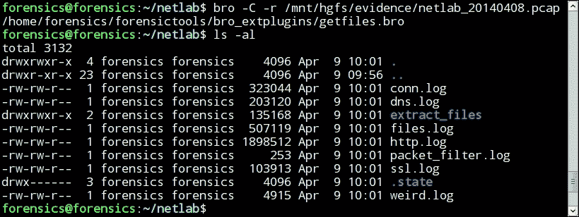
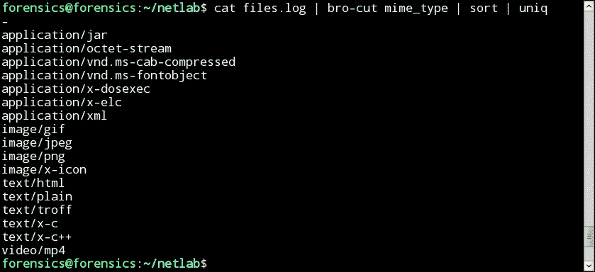
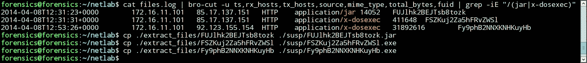
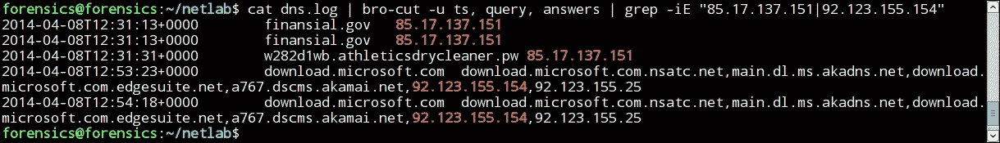
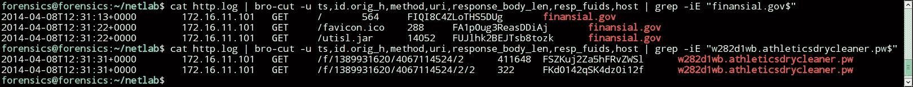
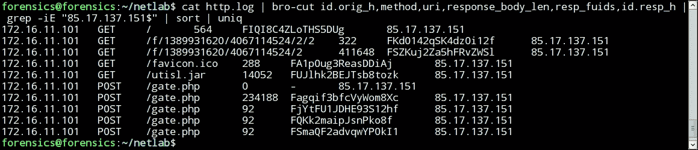
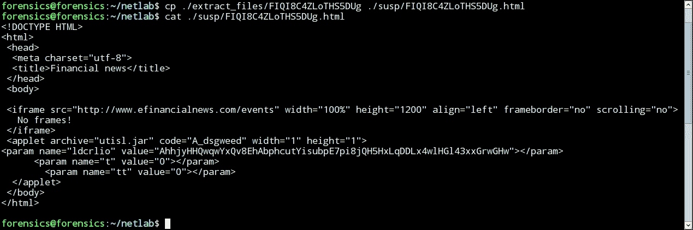

# 第十二章：网络取证

网络取证是计算机取证中的一个独立大领域，也包括多个领域。在网络取证中，我们应当理解取证方法，其中主要证据是研究网络设备、网络应用（如代理、防火墙、服务器等）的数字网络流量日志。

与常规的主机网络取证结合使用时，它可以更有效地解决事件。来自网络层的信息提供了发生事件的完整图景。此外，在某些情况下，分析师无法访问这些被攻陷的机器，因为攻击者使用加密、删除文件或使用其他技术来隐藏信息。

在复杂的定向攻击中，初始的网络入侵只是攻击的第一阶段。接下来的步骤包括网络推广、攻击发展、信息收集和数据外泄，这些都需要通过网络进行。

网络流量数据与易变性有关，因此，为了收集网络流量，有必要进行一系列准备措施来收集数据。

# 网络数据收集

从网络流量中可以提取的所有数据可以分为几个层级：

+   完整数据包捕获 100%

+   数据包字符串数据 4%

+   会话 0.1%

+   统计数据

+   日志

很明显，从取证分析师的角度来看，最优先的方法是收集完整的流量，因为在这种情况下，我们可以获得最完整的数据集。

然而，尽管这种方法有明显的优势，但也存在一些缺点。大量的数据存储和后续分析需要大量的时间和资源。

与此同时，其他形式的数据，如 NetFlow，在许多情况下是一个合理的替代方案，它需要更少的资源来收集、存储和处理。

与其他形式的完整流量相比，这些数据总共只占几个百分点。它需要更少的存储空间，因此可以存储更长时间。

为了更清楚地说明，考虑以下例子。假设一个组织的日常网络流量量在工作日为 1 TB/天，周末为 100 GB，而每周的存储数据量需要 5.2 TB。

其他格式的数据每周需要 *5200 * 0.041 = 213.2 MB*。因此，数据存储所需的总量为每周 5.4 TB，或平均每天大约 770 MB。

如果我们谈到确保至少存储三个月的数据，它将需要 69 TB 的磁盘空间。除了处理如此大量的数据外，还需要大量的时间和电力设备。

然而，这个问题可以通过结合收集和分析网络数据的方法来解决。具体来说，可以只存储一周的完整流量，而将其余的数据存储一年。

因此，存储网络数据一年 5200 将需要*0.041 + 5200 * / 7 * 365 = 16.32 TB*。

如前所述，Full Packet Capture 数据收集和 NetFlow 前提条件要求在事件发生之前收集数据。不幸的是，在事件发生时，往往会发现组织没有 Full Packet Capture，也没有 NetFlow 数据。在这种情况下，我们唯一的希望是服务器和网络设备上的日志记录过程已经启用。

接下来，考虑与不同数据类型的工作，因为法医分析师通常处理的是在事件发生时可用的数据。

# 探索日志

企业网络连接到互联网最普遍的方式是使用代理服务器。此外，除 HTTP 和 HTTPS 外，所有协议都被防火墙阻止。因此，我们考虑这个特定方案。代理服务器是客户端和服务器之间的中介。代理可以用于几乎所有网络协议，但最常用于 Web 流量的 HTTP 和 HTTPS。

在这种情况下，法医分析师通常会有一个数据代理服务器。代理日志在分析访问企业网络机器的 URL 时非常宝贵。分析代理服务器的日志可以快速识别哪些工作站暴露于恶意资源。比起分析每台客户端机器，这个过程要快得多。

通常，代理日志不仅包括客户端的时间和 IP 地址以及 URL，还包括 HTTP 响应状态和用户名：

+   Unix 时间戳（`sec.ms`）

+   响应时间（`ms`）

+   请求者 IP/名称

+   缓存状态和 HTTP 状态码

+   回复大小（字节）

+   请求方法（GET、POST 等）

+   请求的 URL

+   用户名（如果可用）

+   Squid 层次状态和服务器 IP/对等名称

+   MIME 类型

此外，缓存代理服务器使你能够存储所有请求对象的额外副本。在某些情况下，这是获取所需文件并执行分析的唯一方法。

目前有许多不同的代理服务器，既有商业的也有免费的。然而，可能目前最受欢迎的是 Squid。在免费的服务器中，NGINX 也可以被提及。

也有许多商业解决方案，既有硬件形式，也有软件形式。在商业代理中，最受欢迎的之一是 BlueCoat 代理。它的优点之一是能够代理 SSL 流量。

其他在企业环境中流行的解决方案包括 ForeFront Threat Management Gateway（前身为 Microsoft ISA Server）和 Barracuda Network 的解决方案。

它们都有自己日志文件的格式，我们不会考虑所有这些方案。我们将专注于详细检查 Squid。

如前所述，Squid 是围绕着一个庞大的用户社区形成的最流行且免费的解决方案之一。这个决策可以在小型网络和大型企业中找到。Squid 具有巨大的潜力，并且相对容易安装。

一个经验丰富的管理员可以将 Squid 配置为一个缓存服务器，针对不同文件类型设定不同的过滤规则，并提供大量额外选项。所有这些设置都在 Squid 配置文件中，并且必须与日志文件一起复制进行分析。默认的配置文件位于 `/etc/squid/squid.conf`。该文件有详细的文档，解释了配置文件中的许多设置，包括日志文件和缓存的存放位置。

日志文件包含了通过 HTTP 协议发出的所有客户端请求的信息。缓存目录则包含了来自 web 服务器的响应。在调查过程中，分析师可以获取所有文件并对其进行分析。

默认情况下，Squid 会提供关于每个请求的大量信息，这些请求来自客户。因此，在调查过程中，分析师可以获取所有通过代理的 HTTP 流量对象。攻击者通常利用 HTTP 协议传输恶意软件，并作为与 C&C 服务器进行通信的手段，因此代理是收集此类活动信息的一个好地方。

通常，代理服务器 Squid 的日志文件（`access.log`）中的条目如下：

```
|12345678910.134|534|129.134.21.51|TCP MISS/200|1345|GET|http://www.123.cc|-|DIRECT/134.41.65.13|text/htm|

```

值得注意的是，查询字符串会被记录并且不会默认启用。为了解决这种情况，必须在配置文件中做相应的更改，即这一行：

```
strip_query_terms off

```

除此之外，记录以下信息也是非常有用的：

```
User_Agent
 Referer

```

这些选项在调查中尤其有用。此外，从 Squid 2.6 版本开始，你现在可以通过配置文件中的 `logformat` 选项来指定你自己的日志格式。

因此，管理员可以指定备用日志文件和格式字符串。

让我们看以下示例：

```
logformat customlogformat %tl %a> "%rm %ru HTTP/%rv"
    %>Hs %<st "%{Referer}>h""%{User-Agent}>h" %Ss:%Sh
access_log /var/log/squid/access.log customlogformat

```

由于 Squid 的日志文件仅仅是一个文本文件，因此可以很容易地通过脚本语言和命令行工具来进行自动化处理。此外，Squid 中还有大量不同的日志文件分析器。以下是其中的一些：

+   Squidview: [`www.rillion.net/squidview/`](http://www.rillion.net/squidview/)

+   Calamaris: [`cord.de/calamaris-english`](http://cord.de/calamaris-english)

+   SARG: [`sourceforge.net/projects/sarg/`](http://sourceforge.net/projects/sarg/)

每种方式都有其优缺点，因此需要选择最合适的：

```
Full Packet Capture

```

考虑以下情况，当分析师有网络流量的完整转储时。在某些情况下，记录网络流量是事件发生后调查和检测的一部分。即便是在这种情况下，网络流量分析也能大大提高调查的有效性。

捕获网络流量时，最常用的格式是 PCAP 格式。大多数数据收集、分析和检测工具都支持这种格式。

大多数流行的工具都建立在`libpcap`库之上，包括`tcpdump`和`wireshark`，它们具有类似的功能。

# 使用`tcpdump`

`tcpdump`工具用于收集和分析网络数据包。它非常适合分析单个包及其一致性。在自动处理的情况下，`tcpdump`具有多个优点。

要读取之前记录的`pcap`文件，你可以使用以下命令：

```
tcpdump -nnr dump.pcap

```

默认情况下，`tcpdump`显示每个数据包的信息，输出格式取决于协议：

```
TCP: 
[Timestamp] [Layer 3 Protocol] [Source IP].
    [Source Port]> [Destination IP]. [Destination Port]:
    [TCP Flags], [TCP Sequence Number],
    [TCP Acknowledgement Number], [TCP Windows Size] ,
    [Data Length] 
UDP: 
[Timestamp] [Layer 3 Protocol] [Source IP].
    [Source Port]> [Destination IP]. [Destination Port]:
    [Layer 4 Protocol], [Data Length]

```

除了使输出更加详细外，还可以使用`-v -vvv`，如以下示例所示：

```
tcpdump -nnvvvr dump.pcap

```

使用`-x`选项，你可以让`tcpdump`以`heh`格式输出数据包，或者使用`-A`或`-X`输出为 ASCII 格式，并且`tcpdump`允许你同时输出两种格式。

在许多情况下，尤其是处理大型`pcap`文件时，使用过滤器丢弃不必要数据的能力特别有用。`tcpdump`工具支持 BPF 过滤器。例如，要只过滤 TCP 数据包到端口`80`，你可以使用以下命令：

```
tcpdump -nnr dump.pcap tcp dst port 80

```

要将过滤后的数据写入文件，必须使用`-w`选项，如下所示：

```
tcpdump - nnr dump.pcap 'tcp dst port 80' -w 80_tcp_dump.pcap

```

有时，需要使用一组过滤器，在这种情况下，将过滤器集写入文件更为方便，从而使用带有`-F`选项的过滤器文件：

```
tcpdump -nnr dump.pcap -F filter.bpf

```

要获取有关`tcpdump`各种键的更多信息，使用`man tcpdump`命令。

# 使用`tshark`

另一个用于分析`pcap`文件的有用工具是`tshark`。

`tshark`工具是 WireShark 的控制台版本。`tshark`几乎具有与`tcpdump`相同的功能，但它增加了 WireShark 协议分析器的可能性，并使用语法进行过滤。

要读取之前记录的`pcap`文件，也可以使用`-r`选项。输出格式取决于协议。因此，`tshark`会显示应用层信息。

要获取更多信息，使用`-V`选项。要以十六进制和 ASCII 格式显示数据包，使用`-x`选项。

Tshark 允许使用类似于 tcpdump 的 BPF 语法来捕获过滤器，并且在使用内置协议分析器时，可以使用显示过滤器。

对于过滤器的使用，应结合`-f`选项和`-R`录制及读取选项一起使用。因此，要读取 DNS 流量的`pcap`文件，可以使用以下命令：

```
tshark -r dump.pcap -R 'udp && dst.port == 53'

```

另一个有用的功能是能够从分析的流量中生成`tshark`统计信息。为此，使用`-z`选项。可以通过`tshark`的 man 页面查看完整的统计信息列表。

例如，要查看 http 流量的统计信息，可以使用以下命令：

```
tshark -r dump.pcap -z http, tree

```

+   **IO**，**phs**：这会显示`pcap`文件协议的结果。

+   **HTTP**，**tree**：这会显示 HTTP 请求和响应的统计信息。

+   **SMB**，**srt**：这会显示与 SMB 命令相关的统计数据。

然而，即便如此，尽管在某些情况下命令行工具非常适合在基础层面分析数据包，但在某些任务中，最好使用如 WireShark 这样的 GUI 工具。

# 使用 WireShark

WireShark 被网络管理员用来解决与网络运行相关的各种问题，但它在网络流量分析和事件调查中也发挥着不可替代的作用。

WireShark 界面可以分为三个主要部分。

上部显示的是数据包列表。每个数据包的信息都可以查看。默认情况下，显示数据包号、时间戳、源地址、目标地址、协议、数据包长度以及不同信息的特定协议。

中间部分显示所选数据包的详细信息，该数据包位于上部分。

底部窗口以十六进制和 ASCII 格式显示单个数据包的字节，如 tcpdump 的 `-X` 选项。

所有窗口中的数据是相互关联的；因此，当我们在一个窗口中选择数据时，相关数据会在其他窗口中高亮显示。

Wireshark 提供了大量分析网络数据包的功能。因此，要在一章中描述这些功能几乎是不可能的。有几本优秀的书籍详细阐述了这些功能，分别是 *实用数据包分析* 和 *Wireshark 网络分析*。

在某些情况下，时间戳是调查中唯一的关键元素。例如，有时分析员只知道事件的大致时间，并且他们必须在特定的时间段内筛选流量。默认情况下，WireShark 会显示数据包的时间戳，该时间戳是从 `pcap` 文件记录流量开始的秒数。可以通过以下菜单更改显示格式：**查看** | **时间显示格式** | **日期和时间**。

为了避免每次都执行此操作，你可以在 Wireshark 中更改这些设置，操作如下：**编辑** | **首选项**

在某些情况下，了解分析的流量的总体情况非常重要。

你可以使用 **统计** 菜单项。这将显示关于收集的流量的丰富信息和统计数据。

例如，协议层级提供了流量报告中所有已识别的协议列表及其统计信息。通常，这有助于识别流量中的异常情况，例如通过 DNS 或 ICMP 隧道的情况。

除此之外，WireShark 允许你根据不同主机之间的流量进行分组。因此，可以确定不同机器之间传输的数据量。可以通过**统计** | **端点**查看机器的统计信息，并通过**统计** | **会话**查看各种会话。

在某些情况下，可能需要分析两个特定主机之间交换的数据。你可以使用 `Following TCPStream` 选项。WireShark 允许你对 UDP、HTTP 和 SSL 执行此类操作。

另一个有用的 WireShark 选项是从网络流量中提取响应。WireShark 允许你从 HTTP、SMB 和 DICOM 流中提取对象。为此，请导航至 **文件** | **导出** | **对象** | **HTTP**。

然后，从显示的文件列表中选择一个文件，使用 **另存为** 保存文件。需要注意的是，在提取文件时，如果网络流量中的数据包中至少有一个 `otsutviya` 包与传输文件有关，则提取文件将失败。

请注意，你可以使用其他一些工具（如 NetworkMiner 或 Bro）从流量中提取文件。我们将在本章后面详细讨论 Bro。

默认设置会在 WireShark 中显示关于数据包的特定列列表，如下所示：

+   批号

+   时间戳

+   源地址

+   接收方位置

+   协议

+   数据包的长度

## 带有更多信息的字段

在某些情况下，这可能需要额外的信息，例如接收方的端口号和源或 HTTP 请求的方法。

考虑以下步骤，这些步骤必须完成，以便添加一个新列，显示 HTTP 使用的方法数据：

1.  从 WireShark `pcap` 流量测试开始。

1.  查找包含 HTTP 请求方法的 HTTP 数据包，例如 GET 或 POST。这可以手动完成，也可以通过输入`http.request`过滤器来完成。

1.  在包含数据包的窗口中选择 HTTP 数据包，然后展开 HTTP 头部，找到包含 **Method Request** 字段的网站。

1.  选择字段，然后右键单击它，选择 **“应用为列”**。

执行这些操作后，应该会出现一个新列。之后，你可以更改该列的名称和其他属性。

通常，WireShark 在分析网络流量中发挥着无价的作用，尤其是在处理大量数据和丰富过滤需求时。要使用 Wireshark BPF 过滤器过滤数据。BPF 过滤器是过滤网络工具（包括 Wireshark、tcpdump、tshark 等）最常见的方法。

BPF 过滤器可用于流量数据收集和分析数据时。考虑 BPF 过滤器的结构，以及由 BPF 创建的一个文件夹，这个文件夹被称为表达式语法。该表达式包括一个或多个原语，这些原语可以通过运算符组合。原语本身由限定符和以下值组成。

有三种类型的限定符，如下所示：

+   **类型：**`host`、`net` 和 `port`

+   **方向：**`src` 和 `dst`

+   **协议：**`ether`、`fddi`、`ip`、`arp`、`rarp`、`decnet`、`lat`、`sca`、`moprc`、`mopdl`、`tcp` 和 `udp`。

这是一个包含多个原语的示例：

+   dst host host

+   src host host

+   host host

+   ether src ehost

+   gateway host

所有原始命令的完整列表可以在 `tcpdump` 工具的主页中找到。

原始命令被分组，并可以使用以下运算符进行组合：

+   否定（`!` 或 `not`）

+   拼接（`&&` 或 `and`）

+   交替（`||` 或 `or`）

有关 BPF 语法的更多信息，请参见主页。

# 了解 Bro

另一个用于分析网络流量的工具是 Bro。Bro 是一个非常强大的工具，通常被视为 IDS，但 Bro 的功能远不止于此。要在单一章节中讨论所有功能几乎是不可能的，因此我们将只讨论其中的一部分。Bro 的众多优势之一是可以使用现成的协议解析器。

例如，以下是其中的一些：

+   DHCP

+   DNS

+   FTP

+   HTTP

+   POP3

+   SMTP

+   SSH

这些协议的列表在不断扩展。

默认情况下，Bro 会将协议分析器应用于流量，并将结果记录在对应不同协议的日志文件中。

Bro 还允许你使用一种名为 Bro 的语言编写自己的处理器。每个事件发生时，事件的处理器可能会导致该事件的发生。

例如，考虑以下简单的事件处理器发现文件：

```
event file_new (f: fa_file) { 
local fname = fmt ("% s", f $ id) 
Files :: add_analyzer (f, Files :: ANALYZER_EXTRACT, [$ extract_filename = fname]) 
} 

```

接下来，移除所有流量中的文件，将此代码保存在文件中，并运行 `getfiles.bro` 命令：

```
bro -C -r traffic.pcap getfiles.bro

```

以下是前述命令的输出：



运行此命令后，将创建目录文件，如下所示：

+   `conn.log`

+   `files.log`

+   `http.log`

+   `ssl.log`

+   `ftp.log`

+   `dns.log`

+   `weird.log`

这些文件包含关于特定协议的网络流量信息。例如，`http.log` 包含以下字段。

除了 Bro 在启动目录中创建的日志文件外，`extract_files` 列出了从流量中提取的文件。对于该目录中的每个文件，你可以在 `files.log` 文件中找到相应的条目。此条目包含一些有用的属性。

要分析这些日志文件的内容，可以使用分发工具 Bro 中的 `bro-cut`。该工具的输入通过管道传递日志文件的内容，并指定要过滤的字段列表。

例如，要列出从流量中提取的文件类型，可以使用以下命令：

```
cat files.log | bro-cut mime_type | sort | uniq

```

以下是前述命令的输出：



假设我们正在调查一个病毒感染事件，那么最感兴趣的文件类型如下：

```
application / jar
application / x-dosexec

```

这些是 MS Windows 文件和 Java 虚拟机上的可执行文件。

然后，我们进一步了解以下感兴趣的文件：

```
cat files.log | bro-cut -u ts, rx_hosts, tx_hosts,
    source, mime_type, total_bytes, fuid | grep -iE "{jar |
    x-dosexec}"

```

以下是前述命令的输出：



这些结果使团队能够设置时间，下载资源文件，并下载传输这些文件的协议。然后你可以在 `extract_files` 目录中找到这些文件并进行分析。

有关资源文件的更多信息，请访问 IP 地址`85.17.137.151 92,123,155,154`，并可以使用来自`dns.log`文件的数据。

`dns.log`文件是 Bro 的结果，它描述了事件、许可，并将域名转换为 IP 地址，反之亦然。请求 DNS 服务器由查询属性表示。服务器的响应属性是`answer`，`ts`是时间戳请求：

```
cat dns.log | bro-cut -u ts, query, answer | grep -iE
    "85.17.137.151 | 92.123.155.154 "

```

以下是前述命令的输出：



结果是，IP 地址`85.17.137.151`解析为域名`finansial.gov`和`w282d1wb.athleticsdrycleaner.pw`。

IP 地址`92.123.155.154`属于`microsoft.com`，这大大减少了下载文件是恶意的可能性。

根据`http.log`文件中分配的域名，可以获得以下信息：

```
cat http.log | bro-cut -u ts, id.orig_h, method, uri,
    response_body_len, resp_fuid, host | grep -iE
    "finansial.gov $"

```

以下是前述命令的输出：



这表明用户从资源`finansial.gov utisl.jar`下载了一个 HTTP 协议的文件（之前提到的`FUJlhk2BEJTsb8tozk.jar.jar`文件）。然后，从同一资源中，下载了`'2' (Fy9phB2NNXKNHKuyHb.exe)`文件：



此外，您必须关注可疑的 HTTP-POST `gate.php`请求。

`resp_fuids`属性标识 Web 服务器的响应，并指示`files.log`文件中的相关条目。因此，`FI ... Ug`标识符可以获取`finansial.gov`服务器在 GET 请求中的响应：



从回复中可以清楚地看出，`utisl.jar`是一个 Java applet。客户端在合法网站`www.efinancialnews.com`的框架中打开了一个页面。

这个小示例清晰地展示了如何仅通过文件流量使用 Bro 进行调查。

然而，示例仅展示了 Bro 所有可能功能的一小部分。要了解 Bro 的其他功能，您可以访问[`www.bro.org/`](https://www.bro.org/)，在那里您可以找到许多额外的资料。

# 总结

在本章中，我们讨论了一些关于网络取证的话题。我们了解了可以从网络中收集哪些数据，以及如何分析代理服务器的日志。此外，我们还学习了如何收集`pcap`文件，并如何使用 WireShark 和 Bro 进行分析。

在接下来的章节中，您将学习如何构建取证环境。我们将描述两种方法；其中一种是虚拟化，另一种则使用分布式系统。我们将以 GRR 作为分布式系统的示例进行说明。
