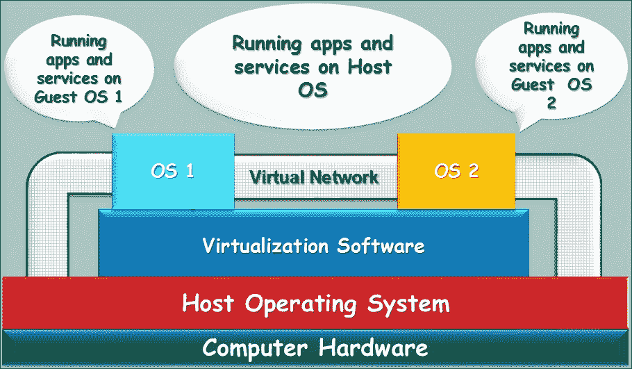
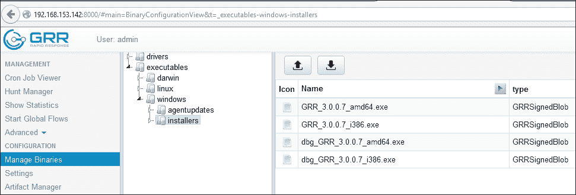
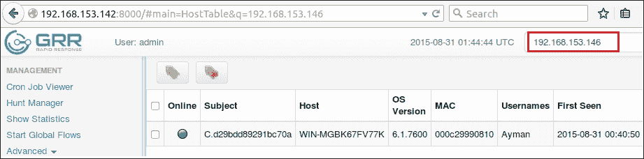
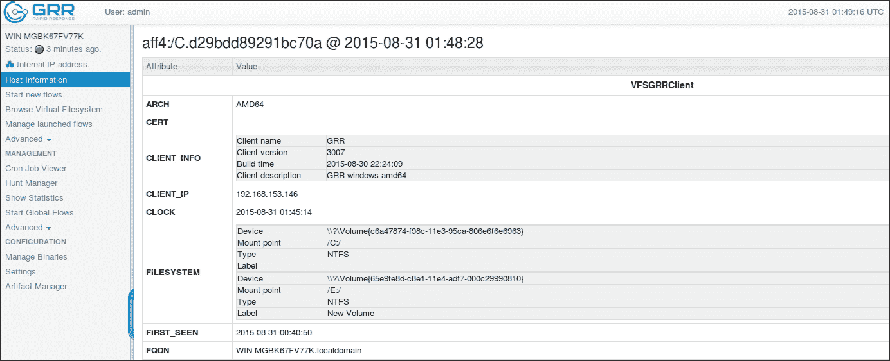
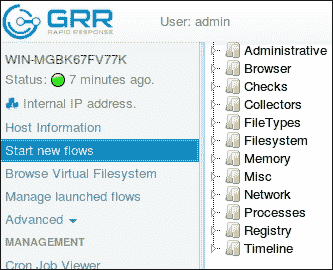
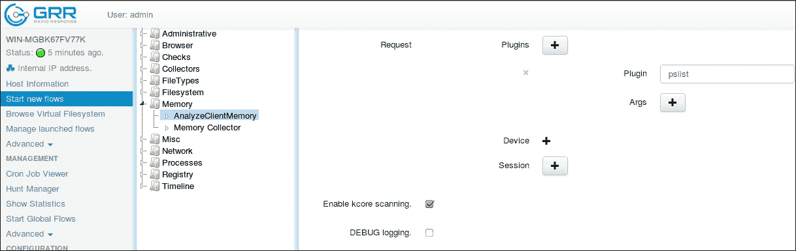
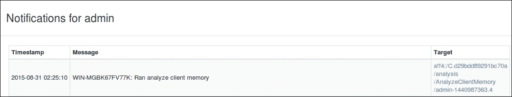
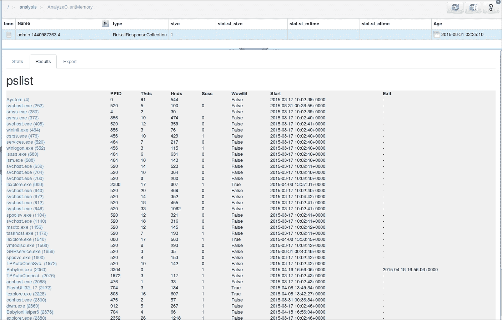

# 附录 appA. 建立取证分析环境

在前几章中，我们应该已经意识到，事件响应对于数字取证过程的重要性，以及准确处理两者的必要性。在本书的附录中，我们将讨论如何创建一个适合进行数字取证分析的工作环境，即企业规模的数字取证实验室。

在我们开始建立实验室之前，先回答以下问题：

+   实验室的目的是什么，我们将分析哪种类型的设备（电脑、手机等）？这将帮助我们确定实验室所需的合适工具。

+   我们预计会接收到多少案件，实验室和工作范围的预期扩展是多少？

+   我们是否已经有经过培训的人员？如果没有，我们将如何选择他们，他们需要哪些培训？他们需要熟悉哪些操作系统，既用于工作，也用于分析？

回答这些问题将使决策更加容易。此外，还有一些可以遵循的指南和标准，如 ISO/IEC 17025:2005，以帮助创建认证的数字取证实验室。

# 需要考虑的因素

除了必要的工具，包括硬件和软件（稍后将讨论），在建设实验室时，还需要考虑一些其他因素。调查人员通常会在实验室工作区待很长时间。因此，它应该足够舒适，并且调查人员必须能够完全控制环境。在接下来的部分中，我们将重点讨论在规划阶段需要考虑的一些因素。

## 大小

在规划实验室时，始终是个好主意为未来的扩展做准备。如果你预期会有扩展，例如，当前团队成员的数量将在两年内增加 50%，你将需要在规划阶段考虑一个更大的实验室，以便你可以让所有成员在同一个地方工作，而不是分布在两个不同的地点。

适当的实验室大小可能受到以下因素的影响：

+   同时工作的调查人员数量，以及不同工作班次之间是否有重叠。

+   除了硬件工具的大小可能占据实验室大量空间外，证据的大小也可能足够大，以至于在没有计划设置单独的锁定证据存储室的情况下，还会占用实验室额外空间。

+   在采集和分析阶段，实验室可能需要进行一些拆解工作；因此，为此类任务设置一个独立的工作台，将有利于实验室的组织。

在申请实验室大小时，必须考虑所有这些因素。

## 环境控制

实验室中许多运行的设备将产生大量热量。控制室内温度并保持在可接受的水平将防止设备因过热而故障，并使实验室对团队成员更加舒适。

除了数字证据采集过程（因为某些证据的影像可能需要几个小时），分析过程本身在某些任务中，如索引处理，可能需要更长的时间。在实验室规划过程中，考虑一个备用电源和一个可靠的主电源是至关重要的，以确保这些过程能够不中断地持续进行，从而节省时间并保持操作顺畅。

在一些案件数量较多的环境中，若没有自动化管理软件，将很难跟进这些案件及其进展情况。为了控制工作流程并防止未授权访问，实验室必须安装一个案件管理系统，该系统可以对案件进行行政控制，并为调查人员分配工作权限，以便处理特定案件。该管理系统能够衡量工作进度，并生成有关工作流程的统计数据，从而发现潜在的弱点，以便未来改进。

## 安全

实验室中的案件通常与犯罪行为相关。因此，确保工作场所免受任何物理或虚拟的未授权访问非常重要，以防止任何可能对证据或分析结果进行篡改。实验室的物理位置需要谨慎选择。以下是维持物理安全所需的一些参数：

+   建筑物的底层更容易被外人访问。将实验室设在较高楼层、没有窗户的房间，有助于控制访问，并防止窃听、录音或闯入实验室。

+   房间的墙壁必须加固。如果有非常先进的房间访问控制系统，但墙壁却是石膏板墙，那可不是一个好主意。

+   基本的安全解决方案，如保留带时间戳的访问日志、摄像头和安保人员，必须提供，尤其是当实验室尚未设置在安全设施内时。

大多数数字取证阶段不需要互联网连接。断开实验室与互联网的连接有利于保密，并防止犯罪分子进行感染或远程控制，从而改变案件结果或破坏证据。然而，某些任务，如软件更新，仍然需要互联网连接。实验室应提供两个独立的网络，一个用于连接分析工作站，另一个用于连接其他计算机到互联网以进行日常研究和更新，并配备安全解决方案，帮助防止互联网未授权访问实验室网络。

## 软件

本书中的章节选择了所有非常有效的工具，都是野外可用的免费或开源工具。然而，也有许多可以购买的商业工具，可以添加到数字取证实验室中，以验证结果或并行执行某些任务。

在使用任何工具之前，必须先进行验证过程。我们将通过将该工具应用于已分析的证据，验证其功能是否正常，确保它能产生相同的结果。经过此测试后，我们可以在未来依赖其结果。此类测试的一个例子是获取过程，我们会计算新工具生成的图像的哈希值，并将其与之前从已验证工具获得的哈希值进行比较。如果哈希值不同，意味着该工具未能正确生成法医图像，我们必须停止使用该工具。

此外，通过不同工具验证结果是确保报告结果准确性的一个好方法，特别是对于那些需要多个分析步骤相互依赖的敏感案例。

数字取证实验室所需的工具通常会进行分类，但不限于以下几类：

+   事件响应，包括不同平台的实时分析和证据获取

+   数据恢复

+   媒体恢复

+   密码恢复

+   电子邮件调查

+   内存分析

+   网络取证

+   浏览器调查

+   移动取证

+   网络调查

请注意，一些工具不支持所有已知的文件系统，因此你需要拥有不同的工具来理解和解析不同的文件系统（`FAT`、`NTFS`、`EXT`、`UFS` 和 `HFS`）。

## 硬件

由于数字取证中需要获取和处理大量数据，分析过程需要非常强大的工作站。有些人喜欢使用服务器，因为它们能提供足够的资源，包括内存、处理器和存储。

今天，构建一台强大机器的预算就是限制。你建造的机器越强大，分析过程中节省的时间就越多。而且，机器的可靠性也非常重要。如果在长时间工作后机器出现故障，导致你丢失所有工作，那将非常令人沮丧。因此，通常法医工作站会配备更可靠的 Xeon 处理器，以适应此类任务。

### 虚拟化

在数字取证中，拥有多种操作系统是必须的，如不同版本的 Windows 和不同的 Linux 及 UNIX 发行版。与其为每个操作系统配置单独的机器，不如通过虚拟化在主操作系统上构建多个操作系统。在本节中，我们将简要讨论虚拟化的概念：

图 1：虚拟化模块

在虚拟化中，实际上被虚拟化的是计算机硬件。通常在同一硬件上，我们无法同时运行多个操作系统。然而，通过在正在运行的操作系统上添加一层额外的软件——虚拟化解决方案，就会出现一个虚拟硬件，准备安装新的操作系统。新的硬件当然是主计算机硬件的一部分，但虚拟地分配给新的操作系统。每一个新的虚拟机都会消耗原始机器的一部分资源。

主操作系统称为 HOST 机，任何创建的操作系统称为 GUEST 虚拟机。宿主机与所有虚拟机共享计算机资源，甚至包括网络连接。正如在*图 1*中所示，虚拟网络连接可以将所有机器与宿主机以及彼此连接。此外，连接也可以仅在两个虚拟机之间共享，而没有宿主机，或者宿主操作系统与一个虚拟机连接，而不与其他虚拟机连接。通过这种方式，可以发生多种可能性。宿主机与虚拟机之间共享文件夹和文件也是适用的。

### 注意

使用虚拟化技术备份虚拟机非常简单。要备份系统，我们需要拍摄一个称为快照的操作。快照是特定时间点机器状态的副本，包括硬盘变化和内存内容。如果用户决定恢复之前拍摄的快照，而没有拍摄新的快照，所有自上次快照以来发生的变化将会丢失。

这就是虚拟化提供受控环境的原因，因为在分析过程中需要进行测试或运行恶意代码，并监控其行为，这就是所谓的动态或行为恶意软件分析。调查人员需要在执行恶意软件之前拍摄一个快照，执行并测试恶意软件，然后从快照恢复系统。

### 虚拟化对取证的好处

在虚拟化中，一切都被视作文件，由宿主操作系统解析，包括硬盘和内存。这使得获取过程变得更加容易。如果调查的案例涉及虚拟系统，例如获取内存，只需复制内存文件即可。

如果机器有之前的快照，这将为调查人员提供机器从不同时间点的不同状态，调查人员可以通过跟踪机器的行为，找出机器何时被感染或遭到破坏。

每个虚拟机都有不同的文件，每个文件代表前面提到的一个资源。我们以 VMware 软件为例，讨论该程序为每个虚拟机创建的文件：

+   **配置文件**：这是一个 VMX 文件，存储了机器本身的配置，包括用户为该虚拟机选择的硬件和网络设置。

+   **内存文件**：这是一个 VMEM 文件，包含了来宾虚拟机的运行内存。

+   **硬盘文件**：这是一个 VMDK 文件，表示来宾虚拟机的虚拟硬盘。根据用户在创建虚拟机时的选择，它可以由单个或多个文件组成。在某些情况下，一个来宾虚拟机可以有多个硬盘，每个硬盘会有不同的文件。

+   **快照文件**：这是一个 VMSN 文件。当用户对来宾虚拟机进行快照时，机器的状态将被存储在此文件中。

+   **暂停状态文件**：这是一个 VMSS 文件，用户可以在不关闭机器的情况下暂停机器。在这种情况下，机器的内存存储在此单一文件中。当用户重新启动机器时，该文件用于重新加载机器的内存。

### 注意

还有其他不同类型的文件。所有文件类型可以在 VMware 网站上找到，[`www.vmware.com/support/ws55/doc/ws_learning_files_in_a_vm.html`](https://www.vmware.com/support/ws55/doc/ws_learning_files_in_a_vm.html)。

## 分布式取证系统

在企业环境中，或者当需要快速和远程分析时，分布式取证系统可以提供帮助。在事件响应过程中，调查员会关注收集一些数据，例如运行中的进程、注册表项和用户账户，以识别可能的感染或测试一些 IOC。然而，如果此时无法物理访问怀疑的环境，该怎么办？

许多公司现在正在投资开发实时监控和分析系统，能够通过在网络中的每台机器上安装客户端，并将所有这些客户端连接到服务器来进行部署。授权的调查员可以通过服务器访问这些机器，利用已安装的客户端获取一些数据，或构建一些统计信息，并进行实时和远程取证分析。

### GRR

在这一部分，我们将讨论 GRR 快速响应框架，[`github.com/google/grr`](https://github.com/google/grr)。GRR 是一个专注于远程实时取证的事件响应框架。它通过一些著名的数字取证框架（如 TSK 和 Rekall）提供远程分析。它由一个服务器组成，能够同时控制大量客户端。

我们将进行一个演示，使用虚拟化环境讨论 GRR，虚拟化环境中有两台虚拟机。这些虚拟机包括一台 IP 为`192.168.153.142`的 Linux Ubuntu 机器和一台 IP 为`192.168.153.146`的 Windows 7 企业版 64 位机器。服务器将安装在 Linux 机器上，客户端将安装在 Windows 机器上。对于服务器-客户端架构，两台机器必须连接到同一网络。我们可以使用任何虚拟化软件配置 NAT 网络并测试两台机器之间的连接。

#### 服务器安装

要安装服务器，您可以参考文档 [`github.com/google/grr-doc/blob/master/quickstart.adoc`](https://github.com/google/grr-doc/blob/master/quickstart.adoc)。完成服务器安装后，它将要求您启动服务器配置，并用于为此特定服务器构建客户端，除了管理员的用户名和密码。在本练习中，管理 URL 为 `http://192.168.153.142:8000`，客户端前端 URL 为 `http://192.168.153.142:8080/control`。

#### 客户端安装

确保服务器和客户端能够互相访问后，我们可以继续在 Windows 机器上安装客户端。在本练习中，我们建议禁用 Windows 虚拟机防火墙。从客户端机器打开以下 URL `http://192.168.153.142:8000/#main=BinaryConfigurationView&t=_executables-windows-installers`，并输入管理员的用户名和密码：

图 2：下载 GRR 客户端

该链接将直接打开 Windows 客户端。我们的 Windows 机器是 64 位的，所以我们需要下载 `GRR_3.0.0.7_amd64.exe` 文件。此客户端已配置为通过服务器 IP 直接连接到 Linux 机器的服务器，因此请确保测试环境中没有 IP 冲突。下载客户端后，我们需要以管理员权限在客户端机器上运行它。稍等片刻，然后去服务器上再次打开管理 URL。

请注意以下事项：

+   客户端可以通过任何方式传输，并不一定需要通过打开管理员门户来实现。

+   在实际情况中，如果客户端真的位于远程位置，服务器必须使用真实 IP 在互联网上发布。在这种情况下，可以使用云服务。

#### 浏览新连接的客户端

打开管理 URL 后，客户端不会直接出现。因此，我们需要有任何关于客户端的信息来进行搜索。根据 GRR 文档，任何信息，如主机名、MAC 地址、用户名、IP 等，都会足够用于定位客户端，只要它已连接。在本练习中，我们将使用客户端 IP `192.168.153.142`：

图 3：通过 IP 搜索客户端

在机器上双击将打开所有关于该机器的信息，如下图所示：

图 4：一个新连接的客户端

#### 开始新的流程

要在客户端机器上执行命令，我们需要启动所谓的流程。在 GRR 中有不同类型的流程，如下所示：

图 5：机器中的不同流程

我们将通过列出远程 Windows 客户端中的进程作为示例来创建一个流程。选择 **Memory** 下的流程，然后选择 **AnalyzeClientMemory**。正如我们在内存取证章节中讨论的那样，列出系统运行进程的插件在 Volatility 和 Rekall 中都是 pslist 插件。

我们将在请求的插件中添加此插件，如下图所示：

图 6：请求在远程客户端上运行 pslist 插件。

执行此命令将需要一些时间。执行完毕后，服务器将通知管理员：

图 7：管理员的结果通知

点击通知将打开分析结果。结果将与 Rekall 输出中显示的内容相同，如下图所示：

图 8：服务器接收到的 pslist 插件结果

GRR 有许多不同的用途，例如列出机器文件系统中由正常操作系统和 TSK 框架看到的文件，调查人员可以注意到任何差异或恢复已删除的文件。

该工具功能的完整文档可以在 [`github.com/google/grr-doc/blob/master/user_manual.adoc`](https://github.com/google/grr-doc/blob/master/user_manual.adoc) 查找。
