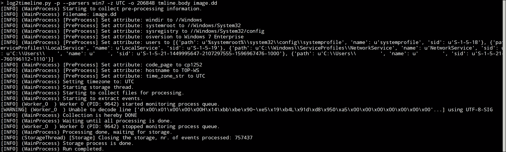

# 附录 appB. 案例研究

# 介绍

在本附录中，我们将使用一台感染的机器来演示如何对不同类型的证据进行初步分析，并且我们将同时进行实时分析和事后分析。

# 场景

为了进行这次分析，我们创建了一个小型虚拟网络，结构如下：


所有场景部分均使用虚拟化技术创建，包括需要的互联网主机来下载恶意软件。该机器感染了 ZeusVM 恶意软件。恶意软件可从 Zoo 下载，仅供教育用途，下载地址：[`github.com/ytisf/theZoo/blob/master/malwares/Binaries/ZeusVM/ZeusVM.zip`](https://github.com/ytisf/theZoo/blob/master/malwares/Binaries/ZeusVM/ZeusVM.zip)。解压后的恶意软件样本 SHA256 如下：

`b04637c11c63dd5a4a599d7104f0c5880717b5d5b32e0104de5a416963f06118`

`theZoo` 是一个旨在让恶意软件分析的可能性对公众开放的项目。`theZoo` 由 Yuval tisf Nativ 创建，现在由 Shahak Shalev 维护。

你可以下载恶意软件样本，重新创建或感染一台虚拟机，并按照本附录中的分析步骤进行操作。

本场景中使用的机器是 Windows 7 企业版 64 位。

# 采集

正如我们之前讨论的，最佳实践是在对待分析的机器做任何修改之前，首先进行证据采集。采集到的证据必须保存在 USB 存储设备或网络共享中。在我们的案例中，USB 存储设备可以在感染机器和分析机器之间使用，但分析后必须彻底擦除。通过虚拟网络使用另一台分析 Linux 虚拟机进行网络采集在我们的情况下也很有效。网络采集将按照我们之前在第四章中讨论的内容进行，*非易失性数据采集*。我们需要采集感染机器的内存和硬盘。

练习：你需要执行这个步骤，正如我们之前在第三章，*易失性数据采集*，和第四章，*非易失性数据采集*中讨论的那样。

# 实时分析

接下来，让我们对手头的感染机器进行一些实时分析。这次实时分析将为我们提供快速的结果。它可能会覆盖系统中的一些痕迹，但在我们的情况下，我们已经采集了证据。

## 正在运行的进程

列出正在运行的进程将帮助我们发现任何恶意命名的进程，这些进程可能与恶意软件行为有关。我们可以使用 `native tasklist` 命令列出正在运行的进程：


我们还可以使用 Sysinternals 的`processexplorer`。我们将注意到没有恶意的名称，但我们可以看到系统中有两个名为`explorer.exe`的进程。其中一个的 ID 是`2256`，它是为了兼容 32 位映像而运行，但它的当前目录是`C:\Users\<<UserName>>\AppData\Roaming\`，如下面的进程资源管理器截图所示。此外，请注意，如果你在自己的机器上运行恶意软件，这个进程很可能会持有另一个 ID：


为了更深入地调查这个过程，我们可以使用 DART 工具中的`ProcessActivityView`来查看该进程实时访问了哪些文件。我们会发现这个进程访问了一个位于并命名为`C:\Users\<<UserName>>\AppData\Roaming\Tyull\yquna.tmp`的文件。

文件夹名称和文件名似乎是随机创建的，这是一种典型的恶意软件行为。

然后，如果我们尝试使用 GMER 工具扫描正在运行的系统，它将检测到在运行的进程`2256 explorer.exe`中注入了一些代码，如下所示：


## 网络活动

大多数恶意软件样本需要网络连接来完成其目标并与攻击者连接。通过检查可疑连接上的网络活动，我们会注意到它正在监听连接和端口`37337`。在这里，我们必须注意，我们已经将机器从互联网和内部网络隔离，这样的连接无法完成：


端口`37337`因其在恶意软件相关活动中的广泛使用而闻名。

## 自动启动键

我们还可以检查系统中的自动启动键，这些键被恶意软件用来保持它们在系统中的存在，即使在系统重启后。我们可以使用 Sysinternals 工具`autorunsc.exe`或其 GUI 版本`autoruns.exe`来执行此操作。我们可以使用带有以下选项的命令行版本：

+   `-l`：这些是登录时自动启动的元素（默认选项）

+   `-t`：这些是已分配的任务

+   `-m`：这些不会显示由微软数字签名的元素

+   `-v`：这些验证数字签名


在`HKCU\Software\Microsoft\Windows\CurrentVersion\Run`注册表键下，这个未知可执行文件的位置是`C:\users\<<UserName>>\appdata\roaming\imyrug\epqe.exe`。请注意该键的最后访问日期，它已经很旧了。

我们可以提取这个可执行文件进行进一步分析，例如逆向工程和恶意软件分析，以确认它是否具有恶意，并理解其功能。使用该工具的 GUI 版本也可以获得相同的结果：


所以，现在的问题是是什么将这个可执行文件添加到注册表键中？

# 预取文件

为了尝试回答前面的问题，我们可以开始分析预取文件。从 DART 中打开 WinPrefetchView 工具。该工具会自动解析实时系统的预取文件，并以人类可读的格式查看其结果。

在花了一些时间查看文件并搜索名为`epqe`的可执行文件后，我们发现`eqpe.exe`在名为`latest_report.pdf.exe`的文件运行后两秒钟启动，并且在同一秒钟`Explorer.exe`也启动了：


如我们所见，第一个文件名非常可疑。它位于`C:\Users\<<UserName>>\Downloads\latest_report.pdf.exe`下。如果我们尝试在这个位置查找该文件，我们是找不到的。在`WinPrefetchView`提供的`latest_report.pdf.exe`文件所使用的文件列表中，我们会发现由此文件使用或创建的`epqe.exe`文件：


然而，是什么促使受害者下载这个恶意可执行文件呢？

# 浏览器分析

`last_report.pdf.exe`文件可能是从其他存储设备或网络复制到机器上的，但由于它位于`Downloads`文件夹中，因此开始调查浏览器历史记录可能更为合理。

系统中安装的浏览器是 Internet Explorer 和 Mozilla Firefox。通过使用 DART 工具分析这两者，我们可以从`MozillaHistoryView`中找到一些有趣的结果：


我们可以看到该文件是从`http://www.maldomain.com/public/latest_report.pdf.exe`下载的。然而，我们注意到下载时间恰好是在用户访问`mail.yahoo.com`之后，这增加了恶意链接通过电子邮件发送给受害者的可能性。

如果我们有能力打开受害者的邮箱以证明或反驳这一假设，那么在我们的案例中，我们将会找到以下信息：


我们可以在这封电子邮件中找到语言不准确的地方，并且为了显示其他文本而添加了链接`this link`，而不是实际的链接：


### 注意

注意：如果在自己的机器上运行恶意软件，电子邮件和浏览器历史分析结果将不会出现在您的分析中。

# 事后分析

在进行实时分析之前，我们已经获得了证据。这些证据是内存和硬盘。让我们看看我们能从这些证据中获取什么。

## 内存分析

内存是操作系统的工作空间，通过内存分析，我们可以获得系统中运行的任何恶意软件的痕迹。在本节中，我们将使用 Volatility 框架分析转储的内存文件，并尝试获取与实时分析中相同的信息。

为了获取内存文件的配置信息，我们可以使用 imageinfo 插件：

从输出中，我们将使用的镜像配置文件是`Win7SP0x64`。接着，让我们列出正在运行的进程和网络连接，就像我们在内存分析章节中讨论的那样：


我们会注意到两个`explorer.exe`进程，但我们看不到任何隐藏的进程。只有两个名为`dllhost.exe`的进程，它们只能在 psscan 插件的输出中找到。然而，这两个进程已经退出，它们的结构仍然保存在内存中，psscan 插件能够找到它们，正如我们从 psscan 插件的输出中看到的：


然后，我们可以使用 netscan 插件，根据系统中发现的恶意连接进行筛选：


我们会发现`explorer.exe`进程在端口`37337`上有监听连接。所以，让我们重点关注这个进程。

让我们转储这个进程，并搜索任何可能标识其功能的有趣字符串：


如果我们运行`strings 2256.dmp | more`命令，它将显示进程转储文件中的许多字符串。其中一些字符串，如`Run and Runonce`，应该让我们联想到注册表键。要列出内存中的注册表键，我们可以使用 hivelist 插件：


现在，我们已经得到了内存中已打开注册表项的位置。我们可以通过使用 printkey 插件，并结合注册表项的虚拟偏移量，浏览这些内存中的注册表项。

我们可以尝试不同的注册表项，但我们先试试系统用户的`ntuser.dat`注册表项。检查`Software\Microsoft\Windows\CurrentVersion\Run`：


我们还可以在内存中找到未知的可执行文件。现在，让我们尝试扫描内存中所有已打开的文件，并筛选出这个文件名：


然后，使用以下命令将主体文件转换为时间线文件：

```
mactime -b mft.body > mft.tmline

```

输出将是系统中所有活动的时间线。如果我们尝试基于可疑的可执行文件名进行筛选，我们可以得到与我们在实时分析过程中检查预取文件时获得的相同顺序：


接下来，我们可以尝试从硬盘镜像中恢复`latest_report.pdf.exe`。事实上，恶意软件删除了该文件，并创建了`epqe.exe`。但是，如果我们想要获取该文件并且无法从硬盘中恢复该文件怎么办？

## 网络分析

网络流量是最不稳定的证据。在我们这里的场景中，我们在攻击模拟过程中将网络流量转储到了一个`pcap`文件中。

为了分析网络流量，我们将使用安装在 Linux 分析虚拟机的 Wine 环境中的 Networkminer 工具。

Networkminer 将解析`pcap`文件，并查看有关`maldomain.com`域的详细信息：


它还将导出下载的文件，包含详细信息：


从网络流量中，我们可以导出并分析第一个 `latest_report.pdf.exe` 可执行文件。

## 时间轴分析

在本节中，我们将使用 log2timeline 和 Plaso 框架，通过获取的磁盘镜像创建硬盘中所有活动的完整时间轴。

我们将运行所有 Windows 7 解析器来分析获取的镜像。但是首先，我们需要使用 TSK 中的 `mmls` 工具获取 `C:` 分区的偏移量：


然后，我们将使用这个偏移量与 log2timeline。生成主体文件的过程将需要很长时间，因为它会解析整个卷，以查找 Win7 解析器中提到的任何事件：



一旦完成，我们可以使用 `psort.py` 工具通过命令行查看我们选择的主体文件的部分内容，就像在第五章 *时间轴* 分析中做的一样。

或者，我们可以将时间轴主体文件转换为 CSV 格式的文件，以便通过任何电子表格程序查看。转换过程需要一些时间才能完成：


转换完成后，您可以在例如 Excel 中打开新文件：


然后，我们可以使用 Excel 过滤工具根据我们的需求过滤输出结果，例如显示恶意文件的预取分析：


# 摘要

在完成了主要章节后，在本附录中，我们进行了初步分析并发现了感染机器中的恶意软件。我们使用了不同的分析技术，包括实时分析和事后分析，并解释了如何通过这两种方式获得相同的结果。尽管实时分析更容易，但并非每次都适用。因此，我们必须了解这两种技术，以应对现实生活中的调查。
