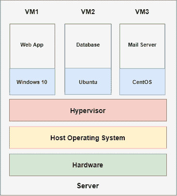
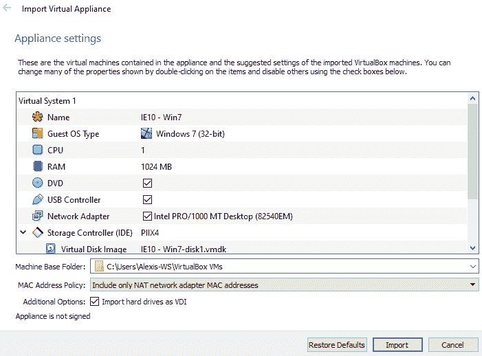

# 第二章：设置我们的实验室

由于安全研究员或渗透测试人员从事的工作本质上是复杂且技术性的，因此，练习和测试你的黑客技能时，必须在安全的隔离虚拟环境中进行，以避免对公共系统、计算机或网络造成损害。搭建**虚拟黑客实验室**的艺术是*渗透测试人员*的一项重要技能，它允许快速部署、测试和利用系统，而无需攻击公共系统或网络基础设施。

因此，了解如何设置一个可以合法进行渗透测试的**虚拟化环境**至关重要。拥有一个个人虚拟黑客实验室可以让你测试新的攻击、漏洞利用和工具，进而提升学习效果，并不断增强你的技能，使你成为一个更有能力的黑客。类似地，在本章中，你将学习如何设计和配置你自己的强大、隔离的虚拟黑客实验室，用于学习和实践本书中展示的各种*漏洞利用*和*权限提升*技术，这些技术涉及 Windows 和 Linux 操作系统。

本章将提供设计、部署、配置和故障排除自己隔离的虚拟黑客实验室所需的知识和技能。

在本章中，我们将涵盖以下主题：

+   设计我们的实验室

+   构建我们的实验室

+   设置 Kali Linux

# 技术要求

要跟随本章的演示，你需要确保满足以下硬件和软件要求：

+   需要一个运行 Windows、Linux 或 macOS 的操作系统。

+   至少需要 4 GB 的 RAM，推荐规格为 8 GB。

+   至少 500 GB 的空闲存储空间。

+   支持虚拟化技术的处理器（例如，Intel VT-x 或 AMD VT）。

+   一般了解`VirtualBox`的工作原理。

现在我们已经了解了将要覆盖的内容，接下来让我们深入探讨第一个话题。

你可以在这里查看本章的代码示例：[`bit.ly/3ukgh6C`](https://bit.ly/3ukgh6C)

# 设计我们的实验室

在本节中，我们将开始构建我们的虚拟黑客实验室。我们将根据本书中练习和演示的需求，设计并构建我们的实验室。

为了搭建我们的实验室基础设施，我们需要利用**虚拟化**技术。这将使我们避免因硬件和网络配置产生额外费用，因为我们将在一个主机上运行所有的*客操作系统*并配置我们的*虚拟网络*。

在开始设计和构建我们的实验室之前，我们需要探索虚拟化作为一个概念和实践。首先，我们将了解虚拟化在构建和配置虚拟黑客实验室中的重要性和作用。

## 虚拟化

虚拟化是指在具有抽象硬件层的操作系统虚拟实例上运行的过程。虚拟化使得多操作系统能够在单一计算机或主机上同时运行。它被发明出来的目的是帮助大型组织和公司减少对硬件设备的需求以及在托管和网络设备上的开支。

最初，大型公司和组织需要购买整台服务器来托管如电子邮件和 Web 应用程序等服务。每项服务都托管在独立的专用服务器上。这导致了企业支出增加，但对于性能和资源效率等因素并没有带来额外的好处，因为大多数服务器配置为高性能、具有大量系统资源如*RAM*，并且配置了强大的 CPU。然而，考虑到公司通常只能在一台服务器上托管一项服务，大多数时候，像处理能力和 RAM 这样的系统资源会被低效利用，这使得托管变得低效。这种传统托管基础设施的类型如*图 2.1*所示：

图 2.1 – 传统托管基础设施

资源效率低下的问题正是虚拟化技术所要解决的。通过虚拟化，企业现在能够在一台专用服务器上运行多个操作系统并托管多个服务。虚拟化确保了系统资源得到适当和高效的利用，因为服务器可以配置为在物理资源和服务器容量的限制下尽可能多地运行服务。

*图 2.2*展示了如何使用像 VirtualBox 这样的*虚拟机监控器*，通过虚拟化将多个操作系统和服务配置在一台服务器上运行：

图 2.2 – 现代托管基础设施

在*图 2.2*中，一台服务器已被配置为**虚拟化三个**操作系统，每个操作系统都托管自己的服务。这清晰地展示了虚拟化不仅对企业有益，也对个人和专业人士有益。同样，我们将使用虚拟化技术在一台主机系统上托管我们的目标操作系统和攻击者操作系统。为了利用虚拟化技术，我们需要了解虚拟机监控器。

重要提示

虚拟化提供的一个关键特性是对来宾操作系统的隔离，这为基础设施提供了安全性和稳定性。*虚拟机隔离*可以根据需要进行配置；我们将在设置虚拟机时更深入地了解来宾隔离和虚拟网络。

## 虚拟机监控器

**虚拟化管理程序**是负责创建、运行和管理虚拟机的计算机程序。它负责促进虚拟化过程并设置运行操作系统所需的模拟环境。

虚拟化管理程序根据其部署和使用案例分为两大类：

+   **Type 1 虚拟化管理程序**：这些虚拟化管理程序直接安装在硬件上，并通常作为操作系统运行。这些类型的虚拟化管理程序也被称为**裸金属虚拟化管理程序**。以下是一些 Type 1 虚拟化管理程序的例子：

    a) VMware ESX

    b) Microsoft Hyper-V Server

    c) Proxmox-VE

    *图 2.3*展示了 Type 1 虚拟化管理程序的部署结构，其中虚拟化管理程序管理系统直接安装到硬件上，并作为主操作系统，创建并管理虚拟机：

图 2.3 – Type 1 虚拟化管理程序结构

+   **Type 2 虚拟化管理程序**：这些虚拟化管理程序直接安装在主操作系统上，如 Windows、Linux 或 macOS。它们像传统程序一样运行，而不是直接在硬件上运行。

    Type 2 虚拟化管理程序无法直接访问系统硬件；相反，Type 2 虚拟化管理程序使用主操作系统可用的系统资源。*图 2.2*展示了典型的 Type 2 虚拟化管理程序设置，其中虚拟化管理程序直接安装在主操作系统之上。以下列出了部分免费的和商业的 Type 2 虚拟化管理程序：

    a) Oracle VirtualBox（免费）

    b) VMware Player（免费）

    c) VMware Workstation Pro（商业）

    d) Parallels Desktop for macOS（商业）

### 什么是虚拟机？

虚拟机是一个模拟操作系统，它直接运行在另一个操作系统之上。虚拟机可以访问并根据用户需求分配资源。例如，我们可以指定虚拟机的内存大小、核心数量、逻辑处理器数量以及虚拟机可访问的网络接口和 USB 设备。默认情况下，虚拟机使用*虚拟磁盘镜像*进行存储，并且可以根据需要进行扩展。像 VirtualBox 这样的虚拟化管理程序还允许我们为虚拟机拍摄快照，以作为冗余的一种形式。这在虚拟机因配置错误或系统故障而失败时非常有用；你可以轻松地将虚拟机恢复到之前的快照。

### 你应该使用哪种类型的虚拟化管理程序？

如前所述，您选择的虚拟化程序类型将取决于您的部署性质和个人使用案例。如果您有多台计算机或笔记本电脑，可以尝试使用像 Proxmox-VE 这样的类型 1 虚拟化程序，我个人使用它是因为它提供了更强大的功能。如果您打算在一台计算机或笔记本上运行虚拟黑客实验室，那么显而易见的选择是类型 2 虚拟化程序，因为它可以直接安装在主机操作系统上。

现在我们对虚拟化技术有了更好的理解，并且了解如何利用该技术设置虚拟黑客实验室，我们可以看看如何结构化我们的实验室。

## 实验室结构

在开始构建我们的虚拟实验室之前，我们需要了解实验室的结构、将使用的软件和操作系统，以及我们将实施的网络配置。这将使部署过程更加简单和直接。

第一步是选择我们偏好的虚拟化程序。本书中，我们将使用`Oracle VirtualBox`，它是一个类型 2 虚拟化程序，免费且开源，开箱即用就具备了很好的功能。我们将在下一节中讨论如何安装和配置 VirtualBox。

### 操作系统

我们将部署多种强大的 Windows 和 Linux 操作系统。这将使您能够模拟*真实世界的攻击*，不仅仅针对单一目标。您在典型的渗透测试中也可能会遇到不同的操作系统。我们将在虚拟黑客实验室中使用以下操作系统：

+   `Windows 7`

+   `Windows Server 2008`

+   `Windows Server 2012`

+   `Windows 10`

+   `Metasploitable2`

+   `Kali Linux`

我们将使用 Kali Linux 作为我们的进攻操作系统，其他操作系统将作为目标操作系统使用。

重要提示

Windows Server 2012 目标虚拟机是可选的。本书中展示的大多数技巧和攻击可以在 Windows Server 2008 上复制。

现在我们已经对将要使用的虚拟化程序和操作系统有了了解，接下来可以设置我们想要的虚拟网络结构。

### 虚拟网络拓扑

*图 2.4* 描述了我们将在 VirtualBox 中设置虚拟网络时所使用的期望网络**拓扑**。所有虚拟机将互联并与任何外部网络隔离：

图 2.4 – 虚拟网络拓扑

VirtualBox 允许我们创建一个完全隔离的虚拟网络，无需路由器或交换机。每台虚拟机都需要分配一个 IP 地址。我们将使用 VirtualBox 内置的虚拟交换机来设置一个基于**动态主机配置协议**（**DHCP**）的网络，其中 IP 地址将自动分配给虚拟机。这将模拟一个真实的网络环境；然后我们将不得不执行一些基本的主机发现来手动映射网络和主机。

现在我们对将要使用的软件以及我们实验室所需的结构和网络拓扑有了很好的了解。下一步是将所有这些部分组合在一起。

# 建立我们的实验室

现在我们已经准备好开始将各种部分组合在一起构建我们的虚拟黑客实验室。我们将从设置我们选择的虚拟化程序 VirtualBox 开始。如果您已经熟悉其他首选的虚拟化程序，也可以随意使用。这些步骤大部分也可以在*VMware Workstation*和*VMware Player*上重新创建。

## 安装和配置 VirtualBox

VirtualBox 是一个跨平台的开源第 2 型虚拟化程序，提供出色的功能和性能。第一步是根据您正在运行的主机操作系统下载正确的安装*二进制*：

1.  在浏览器中打开[`www.virtualbox.org/wiki/Downloads`](https://www.virtualbox.org/wiki/Downloads)。您将看到支持操作系统的下载链接，如*图 2.5*所示。选择您的主机操作系统开始下载：

    图 2.5 – 下载 VirtualBox

1.  下载安装二进制文件后，您需要安装它。该二进制文件或可执行文件将向您展示标准安装向导。在保持所有设置和配置为默认设置的情况下，按照安装步骤进行操作。完成后，您现在可以打开 VirtualBox，您将看到类似于*图 2.6*所示的窗口：

图 2.6 – VirtualBox 欢迎屏幕

现在我们已经安装了 VirtualBox，我们可以开始设置和配置虚拟网络。

## 配置虚拟网络

我们将使用*图 2.4*中概述的网络拓扑作为我们设置和配置 VirtualBox 内的虚拟网络适配器的指南。

VirtualBox 提供了一个简单但功能强大的虚拟网络管理器，可以帮助创建具有可定制参数和功能的适配器和网络配置。

我们的虚拟网络将需要以下选项和参数：

+   IPv4 地址掩码：`10.10.10.1/24`

+   启用了 DHCP 服务器

现在我们了解了 IP 地址掩码，我们可以配置我们的虚拟网络：

1.  要打开**网络**管理器，点击**工具**功能区右上角的菜单：

    图 2.7 – VirtualBox 网络工具

    你将看到一个类似*图 2.8*的新窗口，提示你要么**创建**要么**移除**虚拟网络适配器。

1.  在我们的情况下，我们将创建自己的虚拟网络适配器，用于在相同的 IP 地址掩码下互联所有虚拟机。点击**创建**按钮开始配置过程：

    图 2.8 – 创建一个 VirtualBox 适配器

1.  现在你应该看到虚拟网络管理器屏幕。根据我们之前描述的网络要求，我们需要设置一个特定的 IP 地址掩码，并启用 DHCP 以进行自动 IP 分配。要配置我们的 IP 地址掩码，选择我们创建的虚拟网络适配器，然后点击**属性**按钮开始定制过程：

    图 2.9 – 配置虚拟网络适配器

1.  在适配器的配置选项中，确保勾选**手动配置适配器**选项，就像*图 2.9*中演示的那样。添加我们之前指定的 IP 地址掩码。完成后，点击**应用**按钮保存配置。

    现在我们需要启用 DHCP 服务器。这可以在**适配器配置**菜单中的**DHCP 服务器**选项卡下启用和配置。启用 DHCP 后，您需要提供寻址模式和默认网关地址。您可以使用*图 2.10*中概述的配置：

    

    图 2.10 – VirtualBox DHCP 配置

1.  修改 DHCP 服务器的 IP 寻址模式后，点击**应用**保存配置。

现在我们已经在 VirtualBox 中创建和配置了虚拟网络，我们可以开始在 VirtualBox 中设置我们的虚拟机，并将它们添加到我们创建的虚拟网络中。

## 设置我们的目标虚拟机

现在我们已经有了一个完全配置好的 hypervisor 和虚拟网络，我们可以在其中操作；然而，我们还需要设置我们的**目标虚拟机**，这将包括全球使用和采用最广泛的两种操作系统：Windows 和 Linux。对于渗透测试人员来说，具有利用这两种操作系统的实际经验至关重要，因为在现实场景中，你可能会遇到这两种操作系统，尽管在不同的部署和使用情况下。

正如前面所述，我们的目标虚拟机将包括不同版本的 Windows 和 Linux，并且其中一些将预先配置有漏洞，以帮助和增强学习过程。

### 设置 Windows 虚拟机

鉴于 Windows 操作系统的普及和采用，了解如何在*桌面*版本的 Windows 和*Windows Server 部署*上执行特权升级攻击是至关重要的。因此，我们的实验室将包括以下 Windows 版本：

+   Windows 10

+   Windows 7

+   Windows Server 2008

Windows 操作系统需要许可证并需要激活才能正常运行。但是，我们可以利用*Microsoft TechNet Evaluation Center*提供的优势。这为桌面和服务器操作系统提供了 90 天到 180 天的试用期。

然而，该服务仅提供 Windows 的最新版本，从 Windows 10 和 Windows Server 2016 到 Windows Server 2012 和 Windows 8.1。对于我们的 Windows 7 虚拟机，我们可以利用使用旧版 Windows 的`Microsoft Edge Legacy`虚拟机。

我将不会涵盖 Windows 安装过程。在本书中，我将演示配置并将我们的虚拟机添加到我们创建的虚拟网络的过程。

我们将从下载和配置我们所需的 Windows 虚拟机开始。

#### 设置 Windows 7 虚拟机

现在我们来看看如何在 VirtualBox 上设置我们的 Windows 7 虚拟机。

要设置 Windows 7 虚拟机，请按照以下步骤进行：

1.  首先，您需要下载 Windows 7 虚拟机的`OVA`文件，可以在[`developer.microsoft.com/en-us/microsoft-edge/tools/vms/`](https://developer.microsoft.com/en-us/microsoft-edge/tools/vms/)下载。

1.  在网站上，您将被提示选择您的虚拟机版本和虚拟机平台，如*图 2.11*所示。确保您指定`Win7`作为版本和`VirtualBox`作为平台：

    图 2.11 – 下载 Windows 7 虚拟机镜像

1.  您现在可以点击**下载**按钮下载压缩的 VirtualBox OVA 文件。

1.  下载并解压存档后，您将看到一个 OVA 文件。OVA 文件是一个预配置和预安装的虚拟机，无需安装或配置；因此，这将节省时间。双击 OVA 文件即可导入。这将打开一个**导入虚拟设备**屏幕，如图所示：

    图 2.12 – VirtualBox OVA 导入

1.  确保您将**机器基础文件夹**指定为您已设置和配置用于虚拟机的目录或位置；这是虚拟机将被导入的目录。指定基础文件夹后，您可以点击**导入**开始导入过程，如*图 2.13*所示：

    图 2.13 – VirtualBox OVA 导入过程

1.  导入过程完成后，我们现在可以将虚拟机添加到我们设置的虚拟网络中。要做到这一点，选择虚拟机，如*图 2.14*中左侧栏所示，并单击**设置**按钮以修改虚拟机设置：

    图 2.14 – 虚拟机设置

1.  这将弹出**选项**菜单，在这里您可以更改虚拟机名称和资源分配；但是，我们还希望将虚拟机添加到虚拟网络中。这可以通过点击**网络**选项来实现，如*图 2.15*所示，并指定适配器（在本例中，屏幕上的**适配器 1**）为**仅主机适配器**：

图 2.15 – 虚拟机网络配置

虚拟机现在应该配置为在我们创建的虚拟网络中运行和操作。我们现在可以继续设置我们的 Windows Server 2008 虚拟机，也称为`Metasploitable3`。

#### 设置 Metasploitable3 虚拟机

对于我们的 Windows Server 2008 虚拟机，我们将使用一个基于 Windows Server 2008 的有意漏洞的虚拟机，名为 Metasploitable3。它由*Rapid7*设计和创建，用于教授和演示各种渗透测试和权限提升技术。

要了解更多关于 Metasploitable3 的信息，您可以阅读发布说明，网址为[`blog.rapid7.com/2016/11/15/test-your-might-with-the-shiny-new-metasploitable3/`](https://blog.rapid7.com/2016/11/15/test-your-might-with-the-shiny-new-metasploitable3/)。

设置 Metasploitable3 需要一个手动构建过程；但是，也存在预构建的虚拟机文件，我们可以使用这些文件来设置我们的虚拟机，而无需任何麻烦或安装：

1.  要开始设置过程，我们首先需要下载 OVA 文件。

    预构建的`Metasploitable3 Box`文件可以在[`app.vagrantup.com/rapid7/boxes/metasploitable3-win2k8`](https://app.vagrantup.com/rapid7/boxes/metasploitable3-win2k8)下载。

1.  下载虚拟机文件后，导入过程类似于 Windows 7。只需双击`OVA`文件，将会弹出虚拟机导入屏幕，如下所示：

    图 2.16 – 导入 Metasploitable3

1.  指定您的**基本目录**虚拟机并开始导入过程，如下所示：

    图 2.17 – 导入 Metasploitable3

1.  导入虚拟机后，我们可以修改虚拟机设置，配置 Metasploitable3 使用虚拟网络，具体如下：

图 2.18 – Metasploitable3 网络设置

#### 设置 Windows 10 虚拟机

您需要手动安装 Windows 10 虚拟机，因为微软没有提供预构建的虚拟机文件。如果您没有从*ISO*文件或*光盘镜像*手动安装 Windows 的经验，可以参考以下安装指南：[`www.extremetech.com/computing/198427-how-to-install-windows-10-in-a-virtual-machine`](https://www.extremetech.com/computing/198427-how-to-install-windows-10-in-a-virtual-machine)：

1.  要下载 Windows 10 ISO，您需要导航到以下网址：[`www.microsoft.com/en-us/evalcenter/evaluate-windows-10-enterprise`](https://www.microsoft.com/en-us/evalcenter/evaluate-windows-10-enterprise)。此页面将提示您选择要下载的 Windows 10 版本。请选择`Windows 10 Enterprise`并点击**继续**。之后，您需要提供个人信息以访问下载：

    图 2.19 – 下载 Windows 10 ISO

1.  下载 ISO 文件后，您可以在 VirtualBox 中创建虚拟机并手动安装 Windows。

1.  成功安装 Windows 10 后，您现在可以修改**网络**设置，将虚拟机配置为使用我们创建的虚拟网络，如下图所示：

图 2.20 – Windows 网络设置

我们现在已经成功地设置好了我们的 Windows 虚拟机，并将其配置为使用我们定制的虚拟网络。接下来，让我们看看如何设置 Linux 虚拟机。

### 设置 Linux 虚拟机

通常，Linux 被设置并配置为作为服务器运行，主要用于托管像 Web 应用程序、邮件网关和数据库服务器等服务。这大大增加了攻击面和攻击向量，攻击者可以利用这些漏洞来获取初始的 Linux 系统访问权限；例如，Web 服务器的漏洞可能导致整个系统的完全入侵。

因此，我们将使用一个故意有漏洞的 Linux 虚拟机——`Metasploitable2`，它也是由*Rapid7*创建，旨在教授和演示 Linux 的利用与权限提升技术。

#### 设置 Metasploitable2

Metasploitable2 是一个免费的故意有漏洞的 Ubuntu 虚拟机，可以在任何类型 2 虚拟机管理程序上设置和部署。让我们看看如何设置它：

1.  Metasploitable2 可以从 [`sourceforge.net/projects/metasploitable/files/Metasploitable2/`](https://sourceforge.net/projects/metasploitable/files/Metasploitable2/) 下载。

1.  该网址将引导您到`SourceForge`，在这里您将被提示下载 Metasploitable2 压缩档案，如下所示：

    图 2.21 – Metasploitable2 压缩档案

1.  下载并解压存档后，我们将看到一个`VMDK`（**虚拟机磁盘**）文件，我们将使用该文件来设置虚拟机，您可以在这里的列表中看到它：

    ](Images/B17389_02_022.jpg)

    图 2.22 – Metasploitable2 存档

1.  要设置 Metasploitable2，我们需要创建一个新的虚拟机。点击 VirtualBox 中的**新建**按钮，如下图所示：

    图 2.23 – 新建 VirtualBox 虚拟机

1.  现在，我们需要指定虚拟机的**名称**和虚拟机将要安装的基础目录。如*图 2.24*所示：

    图 2.24 – Metasploitable2 配置

1.  现在，我们将被提示在**内存大小**选项下指定希望分配给虚拟机的 RAM 大小，如*图 2.25*所示。保持默认配置的值，应该是`512 MB`：

    图 2.25 – Metasploitable2 内存大小设置

1.  在指定所需的内存后，系统会提示您选择是创建一个**虚拟硬盘**还是使用现有的硬盘。选择使用您自己的虚拟硬盘，并指定您已下载的`Metasploitable2.vmdk`文件所在的目录，如下所示：

    图 2.26 – Metasploitable2 VMDK 文件指定

1.  创建 Metasploitable2 虚拟机后，您需要配置虚拟机以使用自定义虚拟网络。这可以通过修改虚拟机的**设置**，并修改**网络适配器**来完成，如下所示：

图 2.27 – Metasploitable2 网络配置

在本节中，我们已经学习了如何设置 Windows 和 Linux 虚拟机，以及如何为我们的虚拟黑客实验室配置一个自定义的隔离虚拟网络。

我们已经设置好了所有的目标虚拟机，并将它们配置为运行在同一个虚拟网络中。我们要设置的最后一台虚拟机是我们的*主要攻击者*虚拟机。

# 设置 Kali Linux

`Kali Linux`是一个基于*Debian*的 Linux 发行版，专为渗透测试人员和安全研究人员量身定制。它预配置并预打包了超过 300 个可用于渗透测试、安全审计和取证的工具。它无疑是所有行业专业人士的事实标准，因为它提供了一个坚实的基础，具有多种部署和安装选项，并且拥有一个优秀的软件仓库。

Kali Linux 可以从官方 Kali 网站（[`kali.org`](https://kali.org)）下载，并可以通过多种方式安装和配置。你可以直接从 ISO 安装，或者使用预配置的 OVA 文件来获得预装的解决方案。在我们的案例中，和 Windows 7 虚拟机一样，我们将使用 OVA 文件，因为它节省时间且更为方便。

首先，按照以下步骤操作：

1.  要下载 Kali Linux 虚拟设备，请访问以下链接并根据你偏好的系统架构下载 **32 位** 或 **64 位** 的 `Kali Linux VirtualBox` 镜像（https://www.offensive-security.com/kali-linux-vm-vmware-virtualbox-image-download/#1572305786534-030ce714-cc3b）：

    图 2.28 – Kali Linux VirtualBox 镜像

1.  下载并解压 Kali Linux 压缩包后，解压目录中的内容将包含一个可以直接导入到 VirtualBox 中的 Kali Linux OVA 文件。我们可以通过双击 **OVA 镜像**来完成这一操作。

1.  这将启动 VirtualBox **导入虚拟设备向导**，我们需要指定存储虚拟机的基础目录。

1.  导入过程将开始，并需要几分钟时间才能完成：

    图 2.29 – 导入 Kali Linux OVA

1.  导入完成后，我们需要配置 Kali 虚拟机，以使用我们创建的自定义网络。这可以通过修改虚拟机的设置来完成，如下所示：

图 2.30 – Kali Linux 网络设置

我们现在已经能够全面设置我们的虚拟黑客实验室，接下来可以进入测试阶段。它涉及启动所有虚拟机并从 Kali Linux 执行主机发现扫描，以测试我们的虚拟网络配置的有效性和功能。

## 将所有内容整合在一起

我们可以通过单独启动我们的虚拟机并运行以下测试来开始测试：

1.  要登录 Kali Linux 虚拟机，请使用 `root` 用户的凭据。用户名为 root，密码为 `toor`。可以通过在终端中运行 `passwd` 工具来更改密码，如下所示：

    图 2.31 – Kali Linux 密码更改功能

1.  启动虚拟机后，可以使用名为 `netdiscover` 的工具执行网络发现扫描，该工具利用 **地址解析协议**（**ARP**）ping 来检测网络上的主机。要运行网络发现扫描，请在 Kali Linux 终端中运行以下命令：

    `$ netdiscover -i <interface> -r 10.10.10.1/24`

1.  运行`netdiscover`命令后，我们会发现两个在线且活跃的主机，如*图 2.32*所示。这表明我们的网络配置是正常的，且我们可以与网络上的其他主机进行通信：

图 2.32 – netdiscover 的结果

我们已经设置了 Kali Linux 虚拟机，并配置它在相同的虚拟网络中运行，同时通过执行主机发现扫描测试了我们的虚拟网络。

# 总结

在本章中，我们首先了解了如何构建一个虚拟黑客实验室以及虚拟化的作用。接着，我们学习了如何设置和配置我们的虚拟机监控器（hypervisor）以及一个定制的隔离网络，用来互联我们的虚拟机。然后，我们在本章后半部分设置了在 VirtualBox 上的目标虚拟机，并配置它们使用我们定制的虚拟网络。最后，我们通过在虚拟黑客实验室中部署 Kali Linux 来结束本章内容。

现在我们已经建立了一个功能正常的虚拟黑客实验室，可以开始初步的漏洞利用过程。

在下一章中，我们将通过在目标虚拟机上获得初步的立足点，开始特权提升过程。我们将查看可以用来访问系统的各种攻击路径。
