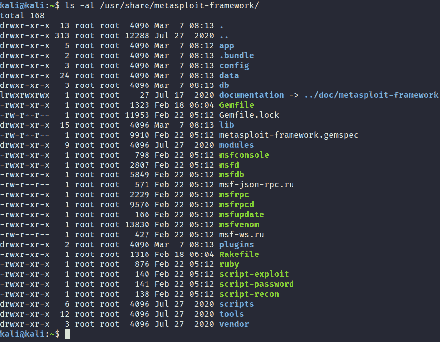
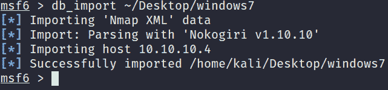
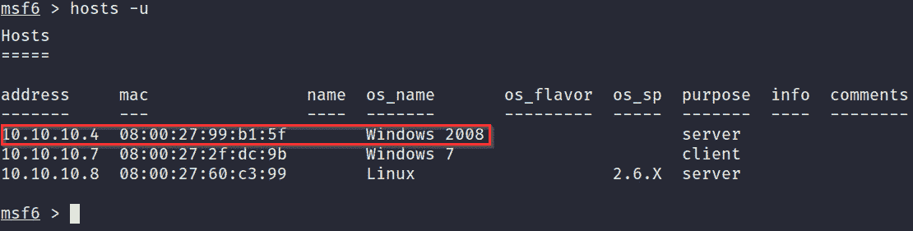
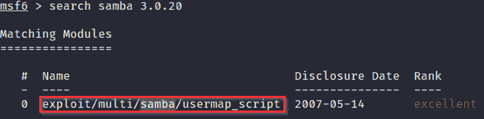

# 第三章：获取访问权限（利用）

在我们深入了解 Windows 和 Linux 的权限提升之前，我们需要探索**利用**过程以及可以利用的各种*利用技术*，包括这些技术如何影响权限提升过程。

利用是**渗透测试生命周期**中的一个独特阶段。因为它涉及主动与目标进行交互，以确定或发现可以被利用的缺陷或漏洞，从而获取访问权限。

利用为成功的渗透测试奠定了基础，并验证你能够在目标系统或网络上进行的操作范围。选择正确的*攻击向量*和*利用框架*或利用手段对于获取和保持目标系统的访问至关重要。

在本章中，你将了解利用 Windows 和 Linux 系统的各种方法，以及如何利用像`Metasploit`这样的利用框架。

本章将涉及以下主题：

+   设置 Metasploit

+   信息收集和足迹分析

+   获取访问权限

# 技术要求

为了跟随本章中的演示，你需要确保满足以下技术要求：

+   对*Linux 终端命令*有基本的了解

+   对信息收集和*足迹*技术有一定的了解

你可以在这里查看本章代码的实际操作：[`bit.ly/3m5qIaI`](https://bit.ly/3m5qIaI)

# 设置 Metasploit

**Metasploit 框架**是由 H.D. Moore 开发的开源利用框架。最初是用 Perl 编写的，后来被用 Ruby 重写。它是全球安全专家广泛采用的事实标准利用框架。它于 2009 年被*Rapid7*收购，并且得到了持续的维护和支持。

它的设计目的是简化和增强渗透测试过程。通过提供基于渗透测试方法不同阶段的模块化功能，它达到了这一目的。

Metasploit 可以在渗透测试生命周期的几乎每个阶段使用，从信息收集到利用和权限提升。正是这种强大的功能使得 Metasploit 成为任何渗透测试者必须学习的框架。

Metasploit 有两个版本，提供不同的功能和特性：

+   **Metasploit 专业版**

+   **Metasploit 社区版**

在本书的过程中，我们将使用 Metasploit 框架版本的 Metasploit。

## Metasploit 结构

在我们开始设置和使用 Metasploit 框架之前，首先需要了解它的具体结构。*图 3.1*概述了构成 Metasploit 框架的组件，并提供了这些组件如何相互作用的高层次概述：

图 3.1 – Metasploit 架构

鉴于本书的主题，我们不会详细探讨每个组件的工作原理和目的。相反，我们将重点关注与漏洞利用相关的 Metasploit 框架中最重要的元素——即 *模块*。

重要提示

Metasploit 框架是预先打包的。它已安装在 *Kali Linux* 上，也可以在官方的 Kali 仓库中找到。因此，我们不会讨论如何手动安装 Metasploit。

理解 Metasploit 模块如何结构化的最佳方法是浏览 Kali Linux 上的目录。默认的 Metasploit 框架目录位于 `/usr/share/metasploit-framework`，你可以通过运行以下命令列出该目录的内容：

ls -al /usr/share/metasploit-framework

*图 3.2* 概述了 Kali Linux 上默认 Metasploit 框架目录的内容。如图所示，该目录包含了根据功能分类的二进制文件和目录。例如，我们可以看到 `msfdb` 二进制文件，它负责与 Metasploit 框架数据库进行交互；同时也可以看到，模块已经被整理到各自的目录中：

图 3.2 – Metasploit 目录布局

在下一节中，我们将看看如何根据模块类型进一步组织这些模块。

### Metasploit 模块

由于框架的模块化特性，Metasploit 使用模块来划分功能。它通过根据模块在渗透测试生命周期中所扮演的角色，按照特定功能对模块进行分类。你可以通过查看 `/usr/share/metasploit/framework/modules` 目录中的内容来访问这些模块，如 *图 3.3* 所示：

图 3.3 – Metasploit 模块目录

模块及其功能按以下方式分类：

+   **漏洞利用**：这些是利用/杠杆化系统或程序中特定漏洞的代码片段。Metasploit 根据目标操作系统、架构和服务版本进一步对这些漏洞利用进行分类。

+   **载荷**：这些是通常与漏洞利用捆绑在一起的代码，用于在成功利用后执行额外的命令和指令。例如，大多数远程访问漏洞利用都使用载荷来生成反向 shell，从而为攻击者提供直接访问权限。

+   **辅助模块**：这些模块用于执行特定功能，通常涉及信息收集、模糊测试和漏洞扫描。

+   **编码器**：编码器用于对载荷进行编码和混淆，以避免被防病毒软件和基于签名的检测识别。编码器还用于为特定用途生成各种类型的载荷。

+   **后渗透**：后渗透模块在成功利用目标后使用，以进一步增强对目标系统的控制。通常，它们用于执行以下任务：

    a) 提升权限

    b) 凭证收集与哈希值提取

    c) 捕获目标系统上的用户输入

    d) 执行进程和二进制文件

    e) 设置持久性

现在我们已经熟悉了 Metasploit 框架中可用的各种模块，可以开始设置和配置 Metasploit 框架以供使用。

## 设置 Metasploit 框架

要开始使用 Metasploit 框架，我们需要创建并初始化 **Metasploit 数据库**。你需要执行以下步骤：

1.  Metasploit 使用 *PostgreSQL* 数据库作为存储后端。首先，我们需要确保 PostgreSQL 服务正在运行，可以通过输入以下命令来检查：

    `sudo systemctl start postgresql`

1.  现在我们可以通过运行以下命令并使用 root 权限来初始化 Metasploit 数据库：

    `sudo msfdb init`

    初始化过程将创建 `msf` 数据库，并将 `msf_test` 角色添加到数据库配置中。

1.  我们现在可以访问 Metasploit 框架控制台，也叫做 `msfconsole`。这可以通过在终端中运行以下命令来完成：

    `msfconsole`

    如你所见，在 *图 3.4* 中，启动 `msfconsole` 需要几秒钟：

    

    ](Images/B17389_03_004.jpg)

    图 3.4 – 启动 msfconsole

1.  在 `msfconsole` 启动后，你将看到一个横幅和 `msf` 提示符，如下所示的截图所示：

    ](Images/B17389_03_005.jpg)

    图 3.5 – msfconsole 横幅

1.  在我们开始使用 `msfconsole` 之前，需要通过在 `msfconsole` 中运行以下命令来验证 Metasploit 数据库是否已连接：

    `db_status`

如你所见，在 *图 3.6* 中，输出告诉我们 `msfconsole` 已连接到数据库：

图 3.6 – Metasploit 数据库状态

现在，Metasploit 框架应该已经完全功能化并准备好使用。我们现在可以进入下一阶段，进行目标虚拟机的足迹分析和 *主动侦察*。

# 信息收集与足迹分析

在我们能够利用目标系统之前，需要准确地枚举目标，以便从中获取重要信息。渗透测试生命周期的这一阶段包括扫描和发现网络中的主机。我们扫描这些主机以找到开放的 *端口* 和 *服务*，并了解它们的版本。此外，我们还需要识别目标系统所运行的操作系统。

这是渗透测试中最重要的阶段之一，因为它将决定攻击阶段的整体成功。如果我们能从目标中收集和列举足够的信息，就可以设立有效的攻击和漏洞利用方法。然而，如果我们没有做到这一点，攻击方法将会低效，甚至可能没有任何结果。

我们将通过绘制虚拟网络图来开始**足迹分析**过程，以发现目标虚拟机及其对应的 IP 地址。

## 使用 Nmap 进行网络映射

**网络映射工具**（**Nmap**）是一个免费的开源网络映射工具，用于发现网络上的主机、执行端口扫描、服务检测和操作系统检测。它通过向目标发送特殊构造的数据包，并分析目标返回的响应来完成这些任务。根据这些响应，Nmap 判断端口是否开放、目标是否在线，或者防火墙是否存在。

我们将结合使用 Nmap 和 Metasploit，在其中导入 Nmap 扫描结果到 Metasploit 框架数据库。Nmap 可以生成多种格式的输出。在我们的案例中，我们将以 XML 格式导出扫描结果，以便将其导入 Metasploit 数据库。

请确保您已运行以下目标虚拟机，因为我们将在本章中使用它们：

+   `Windows 7`

+   `Metasploitable3`

+   `Metasploitable2`

现在我们已经清楚了要攻击的主机，我们可以开始使用 Nmap 进行主机发现。

### 使用 Nmap 进行主机发现

足迹分析的第一步是发现网络上的活动主机及其对应的 IP 地址。接下来，我们将单独扫描这些主机，以发现开放端口、运行的服务以及正在使用的操作系统：

1.  我们可以通过运行以下命令，在*第二章*中创建的整个虚拟网络子网执行*ping 扫描*：

    `sudo nmap -sn 10.10.10.1/24`

    如您所见，在*图 3.7*中，我们的网络上有四个活动主机。然而，我们仍然不知道这些主机运行的是哪种操作系统，这使得确定哪些 IP 地址对应我们的虚拟机变得非常困难：

    

    图 3.7 – 使用 Nmap 进行主机发现

    这个 Nmap 扫描将向网络上的所有主机发送*ping*请求，并根据收到的响应判断主机是否在线。

1.  为了确定目标虚拟机运行的操作系统，我们可以在虚拟网络子网上使用 Nmap 进行激进扫描。可以通过运行以下命令来实现：

    `sudo nmap -A -T4 10.10.10.1/24`

    此扫描将显示目标操作系统、运行的服务、服务版本以及在目标系统上开放的端口。例如，通过分析操作系统扫描发现的结果，你应该能够确定主机正在运行什么操作系统。*图 3.8*列出了 IP 地址为`10.10.10.7`的虚拟机的**操作系统发现结果**。如你所见，**操作系统发现结果**表明主机运行的是`Windows Server 2008 SP1`，这意味着它是 Metasploitable3 虚拟机：

    

    图 3.8 – 使用 Nmap 进行操作系统发现

    注意

    你还可以使用`-O`标志和`-sV`标志扫描特定信息，如操作系统和服务信息。

    鉴于我们虚拟网络的基础设施以及**动态主机配置协议**（**DHCP**）的使用，虚拟机的 IP 地址可能与此处的情景有所不同。在这种情况下，IP 地址对应以下主机：

    a) Metasploitable3: `10.10.10.4`

    b) Metasploitable2: `10.10.10.8`

    c) Windows 7: `10.10.10.7`

    现在我们已经绘制了网络上主机的映射图，可以对所有网络上的主机进行个别扫描，以确定运行的服务和开放的端口。

1.  要对目标进行全面扫描，我们将使用 Nmap 的*半开放高级扫描*（*SYN 扫描*）对所有 TCP 端口进行扫描。这将为我们提供目标系统上开放的服务和端口的准确图景。我们还将把结果输出为 XML 格式，以便导入到`msfconsole`中。这可以通过运行以下 Nmap 扫描来实现：

    `sudo nmap -sS -A -T4 -p- <IP-ADDRESS> -oX output_file.xml`

    重要提示

    你需要对虚拟网络上的所有目标虚拟机运行此扫描，以确定开放的端口和运行的服务。我们将在下一节中使用这些信息，进行漏洞分析，以确定可能被利用的漏洞。

1.  执行扫描后，你应该将扫描结果保存为 XML 格式。现在，我们可以开始将结果导入 Metasploit。首先，我们需要启动`msfconsole`。

1.  启动`msfconsole`后，我们可以通过运行`db_import`命令将 Nmap 的 XML 结果导入：

    `db_import /home/kali/Desktop/outpute_file.xml`

    这将导入扫描结果，并且`msfconsole`将自动将扫描中指定的目标添加为主机，如以下屏幕截图所示：

图 3.9 – 导入 Nmap 扫描结果

导入扫描结果后，我们可以对这些结果进行漏洞分析，以识别可能的可利用漏洞。这个过程至关重要，因为它将决定我们成功利用漏洞的机会。

## 漏洞评估

**漏洞评估** 是识别、量化和优先排序系统内漏洞的过程。通过使用像 *OpenVAS* 和 *Nessus* 这样的漏洞扫描系统，可以实现这个过程的自动化。然而，自动化的漏洞扫描并不会主动利用系统中的漏洞，它们仅仅报告漏洞。这正是渗透测试的作用所在。作为渗透测试员，您不仅需要发现漏洞，还要积极尝试利用这些漏洞，以验证其严重性和风险。

因此，作为渗透测试员，学习如何对目标进行手动漏洞评估是非常重要的，而不是仅仅依赖自动化的*漏洞扫描*工具。能够主动扫描并手动检测漏洞是一项必备技能。

根据我们在足迹分析阶段从目标收集的结果，我们可以开始通过仔细检查目标虚拟机上运行的操作系统和服务，来识别漏洞。

### Metasploitable3 漏洞

我们可以在 `msfconsole` 中开始分析 Metasploitable3 虚拟机的 Nmap 扫描结果：

1.  启动 `msfconsole` 后，我们可以列出活动主机，以识别 Metasploitable3 虚拟机。您可以通过在 `msfconsole` 中运行以下命令来完成此操作：

    `hosts -u`

    *图 3.10* 概述了我们从 Nmap 扫描结果中导入的所有活动主机。如您所见，`msfconsole` 列出了目标的 IP 地址和操作系统名称。这些信息很有用；然而，我们需要识别操作系统和服务版本：

    

    图 3.10 – msfconsole 主机

1.  要显示特定主机上运行的服务及其服务版本，我们可以在 `msfconsole` 中使用以下命令：

    `services <IP-ADDRESS>`

    如 *图 3.11* 所示，我们可以识别出操作系统版本为 **Windows Server 2008 R2，服务包 1**：

    

    图 3.11 – Metasploitable3 服务

    通过快速 Google 搜索，我可以识别操作系统中的一个未修补的漏洞。

    您可以通过像 Google 这样的搜索引擎来搜索与服务和操作系统相关的漏洞。通过使用特定的搜索引擎操作符，这个过程可以得到优化，如 *图 3.12* 所示：

    

    图 3.12 – 搜索漏洞

    这个特定版本的 Windows Server 2008 易受*MS17-010*漏洞攻击，代号为`EternalBlue`。有关此漏洞的更多信息，请参见[`docs.microsoft.com/en-us/security-updates/securitybulletins/2017/ms17-010`](https://docs.microsoft.com/en-us/security-updates/securitybulletins/2017/ms17-010)。`EternalBlue`是一个漏洞利用，允许攻击者通过利用 Microsoft 的**服务器消息块（SMB）**V1 协议中的漏洞来远程执行任意代码。

1.  为了验证我们的目标是否易受此漏洞攻击，我们可以在`msfconsole`中搜索一个辅助扫描模块。可以通过运行以下命令来完成：

    `search eternalblue`

    如*图 3.13*所示，这将显示多个与`eternalblue`搜索词匹配的模块。然而，我们要选择的辅助模块将识别我们的目标是否易受攻击：

    

    图 3.13 – 辅助模块

1.  要使用该模块，我们可以使用`use`命令并指定模块名称：

    `use auxiliary/scanner/smb/smb_ms17_010`

1.  在指定模块后，我们需要配置扫描器选项。我们需要修改的主要选项是`RHOSTS`选项。`RHOSTS`选项用于指定目标 IP 地址，如*图 3.14*所示：

    图 3.14 – RHOSTS 选项

1.  我们可以通过运行以下命令设置`RHOSTS`选项：

    `set RHOSTS <IP-ADDRESS>`

1.  设置完`RHOSTS`选项后，我们可以使用以下命令运行辅助模块：

    `run`

    如*图 3.15*所示，我们的 Metasploitable3 虚拟机易受 EternalBlue 漏洞的攻击：

图 3.15 – 主机易受攻击

我们现在已经识别并确认了一个潜在的漏洞，如果成功利用，它可以为我们提供远程访问目标的权限。在下一节中，我们将了解漏洞利用阶段。

### Metasploitable2 漏洞

与 Metasploitable3 类似，我们可以分析在`msfconsole`中导入的 Metasploitable2 虚拟机的 Nmap 结果。让我们执行以下步骤：

1.  要显示 Metasploitable2 上运行的服务及其版本，我们可以在`msfconsole`中使用以下命令：

    `services <IP-ADDRESS>`

    如*图 3.16*所示，Metasploitable2 上有多个服务正在运行。鉴于服务版本，许多服务是过时的。我们还可以推断该服务器正在运行较旧版本的 Ubuntu：

    

    ](Images/B17389_03_016.jpg)

    图 3.16 – Metasploitable2 服务

1.  我们可以利用一个名为 `searchsploit` 的有用工具，它是 Kali Linux 中预装的，可以帮助我们找到与目标上运行的特定服务版本相关的潜在漏洞。我们可以通过运行以下命令来实现：

    **searchsploit <服务名称和版本>**

    注意

    `Searchsploit` 是一个工具，可以让你在 `exploit-db` 上搜索可用的漏洞，而不必手动访问 `exploit-db` 网站。

1.  如果我们使用 searchsploit 扫描影响 *Samba smbd V3.0.20* 服务的漏洞，我们会发现它容易受到命令执行攻击，并且有一个相应的 Metasploit 模块可以用来利用这个漏洞。首先，你需要运行以下命令：

    `searchsploit samba 3.0.20`

    *图 3.17* 概述了针对 Samba `smbd V3.0.20` 可用的各种漏洞。我们将使用第二个漏洞，该漏洞有一个可用的 Metasploit 模块：

图 3.17 – Metasploitable2 漏洞

现在我们已经确定了目标系统上的潜在漏洞，接下来我们可以了解如何使用利用模块来获取访问权限。

# 获得访问权限

我们现在可以开始进行 **利用**，这是渗透测试生命周期中最令人兴奋的阶段。我们已经确定了目标系统上的潜在漏洞；因此，我们现在需要运行并测试这些漏洞以获得初步的立足点。

利用阶段的目标是获得对目标系统的稳定和持久访问，这样一旦系统被利用，即使系统重启，我们也能保持访问权限。

## 利用 Metasploitable3

在上一部分中，我们已经能够识别并验证 *EternalBlue* 漏洞作为 Metasploitable3 主机内的潜在访问路径。让我们看看如何使用这个漏洞来获得访问权限：

1.  第一步是启动 `msfconsole`，并通过运行以下命令搜索 *EternalBlue* 漏洞模块：

    `search eternalblue`

1.  我们将使用的模块是名为 `exploit/windows/smb/ms17_010_eternalblue` 的利用模块，如下图所示：

    图 3.18 – Metasploitable3 eternalblue 漏洞

1.  使用此模块时，我们将运行以下命令：

    `use exploit/windows/smb/ms17_010_eternalblue`

1.  在指定模块后，我们需要配置模块选项。我们需要修改的主要选项是 `RHOSTS` 选项。`RHOSTS` 选项用于指定目标 IP 地址，如以下截图所示：

    图 3.19 – EternalBlue 模块选项

1.  我们可以通过运行以下命令来设置 `RHOSTS` 选项：

    `set RHOSTS <IP-ADDRESS>`

1.  我们还可以设置要使用的**有效载荷**和*有效载荷监听器*选项，如*图 3.20*所示。我们使用模块指定的默认选项。

1.  设置 `RHOSTS` 选项后，我们可以使用以下命令运行辅助模块：

    `run`

1.  如果漏洞利用成功，我们应该在目标系统上获得一个`Meterpreter`会话，如下面截图所示：

    图 3.20 – 永恒之蓝漏洞利用成功

    什么是 Meterpreter？

    `Meterpreter` 是一个高级有效载荷，利用内存中的**动态链接库**（**DLL**）注入，提供攻击者一个高级交互式 shell，可以用来探索目标系统、执行系统命令和执行代码。

1.  `Meterpreter Shell` 使我们能够探索系统并执行命令。然而，我们仍然需要设置持久化，以防我们的连接被中断或系统重启。我们可以通过使用 Metasploit 中的持久化模块来实现这一点。然而，在使用此模块之前，我们需要通过运行以下命令将我们的*Meterpreter*会话转入**后台**：

    `background`

    *图 3.21* 概述了一个活动的 Meterpreter 会话列表及其相关详细信息：

    

    图 3.21 – 背景 Meterpreter 会话

1.  将 Meterpreter 会话转入后台后，我们可以通过运行以下命令加载持久化模块：

    `use exploit/windows/local/persistence`

1.  现在我们需要配置模块选项。在这种情况下，我们需要通过运行以下命令来更改`SESSION`选项：

    `set SESSION 1`

    此外，我们还需要更改有效载荷选项，特别是`LPORT`选项，可以通过运行以下命令来完成：

    `set LPORT 4443`

    *图 3.22* 概述了持久化模块的各种选项。突出显示的选项是需要更改的值：

    

    图 3.22 – 持久化模块选项

1.  设置模块选项后，我们可以使用以下命令运行模块：

    `run`

1.  如果成功，持久化模块应安装**VBS 脚本**并将其设置为自启动注册表项，如*图 3.23*所示：

图 3.23 – 持久化模块成功

我们已成功利用漏洞并在 Metasploitable3 主机上设置了持久化。接下来，我们将学习如何利用`Metasploitable2`，也就是我们的 Linux 主机。

## 利用 Metasploitable2

在*信息收集与足迹分析*部分，我们能够识别出针对*Samba smbd 3.0.20* 服务的漏洞利用。让我们看看如何使用这个漏洞来获取访问权限：

1.  第一步是启动 `msfconsole`，并通过运行以下命令搜索 `Samba 3.0.20` 利用模块：

    **搜索 samba 3.0.20**

1.  我们将使用的模块是利用模块，名为 `exploit/multi/samba/usermap_script`，如下图所示：

    ](Images/B17389_03_024.jpg)

    图 3.24 – Metasploitable2 利用模块

1.  要使用此模块，我们将运行以下命令：

    **使用 exploit/multi/samba/usermap_script**

1.  在指定模块后，我们需要配置模块选项。我们需要修改的主要选项是 `RHOSTS` 选项。`RHOSTS` 选项用于指定目标 IP 地址，如 *图 3.25* 所示：

    ](Images/B17389_03_025.jpg)

    图 3.25 – Metasploitable2 利用模块选项

1.  我们可以通过运行以下命令来设置 `RHOSTS` 选项：

    **设置 RHOSTS <IP-ADDRESS>**

1.  我们还可以设置将要使用的负载以及负载监听器选项，如 *图 3.25* 所示。我们使用模块指定的默认选项。

1.  设置 `RHOSTS` 选项后，我们可以使用以下命令运行辅助模块：

    **运行**

1.  如果利用成功，我们应该能够在目标系统上获取一个命令 shell，如以下截图所示：

    图 3.26 – Metasploitable2 命令 shell

1.  我们可以使用命令 shell 会话来运行系统命令并探索系统。然而，为了获得更稳定的访问，我们需要将命令 shell 升级为 meterpreter 会话。我们可以通过将命令 shell 会话移到后台来实现。这可以通过使用键盘组合 `Ctrl + Z` 完成，如 *图 3.27* 所示：

    图 3.27 – Metasploitable2 后台命令 shell

1.  在命令 shell 会话移到后台后，我们可以通过运行以下命令加载 shell 到 meterpreter 模块：

    **使用 post/multi/manage/shell_to_meterpreter**

1.  现在，我们需要配置模块选项。在这里，我们需要更改 `SESSION` 选项。可以通过运行以下命令来实现：

    **设置 SESSION 1**

    此外，我们还可以通过运行以下命令来更改负载选项 `LPORT`：

    **设置 LPORT 4443**

    *图 3.28* 概述了 `shell_to_meterpreter` 模块的可用选项：

    

    ](Images/B17389_03_028.jpg)

    图 3.28 – shell_to_meterpreter 模块选项

1.  设置模块选项后，我们可以使用以下命令运行该模块：

    **运行**

1.  如果成功，`shell_to_meterpreter` 模块应当发送一个新阶段并在后台启动一个 meterpreter 会话，如以下截图所示：

    ](Images/B17389_03_029.jpg)

    图 3.29 – shell_to_meterpreter 模块成功

1.  我们可以通过运行以下命令切换到这个会话：

    `sessions 2`

1.  正如在*图 3.30*中所示，我们已成功将命令行 shell 升级为 meterpreter 会话：

图 3.30 – Metasploitable2 meterpreter 会话

我们现在已经成功通过不同的利用向量利用了 Windows 和 Linux 主机，获得了系统的初步立足点。现在，我们准备开始特权提升过程。

# 总结

在本章中，我们首先了解了 Metasploit 框架的结构。接着，我们研究了如何使用*Nmap*和*Metasploit*对目标进行足迹分析和漏洞分析。最后，我们通过探讨如何利用在足迹分析中收集到的信息，通过操作系统和服务漏洞成功利用 Windows 和 Linux 主机，结束了本章的内容。

现在，我们已经学会了如何在系统上建立初步的立足点，接下来我们可以学习如何执行本地系统枚举。

在下一章中，我们将发现可以用来枚举目标系统信息的各种工具和技术，并探讨如何利用这些信息发起特权提升攻击。
