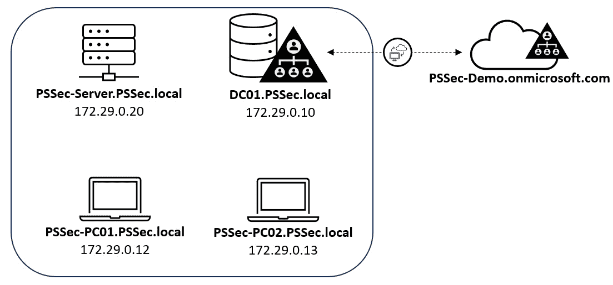
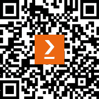

# 前言

PowerShell 无处不在——它在每个现代 Windows 操作系统上都已预装。从一方面来看，这对管理员来说是非常好的，因为这使得他们能够开箱即用地管理系统；但另一方面，攻击者也可以利用 PowerShell 执行他们的恶意载荷。

PowerShell 本身提供了多种功能，不仅可以帮助你提高环境的安全性，还能帮助你完成下一次红队任务。在本书中，我们将从攻击者和防御者、红队和蓝队的角度，双方面看待 PowerShell 在网络安全中的作用。通过阅读本书，你将深入了解 PowerShell 的安全能力，并学会如何使用它们。

你将了解到，PowerShell 并不像一些人所认为的那样“危险”；相反，你将学习如何配置和利用它来加强你环境的安全性。

本书提供了使用 PowerShell 和相关缓解措施来检测攻击并加强环境安全性的指导。我们将首先回顾 PowerShell 的基础知识，并学习脚本基础。你将获得关于 PowerShell 安全相关事件日志的独特见解，这些见解在其他地方找不到，并学习如何配置 PowerShell 远程访问。

我们将深入探讨系统和 API 访问，探索利用和劫持技术，以及攻击者如何利用 Active Directory 和 Azure AD/Entra ID，并结合这些技术背后丰富而详细的知识。红蓝队的教程都提供了对于 PowerShell 从业者日常使用非常有价值的代码片段。

另一个非常重要的话题是帮助你保护环境的缓解措施。我们将深入探讨**适足管理**（**JEA**），这是一项不太为人所知的技术，我们将提供详细的解释、示例，甚至简化部署此技术的方法。我们将探索语言模式，并学习应用控制和代码签名如何影响 PowerShell。我们还将了解**反恶意软件扫描接口**（**AMSI**），并学习它为何有用以及攻击者如何尝试绕过它。

那么，你还在等什么呢？准备好将 PowerShell 转变为你最强大的盟友，赋能红蓝队员在与网络威胁的无休止战斗中携手作战吧。

# 本书适合的人群

本书面向希望通过 PowerShell 增强安全操作的安全专家、渗透测试员、系统管理员、红蓝队员以及网络安全爱好者。无论你是经验丰富还是新手，本书都提供了宝贵的见解和实用技巧，帮助你利用 PowerShell 完成各种安全任务，包括研究和开发漏洞、绕过安全防护，了解攻击者如何行动，从而减轻威胁并更好地保护你的环境。

推荐具备 PowerShell 和网络安全基础知识，熟悉 Active Directory 等概念以及其他编程语言，如 C 和汇编语言，将对学习有所帮助。

# 本书内容概述

*第一章*，*PowerShell 入门*，介绍了 PowerShell，探讨了它的历史并强调其在网络安全中的重要性。你将了解面向对象编程原则、执行策略和帮助系统等关键概念，以及每个 PowerShell 版本中引入的安全功能。

*第二章*，*PowerShell 脚本基础*，涵盖了 PowerShell 脚本的基础知识，包括变量、数据类型、操作符、控制结构的条件和循环，以及命名约定。本章还探讨了 PowerShell 配置文件、PSDrives，以及如何通过 cmdlets、函数、模块和别名创建可重用的代码。

*第三章*，*探索 PowerShell 远程管理技术与 PowerShell 远程执行*，深入探讨了 PowerShell 的一些远程管理技术，如 WinRM、WMI、CIM、OMI、SSH 远程执行，当然还有 PowerShell 远程执行。你将学习如何配置 PowerShell 远程执行以建立远程连接，创建自定义端点，并远程执行 PowerShell 命令。

*第四章*，*检测 – 审计与监控*，探讨了日志记录在 PowerShell 环境中进行有效检测和监控的重要性。你将学习基本的日志文件、日志功能，如模块和脚本块日志记录、受保护事件日志记录、PowerShell 转录，以及如何使用 PowerShell 分析事件日志。

*第五章*，*PowerShell 强大功能 - 系统与 API 访问*，探讨了 PowerShell 的系统和 API 访问功能。你将学习如何操作 Windows 注册表，使用 Windows API，利用 .NET 类进行高级技巧，以及如何利用 WMI 的强大功能。本章还介绍了如何在不直接调用 `powershell.exe` 的情况下执行 PowerShell。

*第六章*，*Active Directory – 攻击与缓解*，探讨了 AD 安全性，包括身份验证协议、枚举、特权账户、密码喷洒、访问权限、凭证盗窃风险以及缓解策略。我们还将研究 Microsoft 安全基准和安全合规工具包。

*第七章*，*云端黑客技术—利用 Azure Active Directory/Entra ID*，深入分析了 Azure AD/Entra ID，探索其认证机制、特权账户、PowerShell 访问权限以及各种攻击向量。你将了解如匿名枚举、密码喷洒和凭证窃取等技术，并提出相应的防范策略。

*第八章*，*红队任务与食谱*，介绍了攻击的各个阶段和常见的 PowerShell 红队工具。接着，本章提供了一个红队食谱，包含按 MITRE ATT&CK 领域分类的多种方案，如侦察、执行、持久性、防御规避、凭证访问、发现、横向移动、指挥与控制、数据外泄和影响。

*第九章*，*蓝队任务与食谱*，聚焦于蓝队任务，并提供了一份实用的 PowerShell 代码片段食谱。它首先介绍了“保护、检测、响应”的方法，并强调了常见的 PowerShell 蓝队工具。该食谱提供了各种蓝队方案，如检查已安装和缺失的更新、监控和防止绕过、隔离被攻击的系统，以及分析和管理进程、服务和网络连接。

*第十章*，*语言模式与最低权限管理（JEA）*，首先探讨了 PowerShell 中的语言模式及其对脚本执行的影响。接着，重点介绍了 JEA，允许管理员通过基于角色的访问控制将特定任务委派给非管理员用户。本章详细解释了 JEA 的工作原理，包括角色能力和会话配置文件、日志记录及最佳实践，并提供了高效部署 JEA 的指导。

*第十一章*，*AppLocker、应用控制与代码签名*，深入探讨了应用控制与代码签名，重点介绍了如何防止未授权脚本执行、规划应用控制以及部署 Microsoft AppLocker 和 Windows Defender 应用控制等机制。还探讨了基于虚拟化的安全性以及在强制应用控制时对 PowerShell 的影响。

*第十二章*，*探索反恶意软件扫描接口（AMSI）*，讲解了 AMSI，探索其功能和目的。通过实际示例，展示了 AMSI 在检测恶意活动中的重要性。本章还讨论了对手用来绕过和禁用 AMSI 的各种技术，包括混淆和 Base64 编码。

*第十三章*，*其他内容？—进一步的缓解措施和资源*，概述了增强安全性的额外 PowerShell 相关缓解措施和资源，如安全脚本编写、所需状态配置、系统和环境加固、以及终端检测与响应。

# 为了最大限度地发挥本书的作用

对于大多数章节，你需要 PowerShell 7.3 及以上版本，并安装 Visual Studio Code 以便检查和编辑代码。

根据你跟随的章节，我们还将讨论其他技术，如 Windows PowerShell 5.1、Visual Studio、C/C++/C#、Visual Basic、汇编语言、Ghidra、Wireshark 和 Microsoft Excel。

| 书中涉及的软件/硬件 | 操作系统要求 |
| --- | --- |
| PowerShell 7.3 及以上 | Windows 10 及以上 |
| Windows PowerShell 5.1 | Windows Server 2019 及以上版本 |
| Visual Studio Code |  |

尽管本书中的大多数示例可能只需要一台测试机器，但强烈建议设置一个演示环境，以提升你在本书某些部分的体验。

我使用虚拟机来搭建我的环境，建议你也这样做，以便跟上进度。Hyper-V 是一款免费的虚拟化管理程序，你可以用它来设置你的机器。

对于我的演示环境，我设置了以下机器，在本书中将多次提及：

+   `PSSec-PC01**: **172.29.0.12`, Windows 10 企业版，22H2，加入域 `PSSec.local`

+   `PSSec-PC02**: **172.29.0.13`, Windows 10 企业版，22H2，加入域 `PSSec.local`

+   `PSSec-Server**: **172.29.0.20`, Windows Server 2019 数据中心版，加入域 `PSSec.local`

+   `DC01**: **172.29.0.10`, Windows Server 2019 数据中心版，托管域 `PSSec.local`

    +   **已安装相关角色**：活动目录证书、活动目录域服务、DNS 服务器和组策略管理

+   针对 *第七章* 的 **Azure 演示环境**：`PSSec-Demo.onmicrosoft.com`

+   **可选**：Linux 和 macOS 跟随 *第三章* 配置 PowerShell 远程（SSH）连接

以下图示展示了本书中使用的相关设置：



图 P.1 – 本书中使用的设置

此设置仅配置在测试环境中，因此不应在生产环境中使用。

**如果你使用的是本书的数字版，建议你自己输入代码或访问本书的 GitHub 仓库中的代码（链接将在下一节提供）。这样可以帮助你避免因复制和粘贴代码而产生的潜在错误。**

# 下载示例代码文件

你可以从 GitHub 下载本书的示例代码文件，地址为 [`github.com/PacktPublishing/PowerShell-Automation-and-Scripting-for-Cybersecurity`](https://github.com/PacktPublishing/PowerShell-Automation-and-Scripting-for-Cybersecurity)。如果代码有更新，它将在 GitHub 仓库中同步更新。

我们还提供来自我们丰富书籍和视频目录的其他代码包，详见 [`github.com/PacktPublishing/`](https://github.com/PacktPublishing/)。快来查看吧！

每章中提到的所有链接将保存在我们的 GitHub 仓库中。由于链接经常会有所变动，GitHub 仓库中的链接将保持最新（当然是按照更新周期），以防打印版网址出现错误。

# 使用的约定

本书中使用了若干文本约定。

**文本中的代码**：表示文本中的代码词汇、数据库表名、文件夹名、文件名、文件扩展名、路径名、虚拟网址、用户输入和 Twitter 用户名。例如：“导出一个或多个别名，使用 `Export-Alias` — 可以作为 `.csv` 文件或脚本导出。”

代码块如下所示：

```
if (<condition>)
{
    <action>
}
```

当我们希望特别引起你注意某一部分代码块时，相关的行或项会以粗体显示：

```
if ($color -eq "blue") {
    Write-Host "The color is blue!"
}
elseif ($color -eq "green"){
    Write-Host "The color is green!"
}
```

任何命令行输入或输出如下所示：

```
> ("Hello World!").Length
12
```

**粗体**：表示一个新术语、重要单词或你在屏幕上看到的单词。例如，菜单或对话框中的单词通常显示为**粗体**。以下是一个例子：“配置**启用脚本执行**设置，并选择**允许本地脚本和远程签名的脚本**选项。”

提示或重要注意事项

显示方式如下。

# 联系我们

我们始终欢迎读者的反馈。

**一般反馈**：如果你对本书的任何方面有疑问，请通过电子邮件联系我们 [customercare@packtpub.com](http://customercare@packtpub.com)，并在邮件主题中注明书名。你也可以通过 Twitter（**@miriamxyra**）或 Mastodon（**@mw@infosec.exchange**）与作者联系。

**勘误**：尽管我们已尽最大努力确保内容的准确性，但错误仍然可能发生。如果你在本书中发现错误，我们将非常感激你向我们报告。请访问 [www.packtpub.com/support/errata](http://www.packtpub.com/support/errata) 并填写表单。

**盗版**：如果你在互联网上遇到任何非法的本书复制品，无论是以何种形式，我们将非常感激你提供该位置地址或网站名称。请通过 [copyright@packt.com](http://copyright@packt.com) 与我们联系，并附上相关材料的链接。

**如果你有兴趣成为作者**：如果你对某一领域有专业知识，并且有意写作或为书籍贡献内容，请访问 [authors.packtpub.com](http://authors.packtpub.com)

# 分享你的想法

阅读完《PowerShell 自动化与脚本编写在网络安全中的应用》后，我们非常希望听到您的反馈！[请点击这里直接进入亚马逊的本书评论页面，分享您的想法](https://packt.link/r/1800566379)。

您的评价对我们和技术社区非常重要，将帮助我们确保提供优质内容。

.

# 下载本书的免费 PDF 副本

感谢购买本书！

您是否喜欢在旅途中阅读，但又无法随身携带纸质书籍？

您的电子书购买是否与您选择的设备不兼容？

别担心，现在每本 Packt 书籍都可以免费获得该书的无 DRM PDF 版本。

随时随地、在任何设备上阅读。直接将您最喜欢的技术书籍中的代码搜索、复制并粘贴到您的应用程序中。

福利不仅仅于此，您还可以获得独家折扣、新闻通讯和每日发送到您邮箱的精彩免费内容。

按照这些简单步骤即可获得福利：

1.  扫描二维码或访问以下链接



[`packt.link/free-ebook/9781800566378`](https://packt.link/free-ebook/9781800566378)

1.  提交您的购买证明

1.  就这些！我们会直接将您的免费 PDF 和其他福利发送到您的邮箱

# 第一部分：PowerShell 基础

在这一部分，我们将重新审视开始使用 PowerShell 进行网络安全所需的基础知识。我们将从回顾基础开始，包括面向对象编程原则、Windows PowerShell 和 PowerShell Core 之间的区别、PowerShell 的基本概念以及每个 PowerShell 版本中引入的安全功能。

接下来，我们将探讨 PowerShell 脚本的基本知识。在本部分结束时，您将具备编写 PowerShell 脚本的技能，能够有效利用各种控制结构、变量和运算符，创建可重复使用的代码。

您还将探索如何配置和利用远程管理技术，特别是 PowerShell 远程。您将深入了解关于 PowerShell 远程和身份验证的安全性知识和最佳实践。

最后，我们将探讨 PowerShell 相关的事件日志：您将了解哪些 Windows 事件日志和事件在 PowerShell 网络安全中最为重要。我们将研究如何配置脚本块日志、模块日志和转录文件，并高效地分析事件日志。

本部分包含以下章节：

+   *第一章*，*开始使用 PowerShell*

+   *第二章*，*PowerShell 脚本基础*

+   *第三章*，*探索 PowerShell 远程管理技术和 PowerShell 远程*

+   *第四章*，*检测—审计和监控*
