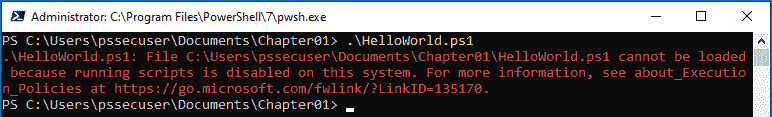

# 第一章：PowerShell 入门

本简介章节将介绍使用 PowerShell 的基本概念。它作为网络安全领域 PowerShell 的基础入门，并且作为 **面向对象编程**（**OOP**）的介绍，以及如何开始使用 PowerShell。

本章是 *第二章* 的补充，*PowerShell 脚本编写基础*，我们将在该章深入探讨脚本部分。这两章应该能帮助你入门，并作为你在后续章节工作时的参考。

你将学习 PowerShell 的基本知识，它的历史，以及为什么在过去几年中，它在网络安全领域变得越来越重要。

你将概述编辑器，并学习如何通过现有功能自助帮助自己。在本章中，你将深入了解以下主题：

+   什么是 PowerShell？

+   PowerShell 的历史

+   为什么 PowerShell 对网络安全有用？

+   面向对象编程（OOP）简介

+   Windows PowerShell 和 PowerShell Core

+   执行策略

+   帮助系统

+   PowerShell 版本

+   PowerShell 编辑器

# 技术要求

为了充分利用本章内容，请确保你拥有以下内容：

+   PowerShell 7.3 及以上版本

+   安装了 Visual Studio Code

+   获取 **第一章** 的 GitHub 仓库访问权限：

[`github.com/PacktPublishing/PowerShell-Automation-and-Scripting-for-Cybersecurity/tree/master/Chapter01`](https://github.com/PacktPublishing/PowerShell-Automation-and-Scripting-for-Cybersecurity/tree/master/Chapter01)

# 什么是 PowerShell？

PowerShell 是一个脚本框架和命令行外壳，基于 .NET 构建。默认情况下，它在 Windows **操作系统**（**OS**）上实现。它是基于对象的，这意味着你所处理的所有事物（例如变量、输入等）都有属性和方法。这为使用 PowerShell 提供了很多可能性。

此外，PowerShell 还具有管道功能，允许将输入传递到其他命令以供重用。这将基于命令行的脚本语言的优势与面向对象语言结合在一起。而且，它还内置了帮助系统，让你在使用控制台时可以自助获取帮助。

PowerShell 不仅仅运行在 Windows 操作系统上。自 2016 年发布 PowerShell Core 后，它可以在任何操作系统上运行，包括 Linux 和 macOS 设备。

它帮助安全专业人员在非常短的时间内完成大量工作。不仅蓝队人员觉得它有用，红队人员也同样如此。就像每个提供大量功能并使你以更高效的方式完成日常工作的特性一样，PowerShell 既可以用于正当目的，也可以用于不当用途。它对于专业人员来说是一个强大的工具，但像往常一样，安全专业人员需要做好自己的工作，保护自己的环境，以免现有工具和机器被对手滥用。

但首先，让我们看看 PowerShell 是如何诞生的，以及它多年来是如何发展的。

## PowerShell 的历史

在 PowerShell 创建之前，已经有了 **命令行界面**（**CLIs**），每个操作系统都自带命令行工具来管理系统：`COMMAND.COM` 是 MS DOS 和 Windows 9.x 的默认工具，而 `cmd.exe` 是 Windows NT 系列的默认工具。后者 `cmd.exe` 仍然集成在现代 Windows 操作系统中，例如 Windows 10。

这些命令行工具不仅可以用来执行命令行中的命令，还可以使用批处理文件语法编写脚本来自动化任务。

由于 **图形用户界面**（**GUI**）并未提供所有功能，无法通过命令行自动化所有任务。此外，语言本身存在不一致性，因此脚本编写不像预期的那样简便。

1998 年，微软在 Windows 98 中发布了 `Windows Script Host`（**cscript.exe**），以克服以前命令行界面的局限性，并改善脚本编写体验。通过 `cscript.exe`，现在可以与 **组件对象模型**（**COM**）的 API 进行交互，这使得该接口变得非常强大；如此强大，以至于不仅系统管理员利用这一新功能，恶意软件作者也开始使用它。这很快使得 `cscript.exe` 获得了作为操作系统脆弱向量的声誉。

此外，Windows Script Host 的文档不容易获取，而且除了 `cscript.exe` 之外，还开发了更多用于不同用途的命令行工具，如 `netsh` 和 `wmic`。

1999 年，*Jeffrey Snover*，一位具有 UNIX 背景的工程师，开始为微软工作。*Snover* 是命令行和自动化的忠实粉丝，因此他的初衷是将 UNIX 工具应用于微软系统，支持微软的 Windows **UNIX 服务**（**SFU**）。

然而，由于 Windows 和基于 UNIX 的系统之间存在巨大的架构差异，他很快意识到，在 Windows 上使 UNIX 工具可用，并没有为 Windows 系统带来任何价值。

虽然 UNIX 系统依赖于可以轻松使用如`awk`、`sed`、`grep`等工具进行操作和处理的 ASCII 文件，但 Windows 系统则是基于 API 的，依靠结构化数据。

因此，他决定自己做得更好，并在 2002 年开始开发一种新的命令行工具——`Monad`（也称为 **Microsoft Shell/MSH**）。

现在，Monad 不仅可以将结构化数据（对象）传递到管道中，而不是简单的文本，还可以在多个设备上远程运行脚本。此外，管理员使用 Monad 进行管理变得更容易，因为许多默认任务在此框架内被简化了。

2006 年 4 月 25 日，微软宣布 Monad 被更名为 PowerShell。同年，PowerShell 的第一个版本发布，不久之后（2007 年 1 月），PowerShell 也发布了 Windows Vista 版本。

2009 年，PowerShell 2.0 作为 Windows 7 和 Windows Server 2008 R2 的一部分发布，并且默认集成到操作系统中。

多年来，PowerShell 得到了进一步的发展，并且在此期间发布了许多新版本，包含了新的功能和改进。

然后，在 2016 年，微软宣布将 PowerShell 开源（MIT 许可），并且将支持跨平台使用。

PowerShell 5.1 是最后一个仅限 Windows 的 PowerShell 版本，它于 2016 年发布。它仍然会随着 Windows 系统一起分发，但不再进行开发。

PowerShell 团队当时正在支持 Nano Server。因此，存在一个完整版本的 PowerShell 来支持 Windows 服务器和客户端。Nano Server 的 .NET 版本（称为 .NET Core）被大幅删减，因此团队不得不减少功能并削减内容，使 PowerShell 能够与 .NET Core 一起工作。所以，从技术上讲，PowerShell 5.1 为 Nano Server 是第一个 PowerShell Core 版本。

PowerShell Core 的第一个正式版本是 6.0，它也提供了对跨平台（如 macOS 和 Linux）的支持。

## 为什么 PowerShell 对网络安全有用？

PowerShell 默认在大多数现代 Windows 系统上运行。它帮助管理员自动化日常工作流程。由于 PowerShell 在所有系统上都可用，它也使得攻击者更容易利用这个脚本语言达到他们的目的——例如，如果攻击者通过 **凭证` `盗窃** 攻击获取了系统的访问权限。

对于攻击者来说，这听起来太棒了：一个预安装的脚本框架，提供对 cmdlet 和底层 .NET 框架的直接访问。自动化可以让你做很多事情——不仅仅是出于好目的。

### PowerShell 是否危险，应该禁用吗？

不！在与 CISO 交谈时，我经常听到这个问题。随着 PowerShell 越来越多地出现在红队手中，一些人开始担心这个强大的脚本框架的能力。

但和往常一样，这不是黑与白的简单问题，组织应更多地考虑如何加固他们的系统、保护他们的身份，如何实现更好的检测，并且如何以有利于工作负载和流程的方式利用 PowerShell——而不是担心 PowerShell 本身。

最终，当你设置服务器时，你不仅仅是安装它并将其连接到互联网。PowerShell 也一样：你不能仅仅启用 PowerShell 远程使用，让任何人都能远程连接到你的服务器，而不考虑他们的角色。

PowerShell 只是一个脚本语言，类似于预安装的 `cscript` 或 `batch`。从技术上讲，它提供的潜在影响与 `Java` 或 `.NET` 相似。

如果我们将其与 Linux 或 macOS 相比较，说 PowerShell 危险就像说 **Bash 或 zsh** 危险一样。

一位在事件响应领域工作多年的朋友曾告诉我，攻击者将 `C#` 代码文件放置到目标机器上，并调用 `csc.exe`（.NET 框架的一部分）直接在机器上编译这些文件。这是一个非常有效的方式，能够利用预装的软件在系统上安装攻击者的代码，而不需要借助 PowerShell。

换句话说，危险或恶意的并不是语言本身；对手仍然需要身份或授权才能执行操作，而这些可以由负责环境安全的安全专家或管理员加以限制。

坦白说，我认识或与许多红队人员交谈过，他们现在开始越来越多地转向其他语言，如 C# 或 C++，而不是 PowerShell，尤其是在攻击中想要保持不被察觉时。

如果实施了正确的安全措施和检测，在一个配置良好并且保护完善的环境中，使用 PowerShell 发起攻击几乎不可能不被察觉。一旦您遵循了安全最佳实践，PowerShell 将帮助您保持环境的安全，并帮助您追踪任何入侵者。

此外，您的环境安全在很大程度上取决于您的全局凭证和访问管理：在攻击者能够利用 PowerShell 之前，他们首先需要访问系统。我们将在 *第六章* 中仔细探讨如何在凭证方面保护您的环境，*Active Directory – 攻击与缓解*。

### PowerShell 如何支持我的蓝队？

PowerShell 不仅使您的 IT 专业人员能够更高效地工作并更快地完成任务，还为您的安全团队提供了极好的选择。

PowerShell 提供了许多内置的安全防护措施，您将在本书中进一步了解这些内容：

+   **自动化与合规性**：其中一个主要的好处是，您可以自动化重复且枯燥的任务。您的管理员不仅能从自动化任务中受益，而且您的 **安全运营中心**(**SOC**) 还可以在特定事件触发时自动执行响应操作。

组织遭到入侵的主要原因之一是缺少安全更新。保持所有系统更新并不容易——即使是像 `Windows Server Update Services** (`WSUS**) 这样的更新管理系统也很难完全保证。PowerShell 可以帮助构建一个机制，定期检查是否缺少更新，从而保持您的环境安全。

审计和执行合规性可以通过使用 **所需状态配置**(**DSC**) 来轻松实现。

自动化安全检查以审核 Active Directory 或服务器安全性，并强制执行您的安全基线。DSC 使您能够随时控制服务器的配置。您可以将您的机器配置为每 15 分钟重置其配置到您指定的设置。

此外，如果你将 DSC 集成到你的事件响应计划中，重新构建可能被入侵的服务器将变得非常容易。

+   **控制谁可以做什么以及在哪里做**：通过配置**PowerShell 远程管理`/**WinRM`，你可以指定*谁*被允许登录到*哪个设备或服务器*。当然，这对**凭证盗窃**无济于事（因为这不是 PowerShell 的话题），但它有助于细化定义哪个身份可以做什么。此外，它还提供了远程连接的出色审计能力。

**受限语言模式**允许你限制会话中可以使用的 PowerShell 元素。这已经可以帮助防止某些攻击。

使用**足够的管理**（**JEA**），你甚至可以限制哪些角色/身份被允许在特定机器上运行哪些命令。你还可以限制命令的参数。

+   **了解你的环境中发生了什么**：PowerShell 提供了一个广泛的日志框架，拥有许多额外的日志选项，例如创建记录和脚本块日志记录。

如果在 PowerShell 中配置了适当的基础设施，几乎所有的操作都可以被追踪。你甚至可以使用**安全编排、自动化和响应**（**SOAR**）方法自动化你的响应行动。

使用 PowerShell，你可以快速提取并搜索多个服务器的事件日志，远程连接以进行分析。

在安全漏洞发生的情况下，PowerShell 还可以帮助你收集和调查法医证据，并自动化调查过程。有许多优秀的模块，如*PowerForensics*，可以用于你的法医操作和事后补救。

+   **限制哪些脚本可以运行**：默认情况下，PowerShell 提供了一个名为**执行策略**的功能。虽然它*不是*一种安全控制，但它可以防止用户不小心运行脚本。

对你的代码进行签名可以帮助你验证执行的脚本是否被认为是合法的：如果只允许签名的脚本运行，这是防止用户直接运行从互联网下载的脚本的绝佳方式。

`AppLocker`与**代码签名**结合使用，可以帮助你控制在组织中哪些脚本可以运行。

然而，前述解决方案并未限制交互式代码的执行。

+   **检测并阻止恶意代码执行**：**反恶意软件扫描接口**（**AMSI**）提供了一种可能性，允许你的代码通过当前机器上存在的反恶意软件解决方案进行检查。这有助于检测恶意代码，并且是防止无文件恶意软件攻击（**Living off the Land**）的绝佳保障——这种攻击不需要在机器上存储文件，而是直接在内存中运行代码。

它直接集成在 PowerShell 中，可以评估脚本、交互式使用和动态代码评估。

这些只是 PowerShell 如何支持蓝队的一些示例，但它应该已经为你提供了一个概述，展示了蓝队员如何从使用和审计 PowerShell 中受益。

阅读这篇由微软 PowerShell 团队发布的精彩博客文章*PowerShell* *♥* *蓝队*也是值得的，它提供了关于 PowerShell 如何支持蓝队员的建议：[`devblogs.microsoft.com/powershell/powershell-the-blue-team/`](https://devblogs.microsoft.com/powershell/powershell-the-blue-team/)。

在你翻阅本书的过程中，你将学习到更多关于可能的攻击、缓解措施和绕过方法的内容。

但首先，让我们开始复习 PowerShell 基础知识。享受吧！

# 开始使用 PowerShell

在我们直接进入网络安全脚本编写以及疯狂的红蓝队任务之前，了解一些 PowerShell 的基础知识是非常重要的。以下是一些有助于你入门的复习内容。

面向对象编程简介

PowerShell 是一种面向对象的语言。面向对象编程让开发人员能够将软件开发看作是与现实世界中的对象或实体进行工作。面向对象编程的主要优点之一是它可扩展、灵活，并且总体上能让你高效地复用代码。

面向对象编程中的一些基本术语包括**类**、**对象**、**属性**和**方法**。如果我们看看面向对象编程的四个主要原则——**封装**、**抽象**、**继承**和**多态**——如果你还没有面向对象编程经验，可能会感到有些不知所措。

但别担心，它并不像听起来那么难，面向对象编程会让你的生活变得更轻松！

为了更好地理解这些概念和原理，我们以 Alice 和 Bob 为例。他们都是人类，因此共享相同的*类*：**人类**。两者都是我们示例中的工作实体，因此也是我们的*对象*。

*类*是属性和方法的集合，类似于对象的蓝图。Alice 和 Bob 都是人类，分享许多*属性*和*方法*。两者都有一定的每日能量，可以感到不同程度的放松，并且都需要工作来赚取金钱。

两者都需要工作，并且喜欢喝咖啡。晚上，两者都需要休息以恢复精力：


图 1.1 – Alice，CISO

Alice 担任**首席信息安全官**（**CISO**），并且经常在会议之间和晚上与她的猫咪 Mr. Meow 一起玩耍，这帮助她放松。


图 1.2 – Bob，安全顾问

相比之下，Bob 是一名安全顾问。尽管他也是人类，但他的*方法*与 Alice 不同：Bob 没有猫，但他在闲暇时喜欢画画，这使他感到放松并恢复精力。

让我们通过 Alice 和 Bob 来探索面向对象编程的四个主要原则。

### 封装

**封装**的实现方式是，如果每个对象将其状态保持为类内的**私有**，其他对象不能直接访问它，必须通过调用方法来改变它的状态。

比如，爱丽丝的状态包括私有的`EnergyLevel`、`RelaxationStatus`和`Money`属性。她还有一个私有的`SighHappily()`方法。她可以在任何时候调用这个方法；其他类无法影响爱丽丝何时开心地叹气。当爱丽丝和她的猫咪“喵先生”玩耍时，`SighHappily()`方法会默认被调用——爱丽丝真的很喜欢这个活动。

其他类所能做的，是调用公共的`Work()`、`DrinkCoffee()`、`Sleep()`和`PlayWithCat()`函数。这些函数能够改变内部状态，甚至在爱丽丝和她的猫咪“喵先生”玩耍时，调用私有的`SighHappily()`方法：


图 1.3 – 近距离观察公共方法和私有方法

总结来说，如果你想要改变一个私有属性的值，你始终需要调用与私有状态相关联的公共方法。就像现实生活中，没有魔法药方——除了咖啡——可以立即消除你的疲劳。即使喝了咖啡，你仍然需要做出行动去喝它。私有状态和公共方法之间的绑定关系被称为**封装**。

### 抽象

**抽象**可以看作是封装的自然扩展。通常，代码库会变得非常庞大，这时你可能会失去对代码的整体把握。应用抽象意味着每个对象应仅暴露其高级方法，隐藏不必要的细节，避免其他对象的干扰。

例如，我们在`human`类中定义了`Work()`方法。

根据你父母的技术理解能力，他们可能能理解你日常工作中的内容。然而，我的父母对我说的一个字也不懂，他们只知道我在做与计算机相关的工作。所以，如果我和父母通话，我不会告诉他们每一个细节，也不会让他们无聊死。我只是告诉他们，我已经完成工作。

写面向对象代码时，也应遵循类似的原则。虽然`Work()`方法背后有许多不同的操作，但它被抽象化了，只有相关的数据会被显示出来。

另一个例子是办公室里的电梯。当你按下按钮去到不同的楼层时，表面下发生了某些事情。但电梯用户只能看到按钮和显示楼层的屏幕。这一原则被称为抽象，有助于保持任务的概览。

### 继承

如果你需要非常相似的类或对象，你可能不希望重复现有的代码。这样会使事情变得更加复杂、工作量增加，并且更容易产生 bug——例如，如果你必须为所有不同的实例更改代码，但却忘记了某一个。

所以，我们的 Alice 和 Bob 对象非常相似，共享一个*共同的逻辑*，但它们*并不完全相同*。它们都是人类，但拥有不同的职业，要求具备不同的技能和任务。

所有 CISO 和所有安全顾问都是人类，因此这两个角色都**继承**了`human`类的所有属性和方法。

类似于`SecurityConsultant`类，`CISO`类继承了`human`类的所有属性和方法。然而，虽然`CISO`类还引入了`StrategicPlanningSkillset`属性和`CalculateRisk()`方法，但它们对于`SecurityConsultant`类并不必要。

`SecurityConsultant`类定义了自己的`TechnicalAuditingSkillset`属性以及`AnalyzeSystem()`和`TalkToCustomer()`方法。

Alice 继承了`human`类中定义的所有技能，而在`CISO`类中，这构建了一个*层次结构*：`human`现在是`CISO`类的父类，而`CISO`类是 Alice 的**父类**—在这个案例中，Alice 是**子对象**。

此外，Bob 继承了`human`类中定义的所有属性和方法，但与 Alice 相比，他继承了`SecurityConsultant`类中的所有内容：


图 1.4 – 继承：父类和子类以及对象

另外，亲爱的安全顾问和 CISO 们，我知道你们的职业要求远多于此示例所显示的技能，而且你们的角色比这个示例所展示的要挑战得多。我尽量将其抽象化，以保持简单。

看看 Alice 和 Bob，Alice 喜欢和她的猫 Mr. Meow 一起度过时光，所以她有自己独特的`PlayWithCat()`和`SighHappily()`方法。Bob 没有猫，但他喜欢画画，因此他有独特的`Paint()`方法。

使用**继承**，我们只需要添加必要的部分来实现所需的更改，同时使用父类中的现有逻辑。

### 多态性

既然我们已经了解了继承的概念，那么**多态性**也就不远了。多态性意味着，尽管你可以从不同的类创建不同的对象，但所有类和对象都可以像它们的父类一样使用。

如果我们看一下 Alice 和 Bob，两者都是人类。这意味着我们可以依赖于两者都支持`EnergyLevel`、`RelaxationStatus`和`Money`属性，以及`Work()`、`DrinkCoffee()`和`Sleep()`方法。

此外，他们可以支持其他独特的属性和方法，但始终支持与父类相同的内容，以避免混淆。

请注意，这个概述仅应作为一个高层次的介绍；如果你想深入了解面向对象编程（OOP）的概念，你可能需要查阅其他专门讲解 OOP 的文献，比如*《学习面向对象编程》*，该书由 Gaston C. Hillar 编写，并由 Packt 出版。

现在你已经理解了面向对象编程（OOP）的基本概念，让我们回到 PowerShell 的使用上。

## Windows PowerShell

默认情况下，Windows PowerShell 5.1 会安装在所有较新的系统上，从 Windows 10 开始。你可以通过在开始菜单中搜索`PowerShell`来打开它，也可以通过按 *Windows 键* + *R*，然后输入 `powershell` 或 `powershell.exe` 来启动它。

在这个控制台中，你可以运行命令、脚本或 cmdlet：


图 1.5 – Windows PowerShell 版本 5.1 命令行界面

在 Windows 10 设备上，Windows PowerShell v5.1 的默认位置如下：

+   Windows PowerShell: `%SystemRoot%\system32\WindowsPowerShell\v1.0\powershell.exe`

+   Windows PowerShell (x86): `%SystemRoot%\syswow64\WindowsPowerShell\v1.0\powershell.exe`

为什么路径中会有 v1.0？这是否意味着我在运行旧版本？

由于本书中也会更详细地讲解 PowerShell 版本，你可能会想：*天啊，我听说旧版本没有提供所有必要的安全功能，比如日志记录等！我是不是* *处于风险之中？*

不是的，实际上即便路径中包含 `v1`，新版本仍然会被安装到这个路径中。最初计划为每个版本创建一个新的文件夹，并使用正确的版本名称，但后来微软决定不这样做，以避免引发破坏性更改。

你可能也注意到了 `.ps1` 脚本扩展名。这里的原因是相同的：最初也计划通过脚本扩展名来区分每个版本，但出于向后兼容的原因，PowerShell v2 的逻辑并未实现这一点。

但由于 Windows PowerShell 将不再进一步开发，因此安装并使用最新的 PowerShell Core 二进制文件是合理的选择。

## PowerShell Core

在较新的系统上，Windows PowerShell 版本 5.1 仍然是默认安装的。如果要使用最新的 PowerShell Core 版本，你需要手动下载并安装它。在本书写作时，最新的稳定 PowerShell Core 版本是 PowerShell 7.3.6。

要了解如何下载并安装最新的 PowerShell Core 版本，你可以参考官方文档：[`docs.microsoft.com/en-us/powershell/scripting/install/installing-powershell-core-on-windows`](https://docs.microsoft.com/en-us/powershell/scripting/install/installing-powershell-core-on-windows)。

你可以在这里找到最新的稳定版 PowerShell Core：[`aka.ms/powershell-release?tag=stable`](https://aka.ms/powershell-release?tag=stable)。

下载并开始安装。安装向导将打开，并引导你完成安装过程。根据你的需求，你可以指定默认配置项：


图 1.6 – 安装 PowerShell 7

如果你尚未启用 **PowerShell 远程管理**，不用担心。你可以稍后配置此选项。向导将会运行并将 PowerShell Core 安装到单独的`$env:ProgramFiles\PowerShell\7`目录。PowerShell 7 设计为与 PowerShell 5.1 并行运行。

设置完成后，你可以启动新的 PowerShell 控制台并将其固定到任务栏或开始菜单：


图 1.7 – PowerShell 7 CLI

现在你可以使用最新的 PowerShell Core 版本，替代旧版 Windows PowerShell 5.1。

### 安装 PowerShell Core 组策略定义

为你的环境中的服务器定义一致的选项时，组策略能够帮助进行配置。

在安装 PowerShell 7 时，组策略模板以及安装脚本会被填充到`$PSHOME`目录下。

组策略需要两种模板（`.admx`，**.adml**）来配置基于注册表的设置。

你可以使用`Get-ChildItem -Path $PSHOME -Filter *****Core*Policy*` 命令查找模板和安装脚本：


图 1.8 – 查找 PowerShell Core 组策略模板和安装脚本

在你的域控制器中输入 `$PSHOME\InstallPSCorePolicyDefinitions.ps1`，按下*Tab*键并按*Enter*键确认。

PowerShell Core 的组策略模板将被安装，你可以通过以下路径访问它们：

+   **计算机配置** | **管理模板` | **PowerShell Core`

+   **用户配置** | **管理模板` | **PowerShell Core`

现在你可以使用这些模板来配置 PowerShell Core 环境，和 Windows PowerShell 一起使用。

你可以分别配置这两种策略，但为了避免混淆和错误配置，建议你在 Windows PowerShell 中配置设置，并勾选所有 PowerShell Core 组策略设置中提供的**使用 Windows PowerShell 策略设置**框。

### 自动完成

自动完成命令非常有用，能节省大量时间。你可以使用*Tab*键或*Ctrl* + 空格键进行自动完成：

+   使用*Tab*键时，系统会显示最接近你已输入命令的命令。每按一次*Tab*键，你可以浏览命令并输入下一个命令——按字母顺序排列。

+   如果有多个命令符合你输入的字符串，你可以按*Ctrl* + 空格键查看所有可能的命令。你可以使用箭头键选择一个命令，按*Enter*键确认：


图 1.9 – 使用 Ctrl + 空格键选择正确的命令

### 使用 PowerShell 历史记录

有时，查看你最近在 PowerShell 会话中使用过哪些命令是非常有用的：


图 1.10 – 使用 Get-History

所有最近使用的命令都会显示出来。使用箭头键浏览最近使用的命令，修改它们并重新执行。

在这个例子中，最后执行的命令之一是`Enter-PSSession`命令，它启动一个 PowerShell 远程会话连接到指定的主机——在这个例子中，是连接到`PSSEC-PC01`。

如果你想启动另一个 PowerShell 远程会话连接到`PSSEC-PC02`而不是`PSSEC-PC01`，你不必再次输入整个命令：只需按一次*向上箭头键*，然后将`-ComputerName`改为`PSSEC-PC02`并按*Enter*键执行即可。

如果你的配置允许你使用相同的凭据从这台 PC 连接到`PSSEC-PC02`，则连接会建立，你可以在`PSSEC-PC02`上远程工作。

我们将在*第三章*中更详细地探讨 PowerShell 远程管理技术和*PowerShell 远程管理*。

### 搜索 PowerShell 历史

要搜索历史记录，将`Get-History`命令管道传输到`Select-String`并定义你要搜索的字符串：

```
Get-History | Select-String <string to search>
```

如果你是一个喜欢保持命令简洁的人，**别名**可能会对你有所帮助。我们稍后会详细了解它们，但现在，下面是一个使用别名来缩写命令并搜索历史的例子：

```
h | sts <string to search>
```

如果你想查看在本次会话中建立的所有 PowerShell 远程会话，可以搜索`Enter-PSSession`字符串：


图 1.11 – 搜索会话历史

然而，如果你只搜索子字符串，比如`PSSession`，你可以找到`PSSession`字符串的**所有**出现，包括最后执行的`Get-History`命令：


图 1.12 – 搜索会话历史

当你在寻找最近执行的命令时，你不需要查询整个历史记录。要仅获取最近的*X*条历史记录，可以指定`-Count`参数。

在这个例子中，要获取最后五条记录，指定`-Count 5`：


图 1.13 – 获取最后五条历史记录

当你关闭 PowerShell 会话时，*会话历史*会被删除。这意味着如果你在启动新会话时使用会话绑定的`Get-History`命令，你将得不到任何结果。

但是，也有一个*持久历史*，你可以查询，正如`PSReadline`模块所提供的。

历史记录存储在一个文件中，该文件存储在`(Get-PSReadlineOption).HistorySavePath`配置的路径下：


图 1.14 – 显示持久历史的位置

你可以通过`Get-Content`来打开文件或查看其内容：

```
> Get-Content (Get-PSReadlineOption).HistorySavePath
```

如果你只是想搜索某个命令并再次执行，**交互式搜索**可能会有所帮助。按下*Ctrl* + *R*进行反向搜索，输入你之前执行命令时用过的字符或词语。

在进行反向搜索时，你之前执行的最新命令会出现在命令行中。要查找下一个匹配项，再次按下*Ctrl* + *R*：


图 1.15 – 使用交互式搜索进行反向搜索

*Ctrl* + *S* 和 *Ctrl* + *R* 类似，后者用于反向搜索，前者用于正向搜索。你可以使用这两个快捷键在搜索结果中前后移动。

*Ctrl* + *R* 和 *Ctrl* + *S* 允许你搜索永久历史记录，因此你不局限于只搜索当前会话中执行的命令。

### 清除屏幕

有时，在运行多个命令之后，你可能想在不重新打开终端的情况下开始一个空白的 shell，以保留当前会话、历史记录和变量：

```
> Clear
```

输入`Clear`命令并按*Enter*确认后，当前的 PowerShell 控制台将被清空，你可以从一个全新的控制台开始。此会话中设置的所有变量仍然可访问，历史记录仍然可用。

除了`Clear`，你还可以使用`cls`别名或*Ctrl* + *L*快捷键。

### 取消命令

如果你正在运行某个命令，有时可能会出于不同的原因取消它。可能是你不小心执行了命令，或者某个命令执行时间过长，亦或你想尝试不同的方法——没关系，*Ctrl* + *C* 是你的朋友。按下 *Ctrl* + *C* 来取消正在运行的命令。

## 执行策略

在我们开始编写 PowerShell 脚本之前，让我们先详细了解一个名为执行策略（Execution Policy）的机制。如果你曾尝试在未配置为允许运行脚本的系统上运行脚本，可能已经遇到过这个功能：



图 1.16 – 尝试在执行策略配置为“Restricted”的系统上执行脚本

执行策略是一个限制系统上 PowerShell 脚本执行的功能。使用`Get-ExecutionPolicy`来查看当前执行策略的配置：


图 1.17 – 查找当前执行策略设置

虽然所有 Windows 客户端的默认设置是 *Restricted*，但 Windows 服务器的默认设置是 *RemoteSigned*。在配置为 *Restricted* 设置的系统中，完全不允许运行脚本，而 *RemoteSigned* 则允许执行本地脚本和已签名的远程脚本。

### 配置执行策略

要开始使用 PowerShell 并创建自己的脚本，首先需要配置执行策略设置。

执行策略是一个功能，可以防止你不小心运行 PowerShell 代码。它并不能防止试图故意在你的系统上运行代码的攻击者。

它实际上是一个保护你免受自己错误的功能——例如，如果你从互联网下载了一个脚本，想在运行前检查它，而你不小心双击了它，执行策略会帮助你避免这种情况。

### 执行策略选项

以下是执行策略选项，用于决定是否允许在当前系统上运行脚本，或者是否需要签名才能运行：

+   `AllSigned`：只有由受信任的发布者签名的脚本可以执行，包括本地脚本。

在 *1*，*AppLocker、应用控制和代码签名* 中，你可以了解更多关于 **脚本签名** 的内容，或者你可以参考在线文档 [`docs.microsoft.com/en-us/powershell/module/microsoft.powershell.core/about/about_signing`](https://docs.microsoft.com/en-us/powershell/module/microsoft.powershell.core/about/about_signing)。

+   `Bypass`：不阻止任何内容，脚本运行时不会生成警告或提示。

+   `RemoteSigned`：只有本地创建的脚本可以在未签名的情况下运行。所有从互联网下载的脚本或存储在远程网络位置的脚本需要由受信任的发布者签名。

+   `Restricted`：这是默认配置。无法运行 PowerShell 脚本或加载配置文件。但仍然可以运行交互式代码。

+   `Unrestricted`：所有脚本都可以运行，无论它们是从互联网下载的还是本地创建的。如果脚本是从互联网下载的，仍然会提示你是否要运行该文件。

### 执行策略作用范围

要指定谁或什么会受到执行策略功能的影响，你可以定义 **作用范围**。`-scope` 参数允许你设置受执行策略功能影响的作用范围：

+   `CurrentUser`：意味着此计算机上的当前用户会受到影响。

+   `LocalMachine`：这是默认作用范围。此计算机上的所有用户都会受到影响。

+   `MachinePolicy`：这会影响此计算机上的所有用户。

+   `Process`：这只会影响当前的 PowerShell 会话。

一种好的方法是对你们组织中运行的所有脚本进行签名。通过这种方式，你不仅可以识别哪些脚本是被允许的，还可以更好地使用像 AppLocker 这样的进一步防护措施（你可以在 *"第 11 页" 第* 435*页*中阅读更多关于 AppLocker 的信息，*AppLocker、应用控制和代码签名*）– 并且你可以将执行策略配置为 `AllSigned`。

当然，如果你在开发自己的 PowerShell 脚本，在你还在工作时，这些脚本是没有签名的。

为了保持对无意间运行脚本的保护，同时仍能运行本地开发的脚本，`RemoteSigned` 设置是一个很好的选择。在这种情况下，只有本地脚本（即那些没有从互联网下载并签名的脚本）可以运行；来自互联网的未签名脚本将被阻止执行。

使用 `Set-ExecutionPolicy` cmdlet 作为管理员配置执行策略设置：


图 1.18 – 配置执行策略设置

执行策略设置正在配置中。现在你可以在系统上运行自己的脚本和导入的模块。

### Windows PowerShell – 通过组策略配置执行策略

如果你不想手动为组织中的每台机器设置执行策略设置，你还可以通过组策略全局配置它。

要为 *Windows PowerShell* 配置组策略，请创建一个新的 **组策略对象**(**GPO**)，并将其链接到包含所有设备并且你希望配置执行策略的根文件夹。

然后，导航到 **计算机配置** | **策略** | **管理模板** | **Windows 组件` | **Windows PowerShell`：


图 1.19 – 使用 GPO 配置 Windows PowerShell 的执行策略功能

配置 **启用脚本执行** 设置，并选择 **允许本地脚本和远程签名脚本** 选项，这将执行策略配置为 `RemoteSigned`。

### PowerShell Core – 通过组策略配置执行策略

由于 Windows PowerShell 和 PowerShell Core 被设计为并行运行，你还需要为 PowerShell Core 配置执行策略设置。

PowerShell Core 的组策略设置位于以下路径：

+   **计算机配置** | **管理模板` | **PowerShell Core`

+   **用户配置** | **管理模板` | **PowerShell Core`：


图 1.20 – 使用 GPO 配置 PowerShell Core 的执行策略设置

配置所选设置，并应用更改。在此情况下，将应用配置在 Windows PowerShell 组策略中的设置。

### 执行策略不是一种安全控制 —— 避免执行策略

如前所述，执行策略是一种防止你无意间运行脚本的功能。它并不是为了保护你免受恶意用户的攻击，或者防止直接在机器上运行的代码。

即使执行策略配置得再严格，你仍然可以在 PowerShell 提示符下输入任何代码。

本质上，当我们谈论*绕过执行策略*时，我们仅仅是在**避免**执行策略，正如你将在本节中看到的那样。虽然这不是*真正的黑客行为*，但一些安全社区的人仍然喜欢称绕过执行策略为*绕过*。

绕过执行策略非常简单——最简单的方法就是使用它自己的`-Bypass`参数。

该参数是在人们开始将执行策略视为安全控制时引入的。PowerShell 团队希望避免这种误解，以免组织陷入虚假的安全感中。

我创建了一个简单的脚本，它只会将`Hello World!`写入控制台，你可以在 GitHub 上找到该脚本，链接为 https://github.com/PacktPublishing/PowerShell-Automation-and-Scripting-for-Cybersecurity/blob/master/Chapter01/HelloWorld.ps1。

当执行策略设置为受限时，如果我尝试在没有任何附加参数的情况下运行脚本，会收到错误消息。

然而，如果我以管理员身份使用`powershell.exe`运行脚本，并将`-ExecutionPolicy`参数设置为`Bypass`，该脚本就能正常运行：

```
> powershell.exe -ExecutionPolicy Bypass -File .\HelloWorld.ps1
Hello World!
```

如果执行策略通过*组策略*进行配置，则不能仅通过使用`-Bypass`参数来绕过它。

由于执行策略仅限制脚本的执行，另一种方法是将脚本的内容传递给`Invoke-Expression`。同样，脚本内容可以正常运行——即使执行策略是通过组策略进行配置的：

```
Get-Content .\HelloWorld.ps1 | Invoke-Expression
Hello World!
```

将脚本的内容传递给`Invoke-Expression`，使得脚本的内容被处理得就像在本地使用命令行执行命令一样；这绕过了执行策略，而执行策略仅适用于执行脚本，而不适用于本地命令。

这些只是避免**执行策略**的众多方法中的一些示例，更多避免**执行策略**的示例可以参见*"8"页* *337*，*红队任务和手册*。因此，不要误以为**执行策略**能够保护你免受攻击者的侵害。

如果你有兴趣了解哪些缓解措施可以帮助你提高环境的安全性，你可以在*第三部分*，*详细的 PowerShell 安全性缓解措施*中找到更多信息。

## 帮助系统

要在 PowerShell 中取得成功，理解和使用帮助系统至关重要。要开始，你可以在本书中找到一些有用的建议。由于我将只讲解基础知识，并主要集中于网络安全脚本编写，我建议你还要查看 PowerShell 帮助系统的文档。可以通过以下链接找到：https://docs.microsoft.com/en-us/powershell/scripting/learn/ps101/02-help-system。

有三个功能可以在你使用 PowerShell 时让你的工作更加轻松：

+   `Get-Help`

+   `Get-Command`

+   `Get-Member`

让我们更深入地了解如何使用它们，以及它们如何帮助你。

### Get-Help

如果你熟悉 Linux 系统的操作，`Get-Help` 类似于 Linux 中的 `man` 页面，即关于如何以最佳方式使用特定命令的教程和帮助页面的集合。

如果你不知道如何使用某个命令，只需使用 `Get-Help <command>`，你将知道它提供了哪些选项以及如何使用它。

当你第一次在计算机上运行 `Get-Help` 时，你可能只会看到帮助页面的非常有限版本，并带有说明，指出此计算机上缺少该 cmdlet 的帮助文件：

```
Get-Help -Name Get-Help
```

如前所述，输出只显示部分帮助：


图 1.21 – 当 cmdlet 缺少帮助文件时，Get-Help 的输出

因此，首先，你需要更新你的帮助文件。需要互联网连接。以管理员身份打开 PowerShell，并运行以下命令：

```
Update-Help
```

你应该会看到一个覆盖层，显示更新的状态：


图 1.22 – 更新帮助

一旦更新完成，你就可以按预期使用所有帮助文件。由于帮助文件很快过时，因此定期更新它们或创建定时任务以更新系统上的帮助文件是很有意义的。

你知道吗？

PowerShell 帮助文件默认不部署，因为这些文件更新速度太快。由于提供过时的帮助文件没有意义，因此默认情况下不会安装它们。

你可以使用以下 `Get-Help` 参数：

+   **详细**: 这将显示基本的帮助页面，并添加参数描述和示例。

+   **示例**: 这仅显示示例部分。

+   **完整**: 这将显示完整的帮助页面。

+   **在线**: 这将显示指定帮助页面的在线版本。它在远程会话中不起作用。

+   **参数**: 此参数仅显示指定参数的帮助。

+   **显示窗口**: 这将帮助页面显示在一个单独的窗口中。它不仅提供更好的阅读舒适度，还允许你搜索和配置设置。

获取帮助文件提供的所有信息的最简单方法是使用 `-** `完整** 参数：

```
Get-Help -Name Get-Content -Full
```

运行此命令将获取 `Get-Content` 函数的完整帮助页面：


图 1.23 – Get-Content 函数的完整帮助页面

还请查看官方 PowerShell 文档，了解 `Get-Help` 的更多高级使用方法：[`docs.microsoft.com/en-us/powershell/module/microsoft.powershell.core/get-help`](https://docs.microsoft.com/en-us/powershell/module/microsoft.powershell.core/get-help)。

### Get-Command

`Get-Command` 获取计算机上当前安装的所有命令，包括别名、应用程序、cmdlet、筛选器、函数和脚本：

```
Get-Command
```

此外，它还可以向你展示某个模块的可用命令。在此案例中，我们探讨了从`PowerShell Gallery`安装的`EventList`模块，PowerShell Gallery 是一个集中式的模块、脚本和其他 PowerShell 相关资源的存储库：

```
> Get-Command -Module EventList
CommandType Name                                Version    Source
----------- ----                                -------    ------
Function    Add-EventListConfiguration          2.0.0      EventList
Function    Get-AgentConfigString               2.0.0      EventList
Function    Get-BaselineEventList               2.0.0      EventList
Function    Get-BaselineNameFromDB              2.0.0      EventList
Function    Get-GroupPolicyFromMitreTechniques  2.0.0      EventList
Function    Get-MitreEventList                  2.0.0      EventList
Function    Get-SigmaPath                       2.0.0      EventList
Function    Get-SigmaQueries                    2.0.0      EventList
Function    Get-SigmaSupportedSiemFromDb        2.0.0      EventList
Function    Import-BaselineFromFolder           2.0.0      EventList
Function    Import-YamlCofigurationFromFolder   2.0.0      EventList
Function    Open-EventListGUI                   2.0.0      EventList
Function    Remove-AllBaselines                 2.0.0      EventList
Function    Remove-AllYamlConfigurations        2.0.0      EventList
Function    Remove-EventListConfiguration       2.0.0      EventList
Function    Remove-OneBaseline                  2.0.0      EventList
```

`Get-Command`也非常有用，特别是当你寻找某个特定的 cmdlet，但又记不住其名称时。例如，如果你想找出电脑上所有名称中包含`Alias`的 cmdlet，`Get-Command`会非常有帮助：

```
> Get-Command -Name "*Alias*" -CommandType Cmdlet
CommandType  Name           Version    Source
-----------  ----           -------    ------
Cmdlet       Export-Alias   3.1.0.0    Microsoft.PowerShell.Utility
Cmdlet       Get-Alias      3.1.0.0    Microsoft.PowerShell.Utility
Cmdlet       Import-Alias   3.1.0.0    Microsoft.PowerShell.Utility
Cmdlet       New-Alias      3.1.0.0    Microsoft.PowerShell.Utility
Cmdlet       Set-Alias      3.1.0.0    Microsoft.PowerShell.Utility
```

如果你不完全记得某个命令，使用`-UseFuzzyMatching`参数。它会显示所有相关命令：

```
Get-Command get-commnd -UseFuzzyMatching
CommandType   Name         Version   Source
-----------   ----         -------   ------
Cmdlet        Get-Command  7.1.3.0   Microsoft.PowerShell.Core
Application   getconf      0.0.0.0   /usr/bin/getconf
Application   command      0.0.0.0   /usr/bin/command
```

此外，请查看文档，了解`Get-Command`如何帮助你获取更多高级示例：[`docs.microsoft.com/en-us/powershell/module/microsoft.powershell.core/get-command`](https://docs.microsoft.com/en-us/powershell/module/microsoft.powershell.core/get-command)。

### Get-Member

`Get-Member`帮助你显示对象中的成员。

在 PowerShell 中，一切都是对象，甚至是一个简单的字符串。`Get-Member`对于查看可执行的操作非常有用。

所以，如果你想查看使用`"Hello World!"`字符串时可以执行哪些操作，只需输入以下内容：

```
"Hello World!" | Get-Member
```

所有可用的方法和属性将会显示，你可以从列表中选择最适合你用例的项：


图 1.24 – 显示字符串的所有可用成员

在前面的示例中，我还添加了`| Sort-Object Name`字符串。它会按字母顺序对输出进行排序，帮助你通过名称快速找到方法或属性。

如果未指定`Sort-Object`，`Get-Member`会按`MemberType`（即`Method`、`ParameterizedProperty`和**Property**）字母顺序对输出进行排序。

选择要运行的操作后，你可以通过添加`.`（一个*点*），然后跟上*操作*来使用它。所以，如果你想查看字符串的长度，添加`Length`操作：

```
> ("Hello World!").Length
12
```

当然，你还可以与变量、数字以及所有其他对象一起工作。

要显示变量的数据类型，可以使用`GetType()`。在此示例中，我们使用`GetType()`来查找`$x`变量的数据类型是整数：

```
> $x = 4
> $x.GetType()
IsPublic IsSerial Name  BaseType
-------- -------- ----  --------
True     True     Int32 System.ValueType
```

若要获取有关如何使用`Get-Member`的更多高级示例，请务必查看[`docs.microsoft.com/en-us/powershell/module/microsoft.powershell.utility/get-member`](https://docs.microsoft.com/en-us/powershell/module/microsoft.powershell.utility/get-member)上的官方文档。

## PowerShell 版本

由于 PowerShell 功能通常与特定版本相关联，因此检查你系统上安装的 PowerShell 版本可能会很有用。

你可以使用`$PSVersionTable.PSVersion`环境变量：

```
> $PSVersionTable.PSVersion
Major  Minor  Build  Revision
-----  -----  -----  --------
5      1      19041  610
```

在此示例中，已安装 PowerShell 5.1。

### 探索每个版本中增加的安全功能

PowerShell 向后兼容早期版本。因此，始终升级到最新版本是有意义的。

但让我们看看每个版本提供了哪些与安全相关的功能。此概览仅供参考，因此我不会深入详细讨论每个功能。

#### PowerShell v1

第一版 PowerShell，PowerShell v1，于 2006 年作为独立版本发布。它引入了以下一系列与安全相关的功能：

+   签名脚本和 PowerShell **主题接口` `包**（**SIP**）。

+   `Get-AuthenticodeSignature`、`*-Acl` 和 `Get-PfxCertificate cmdlet`。

+   执行策略。

+   需要 *意图* 才能运行当前目录中的脚本（**./foo.ps1**）。

+   如果脚本被双击，则不会运行。

+   PowerShell 引擎日志记录：某些命令可以通过 `LogPipelineExecutionDetails` 进行记录，尽管这很难配置。

+   通过电子邮件直接发送的脚本的内置保护：这会故意将 PowerShell 扩展添加到 Windows 的 *不安全的* *电子邮件* 列表中。

+   **软件限制策略**（**SRPs**）和 AppLocker 支持。

#### PowerShell v2

2009 年，第二版 PowerShell（PowerShell v2）发布。该版本默认包含在 Windows 7 操作系统中。它提供了以下功能：

+   事件

+   事务

+   执行策略的更改

    +   *作用域* 到执行策略（进程、用户和机器）

    +   *ExecutionPolicy Bypass* 实现，使人们不再将其视为安全控制

+   PowerShell 远程安全

+   模块和模块安全

+   IIS 托管的远程端点

    +   这非常难以配置，需要 DIY 受限端点。

+   `Add-Type`

+   数据语言

#### PowerShell v3

PowerShell v3 于 2012 年发布，默认包含在 Windows 8 操作系统中。它提供了以下功能：

+   在核心 cmdlet 中的 Unblock-File 和备用数据流管理。

+   受限语言的初步实现（针对 Windows RT）。

+   用于模块日志记录的注册表设置（通过 **LogPipelineExecutionDetails**）。

+   受限端点：这些仍然很难配置，但这是一个 *更* 适合管理员的 IIS 托管远程端点版本。

#### PowerShell v4

在 PowerShell v3 之后，PowerShell v4 于 2013 年发布 —— 比前一个版本晚了 1 年 —— 并且默认包含在 Windows 8.1 操作系统中。其功能如下：

+   工作流。

+   DSC 安全，特别是对于签名策略文档。

+   PowerShell Web 服务安全性。

+   通过 KB3000850，许多重要的安全功能可以移植到 PowerShell 版本 4 中，例如模块日志记录、脚本块日志记录、转录等。然而，这些功能默认包含在 PowerShell 版本 5 中。

#### PowerShell v5

PowerShell v5 于 2015 年发布，并默认包含在 Windows 10 操作系统中。许多现在 PowerShell 中可用的安全功能都是在这个版本中提供的。它们列出如下：

+   安全透明性

+   `AMSI`

+   转录

+   脚本块日志记录

+   模块日志记录

+   受保护的事件日志记录

+   JEA

+   本地 JEA（用于交互式受限/自助终端模式）

+   安全的代码生成 API

+   受限语言

+   **加密消息语法**（**CMS**）cmdlet，`*-FileCatalog` cmdlet，`ConvertFrom-SddlString`，`Format-Hex` 和 `Get-FileHash`

+   PowerShell Gallery 安全性

+   `Revoke-Obfuscation`

+   Injection Hunter 模块

+   PowerShell 类安全性

#### PowerShell v6

在 2018 年发布的 PowerShell v6，作为独立版本发布时，PowerShell 团队主要集中在将 PowerShell 作为开源软件提供跨平台支持的工作上。PowerShell v6 引入了第一个支持全安全透明性的 macOS 和 Unix shell。它的特点包括以下内容：

+   Windows 上的 OpenSSH

+   跨平台一致性：通过 Syslog 提供完全的安全透明性

## PowerShell 编辑器

在我们开始之前，您可能想选择一个编辑器。在您开始将脚本输入到 `notepad.exe` 中，或者想使用 PowerShell 7 版的 PowerShell ISE 之前，让我们先看看有哪些 PowerShell 编辑器是可以免费使用的，以及它们的潜在缺点。

### Windows PowerShell ISE

`Windows PowerShell** `集成脚本环境**（**ISE**）是一个集成在 Microsoft Windows 系统中的主机应用程序。由于此应用程序是预安装的，这使得初学者非常容易直接打开 Windows PowerShell ISE 并编写他们的第一个脚本。

Windows PowerShell ISE 的缺点是，目前它**不支持 PowerShell Core**——并且目前，PowerShell 团队没有计划添加支持。

要打开它，您可以打开 Windows 开始菜单并搜索 `PowerShell ISE`，或者您也可以通过打开命令行，使用 *Windows 键* + *R* 快捷键，输入 `powershell_ise` 或 `powershell_ise.exe` 来运行它。

当您启动 Windows PowerShell ISE 时，您只会看到 PowerShell 命令行、菜单和可用的命令。在您使用编辑器之前，您需要打开一个文件或创建一个新的空白文件。

您还可以点击右侧的小下拉箭头来展开脚本窗格，或者通过 **视图** 菜单启用脚本窗格：


图 1.25 – 打开新文件后的 Windows PowerShell ISE

在 Windows 10 设备上，PowerShell ISE 的默认位置在以下目录：

+   Windows PowerShell ISE：

`%****windir%\system32\WindowsPowerShell\v1.0\PowerShell_ISE.exe`

+   Windows PowerShell ISE (x86)：

`%****windir%\syswow64\WindowsPowerShell\v1.0\PowerShell_ISE.exe`

那些讨厌的错误是从哪里来的？

在使用 PowerShell 或 PowerShell ISE 时，有时可能会出现错误，原因是你没有足够的权限。为了解决这个问题，如果你的使用场景需要，应该以管理员身份启动 PowerShell（ISE）。

#### Windows PowerShell ISE 命令

在右侧窗格中，你可以浏览当前会话中所有可用的命令和模块。特别是如果你对现有的 cmdlet 不太熟悉，这会对你大有帮助。

### Visual Studio Code

是的，你可以仅使用 Windows PowerShell 或 Windows PowerShell ISE 来使用 PowerShell 5.1。不过，说实话，你应该使用 PowerShell Core 7。

你想编写复杂的脚本、函数和模块，因此你需要使用一个好的编辑器来支持你的脚本编写。

Visual Studio Code 不是唯一推荐的用于编辑 PowerShell 的编辑器，但它作为一个开源、跨平台版本是免费的。

它由微软开发，可以从官方 Visual Studio Code 网页下载：[`code.visualstudio.com/`](https://code.visualstudio.com/)。

#### Visual Studio 与 Visual Studio Code

当你搜索 Visual Studio Code 时，常常会误入 Visual Studio，尽管名字相似，但它实际上是一个完全不同的产品。

Visual Studio 是一个功能齐全的**集成开发环境**（**IDE**），它由多个工具组成，帮助开发者进行开发、调试、编译和部署代码。Visual Studio 甚至包含了一个工具，可以轻松设计`GUI`组件。

Visual Studio Code 是一个提供了许多功能的编辑器，但最终它对于代码开发者非常有用。此外，它还提供了 Git 集成，使你能够轻松地与版本控制系统连接，跟踪更改并最终回退更改。

总结来说，Visual Studio 是一个庞大的套件，旨在开发 Android、iOS、Mac、Windows、Web 和云端应用，正如微软所述。相比之下，Visual Studio Code 是一个支持成千上万插件并提供众多功能的代码编辑器。Visual Studio 不能在 Linux 系统上运行，而 Visual Studio Code 可以在跨平台系统上使用。

由于 Visual Studio 是一个功能齐全的 IDE，包含许多功能，因此启动程序时可能需要更长时间。因此，对于 PowerShell 的工作，我推荐使用 Visual Studio Code，它不仅是我个人偏爱的编辑器，也是 PowerShell 推荐的编辑器。

#### 使用 Visual Studio Code

使用 Visual Studio Code 在 PowerShell 上工作时提供了很多优点。PowerShell 团队甚至发布了一份指南，教你如何利用 Visual Studio Code 进行 PowerShell 开发。你可以在[`docs.microsoft.com/en-us/powershell/scripting/dev-cross-plat/vscode/using-vscode`](https://docs.microsoft.com/en-us/powershell/scripting/dev-cross-plat/vscode/using-vscode)找到它。

安装完 Visual Studio Code 后，当您打开它时 UI 应该是这样的：


图 1.26 – Visual Studio Code 编辑器

如果想要最大限度地利用 Visual Studio Code，请确保遵循文档。尽管如此，这是我在使用 Visual Studio Code 中 PowerShell 项目时必备的内容。

#### 安装 PowerShell 扩展

要在 Visual Studio Code 中正确使用 PowerShell，应安装并激活 PowerShell 扩展。

如果在安装 PowerShell 扩展之前启动新项目或文件并使用 PowerShell 代码，Visual Studio Code 会建议安装 PowerShell 扩展。在安装 PowerShell 扩展的提示上确认选择 `Yes`。

如果想要手动下载扩展，可以通过以下链接下载 Visual Studio PowerShell 扩展：[`marketplace.visualstudio.com/items?itemName=ms-vscode.PowerShell`](https://marketplace.visualstudio.com/items?itemName=ms-vscode.PowerShell)。

通过按下 *Ctrl* + *P* 打开快速打开选项，并输入 `ext install powershell`。然后按 *Enter*。

打开扩展面板。搜索`PowerShell`并点击**安装**按钮。按照指示操作。

安装后，PowerShell 扩展会自动显示。如果稍后再次访问它，您可以直接从菜单打开**扩展**面板，或使用快捷键 *Ctrl* + *Shift* + *X*：


图 1.27 – Visual Studio Code: 安装 PowerShell 扩展

在 Visual Studio Code 中进行自动格式化

通过按下 *Alt* + *Shift* + *F*，Visual Studio Code 会自动格式化当前的代码。您可以通过调整工作区配置来指定您的格式化偏好。

# 总结

在这一章中，您了解了在处理 PowerShell 进行网络安全时如何入门。您对面向对象编程及其四个主要原则有了高级别的了解。您学到了属性和方法是什么，以及它们如何应用于对象。

现在您知道如何安装最新版本的 PowerShell Core，并且知道如何执行一些基本任务，例如处理历史记录，清屏和取消命令。

您了解到“执行策略”仅是一个功能，用于防止意外运行脚本，重要的是要理解它不是一个防止攻击者的安全控制。

您学会了如何自助获取有关 cmdlet、函数、方法和属性的更多信息，使用帮助系统。

现在您已经找到并安装了首选的 PowerShell 编辑器，准备好进入下一章开始学习 PowerShell 脚本基础知识，并编写您的第一个脚本。

# 进一步阅读

如果你想深入探讨本章提到的一些主题，请参考以下资源：

+   开始使用 PowerShell: [`docs.microsoft.com/en-us/powershell/scripting/learn/ps101/01-getting-started`](https://docs.microsoft.com/en-us/powershell/scripting/learn/ps101/01-getting-started)

+   安装并升级到 PowerShell 版本 5.1: [`docs.microsoft.com/en-us/powershell/scripting/windows-powershell/install/installing-windows-powershell`](https://docs.microsoft.com/en-us/powershell/scripting/windows-powershell/install/installing-windows-powershell)

+   从 Windows PowerShell 5.1 迁移到 PowerShell 7: [`docs.microsoft.com/en-us/powershell/scripting/install/migrating-from-windows-powershell-51-to-powershell-7`](https://docs.microsoft.com/en-us/powershell/scripting/install/migrating-from-windows-powershell-51-to-powershell-7)

+   在 Windows 上安装最新的 PowerShell 版本: [`docs.microsoft.com/en-us/powershell/scripting/install/installing-powershell-core-on-windows`](https://docs.microsoft.com/en-us/powershell/scripting/install/installing-powershell-core-on-windows)

+   在 Linux 上安装 PowerShell: [`docs.microsoft.com/en-us/powershell/scripting/install/installing-powershell-core-on-linux`](https://docs.microsoft.com/en-us/powershell/scripting/install/installing-powershell-core-on-linux)

+   在 macOS 上安装 PowerShell: [`docs.microsoft.com/en-us/powershell/scripting/install/installing-powershell-core-on-macos`](https://docs.microsoft.com/en-us/powershell/scripting/install/installing-powershell-core-on-macos)

+   在 ARM 上安装 PowerShell: [`docs.microsoft.com/en-us/powershell/scripting/install/powershell-core-on-arm`](https://docs.microsoft.com/en-us/powershell/scripting/install/powershell-core-on-arm)

+   在 Docker 中使用 PowerShell: [`docs.microsoft.com/en-us/powershell/scripting/install/powershell-in-docker`](https://docs.microsoft.com/en-us/powershell/scripting/install/powershell-in-docker)

+   PowerShell ♥ 蓝队: [`devblogs.microsoft.com/powershell/powershell-the-blue-team/`](https://devblogs.microsoft.com/powershell/powershell-the-blue-team/)

+   使用 Visual Studio Code 进行 PowerShell 开发: [`docs.microsoft.com/en-us/powershell/scripting/dev-cross-plat/vscode/using-vscode`](https://docs.microsoft.com/en-us/powershell/scripting/dev-cross-plat/vscode/using-vscode)

你还可以在 GitHub 仓库中找到本章提到的所有链接，访问 *第一章* 即可查看。无需手动输入每个链接：[`github.com/PacktPublishing/PowerShell-Automation-and-Scripting-for-Cybersecurity/blob/master/Chapter01/Links.md`](https://github.com/PacktPublishing/PowerShell-Automation-and-Scripting-for-Cybersecurity/blob/master/Chapter01/Links.md)
