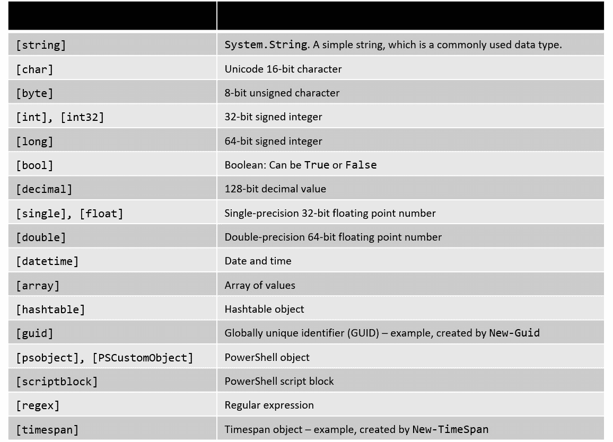
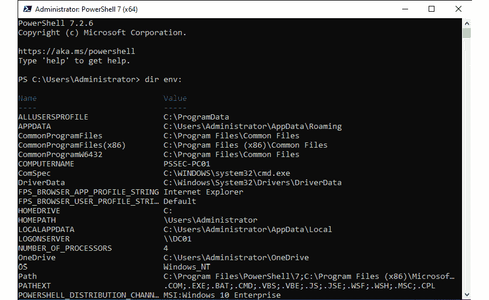
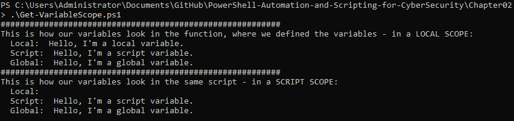
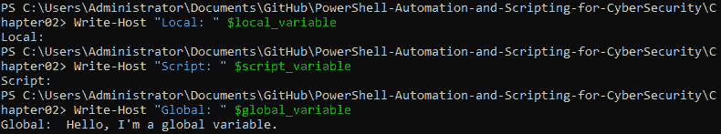
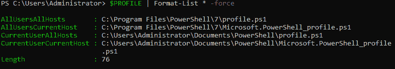
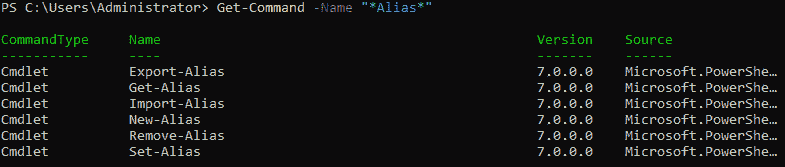
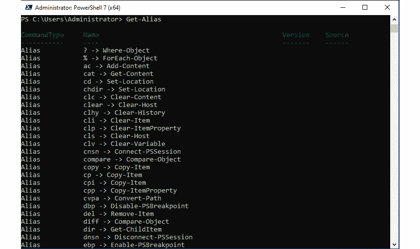
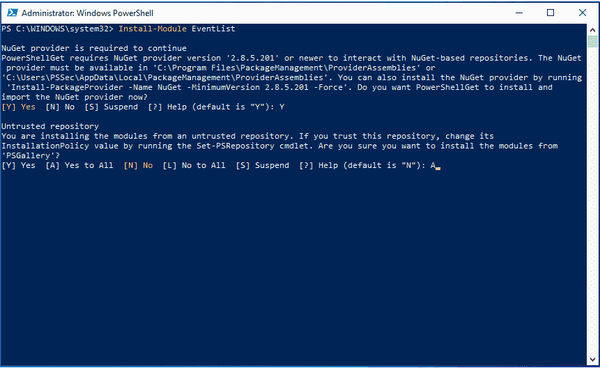
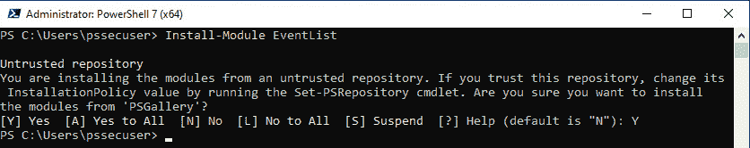
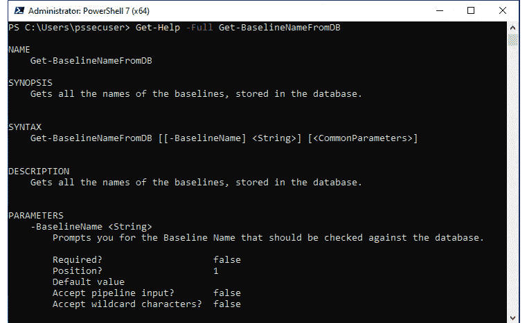

# 第二章：PowerShell 脚本基础

现在您已经学会了如何开始使用 PowerShell，接下来让我们深入了解 PowerShell 脚本基础，刷新一下我们的知识。

我们将从基础知识开始，学习如何使用变量、运算符和控制结构。然后，我们将深入探讨，将 Cmdlet、函数甚至模块的大致框架串联起来。

完成本章内容后，您应该能够创建自己的脚本，甚至知道如何创建自己的模块。

本章将涵盖以下主题：

+   变量

+   运算符

+   控制结构

+   命名约定

+   Cmdlet

+   函数

+   别名

+   模块

# 技术要求

本章所需内容：

+   PowerShell 7.3 及以上版本

+   Visual Studio Code

+   访问 `Chapter02` 的 GitHub 仓库：[`github.com/PacktPublishing/PowerShell-Automation-and-Scripting-for-Cybersecurity/tree/master/Chapter02`](https://github.com/PacktPublishing/PowerShell-Automation-and-Scripting-for-Cybersecurity/tree/master/Chapter02)

# 变量

**变量** 是开发者用来存储所谓 *值* 的存储位置。变量总是有名称，允许你独立于存储的值来调用它们。在 PowerShell 中，变量前面的 `$` 符号表示它是一个变量：

```
> $i = 1
> $string = "Hello World!"
> $this_is_a_variable = "test"
```

变量非常适合存储简单值、字符串以及命令的输出：

```
> Get-Date
Monday, November 2, 2020 6:43:59 PM
> $date = Get-Date
> Write-Host "Today is" $date
Today is 11/2/2020 6:44:40 PM
```

正如这些示例所示，我们不仅可以在变量中存储字符串和数字，还可以存储 Cmdlet 的输出，如`Get-Date`，并在代码中重复使用。

## 数据类型

与其他脚本语言或编程语言不同，您不必在定义变量时显式指定数据类型。定义变量时，系统会自动设置最适合的类型：

```
> $x = 4
> $string = "Hello World!"
> $date = Get-Date
```

您可以通过 `GetType()` 方法来查看使用了哪种数据类型：

```
> $x.GetType().Name
Int32
> $string.GetType().Name
String
> $date.GetType().Name
DateTime
```

在 PowerShell 中，数据类型是自动设置的。在以自动化方式定义变量时，有时会发生错误类型的设置。例如，可能会出现将整数定义为字符串的情况。如果发现冲突，`GetType()` 方法可以帮助您找出设置的实际数据类型。

### 数据类型概述

以下表格展示了各种变量数据类型及其描述：



表 2.1 – 变量数据类型

这些是您在使用 PowerShell 时最常遇到的数据类型。此列表并不完整，您可能还会遇到其他变量：使用 `GetType()` 可以帮助您识别变量数据类型。

在 PowerShell 中，所有数据类型都基于 .NET 类；要获取有关每个类的更多信息，可以参考官方 Microsoft 文档：

+   [`learn.microsoft.com/en-us/dotnet/api/system`](https://learn.microsoft.com/en-us/dotnet/api/system)

+   [`learn.microsoft.com/en-us/dotnet/api/system.management.automation`](https://learn.microsoft.com/en-us/dotnet/api/system.management.automation)

### 类型转换变量

通常不需要声明数据类型，因为 PowerShell 会自动处理。但有时可能需要更改数据类型——例如，如果导入的数字值列表被当作字符串处理而不是`int`：

```
> $number = "4"
> $number.GetType().Name
String
```

如果你正在处理声明了错误数据类型的值，你将看到令人头疼的错误信息（因为只接受其他输入），或者你的代码将无法按预期工作。

如果`$number`变量被声明为字符串，并且我们执行加法操作，那么将不会进行数学运算。相反，两者会作为字符串连接在一起：

```
> $number + 2
42
```

虽然 42 可能是生命、宇宙和一切问题的终极答案，但它并不是我们方程的预期答案：当我们计算*4 + 2*时，期望的结果是*6*，但由于*4*被视为字符串，*2*将被连接成字符串*42*，并作为结果显示：

```
> ($number + 2).GetType().Name
String
```

特别是在解析文件或输入时，变量可能没有正确设置。如果发生这种情况，结果会是错误信息或错误操作。当然，这种行为不仅限于整数和字符串：基本上每种数据类型都会发生类似问题。

如果发现设置了错误的数据类型，可以通过**类型转换**将数据类型转换为其他类型。

如果我们想要将`$number`作为普通整数处理，我们需要将变量类型转换为`[int]`：

```
> $int_number = [int]$number
> $int_number.GetType().Name
Int32
```

现在，`$int_number`可以作为普通整数处理，执行数学运算时也能按预期工作：

```
> $int_number + 2
6
```

你也可以通过使用 Unicode 字符串的十六进制值，并将其转换为`[char]`，在 PowerShell 中将 Unicode 十六进制字符串转换为字符：

```
> 0x263a
9786
> [char]0x263a
☺
```

大多数情况下，PowerShell 会自动设置正确的变量数据类型。类型转换可以帮助你控制如何处理数据，避免错误结果和错误信息。

## 自动变量

自动变量是由 PowerShell 创建并维护的内置变量。

这里只是一个初学者常用的自动变量小集合。你可能会在后续章节中找到其他自动变量：

+   `$?`：上一个命令的执行状态。如果上一个命令成功执行，则设置为`True`，否则设置为`False`。

+   `$_`：在处理管道对象时，`$_`可以用来访问当前对象（**$PSItem**）。它也可以用于在每个项目上执行操作的命令，如以下示例所示：

    ```
    Get-ChildItem -Path C:\ -Directory -Force -ErrorAction SilentlyContinue | ForEach-Object {
    ```

    ```
        Write-Host $_.FullName
    ```

    ```
    }
    ```

+   `$Error`：包含最近的错误，这些错误存储在一个数组中。最近的错误可以在`$Error[0]`中找到。

+   `$false`：表示传统的布尔值`False`。

+   `$LastExitCode`：包含运行的程序的最后退出代码。

+   `$null`：包含`null`或空值。它可以用来检查变量是否包含值，或者在脚本编写时设置一个未定义的值，因为`$null`仍然被当作一个具有值的对象来处理。

+   `$PSScriptRoot`：当前脚本运行所在目录的位置。它可以帮助你处理相对路径。

+   `$true`：包含`True`。你可以在命令和脚本中使用`$true`来表示`True`。

有关自动变量的完整列表，请查看官方文档：[`docs.microsoft.com/en-us/powershell/module/microsoft.powershell.core/about/about_automatic_variables`](https://docs.microsoft.com/en-us/powershell/module/microsoft.powershell.core/about/about_automatic_variables)。

## 环境变量

环境变量存储有关操作系统和系统经常使用的路径的信息。

要显示当前会话中的所有环境变量，可以使用`dir env:`，如下面的截图所示：



图 2.1 – 环境变量

你可以通过使用前缀`$env:`直接访问和重用这些变量：

```
> $env:PSModulePath
C:\Users\PSSec\Documents\WindowsPowerShell\Modules;C:\Program Files\WindowsPowerShell\Modules;C:\WINDOWS\system32\WindowsPowerShell\v1.0\Modules
```

要了解更多关于如何访问和处理环境变量的信息，请查看官方文档：[`docs.microsoft.com/en-us/powershell/module/microsoft.powershell.core/about/about_environment_variables`](https://docs.microsoft.com/en-us/powershell/module/microsoft.powershell.core/about/about_environment_variables)。

## 保留字和语言关键字

有些词是系统保留的，不应作为变量或函数名称使用，因为这会导致代码出现混淆和意外行为。

通过使用`Get-Help`，你可以获得保留字的列表和更多信息：

```
> Get-Help about_reserved_words
```

另请查看`about_Language_Keywords`帮助页面，以获得所有语言关键字的详细概述和解释：

```
> Get-Help about_Language_Keywords
```

下面是本书编写时所有可用的语言关键字概览：

```
Begin               Enum               Param
Break               Exit               Process
Catch               Filter             Return
Class               Finally            Static
Continue            For                Switch
Data                ForEach            Throw
Define              From               Trap
Do                  Function           Try
DynamicParam        Hidden             Until
Else                If                 Using
Elseif              In                 Var
End                 InlineScript       While
```

要了解更多关于某个语言关键字的信息，你可以使用`Get-Help`：

```
> Get-Help break
```

一些保留字（如`if`、`for`、`foreach`和**while**）有自己的帮助文章。要阅读它们，请在前面加上`about_`作为前缀：

```
> Get-Help about_If
```

如果你没有找到某个特定保留字的帮助页面（并非每个保留字都有自己的页面），你可以使用`Get-Help`查找包含你所寻找词语的帮助页面：

```
> Get-Help filter -Category:HelpFile
```

请记住这些保留字，避免将它们用作函数、变量或参数名称。使用保留字会导致代码出现故障。

## 变量作用域

在使用 PowerShell 变量时，你需要限制访问。如果你在函数中使用一个变量，你不希望它在命令行上默认可用——尤其是当你处理受保护的值时。PowerShell 变量作用域根据需要保护对变量的访问。

一般来说，变量仅在设置它们的上下文中可用，除非修改了作用域：

```
$script:ModuleRoot = $PSScriptRoot
# Sets the scope of the variable $ModuleRoot to script
```

### 作用域修饰符

使用作用域修饰符，你可以配置变量可用的作用域。以下是最常用的作用域修饰符概览：

+   `global`：将作用域设置为**全局**。此作用域在 PowerShell 启动时有效，或者在你创建一个新会话时有效。

例如，如果你在模块内将一个变量设置为**全局**，一旦加载该模块并运行设置为**全局**的部分，该变量将在会话中可用——即使你没有运行该模块的其他函数。

+   `local`：这是当前作用域。**局部**作用域可以是**全局**作用域、**脚本**作用域或任何其他作用域。

+   `script`：此作用域仅在设置此作用域的脚本内有效。如果你希望仅在某个模块内设置一个变量，并且该变量在函数调用后不应再可用，这种作用域非常有用。

为了演示变量作用域的工作原理，我准备了一个小脚本，`Get-VariableScope.ps1`，你可以在本书的 GitHub 仓库`Chapter02`中找到：[`github.com/PacktPublishing/PowerShell-Automation-and-Scripting-for-Cybersecurity/blob/master/Chapter02/Get-VariableScope.ps1`](https://github.com/PacktPublishing/PowerShell-Automation-and-Scripting-for-Cybersecurity/blob/master/Chapter02/Get-VariableScope.ps1)。

在脚本中，首先声明了`Set-Variables`函数。如果调用此函数，它会设置三个作用域的变量——**局部**、**脚本**和**全局**，然后输出每个变量。

然后，相同的脚本调用`Set-Variable`函数。调用该函数后，变量会写入输出：



图 2.2 – 调用具有局部、脚本和全局作用域的变量

虽然这些变量刚刚在**局部**作用域中设置，但在此上下文中调用时，所有配置的变量都可用（**局部作用域**）。

如果相同的脚本尝试访问在定义变量的函数外部配置的变量，仍然可以访问配置为**脚本**和**全局**作用域的变量。具有**局部**作用域的变量是无法访问的，因为这些变量是在**脚本作用域**中调用的。

运行`Get-VariableScope.ps1`脚本后，尝试在命令行中访问变量（**全局作用域**）：



图 2.3 – 在命令行中访问变量

你可以将作用域想象为*变量的容器*，因此，在这种情况下，我们只能访问**全局**作用域容器中的变量。具有**局部**和**脚本**作用域的变量在没有从其定义的脚本中调用时，无法从命令行访问。

在使用作用域时，建议*选择提供最小所需权限*的作用域，以便根据你的使用场景。这有助于防止在同一会话中多次运行脚本时意外破坏脚本。虽然从安全角度来看，使用**全局**作用域不一定会有问题，但最好在没有严格必要时避免使用它。

使用修改作用域的变量

当你使用**脚本**（script）和**全局**（global）作用域变量时，最好始终使用带修饰符的变量：`$script:script_variable** / **$global:global_variable`。

尽管可以在没有修饰符的情况下使用变量（`$script_variable** / `$global_variable**），但使用修饰符可以帮助你一目了然地查看变量的作用域是否发生变化，帮助你进行故障排除，并避免混淆。

作用域不仅限于变量；它们还可以用于限制函数、别名和 PowerShell 驱动器。当然，作用域还有许多其他应用场景，超出了本节的描述。

如果你有兴趣了解更多关于作用域（不仅是变量作用域）和高级用法的内容，请查看官方文档：[`docs.microsoft.com/en-us/powershell/module/microsoft.powershell.core/about/about_scopes`](https://docs.microsoft.com/en-us/powershell/module/microsoft.powershell.core/about/about_scopes)。

# 运算符

运算符不仅帮助你执行数学或逻辑运算，而且它们也是比较值或重定向值的好方法。

算术运算符

算术运算符可以用来计算数值。它们如下所示：

+   **加法**（**+**）：

    ```
    > $a = 3; $b = 5; $result = $a + $b
    ```

    ```
    > $result
    ```

    ```
    8
    ```

+   **减法**（**-**）：

    ```
    > $a = 3; $b = 5; $result = $b - $a
    ```

    ```
    > $result
    ```

    ```
    2
    ```

+   **乘法**（*****）：

    ```
    > $a = 3; $b = 5; $result = $a * $b
    ```

    ```
    > $result
    ```

    ```
    15
    ```

+   **除法**（**/**）：

    ```
    > $a = 12; $b = 4; $result = $a / $b
    ```

    ```
    > $result
    ```

    ```
    3
    ```

+   **取余**（**%**）：如果你以前没有使用过取余操作，`%`是检查一个数除以另一个数后是否有余数的好方法。取余操作返回余数：

    ```
    > 7%2
    ```

    ```
    1
    ```

    ```
    > 8%2
    ```

    ```
    0
    ```

    ```
    > 7%4
    ```

    ```
    3
    ```

当然，你也可以像平常一样组合不同的算术运算符：

```
> $a = 3; $b = 5; $c = 2
> $result = ($a + $b) * $c
> $result
16
```

在 PowerShell 中组合不同的算术运算符时，运算符优先级与常规数学运算一致。

分号（Semicolons）、（大括号）花括号（Curly Braces）和与号（Ampersands）

在这个例子中，我们使用分号在一行内执行多个命令：在 PowerShell 中，**分号**（**;**）在功能上等同于回车符。

还需要注意的是，保留字符如**花括号` **{}`、**圆括号` **()` 和 **与号` **&` 的使用可能对脚本执行产生重要影响。具体来说，**花括号**表示代码块，**圆括号**用于分组表达式或函数参数，而**与号**用于调用可执行文件或命令，就像调用一个 cmdlet 一样。

为了避免脚本执行中的问题，了解这些保留字符及其特定用法至关重要。

## 比较运算符

通常需要进行值的比较。在本节中，您将看到 PowerShell 中比较运算符的概述：

+   等于（**-eq**）：如果两个值相等，返回 `True`：

    ```
    > $a = 1; $b = 1; $a -eq $b
    ```

    ```
    True
    ```

    ```
    > $a = 1; $b = 2; $a -eq $b
    ```

    ```
    False
    ```

在 **数组上下文** 中，运算符的行为不同：当数组作为比较的左操作数时，PowerShell 会对数组中的每个元素执行比较操作。

在数组上下文中使用比较运算符时，操作将返回由运算符选择的元素：

```
> "A", "B", "C", "D" -lt "C"
A
B
```

当在数组上下文中使用时，`-eq` 运算符的行为与其典型的比较行为不同。它不会检查两个操作数是否相等，而是返回左操作数数组中所有等于右操作数的元素。如果没有找到匹配项，操作仍会返回 `False`：

```
> "A","B","C" -eq "A"
A
```

+   不等于（**-ne**）：如果两个值不相等，返回 `True`：

    ```
    > $a = 1; $b = 2; $a -ne $b
    ```

    ```
    True
    ```

    ```
    > $a = 1; $b = 1; $a -ne $b
    ```

    ```
    False
    ```

    ```
    > "Hello World!" -ne $null
    ```

    ```
    True
    ```

    ```
    > "A","B","C" -ne "A"
    ```

    ```
    B
    ```

    ```
    C
    ```

+   小于等于（**-le**）：如果第一个值小于或等于第二个值，返回 `True`：

    ```
    > $a = 1; $b = 2; $a -le $b
    ```

    ```
    True
    ```

    ```
    > $a = 2; $b = 2; $a -le $b
    ```

    ```
    True
    ```

    ```
    > $a = 3; $b = 2; $a -le $b
    ```

    ```
    False
    ```

    ```
    > "A","B","C" -le "A"
    ```

    ```
    A
    ```

+   大于等于（**-ge**）：如果第一个值大于或等于第二个值，返回 `True`：

    ```
    > $a = 1; $b = 2; $a -ge $b
    ```

    ```
    False
    ```

    ```
    > $a = 2; $b = 2; $a -ge $b
    ```

    ```
    True
    ```

    ```
    > $a = 3; $b = 2; $a -ge $b
    ```

    ```
    True
    ```

    ```
    > "A","B","C" -ge "A"
    ```

    ```
    A
    ```

    ```
    B
    ```

    ```
    C
    ```

+   小于（**-lt**）：如果第一个值小于第二个值，返回 `True`：

    ```
    > $a = 1; $b = 2; $a -lt $b
    ```

    ```
    True
    ```

    ```
    > $a = 2; $b = 2; $a -lt $b
    ```

    ```
    False
    ```

    ```
    > $a = 3; $b = 2; $a -lt $b
    ```

    ```
    False
    ```

    ```
    > "A","B","C" -lt "A" # results in no output
    ```

+   大于（**-gt**）：如果第一个值大于第二个值，返回 `True`：

    ```
    > $a = 1; $b = 2; $a -gt $b
    ```

    ```
    False
    ```

    ```
    > $a = 2; $b = 2; $a -gt $b
    ```

    ```
    False
    ```

    ```
    > $a = 3; $b = 2; $a -gt $b
    ```

    ```
    True
    ```

    ```
    > "A","B","C" -gt "A"
    ```

    ```
    B
    ```

    ```
    C
    ```

+   `-like`：可用于检查值是否与标量情况下的通配符表达式匹配。如果在数组上下文中使用，`-like` 运算符仅返回与指定通配符表达式匹配的元素：

    ```
    > "PowerShell" -like "*owers*"
    ```

    ```
    True
    ```

    ```
    > "PowerShell", "Dog", "Cat", "Guinea Pig" -like "*owers*"
    ```

    ```
    PowerShell
    ```

需要注意的是，运算符的数组版本不会返回一个布尔值，表示数组中的任何元素是否与表达式匹配，这与标量版本的行为不同。

+   `-notlike`：可用于检查值是否与标量情况下的通配符表达式不匹配。如果在数组上下文中使用，`-notlike` 运算符仅返回不匹配指定通配符表达式的元素：

    ```
    > "PowerShell" -notlike "*owers*"
    ```

    ```
    False
    ```

    ```
    > "PowerShell", "Dog", "Cat", "Guinea Pig" -notlike "*owers*"
    ```

    ```
    Dog
    ```

    ```
    Cat
    ```

    ```
    Guinea Pig
    ```

+   `-match`：可用于检查值是否与正则表达式匹配：

    ```
    > "PowerShell scripting and automation for Cybersecurity" -match "shell\s*(\d)"
    ```

    ```
    False
    ```

    ```
    > "Cybersecurity scripting in PowerShell 7.3" -match "shell\s*(\d)"
    ```

    ```
    True
    ```

+   `-notmatch`：可用于检查值是否与正则表达式不匹配：

    ```
    > "Cybersecurity scripting in PowerShell 7.3" -notmatch "^Cyb"
    ```

    ```
    False
    ```

    ```
    > "PowerShell scripting and automation for Cybersecurity" -notmatch "^Cyb"
    ```

    ```
    True
    ```

另请参考官方 PowerShell 文档，了解更多比较运算符的内容：[`docs.microsoft.com/en-us/powershell/module/microsoft.powershell.core/about/about_comparison_operators`](https://docs.microsoft.com/en-us/powershell/module/microsoft.powershell.core/about/about_comparison_operators)。

## 赋值运算符

在处理变量时，了解赋值运算符非常重要：

+   `=`：赋值一个值：

    ```
    > $a = 1; $a
    ```

    ```
    1
    ```

+   `+=`：通过运算符后定义的数值增加原始变量的值，并将结果存储在该变量中：

    ```
    > $a = 1; $a += 2; $a
    ```

    ```
    3
    ```

+   `-=`：通过运算符后定义的数值减少原始变量的值，并将结果存储在该变量中：

    ```
    > $a
    ```

    ```
    3
    ```

    ```
    > $a -= 1; $a
    ```

    ```
    2
    ```

+   `*=`：将值乘以运算符后定义的数值，并将结果存储在初始变量中：

    ```
    > $a
    ```

    ```
    2
    ```

    ```
    > $a *= 3; $a
    ```

    ```
    6
    ```

+   `/=`：将值除以运算符后定义的数值，并将结果存储在初始变量中：

    ```
    > $a
    ```

    ```
    6
    ```

    ```
    > $a /= 2; $a
    ```

    ```
    3
    ```

+   `%=`：对变量进行模运算，使用运算符后面的数值，并将结果存储在初始变量中：

    ```
    > $a
    ```

    ```
    3
    ```

    ```
    > $a %= 2; $a
    ```

    ```
    1
    ```

+   `++`：将变量加上`1`：

    ```
    > $a= 1; $a++; $a
    ```

    ```
    2
    ```

+   `--`：将变量减去`1`：

    ```
    > $a = 10; $a--; $a
    ```

    ```
    9
    ```

请参考官方文档查看更多关于如何使用赋值运算符的示例：[`docs.microsoft.com/en-us/powershell/module/microsoft.powershell.core/about/about_assignment_operators`](https://docs.microsoft.com/en-us/powershell/module/microsoft.powershell.core/about/about_assignment_operators)。

## 逻辑运算符

如果你处理多个语句，你将需要逻辑运算符来添加、比较或排除。在本节中，你将看到 PowerShell 中常见逻辑运算符的概览：

+   `-and`：可用于组合条件。只有当两个条件都满足时，定义的动作才会被触发：

    ```
    > $a = 1; $b = 2
    ```

    ```
    > if (($a -eq 1) -and ($b -eq 2)) {Write-Host "Condition is true!"}
    ```

    ```
    Condition is true!
    ```

+   `-or`：如果满足其中一个定义的条件，触发相应的动作：

    ```
    > $a = 2; $b = 2
    ```

    ```
    > if (($a -eq 1) -or ($b -eq 2)) {Write-Host "Condition is true!"}
    ```

    ```
    Condition is true!
    ```

+   `-not` 或 `!`：可以用来否定一个条件。以下示例测试通过`$path`变量指定的文件夹是否可用。如果文件夹不存在，将会创建它：

    ```
    $path = $env:TEMP + "\TestDirectory"
    ```

    ```
    if( -not (Test-Path -Path $path )) {
    ```

    ```
        New-Item -ItemType directory -Path $path
    ```

    ```
    }
    ```

    ```
    if (!(Test-Path -Path $path)) {
    ```

    ```
        New-Item -ItemType directory -Path $path
    ```

    ```
    }
    ```

+   `-xor`：逻辑排他性`-or`。如果*只有一个*语句为`True`，则为`True`（但如果两个都为`True`，则返回**False**）：

    ```
    > $a = 1; $b = 2; ($a -eq 1) -xor ($b -eq 1)
    ```

    ```
    True
    ```

    ```
    > ($a -eq 1) -xor ($b -eq 2)
    ```

    ```
    False
    ```

    ```
    > ($a -eq 2) -xor ($b -eq 1)
    ```

    ```
    False
    ```

现在你已经学会了如何在 PowerShell 中使用运算符，让我们在下一节中了解一下控制结构。

请参考`about_operators`文档，了解更多关于 PowerShell 运算符的知识：[`docs.microsoft.com/en-us/powershell/module/microsoft.powershell.core/about/about_operators`](https://docs.microsoft.com/en-us/powershell/module/microsoft.powershell.core/about/about_operators)。

# 控制结构

控制结构是一种程序逻辑，用于评估条件和变量，并决定在特定条件满足时执行哪些定义的动作。

使用我们在上一节中学到的运算符来定义条件，这些条件将通过本节介绍的控制结构进行评估。

## 条件

如果你想根据某个条件选择执行的动作，可以使用以下选择控制结构之一：`if/elseif/else`结构或`switch`语句。

### If/elseif/else

`if`、`elseif`和`else`可以用来检查某个条件是否为`True`，并在条件满足时执行相应的动作：

```
if (<condition>)
{
    <action>
}
elseif (<condition 2>)
{
    <action 2>
}
...
else
{
    <action 3>
}
```

你可以使用`if`语句检查条件是否为`True`：

```
> if (1+2 -eq 3) { Write-Host "Good job!" }
 Good job!
> if (1+2 -eq 5) { Write-Host "Something is terribly wrong!" }
# returns no Output
```

你也可以通过使用`elseif`检查多个条件是否为`True`，第一个满足条件的动作将会被执行：

```
$color = "green"
if ($color -eq "blue") {
     Write-Host "The color is blue!"
}
elseif ($color -eq "green"){
     Write-Host "The color is green!"
}
# returns: The color is green!
```

在这个例子中，控制结构检查是否满足指定的条件之一（即`$color -eq "blue"`或**$color -eq "green"**）。如果`$color`是`red`，则不会执行任何动作。

但由于`$color`的值是`green`，所以`elseif`条件为`True`，并且`The color is green!`字符串将被输出到控制台。

如果你想指定在没有满足任何指定条件时触发的动作，可以使用`else`。如果没有满足`if`或`elseif`的条件，将执行`else`块中指定的动作：

```
$color = "red"
if ($color -eq "blue") {
     Write-Host "The color is blue!"
}
elseif ($color -eq "green"){
     Write-Host "The color is green!"
}
else {
     Write-Host "That is also a very beautiful color!"
}
# returns: That is also a very beautiful color!
```

在这个例子中，我们检查`$color`是否是`blue`或`green`。但是由于`$color`是`"red"`，没有任何已定义的条件为`True`，因此`else`块中的代码将被执行，并输出`That is also a very beautiful color!`。

### Switch

有时候，你可能需要检查一个变量是否与一个很长的值列表匹配。

为了解决这个问题，你当然可以创建一个很长且复杂的`if`、`elseif`、…、`elseif`和`else`语句列表。

但是，相反，你可以使用更优雅的`switch`语句，将一个值与预定义的多个值进行比对，并根据结果作出相应反应：

```
switch (<value to test>) {
     <condition 1> {<action 1>}
     <condition 2> {<action 2>}
     <condition 3> {<action 3>}
     ...
     default {}
}
```

这是一个示例：

```
$color = Read-Host "What is your favorite color?"
switch ($color) {
     "blue"   { Write-Host "I'm BLUE, Da ba dee da ba di..." }
     "yellow" { Write-Host "YELLOW is the color of my true love's hair." }
     "red"    { Write-Host "Roxanne, you don't have to put on the RED light..." }
     "purple" { Write-Host "PURPLE rain, purple rain!" }
     "black" { Write-Host "Lady in BLACK... she came to me one morning, one lonely Sunday morning..." }
     default  { Write-Host "The color is not in this list." }
}
```

在这个例子中，系统会提示用户输入一个值：`What is your** **favorite color?`。

根据用户输入的内容，会显示不同的输出：如果输入`purple`，将显示一行来自著名歌手 Prince 的歌曲*Purple Rain*。如果输入`red`，将引用 The Police 的歌曲*Roxanne*中的一行歌词。

但是，如果输入的是`green`，将显示`default`输出，因为没有为`green`定义选项，系统会显示消息`The color is not in this list`。

除了使用`switch`语句来基于变量或表达式的值评估简单的条件外，PowerShell 还支持**更高级的模式**。这些模式允许你使用正则表达式、处理文件内容等。

例如，你可以使用`-Regex`参数，通过正则表达式来匹配输入值，像这样：

```
switch -Regex ($userInput) {
    "^[A-Z]" { "User input starts with a letter." }
    "^[0-9]" { "User input starts with a number." }
    default { "User input doesn't start with a letter or number." }
}
```

如果`$userInput`定义为`"Hello World!"`，那么输出将是`"User input starts with a letter."`。如果`$userInput`以数字开头（例如，**"1337"**），输出将是`"User input starts with a number."`。如果`$userInput`以其他字符开头（例如，**"!"**），那么将满足`default`条件，并输出`"User input doesn't start with a letter or number."`。

你还可以使用`-File`参数，通过`switch`语句处理文件内容。`-Wildcard`参数允许你在`switch`语句中使用通配符逻辑：

```
$path = $env:TEMP + "\example.txt"
switch -Wildcard -File $path {
    "*Error*" { Write-Host "Error was found!: $_" }
}
```

在这个例子中，我们使用 `switch` 语句处理名为 `"example.txt"` 的文件内容。我们正在寻找文件中的 `"*Error*"` 模式，并根据是否找到该模式来执行操作。如果指定的文件包含该模式，则 `"Error was found!:"` 将被写入输出，然后是包含错误的行。需要注意的是，通配符模式是逐行处理的，而不是针对整个文件，因此对于文件中每一行包含 `"*****Error*"` 模式的行，都会写入一行 `"Error was found!:"`。

## 循环与迭代

如果你想反复执行一个操作直到满足某个条件，你可以使用循环。只要指定的条件为 `True`，循环将继续执行，除非它被如 `break` 之类的跳出语句终止。根据使用的循环结构，循环可能至少执行一次，或者如果条件最初为 `False`，则可能根本不执行。

在本节中，你将找到有关如何使用循环的概述。

### ForEach-Object

`ForEach-Object` 接受一个列表或数组的项，并允许你对每一项执行操作。`ForEach-Object` 最适合在你使用管道将对象传递给 `ForEach-Object` 时使用。

作为示例，如果你想处理一个文件夹中的所有文件，你可以使用 `Foreach-Object`。`$_` 包含每次迭代中每一项的值：

```
> $path = $env:TEMP + "\baselines"
> Get-ChildItem -Path $path | ForEach-Object {Write-Host $_}
Office365-ProPlus-Sept2019-FINAL.zip
Windows 10 Version 1507 Security Baseline.zip
Windows 10 Version 1607 and Windows Server 2016 Security Baseline.zip
Windows 10 Version 1803 Security Baseline.zip
Windows 10 Version 1809 and Windows Server 2019 Security Baseline.zip
Windows 10 Version 1903 and Windows Server Version 1903 Security Baseline - Sept2019Update.zip
Windows 10 Version 1909 and Windows Server Version 1909 Security Baseline.zip
Windows 10 Version 2004 and Windows Server Version 2004 Security Baseline.zip
Windows Server 2012 R2 Security Baseline.zip
```

如果你想在处理管道中的每个项之前或所有项处理之后执行特定操作，可以使用 `-Begin` 和 `-End` 高级参数与 `ForEach-Object` cmdlet 一起使用：[`docs.microsoft.com/en-us/powershell/module/microsoft.powershell.core/foreach-object`](https://docs.microsoft.com/en-us/powershell/module/microsoft.powershell.core/foreach-object)。

此外，你可以使用 `-Process` 参数指定针对管道中每个项运行的脚本块。

### Foreach

要在 PowerShell 中遍历一个项的集合，你可以使用 `Foreach-Object` *cmdlet*、`foreach` *语句* 或 `foreach` *方法*。`Foreach-Object` *cmdlet* 接受管道对象，使其成为处理面向对象数据的有用工具。`foreach` *方法* 和 `foreach` *语句* 与 `Foreach-Object` 非常相似，但它们不接受管道对象。如果你像使用 `Foreach-Object` 一样使用它们，你会收到错误消息。

`foreach` *语句* 会在处理之前将所有项加载到一个集合中，这使得它比 `ForEach-Object` 更快，但会消耗更多的内存。

以下示例演示了如何使用 `foreach` *语句*：

```
$path = $env:TEMP + "\baselines"
$items = Get-ChildItem -Path $path
foreach ($file in $items) {
     Write-Host $file
}
```

在此示例中，`$path`路径的检查与我们之前的示例相似。但在这种情况下，它使用`foreach` *语句*遍历`$items`数组中的每个项，在每次迭代时将当前项分配给`$file`变量。`$file`变量由脚本作者定义——当然，也可以在此处添加并处理任何其他变量名。对于每个项，它使用`Write-Host` cmdlet 将`$file`的值输出到控制台。

你可以使用`.foreach({})` *方法*遍历一个项目集合。以下是如何使用它的示例：

```
$path = $env:TEMP + "\baselines"
$items = Get-ChildItem -Path $path
$items.foreach({
    Write-Host "Current item: $_"
})
```

在此示例中，检查`$path`；对于该文件夹中的每个文件，文件名将写入命令行。使用`.foreach**(`{}**) *方法*遍历`$items`集合中的每个项，并向控制台写入包含项名的消息。`$_`变量用于引用当前正在遍历的项。因此，对于`$items`集合中的每个项，脚本将输出类似于**"当前项：文件名"**的消息。

### while

`while`会执行某些操作（**<actions>**），只要定义的*条件*满足：

```
while ( <condition> ){ <actions> }
```

在此示例中，读取用户输入，只要用户未输入`quit`，`while`循环仍会继续执行：

```
while(($input = Read-Host -Prompt "Choose a command (type in 'help' for an overview)") -ne "quit"){
    switch ($input) {
        "hello" {Write-Host "Hello World!"}
        "color" {Write-Host "What's your favorite color?"}
        "help" {Write-Host "Options: 'hello', 'color', 'help' 'quit'"}
    }
}
```

在此示例中，如果用户输入`hello`、`color`或`help`，将显示不同的输出选项，但程序仍会继续，因为`while`语句的条件未满足。

一旦用户输入`quit`，程序将终止，因为条件已满足。

### for

这定义了初始化语句、一个条件，并在定义的条件不再满足时循环：

```
for (<initializing statement>; <condition>; <repeat>)
{
    <actions>
}
```

如果需要迭代值，`for`是一个很好的解决方案：

```
> for ($i=1; $i -le 5; $i++) {Write-Host "i: $i"}
i: 1
i: 2
i: 3
i: 4
i: 5
```

在此示例中，`$i=1`是起始条件，每次迭代时，`$i`增加`1`，使用`$i++`语句。只要`$i`小于或等于`5`——即`($i -le 5)`——循环就会继续，并将`$i`写入输出。

### do-until/do-while

与其他循环相比，`do-until`或`do-while`会先运行定义的命令，然后检查条件是否仍然满足或不满足：

```
do{
     <action>
}
<while/until><condition>
```

尽管`do-until`和`do-while`具有相同的语法，它们在处理条件的方式上有所不同。

`do-while`只要条件为`True`，就会继续运行，直到条件不再满足为止。`do-until`仅在条件*不*满足时运行：当条件满足时，它会结束。

### break

`break`可用于退出循环（例如，`for**/**foreach**/**foreach-object`/…）：

```
> for ($i=1; $i -le 10; $i++) {
    Write-Host "i: $i"
    if ($i -eq 3) {break}
}
i: 1
i: 2
i: 3
```

查阅官方文档以了解更多关于`break`的高级用法：[`docs.microsoft.com/en-us/powershell/module/microsoft.powershell.core/about/about_break`](https://docs.microsoft.com/en-us/powershell/module/microsoft.powershell.core/about/about_break)。

### continue

`continue` 语句用于跳过当前循环的迭代并进入下一个迭代。它不会影响循环的条件，循环条件将在下一次迭代开始时重新评估：

```
> for ($i=1; $i -le 10; $i++) {
    if (($i % 2) -ne 0) {continue}
    Write-Host "i: $i"
}
i: 2
i: 4
i: 6
i: 8
i: 10
```

在这个例子中，我们使用了取模（**%**）运算符来计算除以 `2` 是否有余数。如果 `$i % 2` 的余数非零，则条件返回 `True`，并触发 `continue`。

这种行为导致 `$i` 只有在没有返回余数时才会被写入控制台。

你知道吗？

上面的例子演示了每当返回的余数 *不是 0* 时，*当前迭代会被跳过*。这段代码也可以通过以下方式简化：

`for ($i=1; $i -le 10; $****i++) {`

`if ($i % 2){** **continue }`

**Write-Host “****i: $i”**

`}`

你不仅可以使用控制结构来解决单一问题，还可以通过结合多个控制结构来解决复杂逻辑问题。

阅读完这一部分后，你应该对现有的控制结构有基本的了解，并知道如何使用它们。

# 命名规范

Cmdlet 和函数都遵循 *动词-名词* 的命名规则，例如 `Get-Help` 或 `Stop-Process`。因此，如果你编写自己的函数或 cmdlet，请确保遵循命名指南和建议。

微软发布了一份批准的动词列表。尽管使用批准的动词在技术上并不是强制要求，但强烈建议这样做，以便遵循 PowerShell 的最佳实践，并避免与自动变量和保留字发生冲突。此外，在将 PowerShell 模块发布到 PowerShell Gallery 时，必须使用批准的动词，否则如果使用了未批准的动词，将会触发警告消息。以下是批准动词的链接：

[`docs.microsoft.com/en-us/powershell/scripting/developer/cmdlet/approved-verbs-for-windows-powershell-commands`](https://docs.microsoft.com/en-us/powershell/scripting/developer/cmdlet/approved-verbs-for-windows-powershell-commands)

查找批准的动词

如果你正在编写代码，并且希望快速检查有哪些批准的动词，可以利用 `Get-Verb` 命令。

如果你想对可用动词列表进行排序，可以将输出传递给 `Sort-Object`。默认情况下，动词按传统的使用类别进行排序，如 `Common`、`Data` 和 `Lifecycle`。然而，你也可以通过指定 `Name` 属性并使用 `Sort-Object` 命令按字母顺序对它们进行排序。使用以下命令按 `Verb` 的名称对 `Get-Verb` 的输出进行排序：

```
Get-Verb | Sort-Object Verb
```

你还可以使用通配符来预先筛选列表：

```
> Get-Verb re*
Verb     Group
----     -----
Redo     Common
Remove   Common
Rename   Common
Reset    Common
Resize   Common
Restore  Data
Register Lifecycle
Request  Lifecycle
Restart  Lifecycle
Resume   Lifecycle
Repair   Diagnostic
Resolve  Diagnostic
Read     Communications
Receive  Communications
Revoke   Security
```

如果你只想从某一组（在此案例中是 **Security**）中获取所有批准的动词，可以使用 `Where-Object` 来过滤 `Group`：

```
> Get-Verb | Where-Object Group -eq Security
Verb      Group
----      -----
Block     Security
Grant     Security
Protect   Security
Revoke    Security
Unblock   Security
Unprotect Security
```

尽管 PowerShell 不强制执行命名约定，但仍应遵守这些约定。微软也强烈鼓励在编写命令时遵循这些指南，以确保用户获得一致的用户体验。

在编写自己的函数和命令时，请同时参考开发指南：[开发指南](https://docs.microsoft.com/en-us/powershell/scripting/developer/cmdlet/strongly-encouraged-development-guidelines)。

# PowerShell 配置文件

PowerShell 配置文件是配置文件，用于个性化您的 PowerShell 环境。这些配置文件可用于自定义 PowerShell 会话的行为和环境。它们是会在 PowerShell 会话启动时执行的脚本，允许用户设置变量、定义函数、创建别名等。

在适当的 PowerShell 配置文件中定义的任何变量、函数或别名将在每次启动 PowerShell 会话时加载。这意味着您可以在所有会话中保持一致且个性化的 PowerShell 环境。

配置文件有几种不同的类型，PowerShell 可以处理多个配置文件。PowerShell 配置文件作为纯文本文件保存在您的系统中，并且有多种类型的配置文件可用：

+   **所有用户，所有主机**(**$profile.AllUsersAllHosts**)：该配置文件适用于所有用户的所有 PowerShell 主机。

+   **所有用户，当前主机**(**$profile.AllUsersCurrentHost**)：该配置文件适用于当前 PowerShell 主机的所有用户。

+   **当前用户，所有主机**(**$profile.CurrentUserAllHosts**)：该配置文件适用于当前用户的所有 PowerShell 主机。

+   **当前用户，当前主机**(**$profile.CurrentUserCurrentHost**)：该配置文件仅适用于当前用户和当前 PowerShell 主机。

**PowerShell 主机**是托管 PowerShell 引擎的应用程序。PowerShell 主机的示例包括 Windows PowerShell 控制台、PowerShell **集成脚本环境**(**ISE**)以及 Visual Studio Code 中的 PowerShell 终端。

您的 PowerShell 配置文件的位置取决于您的系统和配置，但您可以通过在 PowerShell 中运行以下命令轻松找到它们存储的位置：



图 2.4 – 查找本地 PowerShell 配置文件的位置

需要注意的是，还有更多的配置文件路径可用，包括系统使用的路径，而不仅仅是个别用户使用的路径（这些路径会包含在`AllUsers`配置文件中）：

+   适用于本地 Shell 和所有用户：`%windir%\system32\WindowsPowerShell\v1.0\profile.ps1`

+   适用于所有 Shell 和所有用户：`%windir%\system32\WindowsPowerShell\v1.0\Microsoft.PowerShell_profile.ps1`

+   适用于所有本地 ISE Shell 和所有用户：`%windir%\system32\WindowsPowerShell\v1.0\Microsoft.PowerShellISE_profile.ps1`

当使用 PowerShell ISE 时，此配置文件会被加载，并且可以通过在 ISE 中运行 `$profile | fl * -force` 命令来查看

+   适用于本地主机上的当前用户 ISE shell：`%UserProfile%\Documents\WindowsPowerShell\Microsoft.PowerShellISE_profile.ps1`

例如，在 Windows PowerShell 中，有适用于 `AllUsers` 和 `AllHosts` 的配置文件，这些配置文件适用于系统中的所有用户和所有 PowerShell 主机。在 PowerShell Core 中，也有 `AllUsers` 和 `AllHosts` 的配置文件，但它们默认不会加载 `system32` 目录中的 Windows PowerShell 配置文件。还需要注意的是，虽然 PowerShell Core 支持加载 Windows PowerShell 配置文件，但反之则不行。

要访问特定配置文件的文件路径，例如 `CurrentUserCurrentHost` 的配置文件，可以使用在 `$profile.CurrentUserCurrentHost` 中定义的变量：

```
> $profile.CurrentUserCurrentHost
C:\Users\pssecuser\Documents\PowerShell\Microsoft.PowerShell_profile.ps1
```

使用以下代码片段检查文件是否已经存在；如果文件尚未存在，则会创建该文件：

```
if ( !( Test-Path $profile.CurrentUserCurrentHost ) ) {
    New-Item -ItemType File -Path $profile.CurrentUserCurrentHost
}
```

最后，将命令、函数或别名添加到用户配置文件中：

```
> Add-Content -Path $profile -Value “New-Alias -Name Get-Ip -Value ‘ipconfig.exe’”
```

除了自定义 PowerShell 环境之外，配置文件还是 PowerShell 安全性的关键方面。通过修改配置文件，您可以设置策略和限制，执行安全最佳实践，例如阻止执行未签名的脚本或设置执行策略。但同时，攻击者也可以利用 PowerShell 配置文件来达成他们的目的——例如，建立持久性。

# 理解 PowerShell 中的 PSDrives

PowerShell 包含一个名为 **PowerShell 驱动器**（**PSDrives**）的功能。PowerShell 中的 PSDrives 类似于 Windows 中的文件系统驱动器，但不同的是，您使用 PSDrives 访问各种数据存储，而不是访问文件和文件夹。这些数据存储可以包括目录、注册表键以及其他数据源，可以通过一致且熟悉的接口访问。

PSDrives 由 `PSProviders` 提供支持，PSProviders 是提供对数据存储访问的底层组件。PSProviders 类似于 Windows 中的驱动程序，它们允许访问不同的硬件设备。在 PowerShell 中，PSProviders 允许您以统一的方式访问不同的数据存储，使用相同的 cmdlet 和语法。

例如，`Env:\` PSDrive 是一个内置的 PowerShell 驱动器，提供访问环境变量的功能。要检索所有名称中包含 `path` 字符串的环境变量，可以使用 `Env:\` PSDrive 和 `Get-ChildItem` cmdlet：

```
> Get-ChildItem Env:\*path*
```

要访问 PSDrive，您需要在路径中使用特殊的前缀。例如，要访问文件系统驱动器，使用前缀 `C:`，要访问注册表驱动器，使用前缀 `HKLM:`。对于 `Env:\` PSDrive，前缀是 `Env:`，它允许您像访问文件或文件夹一样访问环境变量。

PowerShell 中有几个内置的 PSDrives，包括以下几种：

+   `Alias`：提供对 PowerShell 别名的访问

+   `Environment`：提供对环境变量的访问

+   `Function`：提供对 PowerShell 函数的访问

+   `Variable`：提供对 PowerShell 变量的访问

+   `Cert`：提供对 Windows 证书存储中的证书的访问

+   `Cert:\CurrentUser`：提供对当前用户证书存储中的证书的访问

+   `Cert:\LocalMachine`：提供对本地计算机证书存储中的证书的访问

+   `WSMan`：提供对 **Windows 远程管理**(**WinRM**) 配置数据的访问

+   `C:` 和 `D:`（*以及其他驱动器字母*）：用于访问文件系统，就像在 Windows 资源管理器中一样

+   `HKCU`：提供对 `HKEY_CURRENT_USER` 注册表树的访问

+   `HKLM`：提供对 `HKEY_LOCAL_MACHINE` 注册表树的访问

# 使代码可重用

在本节中，我们将探讨如何在 PowerShell 中使代码可重用的概念。可重用性是编程中的一个重要方面，它允许你一次创建一个函数、cmdlet 或模块，并可以多次使用，而无需一遍又一遍地重写相同的代码。通过这种方式，你可以节省时间和精力，长期来看非常有利。

我们将从讨论 cmdlet 开始，接着是函数和别名，最后，我们将探索 PowerShell 模块，它们是包含 PowerShell 命令和函数的集合，可以轻松共享并安装到其他系统中，是打包和分发可重用代码的一个好方法。

## Cmdlet

cmdlet（发音为 *commandlet*）是一种 PowerShell 命令，执行特定任务，并且可以用 C# 或其他 .NET 语言编写。这包括高级函数，这些函数也被视为 cmdlet，但比普通函数具有更多的高级功能。

`Get-Command` 可以帮助你区分 cmdlet 和函数。此外，你还可以查看版本和提供程序：

```
> Get-Command new-item
CommandType   Name      Version    Source
-----------   ----      -------    ------
Cmdlet        New-Item  3.1.0.0    Microsoft.PowerShell.Management
```

要查看当前安装在你使用的机器上的所有 cmdlet，你可以利用 `Get-Command` 配合 `CommandType` 参数：

```
Get-Command -CommandType Cmdlet
```

如果你想更深入地了解 cmdlet，我建议查看官方 PowerShell 文档。微软发布了很多建议、推荐和指南：

+   [`docs.microsoft.com/en-us/powershell/scripting/developer/cmdlet/cmdlet-overview`](https://docs.microsoft.com/en-us/powershell/scripting/developer/cmdlet/cmdlet-overview)

+   [`docs.microsoft.com/en-us/powershell/scripting/developer/cmdlet/windows-powershell-cmdlet-concepts`](https://docs.microsoft.com/en-us/powershell/scripting/developer/cmdlet/windows-powershell-cmdlet-concepts)

## 函数

函数是按照特定逻辑执行的一组 PowerShell 命令。

与其他编程语言和脚本语言一样，如果你一遍又一遍地输入相同的命令，或者你发现自己在不同场景下修改相同的一行命令，那么绝对是时候创建一个函数了。

选择名称时，请确保遵循动词-名词命名约定，并且只使用批准的动词。关于批准动词和命名约定的更多内容，请参考本章之前的*命名约定*部分。

这个使用伪代码的骨架函数应该展示函数的基本结构：

```
function Verb-Noun {
<#
        <Optional help text>
#>
param (
    [data_type]$Parameter
)
<...Code: Function Logic...>
}
```

一旦函数加载到会话中，就需要调用它才能执行：

```
Verb-Noun -Parameter "test"
```

你可以在 GitHub 上找到一个演示函数及其帮助文档，该函数简单地输出`Hello World!`并接受一个参数来生成额外的输出，以及调用它的方式：

[`github.com/PacktPublishing/PowerShell-Automation-and-Scripting-for-Cybersecurity/blob/master/Chapter02/Write-HelloWorld.ps1`](https://github.com/PacktPublishing/PowerShell-Automation-and-Scripting-for-Cybersecurity/blob/master/Chapter02/Write-HelloWorld.ps1)

### 参数

函数不一定需要支持参数，但如果你想在函数内处理输入，则需要参数：

```
function Invoke-Greeting {
    param (
        [string]$Name
    )
    Write-Output "Hello $Name!"
}
```

在这个例子中，`Invoke-Greeting`函数提供了传递`$Name`参数的可能性，同时指定数据类型为`[string]`，这将尝试将任何输入转换为*string*，从而为参数输入提供灵活性。你也可以根据用例使用其他数据类型（例如，`int`、`boolean`等）。

如果指定了参数，提供的值将存储在`$Name`变量中，并可以在函数内使用：

```
> Invoke-Greeting -Name "Miriam"
Hello Miriam!
```

如果未指定参数，它将被替换为`$null`（即`""`/*无*）：

```
> Invoke-Greeting
Hello !
```

在这种情况下，`$Name`参数不是必需的，因此在运行函数时不必指定它。

添加参数使你能够覆盖许多复杂的用例场景。你可能已经见过一些只允许某种类型输入或要求特定参数的函数——这些函数在用户确认之前不会执行，并且提供了以详细模式执行它们的可能性。

接下来，让我们探索如何在关于`cmdletbinding`、`SupportsShouldProcess`、输入验证和必需参数的章节中配置这些行为。

#### cmdletbinding

`cmdletbinding`是 PowerShell 中的一个特性，允许你为函数和 cmdlet 添加公共参数（例如`-Verbose`、`-Debug`或**-ErrorAction**），而无需自己定义它们。这可以使你的代码与其他 PowerShell 命令保持一致，并且更易于用户使用。

使用`cmdletbinding`的一种方式是将参数声明为必需、位置参数或参数集，这可以自动将你的函数转变为带有额外公共参数的 cmdlet。例如，如果你想让`-Name`参数在你的函数中是必需的，可以在参数定义前添加`[Parameter(Mandatory)]`，如下所示：

```
function Invoke-Greeting {
    [cmdletbinding()]
    param (
        [Parameter(Mandatory)]
        $Name
    )
    Write-Output "Hello $Name!"
}
```

这将自动将`[<CommonParameters >]`部分添加到`Get-Command`的输出中，你将看到许多其他 cmdlet 也可以使用的所有公共参数，如`Verbose`、`Debug`、`ErrorAction`等。

要了解更多关于`cmdletbinding`及其功能的信息，请访问以下链接：[`docs.microsoft.com/en-us/powershell/module/microsoft.powershell.core/about/about_functions_cmdletbindingattribute`](https://docs.microsoft.com/en-us/powershell/module/microsoft.powershell.core/about/about_functions_cmdletbindingattribute)。

#### SupportsShouldProcess

如果一个函数进行更改，你可以使用`SupportsShouldProcess`为你的函数增加一层额外的保护。通过添加`[CmdletBinding(SupportsShouldProcess)]`，你可以在函数中启用`-WhatIf`和`-Confirm`参数，这可以帮助用户在执行函数之前理解他们操作的影响。为了有效使用`SupportsShouldProcess`，你还需要为每个正在处理的项目调用`ShouldProcess()`。以下是你的代码可能的示例：

```
function Invoke-Greeting {
    [CmdletBinding(SupportsShouldProcess)]
    param (
        $Name
    )
    foreach ($item in $Name) {
        if ($PSCmdlet.ShouldProcess($item)) {
            Write-Output "Hello $item!"
        }
    }
}
```

使用这段代码，函数可以通过`-Confirm`参数执行，提示用户在处理每个项目之前确认，或者使用`-WhatIf`参数显示会做出的更改列表，而不实际处理这些项目。

```
> Get-Command -Name Invoke-Greeting -Syntax
Invoke-Greeting [[-Name] <Object>] [-WhatIf] [-Confirm] [<CommonParameters>]
```

一旦你在函数中添加了`SupportsShouldProcess`，你还可以看到语法已更改，使用`Get-Command`，如前面的示例所示。

#### 通过管道接受输入

也可以配置参数来接受用户输入并在代码中使用它。除了接受用户输入外，我们还可以接受来自管道的输入。这可以通过两种方式完成：按值接受或按属性名称接受。

当按值接受输入时，我们接收通过管道传递的整个对象。然后，我们可以在函数中使用该参数来过滤或操作该对象。

当按属性名称接受输入时，我们仅接收通过管道传递的对象的指定属性。当我们只需要处理对象的特定属性时，这非常有用。

要配置一个函数按值接受输入，我们可以使用`ValueFromPipeline`；要按属性名称接受输入，则使用`ValueFromPipelineByPropertyName`。当然，这两者可以相互结合使用，也可以与其他参数选项结合使用，如`Mandatory`。

以下示例展示了`Invoke-Greeting`函数，它既接受按值传递的输入，也接受按属性名称传递的输入，作为其必填的`$****Name`参数：

```
function Invoke-Greeting {
    [CmdletBinding()]
    param (
        [Parameter(Mandatory, ValueFromPipeline, ValueFromPipelineByPropertyName)]
        [string]$Name
    )
    process {
        Write-Output "Hello $Name!"
    }
}
```

你现在可以像下面的示例所示，将输入按值传递给该函数：

```
> "Alice","Bob" | Invoke-Greeting
Hello Alice!
Hello Bob!
```

但也可以按属性名称传递输入，正如下列代码片段所示：

```
> [pscustomobject]@{Name = "Miriam"} | Invoke-Greeting
Hello Miriam!
```

如果你想深入了解如何从管道接受输入以及如何排查问题，你可以参考以下资源：

+   **PowerShell 基础知识：安全专家第六部分 – 管道** 由 Carlos Perez 主讲：[`youtube.com/watch?v=P3ST3lat9bs`](https://youtube.com/watch?v=P3ST3lat9bs)

)

+   *关于* *管道*：[`docs.microsoft.com/en-us/powershell/module/microsoft.powershell.core/about/about_pipelines`](https://docs.microsoft.com/en-us/powershell/module/microsoft.powershell.core/about/about_pipelines)

由于本书专注于 PowerShell 安全，而非专家级函数创建，它几乎只能触及高级函数的皮毛。因此，如果你有兴趣深入了解高级函数和参数，我在本章末尾的*进一步阅读*部分中添加了一些链接。

### 基于评论的帮助

为你的函数编写基于评论的帮助至关重要；其他人可能会重用你的函数，或者如果你想在几个月后调整或重用自己编写的函数，拥有良好的评论帮助将简化使用：

```
<#
.SYNOPSIS
<Describe the function shortly.>
.DESCRIPTION
<More detailed description of the function.>
.PARAMETER Name
<Add a section to describe each parameter, if your function has one or more parameters.>
.EXAMPLE
<Example how to call the funtion>
<Describes what happens if the example call is run.>
#>
```

请查看 GitHub 上的`Write-HelloWorld.ps1`示例脚本以查看示例：[`github.com/PacktPublishing/PowerShell-Automation-and-Scripting-for-Cybersecurity/blob/master/Chapter02/Write-HelloWorld.ps1`](https://github.com/PacktPublishing/PowerShell-Automation-and-Scripting-for-Cybersecurity/blob/master/Chapter02/Write-HelloWorld.ps1)。

### 错误处理

如果你不确定你的命令是否会成功，请使用`try`和`catch`：

```
try {
    New-PSSession -ComputerName $Computer -ErrorAction Stop
}
catch {
    Write-Warning -Message "Couldn't connect to Computer: $Computer"
}
```

将`ErrorAction`设置为`Stop`会将错误视为终止错误。因为只有终止错误会被捕获，所以会触发`catch`块中定义的操作。

如果`ErrorAction`未定义，并且没有触发终止错误，则`catch`块将被忽略。

## cmdlet 和脚本 cmdlet（高级函数）之间的区别

当我第一次听到 cmdlet 和高级函数时，我想，“*好吧，太好了， 但是它们有什么区别？它们听起来* *差不多*。”

一个显著的区别是，cmdlet 可以用像 C#这样的.NET 语言编写，并且存在于编译后的二进制文件中。脚本 cmdlet，也称为高级函数，类似于 cmdlet，但它们是用 PowerShell 脚本编写的，而不是用.NET 语言。脚本 cmdlet 是一种使用 PowerShell 脚本创建自定义 cmdlet 的方式，而不是编译.NET 语言代码。

脚本 cmdlet 的一个优势是它们可以轻松地修改和调试，而无需编译，这使得它们对于不熟悉.NET 语言的用户来说更加易于访问。此外，脚本 cmdlet 可以像编译后的 cmdlet 一样分发和共享。

对于软件供应商和开发人员来说，打包编译后的 cmdlet 比打包函数和脚本库以及编写和打包帮助文件要容易得多。

然而，这完全是个人偏好的问题——如果你更喜欢用 C# 或其他基于 .NET 的语言编写函数，cmdlet 可能是你更倾向的选择；如果你只喜欢使用 PowerShell，你可能会选择创建 PowerShell 函数。

## 别名

别名是一种 PowerShell 命令的昵称，或者说是备用名称。你可以设置别名来简化日常工作——例如，如果你反复使用相同的长而复杂的命令，设置一个别名并使用它会使你的日常工作更加轻松。

例如，最常用的别名之一是著名的 `cd` 命令，管理员用它来在命令行中更改目录。但 `cd` 只是 `Set-Location` cmdlet 的一个别名：

```
PS C:\> cd 'C:\tmp\PSSec\'
PS C:\tmp\PS Sec>
PS C:\> Set-Location 'C:\tmp\PSSec\'
PS C:\tmp\PS Sec>
```

若要查看所有名称中包含 `Alias` 字样的可用 cmdlet，可以使用 `Get-Command`：



图 2.5 – 获取所有名称中包含 "Alias" 字样的可用 cmdlet

接下来，我们将深入了解如何使用 `Get-Alias`、`New-Alias`、`Set-Alias`、`Export-Alias` 和 `Import-Alias` cmdlet 来处理别名。

### Get-Alias

若要查看当前计算机上配置的所有别名，可以使用 `Get-Alias` cmdlet：



图 2.6 – Get-Alias 命令的输出

你可以使用 `Get-Alias` 来检查所有可用的别名列表，或者你可以使用 `-Name` 参数检查某个特定别名是否存在。

### New-Alias

你可以使用 `New-Alias` 在当前 PowerShell 会话中创建一个新的别名：

```
> New-Alias -Name Get-Ip -Value ipconfig
> Get-Ip
Windows IP Configuration
Ethernet adapter Ethernet:
   Connection-specific DNS Suffix  . : mshome.net
   IPv4 Address. . . . . . . . . . . : 10.10.1.10
   Subnet Mask . . . . . . . . . . . : 255.255.255.0
   Default Gateway . . . . . . . . . : 10.10.1.1
```

这个别名不是永久设置的，因此一旦退出会话，该别名将不再可用。

如果你想在多个会话中多次使用别名，你可以将其导出并在每个新会话中导入，或者你可以通过使用 PowerShell 配置文件将其配置为每个新 PowerShell 会话永久设置。

如果你想为别名执行的命令添加参数，你可以创建一个函数，并使用 `New-Alias` 将新函数与现有命令关联。

### Set-Alias

`Set-Alias` 可用于创建或更改别名。

所以如果你想将之前创建的 `Get-Ip` 别名的内容更改为 `Get-NetIPAddress`，你可以运行以下命令：

```
> Set-Alias -Name Get-Ip -Value Get-NetIPAddress
```

### Export-Alias

使用 `Export-Alias` 导出一个或多个别名——可以是 `.csv` 文件或脚本：

```
Export-Alias -Path "alias.csv"
```

使用此命令，我们首先将所有别名导出到 `.csv` 文件：

```
Export-Alias -Path "alias.ps1" -As Script
```

`-As Script` 参数允许你将所有当前可用的别名作为脚本执行：

```
Export-Alias -Path "alias.ps1" -Name Get-Ip -As Script
```

如果您计划稍后重新导入别名，请注意，如果执行脚本时没有重新导入该函数，可能会导致问题。因此，确保在新系统上也导入脚本，以便在该系统上导入别名。

当然，您也可以通过指定`-Name`参数，仅导出单个别名，如最后一个示例所示。

#### alias.csv

我们使用`Export-Alias`命令创建的`alias.csv`文件现在可以在另一个会话中重新使用，用来创建或导入该会话的所有别名：

```
# Alias File
# Exported by : PSSec
# Date/Time : Sunday, July 9, 2023 1:39:50 PM
# Computer : PSSEC-PC
"foreach","ForEach-Object","","ReadOnly, AllScope"
"%","ForEach-Object","","ReadOnly, AllScope"
"where","Where-Object","","ReadOnly, AllScope"
"?","Where-Object","","ReadOnly, AllScope"
"ac","Add-Content","","ReadOnly, AllScope"
"clc","Clear-Content","","ReadOnly, AllScope"
...
"stz","Set-TimeZone","","None"
"Get-Ip","Get-NetIPAddress","","None"
```

#### alias.ps1

如果您使用`-As Script`选项导出别名（如前面的示例所示），将会创建一个可执行的`.ps1`文件（**alias.ps1**）。

您现在可以使用该文件，在每次运行`.ps1`脚本时自动设置别名，或者使用代码编辑您的配置文件（请参见**New-Alias**）以配置永久别名：

```
# Alias File
# Exported by : PSSec
# Date/Time : Sunday, July 9, 2023 1:34:31 PM
# Computer : PSSEC-PC
set-alias -Name:"Get-Ip" -Value:"Get-NetIPAddress" -Description:"" -Option:"None"
```

如果您使用函数来定义别名，请确保同时保存这些函数，并在要导入别名的会话中执行它们。

### 导入别名

您可以使用`Import-Alias`导入作为`.csv`格式导出的别名：

```
> Set-Alias -Name Get-Ip -Value Get-Iponfig
> Export-Alias -Name Get-Ip -Path Get-Ip_alias.csv
```

导入文件以使别名在当前会话中可用：

```
> Import-Alias -Path .\Get-Ip_alias.csv
> Get-Ip
Windows IP Configuration
Ethernet adapter Ethernet:
   Connection-specific DNS Suffix  . : mshome.net
   IPv4 Address. . . . . . . . . . . : 10.10.1.10
   Subnet Mask . . . . . . . . . . . : 255.255.255.0
   Default Gateway . . . . . . . . . : 10.10.1.1
```

更多关于别名的信息可以通过以下链接查看：[`docs.microsoft.com/en-us/powershell/module/microsoft.powershell.core/about/about_aliases`](https://docs.microsoft.com/en-us/powershell/module/microsoft.powershell.core/about/about_aliases)。

## 模块

模块是 PowerShell 命令和函数的集合，可以轻松地在其他系统上传输和安装。它们是为您的会话增加其他功能的好方法。

查找与模块相关的 cmdlet

要查找与模块相关的 cmdlet，请使用`Get-Command`并查看其帮助页面及官方文档，以了解其功能：

`Get-Command -****Name "*Module*"`

系统上安装的所有模块可以在`PSModulePath`文件夹中找到，这些文件夹是`Env:\` PSDrive 的一部分：

```
> Get-Item -Path Env:\PSModulePath
Name           Value
----           -----
PSModulePath   C:\Users\PSSec\Documents\WindowsPowerShell\Modules;
               C:\Program Files\WindowsPowerShell\Modules;
               C:\WINDOWS\system32\WindowsPowerShell\v1.0\Modules
```

查询`Env:\PSModulePath`的内容，以找出系统上设置了哪些路径。

### 使用模块

为了高效使用模块，接下来的章节将帮助您使模块可用，了解如何与模块一起工作，并最终删除或卸载它。

#### 查找并安装模块

要在仓库中查找特定模块，您可以使用`Find-Module -Name <modulename>`。它会查询配置在操作系统上的仓库：

```
> Find-Module -Name EventList
Version    Name       Repository           Description
-------    ----       ----------           -----------
2.0.1      EventList  PSGallery            EventList - The Event Analyzer. This tool helps you to decide which events to monitor in your infrastructure and support...
```

一旦找到所需的模块，您可以使用`Install-Module`将其下载并安装到本地系统：

```
> Install-Module <modulename>
```

如果您已经安装了一个模块，但有一个新版本可用，请使用`Update-Module`进行更新：

```
> Update-Module <modulename> -Force
```

要查看系统上有哪些仓库可用，请使用以下命令：

```
> Get-PSRepository
```

最常用的仓库之一是`PowerShell Gallery`（在前面的示例中显示为**PSGallery**）。

#### PowerShell 库

PowerShell Gallery 是 PowerShell 内容的中央仓库：[`www.powershellgallery.com/`](https://www.powershellgallery.com/)。在这个仓库中，你将找到成千上万的有用模块、脚本和 `Desired State Configuration`（**DSC**）资源。

要利用 PowerShell Gallery 并直接从仓库安装模块，`NuGet` 和 `PowerShellGet` 需要先安装。

如果你没有安装所需的软件包，当你第一次尝试从 PowerShell Gallery 安装模块时，系统会提示你安装它：



图 2.7 – 使用 Windows PowerShell 从 PowerShell Gallery 安装模块

正如前面的截图所示，如果你第一次从 PowerShell Gallery 安装模块，不仅会提示你安装模块本身，还会提示你安装 NuGet 提供程序。

如果你使用的是 PowerShell Core，`NuGet` 和 `PowerShellGet` 通常已经预安装：



图 2.8 – 使用 PowerShell Core 从 PowerShell Gallery 安装模块

将 PowerShell Gallery 配置为受信任的仓库

当你从 PowerShell Gallery 安装模块时，可能会收到仓库未受信任的警告。这个警告的目的是确保你意识到自己正在从未经过微软验证的外部源安装代码。该警告旨在保护你免受可能损害系统的恶意代码。

为了避免警告，你可以将仓库配置为受信任的仓库。这样做表示你信任该来源，并接受从该来源安装代码所可能带来的风险。要将仓库配置为受信任的仓库，可以使用以下代码片段：`Set-PSRepository -Name 'PSGallery' -****InstallationPolicy Trusted`。

通过将仓库配置为受信任的仓库，你表示你信任该仓库提供的代码，并愿意承担使用该代码可能带来的风险。

#### 使用模块

要查看当前会话中已经可用的模块，可以使用 `Get-Module`：

```
> Get-Module
```

要查看哪些模块可以导入，包括那些预装在 Windows 中的模块，可以使用 `Get-Module` cmdlet 的 `ListAvailable` 参数。这将显示计算机上所有可用模块的列表，包括它们的版本号、描述和其他信息：

```
> Get-Module -ListAvailable
```

使用 `Get-Command` 查找可用的命令：

```
> Get-Command -Module <modulename>
```

如果你想了解模块中某个命令的用法，可以使用 `Get-Help`。你可以看到为你的函数编写适当的帮助页面是多么重要：



图 2.9 – 获取命令的帮助页面

如果你在当前会话中加载了一个旧版本的模块，且希望卸载它，可以使用 `Remove-Module` 从会话中卸载当前模块：

```
> Remove-Module <modulename>
```

在开发和测试你自己的模块时，这个命令特别有用。

### 创建你自己的模块

为了使你的函数更容易迁移到其他系统，创建一个模块是一个不错的方法。由于完整模块的描述超出了本书的范围，我将简要描述如何快速入门。

请还参考 PowerShell 官方模块文档，以更好地理解模块是如何工作的以及如何创建模块：https://docs.microsoft.com/en-us/powershell/scripting/developer/module/writing-a-windows-powershell-module。

在更密集地使用 PowerShell 模块时，你可能会遇到许多不同的文件，例如以 `.psm1`、`.psd1`、`.ps1xml` 或 `.dll` 结尾的文件、帮助文件、本地化文件以及其他许多文件。

我不会描述可以在模块中使用的所有文件，但我会描述最必要的文件——`.psm1` 文件和 `.psd1` 文件。

#### .psm1

`.psm1` 文件包含你的模块应提供的脚本逻辑。当然，你也可以用它来导入模块内的其他函数。

#### .psd1 – 模块清单

`.psd1` 文件是你模块的清单。如果你只创建了一个 PowerShell 脚本模块，则此文件不是必需的，但它允许你控制模块函数并包含有关模块的信息。

#### 开发一个基本模块

创建一个基本的 PowerShell 模块可以像编写包含一个或多个函数的脚本一样简单，并将其保存为 `.psm1` 文件扩展名。

首先，我们在 `$path` 变量中定义模块应该保存的路径，并在 `MyModule` 文件夹不存在时创建该文件夹。然后，我们使用 `New-ModuleManifest` cmdlet 在 `MyModule` 文件夹中创建一个名为 `MyModule.psd1` 的新模块清单文件。`-RootModule` 参数指定 PowerShell 模块文件的名称，即 `MyModule.psm1`。

使用 `Set-Content` cmdlet，我们创建 `MyModule.psm1` 文件并定义我们在本章早些时候编写的 `Invoke-Greeting` 函数：

```
$path = $env:TEMP + "\MyModule\"
if (!(Test-Path -Path $path)) {
    New-Item -ItemType directory -Path $path
}
New-ModuleManifest -Path $path\MyModule.psd1 -RootModule MyModule.psm1
Set-Content -Path $path\MyModule.psm1 -Value {
    function Invoke-Greeting {
        [CmdletBinding()]
        param(
            [Parameter(Mandatory=$true)]
            [string]$Name
        )
        "Hello, $Name!"
    }
}
```

当你想在 PowerShell 会话中使用某个模块时，你可以直接将其导入到会话中，或者将其复制到其中一个 `PSModule` 路径中。为了确保模块在将来可以方便地使用，建议将其复制到一个 `PSModule` 路径中。`PSModule` 路径是使用 `Import-Module` cmdlet 时，系统会搜索模块的目录。要查看 `PSModule` 路径，可以运行以下命令：

```
> $env:PSModulePath
```

一旦你确定了要使用的`PSModule`路径，就可以将模块目录复制到该位置。将模块复制到合适的`PSModule`路径后，你就可以使用`Import-Module` cmdlet 导入该模块：

```
> Import-Module MyModule
```

或者，在开发阶段，你可以直接将模块导入到你的会话中，而不需要将其复制到任何`PSModule`路径，使用`Import-Module`：

```
> Import-Module $env:TEMP\MyModule\MyModule.psd1
```

通过将模块复制到`PSModule`路径，你可以轻松地将其导入到任何 PowerShell 会话中，而无需指定模块的完整路径。

现在，你可以调用在`MyModule`模块中定义的函数：

```
> Invoke-Greeting -Name "Miriam"
```

恭喜你，刚刚创建并执行了自己的第一个模块！

你可以将自己的模块与本章的示例模块进行对比： [`github.com/PacktPublishing/PowerShell-Automation-and-Scripting-for-Cybersecurity/tree/master/Chapter02/MyModule`](https://github.com/PacktPublishing/PowerShell-Automation-and-Scripting-for-Cybersecurity/tree/master/Chapter02/MyModule).

模块清单选项

仔细查看模块清单中可用的选项。例如，你还可以使用`RequiredModules`哈希表指定作者、描述，或者安装此模块所需的其他模块。

随着你对模块开发的熟悉并希望将代码提升到一个新层次，你可以探索如`PSModuleDevelopment`这样的工具，它可以帮助你进行开发任务，也可以帮助你进行后续的 CI/CD 任务：[`psframework.org/documentation/documents/psmoduledevelopment.html`](https://psframework.org/documentation/documents/psmoduledevelopment.html).

# 总结

本章中，你已经学习了 PowerShell 脚本编写的基础知识。在复习了变量、运算符和控制结构的基础后，你现在可以创建自己的脚本、函数和模块。

现在，你已经熟悉了 PowerShell 的基础，并能够在本地系统上使用 PowerShell，接下来我们将深入探讨 PowerShell 远程操作及其安全性考虑，敬请期待下一章。

# 进一步阅读

如果你想深入了解本章中提到的一些主题，可以参考以下资源：

+   你想了解的关于数组的所有内容： [`docs.microsoft.com/en-us/powershell/scripting/learn/deep-dives/everything-about-arrays`](https://docs.microsoft.com/en-us/powershell/scripting/learn/deep-dives/everything-about-arrays)

)

+   你想了解的关于哈希表的所有内容： [`docs.microsoft.com/en-us/powershell/scripting/learn/deep-dives/everything-about-hashtable`](https://docs.microsoft.com/en-us/powershell/scripting/learn/deep-dives/everything-about-hashtable)

)

+   你想了解的关于`$****null`的所有内容： [`docs.microsoft.com/en-us/powershell/scripting/learn/deep-dives/everything-about-null`](https://docs.microsoft.com/en-us/powershell/scripting/learn/deep-dives/everything-about-null)

)

+   你想了解的所有关于`PSCustomObject`的信息: [`docs.microsoft.com/en-us/powershell/scripting/learn/deep-dives/everything-about-pscustomobject`](https://docs.microsoft.com/en-us/powershell/scripting/learn/deep-dives/everything-about-pscustomobject)

)

+   关于函数: [`docs.microsoft.com/en-us/powershell/module/microsoft.powershell.core/about/about_functions`](https://docs.microsoft.com/en-us/powershell/module/microsoft.powershell.core/about/about_functions)

)

+   函数 101: [`docs.microsoft.com/en-us/powershell/scripting/learn/ps101/09-functions`](https://docs.microsoft.com/en-us/powershell/scripting/learn/ps101/09-functions)

)

+   关于函数的高级参数: [`docs.microsoft.com/en-us/powershell/module/microsoft.powershell.core/about/about_functions_advanced_parameters`](https://docs.microsoft.com/en-us/powershell/module/microsoft.powershell.core/about/about_functions_advanced_parameters)

)

+   Cmdlets 与函数: [`www.leeholmes.com/blog/2007/07/24/cmdlets-vs-functions/`](https://www.leeholmes.com/blog/2007/07/24/cmdlets-vs-functions/)

)

+   模块帮助页面: https://docs.microsoft.com/en-us/powershell/module/microsoft.powershell.core/about/about_modules

你还可以在 GitHub 仓库中找到本章提到的所有链接：*第二章* – 无需手动输入每个链接: [`github.com/PacktPublishing/PowerShell-Automation-and-Scripting-for-Cybersecurity/blob/master/Chapter02/Links.md`](https://github.com/PacktPublishing/PowerShell-Automation-and-Scripting-for-Cybersecurity/blob/master/Chapter02/Links.md)
